# Cairn System Architecture

← [Docs index](README.md)

> **Big-picture guide to how cairn fits together.** Layers, the interactions
> between them, the build and query flows, and the LLM boundary — with flow and
> sequence diagrams. For the per-module reference, see
> [architecture.md](architecture.md); for tool-level detail,
> [mcp-tools.md](mcp-tools.md).

## Table of contents

1. [System at a glance](#1-system-at-a-glance)
2. [The four tool layers](#2-the-four-tool-layers)
3. [How the layers interact](#3-how-the-layers-interact)
4. [Build flow: source → graph](#4-build-flow-source--graph)
5. [Query flow: agent → answer](#5-query-flow-agent--answer)
6. [The LLM boundary & critic loop](#6-the-llm-boundary--critic-loop)
7. [Memory lifecycle](#7-memory-lifecycle)
8. [Storage layout](#8-storage-layout)

---

## 1. System at a glance

cairn is a **local, structural, agent-first** codebase intelligence system.
It parses your source into a typed call graph in SQLite, then layers a
knowledge system on top (compass, wiki, memory, business knowledge). The same
store backs a `cairn` CLI for humans and a 27-tool MCP server for AI agents.

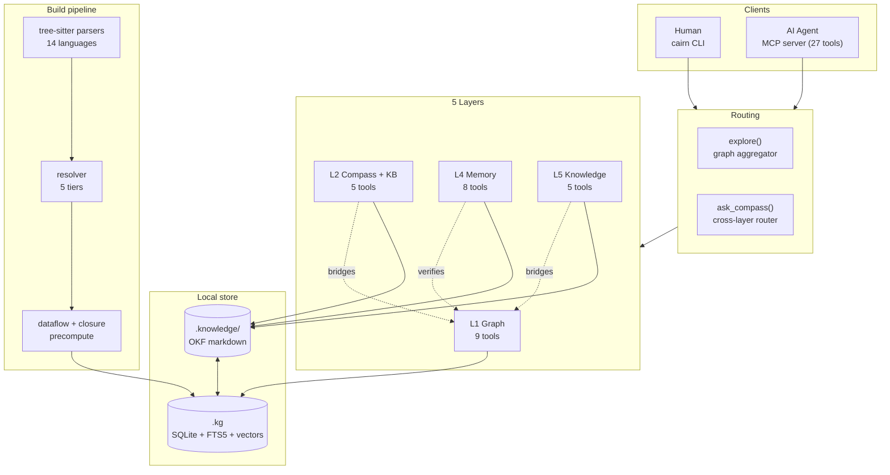

The defining property: **every output is verifiable.** Edges carry resolution
labels (`exact`/`ambiguous`/`unresolved`); LLM-synthesized docs are
fact-checked by a deterministic critic against the graph. See the
[Resolution model](architecture.md#resolution-model) for the deep dive.

---

## 2. The four tool layers

| Layer | Tools | Purpose | Backed by |
|-------|-------|---------|-----------|
| **L1 Graph** | 9 | The structural core: definitions, callers/callees, blast radius, semantic search, the `explore` aggregator, cross-repo deps, graph viz | `.kg` SQLite |
| **L2 Compass + KB + Router** | 5 | Module navigation guides (`get_compass`), KB search (`search_knowledge`), the cross-layer router (`ask_compass`), flow tracing/generation (`trace_flow`, `generate_flow`) | `.knowledge/` + `.kg` |
| **L4 Memory** | 8 | Tribal memory across tiers: record / recall / digest / promote / demote / evolve / decay / delete | `.knowledge/` + `.kg` (refs) |
| **L5 Knowledge** | 5 | Business docs + procedural workflows: add / search / delete / status / trace_workflow | `.knowledge/` |

> There is no separate "L3". The router (`ask_compass`) lives in the L2 group
> but acts as the cross-layer orchestrator; `explore` lives in L1 but acts as
> the graph aggregator. Together they're the two "front doors" for queries.

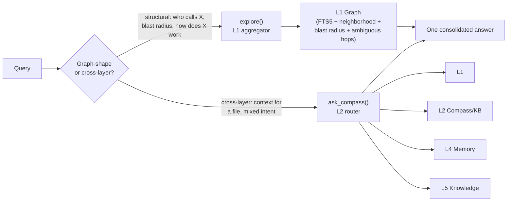

---

## 3. How the layers interact

The layers are **decoupled by storage**, not by network. L1 is the only layer
that owns source of truth (the graph); L2/L4/L5 are markdown on top of it, and
they *reach into* L1 for verification and bridging. There are exactly three
cross-layer interactions:

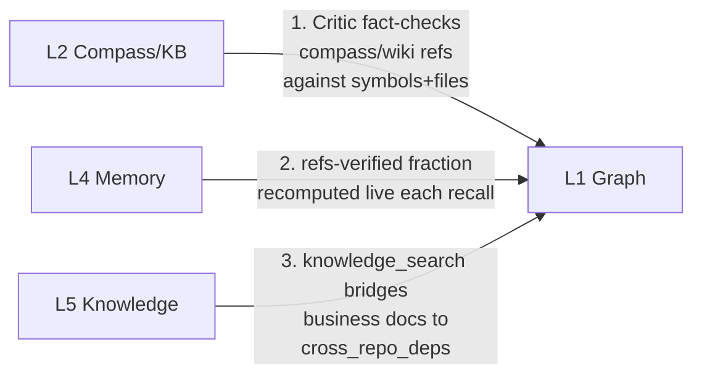

1. **L2 → L1 (critic gate).** When a compass or wiki concept is generated, the
   deterministic critic verifies every backtick-quoted file/symbol reference
   against the graph. A hallucinated symbol can't land in a doc.
2. **L4 → L1 (live verification).** `recall_memory` and `memory_digest`
   recompute the fraction of a memory's references that still exist in the
   graph *right now* — a low value flags a memory citing renamed/removed code.
3. **L5 → L1 (graph bridge).** `knowledge_search` appends `cross_repo_deps`
   results to business documents that declare `affects_repos`, linking prose
   specs to the actual dependency graph.

Everything else is one-directional: queries enter via `explore`/`ask_compass`
and read down; writes enter via build (L1) or record/add (L4/L5).

---

## 4. Build flow: source → graph

A `cairn build` is the heaviest operation. It's decomposed into phases, each
emitting a progress event, and ends with precomputed derived indexes.

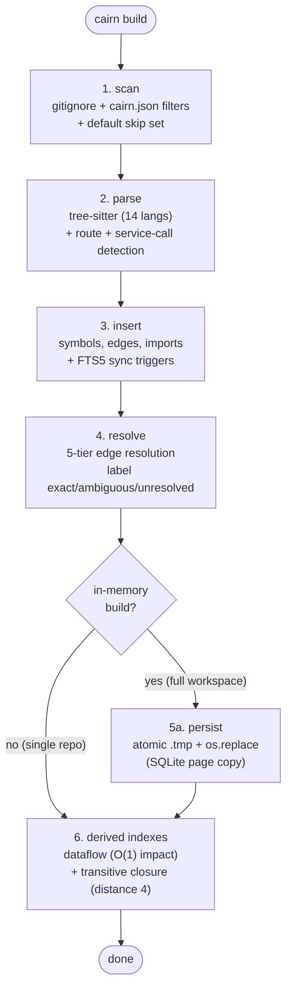

### Build sequence (per workspace)

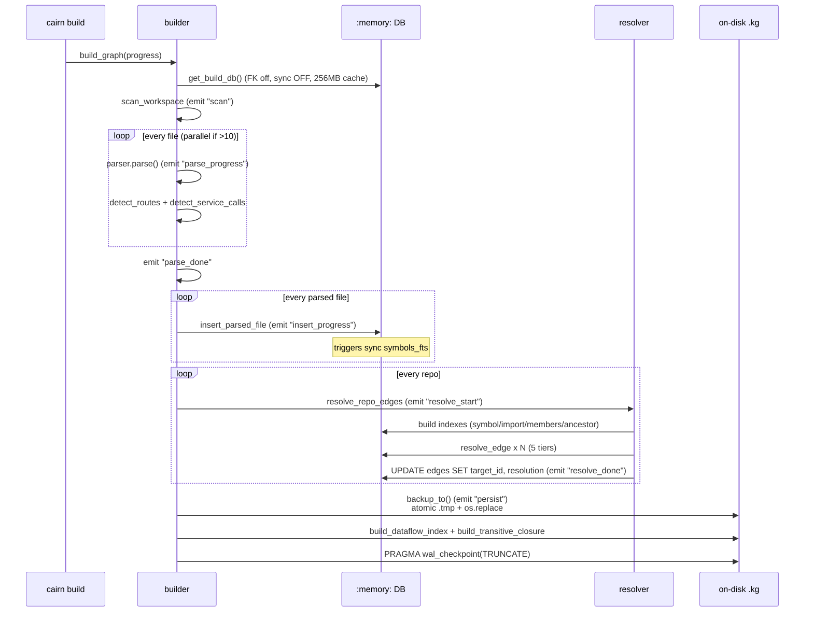

**Key points:**

- The full-workspace build runs in `:memory:` and is swapped to disk atomically
  — readers never see a partial graph. Single-repo rebuilds stay on disk.
- The **resolver** runs 5 tiers in order (type-aware → same-file → import-aware
  → same-repo → global) and stops at the first tier with a unique match;
  multiple matches in a tier → `ambiguous` (no fallthrough).
- `cairn update` (incremental, from git diff) **rebuilds the derived indexes**
  (dataflow + transitive closure) whenever any file actually changed. So
  `explore` and `impact_analysis` see fresh O(1) precomputed paths after an
  update, not just the live BFS fallback. (If nothing changed, no rebuild is
  performed — same as `cairn build` on a no-op tree.)

---

## 5. Query flow: agent → answer

Two front doors, both read-only over the graph.

### `explore(query)` — the one-call graph answer

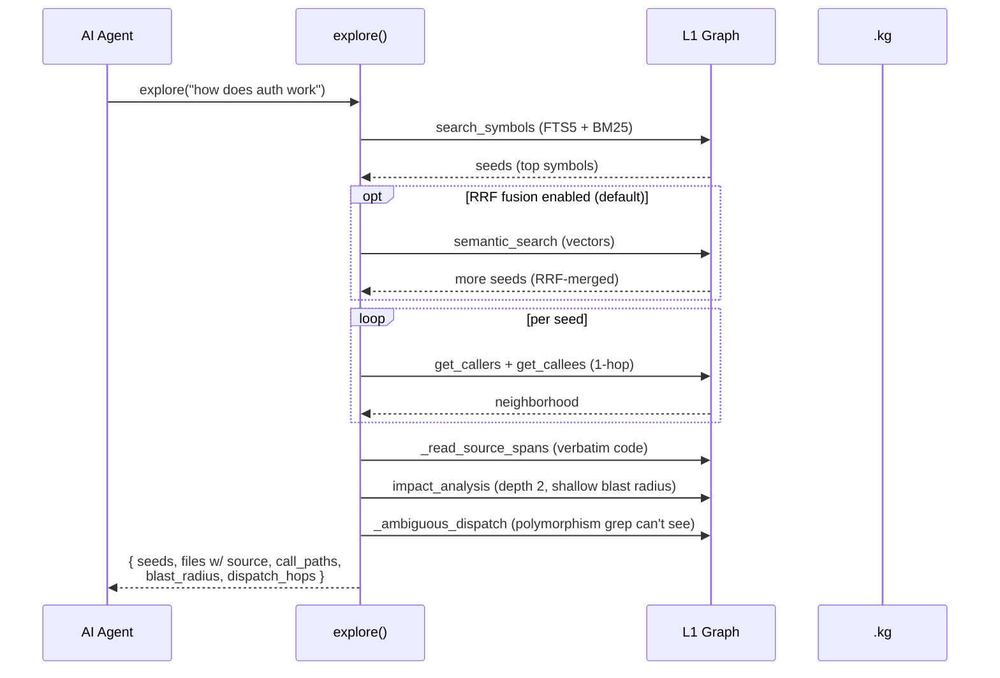

`explore` is pure L1. It returns matching symbols' verbatim source, the call
paths between them, a shallow blast radius, and the ambiguous-dispatch hops —
polymorphism a grep fundamentally cannot surface — in a single round trip.

### `ask_compass(query)` — the cross-layer router

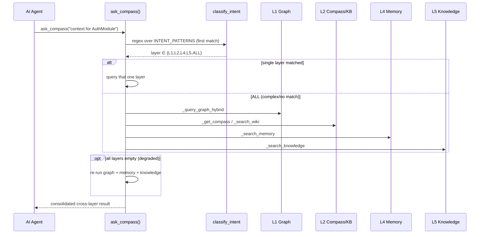

`ask_compass` classifies intent via ordered regex patterns and dispatches to one
or all layers. With a `file_path` and no query, it loads compass + wiki + memory
context directly for that file.

---

## 6. The LLM boundary & critic loop

cairn **never calls an LLM itself.** Where LLM-quality synthesis helps
(compass/wiki generation), it uses a decoupled task queue, and a deterministic
critic fact-checks every result against the graph before commit.

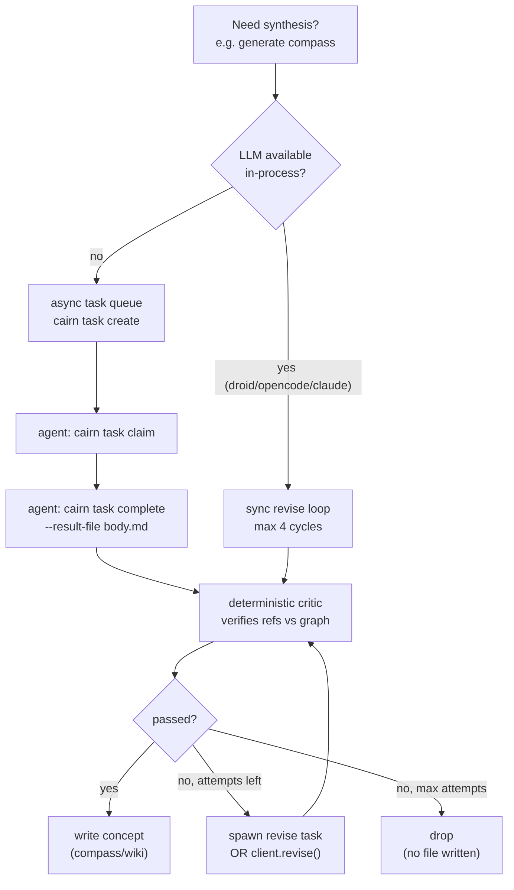

### Two critic loops, one gate

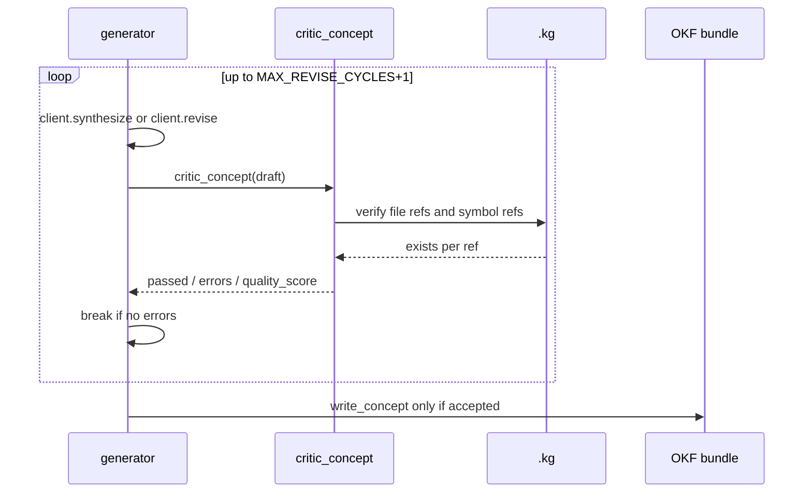

The async task queue (`complete_task`) follows the same gate: on critic failure
with attempts remaining, it spawns a `-revise` task carrying the errors; on
exhaustion, it drops. The **deterministic critic** is the shared checkpoint —
an agent may hallucinate, but a hallucinated symbol can never land in a
compass/wiki doc because the critic only allows graph-verified references.

---

## 7. Memory lifecycle

Memory is a four-tier system with promotion, decay, and live verification.

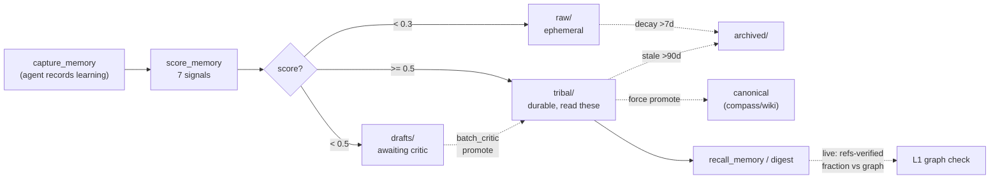

The **7 scoring signals** (weighted): `0.25*graph_verification +
0.20*cross_session_refs + 0.15*agent_confidence + 0.20*critic_score +
0.05*freshness + 0.05*reinforcement + 0.10*authority`. A memory decays over
type-dependent windows (`decision`: 90d; `pattern`/`mistake`/`workaround`:
270d) unless human-authored.

The standout feature: `recall_memory` and `memory_digest` recompute the
**refs-verified fraction live** — the fraction of a memory's backtick-quoted
file/symbol references that still exist in the graph *right now*. A memory
citing renamed code self-invalidates.

---

## 8. Storage layout

Two stores side by side, both local, both readable.

### SQLite (`.kg`)

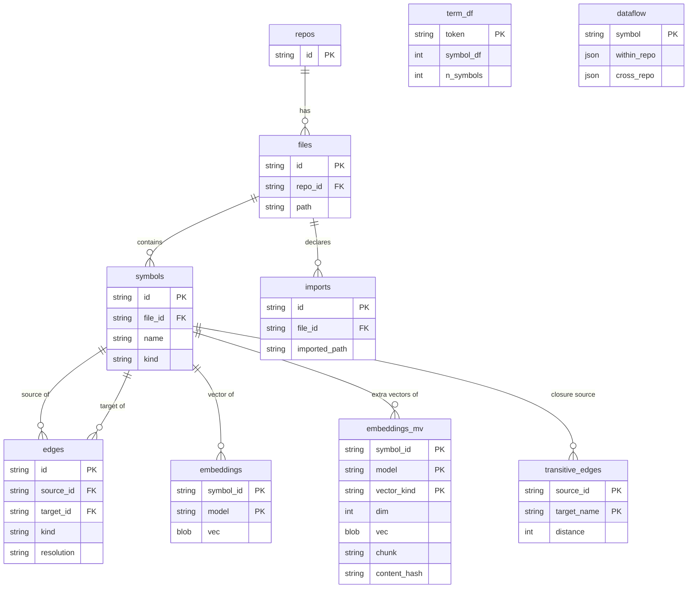

- **WAL journaling**, 256MB mmap, 5s busy_timeout. Read-only opens use
  `file:...?mode=ro` (the SSE daemon's safe shared-instance mode).
- **FTS5** external-content table over `symbols` (name, qualified_name,
  docstring), synced by triggers, powers BM25-ranked lexical search.
- **Derived tables**: `dataflow` (O(1) blast radius for public symbols),
  `transitive_edges` (closure matrix, materialised to distance 4) — built by `cairn build`
  and rebuilt by `cairn update` whenever any file changed.
- **Vector search artifacts**: per-model sqlite-vec `vec0` ANN tables —
  `vec_<model>` over `embeddings` (populated by every `cairn embed`) and
  `vecmv_<model>` over `embeddings_mv` (the opt-in multi-vector table, written
  only by `cairn embed --multivector` and empty on default builds; multi-vector
  queries merge by max score per symbol) — plus `term_df`, the persisted
  document-frequency table refreshed by the same `cairn embed` pass, powering
  IDF-aware query enrichment.

### OKF markdown bundle (`.knowledge/`)

```
.knowledge/
├── compass/            # module navigation guides (Compass concepts)
├── wiki/               # architectural articles
├── knowledge/          # business docs + workflows (L5)
├── memory/
│   ├── raw/            # ephemeral captures (expire >7d)
│   ├── drafts/         # awaiting critic review
│   ├── tribal/         # promoted, durable — read these
│   └── archived/       # decayed/demoted sink
├── _tasks/             # LLM task queue + results + claim markers
├── index.md            # auto-generated per-dir index
└── log.md              # append-only audit log
```

Every concept is a markdown file with YAML frontmatter (OKF v0.2). The
`generated.by` field records the last producer; `memory_signals` caches the
7-signal score; `memory_tier` tracks the lifecycle stage.

---

## See also

- [architecture.md](architecture.md) — per-layer deep dive, resolution model, LLM boundary.
- [mcp-tools.md](mcp-tools.md) — all 27 MCP tools with argument schemas.
- [benchmarks.md](benchmarks.md) — how to measure retrieval quality and performance.
- [architecture.html](../architecture.html) — interactive HTML version of these diagrams.
