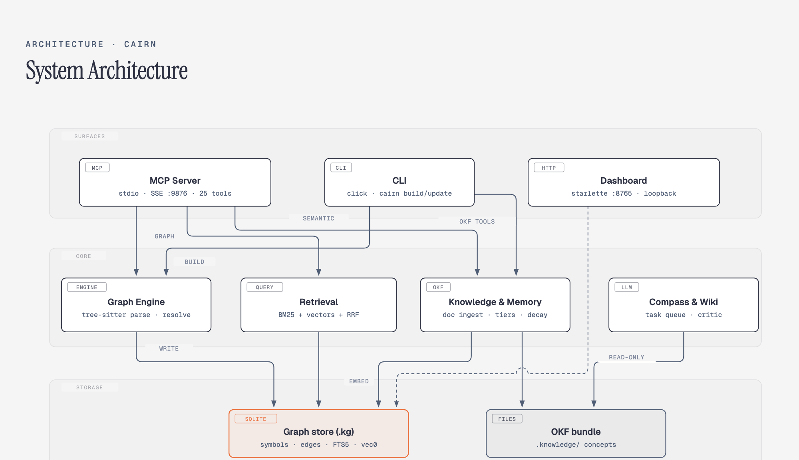

# Architecture

Read this when you need the system shape: what the pieces are, where state
lives, and which module owns which job.

<picture>
  <source media="(prefers-color-scheme: dark)" srcset="diagrams/system-architecture-dark.png">
  
</picture>

Open [diagrams/system-architecture.html](diagrams/system-architecture.html)
for the full-size version.

## What cairn is

Cairn (`cairn-intel` on PyPI) is a local codebase-intelligence system for AI
coding agents. It parses a workspace into a SQLite symbol/call graph, layers
hybrid semantic retrieval on top, and keeps durable knowledge (documents,
memories, compass/wiki guides) in an Open Knowledge Format (OKF) bundle.
Everything is local; no LLM is called in-process — LLM-quality synthesis runs
through a decoupled task queue.

## The three tiers

### Surfaces — how agents and humans reach cairn

| Surface | Module | Facts |
|---|---|---|
| MCP server | `src/cairn/mcp_server/` | FastMCP; stdio per-client spawn (default) or SSE daemon on `:9876`; exactly 22 tools (verified at boot); `cairn://status` resource |
| CLI | `src/cairn/cli/` | Click; entry point `cairn` → `cairn.cli:main`; see [cli-reference.md](cli-reference.md) |
| Dashboard | `src/cairn/dashboard/app.py` | Starlette + Jinja2 + uvicorn; loopback-only `127.0.0.1:8765`; views use read-only SQLite connections, the Settings page persists to `~/.cairn/config.json` |

### Core engines

| Engine | Modules | Job |
|---|---|---|
| Graph engine | `src/cairn/graph/` (`builder.py`, `scanner.py`, `resolver.py`, `schema.py`, `incremental.py`, `dataflow.py`) | scan → parse → resolve → persist the symbol/call graph; see [indexing.md](indexing.md) |
| Retrieval | `src/cairn/retrieval/`, `src/cairn/graph/` (`semantic.py`, `lexical.py`, `fusion.py`, `reranker.py`, `prf.py`, `query_enrich.py`, `embed_ladder.py`) | always-on 3-stage hybrid (vectors + BM25 + RRF) with a gated rerank 4th stage; `embed_ladder.py` adds the parity-verified embedding-server fallback ladder; see [retrieval.md](retrieval.md) |
| Knowledge & memory | `src/cairn/knowledge/`, `src/cairn/memory/`, `src/cairn/okf/` | OKF document store, staged doc ingestion, tiered agent memory; see [knowledge-and-memory.md](knowledge-and-memory.md) |
| Compass & wiki | `src/cairn/compass/`, `src/cairn/wiki/`, `src/cairn/llm/tasks.py` | navigation guides and architecture summaries; LLM work runs via the task queue, fact-checked by a deterministic critic |

### Storage — where state lives

```
~/.cairn/                        (CAIRN_HOME overrides)
  workspaces.json                workspace abs path → store key registry
  lib/                           shared heavy deps (torch etc.), per-ABI dirs
  <sha256(path)[:16]>/           one store per workspace
    .kg                          SQLite: graph + FTS5 + embeddings + telemetry
    .knowledge/                  OKF bundle: concepts as frontmatter markdown
```

Path resolution (`src/cairn/paths.py:resolve_store`) priority:
`CAIRN_DB` / `CAIRN_KNOWLEDGE` overrides → workspace registry → cwd
auto-register. CLI flags `--db` / `--workspace` win over env in-process.

## Module map (`src/cairn/`)

| Subpackage | Purpose |
|---|---|
| `agent_install/` | wires cairn into AI clients (MCP config, skills, commands, subagents, hooks) |
| `agent_integration/` | template assets shipped as package data (SKILL.md, references, commands) |
| `bench/` | performance/scalability benchmark suites (stdlib-only) |
| `cli/` | all `cairn` commands (Click) |
| `compass/` | module navigation guides (deterministic or LLM-assisted via task queue) |
| `dashboard/` | read-only local web dashboard |
| `graph/` | layer-1 code graph: build, query, resolve, embeddings, ANN |
| `hooks/` | git hooks and lifecycle hooks |
| `knowledge/` | document knowledge: staged ingestion (`knowledge/ingest/`) + semantic retrieval |
| `llm/` | agent-decoupled LLM task queue |
| `mcp_server/` | the 28-tool MCP surface |
| `memory/` | tiered agent memory (raw → drafts → tribal → archived) |
| `okf/` | Open Knowledge Format concept model and bundle |
| `parsers/` | tree-sitter parsers (14 languages) + SCIP importer |
| `retrieval/` | composable Retriever / Fusion / Reranker stages |
| `telemetry/` | best-effort local telemetry sink + optional OTLP export |
| `viz/` | Mermaid / DOT / JSON graph renderers |
| `wiki/` | the wiki's page-plan pipeline (plan → refine → queue) and the lifecycle module that derives promotion/state/staleness from the two stored kinds (plan manifest + promoted articles) |

Standalone modules: `eval.py`, `paths.py` (store resolution + the `~/.cairn/config.json` layer), `refs.py`.

## Key data model facts

The `.kg` SQLite database (`src/cairn/graph/schema.py`) holds:

- **Core graph**: `repos`, `files`, `symbols`, `edges` (with
  `resolution` = `exact` / `ambiguous` / `unresolved`), `imports`.
- **Search**: `symbols_fts` (FTS5 over symbols, trigger-synced), `term_df`
  (IDF stats for query enrichment).
- **Vectors**: `embeddings`, `embeddings_mv` (multi-vector), plus
  `knowledge_embeddings`, `memory_embeddings`. ANN lives in `vec0` virtual
  tables (`vec_*`, `vecmv_*`) via the `sqlite-vec` extension, same file.
- **Derived**: `dataflow` (precomputed impact), `transitive_edges` (O(1)
  multi-hop calls).
- **Ops/telemetry**: `build_runs`, `tool_metrics`, `events`, `skipped_files`,
  `parse_errors`, `pending_sync`, `repo_build_state`, `repo_deps`,
  `schema_meta`, `memory_refs`.

## Runtime model

- The MCP server boots with: tool-count verification → parent-death watchdog
  (stdio) → boot catch-up reindex (`ensure_fresh_force`) → memory decay →
  live file watcher (`[watch]` extra).
- One writer at a time: builds take `build_lock` (flock, non-blocking) around
  the write phase; full-workspace builds write to a temp DB and atomically
  swap (`swap_db_file`).
- Telemetry is local and best-effort (buffered sink, 30s flush); OTLP export
  is opt-in via `CAIRN_OTEL_ENDPOINT` and synchronous by design.
