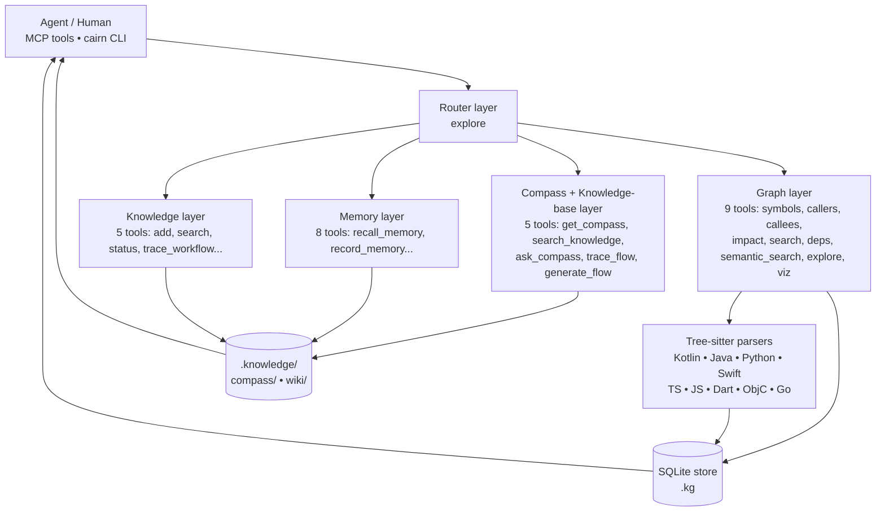
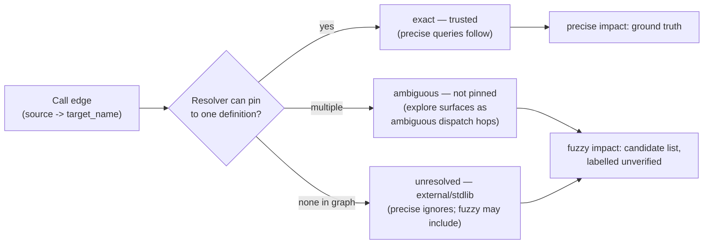

# Architecture

This document describes cairn's design: what it is, how a query flows
through its five layers, how it resolves symbols, where it draws the LLM
boundary, and where data lives on disk.

## What cairn is

cairn is a **local, structural, agent-first** code intelligence system.

- **Local.** Everything runs on your machine. The store is a SQLite database
  plus a markdown tree under `~/.cairn/`. No network calls, no telemetry
  upstream, no remote API. You can read every byte of the output.
- **Structural.** It parses source with tree-sitter into a typed graph of
  symbols and call edges, then answers queries against that graph. "Who calls
  this?" is a graph traversal, not a guess. Parsers exist for nine languages:
  Kotlin, Java, Python, Swift, TypeScript, JavaScript, Dart, Objective-C, Go.
- **Agent-first.** The primary interface is an MCP server exposing 27 tools to
  AI agents. The CLI (`cairn`) mirrors the same capability for humans and as a
  fallback. The tool surfaces are designed for an agent to call repeatedly and
  cheaply, not for one-shot human typing.
- **No LLM in the loop by design.** cairn never calls an LLM itself. Where
  synthesis quality would help (compass/wiki generation), it hands work off via
  a task queue, and a deterministic critic verifies every result before it is
  committed. Outputs are verifiable, not probabilistic.

## Layers and query flow

cairn is organized into five layers. The router (`explore`) is the front
door: it fans a query across the graph layer and returns one consolidated
answer. The other layers answer specific question types.



A query flows: **CLI/MCP → router → graph/knowledge/memory layers →
tree-sitter parsers + SQLite store + .knowledge markdown → response.** The
router aggregates; the layer tools drill down.

### Layer 1 — Graph (9 tools)

The structural core. Tree-sitter parses source into symbols (classes,
functions, methods) and the call edges between them, with a resolver that
tries to pin each edge to exactly one definition. Tools: `find_definition`,
`search_symbols`, `get_callers`, `get_callees`, `impact_analysis`,
`cross_repo_deps`, `semantic_search`, plus the aggregator `explore` and a
blast-radius helper. Every "who depends on X" answer comes from this layer.
Edge resolution is labelled `exact`, `ambiguous`, or `unresolved` (see
[Resolution model](#resolution-model)).

#### Edge-kind taxonomy

Every edge carries a free-text `kind` (indexed). The kinds fall into two
groups that the traversal layer treats differently:

- **Structural** (followed by `impact_analysis` / `trace_flow` by default):
  `calls`, `extends`, `implements`. These represent in-codebase relationships.
- **Service/topology** (excluded by default; opt in via
  `include_service_edges=True`): `http_call` (a call to an HTTP client —
  `fetch`, `axios`, `http.Get`, OkHttp/Retrofit), `service_call` (a call from a
  route handler to another service). Their targets are often external (a URL or
  another service), so including them in blast radius would inflate impact —
  contradicting the precise-by-default identity.

`get_callers` / `get_callees` accept an optional `kind=` filter to query any
single kind (e.g. `get_callees(name, fuzzy=True, kind='http_call')`). Service
edges are produced by the post-parse pass in `parsers/service_calls.py`.

### Layer 2 — Compass + Knowledge base (5 tools)

`ask_compass` / `get_compass` return a **25–35 line navigation guide** per
module: the entry points, the important symbols, and where to start reading.
It is the "give me the lay of the land before I open this file" tool. `get_compass`
loads an existing guide; `ask_compass` routes a question across compass, wiki,
and memory to assemble context. The layer also holds `search_knowledge` (the
bundle-level OKF search), `trace_flow`, and `generate_flow` (read-only vs
write-only flow tracing from a call-graph entry point). Wiki — architecture and
feature documentation at a level above symbols — lives here too, exposed through
`search_knowledge` with `type_filter="Wiki"`. When coverage is thin these may
return a skeleton — drill into the layer tools rather than treating that as "no
info exists."

### Layer 4 — Memory (8 tools)

Tribal knowledge: decisions, patterns, mistakes, workarounds. `recall_memory`
retrieves by symbol name or title tokens; `record_memory` captures a learning
with a confidence score (0.0–1.0). Memories are **scored, decayed, and promoted
over time**: high-confidence, repeatedly-recalled memories graduate from
`memory/tribal/` into canonical compass or wiki entries; ephemeral captures in
`memory/raw/` expire and are archived. This is the layer that turns "we learned
this the hard way" into durable, retrievable context.

### Layer 5 — Knowledge (5 tools)

The OKF (Open Knowledge Format) markdown KB that compass, wiki, and memory all
live in. `search_knowledge` queries across it with optional type filtering;
`cairn knowledge add/embed/impact/status/export` manage the corpus and its
embeddings. This layer is both a store and the embedding surface that powers
semantic search over docs.

## Resolution model

This is the single most important concept for using the graph layer correctly.
For a concrete worked example, see [examples/resolution-walkthrough.md](examples/resolution-walkthrough.md).

Every call edge carries a `resolution` label assigned by the resolver:

- **`exact`** — the resolver pinned this edge to exactly one definition. Trusted.
- **`ambiguous`** — multiple candidate definitions existed; the resolver
  declined to guess. The edge exists but its target is not pinned down.
- **`unresolved`** — external or stdlib; no definition in the indexed graph.

The graph tools (`get_callers`, `get_callees`, `impact_analysis`) expose this
through two query modes:

- **Precise mode (default).** Follows only `exact` edges. This is **ground truth
  for blast radius and refactoring** — it is never inflated by name collisions.
  An empty precise result means "no *resolvable* callers," **not** "unused."
  Before concluding a symbol is dead, retry with fuzzy.
- **Fuzzy mode (`fuzzy=True` / `--fuzzy`).** Adds name-only matches — every site
  that calls something with this name, resolved or not. This is a **candidate
  list, not truth**: a fuzzy result for a common name like `invoke` can span
  hundreds of sites across repos and languages that merely share the name.
  Verify each hit against the actual source.

**When to use which:**

- **Precise**: impact analysis, refactoring, signature changes, "what breaks if
  I touch this?" You want no false positives.
- **Fuzzy**: auditing, dead-code hunting, exploring unfamiliar code. You accept
  noise to avoid false negatives.



> **Empty precise ≠ unused.** A precise empty result means "no resolvable
> callers," not "dead code." Retry with `--fuzzy` before deleting.

`explore` shows both: precise neighborhood hops plus a separate section for
`ambiguous` dispatch edges, so you see the polymorphism it deliberately did not
guess through.

## The LLM boundary

cairn **never calls an LLM directly.** This is a deliberate design choice,
not a missing feature.

Where an LLM would raise quality — generating compass guides, drafting wiki
docs, composing memory entries — cairn instead **queues the work** on a
file-based task queue and lets an external agent do the synthesis:

```bash
cairn task list --status pending   # see queued work
cairn task show <id>               # inspect a task
cairn task claim <id>              # take ownership
cairn task complete <id> --result-file <path>   # submit a result
```

Every submitted result runs through a **deterministic critic** that fact-checks
it against the graph: only files and symbols that actually exist in the index
are allowed into the final document. An agent may hallucinate; the critic will
not let a hallucinated symbol into compass or wiki.

The motivation is **verifiability**. A graph query returns an answer you can
trace to source. A compass guide cites symbols the critic confirmed exist. If
you distrust an output, you can re-derive it from the graph alone. Putting an
LLM inside the query path would make every answer probabilistic and
uncheckable — so the LLM stays outside it, on a queue, with a critic gate.

The task backend is selected by `CAIRN_LLM_BACKEND` (default `file-queue`).

## Storage

Two things live on disk, side by side under one store directory:

1. **The SQLite graph DB** (`<store>/.kg`). Symbols, call edges with resolution
   labels, embeddings (and a `vec0` ANN table when the `sqlite-vec` backend is
   active), FTS5 indexes for symbol search, cross-repo dependency maps. This is
   the structural ground truth, written by the parser/builder, read by every
   graph tool.

2. **The `.knowledge/` markdown bundle** (`<store>/.knowledge/`). OKF markdown,
   human- and agent-readable:

   ```
   .knowledge/
   ├── compass/          # 25-35 line module navigation guides
   ├── wiki/             # architecture / feature documentation
   └── memory/
       ├── tribal/       # promoted decisions, patterns, mistakes (read these)
       ├── raw/          # ephemeral captures (do NOT read — expire automatically)
       └── drafts/       # awaiting critic review (do NOT read)
   ```

   You can read `compass/`, `wiki/`, and `memory/tribal/` directly when the MCP
   server is unavailable. `memory/raw/` and `memory/drafts/` are ephemeral and
   should not be read — they are staging areas the decay and critic processes
   manage.

The store root resolves to `~/.cairn/<workspace-key>/` by default, where
`<key>` is a hash of the workspace root. One workspace maps to one store; `cairn`
finds the right store by walking up from cwd (like git), with `CAIRN_WORKSPACE`
as an explicit override. See [configuration.md](configuration.md) for the full
set of path variables and `cairn config --list` to print the resolved locations.
