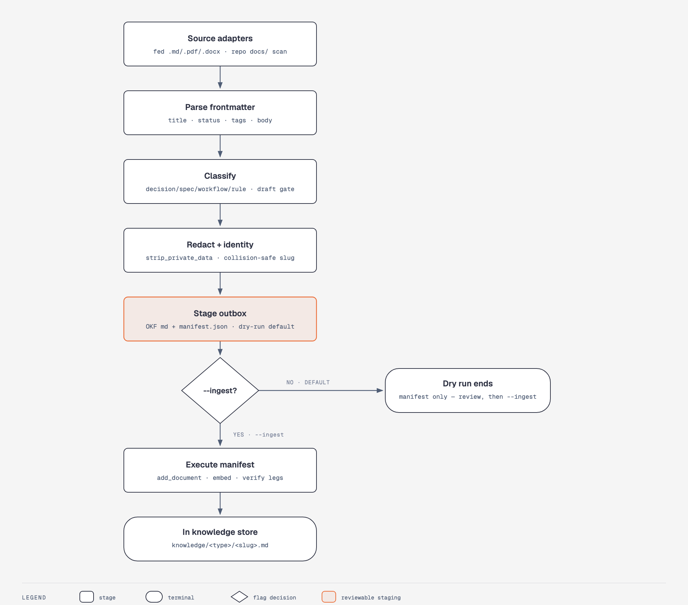

# Knowledge & Memory

Read this when you're ingesting documents, working with the OKF bundle,
recording/recalling memories, or driving the LLM task queue.

## The OKF bundle (`.knowledge/`)

Everything cairn remembers durable is an **OKF concept**: a markdown file
with YAML frontmatter (`type`, `title`, `description`, `tags`, `status`,
`concept_id`, …) managed by `src/cairn/okf/bundle.py` (`OKFBundle`) with
`fcntl.flock` cross-process locking. Concept files live under the workspace
store's `.knowledge/` directory; the same model backs knowledge docs, memory
tiers, compass guides, wiki entries, and task-queue items.

## Doc ingestion (`cairn knowledge ingest`)

<picture>
  <source media="(prefers-color-scheme: dark)" srcset="diagrams/doc-ingestion-pipeline-dark.png">
  
</picture>

Open [diagrams/doc-ingestion-pipeline.html](diagrams/doc-ingestion-pipeline.html)
for the full-size version. Pipeline: `src/cairn/knowledge/ingest/__init__.py:run_ingest`.

1. **Source adapters** (`adapters.py`) — `FedMarkdownAdapter` (explicit
   `.md` files/dirs), `FedBinaryAdapter` (`.pdf` via pymupdf4llm, `.docx`
   via mammoth→markdownify; `cairn[ingest]` extra), `RepoScanAdapter`
   (walks `docs`, `decisions`, `adr`, `adrs`). 10 MB per-file cap; a
   skip-list drops drafts/meetings/templates/changelogs.
2. **Parse** (`parser.py`) — YAML frontmatter → `title/status/tags/
   description`; graceful fallbacks to minimal frontmatter, inline status
   markers, first heading.
3. **Classify** (`classifier.py`) — `decision` / `spec` / `workflow` /
   `business-rule` (spec is the default). Layers: workspace title rules →
   built-in keyword rules → filename/directory conventions. Draft statuses
   (`draft`, `proposed`, `review`, `superseded`, `deprecated`) are blocked
   unless `--include-drafts` re-admits them tagged `draft`.
4. **Redact + identity** — `strip_private_data`
   (`src/cairn/memory/privacy.py`) scrubs private tags, credentials, API
   keys, JWTs from title/description/body. `build_identity`
   (`identity.py`) derives a stable id from `slugify(repo/relpath)` —
   a SHA-1 fragment when the 60-char slug cap bites, and `({repo})`,
   `({repo})-2`, … suffixes keep slugs collision-free.
5. **Stage outbox** (`staging.py`) — writes one OKF markdown file per
   accepted doc plus `manifest.json` (version 1: counts, per-row
   source/identity/type/tags/body/staged-path or skip reason) under
   `<workspace>/.cairn/ingest-outbox/`. **Dry run is the default** —
   nothing touches the knowledge store without `--ingest`.
6. **Execute** (only with `--ingest`, `executor.py`) — writes each accepted
   row via `add_document`, embeds (`embed_knowledge`, batch 32), then runs
   verify legs: store-count equality, OKF conformance, smoke search.

Docs land in `knowledge/<doc_type>/<slug>.md` ("doc families").

## Memory tiers

Memories (`src/cairn/memory/`) are OKF concepts under `.knowledge/memory/`:

| Tier | Directory | Score | Meaning |
|---|---|---|---|
| raw | `memory/raw/` | < 0.3 | ephemeral capture; expires after 7 days |
| drafts | `memory/drafts/` | 0.3–0.5 | awaiting quality review |
| tribal | `memory/tribal/` | ≥ 0.5 | decisions, patterns, mistakes, workarounds |
| archived | `memory/archived/` | — | decayed tribal (> 90 days stale) |

- **Recording** (`record_memory` → `capture_memory`): both title and body are
  redacted; a same-type near-duplicate (exact title or cosine ≥ 0.85) is
  superseded automatically (`memory_is_latest: false`, chained via
  `memory_superseded_by`).
- **Scoring** (`scoring.py`), 0–1:
  `0.25·graph_verification + 0.20·cross_session_refs + 0.15·agent_confidence
  + 0.20·critic_score + 0.05·freshness + 0.05·reinforcement + 0.10·authority`.
  `graph_verification` is the fraction of backtick-quoted file/symbol refs
  still present in the graph — memories rot when code changes.
- **Recall** (`recall_memory` → `search_memory`): hybrid — lexical match plus
  brute-force cosine over `memory_embeddings` (small corpus, no vec0), fused
  with RRF. Recall is symbol/title-keyed, not natural-language full text.
- **Lifecycle**: `memory decay` runs at MCP boot and after `cairn update`;
  `memory promote` moves decisions/patterns → compass, architecture → wiki;
  `evolve` creates a new version and supersedes the old.

## Compass, wiki, and the LLM task queue

Cairn never calls an LLM in-process. Synthesis work is queued as task
concepts (`src/cairn/llm/tasks.py`) in `.knowledge/_tasks/`:

- Kinds: `compass-synthesize`, `compass-revise`, `flow-synthesize`,
  `flow-revise`, `wiki`, `wiki-page`, `wiki-page-revise`, `wiki-page-enrich`,
  `wiki-page-enrich-revise`, `wiki-catalog`, `wiki-catalog-revise`,
  `memory-critic`, `memory-extract`.
- Lifecycle: `pending` → `in-progress` (atomic `O_EXCL` claim, 1h stale
  recovery) → `done` → promoted / revised (≤ 3 cycles) / dropped.
- Drive it with `cairn task list|show|claim|complete --result-file <path>`;
  `list` filters by `--status`, `--kind`, or `--kind-prefix` (e.g.
  `--kind-prefix wiki-page` lists every hop of the wiki chains), and
  `cairn task drop <id>` abandons a pending or in-progress task — terminal:
  done tasks are refused and a dropped task is never claimable again.
- The **deterministic critic** (`src/cairn/compass/critic.py`) fact-checks
  every result: backtick file paths must exist in the graph, symbol refs
  must resolve, prose-heavy low-ref bodies get warned. It is not a
  hallucination detector — only graph-verified references pass.

**The wiki: the agent-facing knowledge surface.** The wiki is the
workspace's documentation for agents — covering code or documents —
searchable via `search_knowledge` / `ask_compass` and explorable in the
dashboard's wiki views. It stores exactly two kinds with disjoint jobs,
and nothing else:

- **The plan** (`.knowledge/_wiki/manifest.json`) records pipeline *intent*:
  which pages should exist (identity, title/description, module, seeds,
  input hash) and where their queue work stands (task id, queue attempts).
  The plan never describes content — no bodies, no provenance, no lifecycle
  verdicts.
- **Content** (promoted `Wiki-Article` concepts under
  `wiki/pages/{repo}/{page_id}`) is the only record of what *exists*: the
  body, verified sources in frontmatter, and provenance (the workspace HEAD
  sha and writing task id) in its extensions.

Everything else is derived at read time by `cairn.wiki.lifecycle` from
plan, content, and the task chain — promotion, lifecycle state, staleness
are never stored, so the two kinds cannot vouch for each other. The
dashboard and CLI read models expose the derived lifecycle only
(`planned/queued/in-progress/promoted/failed/dropped`); staleness compares
the content's recorded sha with the repo's current HEAD (`fresh`/`stale`),
and a page with no content is always `unknown` — plan data is never
consulted for what exists.

**Generation** (`cairn wiki generate --llm`) rides the same queue. Generate
plans a deterministic page outline from the graph — modules whose indexed
files are a strict majority of test files
(`test`/`tests`/`spec`/`specs` path segments) are excluded from the plan
entirely, so page budgets are spent on product code — and queues one
`wiki-page` task per page, keyed by the qualified `{repo}/{page_id}`
resource; with `--refine-catalog` a `wiki-catalog` task refines the outline
first (re-run generate to queue page tasks from the validated result; an
invalid refined entry falls back to its module's deterministic record, and
a refinement can reorder and reseed but never silently drop a planned
page). Re-runs skip pages whose input hash is unchanged and whose content
is promoted (`--force` re-queues everything), adopt a live task whose work
order already matches instead of duplicating it, and never let an in-flight
enrichment block generation. For wiki kinds the critic scores the
`## Sources` footer instead of compass sections — reporting each unresolved
path once no matter how many citation forms mention it — and a passing page
is promoted to the `Wiki-Article` concept with its verified sources in
frontmatter and the HEAD sha (resolved at completion) in its extensions.

**Consuming and extending promoted pages**: `cairn wiki status` and the
dashboard wiki views render the derived lifecycle and staleness.
`cairn wiki export --dir DIR [--force]` writes every promoted page as
`DIR/{repo}/{page_id}.md` with its frontmatter preserved. `cairn wiki
enrich [<page-id>|--all]` queues `wiki-page-enrich` tasks carrying page
identity only; the completion reads the promoted page, appends the new
sections (the prior text stays), merges the new `## Sources` entries into
the frontmatter, and refreshes the provenance sha — riding the same bounded
revise cycle. The `## Sources` footer requirement serves any task kind
whose name starts with `wiki-page`, so revise hops of any depth keep it.

Compass files are 5-section module guides (`src/cairn/compass/generator.py`);
the deterministic generator (`src/cairn/wiki/generator.py`) produces
`Architecture-Report` diagnostics under `reports/architecture/{repo}` —
useful summaries, but outside the wiki layer since they never pass the
critic gate. Both work without any LLM; the queue only upgrades prose
quality.
