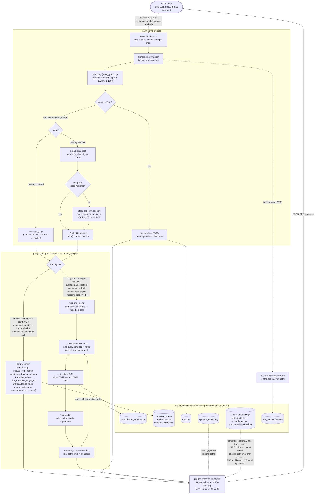

# Query Flow

← [Docs index](README.md)

How one query travels from an MCP client through the server, the connection
layer, and the graph query layer to storage — as of the closure-index /
pooled-connection changes (performance-gap phase, Milestone 1).
Read it when debugging server-path latency or correctness, or when changing
the dispatch, connection, impact, or render stages.

## Contents

| Section | What it covers |
|---------|----------------|
| [`## Stage by stage`](#stage-by-stage) | The numbered walk of the diagram: dispatch, the cached path, connection pooling, the routing fork, and render. |
| [`## Sibling query paths (same skeleton, different engines)`](#sibling-query-paths-same-skeleton-different-engines) | How `find_definition`, `search_symbols`, `semantic_search`, and `explore` ride the same skeleton with different engines. |
| [`## Storage map`](#storage-map) | Which tables live in the per-workspace SQLite file and what each serves. |

The pipeline is diagrammed below (GitHub renders fenced mermaid natively).

## Stage by stage

### 1. Dispatch and instrumentation

The client (an agent's stdio subprocess, or a browser/daemon against the SSE
transport) sends a JSON-RPC tool call. `mcp_server/_server_core.py` holds the
single FastMCP instance (`mcp`); every tool in `tools_*.py` decorates onto it.
Tool bodies are synchronous functions offloaded to worker threads by the MCP
SDK. Each call is wrapped by `metric_buffering.instrument` (timing + error
capture), which buffers into a 2000-entry deque that a 30-second flusher
thread drains into `tool_metrics` — SQLite writes stay off the tool-call hot
path, and are skipped entirely on read-only servers. LLM-supplied parameters
are clamped at the boundary (`_clamp`): depth to [1,10], limit to [1,1000].

### 2. The cached path (optional)

`impact_analysis(cached=True)` reads the precomputed `dataflow` table
(`dataflow.get_dataflow`) — an O(1) lookup populated per public symbol during
`cairn build`/`cairn update` — and renders prose. Live analysis (the default)
falls through to the connection layer.

### 3. Connection: pooled per (thread, db path)

`_server_core._conn()` resolves the store (`CAIRN_DB` / `CAIRN_WORKSPACE` →
`paths.resolve_store`, one `.kg` per workspace). Unless
`CAIRN_CONN_POOL=0` is set, it returns a `_PooledConnection` over a
thread-local cached connection:

- **Thread-local** — SQLite connections are thread-affine by default; each
  tool call runs on one thread, so no cross-thread sharing and no
  `check_same_thread=False` is ever needed.
- **Inode check** — every call stats the db path; if `(st_dev, st_ino)`
  changed (a full build's `swap_db_file` replaces the file with
  `os.replace`), the old connection is closed and a fresh one opened — a
  pooled connection must never keep reading a dead inode.
- **Release, not close** — the wrapper's `close()` is a no-op, so tool
  bodies' existing `finally: conn.close()` blocks are unchanged.
- `_rw_conn()` (write tools) stays per-call by design; read-only servers
  (`CAIRN_READ_ONLY`) open `mode=ro` connections that can never contend with
  the CLI writer.

### 4. The routing fork: index mode vs DFS

`traversal.impact_analysis` serves from the precomputed closure when all of
these hold:

- precise (`fuzzy=False`) and structural-only (`include_service_edges=False`),
- `max_depth + 1 <= CLOSURE_MAX_DEPTH` (closure is materialised to distance 4,
  so depth ≤ 3 queries are servable; note the MCP tool's **default depth is
  5**, which takes the DFS path — `explore`'s blast radius at depth 2 is the
  main automatic index consumer),
- the name has exact-name symbol matches (`find_definition`'s qualified-name
  and substring fallbacks cannot be served from the closure),
- the closure is materialised (`dataflow.closure_available` — false on
  never-built DBs, so the DFS path is the behavior on stale stores), and
- no seed reaches another seed (`dataflow.closure_has_seed_cycle`) — otherwise
  DFS runs so cycle reporting is preserved.

**Index mode** (`dataflow.impact_from_closure`) answers with one indexed
statement over `transitive_edges` (via `idx_transitive_target_id`), joining
symbols and files. Its documented semantics differ from DFS: `depth` is the
**shortest** caller distance (direct caller = 0, matching DFS numbering);
rows are ordered deterministically by (depth, symbol, file); truncation is
exact (fetches limit+1); `cycles` is always empty; and coverage is a superset
of precise DFS (unique-name hops DFS prunes; no per-node 200-caller fetch
cap). `use_index=False` forces the classic DFS (used by the golden parity
tests); `use_index=True` forces the index when servable, past the cycle gate.

**DFS fallback** walks callers recursively: `find_definition` seeds are
marked visited/on-path; `_callers(name)` is a per-call memo so same-named
symbols (methods across classes) cost one query per distinct name, not one
per visited symbol; `get_callers` SQL is filtered to structural edge kinds;
`traverse` detects cycles via the on-path set and caps at `limit` with a
`truncated` flag. DFS depth is the first-visit path length, which is
enumeration-order-dependent for diamond callers — see
`tests/test_traversal_parity.py`'s module docstring for what that means for
pinning behavior.

### 5. Render and return

The result (plus `cross_repo_deps` for the impact tool) renders as prose or a
structured pydantic model (`structured.py`), prefixed by a staleness banner
when `pending_sync` has rows (live watcher installs only), and truncated at
`MAX_RESULT_CHARS` (60k default) to stay under MCP result ceilings.

## Sibling query paths (same skeleton, different engines)

- `find_definition` / `get_callers` / `get_callees` — direct parameterized
  SQL in `graph/traversal.py` (exact name → qualified name → escaped-LIKE
  fallback).
- `search_symbols` — `graph/lexical.py`: FTS5 `MATCH` with `bm25()` ranking
  over the external-content `symbols_fts` table (kept in sync by triggers),
  degrading to a LIKE scan on FTS errors, with a LIKE-union for camelCase
  substrings the unicode61 tokenizer does not split.
- `semantic_search` — `graph/semantic.py`: embed the query → ANN via
  `ann_index.ann_query` (sqlite-vec vec0 KNN) or brute-force cosine (50k-row
  cap) → Reciprocal Rank Fusion with the BM25 list (`fusion.rrf_fuse`, on by
  default) → optional CrossEncoder rerank (`reranker.py`). Flag-off levers
  exist beyond this default path but are eval-harness-only (never default, not
  exposed over MCP): an RM3 PRF second pass over the fused first pass (which
  replaces the rerank stage when on), a multi-vector dual-index
  (`vec_`/`vecmv_`) max-score merge, and IDF-aware query enrichment via
  `term_df`.
- `explore` — `graph/explore.py`, the front door: FTS + semantic seeds →
  1-hop neighborhood → `impact_analysis` at depth 2 (index mode) → one
  consolidated answer.

## Storage map

One SQLite file per workspace (`~/.cairn/<key>/.kg`, WAL, busy_timeout):
`symbols`/`edges`/`imports` (the structural graph), `symbols_fts` (FTS5),
`vec_*` + `embeddings` (sqlite-vec ANN), `vecmv_*` + `embeddings_mv` (the
opt-in multi-vector pair, empty without `cairn embed --multivector`),
`term_df` (persisted document frequencies for IDF-aware enrichment,
refreshed by `cairn embed`), `dataflow` and `transitive_edges`
(the derived indexes — closure is kind-filtered and materialised to distance
4 on every build/update), and the telemetry tables (`events`,
`tool_metrics`, `build_runs`).
