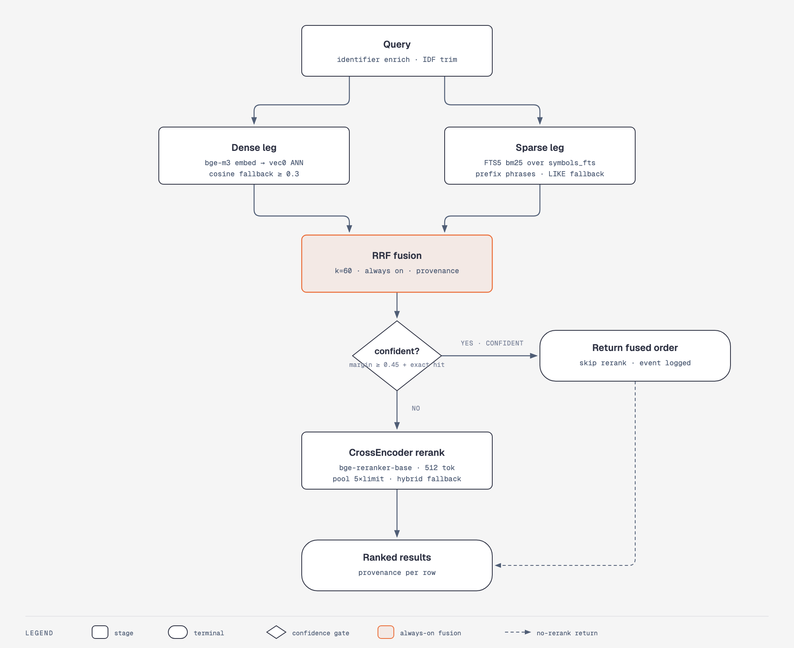

# Retrieval: how a query becomes ranked results

Read this when you're tuning search quality, touching `semantic.py` /
`fusion.py` / `reranker.py`, or deciding whether a result's provenance is
trustworthy.

<picture>
  <source media="(prefers-color-scheme: dark)" srcset="diagrams/retrieval-pipeline-dark.png">
  
</picture>

Open [diagrams/retrieval-pipeline.html](diagrams/retrieval-pipeline.html) for
the full-size version.

## The pipeline

**The 3-stage hybrid (vectors + BM25 + RRF fusion) is always on.** Rerank is
an optional 4th precision bump, not a prerequisite for quality.

1. **Query enrichment** (optional, `RetrievalParams.enrich`) —
   `src/cairn/graph/query_enrich.py`. Pure and deterministic: extracts
   identifier-like tokens (backticks, camelCase, snake_case, dotted refs)
   into a dense tail and a stopword-trimmed sparse query. With
   `enrich_idf`, terms more prevalent than 90% of symbols (from `term_df`)
   are dropped from the sparse leg.

2. **Dense leg** — `embed_query` (bge-m3 default) → `vec0` ANN match
   (`sqlite-vec`) when available, else brute-force cosine scan. Threshold
   filter: cosine ≥ 0.3 default. With a server backend configured, the
   query embedding comes from an external `/v1/embeddings` endpoint
   instead of an in-process model — see
   [Embedding server backends](#embedding-server-backends).

3. **Sparse leg** — FTS5 `bm25()` over `symbols_fts`
   (`src/cairn/graph/lexical.py`). Prefix phrase queries with a LIKE
   substring fallback for camelCase; enriched queries use term-mode
   (OR-of-quoted-prefix) matching. Default fetch: 30 candidates.

4. **RRF fusion** — `src/cairn/graph/fusion.py:rrf_fuse`, k=60, always on
   (`CAIRN_FUSION=0` disables). Provenance per row becomes `fused(bm25+semantic)`,
   `semantic`, or `bm25`.

5. **Confidence gate** (auto mode) — rerank is *skipped* when the fused
   result is already confident: normalized top-margin ≥
   `CAIRN_RERANK_MIN_MARGIN` (0.45) **and** the fused #1 is an exact
   case-insensitive name hit. Disabled under hash embeddings. Skipping
   emits a `RERANK_SKIPPED` telemetry event.

6. **CrossEncoder rerank** — `src/cairn/graph/reranker.py`,
   `bge-reranker-base` default, 512-token pairs, pool `max(limit*5, 50)`.
   Any failure (model missing, predict error) degrades to hybrid order —
   rerank never breaks a query.

7. **PRF** (optional, `prf=True`) — RM3 pseudo-relevance feedback
   (`src/cairn/graph/prf.py`) re-runs the whole pass with an expanded query.
   Replaces rerank rather than stacking on it.

## `RetrievalParams` (frozen dataclass, `semantic.py`)

| Field | Default when unset | Meaning |
|---|---|---|
| `dense_threshold` | 0.3 | cosine cutoff |
| `rrf_k` | 60 | RRF constant |
| `rrf_weights` | equal | (dense, sparse) weights |
| `sparse_limit` | 30 | BM25 fetch size |
| `dense_pool` | 50000 | brute-force scan cap |
| `rerank` | auto | per-call override |
| `enrich` / `enrich_idf` | false | query enrichment |
| `multivector` | false | name+docstring vectors (FR-005) |
| `prf` + `prf_docs/terms/lambda` | false / 10 / 10 / 0.5 | RM3 feedback |

## Knobs (env)

| Env | Default | Effect |
|---|---|---|
| `CAIRN_FUSION` | `1` | `0` disables RRF (scores become raw, not fusion-rank) |
| `CAIRN_RERANK` | off | enables the rerank stage / persistent marker |
| `CAIRN_RERANK_MODEL` | `BAAI/bge-reranker-base` | reranker model |
| `CAIRN_RERANK_MIN_MARGIN` | `0.45` | auto-gate margin |
| `CAIRN_EMBED_BACKEND` | `local` | `local` (sentence-transformers) / `hash` / `openai` / server family (`server`/`omlx`/`ollama`) |
| `CAIRN_EMBED_LOCAL_MODEL` | `BAAI/bge-m3` | embedding model |
| `CAIRN_ANN_BACKEND` | `sqlite-vec` | `off` forces brute-force scan |
| `CAIRN_CHUNK_VARIANT` | `B` | chunk composition for symbol embeddings |

Fusion-on scores are RRF rank numbers (~0.01–0.02), not cosine similarity —
rank order is what's meaningful. Set `CAIRN_FUSION=0` when you need scores
to reflect match strength.

## Embedding server backends

`CAIRN_EMBED_BACKEND=server` / `omlx` / `ollama` moves the dense leg to an
OpenAI-compatible `/v1/embeddings` endpoint (setup and env vars in
[configuration.md](configuration.md)). What changes for retrieval:

- **Producer and stamp.** Query and corpus embeddings POST to
  `{base}/embeddings`; one server model serves all three corpora. Rows are
  stamped `server/{netloc}/{model}` (e.g. `server/127.0.0.1:8000/bge-m3`),
  so the existing stamp-driven machinery — staleness, purge, vec0 table
  names — reacts to server/port/model swaps unchanged.
- **Migration alias.** Switching from local bge-m3 to a server serving the
  same weights costs no re-embed: set `CAIRN_EMBED_MODEL_STAMP` to the old
  stamp. Before any row is written, cairn samples up to 16 stored chunks,
  re-embeds them through the server, and requires mean cosine ≥ 0.98 plus a
  dimension match. Below the gate it hard-aborts with the measured value
  and nothing is written; with zero stored rows under the stamp the check
  passes vacuously. A pass means zero rows re-embedded (measured parity for
  the same weights: cosine 1.000000).
- **Fallback ladder.** Evaluated when the probe fails, the configured model
  id is missing from `/v1/models`, or an embed call errors mid-query — at
  most once per process per backend state:
  1. *Same-server replacement* — other listed model ids are parity-checked
     against stored rows; a pass (≥ 0.98) adopts the candidate for the
     session via the alias binding (the corpus keeps its stamp, zero
     re-embed), and the notification names
     `cairn embed --adopt-server-model <model-id>` to make it permanent. A
     fail means a different vector space: re-embed required, fall through.
  2. *Local model* — the default local model on the same parity gate:
     sentence-transformers importable, weights cached, parity pass ⇒
     session fallback to local (reverts on restart); else fall through.
  3. *Terminal: the existing BM25+RRF hybrid* — the dense leg contributes
     nothing and results ride today's fusion path with
     `provenance="bm25"`. Hash vectors are never a rung and never mix into
     server results.

  A working rung-1/2 adoption keeps results byte-identical. Only when the
  dense leg actually falls to an active rung does every `semantic_search`
  result carry the additive keys `degraded="embedding-backend"` and a
  `hint` remediation line.
- **Notifications.** Every degraded or failed state fires once per process
  per reason on five surfaces: a warn-once log line, one
  `embed_server_degraded` telemetry event (reason enum `server_down`,
  `model_missing`, `parity_fail`, `fallback_session_alias`,
  `fallback_local`, `hybrid_only`; payload is host+model only, never
  request bodies), an MCP result footnote, a `cairn doctor` entry, and a
  dashboard banner.

**Operational rule:** after re-pulling or re-aliasing a server model under
a stable id, run `cairn doctor` — the stamp cannot see a model change
behind the same id, but doctor's parity sample catches the drift.

## Reading provenance

Every result row carries where it came from. `fused(bm25+semantic)` rows are
the most robust; a `semantic`-only hit on a hash backend (`semantic (hash
backend)` style provenance in memory search) is a weak lexical-shaped signal,
not true semantics. A `bm25` row alongside `degraded="embedding-backend"`
means the dense leg fell to the fallback ladder's terminal rung — see
[Embedding server backends](#embedding-server-backends).
