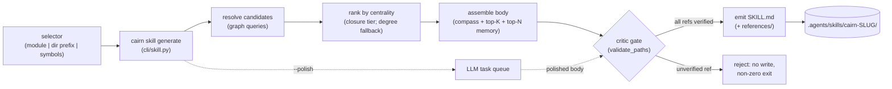

# Tech Spec: agent-skills-output

**Spec**: [spec.md](spec.md) | **Created**: 2026-09-16
**Every file/symbol citation below must come verbatim from [survey.md](survey.md)
or a grep run in this session — never from memory.**

Citation provenance: sections cite survey.md verbatim unless marked
**[session]** — this session's own cairn-tool/grep runs (survey.md predates
this audit and cannot contain these counts; shared rule 1 allows own-session
output as citation source). [research.md](research.md) is empty ("not
applicable — no open questions at Stage 0"), so every rejected alternative
below traces to a survey constraint or spec scope instead.

## Architecture

New package `src/cairn/skillgen/` (peer to the generated-markdown precedents
`src/cairn/wiki/` and `src/cairn/compass/generator.py` — survey supporting
evidence) plus one thin CLI module `src/cairn/cli/skill.py` (`src/cairn/cli/`
has no skill module — survey). It sits beside the existing readers as a
pure consumer: compass via the reader behind `get_compass`
(`src/cairn/mcp_server/tools_compass.py:34`), ranked symbols from the
transitive-closure store with `build_repo_map` degree rows
(`_SymbolRow` incoming/outgoing, `src/cairn/graph/repo_map.py:21-22`) as the
degrade tier, memory via `search_memory`
(`src/cairn/memory/promotion.py:242`), verification via `validate_paths`
(`src/cairn/compass/critic.py`). It writes `SKILL.md` in the layout the
static package `src/cairn/agent_integration/skill/SKILL.md` already ships
(frontmatter name/description + body + optional `references/`), landing at
the workspace default `.agents/skills/cairn-<slug>/` with `--output`
override. It does not touch `src/cairn/agent_install/` (distribution is the
documented follow-up, FR-006 / D-001).

Solid arrows are the deterministic default (FR-003); the dotted path is the
optional polish, gated by the same critic before write.

## Solution

### Chosen approach

Eight steps; each maps to FRs:

1. **Selector resolution**: accept a module name, directory prefix, or
   explicit symbol list; resolve to candidate symbols via existing graph
   queries. Unresolvable selectors fail fast with the unmatched candidates
   listed — no partial skill. (FR-001)
2. **Centrality ranking** (FR-002): score candidates by transitive impact
   aggregated from the closure store that every `cairn build`/update already
   materializes — `build_transitive_closure`
   (`src/cairn/graph/dataflow.py:229`) is invoked by `cairn build`'s
   derived-index phase, incremental updates, and both bench suites; the perf
   suite comment states "every cairn build/update builds it" **[session]**.
   Gate on the same availability checks `impact_analysis` uses
   (`closure_available`, seed-cycle guard — `src/cairn/graph/traversal.py`
   **[session]**). Degrade tier: direct in/out degree from `build_repo_map`
   (`src/cairn/graph/repo_map.py:160` **[session]**) rows
   (`_SymbolRow` incoming/outgoing — survey S3). Existence filter: a
   candidate is included only if its definition resolves in the graph.
   Tie-break: score desc, then qualified name asc — fully deterministic.
3. **Assembly**: compass body (reader behind `get_compass`, survey S3;
   router seam `src/cairn/compass/router.py` **[session]**), top-K symbols
   from step 2, top-N memories via `search_memory` (survey S3, default
   tiers only — superseded stay hidden). (FR-001)
4. **Critic gate** (FR-004): every backtick-quoted symbol/path reference in
   the body is verified against the graph via `validate_paths`
   (`src/cairn/compass/critic.py`, consumed by
   `src/cairn/cli/validate.py:35` — survey S4) synchronously, before any
   file write. Any unverifiable reference rejects the skill: nothing is
   written, exit non-zero, failing refs listed. The gate is unconditional —
   it guards deterministic and polished bodies alike (D-005).
5. **Emit** (FR-005): `SKILL.md` in the static package's layout — YAML
   frontmatter (`name`, `description` carrying deterministic load-trigger
   wording) plus markdown body, optional `references/` files — mirroring
   `src/cairn/agent_integration/skill/SKILL.md` (survey S1;
   `src/cairn/agent_install/merge.py:97` documents the package shape). The
   emitter is the only format-aware layer (spec risk mitigation: thin and
   swappable if the vendor format moves). Trigger text is template-rendered,
   never LLM-written (D-006).
6. **Landing** (FR-006): default `<workspace>/.agents/skills/cairn-<slug>/`;
   `--output` overrides the directory. Per-client install-agents
   distribution stays out of MVP (D-001, R1).
7. **LLM polish** (FR-003 WHERE-clause): off by default; `--polish` never
   invokes an LLM in-process — it enqueues a polish task through the
   existing LLM task queue (the `cairn wiki generate --llm` mechanism,
   survey S4's critic-gated promotion path), and the polished result passes
   the same critic gate before replacing the deterministic body.
8. **CLI** (FR-001): `src/cairn/cli/skill.py` — the command shape is
   `cairn skill generate SELECTOR [--output DIR] [--top-k K] [--top-n N] [--polish]` — following
   the one-module-per-command Click layout of `src/cairn/cli/`
   **[session]**, registered via `src/cairn/cli/__init__.py`.

Design screens: the pipeline is a single transformation per stage
(resolve/rank/assemble/gate/emit) with no pass-through layers; every input
is an existing reader (subtract-before-add: nothing new is computed except
the ranking aggregate); no synchronized flags — `--polish` is one boolean
feeding one queue path; domain shape (selector → ranked refs → body) is
untouched by transport (CLI is the only surface in MVP; MCP/web come later
without re-plumbing).

### Alternatives rejected

| Alternative | Why rejected |
|-------------|--------------|
| R1: distribute generated skills per client via install-agents now | FR-006 defers it to a documented follow-up and spec scope marks it Out; survey S2 confirms the per-client matrix exists but nothing writes generated skills into those paths today — coupling a generator to client layout risk for zero MVP value |
| R2: LLM-assembled skill bodies by default | FR-003 and spec US1/AC2 mandate no LLM on the default path; cairn routes every LLM call through the task queue behind the deterministic critic, and a deterministic body makes the FR-004 gate a pure graph check |
| R3: neutral intermediate skill format with per-target renderers | Spec scope marks a neutral export format Out ("no consumer today"); FR-005 rules the Anthropic layout directly; vendor-drift risk is already mitigated by the thin emitter — a second format adds structure with no caller |
| R4: reuse the wiki page pipeline as the generator | Wiki pages are LLM task-queue products with `## Sources` footers (different production contract); the deterministic default needs no LLM — survey names `src/cairn/wiki/` and `src/cairn/compass/generator.py` only as nearest precedents, not carriers |
| R5: rank by repo_map direct degrees only (skip the closure) | FR-002 requires centrality "from precomputed transitive impact"; survey S3's `_SymbolRow` degrees are direct in/out counts, not transitive — degrees remain only as the degrade tier (D-002) |

## Impact analysis

**[session]** Blast radius of the symbols this spec touches (precise
resolution; all reuse is read-only — skillgen adds callers, changes no
signature, so each row's breakage count is 0):

| Symbol | Location | Direct callers (precise) | Change skillgen makes | Breakage |
|---|---|---|---|---|
| `search_memory` | `src/cairn/memory/promotion.py:242` | 14 (largest of the reuse set: `src/cairn/cli/memory.py`, `src/cairn/compass/router.py`, `src/cairn/mcp_server/tools_memory.py`, `src/cairn/mcp_server/tools_graph.py`, `src/cairn/eval.py`, tests) | new read-only caller | 0 |
| `build_transitive_closure` | `src/cairn/graph/dataflow.py:229` | 18 (`cairn build`, incremental rebuild, benches, tests) | none — reads rows it produced | 0 |
| `impact_from_closure` | `src/cairn/graph/dataflow.py:591` | 1 (`impact_analysis` in `src/cairn/graph/traversal.py`) | may add an aggregate read alongside | 0 |
| `get_compass` | `src/cairn/mcp_server/tools_compass.py:34` | 1 (the tool module itself) | new caller of the underlying router reader | 0 |
| `validate_paths` | `src/cairn/compass/critic.py` | 2 (`src/cairn/cli/validate.py:35`, critic.py internal) | new caller (the write gate) | 0 |
| `build_repo_map` | `src/cairn/graph/repo_map.py:160` | 4 (`src/cairn/cli/map.py`, `src/cairn/mcp_server/tools_graph.py` x2, graft-parity test) | new caller (fallback tier) | 0 |

Fuzzy caveat: `search_memory` is a common-ish name — the precise count is
the trustworthy one; a fuzzy sweep adds same-name test doubles
(`_stub_search_memory` in `tests/test_mcp_degradation_footnote.py`,
`_search_memory` in `src/cairn/compass/router.py`) that are irrelevant to a
read-only addition. No cross-repo consumers: everything is within the
`cairn` repo.

**Default-flip sweep (brief-mandated test-tree classification).** No
decision in this spec flips an existing default — command, package, and
writer are additive; no existing flag, keyword default, or return shape
changes. The pin classes over the nearest surfaces:

- Flag pins (assert an old default): none — no default is flipped.
- Exact-count pins (row/call counts a flip would change): none on the
  touched surfaces — install/uninstall result counts are untouched because
  skillgen never runs during install.
- Exact-traffic pins (what gets sent/called): none.
- Behavior pins (unaffected but nearest): **[session]** the `.agents/skills`
  sweep over `tests/` returns exactly one hit —
  `tests/test_install_uninstall_fidelity.py:10`, "F4: cross-tool uninstall
  removes the whole .agents/skills/cairn tree". Stays green by
  construction: generated skills land at `.agents/skills/cairn-<slug>/`
  (sibling, not inside `cairn/`), and `_rm_tree_if_cairn`
  (`src/cairn/agent_install/merge.py` **[session]**) removes only
  directories named exactly `cairn` — a guard this spec does not modify
  (D-004). No CLI-registry count pins exist that adding a subcommand breaks
  (sweep of `--help`-related tests shows per-command tests only **[session]**).

## Code guide

### CLI surface
- Touches: new `src/cairn/cli/skill.py`; `src/cairn/cli/` has no skill
  module today (survey supporting evidence)
- Approach: thin command module parsing the selector, delegating to
  `skillgen`; register via `src/cairn/cli/__init__.py` (per-command module
  layout **[session]**)
- Verify before implementing: `cairn skill generate compass --output
  /tmp/skillcheck` writes a loadable SKILL.md
- Pitfalls: keep the module import-light in tests — C-04 forbids eager
  `cairn.cli` imports in test modules (CONSTITUTION.md)

### Selector and ranking
- Touches: new `src/cairn/skillgen/` package; reads the closure store built
  by `build_transitive_closure` (`src/cairn/graph/dataflow.py:229`
  **[session]**) and `build_repo_map` degree rows (`_SymbolRow`,
  `src/cairn/graph/repo_map.py:21-22` — survey S3)
- Approach: resolve selector via graph queries; rank from closure
  aggregates behind `closure_available`-style gating
  (`src/cairn/graph/dataflow.py:576` **[session]**); fall back to direct
  degrees; existence-filter every candidate against the graph
- Verify before implementing: same selector twice yields byte-identical
  SKILL.md (determinism test); closure-absent workspace still generates
  (fallback tier test)
- Pitfalls: skillgen is read-only against the store — never mutate closure
  or graph tables; tie-breaks must be total (score desc, name asc) or
  determinism breaks

### Content readers
- Touches: `get_compass` (`src/cairn/mcp_server/tools_compass.py:34`,
  router seam `src/cairn/compass/router.py` **[session]**); `search_memory`
  (`src/cairn/memory/promotion.py:242` — survey S3)
- Approach: consume read-only with existing keyword surfaces; top-N
  memories at default tiers (superseded stay hidden)
- Verify before implementing: generated skill contains a compass excerpt
  even for a module with zero memories
- Pitfalls: `search_memory` has 14 precise callers **[session]** — adding
  parameters would ripple; call it as-is

### Critic gate
- Touches: `validate_paths` (`src/cairn/compass/critic.py`, consumed by
  `src/cairn/cli/validate.py:35` — survey S4)
- Approach: wire the critic in-process before write; unconditional for
  deterministic and polished bodies (D-005)
- Verify before implementing: a hand-planted bogus backtick symbol in a
  body draft causes reject with non-zero exit and no file on disk
- Pitfalls: the gate must run on the exact bytes destined for disk —
  validating a draft and then re-rendering reopens the FR-004 hole

### Emitter and landing
- Touches: output matching `src/cairn/agent_integration/skill/SKILL.md`
  (survey S1; package shape per `src/cairn/agent_install/merge.py:97` and
  `src/cairn/agent_install/__init__.py:153`); default landing
  `.agents/skills/cairn-<slug>/`, `--output` override (FR-006)
- Approach: deterministic frontmatter (name, description with load-trigger
  wording, D-006) + body; optional `references/` split for long sections
- Verify before implementing: generated frontmatter parses as the same
  name/description shape the static skill ships; per-client paths
  (`src/cairn/agent_install/detect.py:165`, `__init__.py:156-171`) remain
  untouched
- Pitfalls: D-004 — uninstall leaves `cairn-<slug>/` dirs in place (the
  exact-name `cairn` guard **[session]** does not cover siblings); say so
  in the command's output note, do not "fix" it by touching the guard (it
  protects user data and pins F4)

### Tests
- Touches: new test modules under `tests/` (failing-test-first per C-02,
  CONSTITUTION.md)
- Approach: `tmp_path` workspaces; cover determinism (byte-identical
  reruns), critic rejection (no write), degree-fallback tier (closure
  absent), selector forms (module / prefix / symbol list), `--output`
  override, polish enqueue (no in-process LLM)
- Verify before implementing: `pytest tests/ -k skillgen` green
- Pitfalls: never leak workspaces into the real `~/.cairn`; never patch the
  global `subprocess.Popen`; no eager `cairn.cli`/`cairn.mcp_server` imports
  in test modules (C-04, CONSTITUTION.md)

## References

research.md is empty ("not applicable — no open questions at Stage 0") — no
external references to carry. Grounding lives in survey.md items S1-S4 and
the session audit recorded in § Impact analysis.

## Decisions

### D-001: New `src/cairn/skillgen/` package; install-agents stays out of the generator
- **Context**: assembly (selector → SKILL.md) is a knowledge-layer
  transformation; `src/cairn/agent_install/` is per-client distribution
  plumbing (survey S1-S2) and FR-006 defers distribution.
- **Decision**: skillgen owns assembly and writes only the workspace
  default; agent_install is untouched; a later distribution feature
  integrates at the emit step, not inside merge.py.
- **Consequences**: zero blast radius in agent_install (see impact table);
  the emit step is the single seam a future per-client distributor plugs
  into.

### D-002: Two-tier centrality — closure aggregate first, repo_map degrees as degrade tier
- **Context**: FR-002 names precomputed transitive impact; the closure is
  built by every build/update **[session]**, but a stale/absent closure must
  not hard-fail generation (mirrors `impact_analysis`'s
  `closure_available` gating **[session]**).
- **Decision**: rank from closure aggregates when available; otherwise
  direct in/out degree from `build_repo_map` rows.
- **Consequences**: on the fallback tier the ranking is direct-degree, a
  weaker signal — the generated skill records which tier produced its
  ranking. Kept red flag: quality variance across workspaces; mitigated by
  the in-file tier note, not by failing.

### D-003: Zero new runtime dependencies
- **Context**: C-03 gates any new runtime dependency behind a tech-spec
  decision (CONSTITUTION.md).
- **Decision**: frontmatter is emitted with the already-present
  `pyyaml>=6.0` (`pyproject.toml:45` **[session]**); no new dependency of
  any kind.
- **Consequences**: wheel/platform matrix unchanged; no dependency-review
  load on the PR.

### D-004: Uninstall does not learn about generated skills in MVP
- **Context**: `_rm_tree_if_cairn` removes only directories named exactly
  `cairn` **[session]**; F4 pins whole-tree removal of
  `.agents/skills/cairn` (`tests/test_install_uninstall_fidelity.py:10`
  **[session]**).
- **Decision**: do not modify the guard or uninstall scope; generated
  `cairn-<slug>/` dirs survive uninstall and `cairn skill generate` says so
  in its output note.
- **Consequences**: kept red flag — uninstalled workspaces keep orphaned
  generated skills until manually removed; accepted because broadening the
  removal pattern risks deleting non-cairn content and breaks F4.

### D-005: Critic gate is synchronous and in-process, not a queue stage
- **Context**: FR-004 requires verification before write;
  `validate_paths` is a pure graph check already consumed in-process by
  `src/cairn/cli/validate.py:35` (survey S4).
- **Decision**: gate runs inline in the generate command before the file
  write, for both deterministic and polished bodies.
- **Consequences**: the default path stays LLM-free and fast; the task
  queue is used only for the optional polish stage (FR-003's WHERE-clause),
  and its output re-enters the same gate.

### D-006: Deterministic `description` wording; no LLM in the trigger text
- **Context**: FR-005 puts the load trigger in the `description`
  frontmatter; spec US1/AC2 require the default path LLM-free.
- **Decision**: description is template-rendered from the selector and
  module name (what the skill covers, when to load it).
- **Consequences**: trigger quality is bounded by the template; `--polish`
  may improve wording, but only through the queue + gate path (D-005).

### D-007: Phase-1 assembly test re-pinned to the ranked contract
- **Context**: T007's mandate (FR-002) replaces Phase-1 plain-inclusion symbol
  ordering with `rank_candidates` top-K; `tests/test_skillgen_assembly.py`'s
  `test_symbols_are_candidates_in_stable_order_capped_by_top_k` asserted the
  Phase-1 sorted-candidates order, which no default can satisfy alongside
  ranked selection (structure edges give module/class symbols positive
  degree over zero-degree members).
- **Decision**: the assembly test pins membership + cap plus equality with
  `rank_candidates(conn, res.candidates).symbols[:top_k]` (fix round 1,
  re-briefed to T002's owner); assembly behavior itself is unchanged from
  T007's integration.
- **Consequences**: the Phase-1 stable-order expectation is no longer
  pinned anywhere (ranking's own determinism test covers total order);
  empty-resolution drafts keep the `unranked` tier contract.

### D-008: `skill-polish` completion exemption in the task-queue critic
- **Context**: `cairn task complete <id> --result-file` passes a graph conn
  into `complete_task`, whose generic critic scores quality by compass/flow
  section headings (`_DEFAULT_SECTION_VOCAB`, `src/cairn/compass/critic.py`);
  a skill-polish result scores 0.0 and revise-loops to dropped, so the
  documented worker flow can never complete a polish task (the queue-API
  completion path works; T009's tests exercise it).
- **Decision**: add a `skill-polish` branch to `src/cairn/llm/tasks.py`'s
  completion critic mirroring the wiki-catalog/doc-link critic-exemption
  precedent; the skill's own write gate remains skillgen's `verify_draft`
  (D-005) — the queue critic only stops section-vocab scoring for this
  task kind. Files named by this decision: `src/cairn/llm/tasks.py`,
  `tests/test_skillgen_polish.py`.
- **Consequences**: without it, `--polish`'s printed worker instruction is
  non-functional; with it, polish results carry the same completion
  semantics as wiki tasks. The `---`-in-facts OKF round-trip trap is
  separately recorded as a memory (bodies never ride in facts).

### D-009: Module-kind rows excluded from exact-symbol matching
- **Context**: with `pkg_a/__init__.py` present, the graph indexes a
  module-kind symbol named `pkg_a`; the selector's exact-symbol tier matched
  it first and shadowed module-path resolution, so `skill generate pkg_a`
  packaged only the module symbol (closing-audit finding on TC-007/TC-002
  fixtures; fix round 1 on T001).
- **Decision**: `src/cairn/skillgen/selector.py`'s exact-symbol matching
  excludes `kind='module'` rows (packaging artifacts, not API surface); a
  token naming a module falls through to module-path resolution and returns
  the module's contents. Explicit function/class lists are unchanged
  (TC-006). Files named by this decision: `src/cairn/skillgen/selector.py`,
  `tests/test_skillgen_selector.py`.
- **Consequences**: a root-level single-FILE module (e.g. `sub_mod.py` →
  module-kind row `sub_mod`) is unresolvable by bare token — excluded from
  exact match, and module-path resolution matches directories, not files —
  so such a request fails fast with the token listed unmatched (workaround:
  select the file's symbols explicitly). Accepted limitation: fail-fast is
  the honest outcome versus the previous degenerate one-symbol skill.
