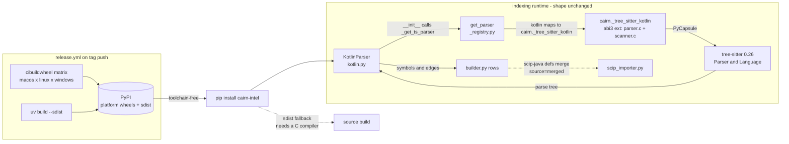

# Tech Spec: kotlin-grammar-fwcd

**Spec**: [spec.md](spec.md) | **Created**: 2026-08-25
**Every file/symbol citation below comes verbatim from [survey.md](survey.md)
or a grep/run executed in this session — never from memory.**

Provenance key: `S#` = survey.md item # · `G` = command run in this session
(quoted inline) · `R` = research.md (external facts, each carrying its own
source URL there) · `W` = web fetch/search run in this session.

## Architecture

Today `pip install cairn-intel` is pure Python (S4: wheel is
`py3-none-any`, built on ubuntu only) and the Kotlin grammar arrives as the
external PyPI wheel `tree-sitter-kotlin==1.1.0` (S1, S5). The swap moves
that grammar in-tree: fwcd's **generated parser sources** are vendored,
compiled by setuptools into a small abi3 CPython extension living inside the
`cairn` package, and the release workflow grows a cibuildwheel matrix so
every supported platform ships a wheel with the extension pre-built. The
runtime parse path keeps its exact shape — only the module string behind the
`"kotlin"` key changes (S, supporting evidence: `_load_language_module`
mapping `_registry.py:119-138` is "the single seam").

The install side changes (pure-Python package becomes a compiled
distribution with platform wheels); the indexing side does not —
`KotlinParser.__init__` still binds `_get_ts_parser("kotlin")`
(kotlin.py:41), `get_parser` still returns `Parser(Language(capsule))`
(`_registry.py:38`), and the scip-java hybrid still merges onto tree-sitter
rows (`builder.py:410-413` comment, S6).

## Solution

### Chosen approach

**Vendoring mechanics (design a).** `vendor/tree-sitter-kotlin/` holds a
pinned snapshot of fwcd's *generated output only* — `src/parser.c`,
`src/scanner.c`, `src/tree_sitter/` (the headers `parser.c` includes, e.g.
`tree_sitter/parser.h`), plus `src/grammar.json` and `src/node-types.json`
(regeneration input and port-verification reference) and fwcd's `LICENSE`
(MIT, R). W (session fetch of the repo's `src/` listing): files `parser.c`,
`scanner.c`, `grammar.json`, `node-types.json`, folder `tree_sitter`. W
(repo README "Project Structure" table): "`src` | The generated parser".
**Not vendored:** fwcd's own packaging — root `setup.py`, `pyproject.toml`,
`bindings/`, `Cargo.toml`, `package.json` (W: repo root listing) — because
their pyproject pins `tree-sitter~=0.22` (stale vs cairn's 0.26) and the
PyPI name `tree-sitter-kotlin` is owned by the dormant build (R). The
capsule is exposed by a cairn-owned ~40-line shim
`src/cairn/_tree_sitter_kotlin_binding.c` that defines the extension module
`cairn._tree_sitter_kotlin` with one function `language() -> PyCapsule` —
exactly the interface the default loader already calls
(`return lang_mod.language()`, `_registry.py:66`, S1). The capsule
interface is stable across the 0.22→0.26 line in practice: cairn already
runs grammar wheels from the 0.23.x–0.25.x era on `tree-sitter==0.26.0`
(pyproject.toml:29-43, S4).

**Build (design f).** A new `setup.py` (S4 confirms none exists:
"no ext-modules in pyproject, no cibuildwheel, no setup.py") declares one
`Extension("cairn._tree_sitter_kotlin", sources=[vendor
parser.c, scanner.c, shim], py_limited_api=True, define_macros
Py_LIMITED_API=0x030A0000 + PY_SSIZEET_CLEAN)` → wheels tag `cp310-abi3-*`,
one per platform, mirroring the coverage the old dep itself shipped (S1:
`cp39-abi3 macosx_10_9_x86_64, macosx_11_0_arm64,
manylinux_2_17_aarch64`...). `build-system.requires` bumps
`setuptools>=61.0` → `>=64.0` (pyproject.toml:2) so PEP 660 editable
installs (`uv sync`, `pip install -e .`) compile the extension in-place —
devs have toolchains, so this is a one-time ~seconds compile with the
system cc/clang/MSVC; no tree-sitter CLI is needed (that is regeneration
only). A `MANIFEST.in` (`recursive-include vendor *.c *.h *.json LICENSE`)
puts the C sources in the sdist, keeping source builds possible where a
toolchain exists (spec risk line: "sdist keeps source builds possible").
The release workflow's single ubuntu `uv build` job (release.yml:43-46, S4)
becomes a 3-runner matrix (ubuntu/macos/windows) using a pinned
`pypa/cibuildwheel@v4.2.0` (W: current cibuildwheel docs recommendation;
its FAQ requires pinning an exact version — no floating major tags), plus a
separate `uv build --sdist` step. `publish-pypi` and `github-release`
consume the `dist` artifact and stay unchanged. Local `make dist`
(Makefile:6 `uv build`) keeps working — it now produces a host-platform
wheel; the Makefile:3-5 comment ("py3-none-any") needs the one-line update.
ci.yml's build job (`python -m build` on ubuntu, verify import,
ci.yml:269-272, S4) also keeps working: it builds the linux wheel for the
host platform.

**Registry (design c).** `_load_language_module`'s mapping entry at
`_registry.py:121` flips from `"tree_sitter_kotlin"` to
`"cairn._tree_sitter_kotlin"` — one line. No `_SPECIAL_LOADERS` entry is
needed: that table exists only for modules without a plain `language()`
(S, supporting evidence: `_SPECIAL_LOADERS` `_registry.py:43-52` is "the
existing precedent for a non-`language()` loader"; ours has one). The
module docstring (`_registry.py:4-7`, which names tree-sitter-kotlin among
"per-language wheels") is updated in the same edit. FR-006's removal:
delete `pyproject.toml:30 "tree-sitter-kotlin==1.1.0"`, regenerate
`uv.lock` (entries at uv.lock:215, uv.lock:298, and the package block, S5),
update NOTICE:26 (drop from the MIT dependency list — it is no longer a
dependency) and add a vendored-content entry (below).

**KotlinParser port (design d).** Seven researched mismatches (R), each
keyed to survey item 2's kotlin.py catalogue — see the per-mismatch table
in § Code guide. The port switches outright to fwcd's shapes; no dual
grammar support (FR-006: single Kotlin grammar path). Much of the shape
handling already exists: `_classify_type_decl` (kotlin.py:192-215) already
scans `class_declaration` keyword children for `interface`/`enum`/`class`
(kotlin.py:198-207), import handling already accepts both `import` and
`import_header` (kotlin.py:124), and every name lookup already accepts
`("simple_identifier", "identifier")` at 17 sites (S2: kotlin.py:234, :268,
:304, :307, :336, :483, :500, :504, :523, :538, :556, :564, :576, :620,
:646, :657, :680).

**ERROR-node visibility (design e).** Test-side only: the new
modern-syntax fixture test parses each fixture and asserts
`not tree.root_node.has_error`. G (this session, on tree-sitter 0.26.0 +
the current grammar): `root_node.has_error` is `True` for
`class { val broken =` and `False` for `val x = 1`; `Node.has_error` and
`Node.is_missing` both exist. No doctor change: `_check_parse_errors`
(system.py:1057) reads the `parse_errors` table, which the builder fills
from the Python-exception slot (`parse_errors = sum(1 for r in
parsed_results if r[6] is not None)`, builder.py:249, S3) — grammar ERROR
nodes are a different semantic and stay out of it.

**scip-java hybrid (design g).** No code change. The merge joins SCIP
definitions onto tree-sitter rows (`_merge_scip_defs_into_tree_sitter`,
scip_importer.py:329, "Fold each SCIP definition symbol into its matching
tree-sitter row", S6); `builder.py:410-413` documents that tree-sitter
still parses SCIP-covered files (S6). With extraction parity the join keys
(files, symbol rows) are unchanged, so the proof of FR-007 is the existing
hybrid suites staying green on the new grammar:
`tests/test_build_scip_hybrid.py` (22 kotlin-mention lines, S6) and the
scip-kotlin merge tests at test_parser_audit_fixes.py:307/:324/:352/:381
(S7).

**FR coverage map**

| FR | Where it lands |
|----|----------------|
| FR-001 | `_registry.py:121` swap + vendored `cairn._tree_sitter_kotlin` extension |
| FR-002 | port item 1 (interface/enum keyword classification, already present — verified by golden) |
| FR-003 | port items 2-7 (hidden/renamed node shapes) |
| FR-004 | modern-syntax fixtures + `has_error` assertions in the new test |
| FR-005 | `setup.py` abi3 extension + cibuildwheel matrix in release.yml + MANIFEST.in sdist |
| FR-006 | pyproject.toml:30 removal, uv.lock regen, single mapping string, no fallback loader |
| FR-007 | unchanged merge path; hybrid suites as proof |
| FR-008 | CHANGELOG.md `[Unreleased]` entries (CHANGELOG.md:13/:15/:33/:41, S8) |

### Alternatives rejected

| Alternative | Why rejected |
|-------------|--------------|
| Separate `cairn-tree-sitter-kotlin` PyPI package | "+1 package to publish and CI forever" (R options summary); violates the user constraint "no second PyPI package" |
| git-URL dependency on fwcd | "pip compiles C at install time, breaks toolchain-free install" (R) |
| pip-install fwcd's own packaging | Impossible/stale: PyPI name owned by the dormant build; pins `tree-sitter~=0.22` vs cairn's 0.26 (R) |
| Keep the old grammar, patch upstream | 13 commits, dormant 19+ months — "fixes will never land there" (R; spec Why) |
| `_SPECIAL_LOADERS` entry for kotlin | Unnecessary: the vendored module exposes plain `language()`, which the default loader path already calls (`_registry.py:66`, S1) |
| Dual-grammar fallback loader | FR-006 forbids it outright; a fallback also masks parity regressions instead of catching them |
| ERROR-node check inside doctor / parse_errors | `parse_errors` counts Python exceptions (builder.py:249, S3), not grammar ERROR nodes — mixing semantics for no FR-004 gain; the fixture test observes FR-004 directly |
| macOS universal2 wheels | Doubles wheel size vs per-arch abi3 wheels; the old dep itself shipped per-arch cp39-abi3 (S1) |
| Extend extraction to the new constructs | Spec Scope: "Out (deferred): semantic extraction of the NEW constructs" |

## Impact analysis

Blast radius measured with the repo's own CLI in this session (`uv run
cairn impact/callers ...`; graph built via `uv run cairn build --staging`:
8,614 symbols / 37,344 edges, 14,639 exact-resolved edges).

- **`_load_language_capsule`** (the function behind the registry seam):
  `cairn impact _load_language_capsule` → **Total impacted: 127** — depth 0
  `get_parser` (`_registry.py`), depth 1 `_parse_file_worker`
  (`builder.py`), depth 2 `_parse_all`, depth 3 `_build_graph_impl`,
  depth 4 `build_graph` (x2, `builder.py`), depth 5: 71 test callers. This
  is the pipeline every indexed file of *every* language flows through; the
  actual edit is the one mapping string for `"kotlin"`, so the other 10
  languages' loader rows are untouched, and the 127-path exposure is the
  reason the full `pytest -q` suite (not just `-k kotlin`) must stay green.
- **`KotlinParser`**: `cairn impact KotlinParser` (precise *and* fuzzy) →
  **4** — all in tests/test_kotlin_operator_invoke.py
  (`test_lambda_typed_property_not_rewritten`,
  `test_genuine_method_call_not_rewritten`,
  `test_explicit_invoke_call_unchanged`, `test_call_shape_table`).
  Resolution caveat: this under-counts. G (session grep): the true
  reference set is `builder.py:34` (import) + `builder.py:52`
  (`"kotlin": KotlinParser` dispatch mapping) +
  tests/test_tree_sitter_parser_base.py:6/:61/:79/:105 +
  tests/test_parser_audit_fixes.py:37/:240/:262 +
  tests/test_kotlin_operator_invoke.py:24/:185/:205/:218/:255 +
  tests/fixtures/golden/regenerate.py:10/:24. The dict-literal dispatch at
  builder.py:52 is not a call edge, so precise mode can't see it — for
  reference counting, grep is ground truth; for *behavioral* blast radius,
  every `.kt` file in every build goes through this class.
- **`_get_ts_parser`**: `cairn callers _get_ts_parser` (precise) → "No
  callers found" — a textbook false negative (the AGENTS.md quirk: "Empty
  precise result ≠ 'no callers'"). Fuzzy → 14 parser modules, including
  `src/cairn/parsers/kotlin.py:41 method __init__`. Registry changes must
  not break the other 13 consumers — they don't: only the `"kotlin"` row
  changes.
- **`_merge_scip_defs_into_tree_sitter`**: `cairn callers` → exactly 1
  precise caller, `_import_protobuf` (scip_importer.py:631). No edit
  planned; exposure is via the substrate rows it joins against (S6).
- **Dependency-surface blast radius (FR-006)**: complete inventory is in
  S5 — `pyproject.toml:30`, `uv.lock:215/:298` + package block, `NOTICE:26`
  (MIT list), `_registry.py:4` (docstring) + `_registry.py:121` (mapping),
  and two comment-only mentions in tests/test_parser_audit_fixes.py:18
  ("tree-sitter-kotlin 1.1.0 emits...") and :236 ("``identifier`` (not...").
  The comments should be reworded to name fwcd's grammar so future readers
  aren't misled about which grammar emits those shapes.
- **What catches a wrong port mechanically** (S3): golden snapshot equality
  (tests/test_golden_parsers.py:8
  `test_parser_output_matches_golden` vs
  tests/fixtures/golden/kotlin/expected.json) and
  tests/test_kotlin_operator_invoke.py:228 `test_call_shape_table` — the
  survey notes these are the only things that notice shape drift today,
  which is why the port's verification leans on them plus the new ERROR
  scan.
- **Wheel-consumer blast radius**: installs move from
  `cairn_intel-<version>-py3-none-any.whl` to per-platform cp310-abi3
  wheels. Platforms outside the matrix (no matching wheel) fall back to the
  sdist and need a C compiler — accepted by the spec (risk note) and
  unchanged in spirit from today, where `sqlite-vec>=0.1.0`
  (pyproject.toml:50) and the 14 grammar wheels already constrain platforms
  (S4).

## Code guide

### 1. Vendored grammar capsule (new files)
- Touches: new `vendor/tree-sitter-kotlin/{LICENSE, src/parser.c,
  src/scanner.c, src/tree_sitter/*, src/grammar.json,
  src/node-types.json}`, new `src/cairn/_tree_sitter_kotlin_binding.c`, new
  `setup.py`, new `MANIFEST.in`; `pyproject.toml:2`
  (`setuptools>=61.0` → `>=64.0`).
- Approach: pin an fwcd commit/tag; copy the generated `src/` files + LICENSE
  (layout per W fetch). The shim's `language()` returns the capsule the same
  way the current wheel does (S1 verify: `from tree_sitter_kotlin import
  language; print(language())` → `<capsule object "tree_sitter.Language"
  ...>`). `setup.py` builds one abi3 extension named
  `cairn._tree_sitter_kotlin` with `include_dirs` pointing at
  `vendor/tree-sitter-kotlin/src` (for `tree_sitter/parser.h`).
- Verify before implementing: `G: uv run python -c "import tree_sitter;
  print(tree_sitter.__version__)"` → `0.26.0`; after the swap:
  `uv run python -c "import cairn._tree_sitter_kotlin as m; from
  tree_sitter import Language, Parser; p = Parser(Language(m.language()));
  assert not p.parse(b'class Foo').root_node.has_error"`.
- Pitfalls: (1) ABI — the 0.26 runtime accepts language versions 13-15
  (`G: tree_sitter.LANGUAGE_VERSION` → `15`,
  `tree_sitter.MIN_COMPATIBLE_LANGUAGE_VERSION` → `13`); if fwcd's shipped
  `parser.c` was generated outside that range, `Language()` fails at load —
  regenerate (§ regeneration, D-004). (2) `scanner.c` is plain C (W
  listing) so MSVC/musl builds are fine, but keep `PY_SSIZEET_CLEAN`
  defined. (3) Do not vendor fwcd's `bindings/` or `setup.py` — their
  module name and tree-sitter pin are theirs.

### 2. Registry swap + dependency removal
- Touches: `src/cairn/parsers/_registry.py:121` (mapping string) and
  `_registry.py:4-7` (docstring); `pyproject.toml:30` (delete);
  `uv.lock` (regenerate); `NOTICE:26` (remove from MIT dep list) +
  vendored-content section; comment-only fixes at
  tests/test_parser_audit_fixes.py:18 and :236.
- Approach: `"kotlin": "tree_sitter_kotlin"` →
  `"kotlin": "cairn._tree_sitter_kotlin"`. Nothing else in the loader
  changes — the default path calls `lang_mod.language()` (`_registry.py:66`,
  S1). Add a NOTICE "Vendored content (Kotlin grammar)" block mirroring the
  yarl precedent (NOTICE:84-100: origin URL, pinned commit, license,
  in-tree path, retained license text).
- Verify before implementing: `G` baseline `uv run --extra dev --extra test
  pytest tests -q -k kotlin` → 13 passed (S2); after: same command plus
  `grep -rn "tree_sitter_kotlin" src/ pyproject.toml` → only
  `cairn._tree_sitter_kotlin` occurrences remain.
- Pitfalls: `import tree_sitter_kotlin` appears nowhere in src/ or tests/
  (S1) — the mapping string is the *only* runtime reference, so a missed
  grep is easy to over-worry and a stale uv.lock is easy to miss: relock
  (`uv lock`) or CI resolves the deleted pin against a cached lock
  (uv.lock:298, S5).

### 3. KotlinParser port (src/cairn/parsers/kotlin.py)
- Touches: the node-shape walk surface catalogued in S2 — per mismatch:

| # | fwcd shape (R) | kotlin.py site (S2) | Approach |
|---|----------------|---------------------|----------|
| 1 | interface/enum are `class_declaration` variants with keyword children; enums use `enum_class_body` | TYPE_DECL_NODES kotlin.py:25-30; `_classify_type_decl` kotlin.py:198-215; prescan `class_body` kotlin.py:102 | Classification already handles the folded shape (:198-207 returns interface/enum/class from keyword children; `interface_declaration`/`enum_declaration` entries at :28-29 become inert). Add `"enum_class_body"` alongside `"class_body"` in the prescan branch so enum class-body properties still reach `_field_types` (operator-invoke rewrites depend on it) |
| 2 | `class_parameters` hidden (`_class_parameters`) | prescan kotlin.py:96 `pc.type == "class_parameters"` | Under fwcd, `primary_constructor` children are `class_parameter`s directly — match `class_parameter` at that level (drop the container hop) |
| 3 | `delegation_specifiers` plural hidden — only singular `delegation_specifier` visible | `_parse_inheritance` kotlin.py:381 `child.type in ("delegation_specifiers", "inheritance_specifier")` | Collect direct-child `delegation_specifier` nodes; `_collect_inheritance_targets` (kotlin.py:399-424) already recurses to `constructor_invocation` → extends and `user_type` → implements |
| 4 | `inheritance_specifier` not a node; keywords in `inheritance_modifier` | same walk + `_collect_modifiers` kotlin.py:217-229 | Covered by item 3 for edges; for modifiers, descend into an `inheritance_modifier` child container if fwcd emits one, else `open`/`sealed`/`abstract` drop out of the symbol's modifiers — sample.kt's "open class" exercises this (S7) |
| 5 | `type_reference` hidden (`_type_reference`) | triples at kotlin.py:485/:502/:525 `("user_type", "type_reference", "nullable_type")` | No edit expected — `user_type`/`nullable_type` still match; `type_reference` becomes inert. Verify param/property/ctor-param types via golden |
| 6 | `qualified_identifier` → `identifier` | `_parse_import` kotlin.py:361 | Accept `identifier` as the preferred child; the node-text fallback (strip `import ` prefix, drop ` as Alias`, kotlin.py:355-358) already covers path splits |
| 7 | import header shape | kotlin.py:124 `if t in ("import", "import_header")` | No edit — already accepts both (comment there says exactly this was done for "newer grammars") |

- Approach: port outright, no old-shape compatibility branches (FR-006).
  The name-lookup sites accepting `("simple_identifier", "identifier")`
  (17 sites, S2) and `_extract_usertype_name` accepting
  `("type_identifier", "identifier")` (kotlin.py:670) need no change.
- Verify before implementing: `uv run --extra dev --extra test pytest
  tests/test_golden_parsers.py tests/test_kotlin_operator_invoke.py -q`
  (within S6's 30-passed run); regenerate nothing —
  `tests/fixtures/golden/kotlin/expected.json` is the parity oracle and
  must not be regenerated (regenerate.py:24 `"kotlin": (KotlinParser,
  "sample.kt")` exists for deliberate regens only).
- Pitfalls: hidden-rule differences "silently drop edges" (spec risk) —
  watch items 2/3: a missed prescan hop yields fewer `_field_types` rows
  and quietly degrades the operator-invoke rewrite tests rather than
  failing loudly; run the full `-k kotlin` set plus
  test_core_smoke.py:54 `test_build_graph_resolves_usecase_bare_call`
  after each item.

### 4. Tests: parity + modern-syntax fixtures
- Touches: new fixture set (e.g. `tests/fixtures/kotlin/modern/`) + one new
  test module asserting ERROR-free parses; existing suites unchanged
  (S7 inventory: 8 operator-invoke tests at :91-:228, golden at
  test_golden_parsers.py:8, audit-fix at :234/:235/:258, base conformance
  at test_tree_sitter_parser_base.py:58/:61/:76/:79/:102/:105, self-demo at
  test_self_demo.py:38/:84).
- Approach: fixtures exercise KEEP-0438 destructuring, `when` guard
  conditions, multi-dollar interpolation, trailing commas (FR-004 list);
  the test asserts `not tree.root_node.has_error` per fixture (mechanics
  verified this session, quoted in § Solution). Parity is asserted by the
  untouched golden JSON; the operator-invoke `test_call_shape_table`
  (:228) guards call shapes.
- Verify before implementing: `G: grep -rn "has_error" src/` → no output
  (S3 confirms absence — the check is new, test-side only).
- Pitfalls: do not put the ERROR scan into doctor or the builder
  (D-005); do not regenerate expected.json to "fix" parity failures —
  a diff there is a port bug, not fixture drift.

### 5. Release / wheel pipeline
- Touches: `.github/workflows/release.yml` (build job → OS matrix +
  cibuildwheel + sdist step); `.github/workflows/ci.yml` build job
  (ci.yml:269-272 — behavior-compatible, review only); `Makefile:3-5`
  comment; `setup.py`/`MANIFEST.in` from area 1.
- Approach: matrix `runs-on: [ubuntu-latest, macos-latest,
  windows-latest]`; each runner uses pinned `pypa/cibuildwheel@v4.2.0` (W:
  current docs; FAQ mandates exact pins) with `CIBW_BUILD` selectors:
  linux `cp310-abi3-manylinux_x86_64 manylinux_aarch64 musllinux_x86_64
  musllinux_aarch64` (aarch64 via QEMU), macos
  `CIBW_ARCHS_MACOS: "x86_64 arm64"`, windows
  `CIBW_ARCHS_WINDOWS: "AMD64"` (FR-005 lists "Windows"; win_amd64 is the
  minimal correct target). `CIBW_TEST_COMMAND`: import the extension and
  parse a snippet (the `assert not ... has_error` one-liner from area 1) so
  every wheel proves its own grammar. Keep a separate `uv build --sdist`
  step on ubuntu; `publish-pypi`/`github-release` need no edits (they
  download the dist artifact — release.yml:69-71, :91). The old
  "Verify the wheel imports" step (release.yml:48-52) is superseded by
  CIBW_TEST_COMMAND.
- Verify before implementing: `make dist` → wheel filename changes from
  `py3-none-any` to a `cp310-abi3-macosx...` tag (Makefile:3-5 documents
  today's name); `python -m build` on ubuntu still imports (ci.yml:272
  `python -c "import cairn; print('ok')"`).
- Pitfalls: cibuildwheel minor versions can add/remove platforms (W FAQ) —
  pin exact; abi3 wheels still need `pip install` to satisfy runtime deps
  inside CIBW_TEST_COMMAND (all current deps ship wheels on these
  platforms — S4 notes compiled deps are external wheels today); the
  release concurrency group (release.yml:24-26) already serializes tags,
  so a wider matrix only widens the single build job, not the publish.

### 6. scip-java hybrid verification (no code change)
- Touches: nothing; evidence-only.
- Approach: run `uv run --extra dev --extra test pytest
  tests/test_build_scip_hybrid.py tests/test_parser_audit_fixes.py -q` on
  the new grammar (S6's combined 30-passed command includes the hybrid
  suite). The merge folds SCIP defs onto tree-sitter rows
  (scip_importer.py:329); parity keeps the join stable.
- Verify before implementing: the S6 command baseline.
- Pitfalls: scip-java is declared per-cairn.json (docs/scip.md:52/:122 —
  "kotlin | scip-java"); hybrid tests use synthetic indexes, so no JVM is
  needed — do not add scip-java installation to CI for this spec (Scope:
  "SCIP-side changes" are out).

### 7. Changelog
- Touches: `CHANGELOG.md` under `## [Unreleased]` (CHANGELOG.md:13;
  sections Added :15 / Fixed :33 / Changed :41).
- Approach: Added — modern-Kotlin syntax parses ERROR-free (KEEP-0438,
  when-guards, multi-dollar interpolation, trailing commas); Changed —
  Kotlin grammar swapped to the vendored fwcd grammar, `tree-sitter-kotlin`
  dependency removed, wheels are now per-platform (toolchain-free install
  preserved); prose style per existing entries (S8). Version bump happens
  only at tag time via `cz bump` (pyproject.toml:215-224, S8).
- Verify before implementing: `sed -n '1,45p' CHANGELOG.md` shows the
  section shape (S8).
- Pitfalls: do not add a version heading — release.yml's awk extraction
  (release.yml:104-114) keys on `## [X.Y.Z]` headers; a premature one
  publishes empty notes.

## References
- fwcd/tree-sitter-kotlin — the adopted grammar; MIT; activity and
  modern-syntax commits (R, with source URLs there).
- fwcd repo `src/` layout and README "Project Structure" (`src` = the
  generated parser; `npm run generate` regenerates) — W session fetch of
  https://github.com/fwcd/tree-sitter-kotlin .
- PyPI `tree-sitter-kotlin` 1.1.0 and tree-sitter-grammars/tree-sitter-kotlin
  dormancy — R (source URLs there).
- cibuildwheel changelog + FAQ (exact-version pinning, uv build frontend):
  https://cibuildwheel.pypa.io/en/stable/changelog/ ,
  https://cibuildwheel.pypa.io/en/stable/faq/ — W session search.
- docs/scip.md (:52, :122) and docs/configuration.md (:148) — scip-java
  hybrid merge semantics (S6).
- tests/fixtures/golden/regenerate.py:24 — the golden parity oracle's
  deliberate-regen path (S7).
- docs/release-checklist.md — referenced by pyproject.toml:93 and
  release.yml:8 for the release flow this spec extends.

## Decisions

### D-001: In-tree vendored extension (fixed by spec — FR-005, constitution C-04)
- **Context**: fwcd's grammar cannot be pip-installed under its own name
  (PyPI name owned by the dormant build; `tree-sitter~=0.22` pin, R), and
  the architecture constraints require toolchain-free install, no second
  PyPI package, dependency-light default install.
- **Decision**: Vendor fwcd's generated parser into cairn's tree; compile it
  as an abi3 CPython extension inside cairn-intel's own wheels via the
  existing tag-triggered release flow.
- **Consequences**: cairn-intel becomes a compiled distribution — release
  gains a cibuildwheel matrix, dev installs compile once locally; grammar
  bumps become file drops with zero release ceremony. Rules out the
  separate-package and git-URL options permanently for this grammar.

### D-002: Registry seam is the one-line mapping swap
- **Context**: `_load_language_module`'s mapping (`_registry.py:119-138`)
  is the single seam (S supporting evidence); `_SPECIAL_LOADERS`
  (`_registry.py:43-52`) exists for modules without plain `language()`.
- **Decision**: Change `_registry.py:121` to
  `"kotlin": "cairn._tree_sitter_kotlin"`; no `_SPECIAL_LOADERS` entry, no
  fallback loader.
- **Consequences**: Smallest possible registry diff; the plugin entry-point
  group `cairn.parsers.v1` (`_registry.py:116`) remains untouched and
  available; a broken vendored build fails loudly at import (no silent
  fallback), which is what FR-006 wants.

### D-003: Extension shape — setuptools setup.py, abi3, cairn-owned shim
- **Context**: setuptools has no declarative ext-module config; the wheel
  must cover Python 3.10-3.14 (pyproject classifiers) without 5x builds per
  platform; the old dep proved cp39-abi3 viability (S1).
- **Decision**: One `setup.py` with `Extension("cairn._tree_sitter_kotlin",
  ..., py_limited_api=True, Py_LIMITED_API=0x030A0000)` built from vendored
  `parser.c`/`scanner.c` plus a cairn-owned `bindings.c` shim exposing
  `language()`.
- **Consequences**: One wheel per platform covers all CPythons; sdist stays
  source-buildable; setuptools>=64 required for editable installs. The shim
  is cairn code to maintain (~40 stable lines) instead of tracking fwcd's
  `bindings/`.

### D-004: Vendor generated sources only; regenerate against 0.26 ABI on demand
- **Context**: fwcd's packaging pins `tree-sitter~=0.22` (R) but the
  generated `parser.c`'s ABI is a property of the CLI that generated it;
  the 0.26 runtime accepts language versions 13-15 (G: `LANGUAGE_VERSION`
  15, `MIN_COMPATIBLE_LANGUAGE_VERSION` 13).
- **Decision**: Vendor `src/{parser.c, scanner.c, tree_sitter/*,
  grammar.json, node-types.json}` + LICENSE; never vendor their packaging.
  Regeneration procedure for future grammar bumps: fetch fwcd tag → copy
  generated files → if `Language(...)` rejects the ABI, run their
  `npm run generate` (W: README "Compilation") with a tree-sitter CLI whose
  version matches the pinned runtime → re-copy → run the kotlin suites →
  update the NOTICE pin.
- **Consequences**: Grammar bumps are file drops with a documented
  escape hatch; ABI drift surfaces at first import (loud), and the fix is
  mechanical. Keeps cairn decoupled from fwcd's release/packaging choices.

### D-005: ERROR-node visibility lives test-side, not in doctor
- **Context**: Survey S3 (PARTIAL): "no code anywhere inspects
  tree.root_node for ERROR/MISSING nodes"; `parse_errors` counts Python
  exceptions (builder.py:249) and `_check_parse_errors` (system.py:1057)
  surfaces that table.
- **Decision**: FR-004 is observed by the new fixture test asserting
  `not tree.root_node.has_error` (API verified this session on 0.26); the
  doctor and parse_errors keep their exception-only semantics.
- **Consequences**: Zero production-code behavior change for error
  reporting; grammar regressions are caught in CI by fixtures + golden
  snapshots rather than at user runtime. If field demand appears later, a
  grammar-error counter can be added without reworking this decision.

### D-006: Port switches outright to fwcd shapes
- **Context**: FR-006 removes the old dependency outright; dual-shape
  branches would be dead code the moment the old wheel is gone.
- **Decision**: kotlin.py matches only fwcd's node shapes; inert legacy
  entries (e.g. `interface_declaration` in TYPE_DECL_NODES, `type_reference`
  in the type triples) may remain where harmless but no new
  compatibility branches are added.
- **Consequences**: Smaller diff, single code path; the parity oracle is
  the untouched golden JSON plus the operator-invoke suite. Any node-shape
  drift beyond the 7 researched mismatches (spec risk) fails these tests
  mechanically.

### D-007: scip-java hybrid is verified, not modified
- **Context**: The merge joins SCIP defs onto tree-sitter rows
  (scip_importer.py:329; builder.py:410-413, S6); its one precise caller is
  `_import_protobuf` (scip_importer.py:631, G).
- **Decision**: No code change to scip_importer.py or builder.py; FR-007 is
  proven by `tests/test_build_scip_hybrid.py` and the
  test_parser_audit_fixes.py scip merge tests staying green.
- **Consequences**: SCIP scope stays exactly as today (spec Scope: SCIP-side
  changes out); a parity failure in the hybrid suite indicts the port, not
  the merge.

### D-008: Wheel matrix = 3 OS runners, pinned cibuildwheel, abi3 selectors
- **Context**: No build machinery exists today (S4: ubuntu-only
  `uv build`, `py3-none-any`); FR-005 demands macOS arm64/x64, manylinux
  x86_64/aarch64, musllinux, Windows.
- **Decision**: release.yml build job becomes an ubuntu/macos/windows
  matrix running pinned `pypa/cibuildwheel@v4.2.0` with cp310-abi3
  selectors (win_amd64 only on Windows); `uv build --sdist` alongside;
  CIBW_TEST_COMMAND smoke-tests the compiled grammar in every wheel;
  publish/github-release jobs unchanged.
- **Consequences**: Toolchain-free `pip install cairn-intel` holds on all
  FR-005 platforms; release wall-time grows (QEMU aarch64 is the slow leg);
  exact pinning means deliberate, reviewable matrix upgrades.

### D-009: Licensing handled by NOTICE vendored-content section
- **Context**: fwcd is MIT (R); NOTICE already documents runtime deps
  (NOTICE:26) and two vendored-content precedents (yarl at NOTICE:84-100,
  vis-network at NOTICE:102-117) with origin/pin/license retained in-tree.
- **Decision**: Retain fwcd's LICENSE verbatim at
  `vendor/tree-sitter-kotlin/LICENSE`; add a "Vendored content (Kotlin
  grammar)" NOTICE block recording origin URL, pinned commit, and license;
  remove `tree-sitter-kotlin` from the MIT dependency list (it is now
  in-tree, not a dep).
- **Consequences**: MIT notice obligations satisfied the same way the yarl
  benchmark snapshot satisfies Apache-2.0; the pin recorded in NOTICE is
  the reference point for D-004 regeneration steps.

## Post-plan decisions (implementation rulings, appended during execution)

### D-010: Grammar pin = upstream main HEAD 1852ea1, not the latest tag
- **Context**: T001's rule said "latest release TAG if one exists, else
  main-HEAD sha". fwcd's latest tag 0.3.8 (commit e1a2d5a, 2024-08-03) is
  129 commits behind main and predates every FR-004 modern-syntax commit
  (KEEP-0438 #251, when-guards #256/#263, multi-dollar #260, trailing
  commas #252/#264) plus the NUL-byte hang fix #279 — vendoring the tag
  would defeat FR-004.
- **Decision** (orchestrator ratification of T001's deviation): pin main
  HEAD `1852ea17b7f60fb3f9d84e0b1555d56b46b39fb1` (committed 2026-08-02,
  vendored 2026-08-25), recorded in NOTICE as "upstream main HEAD".
- **Consequences**: FR-004 syntax support ships; the pin is a commit sha
  rather than a release tag, so future bumps re-verify the sha exists on
  main (NOTICE is the reference). Cost if wrong: none functional — the
  vendored bytes are what build and test against; the tag would have been
  the wrong bytes.

### D-011: .gitignore gains *.so (editable-build artifact hygiene)
- **Context**: D-003's in-tree extension means PEP 660 editable installs
  compile `src/cairn/_tree_sitter_kotlin.abi3.so` in-place next to the
  package sources (T002 verified the import works off it). The artifact
  cannot be deleted (it IS the dev install) and would otherwise pollute
  `git status` on every dev machine.
- **Decision** (orchestrator ratification of T002's deviation): ignore
  `*.so` at repo root (one rule, one comment line). Rides D-003's
  in-tree-extension decision.
- **Consequences**: clean `git status` for developers; no effect on
  wheels (the extension ships compiled inside them, not as a stray .so).
