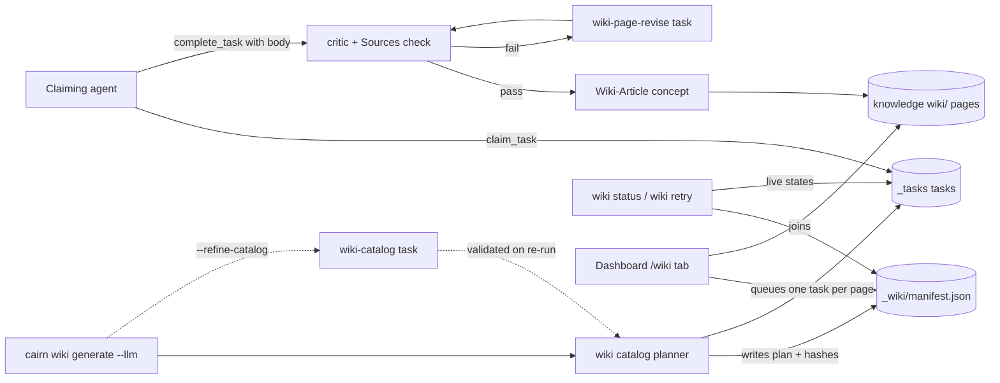
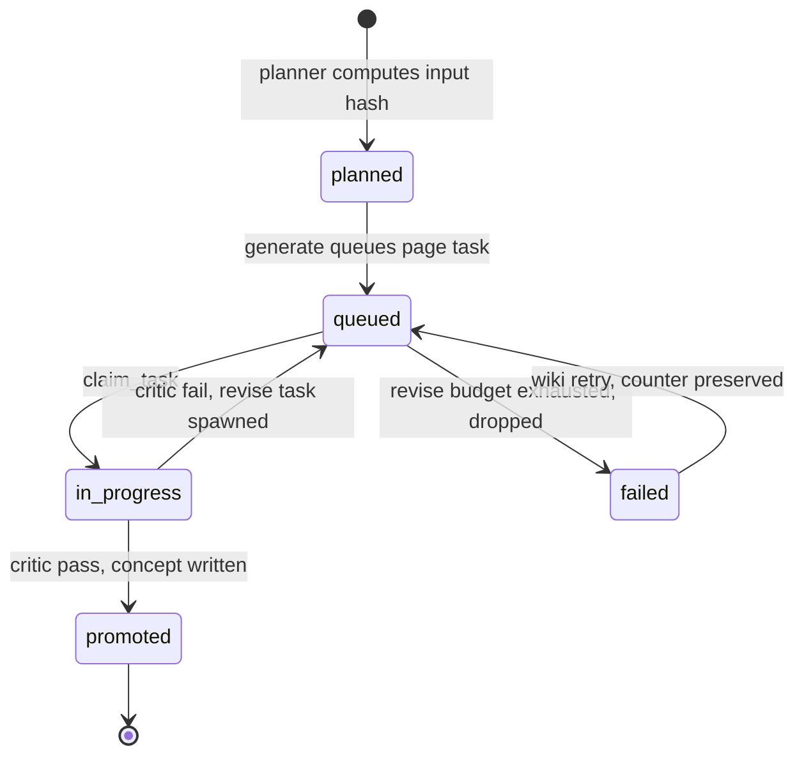

# Tech Spec: wiki-generation

**Spec**: [spec.md](spec.md) | **Survey**: [survey.md](survey.md) | **Created**: 2026-08-31
**Every file/symbol citation below comes verbatim from [survey.md](survey.md)
or from this session's cairn MCP tool output (§ Impact analysis) — never from
memory.**

## Architecture

Cairn never calls an LLM (architecture invariant); all writing flows through
the existing task queue (`src/cairn/llm/tasks.py:create_task:64` is
kind-agnostic — "any new kind works with zero queue changes"). This feature is
therefore a thin orchestration layer over machinery that already exists: a
deterministic **catalog planner** turns the graph into a page plan, **queues**
one `wiki-page` task per page, and a manifest records the plan so a claiming
agent's `complete_task` (which already runs the critic, promotes on pass, and
spawns bounded revises on fail) can gate each page into the knowledge base.

Dotted path: the opt-in `--refine-catalog` refinement (D-003) — the default
path is fully deterministic. The promotion/revise half of the diagram is
today's generic `complete_task` machinery (survey: compass branch at tasks.py
lines 307-328, flow branch at lines 330-352, revise spawn at lines 368-403);
this feature adds a third, wiki-shaped branch alongside them rather than a new
pipeline.

Per-page lifecycle tracked by the manifest (D-006):

## Solution

### Chosen approach

New code lives in three small modules (`src/cairn/wiki/catalog.py` planner,
`src/cairn/wiki/manifest.py` state, `src/cairn/wiki/sources.py` footer
parser) plus additive edits to the four existing surfaces (CLI, task kinds,
MCP server, dashboard). FR coverage:

| FR | Solution element | Decision |
|----|------------------|----------|
| FR-001 | `wiki/catalog.py`: overview page + modules ranked by cross-module incoming edge degree, `--pages` cap (default 10), per-page input hash | D-005 |
| FR-002 | `wiki-page` kind: full output spec in `_output_spec` (Sources footer, facts.diagrams-gated Mermaid fences, no out-of-graph refs); queueing loop in generate | — |
| FR-003 | Third promotion branch in `complete_task` writing `type="Wiki-Article"` at `wiki/pages/{repo}/{page_id}` with `sources` frontmatter + lineage extensions | D-001, D-007 |
| FR-004 | Existing revise cycle unmodified (kind-agnostic; survey status DONE) | — |
| FR-005 | `wiki/manifest.py`: JSON manifest, atomic `set_config_values` write pattern, skip-on-unchanged-hash | D-006 |
| FR-006 | `cairn wiki status` / `cairn wiki retry` joining manifest with live task state | D-006, D-008 |
| FR-007 | `wiki-catalog` kind + entry validator; catalog resolves on a re-run of generate, no completion hook | D-003 |
| FR-008 | `wiki_generate` tool in new `tools_wiki.py`; count 27 → 28 with coordinated bumps | — |
| FR-009 | Dashboard `/wiki` route + `wiki.html` + stdlib escape-first markdown renderer | D-002 |
| FR-010 | No new search code: identity convention (D-007) lands inside `bundle.search` + compass `_search_wiki`; MCP `knowledge_search` scoping confirmed, untouched | D-004 |
| FR-011 | Four doc touchpoints + CHANGELOG `[Unreleased]` | — |

**FR-001 — catalog planner.** No page planner exists (survey gap: "No module-degree
ranking (files table has no module/directory column — module must be derived from
files.path; schema at src/cairn/graph/schema.py lines 24-33)"). The planner derives
modules from `files.path` prefixes (the only module notion in the codebase —
`src/cairn/graph/stats.py:group_by_top_level:67` buckets "first 2-3 path segments"),
ranks them by incoming edge degree (D-005), always includes an overview page, caps at
`--pages`, and hashes each page's canonical inputs (sorted seed files + symbols +
module prefix) with stdlib `hashlib` for FR-005 skip logic.

**FR-002 — task kinds.** `create_task` needs zero changes; the work is the output
spec: today `"wiki": "Write an architectural wiki article in markdown. Only reference
graph-verified symbols."` (`src/cairn/llm/tasks.py:_output_spec:501` line 527) is a
placeholder with "no Sources footer, no Mermaid gating, no no-external-refs rule".
Register `wiki-page`, `wiki-page-revise`, `wiki-catalog`, `wiki-catalog-revise`
(revise kinds are derived by appending `-revise`, tasks.py lines 373-376 — register
them defensively). Diagram gating rides `facts.diagrams` through the verbatim facts
pass-through (`src/cairn/llm/tasks.py:Task:42`; only memory-* facts are mutated,
tasks.py lines 81-87) and is rendered into the body by
`src/cairn/llm/tasks.py:_render_body:484`.

**FR-003/FR-004 — critic gate + promotion.** `complete_task` gets a third promotion
branch (after compass tasks.py lines 307-328 and flow lines 330-352) keyed on
`task_kind.startswith("wiki-page")`, writing the D-007 concept. The Sources footer
parser (`wiki/sources.py`) extracts footer entries (tolerating list and inline-link
forms, per spec risk mitigation) using the existing backtick machinery
(`src/cairn/refs.py:extract_file_refs:38`, `src/cairn/refs.py:extract_symbol_refs:50`,
`src/cairn/refs.py:file_exists:67`, `src/cairn/refs.py:symbol_exists:83`,
`BACKTICK_RE` at refs.py:19); unresolved entries are errors. The revise cycle
(`MAX_REVISE_CYCLES = 3` at tasks.py:28; drop path lines 404-419) fires unmodified —
survey already marks FR-004's mechanism **DONE**: "it works unmodified for a future
wiki-page kind".

**Critic quality gate (D-001).** Survey observed the failure mode directly: the
deterministic wiki page scores "quality 0.00 errors 0 warnings 0" because the
heuristic is "fraction of 5 known section headings present" (`src/cairn/compass/critic.py:critic_concept:38`
lines 73-90) — compass-shaped headings a wiki article never has; with
`passed = len(errors) == 0 and quality >= (0.7 if warnings else 0.5)` (lines 94-95)
a wiki completion "would ALWAYS fail promotion into revise cycles". Fix: an optional
`section_vocab` keyword on `critic_concept` (default = current compass list, so all
15 existing callers keep their behavior); `complete_task` passes a wiki vocabulary —
`("## Sources",)` — when the kind starts with `wiki`. Quality stays the same
"fraction of vocab present" formula, so the threshold machinery (lines 94-95) is
untouched: footer present → quality 1.0 → passes with warnings; footer missing →
quality 0.0 → revise. The Sources footer is the right signal because FR-002 makes it
the one structural requirement of a wiki page, and the critic's reference checks
(file refs → errors at critic.py line 51, symbol refs → warnings at line 57) already
verify its contents.

**FR-005 — manifest.** No manifest exists ("rg 'manifest' src/cairn/ this session
matches only `src/cairn/bench/datasource.py`"). D-006: JSON at
`<knowledge>/_wiki/manifest.json` with a schema marker (the bench precedent uses
`MANIFEST_SCHEMA = "cairn-bench-datasource-n"` for exactly this shape), written with
the `src/cairn/paths.py:set_config_values:292` pattern (mkstemp in target dir →
flush + `os.fsync` → `os.replace` at line 315 → unlink-on-error lines 316-321 →
False on OSError lines 322-326). Skip rule: recorded input hash == current plan hash
AND promoted concept readable (`bundle.read_concept`) → skip, unless `--force`.

**FR-006 — status/retry.** New subcommands on the `src/cairn/cli/wiki.py:wiki:9`
group (today exactly `wiki_generate:21` + `wiki_search:74`). `status` joins manifest
pages with live task state (`src/cairn/llm/tasks.py:list_tasks:101` filters by
status/kind; `get_task` at tasks.py:451) and detects promoted by concept presence —
complete_task is generic and must not learn about wiki manifests (D-006). `retry`
re-queues exactly failed/dropped pages with a fresh task chain, preserving the
manifest's cumulative attempt counter (D-008).

**FR-007 — refine-catalog.** Mirrors the only queueing precedent:
`src/cairn/cli/compass.py` lines 96-99 gather facts then
`create_task(bundle, "compass-synthesize", module, facts=facts)` and echo
claim/complete instructions (lines 100-105). With `--refine-catalog`, generate
queues one `wiki-catalog` task and stops; a **re-run** of generate finds the
completed catalog result, validates it (every entry's module/files must resolve —
validator over `files.path` matching plus `src/cairn/refs.py:file_exists:67` for
seed files; invalid entries revert to the deterministic entry), then spawns page
tasks. No completion hook is added to the queue (D-003).

**FR-008 — MCP tool.** New `src/cairn/mcp_server/tools_wiki.py` following the
tools_knowledge.py lines 31-58 pattern (`@mcp.tool(annotations=ToolAnnotations(...))`
over `@instrument`, primitive args only, lazy body imports, `_clamp` for ints),
returning page plan + queued ids as a prose string. Coordinated bumps:
`_EXPECTED_TOOL_COUNT = 27` at `src/cairn/mcp_server/server.py:55` → 28;
`tests/test_status_resource_health.py` line 281; `tests/test_server_robustness.py`
line 192; `tests/test_agent_surface.py` line 11; `docs/mcp-tools.md` line 21 heading
("The 27 tools by layer" — the heading text itself carries the count). The raw grep
count today is "the 28th raw `@mcp.tool` grep hit is the docstring line at
src/cairn/mcp_server/tools_graph.py:6" — count decorated functions, not grep hits.

**FR-009 — dashboard.** Follows the existing pattern exactly: route in the
`src/cairn/dashboard/app.py` route table lines 925-965 (inside
`src/cairn/dashboard/app.py:create_app:191`), handler using the `render` helper
(app.py lines 301-308), data function in the
`src/cairn/dashboard/data.py:get_task_queue:613` /
`src/cairn/dashboard/data.py:get_recent_memories:587` shape (take knowledge_dir,
wrap OKFBundle reads, return plain dicts, skip unreadable concepts), reading the
manifest + `bundle.list_concepts` over `wiki/pages/`. Markdown rendering is D-002
(stdlib escape-first renderer — "NO template renders markdown today", verified
absence in survey). Store selection via
`src/cairn/dashboard/app.py:resolve_selection:310`.

**FR-010 — first-class knowledge, confirmed not rebuilt.** Wiki concepts are plain
OKF concepts, so "bundle-wide search reaches them:
`src/cairn/okf/bundle.py:search:182` scores title/description/body/tags with no area
filter (used by `cairn wiki search`, cli/wiki.py lines 74-86); compass routing has a
wiki layer" (router.py line 39, line 108, `_search_wiki` at line 237). The only
substantive work is the identity convention (D-007) so promoted pages carry
`sources` frontmatter — the field exists and is never populated today
(`src/cairn/okf/concept.py:OKFConcept:59` declares it at line 77; `to_markdown:166`
emits it only `if self.sources` at lines 190-191; producer census: "no code
constructs a concept with sources"). Frontmatter is otherwise structurally
unchanged ("to_markdown preserves all current fields", concept.py lines 166-197).

**FR-011 — docs.** Touchpoints: `docs/cli-reference.md` section at line 73
(`## Compass / wiki / tasks / dataflow`), `docs/mcp-tools.md` line 21,
`docs/knowledge-and-memory.md` line 82 (`## Compass, wiki, and the LLM task
queue`), `CHANGELOG.md` `## [Unreleased]` at line 14 with open `### Added` at
line 16.

### Alternatives rejected

| Alternative | Why rejected |
|-------------|--------------|
| New markdown dependency (mistune/markdown-it-py) for FR-009 | C-03 dependency gate — every runtime dep widens the wheel/platform matrix; the renderer is ~80 lines of stdlib over agent-written, graph-constrained bodies |
| Completion hook in `complete_task` spawning page tasks when `wiki-catalog` completes | Turns the generic queue into a workflow engine; grows the symbol's blast radius (9 direct callers, 8 pinned tests) with wiki-specific orchestration; the compass.py queue-and-instruct precedent already covers agent-decoupled sequencing |
| Critic vocab selection keyed on `concept.type` ("Wiki-*") inside `critic_concept` | The promotion-critical call site criticizes the **Task-Result** concept (tasks.py lines 267-275, critic run at line 290), whose type does not encode the task kind — type-keyed selection is blind exactly where it matters |
| Escaped `<pre>` body rendering in the dashboard | US6 AC1 requires "open a page rendered as markdown"; preformatted text does not satisfy it |
| Widening MCP `knowledge_search` to include `wiki/` concepts | The scoping is deliberate (`src/cairn/knowledge/search.py` line 89: "we only want knowledge/prefixed concepts"); compass-layer `search_knowledge`/`ask_compass` is the wired path — don't fight the scoping |
| Reusing `group_by_top_level`'s symbol-count ranking for page selection | FR-001 mandates incoming reference degree; survey: the bucket function is "ranked by symbol count, NOT by incoming degree" |
| Manifest stored as a `.md` concept inside the bundle | `src/cairn/okf/bundle.py:list_concepts:144` "rglob *.md, skips index.md/log.md" — the manifest would surface as a concept and pollute listing/search |
| Retry carrying the spent attempt chain (`parent_attempt` = dropped attempt) | The revise budget is per-chain (`if task.attempt < MAX_REVISE_CYCLES:`, tasks.py lines 368-403); carrying a chain dropped at the cap guarantees an instant re-drop — retry must start a fresh chain (D-008) |

## Impact analysis

Mapped this session with the repo's own cairn MCP tools (precise mode unless
stated; per AGENTS.md, precise is ground truth for blast radius, fuzzy results
are candidates to verify).

- **`complete_task` (`src/cairn/llm/tasks.py:complete_task:210`) — biggest blast
  radius.** `impact_analysis` precise: **9 direct callers**, 8 affected tests:
  `test_critic_on_pass_marks_status_and_returns_correct_dict`,
  `test_critic_fail_spawns_revise_when_below_max_cycles`,
  `test_critic_fail_drops_when_at_or_above_max_cycles`,
  `test_return_dict_shape_exact_match` (tests/test_tasks_safety.py),
  `test_memory_extract_result_redacted`, `test_non_memory_task_result_untouched`
  (tests/test_redaction_chokepoints.py), `test_flow_task_promoted_on_critic_pass`,
  `test_flow_revise_spawned_on_critic_fail` (tests/test_trace_flow.py). Our change
  is additive (new branch keyed on kind); the exact return-dict-shape test is the
  trap — the outcome dict shape must not drift for non-wiki kinds.
- **`_output_spec` (`src/cairn/llm/tasks.py:_output_spec:501`)** — `get_callers`
  precise: 2 callers, `_build_prompt` (`src/cairn/llm/client.py:170`) and
  `_render_body` (`src/cairn/llm/tasks.py:496`). New dict entries are additive;
  both consumers are lookup-style. Caveat: survey does not state the unknown-kind
  fallback behavior — `unknown — verify`; registering the `-revise` kinds
  defensively sidesteps it.
- **`_EXPECTED_TOOL_COUNT` (`src/cairn/mcp_server/server.py:55`)** —
  `impact_analysis` returns **0 in both precise and fuzzy mode**: it is a
  module-level constant, and call-graph tools record call *edges*, not data reads
  (the precise-vs-fuzzy caveat here is that neither mode sees constant consumers).
  Real consumers come from survey + `get_callers` on
  `src/cairn/mcp_server/server.py:verify_tool_count:162` (3 callers: `run` at
  server.py line 201, `test_tool_count_unchanged_at_27`
  tests/test_status_resource_health.py:280, `test_tool_count_assertion`
  tests/test_server_robustness.py:191), plus tests/test_agent_surface.py line 11
  and docs/mcp-tools.md line 21.
- **`critic_concept`** — `get_callers` precise: **15 callers** (complete_task,
  generate_wiki_with_critic, cli/validate verify, five compass CLI handlers,
  generate_compass_with_llm, ask_compass, generate_flow, 4 test call sites). The
  `section_vocab` keyword must be optional-with-default so none of the 15 change
  behavior.
- **`create_task`** — `get_callers` precise: **27 call sites** (compass CLI,
  memory CLI, llm client `_run_task`, complete_task's own revise spawn, plus test
  seeders). Signature is already kind-agnostic; we add callers, not parameters.
- **`group_by_top_level`** — `get_callers` precise: 2 callers (`get_tree`
  stats.py:64, `get_repo_graph` viz/query.py:158). Read-only reuse in the planner;
  no signature change.
- New modules (`wiki/catalog.py`, `wiki/manifest.py`, `wiki/sources.py`,
  `mcp_server/tools_wiki.py`, dashboard renderer/data/route/template) have zero
  existing callers — blast radius is confined to the coordinated-count bumps and
  the two additive branches above.
- What breaks if the approach is wrong: an over-broad critic vocab change breaks
  compass/flow promotion for all 15 `critic_concept` consumers; a manifest format
  mistake corrupts only regenerate/retry (self-healing via `--force`); a wrong
  tool count fails `verify_tool_count` at server startup (`run()` calls it at
  server.py line 201 — "deliberately not an import-time assert").

## Code guide

Canonical invocation for every verify run (survey: "used for every verify run
this session"; CAIRN_LIB override at src/cairn/paths.py:117):
`CAIRN_LIB=/tmp/__no_such_lib__ uv run --extra test pytest <paths> -q`

### Catalog planner (FR-001)
- Touches: new `src/cairn/wiki/catalog.py`; reads over the substrate
  `src/cairn/graph/stats.py:get_stats:17`,
  `src/cairn/graph/stats.py:group_by_top_level:67` (module = "first 2-3 path
  segments", "legacy absolute-path strip"), incoming-degree JOIN precedent
  (`wiki/generator.py lines 59-67` — `COUNT(e.id) AS incoming ... ORDER BY
  incoming DESC LIMIT 10`), schema facts from `src/cairn/graph/schema.py`
  (files at lines 24-33: id, repo_id, path, language, hash, line_count,
  indexed_at — no module column).
- Approach: `build_page_plan(conn, repo, pages_cap, ...)` → overview page +
  modules ranked by cross-module incoming edge degree (D-005), ties broken by
  module name ASC (determinism); seeds = top symbols by the generator's JOIN +
  module file paths; input hash = sha256 over canonical JSON of the plan entry.
- Verify before implementing: `CAIRN_LIB=/tmp/__no_such_lib__ uv run --extra test pytest tests/test_tasks_safety.py tests/test_compass_critic.py -q` (baseline: 24 passed — planner substrate imported by the wiki generator works)
- Pitfalls: `group_by_top_level` is "ranked by symbol count, NOT by incoming
  degree" — do not reuse its ordering; legacy absolute paths in files.path (the
  bucket function strips them); empty graph must fail cleanly (US1 AC3: exit 1,
  nothing queued — follow `sys.exit(1)` convention, cli/task.py lines 44, 76,
  97, 109).

### Task kinds + output specs (FR-002)
- Touches: `src/cairn/llm/tasks.py:_output_spec:501` (add wiki-page,
  wiki-page-revise, wiki-catalog, wiki-catalog-revise entries — today only the
  one-line `"wiki"` spec at line 527); queueing loop in cli/wiki.py +
  tools_wiki.py calling `src/cairn/llm/tasks.py:create_task:64` unchanged.
- Approach: full spec text (markdown article ending in `## Sources`; Mermaid
  fences only when `facts.diagrams`; references restricted to the graph);
  `diagrams` rides facts verbatim (only memory-* strip, tasks.py lines 81-87),
  rendered by `src/cairn/llm/tasks.py:_render_body:484` as
  "## Facts (graph-grounded — do not invent beyond these)".
- Verify before implementing: `CAIRN_LIB=/tmp/__no_such_lib__ uv run --extra test pytest tests/test_tasks_safety.py -q` (baseline: 8 passed)
- Pitfalls: `test_return_dict_shape_exact_match` pins the outcome dict shape;
  revise kind mapping appends `-revise` to non-`-synthesize` kinds (tasks.py
  lines 373-376), so the revise variants must exist in the spec dict or fall to
  unknown-kind behavior (`unknown — verify` the fallback; register defensively).

### Sources parser + promotion branch (FR-003)
- Touches: new `src/cairn/wiki/sources.py`; third branch in
  `src/cairn/llm/tasks.py:complete_task:210` after the flow branch (tasks.py
  lines 330-352); concept construction against
  `src/cairn/okf/concept.py:OKFConcept:59` (`sources` field at line 77; parse
  pops it at concept.py line 120; `to_markdown:166` emits only when truthy,
  lines 190-191); ref validation via `src/cairn/refs.py:file_exists:67` /
  `symbol_exists:83`.
- Approach: parse the `## Sources` footer tolerating list and inline-link forms
  (spec risk mitigation); every footer entry must resolve or the critic errors;
  on pass, write the D-007 Wiki-Article with `sources` frontmatter from verified
  entries + lineage extensions (page id, input hash).
- Verify before implementing: `CAIRN_LIB=/tmp/__no_such_lib__ uv run --extra test pytest tests/test_tasks_safety.py tests/test_compass_critic.py -q` (baseline: 24 passed)
- Pitfalls: the Task-Result sibling is written even on fail (tasks.py lines
  293-297) — do not double-write; critic exception is a non-failure that
  promotes nothing (lines 420-429); ownership guard drops mismatches (lines
  237-248); today "a passed task whose kind matches neither returns
  `promoted: False` (line 362)" — the new branch must sit inside the
  critic-passed region.

### Critic section vocabulary (FR-003/FR-004 gate)
- Touches: `src/cairn/compass/critic.py:critic_concept:38` (optional keyword
  only); the quality formula at critic.py lines 73-90 and threshold at lines
  94-95 stay intact; call site `complete_task` passes the wiki vocab for
  `wiki*` kinds.
- Approach: D-001 — wiki vocab = `("## Sources",)`; footer present → 1.0, else
  0.0; `CriticResult` (`src/cairn/compass/critic.py:CriticResult:28`) unchanged.
- Verify before implementing: `CAIRN_LIB=/tmp/__no_such_lib__ uv run --extra test pytest tests/test_compass_critic.py -q` (baseline: 16 passed)
- Pitfalls: 15 precise callers (see § Impact analysis) — a default-arg change
  only; do NOT auto-key on `concept.type` (blind at the Task-Result call site)
  and do NOT touch the deterministic generator's informational critic run — spec
  scope: "Deterministic (no-LLM) `wiki generate` behavior stays as-is" (its
  observed 0.00 verdict is informational only; cli/wiki.py prints verdicts,
  write proceeds regardless — `generate_wiki_with_critic:31`).

### Manifest + status/retry (FR-005/FR-006)
- Touches: new `src/cairn/wiki/manifest.py`; atomic write copying
  `src/cairn/paths.py:set_config_values:292` (mkstemp → fsync →
  `os.replace` at line 315 → unlink lines 316-321 → False on OSError lines
  322-326); format mirrors the JSON+schema-marker precedent
  `src/cairn/bench/datasource.py` (`MANIFEST_SCHEMA = "cairn-bench-datasource-n"`);
  CLI on the `src/cairn/cli/wiki.py:wiki:9` group following its conventions
  (`from .main import DEFAULT_DB_PATH, get_db, main` at cli/wiki.py:6;
  `--knowledge` default at cli/wiki.py:16, 73); live-state join via
  `src/cairn/llm/tasks.py:list_tasks:101` (status=/kind= filters) and `get_task`
  (tasks.py:451).
- Approach: D-006/D-008 — `_wiki/manifest.json`, per-page {plan entry,
  input_hash, task_id, state, attempts}; promoted detected by reading the
  concept, not by complete_task callbacks; retry re-queues failed/dropped with
  fresh task chains and preserves the cumulative attempt counter.
- Verify before implementing: `grep -rn manifest src/cairn/wiki/ src/cairn/llm/ src/cairn/cli/wiki.py` (survey baseline: no manifest code in the wiki/task surface)
- Pitfalls: `OKFConcept.to_file` (`src/cairn/okf/concept.py:to_file:145`,
  os.replace at line 159) writes markdown — the manifest is JSON; keep it
  non-`.md` so `bundle.py:list_concepts:144` (rglob *.md) never lists it;
  dropped tasks end in the queue's dropped outcome (tasks.py lines 404-419,
  `dropped: True`) — status/retry must treat "failed + exhausted chain" as
  dropped; display helpers exist (`src/cairn/cli/display.py:rail:517`,
  success/warning/error/info at lines 66-82) but task/wiki commands use plain
  echo today.

### Refine-catalog (FR-007)
- Touches: `--refine-catalog` flag on `src/cairn/cli/wiki.py:wiki_generate:21`
  (today only --repo/--db/--knowledge/--dry-run/--show-rejections, lines 14-20);
  `wiki-catalog` kind + output spec; entry validator over `files.path` prefix
  matching (the `get_module_graph` precedent matches `WHERE f.path LIKE ?`,
  `src/cairn/viz/query.py:get_module_graph:190`) plus
  `src/cairn/refs.py:file_exists:67` for seed files.
- Approach: D-003 — generate queues the catalog task and returns (mirroring
  `src/cairn/cli/compass.py` lines 96-105); the re-run reads the completed
  catalog result, validates entries (invalid → deterministic entry kept), then
  queues page tasks.
- Verify before implementing: `grep -rn 'wiki-catalog\|refine.catalog' src/ tests/` (survey baseline: no matches)
- Pitfalls: no task-spawns-tasks-on-completion hook exists "beyond the revise
  cycle" — do not add one; the catalog result arrives as a Task-Result sibling
  (`src/cairn/llm/tasks.py:read_result` at tasks.py:442), not a promoted
  concept.

### MCP tool (FR-008)
- Touches: new `src/cairn/mcp_server/tools_wiki.py` (pattern: tools_knowledge.py
  lines 31-58 — `@mcp.tool(annotations=ToolAnnotations(...))` over
  `@instrument`, primitive args, lazy body imports, `_clamp` for LLM ints);
  import side effect added at server.py lines 49-52 (against the FastMCP
  singleton `src/cairn/mcp_server/_server_core.py` mcp at line 78, helpers
  `_conn:159` / `_rw_conn:212` / `_bundle:222`); `_EXPECTED_TOOL_COUNT` at
  `src/cairn/mcp_server/server.py:55` 27 → 28; coordinated bumps in
  tests/test_status_resource_health.py:281, tests/test_server_robustness.py:192,
  tests/test_agent_surface.py:11, docs/mcp-tools.md:21.
- Approach: D-009 — `wiki_generate(repo, pages, refine_catalog, diagrams,
  force)` returning the page plan + queued task ids as a prose string (the
  tools_knowledge shape; the Pydantic structured-output route exists at
  `src/cairn/mcp_server/structured.py:31` `class GetCallersResult(BaseModel)` +
  tools_graph.py line 80 if later needed).
- Verify before implementing: `CAIRN_LIB=/tmp/__no_such_lib__ uv run --extra test pytest tests/test_status_resource_health.py -q` (baseline: 11 passed, pins `_EXPECTED_TOOL_COUNT == 27` at line 281)
- Pitfalls: the count assert fires from `run()` (server.py line 201), not at
  import — a wrong count surfaces at server start, not in unit collection; raw
  grep of `@mcp.tool` yields 28 hits today because of the docstring line at
  src/cairn/mcp_server/tools_graph.py:6 — count decorated functions.

### Dashboard wiki tab (FR-009)
- Touches: route + handler in `src/cairn/dashboard/app.py` (route table lines
  925-965, e.g. `Route("/tasks", tasks, name="tasks")` at line 943; handlers
  via the `render` helper at app.py lines 301-308; store selection
  `resolve_selection:310`); data function beside
  `src/cairn/dashboard/data.py:get_task_queue:613` /
  `get_recent_memories:587` (wrap OKFBundle, plain dicts, skip unreadable);
  template beside `src/cairn/dashboard/templates/tasks.html` (badge/table style,
  lines 18-45); new stdlib markdown renderer module (pure functions — no
  starlette/uvicorn/jinja2 imports, keeping the guard green).
- Approach: D-002 — `/wiki` list (page + state badges) and `/wiki/{page_id}`
  detail rendering the promoted body via the escape-first renderer with sources
  listed; data = manifest + `wiki/pages/` concepts.
- Verify before implementing: `CAIRN_LIB=/tmp/__no_such_lib__ uv run --extra test pytest tests/test_dashboard_app.py -q` (includes `test_importing_dashboard_never_loads_server_stack` at tests/test_dashboard_app.py line 41)
- Pitfalls: "NO template renders markdown today — rg for markdown/md_to_html
  across src/cairn/dashboard/templates/ returns nothing" — the renderer is new
  code, not a template feature; escape HTML **before** any construct rendering;
  heavy imports stay inside create_app/data functions (import-guard test); DB
  access, if any, goes through `src/cairn/dashboard/data.py:get_read_only_db:1069`
  (mode=ro enforced, pinned by tests/test_dashboard_app.py:56).

### Docs + CHANGELOG (FR-011)
- Touches: `docs/cli-reference.md` (section `## Compass / wiki / tasks /
  dataflow` at line 73), `docs/mcp-tools.md` (`## The 27 tools by layer` at
  line 21 — heading text carries the count), `docs/knowledge-and-memory.md`
  (`## Compass, wiki, and the LLM task queue` at line 82), `CHANGELOG.md`
  (`## [Unreleased]` line 14, `### Added` line 16, Keep-a-Changelog prose
  bullets).
- Approach: document `generate --llm/--pages/--refine-catalog/--diagrams/--force`,
  `status`, `retry`, the `wiki_generate` tool, and the manifest workflow.
- Verify before implementing: `grep -n 'wiki' docs/cli-reference.md docs/mcp-tools.md | head` (baseline: current wiki mentions are the deterministic commands only)
- Pitfalls: cli/__init__.py docstring says "The 49 commands live in split
  modules" but the recount is 47 decorator lines — treat 49 as stale prose; do
  not propagate the number.

## References

- [research.md](research.md) — ZCode "Generate Project wiki" as-shipped
  (extracted from the app bundle 2026-08-31): two-phase catalog→pages pipeline,
  Sources footers, per-page retries, incremental regeneration; the porting
  translation table maps each ZCode mechanism to its cairn equivalent.
- [spec.md](spec.md) — FRs, ACs, scope, and the plan-time decisions
  (deterministic default + opt-in refine; CLI+MCP+dashboard in v1; English
  only).
- [survey.md](survey.md) — baseline 0.16.0 @ 264647ae4cf286e7efed52afc87d98589b81258a;
  all citations above.
- specs/CONSTITUTION.md — C-03 dependency gate ("no new runtime dependency
  without a tech-spec `D-###` decision recording why and what it costs";
  "every runtime dep widens the wheel/platform matrix ... additions must be a
  recorded decision, not an import-time accident") — grounds D-002.

## Decisions

### D-001: Wiki critic gate = per-kind section vocabulary, Sources footer as the wiki quality signal
- **Context**: `critic_concept` scores quality as "fraction of 5 known section
  headings present" (critic.py lines 73-90) and `passed = len(errors) == 0 and
  quality >= (0.7 if warnings else 0.5)` (lines 94-95); survey observed the
  deterministic wiki page scoring "quality 0.00" — a wiki completion would
  always fail and spin in revise cycles. The promotion-critical call site
  criticizes the Task-Result concept, so concept-type-keyed selection is blind.
- **Decision**: add an optional `section_vocab` parameter to `critic_concept`
  (default: current compass behavior, all 15 callers unchanged);
  `complete_task` passes `("## Sources",)` when `task_kind` starts with
  `wiki`. Quality remains the fraction-of-vocab formula; refs checks and the
  prose-heavy warning are untouched. The deterministic generator's
  informational critic run is deliberately NOT changed (scope freeze).
- **Consequences**: a wiki completion missing the footer fails with quality 0.0
  → revise (FR-004); warnings never block a footer-bearing page; compass/flow
  gating is bit-identical to today.

### D-002: Dashboard renders markdown with a stdlib escape-first renderer (no new dependency)
- **Context**: no dashboard template renders markdown (verified absence);
  C-03 forbids casual runtime deps (wheel/platform matrix cost).
- **Decision**: hand-rolled renderer (~80 lines, `html` + `re` stdlib):
  HTML-escape everything first, then whitelist block constructs — headings,
  paragraphs, lists, fenced code (mermaid fences rendered as static
  `<pre class="language-mermaid">` code, not live diagrams). Lives in a pure
  module with no server-stack imports (import-guard test).
- **Consequences**: no live mermaid rendering in v1 (static code display); no
  inline-HTML passthrough (security by construction); if richer markdown is
  ever needed, adding a dep requires a new D-### under C-03.

### D-003: Refine-catalog resolves on re-run of generate, not via a queue completion hook
- **Context**: the queue has "no task-spawns-tasks-on-completion hook beyond
  the revise cycle"; a hook would couple generic `complete_task` (9 direct
  callers, 8 pinned tests) to wiki orchestration.
- **Decision**: with `--refine-catalog`, generate queues one `wiki-catalog`
  task and returns with instructions (compass.py lines 96-105 precedent); a
  subsequent generate run finds the completed catalog result, validates it
  (invalid entries → deterministic entry kept), and queues page tasks. The
  deterministic path queues pages in the same single run.
- **Consequences**: refinement costs one extra invocation (returned in the
  tool/CLI output so agents know); no new queue machinery; concurrent generate
  runs are safe because the manifest is read before queue decisions and written
  atomically.

### D-004: FR-010 "searchable" = bundle search + compass routing; MCP `knowledge_search` scoping confirmed, unchanged
- **Context**: `src/cairn/knowledge/search.py` line 89 scopes the business-docs
  searcher to "knowledge/ prefixed concepts" by design; wiki concepts are
  already reached by `src/cairn/okf/bundle.py:search:182` (no area filter) and
  the compass wiki layer (router.py lines 39, 108, `_search_wiki` at line 237).
- **Decision**: satisfy FR-010 via the D-007 identity convention landing inside
  those wired paths; do not widen `knowledge_search` to `wiki/`.
- **Consequences**: `cairn wiki search` and `ask_compass`/`search_knowledge`
  surface promoted pages; the MCP knowledge_search tool deliberately does not —
  that is the existing contract, not a gap.

### D-005: Module-degree ranking = cross-module incoming edges over path-prefix modules
- **Context**: no module-degree query exists; `files` has no module column
  (schema lines 24-33); `group_by_top_level` ranks by symbol count;
  `get_module_graph` (lines 218-226) ranks symbols by fan-in+fan-out with
  vendored/test exclusions; the generator's JOIN (generator.py lines 59-67) is
  the symbol-level incoming-degree precedent.
- **Decision**: a module is a first-2-3-path-segment prefix of `files.path`
  (same bucketing as `group_by_top_level:67`); a module's incoming degree =
  count of edges whose target symbol's file is under the prefix and whose
  source symbol's file is not (cross-module references only — prevents a large
  self-referential module from always winning, in the spirit of
  `get_module_graph`'s exclusions); ranking is degree DESC, module name ASC;
  the overview page is always planned first, then top modules up to `--pages`.
- **Consequences**: deterministic and reproducible; unconventional layouts may
  pick odd boundaries (spec risk) — mitigated by the `--pages` cap and the
  refine-catalog path; the degree SQL is planner-local, so
  `group_by_top_level`'s 2 existing callers are untouched.

### D-006: Manifest = JSON at `<knowledge>/_wiki/manifest.json`, atomic set_config_values write; promoted state derived, not pushed
- **Context**: no manifest exists; the atomic-write precedent is
  `set_config_values:292` (fsync-before-replace, unlink-on-error, False on
  OSError); a `.md` manifest inside the bundle would be listed by
  `list_concepts:144` (rglob *.md); `complete_task` is generic and must not
  learn about wiki manifests.
- **Decision**: JSON document with schema marker `"cairn-wiki-manifest-1"`
  (mirroring `MANIFEST_SCHEMA = "cairn-bench-datasource-n"`), under a
  non-concept `_wiki/` directory inside the knowledge root (co-located with
  `_tasks`, survives workspace moves since it rides `knowledge_root`); per page:
  plan entry, input hash, task id, state, cumulative attempts. `status`/`retry`
  join manifest rows with live task state (`list_tasks`/`get_task`) and detect
  promoted by reading the `wiki/pages/...` concept; the manifest is written
  only by generate/retry.
- **Consequences**: crash-safe writes (a crash cannot persist a zero-length
  manifest, per the fsync comment at paths.py lines 309-314); concurrent
  generates serialize on read-before-queue + atomic replace; promotion state is
  always consistent with the bundle by construction (single source of truth:
  the concept file).

### D-007: Wiki-Article identity — `type="Wiki-Article"`, `concept_id=wiki/pages/{repo}/{page_id}`, tags `[repo, "wiki"]`
- **Context**: the existing producer writes `type="Wiki-Architecture"`,
  `concept_id=f"wiki/architecture/{repo}"` (generator.py lines 97, 103) with
  tags `[repo, "architecture"]` (lines 97-104); concept_id is the
  bundle-root-relative path without `.md`; the wired search paths reach
  concepts under the `wiki/` prefix.
- **Decision**: promoted pages use `type="Wiki-Article"` (the spec's name),
  `concept_id = f"wiki/pages/{repo}/{page_id}"` where `page_id` is a
  filesystem-safe slug (module path with `/` → `-`, matching the flow branch's
  safe-id pattern, tasks.py lines 330-352; overview → `overview`), tags
  `[repo, "wiki"]` (repo first, matching the existing convention so tag-scoped
  searches keep working), `sources` frontmatter from the verified footer, and
  extensions carrying `page_id`, `input_hash`, `task_id`, `refine_catalog`.
- **Consequences**: lands inside `bundle.search` (scores tags) and
  `_search_wiki` with zero search-code changes; coexists with the deterministic
  `wiki/architecture/{repo}` page (different subtree); FR-010's
  "frontmatter unchanged apart from sources" holds via `to_markdown:166`
  emission rules.

### D-008: Retry starts a fresh task chain; the manifest preserves the cumulative attempt counter
- **Context**: US3 AC2 requires attempt counters preserved; the queue's revise
  budget is per-chain (`if task.attempt < MAX_REVISE_CYCLES:`, tasks.py lines
  368-403; drop at the cap, lines 404-419), so re-queueing with a spent
  `parent_attempt` guarantees an instant re-drop.
- **Decision**: `wiki retry` bumps the page's cumulative `attempts` in the
  manifest (for display/audit — nothing is reset to hide failures) and creates a
  new task with a fresh chain (`parent_attempt=0`); promoted pages are never
  touched.
- **Consequences**: each retry grants a full bounded revise budget again
  (matching the ported feature's "per-page retries" semantics); the manifest
  remains the audit trail of how many attempts a page has consumed.

### D-009: `wiki_generate` returns a prose plan; one tool, one module, four coordinated count bumps
- **Context**: the tool pattern is prose-return (tools_knowledge.py lines
  31-58) with a structured-output option available
  (`structured.py:31` + tools_graph.py line 80); the count assertion is
  coordinated across server.py:55, three test files, and a docs heading.
- **Decision**: implement `wiki_generate` as a prose-returning tool in
  `src/cairn/mcp_server/tools_wiki.py` (primitive args: repo, pages, refine
  catalog, diagrams, force — booleans/ints clamped with `_clamp`); bump
  `_EXPECTED_TOOL_COUNT` 27 → 28 and update
  tests/test_status_resource_health.py:281, tests/test_server_robustness.py:192,
  tests/test_agent_surface.py:11, docs/mcp-tools.md:21 in the same change.
- **Consequences**: agents get a copy-pasteable plan + task ids without
  parsing structured output; all four count consumers move atomically or
  `verify_tool_count` (called from `run()`, server.py line 201) fails loudly at
  startup.

### D-010: Page-task facts carry `repo` (mid-flight ruling from T005's pin)
- **Context**: T005 pinned `complete_task`'s wiki branch reading `facts["repo"]` for
  the D-007 concept id and tags; T004's interim CLI queue loop sets only
  title/description/module/seeds/input_hash[/diagrams] — the pin exposed that the
  end-to-end path had no repo source on the task.
- **Decision**: `wiki-page` task facts ALWAYS include `repo`. T006's promotion
  branch requires it (clear error if absent). T009's `run_wiki_generate` pipeline —
  which replaces T004's interim inline CLI loop — is the canonical producer.
- **Consequences**: between T004 and T009 the CLI path omits it (no promotion runs
  through the CLI until T009 lands — T005's tests construct tasks directly);
  wrong cost if wrong: T009 brief carries this ruling verbatim.

### D-011: Unresolved Sources-footer entries merge into the critic verdict (T006 ruling, accepted)
- **Context**: FR-003 requires footer entries AND backticked refs to resolve, but the
  critic's backtick machinery never sees inline-link targets, so a footer full of
  dead links could pass the critic untouched.
- **Decision**: for wiki kinds, `complete_task` resolves the footer immediately after
  the critic call; unresolved entries are merged into `CriticResult.errors` with
  `passed=False`, flowing into the existing FR-004 revise/drop machinery (revise
  facts carry the reason). Non-wiki kinds unaffected.
- **Consequences**: footer dead-links behave identically to dead backticks (revise,
  bounded drop); promoted concepts' `sources` frontmatter only ever lists verified
  entries; wrong cost if wrong: one extra revise cycle on legitimately-linked-but-
  renamed files, self-healing on the next completion.

### D-012: Manifest rows keyed by page_id alone — multi-repo collision accepted for v1 (T009 ruling, accepted)
- **Context**: T008's pinned format keys manifest rows by `page_id`. In a multi-repo
  store, colliding page ids (notably every repo's `overview`) share a row — the last
  repo's generate overwrites the earlier repo's tracking fields.
- **Decision**: accept for v1. Failure direction is safe: `should_skip` requires the
  recorded hash to equal the current plan hash AND the repo-scoped concept
  `wiki/pages/{repo}/{page_id}` to be readable, so a clobbered row can only cause
  RE-QUEUEING of an already-promoted page (duplicate work), never a wrong skip and
  never a wrong promotion (concept ids stay repo-scoped). Single-repo stores are
  unaffected.
- **Consequences**: multi-repo workspaces over-queue colliding pages on re-runs;
  follow-up when it matters in practice: re-key rows to `{repo}/{page_id}` via a
  fresh qa re-brief + schema marker bump (cairn-wiki-manifest-2). Wrong cost if
  wrong: wasted agent claims, self-healing on completion.

### D-013: The 27→28 tool-count bump's coordinate set is wider than surveyed (T014 deviation, accepted)
- **Context**: the task's bump list named server.py + two pinned tests + the docs
  heading; doc-drift tests enforce more surfaces, and `tests/test_tool_annotations.py:130`
  pins `len(all_tools) == 27` (missed by both task text and survey).
- **Decision**: accept T014's wider atomic bump — also `test_tool_annotations.py`,
  `tests/test_agent_surface.py:457` (the :11 mention is docstring-only),
  `src/cairn/agent_install/_common.py` installer blurb, repo-root `AGENTS.md:9`
  ("28 tools … knowledge (6)"), `~/.zcode`-installed SKILL.md L5 index +
  `skill/references/tools.md` signature line, and mcp-tools.md lines 3/13 beyond the
  heading. `tests/test_server_robustness.py` needed no edit (count-relative assert).
- **Consequences**: non-test-enforced "27" mentions remain for FR-011's docs task:
  `README.md:14,280`, `docs/architecture.md:29`, `src/cairn/mcp_server/__init__.py:7`
  (CHANGELOG historical entries stay). The closing audit's scope diff adjudicates
  AGENTS.md + skill files via this decision.

### D-014: `--force` missing from the CLI — appended as T018 (T017 finding, ruled a gap not a deferral)
- **Context**: spec FR-005/US1 AC2/TC-007 require `cairn wiki generate --llm --force`
  to re-queue unchanged promoted pages; T004's flag surface (--llm/--pages/--diagrams)
  omitted it and T009 only wired the pipeline's `force=` parameter (MCP tool has it).
  T017 caught it by refusing to document an option absent from source.
- **Decision**: append task T018 (CLI flag + red-first test + doc row) rather than
  amending FR text — the spec is the contract and stays unchanged.
- **Consequences**: burndown 17→18; wrong cost if wrong: none — TC-007 stays
  satisfiable.

### D-015: Pre-rendered diagram assets still say "27 tools" — deferred (T017 finding)
- **Context**: docs/diagrams/*.svg|html are committed rendered assets; their "27
  tools" text now lags the 28-tool surface (all prose surfaces fixed).
- **Decision**: defer regeneration to the next diagram pass (the assets are rendered
  from sources per the repo's diagram recipe; regenerating for a one-word change is
  disproportionate in this PR).
- **Consequences**: visual assets lag one release at most; noted in the PR body.

### D-016: Re-run skip covers live tasks, not only promotions (closing-audit finding, T009 fix round 1)
- **Context**: FR-005's letter ("skip iff hash matches AND concept promoted") made
  un-promoted pages re-queue on every generate re-run — duplicate pending tasks for
  pages already queued at the same hash, violating D-006's state machine and
  TC-009's no-duplicate-task condition (observed live on the real store).
- **Decision**: the pipeline skips a page when hash matches AND (concept promoted OR
  a live pending/in-progress task exists in the page's chain). Changed-hash and
  force=True still re-queue. The spec's FR-005 wording is read as the *promoted*
  skip case; the live-task case is D-006's queued-state semantics made explicit.
- **Consequences**: generate is idempotent for unchanged inputs; pre-existing
  duplicates (created before the fix) remain as harmless pending tasks; wrong cost
  if wrong: a hung stale claim could block re-queueing — the existing
  CLAIM_STALE_SECONDS reclaim covers it.

### D-017: Sign-off veto — D-012/D-015/D-016 re-opened; D-010/D-011/D-013/D-014 re-affirmed (2026-08-31)
- **Context**: at the DoD gate-10 sign-off the user vetoed every mid-flight ruling
  ("all"). Triage by alternative-existence:
- **Decision**: RE-OPEN D-012 (manifest re-keyed to `{repo}/{page_id}`, schema marker
  `cairn-wiki-manifest-2` — task T019), D-015 (diagram assets regenerated now —
  task T020), D-016 (re-examined below). RE-AFFIRM D-010 (facts are the only
  channel carrying repo to the generic promotion branch), D-013 (doc-drift tests
  enforce the surfaces — no alternative), D-011 (FR-003's "footer entries all
  resolve" without it is unenforced), D-014 (--force is FR-005/TC-007's own text)
  — each stands on constraint evidence, override welcome with a stated alternative.
- **D-016 re-examined against the veto**: both listed alternatives violate test.md's
  TC-009 ("no page has two pending tasks for the same attempt"): full revert
  restores duplicate queueing; narrowing to the row's own task_id leaves duplicates
  whenever a revise is live (row task done, revise pending). The chain-wide skip is
  the only shape satisfying the approved TC — holding D-016 unless TC-009 itself is
  relaxed via a fresh qa re-brief.
- **Consequences**: closing audit re-runs from step 7 (all-or-nothing) after T019
  and T020 land; ticks stay recorded but nothing commits until the re-run is green
  and re-acked.

### D-018: T019's authorized test-pin set extended to tests/test_dashboard_app.py (fixture keys only)
- **Context**: T019's mandate named three test files for the re-key pin updates; the
  dashboard APP tests carry the same schema-1 fixture shape and broke under the
  (correct) migration drop of a concept-less row.
- **Decision**: same fixture-key change (schema marker + `demo/` key prefix), same
  D-012 re-open authorization umbrella — accepted.
- **Consequences**: none beyond the renamed keys; 261 passed across all six files.
