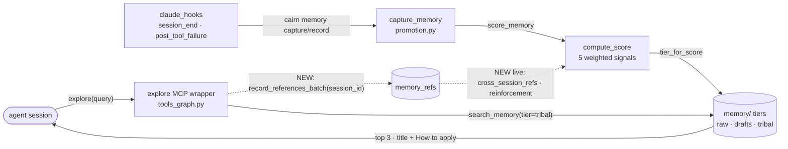

# Tech Spec: tribal-memory-loop-closure

**Spec**: [spec.md](spec.md) | **Created**: 2026-09-04
**Every file/symbol citation below must come verbatim from [survey.md](survey.md)
or a grep run in this session — never from memory.**

Citations marked **(survey)** come from survey.md. Citations marked
**(session-grep)** were read/grepped in this tech-spec session against the same
baseline tree (`76639899…`, plan.md) and are named by symbol first, line second.
Two open items the evidence cannot settle are listed in § Survey gaps and are
**not** designed around invented facts.

## Architecture

The tribal-memory loop has four edges. Three exist and one does not: nothing
writes `memory_refs` during normal work, so `cross_session_refs` and
`reinforcement` — the only two score terms that could ever vary per memory —
are permanently 0 (spec.md § Why). This spec closes the missing edge inside
`explore`, which is already the documented "recommended first call", and then
makes the score depend only on terms that move.



Solid edges exist today. Both dotted edges are what this spec adds: the
reference write from `explore` (FR-001/002/003) and, as a consequence, the
feedback edge into scoring (FR-005 makes it 0.286 of the weight instead of
0.20 of a formula that also carried 0.30 of dead constants).

## Solution

### Chosen approach

Nine changes, one per work area, each landing inside an existing pattern
rather than a new subsystem. No new runtime dependency (Constitution C-03):
everything below is `re`, `hashlib`, `json`, `sqlite3`, `pathlib` — all stdlib,
all already imported somewhere in the touched modules.

| FR | Solution element | Lands in |
|----|------------------|----------|
| FR-001 | `_tribal_memory_section()` helper called **inside** `explore`'s existing `try:` block, before `conn.close()`; renders `=== Tribal memory ===` from `search_memory(..., tier="tribal", session_id=None)` seeded by `result["seeds"]` names | `mcp_server/tools_graph.py` |
| FR-002 | `explore` records refs itself for exactly the rendered memories via `record_references_batch(conn, refs, _session_id())` | `tools_graph.py` + new `_session_id()` in `_server_core.py` |
| FR-003 | Cap 3; per entry: title line + the body's `How to apply:` line (truncated), `(none)` when empty | `tools_graph.py` |
| FR-004 | New `session_start()` hook entrypoint shelling to `cairn memory digest --limit 5`, emitting nothing on the empty-store sentinel | `hooks/claude_hooks.py`, `agent_install/_common.py`, `clients/claude.py` |
| FR-005 | `WEIGHTS` drops `critic_score`/`authority`; surviving five renormalized by ÷0.7 | `memory/scoring.py` |
| FR-006 | New `memory_failure_signatures` table + `memory/recurrence.py`; the gate runs **in the detached CLI subprocess**, not in the hook | `graph/schema.py`, new `memory/recurrence.py`, `cli/memory.py`, `hooks/claude_hooks.py` |
| FR-007 | `post_tool_failure` added to `_HOOK_ENTRYPOINTS` **and** `_hook_markers()`, wired under `PostToolUse` in `claude_hooks_block()` | `agent_install/_common.py`, `clients/claude.py` |
| FR-008 | `_is_session_bookkeeping(title, body)` pre-store override inside `capture_memory` (no signature change) | `memory/promotion.py` |
| FR-009 | Read `transcript_path`, parse the JSONL, keep `user`/`assistant` text blocks, send the tail window on stdin | `hooks/claude_hooks.py` |
| FR-010 | `"L4"` added to `VALID_LEVELS` + `_retrieve_l4`/`evaluate_l4_query` + an explicit `elif` branch in `evaluate_graded_query` and an `"L4"` bucket in both stats dicts | `eval.py`, `cli/system.py` |
| FR-011 | `_check_memory_staleness(conn, db)` following `_check_environment(db)`'s two-arg precedent | `cli/system.py` |
| FR-012 | Delete the six `@mcp.tool` functions outright; `_EXPECTED_TOOL_COUNT` 28 → 22 | `mcp_server/tools_memory.py`, `mcp_server/server.py` |
| FR-013 | Doc/count updates across the full 11-file surface (§ Code guide A9), naming `cairn memory forget` — never a nonexistent `memory delete` | README, docs/, skill files, installer blurb |

**plan.md's open question, resolved**: plan.md § Parallelization map asks
whether `src/cairn/graph/explore.py` must change "if seed-symbol names aren't
already returned by `queries.explore()`". They are: `explore()` builds each
seed as `{"id", "name", "kind", "qualified_name", "line_start", "file_path",
"repo"}` and returns them under `seeds` (session-grep,
`explore` in `src/cairn/graph/explore.py`). **`graph/explore.py` needs no
change** — FR-001/002/003 are confined to the MCP wrapper.

### Alternatives rejected

| Alternative | Why rejected |
|-------------|--------------|
| Open a second connection for the memory search after `conn.close()` | `record_references_batch` already catches `sqlite3.OperationalError` → `note_contention(...)` because it was written to avoid N write-lock acquisitions under concurrent servers (session-grep, `record_references_batch` docstring); a second connection per `explore` call reintroduces exactly that contention. Survey confirms the write needs a live conn (survey). |
| Run the memory search after rendering, reusing `_bundle()` only | `search_memory`'s semantic leg executes `SELECT doc_id, vec, dim FROM memory_embeddings` on the passed `conn` (session-grep, `_semantic_memory_search`); a closed/absent conn kills the semantic half of the fused search the FR explicitly asks for. |
| Reuse the hardcoded `session_id="mcp"` literal from `recall_memory` (survey) | `_cross_session_refs` counts `SELECT COUNT(DISTINCT session_id) … FROM memory_refs` (session-grep, `scoring.py:141`). A constant literal makes every recall for all time exactly **one** distinct session, so the signal saturates at `1/5 = 0.2` forever — it would close the loop mechanically and leave the score just as dead. See D-002. |
| Let `search_memory(session_id=…)` record the refs itself | It records a ref for **every** tribal result (up to 20), not the ≤3 the agent is shown (session-grep, `search_memory`'s `refs = [...] for c in results`). That inflates `cross_session_refs` with memories nobody read — the same "signal that isn't signal" failure FR-005 exists to remove. See D-001. |
| FR-006 via `search_memory` over the existing concept store | Survey: `search_memory` "pay[s] the cost of reading every memory concept from disk" when lexical hits are thin, and is not indexed by `(tool_name, error)` (survey, promotion.py:228-238). Unbounded disk I/O in an auto-capture path. |
| FR-006 via a JSON/dotfile cache under `~/.cairn` | Needs its own locking and staleness story; the CLI process already opens the graph DB (which applies schema idempotently), so SQLite gives atomicity for free. See D-005. |
| FR-006 gate executed inside the hook process | The hook's whole contract is "Non-blocking: spawns the cairn CLI as a detached subprocess … and returns immediately" (session-grep, `post_tool_failure` docstring). A DB open + query in the hook spends the exact budget that comment protects. The detached child already pays those costs. See D-005. |
| FR-005 with an opportunistic uplift for `cross_session_refs` (e.g. 0.35/0.30/0.20/0.075/0.075) | Confounds two changes in one experiment: US3/AC2 asks for a *falsifiable* widening attributable to the removal. Pure ÷0.7 renormalization keeps every surviving term's relative ordering identical. See D-003. |
| FR-005 by also deleting the `signals["critic_score"]` writes at promotion.py:436/685 (survey) | Those writes feed `batch_critic`/`_rescore_with_critic`; deleting them forces edits to two more functions and would need a frontmatter migration for the 34 live memories — explicitly out of scope (spec.md § Scope). See D-004. |
| FR-008 via a new `tier=` parameter on `capture_memory` | Survey proved there is no caller-supplied tier to override anywhere: not `record_memory`, not `memory_record`, not `memory_capture` (survey). A parameter nobody passes is dead surface; an internal pre-store override covers all four callers with one edit. See D-006. |
| FR-010 extending `load_eval_queries`'s legacy YAML fixture | `VALID_LEVELS` gates only `load_ground_truth` (survey), and the yaml path is documented as "test fixture data … stays as-is" (session-grep, eval.py's graded-loader banner). Confirmed: L4 extends `load_ground_truth`. See D-008. |
| FR-012 by removing only the `@mcp.tool` decorators (plan.md's Phase-5 verify line) | Leaves six functions that nothing imports — `tools_memory.py` is imported for registration side effects only. Dead code with live docstrings is worse than deletion, and the CLI equivalents already carry every guard (D-010, D-011). |
| FR-013 documenting a `cairn memory delete` CLI verb | It does not exist: `grep -n '@memory.command("delete")'` → 0 matches; the real verb is `forget` (survey). See D-011. |

## Impact analysis

Blast radius by symbol. Caller counts are from this session's `cairn callers`
runs against the workspace graph; the tool resolves by name, so **common names
can attract fuzzy matches** — each count below was cross-checked with a
`grep -rn --include="*.py"` over `src/` + `tests/`.

| Symbol (file) | Direct callers | What breaks if the approach is wrong |
|---|---|---|
| `capture_memory` (`memory/promotion.py`) | **34** call sites — 3 in `src/` (`cli/memory.py` ×2 in `memory_record`/`memory_capture`, `mcp_server/tools_memory.py` in `record_memory`), 31 in `tests/` (`test_memory_lifecycle.py` ×20, `test_memory_stale_flag.py` ×5, `test_redaction_chokepoints.py` ×2, `test_audit_remediation.py` ×2, others) | **Largest blast radius in the spec.** FR-008 changes only the tier chosen at the end of the function, not the signature or the returned dict, so all 34 stay source-compatible. A false positive in the heuristic silently re-tiers a real memory to `raw` (7-day expiry) for every one of those callers — this is the risk spec.md § Assumptions calls unacceptable. |
| `search_memory` (`memory/promotion.py`) | **11** — `cli/memory.py::memory_search`, `mcp_server/tools_memory.py::recall_memory`, `compass/router.py::_search_memory`, + 8 test call sites | FR-001 adds a 12th caller. Behavior of the existing 11 is unchanged (new caller passes `session_id=None`, an already-supported default). |
| `score_memory` (`memory/scoring.py`) | **4** — `capture_memory`, `batch_critic`, `evolve_memory` (all `promotion.py`), + `test_memory_lifecycle.py::test_signals_include_reinforcement` | FR-005 changes `compute_score` only; `score_memory`'s returned signal dict keeps all 8 keys (D-004), so none of the 4 need edits. |
| `compute_score` (`memory/scoring.py`) | 2 — `score_memory`, `test_memory_lifecycle.py::test_compute_score_includes_reinforcement` | The test pins the old arithmetic and **must** be updated (§ Tests). |
| `explore` (`graph/explore.py`) | **2** — `mcp_server/tools_graph.py::explore` (the MCP wrapper, `tools_graph.py:434` call site inside `tools_graph.py:404 def explore`), + `test_metrics.py::test_instrument_captures_sizes_and_args_summary` | The graph-layer function is untouched. Only the wrapper grows a section. |
| `_HOOK_ENTRYPOINTS` (`agent_install/_common.py:182`) | **3 reads** — `merge.py:17` (import), `merge.py:281` inside `_already_installed`, `merge.py:305` inside `_entry_entrypoints` | **Silent-behavior hazard.** `_already_installed` returns `_HOOK_ENTRYPOINTS <= found`; adding entrypoints makes every existing install read as *not installed*, so the next `install-agents` re-merges. That is the desired upgrade path, but it is a behavior change, not a no-op (D-013). |
| `_hook_markers()` (`agent_install/_common.py:170`) | 1 — `merge.py::_strip_hooks` | **Uninstall leak if missed.** `_strip_hooks` filters entries by these substrings; a new entrypoint absent from `_hook_markers()` survives `cairn uninstall-agents` forever. FR-004/FR-007 must add both markers. |
| `_EXPECTED_TOOL_COUNT` (`mcp_server/server.py:56`) | asserted at boot (`server.py:171`) + 4 test references | **Server will not boot** if FR-012 removes six tools and leaves this at 28: `assert actual == _EXPECTED_TOOL_COUNT`. |
| `session_end` / `post_tool_failure` (`hooks/claude_hooks.py`) | dispatch table in `__main__` only | Contained. FR-009's parse must never raise: a hook that throws is worse than one that captures nothing. |

### Tests: update vs net-new (Constitution C-02 — every task needs a failing test first)

**Existing tests that must be updated** (all fail as written after the change):

| Test | Why |
|---|---|
| `tests/test_memory_lifecycle.py::TestScoringWeights::test_freshness_weight_reduced` (`:185-186`, survey) | Pins `WEIGHTS["freshness"] == 0.05` and `WEIGHTS["reinforcement"] == 0.05`; both become `0.0715`. **Literal update required.** |
| `tests/test_memory_lifecycle.py::TestSevenSignalScore::test_compute_score_includes_reinforcement` (`expected` at `:277`, survey cites the synthetic dict at `:270,273`) | `expected = 0.25 + 0.075 + 0.10 + 0.05 + 0.05 + 0.05` is the old formula. New value: `0.357*1.0 + 0.286*0.0 + 0.214*0.5 + 0.0715*1.0 + 0.0715*1.0 = 0.607`. **Literal update required.** The `"critic_score"`/`"authority"` keys in the synthetic dict may stay (D-004: `compute_score` simply stops reading them). |
| `tests/test_memory_lifecycle.py::TestScoringWeights::test_weights_sum_to_one` (`:177`, survey) | **No change needed** — verified in-session: the five renormalized values sum to exactly 1.0 within 1e-9. |
| `tests/test_memory_lifecycle.py::test_reinforcement_weight_exists` (`:180-181`, survey) | **No change needed** — `reinforcement` survives with a positive weight. |
| `tests/test_doctor.py` — the two ordered name lists (`expected = [...]` asserted at `:125`, and the inline list asserted at `:917`) | FR-011 appends an 11th check; both lists are exact-equality assertions. |
| `tests/test_status_resource_health.py:281` (`assert _EXPECTED_TOOL_COUNT == 28`) | FR-012: → 22. |
| `tests/test_mcp_wiki_tool.py::test_wiki_generate_is_the_28th_registered_tool` (`:68`, asserts `== 28` at `:74`) | FR-012: the test's **name** encodes 28; rename + retarget. |
| `tests/test_agent_surface.py::test_skill_tool_index_lists_all_registered_tools` (`assert len(registered) == 28`, `:455`-ish) | FR-012: → 22, and it cross-checks `SKILL.md` + `references/tools.md`, so those two files must land in the same task. |
| `tests/test_agent_surface.py` `_TOOL_MODULES` map (`:532-538`) | Drop the six removed names. |
| `tests/test_agent_surface.py` hint-invariant case `("src/cairn/mcp_server/tools_memory.py", "recall_memory", "memory_digest")` (`:740`) | `recall_memory`'s no-results string tells agents to call `memory_digest()` — a phantom tool after FR-012. Update the string and this case together. |
| `tests/test_agent_surface.py::test_tool_count_string_matches_server` (`:392-430`) | Passes only if `agent_install/_common.py:440`'s blurb is updated in lockstep. |
| `tests/test_mcp_connection_leaks.py:15-16` | Docstring inventory naming `memory_delete`/`memory_promote`/`memory_demote` as MCP tools — text-only update; no test body invokes them (session-grep). |
| `tests/test_dashboard_data.py:812` (`all(e["tier"] == "tribal" …)`) | Watch-item, not a known break: FR-005 shifts absolute scores, and `tier_for_score` cuts at 0.3/0.5 (session-grep, `memory/store.py`). Re-run after FR-005 before assuming green. |

**Net-new tests** (one failing test per FR, per C-02; C-04 isolation applies to
every hook test — lazy `cairn.hooks.claude_hooks` import inside the test,
patch `cairn.hooks.claude_hooks.subprocess.Popen` at the call site, explicit
`--db`/`--knowledge` `tmp_path` overrides, never the real `~/.cairn`, survey
§ Test isolation conventions):

FR-001/002/003 — section present + `(none)` variant + one `memory_refs` row per
rendered memory (and **only** for rendered ones); FR-004 — populated store emits,
empty store emits nothing; FR-005 — new `WEIGHTS` keys/values + a synthetic-signal
spread test (US3/AC2); FR-006 — first occurrence records no memory, second does;
FR-007 — `post_tool_failure` in `_HOOK_ENTRYPOINTS`, in `_hook_markers()`, and
round-trips install→uninstall on a fixture config; FR-008 — the 4 bookkeeping
titles forced to `raw`, the 5 durable titles untouched (negative fixtures are
mandatory per plan.md § Risks); FR-009 — a JSONL fixture at `transcript_path`
queues a `memory-extract` task; FR-010 — an `"L4"` graded pair scores recall@k/MRR
and does **not** route through `_retrieve_l5`; FR-011 — WARN for a stale
zero-ref workspace, PASS otherwise, WARN (never raise) on a missing bundle;
FR-012 — the six names absent from the scraped `@mcp.tool` set while the CLI
verbs (`evolve`, `digest`, `promote`, `decay`, `demote`, **`forget`**) still work.

## Code guide

### A1 — `explore` tribal-memory fusion (FR-001, FR-002, FR-003)

- **Touches**: the `explore` function in `src/cairn/mcp_server/tools_graph.py`
  (`tools_graph.py:404`, calling `queries.explore(conn, query)` at
  `tools_graph.py:434`); a new `_session_id()` beside `_bundle()` in
  `src/cairn/mcp_server/_server_core.py` (`_bundle()` at `_server_core.py:222`,
  survey); `record_references_batch` and `search_memory` in
  `src/cairn/memory/promotion.py` (`promotion.py:146` / `:198`).
- **Approach**: keep the existing `conn = _conn() / try: … / finally:
  conn.close()` block and add the memory work *inside* the `try`, immediately
  after `result = queries.explore(conn, query)`:

  1. `seed_names = [s["name"] for s in result["seeds"] if s.get("name")][:5]`
     — skip entirely when `seeds` is empty (the wrapper already returns the
     "No symbols matching" string before any section renders).
  2. `mems = search_memory(conn, _bundle(), " ".join(seed_names),
     tier="tribal", session_id=None)` — `session_id=None` so `search_memory`
     records nothing itself (D-001).
  3. `shown = mems[:3]`; `record_references_batch(conn, [(c.concept_id,
     query) for c in shown], _session_id())`.
  4. Carry `shown` out of the `try` as plain concepts and render after
     `conn.close()` with the other sections.

  Rendering (FR-003), matching the existing section style
  (`out.append(f"=== … ===")`, `(none)` bodies):

  ```
  === Tribal memory (2) ===
    Never evict numpy from sys.modules mid-process
      How to apply: {the memory body's "How to apply:" line, truncated}
  ```

  Extract the line with `re.search(r"^How to apply:\s*(.+)$", body, re.M)` —
  the same anchor `graph/embeddings.py`'s `_CHUNK_SPLIT_RE`
  (`r"\n(?=Why:|How to apply:)"`, `embeddings.py:1770`) already splits on. When
  absent, fall back to `c.description` (what `recall_memory` prints) and omit
  the line if that is empty too.
- **Verify before implementing**:
  `grep -n "Tribal memory" src/cairn/mcp_server/tools_graph.py` → 0 (survey);
  `grep -n "def explore" src/cairn/mcp_server/tools_graph.py` → `404`.
- **Pitfalls**:
  - `_conn()` is **pooled** — "the returned object's `close()` is a no-op
    release" (session-grep, `_conn` docstring in `_server_core.py:159`). Do not
    assume `close()` flushes; `record_references_batch` commits itself.
  - Under `CAIRN_READ_ONLY`, `_conn()` opens read-only and the ref insert
    raises `sqlite3.OperationalError`, which `record_references_batch` swallows
    into `note_contention("promotion.record_references_batch", …)` — a
    *false contention signal on every explore call*. Guard with the existing
    `_read_only_mode()` (`_server_core.py:90`) and skip the ref write there.
  - Do **not** switch to `_rw_conn()`: it opens a second, contending
    connection ("in a read-only daemon this will contend with the CLI writer",
    session-grep, `_rw_conn` docstring at `_server_core.py:212`).
    `recall_memory` already writes refs through the pooled `_conn()` — follow
    that precedent.
  - `explore`'s docstring carries a rendered example of the section list
    (ending `=== Ambiguous dispatch ===`); update it, or the tool description
    the LLM reads will be wrong.

### A2 — session-start hook (FR-004)

- **Touches**: new `session_start()` in `src/cairn/hooks/claude_hooks.py`
  (beside `post_edit` / `session_end` / `post_tool_failure` and its
  `__main__` dispatch table); `_HOOK_ENTRYPOINTS` (`_common.py:182`, survey)
  and `_hook_markers()` (`_common.py:170`, session-grep);
  `claude_hooks_block()` in `agent_install/clients/claude.py`
  (`claude.py:46-60`, survey).
- **Approach**: `session_start()` calls
  `_run_cg(["memory", "digest", "--limit", "5"], timeout=15)` and writes the
  result to stdout, emitting **nothing** when the output is empty or contains
  the CLI's empty-store sentinel `"No tribal memories yet."` (session-grep,
  `memory_digest` in `cli/memory.py`). Reusing the CLI keeps the score-ranked
  ordering in one place (`tribal_digest(bundle, limit=limit)`) and keeps the
  hook free of any `cairn.*` import — the module's stated "path-free" contract.
  Add `"session_start"` to `_HOOK_ENTRYPOINTS`, add both
  `cairn.hooks.claude_hooks session_start` and the legacy
  `src.hooks.claude_hooks session_start` markers to `_hook_markers()`, and add
  the event block to `claude_hooks_block()` next to `PostToolUse` / `Stop`.
- **Verify before implementing**:
  `grep -rn "SessionStart\|sessionStart\|onStart" src/cairn/agent_install/ src/cairn/hooks/`
  → 0 matches (survey, re-run to confirm still 0).
- **Pitfalls**:
  - The empty-store suppression depends on a CLI string. Pin it with a
    coupling test asserting `cairn memory digest` still prints exactly
    `No tribal memories yet.` on an empty bundle, or the hook will start
    emitting that line as "context".
  - Cursor is **out of scope** for FR-004: `cursor_hooks.py` handles only
    `afterFileEdit`/`afterSessionEnd` and grep found no session-start-shaped
    event in either cursor file (survey). FR-004's "WHERE a client supports a
    session-start hook" is satisfied by Claude alone.
  - The client-side event key is a survey gap — see § Survey gaps (G1).

### A3 — scoring formula (FR-005)

- **Touches**: `WEIGHTS` and `compute_score` in `src/cairn/memory/scoring.py`
  (`scoring.py:21-29`, survey; `compute_score` reads the seven terms at
  `scoring.py:74-82`, session-grep), plus the module docstring's
  "7-signal"/formula lines (`scoring.py:1-8`, survey).
- **Approach**: divide each surviving weight by 0.70 (the sum after removing
  `critic_score` 0.20 + `authority` 0.10):

  | Term | Now | After (`÷0.7`) |
  |---|---|---|
  | `graph_verification` | 0.25 | **0.357** |
  | `cross_session_refs` | 0.20 | **0.286** |
  | `agent_confidence` | 0.15 | **0.214** |
  | `freshness` | 0.05 | **0.0715** |
  | `reinforcement` | 0.05 | **0.0715** |

  Verified in-session: `sum == 1.0` exactly within 1e-9, and each value ×0.7
  returns its original (0.2499 / 0.2002 / 0.1498 / 0.05005 / 0.05005) — the
  relative ordering is preserved to 3-4 significant figures, which is what
  makes US3/AC2's spread test attributable to the removal (D-003).
  `compute_score` drops its `WEIGHTS["critic_score"] * …` and
  `WEIGHTS["authority"] * …` terms; `score_memory` and `apply_score` keep
  computing and persisting both values as unweighted diagnostics (D-004), so
  `promotion.py:436` and `promotion.py:685` (survey) need **no edit**.
- **Verify before implementing**:
  `python3 -m pytest tests/test_memory_lifecycle.py -k "weight or formula" -q`
  (survey's own verify command, not run at survey stage).
- **Pitfalls**:
  - `_authority()` (`scoring.py:226`) is a *different concern* from
    `WEIGHTS["authority"]` — `tests/test_import_validation.py:16,55-57` imports
    it directly and must keep passing (survey). Do not delete the function.
  - `scoring.py`'s module docstring states the old formula verbatim; leaving it
    stale reproduces exactly the README-vs-code drift US5 exists to fix.
  - `TestScoringWeights` / `TestSevenSignalScore` docstrings say "7-signal".
    After this change: 8 computed signals, **5 weighted**.

### A4 — recurrence gate + hook registration (FR-006, FR-007)

- **Touches**: `post_tool_failure` in `src/cairn/hooks/claude_hooks.py`
  (`claude_hooks.py:106-171`, survey); new
  `src/cairn/memory/recurrence.py`; the memory-refs schema block in
  `src/cairn/graph/schema.py` (`memory_refs` + its two indexes at
  `schema.py:120-128`, session-grep); `memory_record` in
  `src/cairn/cli/memory.py`; `_HOOK_ENTRYPOINTS` / `_hook_markers()` /
  `claude_hooks_block()` as in A2.
- **Approach** (D-005): the hook stays a pure "compute + Popen" path; all DB
  work happens in the already-detached child.

  1. New table, appended to `schema.py` beside `memory_refs`:

     ```sql
     CREATE TABLE IF NOT EXISTS memory_failure_signatures (
         sig         TEXT PRIMARY KEY,
         tool_name   TEXT NOT NULL,
         occurrences INTEGER NOT NULL DEFAULT 1,
         first_seen  TIMESTAMP NOT NULL,
         last_seen   TIMESTAMP NOT NULL
     );
     ```

     No index needed — lookup is by primary key. No `MIGRATIONS` entry needed:
     `schema.py`'s `term_df` block documents the pattern verbatim —
     "Additive-only: plain CREATE TABLE IF NOT EXISTS rides the idempotent
     executescript in `_apply_schema` with NO MIGRATIONS entry, so existing DBs
     gain the table on next connect" (session-grep, `schema.py:104-117`).
  2. `memory/recurrence.py` — two functions, stdlib only:
     `failure_signature(tool_name, error) -> str` (pure: lowercase, collapse
     whitespace, replace digit runs with `0`, drop absolute paths and hex/UUID
     runs, truncate to 200 chars, then
     `sha256(f"{tool_name}\n{normalized}").hexdigest()[:16]`) and
     `note_failure_signature(conn, sig, tool_name) -> int` (one PK `SELECT
     occurrences`, then `INSERT`/`UPDATE … occurrences+1, last_seen`, returning
     the count **before** this occurrence).
  3. `cairn memory record` gains one option, `--recurrence-key TEXT`:
     when present, the command calls `note_failure_signature` first and exits
     quietly with no capture when the prior count is 0. This is what gives
     AC1's "first occurrence is not captured" while still registering it.
  4. `post_tool_failure` imports only `failure_signature` (lazily, inside the
     function — the same shape as its existing lazy
     `from cairn.memory.privacy import strip_private_data`) and appends
     `--recurrence-key <sig>` to the existing `subprocess.Popen` argv.
  5. FR-007: add `"post_tool_failure"` to `_HOOK_ENTRYPOINTS`, both markers to
     `_hook_markers()`, and a `PostToolUse` entry to `claude_hooks_block()`.
- **Verify before implementing**:
  `grep -rn "post_tool_failure" src/cairn/agent_install/` → 0 (survey);
  `grep -n "post_tool_failure" ~/.claude/settings.json` → 0 (survey).
- **Pitfalls**:
  - Normalization is what makes the gate work at all: raw error strings carry
    paths, pids and timestamps, so two occurrences of "the same" failure never
    hash equal without it. Test the normalizer directly, not only end-to-end.
  - The signature is computed on the **already privacy-filtered** text
    (`safe_error`), so no unfiltered error ever leaves the hook — preserve that
    ordering.
  - `_HOOK_ENTRYPOINTS` is consumed by `merge.py::_already_installed`
    (`merge.py:281`) — see § Impact analysis; expect existing installs to
    re-merge (D-013).
  - Signature rows are never pruned by this spec. They are ~80 bytes each and
    bounded by distinct failure shapes; a retention pass belongs with
    `memory decay`, out of scope here.

### A5 — capture-time triage (FR-008)

- **Touches**: `capture_memory` in `src/cairn/memory/promotion.py`
  (`promotion.py:20-96`, survey), specifically the
  `tier = store_mod.tier_for_score(signals["score"])` line
  (`promotion.py:81-82`, survey).
- **Approach**: add a module-level `_is_session_bookkeeping(title, body)` and,
  just before `store_memory`, override:
  `if _is_session_bookkeeping(title, body): tier = "raw";
  concept.extensions["memory_triage"] = "session-bookkeeping"`. The score is
  still computed and persisted honestly — only placement is forced — so a
  mis-fire is recoverable with `cairn memory promote`, and the extension key
  makes false positives greppable (which is how US4's noise metric gets
  measured).

  **The patterns** (validated in this session, see below):

  ```python
  _TASK_ID_RE = re.compile(r"\bT\d{3}\b")
  _BRANCH_RE = re.compile(
      r"(?<![\w/])(?:feature|feat|fix|bugfix|hotfix|chore|release|docs|refactor|spec)"
      r"/[A-Za-z0-9._-]+"
  )
  _DATED_COUNT_RE = re.compile(
      r"\b\d{4}-\d{2}-\d{2}\b(?=.*\b\d+\s+(?:commits?|files?|prs?|tasks?|modules?|specs?|tests?)\b)"
      r"|\b\d+\s+(?:commits?|files?|prs?|tasks?|modules?|specs?|tests?)\b(?=.*\b\d{4}-\d{2}-\d{2}\b)"
  )
  _PROGRESS_COUNT_RE = re.compile(
      r"\b\d+\s+(?:[\w'-]+\s+){0,3}(?:done|left|remaining|pending|complete|completed|to go)\b"
  )
  ```

  Application scope: the first three (high precision) run against **title and
  body**; `_PROGRESS_COUNT_RE` (the loosest — a bare number followed by a
  progress word) runs against the **title only**, because bodies legitimately
  contain sentences like "3 callers remaining".

  **Discrimination against survey.md's 9 cited examples** (run in-session
  against the exact `title:` frontmatter of each cited file under
  `~/.cairn/79428b9d734aac21/.knowledge/memory/tribal/`):

  | Title (survey) | Verdict | Matched by |
  |---|---|---|
  | `T007 pins get_repo_head display seam for T008` | caught ✓ | `_TASK_ID_RE` → `T007` |
  | `agent_runtime arch-review improvements landed on feature/arch-review-improvements` | caught ✓ | `_BRANCH_RE` → `feature/arch-review-improvements` |
  | `polaris compass campaign: 240 source-module compasses done, 157 test tasks left pending` | caught ✓ | `_PROGRESS_COUNT_RE` → `240 source-module compasses done` |
  | `agent_runtime comment-trim house style extended repo-wide (2026-09-01, 4 commits)` | caught ✓ | `_DATED_COUNT_RE` → `2026-09-01` + `4 commits` |
  | `Never evict numpy from sys.modules mid-process` | not caught ✓ | — |
  | `Kotlin grammar is the vendored fwcd tree-sitter build (cairn._tree_sitter_kotlin)` | not caught ✓ | — (parens without a date) |
  | `Registry-bypass probe: test a parser port before the loader flips` | not caught ✓ | — |
  | `Test seams bind fakes at the consumer module's namespace` | not caught ✓ | — |
  | `pip --target dir shared across interpreter ABIs corrupts unrepairably` | not caught ✓ | — |

  9/9 discriminate correctly. Widening the run to **every** memory title in the
  live store (30 files matched by
  `~/.cairn/79428b9d734aac21/.knowledge/memory/*/*.md` with a `title:` line):
  5 caught, 25 not — the four above plus one true positive survey did not cite,
  `T021 environment doctor check: interim registration-glance arm marks the
  T022 …`. **Zero false positives across all 30.** Recall is ~17% against
  spec.md's "roughly a third" estimate, i.e. the heuristic under-catches — the
  trade spec.md § Assumptions explicitly asks for.
- **Verify before implementing**:
  `grep -n "def capture_memory" -A5 src/cairn/memory/promotion.py` (survey);
  `find ~/.cairn -path "*memory/tribal*" -name "*.md" | wc -l` → 28 (survey).
- **Pitfalls**:
  - `capture_memory` redacts title and body *before* scoring
    (`strip_private_data`, `promotion.py:50-53`). Run the triage on the
    redacted text so the two paths can never disagree.
  - The `(none)`-style false-positive risk is real for future titles like
    "fix/o(n) scan" — `_BRANCH_RE`'s alternation is deliberately limited to
    git-flow prefixes and requires no whitespace around the slash. Keep it that
    way; do not generalize to "any `word/word`" (that would catch
    `src/cairn/...` paths in every durable memory).
  - `post_tool_failure` bodies can contain a branch name in error output and
    will be forced to `raw` — harmless: they are captured at confidence 0.3
    and land in low tiers anyway.

### A6 — `session_end` transcript (FR-009)

- **Touches**: `session_end` in `src/cairn/hooks/claude_hooks.py`
  (`claude_hooks.py:85-104`, survey). Downstream `memory_capture` in
  `src/cairn/cli/memory.py:121-206` (survey) is **not** touched.
- **Approach**: replace `messages = data.get("messages", [])` with a
  transcript-file read:

  1. `path = data.get("transcript_path") or ""`. Missing / non-existent /
     unreadable → keep today's early return and its
     `"(no transcript; nothing to capture)"` output.
  2. Read the file line by line; `json.loads` each non-empty line inside
     `try/except (json.JSONDecodeError, ValueError): continue`. The file is
     append-only and may be mid-write, so a partial trailing line must be
     skipped, not fatal.
  3. Keep records where `rec.get("type") in ("user", "assistant")` **and**
     `isinstance(rec.get("message"), dict)`.
  4. Flatten each to `{"role": msg["role"], "content": text}` where `text` is
     `msg["content"]` when it is a `str`, else the `"\n".join` of every
     `block["text"]` for blocks whose `type == "text"`. Drop entries whose
     flattened text is empty.
  5. Keep the **last** ~80 messages (tail window), `json.dumps(...)`, and pipe
     to the existing, unchanged
     `["memory", "capture", "--session-transcript-stdin", "--session-id", …]`
     call.
  6. Pass the payload's own `session_id` (falling back to `"claude"`) instead
     of the hardcoded literal, so `create_task(bundle, "memory-extract",
     f"session-{session_id}", …)` (`cli/memory.py:196-204`, survey) gets a
     per-session task name.

  **Record-shape evidence** (this session, real transcripts under
  `~/.claude/projects/*/*.jsonl` — 60 files present; one 281-line file
  analysed): records are heterogeneous — `attachment` 75, `assistant` 61,
  `user` 40, plus `artifact-autoreact-ledger`, `last-prompt`, `mode`,
  `permission-mode`, `ai-title`, `atis-latch`, `system`,
  `file-history-snapshot`, `frame-link`, `queue-operation`, `cost-state`.
  Every `user`/`assistant` record carried a dict `message`
  (0 exceptions): `assistant` messages had keys
  `content, diagnostics, id, model, role, stop_details, stop_reason,
  stop_sequence, type, usage`; `user` messages had `content, role`. Content
  blocks seen: `tool_use` 34, `tool_result` 34, `thinking` 20, `text` 7, plus
  3 bare-string `user` contents. **This is why the reducer filters on
  `type`/`message` and keeps text blocks only** — the file is not a message
  array, and most of its lines are not conversation.
- **Verify before implementing**:
  `grep -rn "transcript_path" src/cairn/` → 0 matches (survey);
  `grep -n "messages" src/cairn/hooks/claude_hooks.py` → line 87 only (survey).
- **Pitfalls**:
  - **The hook is wired to `Stop`, not `SessionEnd`**: `claude_hooks_block()`
    puts `session_end` under the `"Stop"` event key (session-grep,
    `claude_hooks_block` in `clients/claude.py`). Reading `transcript_path`
    is correct for the wiring that actually exists as well as for the
    `SessionEnd` shape spec.md/FR-009 describes — but do not "fix" the event
    key as part of this FR.
  - `memory_capture` truncates with `strip_private_data(transcript)[:8000]`
    before queueing (`cli/memory.py:201`, survey) — a **head** truncation.
    Sending the tail window is what puts the session's conclusions inside that
    budget; sending the whole transcript would queue only its opening.
  - Dropping `tool_result` blocks loses tool-error text — deliberate: tool
    failures have their own dedicated channel in FR-006/007, and tool results
    are the bulk of a transcript's bytes.
  - `thinking` blocks are dropped: highest volume, lowest durable-knowledge
    density, and the most privacy-sensitive content in the file.
  - The hook must never raise. Wrap the whole read/parse in a broad guard that
    degrades to the existing no-transcript message.

### A7 — L4 eval level (FR-010)

- **Touches**: `src/cairn/eval.py` — `VALID_LEVELS` (`eval.py:95`, survey),
  `evaluate_l1_query` (`:259`) / `evaluate_l5_query` (`:299`), `_retrieve_l1`
  (`:415`) / `_retrieve_l5` (`:437`), `evaluate_graded_query`,
  `_run_graded_evaluation` (`load_ground_truth(graded_dir)` at `:485`, survey),
  `run_evaluation`; and `eval_cmd` in `src/cairn/cli/system.py`
  (`--corpus` Choice at `system.py:494`, the render loop
  `for c_key in ["L1", "L5"]` at `system.py:518`, session-grep).
- **Approach** (D-008 — `load_ground_truth`, confirmed):
  1. `VALID_LEVELS = frozenset({"L1", "L4", "L5"})`.
  2. `_retrieve_l4(conn, bundle_root, query, k)` mirroring `_retrieve_l5`'s
     normalization: `[{"name": c.concept_id, "file_path": ""} for c in
     search_memory(conn, OKFBundle(bundle_root), query, tier="tribal",
     session_id=None)][:k]`. `session_id=None` is load-bearing: an eval sweep
     that wrote `memory_refs` would inflate the very `cross_session_refs`
     signal being evaluated.
  3. `evaluate_l4_query(conn, bundle_root, query, expect, k)` mirroring
     `evaluate_l5_query`'s substring-rank shape, for parity with the FR's
     named surface.
  4. **`evaluate_graded_query` must gain an explicit `elif graded.level ==
     "L4"` branch** — today it is `if L1 … else <L5>` (session-grep), so a
     newly-valid L4 query would silently be scored through knowledge
     retrieval.
  5. `_run_graded_evaluation`'s `stats` dict is hardcoded to `{"L1": …,
     "L5": …}` (session-grep) → `stats[graded.level]` raises `KeyError` for
     L4. Add the bucket there and in `run_evaluation`'s yaml-path `stats`.
  6. CLI: `--corpus` → `Choice(["L1", "L4", "L5", "all"])`, and the render
     loop → `["L1", "L4", "L5"]`.
- **Dataset shape**: a `queries.jsonl` + `expectations.tsv` pair, same D-004
  schema as the existing pairs. `queries.jsonl` rows:
  `{"query_id": "L4-M01", "level": "L4", "kind": "mistake", "text": "<the
  situation an agent would be in>", "rationale": "<why this memory is the
  right hit>"}`. `expectations.tsv` rows are
  `query_id \t symbol_id \t grade` where **`symbol_id` must still parse as
  `file#symbol`** — `load_ground_truth` calls `parse_symbol_id(symbol_id)` on
  every row, L5 included (session-grep). So an L4 expectation is written as
  `memory/tribal#<memory-slug>`, e.g.
  `L4-M01 \t memory/tribal#never-evict-numpy-from-sys-modules-mid-process-e52eeb \t 2`.
  `match_rank`'s tier-1 identity rule cannot fire (no `file_path` on concept
  results) so matching takes the documented tier-2 substring path — "L5
  concept ids can never satisfy tier 1 and always take the fallback"
  (session-grep, `match_rank` docstring), which is exactly the behavior L4
  needs.
- **Dataset location**: a new `tests/eval/memory/ground_truth/` pair plus the
  seeded `tmp_path` bundle its test builds — **not** the existing graded dirs.
  The two on disk (`benchmarks/datasource/t2/ground_truth/`,
  `benchmarks/datasource/ds2/ground_truth/`, session-grep) pin expectations to
  another repo's symbols (`yarl/_url.py#URL`); memory concept ids are
  workspace-local and cannot be asserted there.
- **Verify before implementing**:
  `grep -n "VALID_LEVELS\|evaluate_l1_query\|evaluate_l5_query\|_retrieve_l1\|_retrieve_l5" src/cairn/eval.py`
  (survey — confirms `:95/:259/:299/:415/:437`).
- **Pitfalls**: `load_ground_truth` raises `ValueError` on an unknown level, a
  query with zero expectation rows, a grade outside `{1,2}`, or a malformed
  `symbol_id` (session-grep) — a hand-written L4 pair fails loudly at load;
  that is the intended gate, not a bug to work around.

### A8 — doctor memory-staleness check (FR-011)

- **Touches**: `src/cairn/cli/system.py` — new `_check_memory_staleness`
  beside the existing `_check_schema` (`:743`) … `_check_environment`
  (`:1569`) family, using `_result(name, status, detail, hint)` (`:657`) and a
  named threshold constant in the block at `:650-654` (all survey); plus
  `_run_doctor`'s check list (`system.py:1709-1720`) and
  `_db_unavailable_results` (`system.py:1657-1677`) (session-grep).
- **Approach**:
  - `MEMORY_REF_WINDOW_DAYS = 30` in the thresholds block, beside
    `STALE_BUILD_DAYS = 7` (survey).
  - `_check_memory_staleness(conn, db) -> dict` — the two-arg shape has
    precedent in `_check_environment(db)` (survey).
  - Resolve the bundle from the db path: `Path(db).parent / ".knowledge"`,
    matching every memory CLI command's `--knowledge` default
    (`DEFAULT_DB_PATH.parent / ".knowledge"`, session-grep, `cli/memory.py`);
    `DEFAULT_KNOWLEDGE_PATH` is already imported in `system.py` (`:17`) if a
    default is preferred.
  - Count tribal memories older than the window by **file mtime** over
    `<knowledge>/memory/tribal/*.md` — a `stat` per file, no YAML parse, which
    keeps the check bounded like its siblings.
  - Count references in the window:
    `SELECT COUNT(*) FROM memory_refs WHERE referenced_at >= ?` with an ISO-8601
    cutoff string. Safe as a string comparison because
    `record_references_batch` writes
    `datetime.now(timezone.utc).isoformat()` (session-grep, `promotion.py:160`).
  - Verdicts: no tribal dir / no old memories → PASS; old memories **and** 0
    refs in the window → WARN "N tribal memories older than 30d, 0 references
    recorded in that window — memory is write-only", hint pointing at
    `explore`/`recall_memory` and the environment check; otherwise PASS with
    the ref count.
  - Add the check to `_run_doctor`'s list after `_check_tool_health(conn)` and
    before `_check_config()`, and add a matching
    `_result("memory_staleness", _WARN, "database unavailable (see schema)")`
    row to `_db_unavailable_results` so the degraded path keeps the same
    names in the same order.
- **Verify before implementing**:
  `grep -n "^def _check_\|def doctor" src/cairn/cli/system.py` (survey —
  confirms the 10-check family and `doctor` at `:1753`).
- **Pitfalls**:
  - Two tests assert the doctor's result names as an **exact ordered list**
    (`tests/test_doctor.py`, the `expected` list asserted at `:125` and the
    inline list asserted at `:917`). Both must be updated in the same task.
  - Prose to update: `system.py`'s "10 health checks" banner (`:632-637`,
    survey), `doctor`'s own docstring ("Run 10 system health checks"), and
    `docs/cli-reference.md:92` ("10 checks: the 9 store-internal ones plus
    `environment`") — session-grep.
  - Doctor is read-only and must never raise (survey/`system.py:739-740`):
    wrap the filesystem walk so a missing or unreadable bundle degrades to
    WARN with the reason.

### A9 — MCP memory-surface trim + docs (FR-012, FR-013)

- **Touches (code)**: `src/cairn/mcp_server/tools_memory.py` — `memory_digest`
  (`:22`), `memory_evolve` (`:218`), `memory_promote` (`:254`), `memory_demote`
  (`:281`), `memory_delete` (`:315`), `memory_decay` (`:360`) (all survey);
  `_EXPECTED_TOOL_COUNT` (`mcp_server/server.py:56`, asserted at `:171`,
  session-grep).
- **Behavior-preservation, confirmed** (the payload's explicit ask):
  - The CLI equivalents exist and are 1:1 for five verbs — `evolve` (`:52`),
    `digest` (`:260`), `promote` (`:305`), `decay` (`:332`), `demote` (`:426`)
    — and `forget` (`:398`) for delete (survey).
  - `memory_delete`'s MCP-side namespace guard is **not** lost: the identical
    check lives in `store.delete_memory`, whose docstring says so verbatim —
    "Mirrors the scope check the MCP `memory_delete` tool enforces, at the
    store chokepoint so the CLI and every other caller inherit it"
    (session-grep, `memory/store.py:168-178`). `cairn memory forget` already
    reports the refusal ("or outside the memory/ namespace").
  - **One real asymmetry**: MCP `memory_demote` passes a writable conn into
    `demote_memory(..., conn=conn)` so the persisted embedding row is renamed
    in place, while CLI `memory demote` takes **no `--db` option at all** and
    calls `demote_memory(bundle, memory_path, target_tier=target_tier)` with no
    conn (session-grep, `cli/memory.py::memory_demote`). Removing the MCP tool
    therefore deletes the only demote path that keeps `memory_embeddings`
    coherent. See D-012 — FR-012's task must add `--db` + conn to the CLI verb,
    or the removal is *not* behavior-preserving.
- **Approach**: delete the six functions and their decorators outright (D-010);
  set `_EXPECTED_TOOL_COUNT = 22` (9 graph + 5 compass/knowledge-base + 2
  memory + 6 knowledge = 22, arithmetic checked against the current
  9/5/8/6 = 28 breakdown in `agent_install/_common.py:440`); update
  `tools_memory.py`'s module docstring (`:1-2`, survey), and fix
  `recall_memory`'s no-results string, which currently steers agents to
  `memory_digest() (no query)` — a phantom tool after this change
  (session-grep, `tools_memory.py:106-108`).
- **Exact doc lines to update (FR-013)** — survey.md cites 2 files
  (`README.md`, `docs/mcp-tools.md`); this session's grep found 9 more, of
  which 3 are **test-enforced** (11 files total):

  | File:line | Current text | Enforced by |
  |---|---|---|
  | `README.md:22` | "one MCP server (28 tools)" | — (survey) |
  | `README.md:199` | "the same store backs 28 MCP tools" | — (survey) |
  | `README.md:292` | "28 tools across four layers" | — (survey) |
  | `docs/mcp-tools.md:3` | "what the 28 tools are" | — (survey) |
  | `docs/mcp-tools.md:13` | "verify exactly 28 tools registered" | — (survey) |
  | `docs/mcp-tools.md:21` | "## The 28 tools by layer" | — (survey) |
  | `docs/mcp-tools.md:50-55` | keep the `record_memory` (`:50`) / `recall_memory` (`:51`) rows; delete rows `:52` `memory_digest`, `:53` `memory_evolve`/`memory_promote`/`memory_demote`, `:54` `memory_decay`, `:55` `memory_delete`; the section header **"L4 — Memory (`tools_memory.py`, 8)"** becomes 2 | — (survey) |
  | `src/cairn/agent_install/_common.py:440` | "- 28 tools across 4 layers: graph (9), knowledge base + compass (5), memory (8), knowledge (6)" → "22 … memory (2) …" | **`tests/test_agent_surface.py::test_tool_count_string_matches_server`** (session-grep) |
  | `src/cairn/agent_integration/skill/SKILL.md:35` | "**Memory (L4):** memory_digest, recall_memory, record_memory, memory_evolve, memory_promote, memory_demote, memory_delete, memory_decay" → the two survivors | **`test_skill_tool_index_lists_all_registered_tools`** (session-grep) |
  | `src/cairn/agent_integration/skill/references/tools.md:24,27,28,29,30,31` | one bullet per removed tool | **`test_skill_tool_index_lists_all_registered_tools`** (session-grep) |
  | `AGENTS.md:9` | "- 28 tools across 4 layers: graph (9) … memory (8) …" | mirrors the installer blurb (session-grep) |
  | `src/cairn/mcp_server/server.py:3` | "Implements 28 tools across 4 layers" | — (session-grep) |
  | `src/cairn/mcp_server/__init__.py:7` | "The 28 tools live in split modules" | — (session-grep) |
  | `docs/architecture.md:29` | "exactly 28 tools (verified at boot)" | — (session-grep) |

  Rendered diagram assets also carry the string —
  `docs/diagrams/system-architecture.html:128`, `.svg:75`,
  `system-architecture-dark.html:82`, `readme-architecture.html:75`,
  `.svg:66`, `readme-architecture-dark.html:73` (session-grep). They are
  generated artifacts; update them in the same task or record the deferral.
  `src/cairn_intel.egg-info/PKG-INFO` also matches — **build output, do not
  edit**.

  Naming: wherever the six verbs are described as "CLI-only", write
  `cairn memory forget` for delete. `grep -n '@memory.command("delete")'
  src/cairn/cli/memory.py` → 0 matches (survey). See D-011.
- **US5 check (no FR)**: after A1 lands, README's "recalled alongside graph
  results" is true for `explore` as well as `ask_compass` (survey's
  `compass/router.py::_search_memory` path). Re-read the claim and narrow it
  only if a named tool still doesn't do it.
- **Verify before implementing**:
  `grep -n "memory_promote\|memory_demote\|memory_evolve\|memory_decay\|memory_delete\|memory_digest" src/cairn/mcp_server/tools_memory.py`
  → 6 matches (survey); `grep -n "28 tools" README.md docs/mcp-tools.md`
  (survey); `grep -rn "_EXPECTED_TOOL_COUNT" src/ tests/` (session-grep).

## Survey gaps

Reported per the survey-gap STOP rule — neither is invented below, and neither
blocks the rest of the spec.

- **G1 — RESOLVED (orchestrator, 2026-09-04, web-verified against
  code.claude.com/docs/en/hooks post-tech-spec, since the researcher gate at
  Stage 0 found no open questions and this one surfaced only here):** the
  JSON event key is exactly `"SessionStart"`, configured under
  `hooks.SessionStart` in settings.json with an optional `matcher` on
  `source` (`"startup"|"resume"|"clear"|"compact"|"fork"`) — omit the
  matcher to fire on every source, matching A2's "once per session"
  wording. Confirmed: `SessionStart` is one of exactly four hook events
  (`UserPromptSubmit`, `UserPromptExpansion`, `SessionStart`,
  `PostModelSwitch`) where Claude Code adds **plain-text stdout as context
  Claude can see and act on** — no JSON-envelope structuring is required for
  the digest text A2 already designed. A2's design needs no change; this
  removes the `unknown — verify` status from its "client-side event key" line.
  `claude_hooks_block()`'s new block should register under the key
  `"SessionStart"` with no matcher (or `"startup"` if a narrower trigger is
  preferred — task-breaker/implementer's call, not a design gap).
- **G2 — the JSONL record schema is observed, not specified (FR-009).**
  survey.md contains no transcript-format evidence (it proved only that
  `transcript_path` is never read). A6's shape claims come from this session's
  inspection of real files under `~/.claude/projects/*/*.jsonl` — the same
  class of live-store evidence survey.md used for `~/.cairn` and
  `~/.claude/settings.json`. The design is deliberately shape-tolerant
  (skip unparseable lines, skip unknown `type`s, skip records without a dict
  `message`) so a schema change degrades to "fewer messages", never to an
  exception.

## References

research.md records no open questions ("Not applicable — no open questions at
Stage 0"), so there are no external candidates to weigh; every alternative in
§ Alternatives rejected traces to a survey.md finding or a constraint read in
this session.

- [survey.md](survey.md) — the evidence base for every FR; § FR-001/002/003
  supplies the `conn`-lifecycle constraint that shapes D-001.
- [plan.md](plan.md) — phase sequencing; its § Parallelization map open
  question about `graph/explore.py` is answered in § Solution.
- `specs/CONSTITUTION.md` — C-02 (test-first) drives § Tests; C-03 (dependency
  gate) is satisfied: no new runtime dependency; C-04 (test isolation) is
  restated in every hook-touching area.

## Decisions

### D-001: `explore` records its own refs for exactly the rendered memories
- **Context**: `search_memory(session_id=…)` records a `memory_refs` row for
  every tribal result (survey: promotion.py:284-286), but FR-003 renders at
  most 3 and FR-002/AC3 speaks of "that memory".
- **Decision**: `explore` calls `search_memory(..., session_id=None)` and then
  calls `record_references_batch(conn, refs_for_top_3, _session_id())` itself,
  inside the existing `try:` block before `conn.close()`. `recall_memory`'s
  existing all-results behavior is left alone.
- **Consequences**: `cross_session_refs` counts memories an agent was actually
  shown, not everything the query matched — the difference between a live
  signal and a new source of noise. Costs one extra import in `tools_graph.py`
  and means `explore` and `recall_memory` now use *different* ref-recording
  granularity; that asymmetry is deliberate and must be documented at the call
  site.

### D-002: a per-process, per-day MCP session id, adopted by `explore` and `recall_memory`
- **Context**: the only precedent is the hardcoded literal `"mcp"` in
  `recall_memory` (survey), and nothing in the MCP server derives a real
  session id. `_cross_session_refs` counts `COUNT(DISTINCT session_id)`
  (session-grep, `scoring.py:141`), and the signal normalizes as
  `min(refs / 5.0, 1.0)` (session-grep, `scoring.py:52`).
- **Decision**: add `_session_id()` to `_server_core.py` returning
  `f"mcp-{os.getpid()}-{date.today().isoformat()}"`, and use it in both
  `explore` (new) and `recall_memory` (replacing the `"mcp"` literal).
- **Consequences**: a stdio server is spawned per client session, so pid
  approximates a session; the date component keeps a long-lived
  `cairn serve` daemon from collapsing every recall into one bucket. Under the
  literal, `cross_session_refs` could never exceed `1/5 = 0.2` no matter how
  many sessions read a memory — the loop would be closed on paper only.
  Changing `recall_memory` exceeds FR-002's literal wording; it is included
  because leaving it would have the two recall paths writing different session
  ids from the same process. No test asserts `session_id == "mcp"`
  (session-grep: the only `"mcp"` string matches in `src/`+`tests/` are
  logger names and config keys).

### D-003: pure proportional renormalization (÷0.7), no opportunistic re-weighting
- **Context**: FR-005 removes 0.30 of weight and says "renormalize"; a
  3-decimal proportional split sums to 0.999, so the exact values matter for
  `test_weights_sum_to_one`.
- **Decision**: `graph_verification` 0.357, `cross_session_refs` 0.286,
  `agent_confidence` 0.214, `freshness` 0.0715, `reinforcement` 0.0715 —
  verified in-session to sum to 1.0 within 1e-9 and to return the original
  weights when multiplied by 0.7.
- **Consequences**: US3/AC2's spread test measures the *removal* alone; no
  term's relative influence changes. The cost is unlovely 4-decimal literals,
  and `cross_session_refs` gains influence only in proportion (0.20 → 0.286),
  not by fiat. Re-weighting later is a separate, measurable decision.

### D-004: keep computing and persisting `critic_score` / `authority` as unweighted diagnostics
- **Context**: survey flagged that `promotion.py:436` and `promotion.py:685`
  write `signals["critic_score"]`, and asked whether the writes should go too.
- **Decision**: only `compute_score` drops the two terms. `score_memory` still
  computes both, and `apply_score` still persists both into
  `memory_signals` frontmatter.
- **Consequences**: `batch_critic` and `_rescore_with_critic` need no edit; the
  34 live memories need no frontmatter migration (out of scope, spec.md
  § Scope); and if spec.md's deferred "standing task-queue processor" ever
  lands, `critic_score` is already being recorded and can be re-weighted with a
  one-line change. The cost is a persisted value that no longer affects the
  score — mitigated by saying so explicitly in `scoring.py`'s docstring, which
  must be rewritten anyway.

### D-005: recurrence gate = a dedicated SQLite table, evaluated inside the detached subprocess
- **Context**: survey found no indexed lookup for "(tool_name, error) seen
  before" and marked it a genuine open design choice; the hook is documented
  as non-blocking and detached.
- **Decision**: new `memory_failure_signatures` table (PK on the signature
  hash) added to `schema.py` under its documented additive-only,
  no-`MIGRATIONS` pattern; a pure `failure_signature()` in a new
  `memory/recurrence.py`; and the gate itself executed by
  `cairn memory record --recurrence-key <sig>` — i.e. inside the process that
  is *already* detached and already opening the DB.
- **Consequences**: the hook's added cost is one sha256 over ≤4KB of text and
  one extra argv element — no DB open, no import of the graph stack. Rejected
  alternatives (concept-store scan, dotfile cache, in-hook lookup) are in
  § Alternatives rejected. Trade-offs accepted: the signature table is a new
  schema object (additive, so no migration and no downgrade hazard); rows are
  never pruned by this spec; and the gate is per-workspace-store, so the same
  failure in two workspaces is captured twice — which is correct, since
  memories are per-workspace.

### D-006: FR-008 forces the tier inside `capture_memory`, not via a new parameter
- **Context**: survey proved `capture_memory` has no `tier` parameter and no
  caller supplies one — tier is always computed via
  `tier_for_score(signals["score"])`.
- **Decision**: an internal pre-store override
  (`if _is_session_bookkeeping(title, body): tier = "raw"`), plus a
  `memory_triage: "session-bookkeeping"` extension key for auditability. No
  signature change.
- **Consequences**: all four callers (CLI `record`, CLI `capture`, MCP
  `record_memory`, the hooks) inherit the triage from one edit, and all 34
  existing call sites stay source-compatible. The computed score is still
  written honestly, so a false positive is recoverable via
  `cairn memory promote` and is greppable via the extension key — the only
  practical way to measure the false-positive rate spec.md calls unacceptable.

### D-007: `session_end` reduces the JSONL to text-only `user`/`assistant` messages, tail-windowed
- **Context**: `data.get("messages", [])` is always `[]` against the real
  payload (survey, root cause); the CLI capture path is intact and takes an
  opaque JSON string on stdin (survey, `cli/memory.py:121-206`).
- **Decision**: read `transcript_path`, parse line-by-line with per-line error
  tolerance, keep `type in ("user","assistant")` records with a dict
  `message`, flatten to `{"role", "content"}` using `text` blocks only, keep
  the last ~80 messages, and pipe `json.dumps(...)` to the unchanged
  `--session-transcript-stdin` contract with the payload's real `session_id`.
- **Consequences**: nothing downstream of the hook changes — `memory_capture`,
  `SubprocessBackend.extract`, and the `memory-extract` fallback all keep their
  current shapes. Tool results and thinking blocks are dropped (see A6
  pitfalls). The tail window is chosen against `memory_capture`'s
  head-truncation at 8000 chars; if that truncation ever moves, revisit this.

### D-008: L4 extends `load_ground_truth`, not the legacy YAML loader
- **Context**: survey said the evidence favors `load_ground_truth` and asked
  tech-spec to confirm.
- **Decision**: confirmed. `VALID_LEVELS` — the gate FR-010 must widen — is
  read only by `load_ground_truth`, and the yaml fixture is documented in
  `eval.py` as test fixture data that "stays as-is". L4 rows go in a
  `queries.jsonl` + `expectations.tsv` pair with `symbol_id` written as
  `memory/tribal#<slug>` so `parse_symbol_id`'s `file#symbol` validation
  passes.
- **Consequences**: three non-obvious edits become mandatory —
  `evaluate_graded_query`'s `else` must become an explicit branch,
  `_run_graded_evaluation`'s stats dict needs an L4 bucket, and the CLI's
  `--corpus` choices and render loop must list L4 — or L4 queries silently
  score through L5 retrieval or raise `KeyError`. Eval retrieval passes
  `session_id=None` so measuring recall never mutates the signal being
  measured. (`D-004`/`D-008` referenced inside `eval.py` are *another spec's*
  decision ids, unrelated to this document's numbering.)

### D-009: the doctor check reads the bundle from the db path and uses file mtime
- **Context**: FR-011 needs "≥1 tribal memory older than 30 days", but doctor
  checks receive only a connection and memories live in the OKF bundle, not
  the DB.
- **Decision**: `_check_memory_staleness(conn, db)` (two-arg, precedent
  `_check_environment(db)`), bundle resolved as `Path(db).parent /
  ".knowledge"`, age measured by file mtime, references counted with a single
  indexed-ish `COUNT(*)` over `memory_refs` against an ISO cutoff.
- **Consequences**: no YAML parsing in a health check (bounded, per doctor's
  convention); the check reports on the same store the `--db` flag names, so a
  typo'd `--db` doesn't silently audit the default workspace. `memory_refs`
  has no index on `referenced_at` (only `memory_path` and `session_id`,
  session-grep `schema.py:127-128`) — acceptable, the table is small by
  construction and its emptiness is the very thing being checked; revisit if
  it ever grows large.

### D-010: delete the six MCP wrappers outright rather than un-decorating them
- **Context**: plan.md's Phase-5 checkpoint proposes "functions still defined
  but no `@mcp.tool` line above them".
- **Decision**: delete the functions with their decorators.
  `tools_memory.py` is imported for registration side effects, so an
  un-decorated function is unreachable code carrying live agent-facing
  docstrings.
- **Consequences**: plan.md's Phase-5 verify command
  (`… shows the functions still defined but no @mcp.tool line above them`) no
  longer matches this design — the orchestrator should re-brief the planner;
  this document does not edit plan.md (ownership rule). Replacement check:
  the six names absent from the `@mcp.tool` scrape in
  `tests/test_agent_surface.py`, with `_EXPECTED_TOOL_COUNT == 22`.
  `tests/test_mcp_connection_leaks.py:15-16` mentions three of them in a
  docstring inventory only — no test body invokes them.

### D-011: document `cairn memory forget`; do not add a `delete` alias
- **Context**: survey flagged the real mismatch —
  `grep -n '@memory.command("delete")'` → 0 matches; the operation exists as
  `forget` (`cli/memory.py:398`).
- **Decision**: FR-013's docs name `cairn memory forget` explicitly. No alias
  is added.
- **Consequences**: an alias would be two lines of Click, but it widens the CLI
  surface for a maintenance verb the spec is *narrowing* (US7's whole premise
  is that these verbs aren't invoked autonomously), and it would create a
  second name for a destructive operation, splitting muscle memory and docs.
  The cost of this decision is a genuine MCP→CLI name discontinuity that the
  docs must state plainly rather than paper over; anyone migrating from
  `memory_delete` has to read one sentence.

### D-012: give CLI `memory demote` a `--db` option so FR-012 is truly behavior-preserving
- **Context**: MCP `memory_demote` passes a writable conn into
  `demote_memory` so the persisted embedding row is renamed in place; CLI
  `memory demote` has no `--db` option and passes no conn (session-grep).
- **Decision**: FR-012's task adds `--db` (default `DEFAULT_DB_PATH`, matching
  every sibling verb) to `cairn memory demote` and threads the conn into
  `demote_memory`.
- **Consequences**: without it, removing the MCP tool deletes the only demote
  path that keeps `memory_embeddings` coherent, leaving orphaned vectors —
  a silent retrieval-quality regression disguised as a registration change.
  This is a small scope addition beyond FR-012's literal "registration-surface
  change only" wording, justified precisely because that wording claims no
  behavior change.

### D-014: `session_start` registers under `SessionStart` with `matcher: "startup"` only (orchestrator ruling, post-review)
- **Context**: reviewer flagged that G1's "omit the matcher to fire on every
  source" conflicts with FR-004/TC-006's "once per session" — `SessionStart`
  fires on `startup|resume|clear|compact|fork`, and `compact`/`clear` are
  mid-session events, not new sessions; a stateless hook has no cheap way to
  suppress a re-fire within one session.
- **Decision**: register the block with `matcher: "startup"` only. No
  de-duplication mechanism is built.
- **Consequences**: `resume`/`clear`/`compact`/`fork` never re-emit the
  digest — the narrower matcher is what makes "once per session" true by
  construction rather than by an unbuilt guard. Cost: a resumed session
  (`resume`) gets no digest even though it's arguably "starting" from the
  agent's perspective; accepted, since `resume` already carries prior
  transcript context a fresh `startup` wouldn't have, making the tribal
  digest comparatively less needed there. Revisit if usage shows `resume`
  sessions want it too — that's an argument for an actual per-session dedup
  mechanism, a bigger change than this spec's scope.

### D-013: adding hook entrypoints deliberately re-triggers `install-agents` merges
- **Context**: `_already_installed` returns `_HOOK_ENTRYPOINTS <= found`
  (`merge.py:281`), so widening the set makes every existing install read as
  not-installed.
- **Decision**: accept it as the upgrade path for FR-004/FR-007, and add the
  matching `_hook_markers()` entries in the same change.
- **Consequences**: the next `cairn install-agents` on an existing machine
  re-merges the hooks block and adds the new entries — intended. Missing the
  `_hook_markers()` half would be the real bug: `_strip_hooks` filters on those
  substrings, so an unmarked entrypoint survives `uninstall-agents`
  permanently. Idempotency tests that assert "already installed → no write"
  must be re-run against a fixture config containing the new entrypoints.
