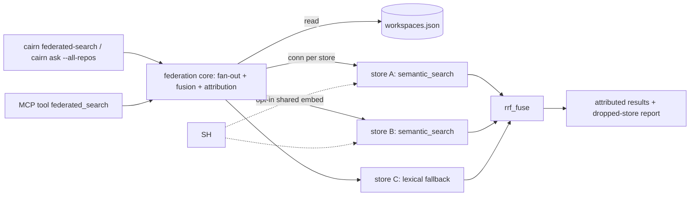

# Tech Spec: cross-repo-federation

**Spec**: [spec.md](spec.md) | **Created**: 2026-09-16
**Every file/symbol citation below must come verbatim from [survey.md](survey.md)
or a grep run in this session — never from memory.**
Evidence classes used here: `(survey S#)` = survey.md items; `(session run)` =
output of a cairn CLI / grep command executed this session, command shown.

## Architecture

Federation is a fan-out query over the machine-wide workspace registry — no new
index, no store merging. A single federation core module opens a read-only
connection per registered store, runs the existing per-store retrieval entry
point in each, fuses the per-store ranked lists with the same RRF the hybrid
retrieval stack already uses, and returns one attributed result set plus an
explicit dropped-store report. The MCP tool and the CLI command are thin
adapters over that one core; `cairn ask --all-repos` reuses the same
store-iteration and attribution plumbing to compose per-store compass-router
answers.

Grounding: the registry already enumerates every store (`REGISTRY_FILE`,
`_load_registry()`, `register_workspace()` — survey S1); every retrieval tool
today resolves one store only (survey S1 gap); rank fusion for incomparable
scores exists in `src/cairn/graph/fusion.py` but operates within one store
(survey S3); `dashboard/workspaces.py` already iterates registry stores outside
the active one (survey, supporting evidence).

## Solution

### Chosen approach

One new module, `src/cairn/graph/federation.py`, holding the whole
federation contract:

- `federated_search(query, ...) -> FederatedResult` — iterates
  `_load_registry()`, resolves each workspace via `resolve_store(workspace)`
 (session run: `grep -n "def resolve_store" src/cairn/paths.py` →
 `paths.py:355`, takes an explicit workspace argument), opens a per-store
 connection, calls the existing `semantic_search(conn, query, ...)`
 (session run: `src/cairn/graph/semantic.py:714`; already takes `conn` as its
 first parameter and already degrades to BM25-only results with
 `provenance="bm25"` when a store lacks embeddings — FR-001 lexical fallback
 needs no new engine), tags every hit with the repo key, and fuses the
 per-store lists with `rrf_fuse` (`src/cairn/graph/fusion.py:13`, session
 run). Stores that fail are classified `missing` / `locked` / `unindexed`
 and named in the result — never silently skipped (FR-004), following the
 dashboard precedent that classification "never raises and never writes"
 (survey, supporting evidence; session run:
 `src/cairn/dashboard/workspaces.py:137` catches `sqlite3.OperationalError`
 for "corrupt DB, locked beyond timeout").
- Surfaces (FR-001/FR-003), both thin adapters over the core:
  - New MCP tool `federated_search` in a new
    `src/cairn/mcp_server/tools_federation.py`, decorated
    `@mcp.tool(annotations=ToolAnnotations(readOnlyHint=True, ...))` like the
    existing read-only tools (session run: same decorator shape in
    `tools_graph.py`); registered by adding the module import to
    `mcp_server/server.py`.
  - New CLI command `cairn federated-search <query>` in `cli/query.py`,
    alongside `def search(pattern, kind, db, as_json, refresh)` (survey S4:
    query.py commands are def/callers/search/callees/impact/deps).
- `cairn ask --all-repos <question>` (FR-003): an opt-in flag on the existing
  `def ask(question, db, knowledge, as_json)` in `src/cairn/cli/ask_context.py`
 (survey S4). With the flag set, ask runs `route_query` once per reachable
 store with that store's conn and knowledge bundle and composes an attributed
 answer; default off keeps the single-store path byte-identical (FR-005).

FR-002: an opt-in `--shared-embed` mode. Compatibility test = every reachable
store's embedding model stamp is equal (model identity is already derivable per
store: `DEFAULT_LOCAL_MODEL = "BAAI/bge-m3"`, `HASH_MODEL = "hash-256-v1"`,
`def current_model(corpus)` — session run, `src/cairn/graph/embeddings.py:39-50`).
Compatible → embed the query once and reuse the vector across stores;
otherwise each store embeds with its own backend and only ranks fuse.
Default is off (per-store vectors, rank-level fusion), per the spec's WHERE.

**FR coverage**: FR-001 → `federated_search` core + MCP tool + CLI command +
BM25 fallback; FR-002 → `--shared-embed` with model-stamp compatibility check;
FR-003 → `ask --all-repos` composing `route_query` per store; FR-004 →
per-store state classification and named dropped-store report in
`FederatedResult`; FR-005 → all changes are additive (new module, new tool,
new command, opt-in flag); no existing symbol's signature or default changes.

No new runtime dependency is introduced (RRF, protocols, embedding backends,
registry all exist) — the C-03 dependency gate is satisfied vacuously.

### Alternatives rejected

[research.md](research.md) is "not applicable — no open questions at Stage 0";
each rejection below therefore traces to a survey constraint or the spec's own
recorded trade-offs.

| Alternative | Why rejected |
|-------------|--------------|
| Central multi-repo merged index | Spec Out list: "federation queries stores, it does not merge them"; survey S1 gap is a query path, not storage. |
| Merge raw similarity scores across stores | Spec risk section: cross-backend scores are incomparable; survey S3: RRF is the established answer. |
| Networked/remote federation | Spec Out list: remote federation over the network deferred; registry stores are local paths (survey S1). |
| `--all-repos` flag on existing `cairn search` | `search` is the structural symbol search (survey S4); conflating structural and semantic surfaces risks FR-005; a new command was mandated by FR-001 anyway. |
| Reuse `cross_repo_deps` namespace machinery for semantic federation | Survey S2: it maps repo-name → path *inside one DB*; federation must span separate DBs listed in the registry (survey S1). |
| Federate inside `dashboard/workspaces.py` | Survey lists it as consumer-side precedent only; the dashboard keeps its own `_load_registry` copy and filesystem classification — a query API does not belong behind a UI module. |

## Impact analysis

Graph-tool runs this session (cairn CLI; precise mode unless noted). Caveat
per AGENTS.md: precise results under-report for common names — `ask` is a
common token and click registers commands by decorator, so its 2 resolved
callers are a floor, not truth; the registry helpers are underscore-private, so
their precise results are trustworthy.

| Symbol (evidence class) | Blast radius (session run) | Effect of this spec |
|---|---|---|
| `rrf_fuse` — `src/cairn/graph/fusion.py:13` (session run; file in survey S3) | `cairn impact rrf_fuse`: 288 impacted; direct callers: 4 tests in `tests/test_fusion.py`, `search_memory` (`memory/promotion.py`), `_fuse_candidates` (`graph/search_pipeline.py`) | Reused unchanged at a new call site (federation core). No signature/default change. |
| `cross_repo_deps` — survey S2 | `cairn impact cross_repo_deps`: 91 impacted; depth-0 includes `deps` (`cli/query.py`), `cross_repo_deps`/`impact_analysis` (`mcp_server/tools_graph.py`), `_graph_bridge` (`knowledge/search.py`), `get_deps_graph` (`viz/query.py`), `_graph_derived_wiki` (`wiki/generator.py`), `_compute_dataflow_row` (`graph/dataflow.py`), 2 tests in `tests/test_cross_repo_namespaces.py`, 1 in `tests/test_audit_remediation.py` | Untouched. Structural cross-repo path stays exactly as is (FR-005). |
| `register_workspace` / `_load_registry` — survey S1 | `cairn impact register_workspace`: 4 impacted; depth-0: `init` (`cli/core.py`), `test_workspace_registration_stays_in_sandbox` (`tests/test_hermetic_stores_root.py`) | Registry consumed read-only via `_load_registry()`; no write-path change. |
| `ask` — survey S4 | `cairn callers ask`: 2 resolved (`cli/agents.py:114 install_agents`, module `ask_context.py:14`) — common name, precise floor only | New keyword-only flag appended; default off. |
| `semantic_search` — `src/cairn/graph/semantic.py:714`, MCP tool `src/cairn/mcp_server/tools_graph.py:607` (session run) | Called per store by the federation core; per-store behavior, defaults, and return shape unchanged | New caller only. |

### Test-tree sweep (default flips)

Flip 1 — registering one new MCP tool changes the tool count. Enumerated
exact-count pins (session run: `grep -rn "_EXPECTED_TOOL_COUNT\|== 24" ...`):

- `src/cairn/mcp_server/server.py:56` — `_EXPECTED_TOOL_COUNT = 24`
  (production boot guard `verify_tool_count`): must become 25. Exact-count pin.
- `tests/test_graft_parity_map.py:587` — `assert server._EXPECTED_TOOL_COUNT == 24`. Exact-count pin.
- `tests/test_ingest_compat.py:243` — `assert _EXPECTED_TOOL_COUNT == 24` (imports at :240). Exact-count pin.
- `tests/test_status_resource_health.py:281` — `assert _EXPECTED_TOOL_COUNT == 24` (imports at :27). Exact-count pin.

Flip 2 — `ask --all-repos` (new flag, default off). Sweep (session run:
`grep -rn "\bask\b|--all-repos|all_repos" tests/`): no test in `tests/`
invokes the CLI `ask` command and `--all-repos` appears nowhere — zero flag
pins, zero exact-traffic pins. `tests/test_tool_annotations.py` iterates its
local `_GRAPH_READ_ONLY_TOOLS` name list (line 154) and does not enumerate the
live registry: behavior pin, unaffected (optionally add `federated_search` to
that list to extend coverage).

Flip 3 — `--shared-embed` (new flag, default off): new surface, no existing
test can pin it. Zero pins.

Behavior pins that must stay green (classify: unaffected):

- `tests/test_fusion.py::test_rrf_known_values`, `::test_rrf_handles_disjoint_lists`,
  `::test_rrf_is_score_scale_invariant`, `::test_weights_shift_ranking` —
  `rrf_fuse` reused unchanged.
- `tests/test_hermetic_stores_root.py::test_workspace_registration_stays_in_sandbox`
  — registry read/write paths untouched; pins that consumers reach the
  registry through `paths` attributes, which the federation core must respect.
- `tests/test_dashboard_scale.py:250` — `tools == len(_SCALE_TOOLS)` counts
  rows its own fixture seeded into `tool_metrics`, not the live tool registry:
  unaffected.
- `tests/test_cross_repo_namespaces.py` (both tests) — `cross_repo_deps`
  untouched: unaffected.

## Code guide

### Federation core — new `src/cairn/graph/federation.py`
- Touches: new file; reads `_load_registry()` and `resolve_store(workspace)`
  in `src/cairn/paths.py` (survey S1; session run for `resolve_store` :355),
  calls `semantic_search` (`src/cairn/graph/semantic.py:714`, session run) and
  `rrf_fuse` (`src/cairn/graph/fusion.py`, survey S3).
- Approach: iterate registry entries; per store classify state
  (`ok` / `missing` / `locked` / `unindexed`) with the never-raise contract of
  the dashboard enumerator (survey supporting evidence); per reachable store
  call `semantic_search(conn_i, query, ...)`; tag hits with the repo key;
  `rrf_fuse` the per-store lists; return attributed results + named dropped
  stores. `--shared-embed`: compare per-store model stamps
  (`current_model`, session run `src/cairn/graph/embeddings.py:50`) and embed
  the query once when all equal.
- Verify before implementing: `grep -n "def _load_registry\|def resolve_store" src/cairn/paths.py`
- Pitfalls: read the registry through `paths._load_registry()` — never
  re-read `REGISTRY_FILE` directly; module attributes are import-time-bound
  and the hermetic fixture patches them
  (`tests/test_hermetic_stores_root.py` docstring, session run). No eager
  `cairn.cli` imports (Constitution C-04).

### MCP surface — new `src/cairn/mcp_server/tools_federation.py` + `server.py`
- Touches: `FastMCP("cairn")` instance in `mcp_server/_server_core.py:80`
  (session run); module-import registration in `mcp_server/server.py`
  (session run: "Importing the tools_*.py modules registers every
  @mcp.tool()"); `_EXPECTED_TOOL_COUNT` at `server.py:56` (session run).
- Approach: one `federated_search` tool, read-only annotations matching the
  existing tool decorator shape; thin adapter over the core; bump
  `_EXPECTED_TOOL_COUNT` 24 → 25 and update the three pinned tests.
- Verify before implementing: `grep -n "_EXPECTED_TOOL_COUNT" src/cairn/mcp_server/server.py`
- Pitfalls: `verify_tool_count` asserts at server start — a forgotten bump
  fails boot, not tests; three test files pin `== 24` (see sweep).

### CLI surface — `cli/query.py` (new command) and `cli/ask_context.py` (`--all-repos`)
- Touches: `def search(pattern, kind, db, as_json, refresh)` neighborhood in
  `cli/query.py` (survey S4); `def ask(question, db, knowledge, as_json)` in
  `src/cairn/cli/ask_context.py` (survey S4).
- Approach: `cairn federated-search "QUERY" [--limit N] [--shared-embed]
  [--json]` delegating to the core; `ask --all-repos` loops reachable stores,
  runs `route_query` per store with that store's conn and knowledge bundle,
  and prints/blocks per-repo attributed sections in the existing output style.
- Verify before implementing: `grep -B1 -A3 "^def " src/cairn/cli/query.py | grep "def "` (survey S4 verify command)
- Pitfalls: keep the flag default off so the single-store ask path is
  byte-identical (FR-005); follow the module's lazy-import style inside
  command bodies (`ask_context.py` imports `route_query` inside `ask`,
  session run).

### Tests — `tests/`
- Touches: new fixture multi-store federation tests (spec In scope); the
  three exact-count pin files listed above.
- Approach: build N temp registered stores via `register_workspace`
  (survey S1) inside the hermetic sandbox; assert merged attribution,
  lexical fallback for an embedding-less store, named dropped store for a
  missing/locked store, and single-store unchanged behavior (FR-005).
- Verify before implementing: `grep -rn "_EXPECTED_TOOL_COUNT == 24" tests/`
- Pitfalls: C-02 failing-test-first per task; C-04 — never leak workspaces
  into the real `~/.cairn`, never patch global `subprocess.Popen`.

## References

[research.md](research.md): "not applicable — no open questions at Stage 0" —
no external references were gathered; none are cited. In-repo anchors (session
runs): `src/cairn/mcp_server/server.py` (`verify_tool_count` boot guard),
`src/cairn/graph/embeddings.py` (model identity for FR-002),
`src/cairn/dashboard/workspaces.py` (`enumerate_stores` state precedent).

## Decisions

### D-001: Fuse federated results at rank level with the existing RRF
- **Context**: Store scores are incomparable across embedding backends (spec risk; survey S3).
- **Decision**: Cross-store merge uses `rrf_fuse` on per-store ranks; raw scores are never merged.
- **Consequences**: Federation inherits RRF score semantics (small rank-fusion numbers); per-store provenance fields survive fusion.

### D-002: Federation is registry fan-out, not a new index
- **Context**: The registry already enumerates every store (survey S1); spec Out list excludes a central index.
- **Decision**: `federated_search` iterates `_load_registry()` and queries stores live; nothing is merged or cached across stores.
- **Consequences**: Result freshness equals per-store freshness; a slow store bounds fan-out latency, mitigated by per-store state classification instead of timeout tuning.

### D-003: One new MCP tool, registered with a tool-count bump
- **Context**: The boot guard `_EXPECTED_TOOL_COUNT = 24` (`server.py:56`) and three test pins assert the registered tool count (session sweep).
- **Decision**: Add `federated_search` in `tools_federation.py`; bump the constant to 25 and update `tests/test_graft_parity_map.py`, `tests/test_ingest_compat.py`, `tests/test_status_resource_health.py`.
- **Consequences**: All four sites move together in one task; forgetting any one fails CI or server boot.

### D-004: `--all-repos` is an opt-in flag on the existing `ask` command
- **Context**: FR-003 requires cross-store ask; FR-005 freezes single-store behavior (survey S4).
- **Decision**: Append a default-off flag to `ask`; no new ask-like command, no default-path change.
- **Consequences**: The flag's presence is the only ask-surface delta; the federated composition shares the federation core's store-iteration helper.

### D-005: Shared-embedding mode is opt-in and stamp-gated
- **Context**: FR-002 makes the shared backend conditional on compatible backends.
- **Decision**: `--shared-embed` (default off); enabled mode embeds the query once only when every reachable store's model stamp is equal, else falls back to per-store embedding with rank-level fusion (D-001).
- **Consequences**: No cross-backend vector comparison ever happens; adding a store with a different backend degrades gracefully, not erroneously.

### D-006: Dropped stores are first-class results, modeled on the dashboard states
- **Context**: FR-004 forbids silent skips; the dashboard already classifies stores without raising (survey supporting evidence).
- **Decision**: Every registry entry appears in the result as `ok`, `missing`, `locked`, or `unindexed`; unreachable stores never abort the query.
- **Consequences**: Classification lives in one core helper shared by all surfaces; partial results are always labeled partial.

### D-007: Lexical fallback reuses the existing BM25 path
- **Context**: FR-001 requires coverage of stores without embeddings; `semantic_search` already returns BM25-only results with `provenance="bm25"` (session run, semantic.py docstring).
- **Decision**: No new lexical engine; an embedding-less store contributes its BM25-ranked list to the same fusion.
- **Consequences**: Store coverage is uniform (every indexed store participates); provenance distinguishes lexical hits in attributed output.

### D-008: Kept red flag — two query surfaces over one core
- **Context**: Design review: an MCP tool plus a CLI command duplicates the adapter layer (add-before-subtract smell).
- **Decision**: Keep both — FR-001 mandates each surface explicitly; both stay thin (no logic outside the core).
- **Consequences**: Any new federation option lands in the core signature once; adapters only translate arguments and rendering.

### D-009: lexical fallback lives in the federation core
- **Context**: D-007 assumed `semantic_search` degrades to bm25-only for
  embedding-less stores; empirically the dense leg returns None → fusion
  bails → empty result on such stores (verified on fixture stores).
- **Decision**: `iter_stores`/the core gate per store via `_has_embeddings`;
  embedding-less stores are served by the existing `search_symbols` (the
  same sparse surface `semantic_search`'s bm25 leg uses), shaped to the hit
  contract with `provenance="bm25"`. No engine change.
- **Consequences**: FR-001's "lexical fallback where a store lacks
  embeddings" holds via the core; `semantic_search` semantics untouched.

### D-010: per-store re-pinning in iter_stores
- **Context**: `resolve_store(workspace)` honors CAIRN_DB/CAIRN_KNOWLEDGE
  env unconditionally (set by the MCP server lifecycle), so verbatim
  per-store resolution would collapse every store onto the server's db.
- **Decision**: `iter_stores()` resolves each registry entry then re-pins
  db/knowledge to that entry's own store home; constraint documented at
  the helper.
- **Consequences**: fan-out visits distinct stores even under a
  env-pinned server process; single-store behavior unchanged.
