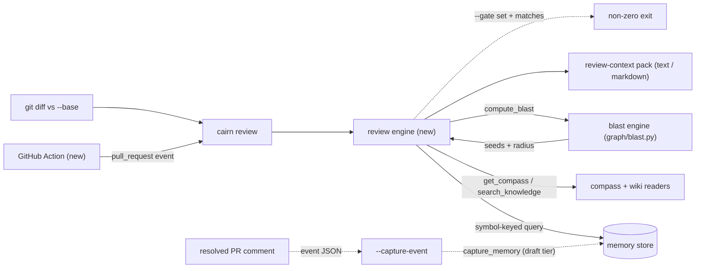

# Tech Spec: pr-review-loop

**Spec**: [spec.md](spec.md) | **Created**: 2026-09-17
**Every file/symbol citation below must come verbatim from [survey.md](survey.md)
or a grep run in this session — never from memory.**

## Architecture

The review loop is a new consumer layer over four existing surfaces; it owns
composition and formatting, and modifies none of them.

Today the surfaces are disjoint: the blast engine is radius-only
(survey S1 gap: "no memory/compass/wiki enrichment, no pre-submit mode"),
the memory store captures only failure signatures (survey S3 gap: "nothing
captures resolved review comments"), and the compass/wiki readers are
"not composed into any review-facing pack" (survey S4 gap). The review
engine closes all three gaps by calling `compute_blast`
(`src/cairn/graph/blast.py:471`), `search_memory`
(`src/cairn/memory/promotion.py:242`), `get_compass` and `search_knowledge`
(`src/cairn/mcp_server/tools_compass.py:34` / `:50`) — the composition
FR-005 requires — without duplicating graph or memory logic.

## Solution

### Chosen approach

A new engine module `src/cairn/review/` with a thin CLI wrapper
`src/cairn/cli/review.py`, mirroring the repo's engine/CLI split
(`src/cairn/graph/blast.py` + `cli/blast.py`, survey S1). Three disjoint
modes on one `review` command (D-005):

1. **Context pack (FR-001)** — `cairn review --base <ref>` calls
   `compute_blast` and reads the `seeds` and `changed_files` fields of its
   returned dict (session grep, blast.py result block: `"seeds": seeds`,
   `"changed_files": changed`). Enrichment queries the memory store keyed to
   seed symbols, pulls compass modules and wiki pages via `get_compass` /
   `search_knowledge(type_filter="Wiki")` (survey S4), and renders a pack in
   text and markdown — the same two-format contract as `render_blast`
   (session grep, blast.py: `def render_blast(result: dict, output_format:
   str)`, text | markdown | mermaid). Empty radius exits 0 with a
   no-dependents statement (US1 AC2).
2. **Pre-submit guard (FR-002)** — `cairn review --pre-submit` reuses the
   same seeding path, queries the memory store for type `mistake` and
   `pattern` matched to seed symbols, and prints one warning per match with
   its recorded guidance. Exit 0 unless `--gate` is set and ≥1 match exists
   (FR-002 verbatim, D-004).
3. **Auto-capture (FR-003)** — `cairn review --capture-event <file>` reads a
   GitHub resolved-comment event payload, maps the comment's file+line to the
   enclosing symbol via the stored spans `line_start INTEGER,` /
   `line_end INTEGER,` (`src/cairn/graph/schema.py:42-43`, survey S2),
   records the comment through `capture_memory`
   (`src/cairn/memory/promotion.py:21`, survey S3) as mistake or pattern
   (D-003), keyed to those symbols, with the PR thread link in the body.
   Captures enter the existing draft tier lifecycle (decay applies) per the
   spec's memory-volume mitigation. Degrades to file-level keying when no
   symbol span encloses the comment line (spec risk mitigation).

**GitHub Action (FR-004)**: a new workflow under `.github/workflows/`
(survey: "none exists under .github/workflows for review") that on
pull_request events runs `cairn review --pre-submit` and posts findings as a
PR comment, gate off by default (D-004). The existing local hooks directory
(`src/cairn/hooks/: claude_hooks.py, cursor_hooks.py, git_hooks.py`, survey
supporting evidence) stays an optional local install surface for the same
pre-submit check.

| FR | Solution element |
|----|------------------|
| FR-001 | Mode 1 (context pack) |
| FR-002 | Mode 2 (pre-submit + `--gate`) |
| FR-003 | Mode 3 (`--capture-event`) |
| FR-004 | GitHub Action workflow |
| FR-005 | Read-only reuse of all four surfaces; zero edits to `graph/blast.py`, `memory/promotion.py`, `mcp_server/tools_compass.py` (D-001, D-002) |

**Design screens applied**: the engine holds real composition logic
(matching, span mapping, formatting, gating) — no pass-through layer over
the surfaces it calls; GitHub event JSON is adapted to domain types
(comment text, file, line, symbols) at the CLI boundary, never leaked into
the engine; span mapping and type classification each live in one function,
no scattered validation; subtract-before-add held — no new tables, no new
storage, no public seam needed in blast (the result dict already carries
`seeds`). Two red flags kept deliberately, both recorded: CLI→mcp_server
import direction (D-002) and flag-modes on one command (D-005).

### Alternatives rejected

research.md: "not applicable — no open questions at Stage 0"; every why
below traces to a survey constraint or spec constraint.

| Alternative | Why rejected |
|-------------|--------------|
| Enrich inside `compute_blast` (extend `src/cairn/graph/blast.py:471`) | Survey S1 marks the engine radius-only and S4 shows enrichment belongs in a pack layer; composing memory/compass into the graph layer inverts the layering FR-005 separates |
| Re-diff and re-seed symbols inside the review engine (skip `compute_blast`) | FR-005 forbids duplicating graph logic; survey S1 shows `blast.py:116 _changed_files(conn, workspace, base)` + `blast.py:162 _seed_symbols(conn, changed)` already do it, and the result dict already returns seeds (session grep) |
| New table/storage for captured review comments | Survey S3: the memory store (`capture_memory`, types, tiers, decay, the `memory_failure_signatures` auto-capture precedent at `src/cairn/graph/schema.py:138`) already persists symbol-keyed memories; spec mitigation says captured memories use the existing tier lifecycle |
| Capture via local git hooks only (extend `src/cairn/hooks/git_hooks.py`) | Spec assumption pins the trigger to resolved GitHub review comments — a server-side event local hooks cannot observe; survey supporting evidence: "GitHub-side capture needs a new Action" |
| Pre-submit gates (non-zero) by default in CI | FR-002: "exit code shall be non-zero only when configured to gate"; US2 asks for warnings, not a blocking gate |

## Impact analysis

Blast radius mapped with the workspace graph CLI (`cairn impact` /
`cairn callers`, this session); symbol/file existence grounded in survey.md.

| Symbol (survey cite) | Direct callers (precise, this session) | Effect of this feature |
|----------------------|----------------------------------------|------------------------|
| `compute_blast` — `src/cairn/graph/blast.py:471` | 1: `blast` in `src/cairn/cli/blast.py:41` (`cairn impact compute_blast` → Total impacted: 1). Fuzzy identical — no name-collision inflation | New caller only; function untouched |
| `capture_memory` — `src/cairn/memory/promotion.py:21` | 3 src: `memory_record` (cli/memory.py:54), `memory_capture` (cli/memory.py:183), `record_memory` (mcp_server/tools_memory.py:158) + 38 test-site lines (e.g. `test_capture_memory_redacts_title`, tests/test_redaction_chokepoints.py:244) | New caller only; called with existing contract |
| `search_memory` — `src/cairn/memory/promotion.py:242` | 5 src: `_retrieve_l4` (eval.py:498), `memory_search` (cli/memory.py:114), `_search_memory` (compass/router.py:265), `recall_memory` (mcp_server/tools_memory.py:50), `explore` (mcp_server/tools_graph.py:478) | New caller only; biggest radius in the touched set — recursive `cairn impact search_memory` counts 279 impacted nodes |
| `search_knowledge` / `get_compass` — `src/cairn/mcp_server/tools_compass.py:50` / `:34` | Precise callers resolve only inside their own module — the `search` module name (`src/cairn/knowledge/search.py:38`) collides with the tool wrapper, so edges are ambiguous (common-name caveat: precise ≠ "no callers"; fuzzy confirms no other consumers) | Review becomes the first CLI-side consumer |
| `promote_memory` — `src/cairn/memory/promotion.py:397` | `memory_promote` (cli/memory.py:333) + tests | Untouched; captured memories stay drafts until manual promotion |

**What breaks if the approach is wrong**: nothing existing — every touched
symbol is called read-only and none is modified, so the 279-node
`search_memory` impact graph and the blast CLI contract are unaffected.
Failure modes are contained in the new module (wrong enrichment matches,
wrong exit code, wrong span mapping).

**Default-flip sweep**: no decision in this spec flips an existing default
— no existing flag, keyword, or return shape changes (all additions are a
new command, a new module, a new workflow). The brief's mandatory test-tree
sweep for flag pins / exact-count pins / exact-traffic pins is therefore not
triggered. Nearest risk noted for the implementer: `search_memory`'s
existing assertion tests (e.g. `test_default_hides_superseded`,
tests/test_memory_lifecycle.py:110) pin its behavior — the feature must call
it, never wrap or alter it.

## Code guide

### Context pack — `cairn review --base <ref>` (FR-001)
- Touches: new `src/cairn/cli/review.py` + new `src/cairn/review/` engine;
  reuses `def compute_blast(` in `src/cairn/graph/blast.py:471` (survey S1),
  `def search_memory(` in `src/cairn/memory/promotion.py:242` (survey S3),
  `def get_compass(module: str)` / `def search_knowledge(query: str,
  type_filter: str = "", ...)` in `src/cairn/mcp_server/tools_compass.py:34`
  / `:50` (survey S4)
- Approach: pack = blast result (seeds, radius, basis) + per-seed memory
  matches + compass/wiki sections; text and markdown emitters
- Verify before implementing: `grep -n "def compute_blast\|_seed_symbols" src/cairn/graph/blast.py`
- Pitfalls: survey S1 gap — blast output is radius-only by design; keep
  enrichment in the review engine. `--fuzzy` and `--refresh/--no-refresh`
  ("Reindex drifted files before diffing") are existing `cli/blast.py` flags —
  mirror their semantics rather than inventing new ones

### Pre-submit guard — `cairn review --pre-submit` (FR-002)
- Touches: same engine + CLI module; `def search_memory(` in
  `src/cairn/memory/promotion.py:242`
- Approach: seed symbols from the diff, query type mistake + pattern, one
  warning per match; exit non-zero only with `--gate` (D-004)
- Verify before implementing: `grep -n "@memory.command" src/cairn/cli/memory.py`
- Pitfalls: `search_memory` has 279-node recursive impact — call it, do not
  modify it (Impact analysis); exit-code contract is the FR-002 text verbatim

### Auto-capture — `cairn review --capture-event` (FR-003)
- Touches: new capture path in the engine calling `def capture_memory(` in
  `src/cairn/memory/promotion.py:21`; span mapping reads `line_start
  INTEGER,` / `line_end INTEGER,` from `src/cairn/graph/schema.py:42-43`
  (survey S2)
- Approach: adapt event JSON at the CLI boundary; classify type
  deterministically (D-003); record as draft-tier memory keyed to enclosing
  symbols with the PR thread link; file-level keying when no span encloses
- Verify before implementing: `grep -n "line_start\|line_end" src/cairn/graph/schema.py`
- Pitfalls: survey S3 gap — existing capture is failure-signature-shaped
  (`CREATE TABLE IF NOT EXISTS memory_failure_signatures (` at
  `src/cairn/graph/schema.py:138`); do not extend that path, add a
  review-specific capture that calls `capture_memory`. Redaction applies at
  the `capture_memory` chokepoint (session caller data:
  `test_capture_memory_redacts_title`) — keep the thread link a plain URL.
  Survey S2 gap — no GitHub-comment-to-symbol mapping exists yet; the span
  mapper is new code

### GitHub Action (FR-004)
- Touches: new workflow file under `.github/workflows/` (survey: "none
  exists under .github/workflows for review")
- Approach: pull_request event → `cairn review --pre-submit` → post findings
  as PR comment; gate off by default (D-004)
- Verify before implementing: `ls .github/workflows`
- Pitfalls: the Action ships the repo's own CLI — pin how the workflow
  installs cairn in CI; a local install surface for the same check exists
  via `src/cairn/hooks/` (`claude_hooks.py, cursor_hooks.py, git_hooks.py`,
  survey supporting evidence) if wanted later

## References

- research.md: "not applicable — no open questions at Stage 0" — no external
  references sourced.
- [spec.md](spec.md) — FRs, scope Out (no LLM judgments, no GitLab adapters),
  assumptions/risks (span-mapping imprecision, memory volume).
- [survey.md](survey.md) — S1–S4 evidence and gaps; all citations above.
- specs/CONSTITUTION.md — C-02 (failing-test-first tasks), C-03 (no new
  runtime dependency — this design adds none), C-04 (no eager
  `cairn.cli`/`cairn.mcp_server` imports in test modules → D-002).

## Decisions

### D-001: Review loop is a read-only consumer; zero edits to existing engines
- **Context**: FR-005 requires reusing the blast engine, memory store API,
  and compass/wiki readers without duplicating logic; the alternative —
  enriching inside them — would grow their blast radius
  (`search_memory`: 279-node recursive impact, this session).
- **Decision**: new `src/cairn/review/` engine + `src/cairn/cli/review.py`
  only; `graph/blast.py`, `memory/promotion.py`, and
  `mcp_server/tools_compass.py` are called, never modified. The seed list
  comes from the `seeds` field `compute_blast` already returns (session
  grep), so no new public seam is added to the blast module.
- **Consequences**: existing tests and callers of all four surfaces stay
  green by construction; all review-loop risk is contained in the new
  module; no new runtime dependency (C-03 satisfied — nothing imported that
  is not already a cairn surface).

### D-002: Compass/wiki readers imported lazily from mcp_server
- **Context**: FR-005 names the compass/wiki readers, and survey S4 locates
  them at `src/cairn/mcp_server/tools_compass.py:34` / `:50` — a CLI-side
  engine importing from `mcp_server` inverts the usual import direction, and
  constitution C-04 forbids eager `cairn.mcp_server` imports in test modules
  (a top-level engine import would transitively violate it for every test
  importing the engine).
- **Decision**: keep the red flag (import from `tools_compass.py`) and make
  it lazy — the review engine imports `get_compass` / `search_knowledge`
  inside the enrichment function, never at module top level.
- **Consequences**: no duplication of reader logic (FR-005) and C-04 holds
  for tests; cost is a deferred import that fails at call time, not import
  time — the enrichment function must surface that error as a pack-level
  degradation, not a crash.

### D-003: Capture type classification is deterministic, not judged
- **Context**: FR-003 records each accepted comment as mistake or pattern;
  the spec's Out list excludes LLM judgment ("cairn supplies context, not
  judgments"), so classification cannot be inferred.
- **Decision**: the thread decides — a `cairn:pattern` label on the resolved
  thread records type `pattern`; anything else records `mistake`. Keying
  uses the enclosing symbol spans (`schema.py:42-43`), file-level fallback
  when no span encloses the comment line (spec risk mitigation).
- **Consequences**: misclassification is possible but correctable through
  the existing memory lifecycle (`promote_memory` at
  `src/cairn/memory/promotion.py:397`, evolution commands under
  `cli/memory.py`); captured memories stay drafts subject to decay, bounding
  the memory-volume risk the spec names.

### D-004: Gate is opt-in; findings are always printed
- **Context**: FR-002 fixes the exit contract ("non-zero only when
  configured to gate") and US2 wants warnings, not blocks; FR-004's Action
  must not break PRs on day one.
- **Decision**: `cairn review --pre-submit` exits 0 with warnings listed,
  unless `--gate` is passed and ≥1 mistake/pattern match exists; the GitHub
  Action invokes it without `--gate`.
- **Consequences**: enabling the gate later is a one-word workflow change;
  the warnings-always path is what the Action posts as PR comments.

### D-005: One `review` command with disjoint flag modes
- **Context**: FR-001 and FR-002 pin flag-shaped invocations
  (`--base`, `--pre-submit`); FR-003's hook needs a third entry point, and
  mixing subcommands with the FR-pinned flag shapes would split one surface
  in two.
- **Decision**: single `cairn review` command; modes are mutually exclusive
  flags (`--base <ref>` | `--pre-submit` | `--capture-event <file>`) with
  the command erroring when more than one is given.
- **Consequences**: one registration point and one help surface; the
  mutual-exclusion check lives in the CLI wrapper, keeping the engine
  callable as three plain functions (testable without the CLI, per C-04).

### D-011: CI memory seeding via committed bundle
- **Context**: T010's live validation proved the workflow's comment path,
  but as authored findings can never fire on a real repo — the CI store is
  fresh per runner and review.yml seeded no memories (silently green under
  continue-on-error; scratch-repo PR 3 evidence in notes/T010.md).
- **Decision**: commit a seed OKF bundle at `.cairn-knowledge/` and point
  the workflow's `CAIRN_KNOWLEDGE` at it, so mistake/pattern memories ride
  the repo and findings are reproducible from a clean clone.
- **Consequences**: the seed bundle is reviewable content; PRs touching
  keyed symbols get warnings in CI; no store cache needed.

### D-012: comment PATCH path — issues/comments/{id}, not issues/{n}/comments/{id}
- **Context**: PR #129's second run failed the comment step with 404; the
  workflow PATCHed `repos/{o}/{r}/issues/{number}/comments/{id}`, an alias
  GitHub accepts on some surfaces but 404s on PATCH here (verified
  empirically both ways against the live comment).
- **Decision**: `.github/workflows/review.yml` PATCHes
  `repos/$GITHUB_REPOSITORY/issues/comments/$comment_id` (the documented
  endpoint; the LIST/POST paths keep the issue number).
- **Consequences**: reruns upsert the marker comment correctly; the
  advisory check can no longer fail on dedup updates.
