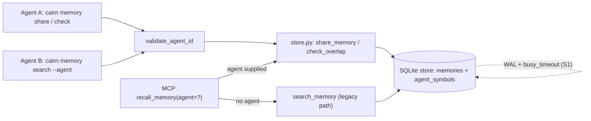

# Tech Spec: shared-memory-bus

**Spec**: [spec.md](spec.md) | **Created**: 2026-09-17
**Every file/symbol citation below must come verbatim from [survey.md](survey.md)
or a grep run in this session — never from memory.**
Session citations are marked `[session]` with a re-runnable verify.
[research.md](research.md): "not applicable — no open questions at Stage 0",
so every rejected alternative traces to a survey constraint or a spec.md
ruling.

## Architecture

Three additive surfaces over the existing store — no changes to existing
function signatures:

One store, one write chokepoint family. The dotted edge is the
pre-existing WAL substrate on the shared `connect()` path (S1:
`PRAGMA journal_mode = WAL` at src/cairn/graph/schema.py:844,
`PRAGMA busy_timeout` at :851). Sharing adds one table
(`agent_symbols`) to `_apply_schema` (src/cairn/graph/schema.py:599)
and two verbs to the `memory` CLI group (registered at
src/cairn/cli/__init__.py:36); recall integration hangs off the
existing `recall_memory` MCP tool (src/cairn/mcp_server/tools_memory.py:21).

## Solution

### Chosen approach

1. **Share** (FR-001): `cairn memory share --agent <id> --symbols a,b,c
   <memory_id>` validates the agent id, then inserts
   `(agent_id, symbol, memory_id, kind='share', ts)` rows into
   `agent_symbols`. The memory body is never copied — existing rows stay the
   single source of truth (D-006).
2. **Overlap check** (FR-002): `cairn memory check --agent <id> --symbols
   a,b,c` records the caller's edit intent (`kind='intent'`), then queries
   for *other* agent ids whose recent `share`/`intent` rows intersect the
   symbol set — one warning line per conflict naming the other agent and the
   overlapping symbols.
3. **Recall read-through** (FR-003): `recall_memory` gains an optional
   caller-supplied `agent` parameter. Absent → the single-agent code path is
   byte-identical to today's (FR-004). Present → other agents' `share` rows
   on the recalled symbols merge into the results before the degradation
   footnote, rendered in the standard per-result format plus an
   attribution line (D-003).

Identity is caller-supplied and validated only at the share/check surface:
non-empty, length-capped (64), charset-sanitized to `[A-Za-z0-9._-]` by one
shared `validate_agent_id` helper (FR-006, D-001). Concurrency reuses the
existing substrate exactly (FR-005, D-004): WAL on writable opens +
`busy_timeout` on all connections through shared `connect()` (S1);
share/check writes are single-statement inserts, overlap reads use the
read-only `mode=ro` path. No new runtime dependency (C-03 satisfied: none
added).

FR coverage: FR-001 → share verb; FR-002 → check verb; FR-003 → recall
read-through; FR-004 → parameter-gated default path; FR-005 → D-004;
FR-006 → D-001.

### Alternatives rejected

| Alternative | Why rejected |
|-------------|--------------|
| MCP session id as agent identity | S3 gap: "session ids are per MCP session, not stable agent identities"; superseded by FR-006 ruling |
| Agent registration command | FR-006 ruling: "adds a step without adding trust"; surface validation is the whole trust model |
| Overlap via session-keyed joins (memory_refs/tool_metrics/events) | S3 gap: no session→agent mapping exists and "no overlap query exists"; FR-002 needs agent-named activity |
| Push notifications / subscriptions for visibility | Survey: "No memory-content resource; no subscription/notification machinery"; spec Out list defers MCP-resource subscriptions; read-through satisfies FR-003 |
| Separate shares database / sidecar file | Spec premise: "agents on one codebase share one cairn store path"; a second file splits the FR-005 write chokepoint and risks the byte-identity sidecar pins |
| New cross-agent advisory/file locking protocol | S1 gap notes none exists, but WAL + busy_timeout + single-statement idempotent inserts already serialize the two new write shapes (subtract before add) |
| `share`/`check` as MCP tools | FR-001 names the CLI form; repo direction trims memory verbs from the MCP registry `[session]` (tests/test_memory_mcp_trim.py:55) |

## Impact analysis

### Blast radius (graph audit, this session)

- `cairn impact store_memory` → **Total impacted: 139** (depth 0-2; cycles
  detected: `['run']`). Direct source callers (precise resolution):
  `demote_memory` (src/cairn/memory/store.py:263), `add`/`update`
  (src/cairn/memory/store_protocol.py:86/:102), `capture_memory`
  (src/cairn/memory/promotion.py:85), `batch_critic` (:489), `decay` (:518),
  `evolve_memory` (:710), `memory_demote` (src/cairn/cli/memory.py) — plus
  test seeders `_seed_knowledge`, `_seed_memories`, `_seed_scale_store`.
- `cairn impact recall_memory` → **Total impacted: 11**: the footnote tests,
  the conn-leak test, and the stale-flag suite (enumerated below).
- Resolution caveat: precise mode follows only resolver-pinned edges;
  `add`, `update`, `store` are common names and can under-report. The fuzzy
  `cairn callers` pass returned the same src-side set, so no under-reporting
  is suspected; re-run with `fuzzy=True` before any signature change.
- **What breaks if done wrong**: changing `store_memory`
  (src/cairn/memory/store.py:99) or `create_memory` (:42) signatures ripples
  to 139 symbols. The design adds new functions beside them; the only
  signature this spec changes is the optional trailing `agent` on
  `recall_memory`.

### Test-tree sweep for the flips

The flips: (a) `recall_memory` output changes only when `agent` is supplied;
(b) two new CLI verbs; (c) new DDL in `_apply_schema`. Every test below was
read in this session `[session]`.

**Flag pins (assert the no-sharing default — must stay green unchanged):**
- tests/test_mcp_degradation_footnote.py::test_recall_memory_healthy_output_is_footnote_free — calls `recall_memory` with no agent context.
- tests/test_memory_stale_flag.py — all five via the `_recall` helper (:69): test_recall_flags_stale_when_cited_symbol_deleted, test_recall_no_stale_flag_for_memory_without_refs, test_recall_no_stale_flag_for_real_refs, test_recall_partial_stale_when_one_of_two_refs_gone, test_recall_does_not_crash_when_verification_raises. The `agent` parameter must default to None and skip the merge entirely.
- tests/test_cli_smoke.py::test_cli_help — membership assertions only (`"metrics" in result.output`); additive verbs are safe; do not convert to an exhaustive list.

**Exact-count pins (break on count changes):**
- tests/test_dashboard_readonly.py::test_full_route_pass_leaves_db_byte_identical (:218) — `assert before_rows == 4` on tool_metrics, DB sha256 digest unchanged, `assert sidecars == []` (no `-wal`/`-shm`). Constrains: read paths keep read-only opens; no writes on dashboard routes.
- tests/test_memory_lifecycle.py::test_weight_values_pinned (:192) — read-through must not perturb scoring weights for legacy results.
- tests/test_memory_store_fixes.py::test_store_twice_same_title_distinct_ids_h4 (:30) and tests/test_core_smoke.py::test_memory_store_distinct_ids_for_same_title (:161) — id-uniqueness pins; shares reference existing ids and must not mint new ones.

**Exact-traffic pins (assert what gets sent/rendered):**
- tests/test_mcp_degradation_footnote.py::test_recall_memory_carries_footnote_once (:228) — `out.count("degraded: rung 3 (server_down)") == 1` and `out.splitlines()[-1] == FOOTNOTE`: merged entries go BEFORE the footnote; footnote stays last, exactly once.
- tests/test_mcp_degradation_footnote.py::test_record_memory_never_carries_footnote (:252) — `out.startswith("Recorded decision")`: record output prefix untouched.
- tests/test_memory_stale_flag.py markers — per-result `"refs-verified=1.0"`, `"refs-verified=n/a (0 refs)"`, `"refs-verified=0.0"`, `"[STALE]"`: shared entries add an attribution line but never alter these marker formats.
- tests/test_dashboard_readonly.py::test_full_route_pass_leaves_db_byte_identical (sidecar assertion) and ::test_launcher_interactions_leave_every_store_byte_identical (:485) — a journal-mode flip on read paths would create sidecars and fail both.
- tests/test_memory_mcp_trim.py::test_six_memory_lifecycle_tools_absent_from_mcp_registry (:55) — registry absence pins; sharing stays CLI-only (D-005); ::test_six_memory_cli_verbs_remain_reachable (:122) pins the six verbs stay reachable.

**Behavior pins (unaffected, contracts to preserve in new paths):**
- tests/test_mcp_connection_leaks.py::test_recall_memory_closes_conn_on_exception (:181), ::test_record_memory_closes_conn_on_exception (:201) — conn hygiene on exception; the read-through query runs inside the same conn contract.
- tests/test_invariants.py::test_invariant_schema_migration_idempotent (:152) — new DDL must ride the idempotent `_apply_schema` path.

**Migration safety `[session]`**: `connect()` applies `_apply_schema` only on
writable opens, once per path per process under `_INIT_LOCK`; read-only opens
use a `mode=ro` URI and skip schema work (src/cairn/graph/schema.py:837-870;
verify: `sed -n '837,870p' src/cairn/graph/schema.py`). New tables land
before the byte-identity test's baseline digest (its seeder opens writable
first) and never on read-only opens.

## Code guide

### Schema — src/cairn/graph/schema.py
- Touches: `_apply_schema` (src/cairn/graph/schema.py:599).
- Approach: add `agent_symbols` as `CREATE TABLE IF NOT EXISTS` —
  `(agent_id TEXT NOT NULL, symbol TEXT NOT NULL, memory_id TEXT,
  kind TEXT NOT NULL, ts TEXT NOT NULL)` + index on `(symbol, ts)` — riding
  the idempotent executescript like the other tables.
- Verify before implementing: `pytest tests/test_invariants.py::test_invariant_schema_migration_idempotent`
- Pitfalls: read-only opens never apply schema (`mode=ro` URI path, S1) —
  never assume the table exists from a read-only connection before the store
  has been opened writable once.

### Store — src/cairn/memory/store.py
- Touches: new `share_memory` / `check_overlap` beside `create_memory`
  (src/cairn/memory/store.py:42) / `store_memory` (:99); the
  `validate_agent_id` helper lives here.
- Approach: `store_memory` keeps its signature (139-symbol blast radius);
  shares insert `agent_symbols` rows; `check_overlap` returns
  `(agent_id, symbol, kind, ts)` rows for other agents within the recency
  window.
- Verify before implementing: `pytest tests/test_memory_store_protocol.py tests/test_memory_store_fixes.py`
- Pitfalls: `store_memory` is the write chokepoint for capture/evolve/decay/
  demote (S4) — do not thread agent state through it.

### CLI — src/cairn/cli/memory.py
- Touches: `share` and `check` verbs on the `memory` group (registered at
  src/cairn/cli/__init__.py:36); `--agent` on `search`.
- Approach: follow the `demote` verb pattern `[session]` — the verb opens the
  DB via `--db` and passes the conn into the store function
  (tests/test_memory_mcp_trim.py docstring: demote "opens the graph DB via
  `--db` and passes a writable conn into `demote_memory`"). `check` writes
  intent rows via one writable open and reads conflicts via the read-only
  path.
- Verify before implementing: `pytest tests/test_cli_smoke.py tests/test_memory_mcp_trim.py`
- Pitfalls: the verb list in survey supporting evidence has no `share` /
  `check` / `--agent` today — the surface is purely additive.

### MCP recall — src/cairn/mcp_server/tools_memory.py
- Touches: `recall_memory` (src/cairn/mcp_server/tools_memory.py:21,
  `@mcp.tool` + `@instrument`) — optional trailing `agent` parameter.
- Approach: `agent=None` returns the current path's output unchanged
  (byte-identical, FR-004). Set → validate, merge other-agent share rows on
  the recalled symbols, render each in the standard per-result format plus an
  attribution line, keep the degradation footnote once and last.
- Verify before implementing: `pytest tests/test_mcp_degradation_footnote.py tests/test_memory_stale_flag.py tests/test_mcp_connection_leaks.py`
- Pitfalls: footnote-last-line and refs-verified/[STALE] pins are
  exact-traffic assertions — render merged entries before the footnote.

### Tests — new file(s) under tests/
- Touches: two-concurrent-simulated-agents fixture per the spec In-scope
  (share → other agent's recall surfaces it; check → warning names agent and
  symbols; concurrent writers).
- Approach: failing-test-first (C-02); obey C-04 — no eager
  `cairn.cli`/`cairn.mcp_server` imports at module level, `tmp_path`
  isolation (never the real `~/.cairn`), never patch global
  `subprocess.Popen`.
- Verify before implementing: `pytest tests/ -k memory` (baseline green)
- Pitfalls: WAL sidecars in tmp dirs are fine, but byte-identity-style
  assertions must account for them on writable conns.

## References

[research.md](research.md) is "not applicable — no open questions at Stage 0"
— no external references to carry. Grounding lives in [survey.md](survey.md)
(S1-S4 + supporting evidence) and this document's `[session]` verifies.

## Decisions

### D-001: Caller-supplied agent ids, validated at the share/check surface
- **Context**: FR-002 needs "who"; MCP session ids are process-scoped (S3
  gap) and cannot identify an agent across processes; the orchestrator ruled
  the identity model (FR-006).
- **Decision**: identity = `--agent <id>` supplied by the caller, validated
  at the share/check surface (non-empty, ≤64 chars, `[A-Za-z0-9._-]` only)
  by one shared `validate_agent_id` helper; no registration command.
- **Consequences**: identity is trusted-by-convention, not authenticated —
  acceptable per the spec risk note (mitigation: validation + opt-in sharing
  per workspace); overlap results are only as honest as the ids agents pass.

### D-002: One `agent_symbols` table for both share visibility and edit intent
- **Context**: FR-001 needs symbol-scoped visibility; FR-002 needs recent
  memory AND edit activity per agent; S3's session-keyed tables cannot carry
  agent identity.
- **Decision**: single new table `(agent_id, symbol, memory_id, kind, ts)`;
  `kind='share'` from `share`, `kind='intent'` from `check`. Overlap = same
  symbol, different agent, within the recency window.
- **Consequences**: one structure, two meanings discriminated by `kind` —
  the smallest domain structure satisfying both FRs; kept red flag: the
  table duplicates a slice of what `events`/`tool_metrics` already record
  session-keyed, justified because agent attribution is not recoverable from
  session keys (S3 gap).

### D-003: Recall read-through is parameter-gated; default path untouched
- **Context**: FR-003 wants shared entries surfaced seamlessly; FR-004
  demands byte-identical single-agent behavior; exact-traffic pins guard the
  current output shape.
- **Decision**: optional trailing `agent` parameter on `recall_memory` and
  `--agent` on `cairn memory search`; None → the legacy code path returns
  without executing any sharing query.
- **Consequences**: no polling command (FR-003); zero risk to pinned default
  output; callers omitting the id never see other agents' entries.

### D-004: Concurrency = existing WAL + busy_timeout + single-statement writes
- **Context**: FR-005 mandates reusing WAL + explicit locking; S1 shows the
  pragmas already run in shared `connect()`.
- **Decision**: no new lock protocol; share/check writes are single
  idempotent inserts on writable conns; overlap reads on the read-only
  `mode=ro` path.
- **Consequences**: preserves the no-sidecars byte-identity pins;
  `busy_timeout` covers writer contention (bounded wait, not deadlock); no
  cross-process advisory locks to maintain.

### D-005: Sharing surface is CLI-only; recall gains the sole MCP parameter
- **Context**: FR-001 names the CLI form; MCP session ids add no trust
  (FR-006); the repo already trimmed memory lifecycle verbs from the MCP
  registry `[session]` (tests/test_memory_mcp_trim.py:55).
- **Decision**: `share`/`check` live only in `cairn memory`; the only MCP
  change is the optional `agent` parameter on `recall_memory`.
- **Consequences**: MCP registry absence pins stay green; MCP-only agents
  share via CLI and pass `agent` at recall time.

### D-006: Shares reference existing memories; no copies
- **Context**: FR-001 shares "the memory"; `store_memory`/`create_memory`
  carry a 139-symbol blast radius and id-uniqueness pins.
- **Decision**: `share` stores `(agent_id, symbol, memory_id)` pointers;
  recall read-through joins to live memory rows and respects
  latest-version visibility.
- **Consequences**: shared memories age under the existing lifecycle (no
  second lifecycle to synchronize); deleting a memory leaves dangling share
  rows that recall filters by existence.

### D-009: cross-plan test-isolation repair rides this branch
- **Context**: reversed-order run (`tests/test_memory_stale_flag.py` before
  `tests/test_mcp_degradation_footnote.py`) failed 3 footnote tests with
  `Cannot operate on a closed database` — a module-order leak present since
  temporal-memory's commit 3fb556e (its caller-conn writes removed the
  fallbacks that silently absorbed the closed conn).
- **Decision**: repair landed here, test-only
  (`tests/test_memory_stale_flag.py`): monkeypatch-based rebinding of
  `tools_memory._conn`/`_bundle` (auto-restored) replaces raw
  module-attribute assignment; eager `cairn.mcp_server` import removed (C-04).
- **Consequences**: both module orders green (17 passed either way); full
  suite 3398 passed; production code unchanged; recorded for the temporal
  plan's lineage since it surfaced through that feature's write path.

### D-010: one shared read-through helper (reuse rule)
- **Context**: T006 and T007 each shipped a line-faithful twin of the
  agent read-through merge (CLI `_shared_search_entries`, MCP
  `_shared_recall_entries`) — two call sites, duplicated logic, violating
  the reuse rule until an owner could edit both files safely.
- **Decision**: extract `shared_recall_entries(conn, bundle, agent_id,
  query, *, tier, include_superseded, as_of, result_ids)` into
  `src/cairn/memory/store.py` beside its write-side siblings; both surfaces
  rewire to it; the per-caller contract difference (MCP's
  include_superseded knob) is a documented parameter. Twins deleted
  (~80 net lines removed).
- **Consequences**: byte-identical behavior on both surfaces (56-test
  anchor set green; superseded knob demo verified); future read-through
  fixes land in one place.
