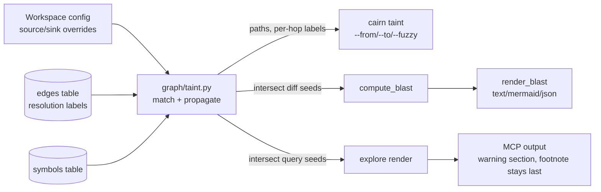

# Tech Spec: taint-tracking

**Spec**: [spec.md](spec.md) | **Created**: 2026-09-17
**Every file/symbol citation below must come verbatim from [survey.md](survey.md)
or a grep run in this session — never from memory.**

Security-aware blast radius: call-graph-level taint propagation over the
existing graph substrate, queryable via `cairn taint` and surfaced as
warnings in `explore`/`cairn blast`. Citations marked *(S#)* trace to
survey.md items; *(session)* marks verbatim output from this session's
grep/read (survey.md carries no test-tree or config evidence — gap
reported to the orchestrator).

## Architecture

One new graph-layer module (`src/cairn/graph/taint.py`) owns source/sink
name matching, the propagation pass, and seed intersection. Three thin
callers consume it: a new `cairn taint` CLI command (FR-002/FR-003),
`compute_blast` (FR-004), and the `explore` render (FR-004). It sits on
the substrate survey.md already verified: the `dataflow` index (S1), the
`transitive_edges` closure (S2), `edges.resolution` labels (S3), and the
explore/blast warning surfaces (S4). No schema change, no new MCP tool,
no new runtime dependency.

## Solution

### Chosen approach
`graph/taint.py` ships two default tables keyed by **call name** (the
symbol name a source/sink call resolves to), covering the FR-001
categories: HTTP request params, CLI args, env vars, file reads,
external API responses (sources); SQL execution, shell, filesystem
writes, network sends, eval/deserialization (sinks). Workspace config
overrides the defaults (extend or replace) through the existing
`load_config` path *(session: `src/cairn/graph/config.py` `load_config`,
already consumed by `graph/scanner.py`) — no new config mechanism.
Matching is exact-name, no heuristics, per the spec's false-positive
mitigation.

Propagation is a depth-capped BFS over `edges`, seeded by source-name
matches and terminating at sink-name matches. Default filter
`resolution = 'exact'`; `--fuzzy` includes `ambiguous`/`unresolved`,
mirroring the blast/impact_analysis precision contract (S3). Default
depth cap reuses `dataflow.CLOSURE_MAX_DEPTH` (S2 cites the constant;
value `4`, session-verified at `dataflow.py:28`); `--max-depth`
overrides. The closure matrix is **not** the propagation substrate (no
resolution column, session-verified `schema.py:396` DDL; D-001).
Output renders each hop as `file:symbol [resolution-label]` (FR-002).

FR coverage:

| FR | Element |
|----|---------|
| FR-001 | Default source/sink name tables + workspace-config override |
| FR-002 | `cairn taint --from <pattern> --to <pattern>`; per-hop resolution labels |
| FR-003 | `edges.resolution = 'exact'` default; `--fuzzy` opt-in |
| FR-004 | Additive `taint_paths` key in `compute_blast` result; warning section in `explore` output |
| FR-005 | Generic call-name defaults only; framework packs deferred (D-002) |

`compute_blast` intersects the diff seeds with taint-path endpoints and
adds `taint_paths` to its result dict; `render_blast` renders it in all
formats via `result.get(...)` — missing key renders no section (pinned
by the hand-built fixture, see Impact; D-005). `explore` intersects its
query seeds the same way and appends a `=== Taint paths ===` section
**before** the terminal degradation footnote; the footnote stays the
last line and the warning text avoids the `degraded: rung` substring
(D-004).

### Alternatives rejected

| Alternative | Why rejected |
|-------------|--------------|
| Framework-aware packs (Express/Django/Rails/Spring) in v1 | FR-005 ruling: false-positive risk over untested parser coverage outweighs onboarding aid; spec risk: false positives erode trust |
| Propagate over the `transitive_edges` closure alone | Session-verified DDL: no resolution column → cannot gate FR-003 exactness; capped at `CLOSURE_MAX_DEPTH = 4` (S2 gap) |
| New runtime dependency (SAST/flow-analysis library) | Survey supporting evidence: pure graph traversal, no new runtime dependency required; C-03 would demand a recorded cost for zero benefit |
| Intra-procedural / assignment-level dataflow modeling | Spec Scope Out: "per-language deep semantic modeling beyond call-graph propagation"; spec assumption: call-graph-level is the honest first tier |
| SARIF export / CI security-gate mode | Spec Scope Out; spec risk mitigation: opt-in warnings, not hard failures |
| New MCP `taint` tool | FR-002 scopes the query to CLI; a new tool flips exact-count pins (`len(all_tools) == 24` in `test_tool_annotations.py::test_every_decorator_has_annotations_kwarg`; `server.py::verify_tool_count`) for no FR — subtract before add (D-003) |
| Materialize taint paths into a new schema table at build time | S3 gap frames the work as "a new pass over stored edges plus config"; query-time pass avoids schema migration and incremental-index coupling; no FR requires stored paths |

## Impact analysis
<!-- Blast radius audited with the cairn CLI (def/callers/impact) this
     session; test tree swept per the flip-default rule. -->

### Blast radius
- `compute_blast` (`src/cairn/graph/blast.py:471`, S4): precise
  `cairn impact compute_blast` → **Total impacted: 1**, depth 0 =
  `src/cairn/cli/blast.py:41 function blast`. The change is additive
  (new result key, new render section), so the sole consumer keeps its
  contract.
- `explore` is a **common name**: precise resolution splits across
  `cairn.graph.queries.explore`, `cairn.mcp_server.tools_graph.explore`,
  and the `cairn.graph.explore` module — resolver labels `ambiguous`.
  Per the resolution contract, small precise results are not "no
  callers": the fuzzy sweep surfaced 30+ test files mentioning `explore`
  plus production consumers in `bench/perf_suite.py`,
  `bench/agent_suite.py`, `cli/core.py` (session). Only the MCP
  `tools_graph.explore` render changes; the `queries.explore` result
  contract does not.
- Substrate tables (`dataflow` S1, `transitive_edges` S2, `edges` S3)
  are read-only to the taint pass; their writers (`graph/dataflow.py`,
  `graph/incremental.py`, `graph/scanner.py`) are untouched.
- Graph-index drift: `cairn def compute_blast` returned `blast.py:381`
  while the verbatim source sits at `:471` (matches S4). The local graph
  index is stale; run `cairn update` post-task.

### Test-tree sweep (pin classification)
Flips: explore output gains a section (return shape), `compute_blast`
result gains a key (return shape), new `--fuzzy`-flagged CLI command.
Sweep of `tests/` for the affected APIs (session greps; survey.md has no
test-tree evidence):

**Flag pins**
- None for `cairn taint` — new command, zero existing pins.
- `tests/test_graft_parity_blast.py::test_fuzzy_adds_ambiguous_dependent_with_visible_resolution`
  pins blast's precise default + `--fuzzy` content (precise radius
  `== ["precise"]`, fuzzy includes `"ambiguous"`). Unaffected by additive
  keys; the new command must reproduce the same precision contract, not
  alter blast's.

**Exact-count pins**
- `tests/test_tool_annotations.py::test_every_decorator_has_annotations_kwarg`
  — `assert len(all_tools) == 24` @mcp.tool registrations. Any new MCP
  tool breaks it; D-003 avoids new tools so it stays green.
- `tests/test_mcp_degradation_footnote.py::test_explore_carries_footnote_once`
  — `out.count("degraded: rung 3 (server_down)") == 1`; the taint warning
  must not reuse the degradation footnote channel or text.

**Exact-traffic pins**
- `tests/test_mcp_degradation_footnote.py::test_explore_carries_footnote_once`
  — `out.splitlines()[-1] == FOOTNOTE`: footnote pinned as the **last
  line** of explore output → taint section renders before it (D-004).
- `tests/test_mcp_degradation_footnote.py::test_explore_healthy_output_is_footnote_free`
  — `"degraded: rung" not in out` on the healthy path → warning text
  avoids that substring.
- `tests/test_core_smoke.py::test_tool_closes_conn_on_exception[explore]`
  — stubs `cairn.graph.queries.explore` returning exactly
  `{"seeds": [], "files": {}, "call_paths": {}, "blast_radius": {},
  "dispatch_hops": []}` → the explore render must work off seeds and
  `.get()` optional keys, never require a new result key (D-005).
- `tests/test_graft_parity_blast.py::test_mermaid_renders_every_dependency_with_unique_nodes`
  — calls `render_blast(result, "mermaid")` with a hand-built dict
  carrying only `basis`/`seeds`/`radius`, then pins exact mermaid edge
  lines → renderers treat `taint_paths` as optional (D-005).
- `tests/test_graft_parity_blast.py::test_every_blast_format_renders` —
  json output must contain `("seeds", "areas", "radius")`; additive keys
  keep it green.
- `tests/test_graft_parity_blast.py::test_working_tree_diff_seeds_changed_symbol_and_dependents`,
  `::test_changed_hunk_seeds_only_intersecting_symbols`,
  `::test_duplicate_seed_names_do_not_import_namesake_dependents`,
  `::test_named_base_compares_from_merge_base` — pin exact
  `payload["seeds"]`/`payload["radius"]` contents → the intersect step
  must never mutate seeds/radius in place.

**Behavior pins** (unaffected)
`tests/test_explore_memory.py` (5 tests — tribal-section parsing by
`"=== "` line prefixes; a new section header merely bounds their slice),
`tests/test_semantic_unavailable.py` (explore guard emission counts —
taint uses its own section, not the semantic warning channel),
`tests/test_emitters.py::test_explore_emits_empty_result_when_no_seeds`,
`tests/test_fusion.py::test_explore_no_longer_gates_on_seed_count`,
`tests/test_metrics.py::test_instrument_captures_sizes_and_args_summary`
and `tests/test_metrics_extensions.py` (local `explore` stubs),
`tests/test_mcp_connection_leaks.py::test_explore_closes_conn_on_exception`,
`tests/test_graft_parity_blast.py::test_text_is_default_and_output_writes_file`
(`"Blast radius" in text`),
`tests/test_agent_surface.py` (`_LIVE_TOOL_MODULES` default-signature
verification — no new tool, no entry needed).

## Code guide

### `src/cairn/graph/taint.py` (new)
- Touches: nothing existing; reads `edges`/`symbols` (S3: resolution
  labels gate traversal precision today).
- Approach: default call-name tables (FR-001) + config override;
  depth-capped BFS with resolution filter (FR-003); path +
  seed-intersection queries (FR-002/FR-004).
- Verify before implementing: `grep -rn "taint" src/cairn --include="*.py"`
  → still empty (S supporting evidence).
- Pitfalls: `edges.resolution` is the gate — do not infer precision from
  `transitive_edges` (no resolution column, S2); document the depth cap
  (`CLOSURE_MAX_DEPTH = 4`, S2 gap).

### `src/cairn/cli/taint.py` (new)
- Touches: new command wired the same way as `cli/blast.py --fuzzy` (S3).
- Approach: `--from/--to/--fuzzy/--max-depth`; hop rendering
  `file:symbol [resolution-label]`.
- Verify before implementing: `cairn taint --from <src> --to <sink>` on
  the flow fixture prints the full path (US1 AC1).
- Pitfalls: unknown source/sink patterns must report and exit non-zero
  on no path — silent success would violate the zero-false-positive
  success criterion in reverse.

### `src/cairn/graph/blast.py`
- Touches: `compute_blast` (S4: `blast.py:471`) — additive
  `taint_paths` result key via seed intersection; optional-key rendering.
- Approach: intersect diff seeds with taint-path endpoints; renderers
  use `.get()`.
- Verify before implementing: `pytest tests/test_graft_parity_blast.py`
  green before and after.
- Pitfalls: never mutate `seeds`/`radius` in place (exact-traffic pins
  above); the hand-built mermaid fixture omits the new key.

### `src/cairn/mcp_server/tools_graph.py`
- Touches: `explore` (S4: `tools_graph.py:432`) — warning section from
  seed intersection.
- Approach: intersect query seeds with taint-path endpoints; append the
  section before the terminal footnote.
- Verify before implementing: the footnote-last-line and healthy-path
  pins above stay green.
- Pitfalls: placement before the footnote (D-004); `dataflow` (S1)
  stays a read-only substrate — no schema change.

## References
research.md records "not applicable — no open questions at Stage 0"; no
external references to carry. Normative inputs: [spec.md](spec.md) FRs,
[../../CONSTITUTION.md](../../CONSTITUTION.md) articles C-01..C-04,
[survey.md](survey.md) items S1-S4.

## Decisions
<!-- ADR-lite. Append-only: decisions made during implementation land here too. -->

### D-001: Propagation walks `edges`, not the `transitive_edges` closure
- **Context**: FR-003 gates on resolution labels; the closure matrix
  carries no resolution column (session-verified DDL) and is capped at
  `CLOSURE_MAX_DEPTH = 4` (S2).
- **Decision**: BFS over `edges` filtered by `edges.resolution`,
  depth-capped at `CLOSURE_MAX_DEPTH` by default with `--max-depth`
  override.
- **Consequences**: per-query traversal cost instead of O(1) closure
  lookups — acceptable at interactive seed counts; deeper-than-cap paths
  are out of scope for v1 and documented as the precision boundary.

### D-002: Generic call-name-keyed defaults; framework packs deferred
- **Context**: FR-005 resolves FR-001's default set as generic
  call-name keys overridable via workspace config; framework packs are
  ruled out for now.
- **Decision**: ship the two name tables in `graph/taint.py`; no
  framework packs; conservative exact-name matching.
- **Consequences**: some real flows go unflagged until packs land;
  zero-config onboarding with a low false-positive budget.

### D-003: No new MCP tool
- **Context**: FR-002 scopes the query to CLI; FR-004 scopes surfacing
  to existing explore/blast outputs; adding a tool flips exact-count
  pins (24-tool pin; `server.py::verify_tool_count`).
- **Decision**: agent reach is `cairn taint` via shell; no `@mcp.tool`
  registration.
- **Consequences**: `test_tool_annotations.py` and the server tool-count
  verification stay green; agents without shell access cannot query
  taint paths directly.

### D-004: Explore warning section renders before the degradation footnote
- **Context**: `test_explore_carries_footnote_once` pins the footnote as
  the last line of explore output.
- **Decision**: `=== Taint paths ===` renders before the terminal
  footnote; footnote ordering untouched.
- **Consequences**: render order is contract — future sections respect
  footnote-last; warning text avoids the `degraded: rung` substring.

### D-005: Taint results are additive keys with `.get()`-tolerant rendering
- **Context**: exact-traffic pins feed `queries.explore` a five-key stub
  dict into the explore render and call `render_blast` with a three-key
  dict.
- **Decision**: `compute_blast` adds `taint_paths` to its result; all
  renderers read it via `.get()` and render nothing when absent; explore
  computes the intersection from its seeds, not from a new
  `queries.explore` key.
- **Consequences**: old-shape result dicts (test stubs, external
  callers) render unchanged; JSON consumers see a new optional key.

### D-006: No new runtime dependency
- **Context**: C-03 dependency gate; survey supporting evidence states
  the work requires no new runtime dependency (pure graph traversal).
- **Decision**: standard library + existing graph modules only.
- **Consequences**: wheel/platform matrix unchanged; no pip-audit
  surface added.
