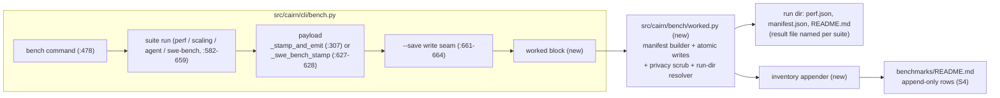

# Tech Spec: bench-worked-artifacts

**Spec**: [spec.md](spec.md) | **Created**: 2026-10-05
**Every file/symbol citation below must come verbatim from [survey.md](survey.md)
or a grep run in this session — never from memory.**
Citations marked `(S#)` trace to survey.md items; citations marked
`(session)` were verified this session by cairn `explore`/grep against the
working tree (baseline 0.21.2 @ 0ccce8c, the survey's own baseline).

## Architecture

The writer sits beside the existing `--save` seam (S2: the raw-artifact half
already exists at `src/cairn/cli/bench.py:663`) and consumes the same
`payload` every suite produces, so it is suite-agnostic — one payload, one
manifest (survey supporting evidence). The manifest extends the stamp that
`_stamp_and_emit` lays into the payload (S3: `src/cairn/cli/bench.py:307`,
`build_artifact_stamp` applied at `:554`) rather than reinventing machine
identity, and the inventory rows extend the existing `benchmarks/README.md`
convention (S4: rows key repo-relative, never basename, `:8-9`).

## Solution

### Chosen approach

One new module `src/cairn/bench/worked.py` (D-001) with the bundle writer and
inventory appender; `src/cairn/cli/bench.py` grows a `--worked DIR` option
(option list S1: `:425-435`, `json :430`, `save :431`, `compare :433` — no
worked) and one call block placed immediately after the `--save` block and
before the compare block (D-008). Per run the writer produces:

- `<suite>.json` — the raw result JSON: the identical `payload` dict
  `--save` serializes (FR-001, S2), same `json.dumps(payload, indent=2)`
  serialization.
- `manifest.json` — schema-tagged `cairn.worked.manifest.v1` carrying the
  inputs (suite, dataset version, seed/repeats/runs, embed backend), the
  stamp block copied from the payload's stamped keys
  (`dataset` / `cairn_version` / `machine_profile` — D-002), and the full
  effective command line rebuilt from the click Context (D-003), privacy-
  scrubbed (D-004, NFR-002).
- `README.md` — human companion naming each file and pointing at the
  manifest command as the reproduction recipe.

Layout per FR-002 (D-006): when DIR is the benchmarks root the bundle lands
at `benchmarks/worked/<suite>-<datasetversion>/`; any other DIR is used
exactly as given. Every file is written via a sibling temp file + `os.replace`
(D-005), so re-runs overwrite atomically, never append. After the bundle
lands, the inventory appender appends one row per JSON artifact to
`benchmarks/README.md` — repo-relative key, idempotent, append-only
(D-007, FR-003/FR-004).

FR coverage: FR-001 → writer outputs above; FR-002 → D-005/D-006; FR-003 →
D-007; FR-004 → D-007 append-only discipline; NFR-002 → D-003/D-004; NFR-004
→ D-008. NFR-001/003/005/006 are not applicable per spec.md (whys recorded
in § Quality). No runtime dependency is added — stdlib only (`json`, `os`,
`pathlib`, `shlex`-free token list), so C-03 is not triggered.

### Alternatives rejected

| Alternative | Why rejected |
|-------------|--------------|
| Standalone mint script under `scripts/` (the S6 producer shape) | Survey S6 gap: "worked bundles are minted by the bench command itself; no new script required" |
| Reuse `datasource.save_manifest` as the bundle writer | Its contract is a direct byte-stable write (`src/cairn/bench/datasource.py:146-156`, session); FR-002 requires temp-file + rename atomicity — one atomic helper in the new module avoids re-pointing existing callers |
| Record raw `sys.argv` as the command | `argv[0]` is a venv-absolute interpreter path (console-script installs) — an NFR-002 home-path leak; the click Context rebuild is deterministic and test-invokable |
| Re-sort `benchmarks/README.md` rows on append | FR-004: existing rows must be untouched except for the appended rows |

## Impact analysis

- `_stamp_and_emit` (`src/cairn/cli/bench.py:307`, S3): 1 direct caller —
  `bench` (exact resolution, session cairn explore). The spec only consumes
  its returned payload; signature and behavior unchanged.
- `bench` (`src/cairn/cli/bench.py:478`, session): the only touched existing
  symbol — one added option parameter plus one added block after
  `:661-664`. No existing flag default flips (`--json`, `--save`, `--compare`,
  `--baseline`, `--repeats` default 3, `--runs` default 3 — session read of
  `:451-456`), no keyword or return-shape changes.
- **Test-tree sweep for flips**: no default flips ⇒ the flag-pin,
  exact-count-pin, and exact-traffic-pin classes are empty by construction.
  Existing bench tests are behavior pins, unaffected: `tests/test_bench.py`
  and `tests/test_bench_stamping.py` exercise suite helpers and stamping
  (`_swe_bench_workspaces`, `build_artifact_stamp` caller edges — session
  cairn explore), not the save seam.
- `--save` write seam (`src/cairn/cli/bench.py:663`, S2): the line itself is
  untouched; the worked block is inserted adjacent. `--save` remains a direct
  write — out of scope (no FR covers it).
- stdout contract: `mint_cli_suite` runs `cairn bench --suite <s> --json` and
  parses stdout (`scripts/mint_baselines.py:117-129`, session) — unchanged,
  because the worked block only writes files and never emits to stdout.
- compare flow: worked write runs before compare, so a regression `sys.exit(2)`
  (`src/cairn/cli/bench.py:713` area, session) can never orphan the bundle;
  compare semantics untouched.

## Quality, threats, and rollback

| Requirement | Design consequence / threat mitigation | Rollback or verification |
|-------------|----------------------------------------|--------------------------|
| NFR-002 (privacy) | D-003 command rebuilt without `argv[0]`; D-004 scrub renders path tokens repo-relative or `$HOME`-templated in the manifest | Test asserts the serialized `manifest.json` contains neither `str(Path.home())` nor the temp workspace's absolute path |
| NFR-004 (reliability) | D-008 ordering: results are already on stdout (`_stamp_and_emit` `:307-317` / swe-bench render `:629-632`, session) before the seam; a write failure reports `display.error` and exits 1 after the run | Test with an unwritable `--worked` target: non-zero exit, error line present, bench results still on stdout |
| NFR-001 (security) | Not applicable: local file writes only (spec.md) | — |
| NFR-003 (performance) | Not applicable: one serialization pass after the run (spec.md) | — |
| NFR-005 (observability) | Not applicable: command summary output suffices (spec.md) | — |
| NFR-006 (accessibility) | Not applicable: no UI surface touched (spec.md) | — |

Threat model — asset: committed `benchmarks/README.md` and the worked
bundles (published evidence). Threat: partial or corrupted overwrite, or
interleaved appends from concurrent worked runs. Mitigation: temp file +
`os.replace` atomic replacement (D-005); append-only, idempotent row keying
(D-007). Residual risk: two simultaneous worked runs can interleave README
appends — accepted; worked runs are explicit and rare (spec risk note).
Rollback: the flag, module, and rows are additive — revert the commit;
appended inventory rows are plain markdown lines under
`benchmarks/README.md` and revert with it. No migration, no secrets, no
privileged operation.

## Code guide

### Worked writer module (new)
- Touches: new `src/cairn/bench/worked.py` (survey S1 gap: "add --worked DIR + bundle writer + inventory append")
- Approach: D-001 through D-006 — manifest builder (inputs + stamp block + click-Context command), privacy scrub, atomic text writer, run-dir resolver, bundle writer returning the run dir and written artifact paths
- Verify before implementing: `grep -n "def _stamp_and_emit" src/cairn/cli/bench.py` (S3 verify) and `grep -n "Path(save).write_text" src/cairn/cli/bench.py` (S2 verify)
- Pitfalls: never mutate the passed `payload` (the compare block still consumes it); writer must stay suite-agnostic — swe-bench reaches the seam with `_swe_bench_stamp`'s payload (`:627-628`), not `_stamp_and_emit`'s (session)

### CLI wiring
- Touches: `src/cairn/cli/bench.py` — option list (`:425-435`, S1), `bench()` params (`:478-495`, session), post-save block (`:661-664`, S2)
- Approach: `--worked DIR` option mirroring `--save`'s shape; worked block after the save block, before compare (D-008); failure path is `display.error` + exit 1 after results are emitted
- Verify before implementing: `cairn bench --help` (S1 verify — shows no worked today)
- Pitfalls: exit-code discipline — usage errors exit 1, regression signal exits 2 (`:713` area, session); the `finally` at `:716-724` restores `CAIRN_DB` and cleans temp dirs — the worked block must sit inside the `try`, writing only after the suites release nothing they still need

### Tests
- Touches: new `tests/test_bench_worked.py`
- Approach: infra-marked (survey S7: `pyproject.toml:207-208` — infra tests "still run and must pass on each main push"); determinism-only asserts — bundle structure, payload identity with `--save`, atomic overwrite on re-run, idempotent inventory rows, privacy scrub, unwritable-target fail-clean; click `CliRunner` + `tmp_path`
- Verify before implementing: `grep -n "infra" pyproject.toml | head -2` (S7 verify)
- Pitfalls: constitution C-04 — no eager `cairn.cli` imports in the test module, never patch global `subprocess.Popen`, `tmp_path` tests must not leak into the real `~/.cairn`; no wall-clock asserts (survey S7 gap: "structure + idempotence asserts only")

### Inventory + first bundle
- Touches: `benchmarks/README.md`, new `benchmarks/worked/` tree (survey S4, S5)
- Approach: D-007 — one row per JSON artifact in the existing two-column table, repo-relative key, appended by the command itself; the first committed bundle is minted by running `cairn bench --worked benchmarks` on the reference machine (baselines precedent, survey S5/S6)
- Verify before implementing: `sed -n '1,12p' benchmarks/README.md` (S4 verify) and `ls benchmarks benchmarks/baselines` (S5 verify)
- Pitfalls: rows key repo-relative, never basename (S4 `:8-9` — same-named artifacts exist under `baselines/DS-v1/` and `baselines/DS-v1.1/`); the run's `README.md` companion is named BY the rows, it is not itself a JSON-artifact row

## References

- `research.md`: "not applicable — no open questions at Stage 0" — no
  external references were gathered; in-repo prior art carries the design:
  `scripts/mint_baselines.py` (S6, producer-script shape incl. its
  `["uv", "run", "cairn", "bench", ...]` command precedent, session) and the
  `benchmarks/quality/` companion-doc convention (survey supporting
  evidence).
- graphify `worked/` convention: motivation only (spec.md Why); no normative
  detail imported from it.

## Decisions

### D-001: Bundle writer lives in a new `src/cairn/bench/worked.py`, wired from the CLI seam
- **Context**: `src/cairn/cli/bench.py` is 724 lines of CLI dispatch and suite glue (session read of the full file); the `cairn.bench` package already hosts suite logic the CLI imports lazily (`from cairn.bench import run_perf_suite ...`, `:498-505`, session).
- **Decision**: manifest builder, scrub, atomic writer, run-dir resolver, bundle writer, and inventory appender live in `src/cairn/bench/worked.py`; `bench()` gains the option plus one call block.
- **Consequences**: the writer is unit-testable without the CLI; `bench.py` grows ~an option and ~10 lines; one more module in the existing package layout — no new layer.

### D-002: The worked bundle consumes the `--save` seam's `payload`; the manifest's stamp block copies the payload's stamped keys
- **Context**: FR-001 requires the raw JSON to be the identical `--save` payload (S2 seam at `src/cairn/cli/bench.py:663`); swe-bench builds its payload via `_persistable_swe_bench_report` + `_swe_bench_stamp` (`:627-628`), not `_stamp_and_emit` (S3, `:307`) — so a writer hooked to `_stamp_and_emit` alone would miss swe-bench.
- **Decision**: the worked block sits beside the `--save` block and consumes the same `payload` variable; the manifest's `stamp` block is `{dataset, cairn_version, machine_profile}` copied from the payload's stamped keys, so swe-bench manifests carry the pin identity `_swe_bench_stamp` installed.
- **Consequences**: one payload, one manifest — suite-agnostic writer (survey supporting evidence); `--save` and `--worked` compose; the writer never re-derives machine identity.

### D-003: Manifest schema `cairn.worked.manifest.v1`; the command is rebuilt from the click Context, not `sys.argv`
- **Context**: FR-001 pins the manifest contents; the spec's drift risk names "the manifest records the argv it was produced with" as the mitigation. Raw `sys.argv[0]` is a venv-absolute path on console-script installs — an NFR-002 leak — and the rebuild must be reproducible under `CliRunner` tests.
- **Decision**: `manifest.json` = `{"schema": "cairn.worked.manifest.v1", "inputs": {suite, dataset_version, seed, repeats, runs, embed_backend}, "stamp": {dataset, cairn_version, machine_profile}, "command": ["cairn", "bench", ...], "artifacts": [...]}`; the command tokens are rebuilt from `click.get_current_context()` — every option of the `bench` command emitted with its effective value (flags bare when true), prefixed `["cairn", "bench"]`. Schema tag follows the additive-schema precedent (`scripts/mint_baselines.py:126`, session). `seed` records `DEFAULT_SEED = 0xC0DE` from `src/cairn/bench/corpus.py:12` (session) when the run generated its corpus, else `null`; serialization is byte-stable JSON (sorted keys, indent 2, trailing newline) per the `save_manifest` doctrine (`src/cairn/bench/datasource.py:146-156`, session).
- **Consequences**: the recorded command re-parses and reproduces the run's inputs (spec AC2); defaults are pinned explicitly; a test asserts the recorded command re-parses. Adding a bench option later requires emitting it here — the schema tag makes format changes detectable.

### D-004: Privacy scrub — repo-relative or `$HOME`-templated, applied to command tokens and manifest strings
- **Context**: NFR-002 forbids absolute home paths or tokens in the manifest; the values at risk are `--workspace`/`--worked` path arguments and any stamp string.
- **Decision**: a scrub applied when building the manifest: a token under the repo root renders repo-relative; a token under `Path.home()` renders as `$HOME/<rest>`; anything else passes verbatim; a defensive pass runs over all manifest string leaves before serialization.
- **Consequences**: the manifest stays portable across machines; a `$HOME`-templated command needs trivial expansion before re-running — accepted (the README companion documents it); scrub is a pure function over strings, trivially testable.

### D-005: Every bundle file is written to a sibling temp file, then `os.replace`d into place
- **Context**: FR-002: existing files of the same run are "overwritten atomically (temp file + rename), never appended"; the `--save` seam's direct `write_text` (`:663`) does not satisfy that, and `datasource.save_manifest`'s contract is a direct write (`src/cairn/bench/datasource.py:146-156`, session).
- **Decision**: one atomic text writer in `src/cairn/bench/worked.py` writes `<final>.tmp-<pid>` in the target directory and `os.replace`s it onto the final name — used for all three files; the staging + replace idiom already exists in-tree (`src/cairn/cli/bench.py:191-215` `_swe_bench_workspaces`, session).
- **Consequences**: readers never observe partial files; re-runs replace; no partial state survives a crash mid-write beyond a `.tmp-*` sibling.

### D-006: Run-dir layout — canonical `benchmarks/worked/<suite>-<datasetversion>/` when DIR is the benchmarks root, exact DIR otherwise; version segment degrades, never crashes
- **Context**: FR-002 names two modes; "the benchmarks root" needs an anchor that is not name-matching, and the version segment can be null when the artifact stamp degrades (`build_artifact_stamp` yields `dataset.version: null` on a missing manifest, `src/cairn/bench/datasource.py:449-455`, session) or absent for swe-bench (pin identity instead, `src/cairn/cli/bench.py:229-238`, session).
- **Decision**: benchmarks root = the parent of `default_baselines_root()` (`src/cairn/bench/datasource.py:344`, session), falling back to `Path.cwd() / "benchmarks"` exactly as `src/cairn/cli/bench.py:73-74` does; DIR equal to that root means canonical mode. The version segment is `dataset.version`, else `dataset.revision_sha` truncated to 12 chars (swe-bench), else the literal `unversioned`.
- **Consequences**: `--worked benchmarks` and `--worked benchmarks/worked` both produce reproducible canonical paths; a degraded stamp still produces a valid, self-explaining directory name.

### D-007: Inventory rows — JSON artifacts only, repo-relative key, append-only, inside-repo only
- **Context**: FR-003 (idempotent rows per the existing convention, S4) and FR-004 (existing rows untouched) plus the case FR-004 implies: a bundle written outside the repo has no repo-relative key.
- **Decision**: the appender reads `benchmarks/README.md`, and for each JSON artifact (`<suite>.json`, `manifest.json`) appends one row to the existing two-column table keyed by the repo-relative path with the run's `README.md` as the "Named by" companion — but only when the bundle directory is inside the repo; outside-repo bundles skip the appender (the run `README.md` still names the files). Idempotence: a repo-relative path already present in the table is never appended again.
- **Consequences**: re-runs mutate nothing (FR-003); `git diff` on `benchmarks/README.md` shows appended lines only (FR-004); outside-repo bundles stay self-describing without corrupting the repo index.

### D-008: The worked block runs after emission and `--save`, before compare; failure exits 1 after results are on stdout
- **Context**: NFR-004 requires failing cleanly *after* the bench run with results on stdout regardless; the compare block can `sys.exit(2)` on regressions (`src/cairn/cli/bench.py:713` area, session), which would orphan a not-yet-written bundle.
- **Decision**: block order in `bench()` is: suite run → payload (emitted to stdout/table by `_stamp_and_emit`/swe-bench render) → `--save` → worked → compare; a worked-write failure prints `display.error` and exits 1 immediately (results are already out).
- **Consequences**: a regressed run still lands its evidence bundle before the exit-2 signal; a user passing both `--worked` and `--compare` with an unwritable target gets exit 1 with a clear error instead of a masked compare — accepted, re-run compares after fixing the target.

### D-009: D-004 amendment — $TMPDIR scrub anchor
- **Context**: D-004's letter ("anything else passes verbatim") cannot satisfy NFR-002's own test — bench workspaces live under the system tempdir, whose absolute path must be absent from manifests.
- **Decision**: the scrub anchors are repo-relative, then $HOME-templated, then $TMPDIR-templated; everything else verbatim.
- **Consequences**: manifests carry no absolute home or temp paths; NFR-002's test is the owner.
