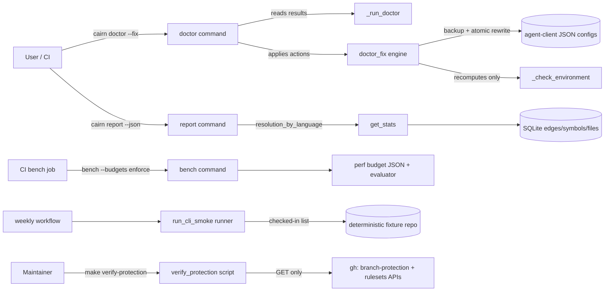

# Tech Spec: grade-a-guardrails

**Spec**: [spec.md](spec.md) | **Created**: 2026-10-05
**Every file/symbol citation below must come verbatim from [survey.md](survey.md)
or a grep run in this session — never from memory.**

## Architecture

Four instruments bolt onto existing seams. `doctor --fix` reuses doctor's
registration enumeration and the installer's proven backup/atomic-write
machinery; the resolution report extends `get_stats` and rides the existing
`report` bundle; the perf gate consumes the perf suite's already-measured
`TimingResult.p95`; the smoke and protection instruments are thin repo-owned
runners so their failure contracts are testable without GitHub.

## Solution
### Chosen approach
- **FR-001/NFR-001/NFR-004** — new `src/cairn/cli/system/doctor_fix.py` with
  `apply_doctor_fixes(db) -> list[dict]`. It enumerates registrations through
  the same `check_installed` + `_client_config_paths` + `_registration_entry`
  path doctor reads, considers only cairn-owned entries (`mcpServers.cairn`,
  zcode's `mcp.servers.cairn`, opencode/kilo's `mcp.cairn`, agy's
  `mcpServers.cairn` with `serverUrl`), and only when the entry's SSE endpoint
  does not respond. Each write: `.bak` backup (never-clobber), freshness-window
  refusal on `st_mtime`, per-client stdio entry regenerated by the existing
  client generators, whole-file atomic rewrite via `_atomic_write_text`.
  Workspace-owned registration files are refused with guidance. The `doctor`
  command gains `--fix`; post-fix only the `environment` check is recomputed.
- **FR-002/NFR-005** — `get_stats` gains `resolution_by_language` (per-language
  `exact`/`ambiguous`/`unresolved` counts + percentages over the labeled
  `calls`/`references` pool, every language present in `files` listed so
  zero-edge stores report zeros), and `report`'s `_build_report` adds a
  `resolution` section rendered in text and JSON.
- **FR-003** — checked-in `benchmarks/baselines/perf_p95_budgets.json` plus
  `src/cairn/bench/budgets.py` (load/evaluate/mint). `bench` gains
  `--budgets PATH` and `--budget-mode {advise,enforce}` (default advise):
  advise prints trend lines, enforce fails exit 3 naming tool, measured p95,
  and budget. ci.yml's bench run step splits by event: PR legs advisory with
  `continue-on-error`, main/merge-group enforcing without it.
  `scripts/mint_perf_budgets.py` recalibrates at ≥10× from a saved run.
- **FR-004/NFR-002** — `.github/workflows/weekly-smoke.yml` (cron +
  `workflow_dispatch`, `permissions: contents: read`, `CAIRN_TELEMETRY=off`)
  calls `scripts/run_cli_smoke.py`, which executes the checked-in
  `.github/smoke/cli-commands.txt` against the vendored deterministic fixture,
  stopping at the first failing command and naming it (exit 1).
- **FR-005** — `scripts/verify_protection.py` (read-only `gh api` GETs against
  `/repos/{slug}/branches/main/protection` and `/repos/{slug}/rulesets[/{id}]`)
  checks required reviews ≥1, force-push denial, and required status checks ⊇
  `MANDATORY_CHECKS`, with union semantics across both APIs, per-check
  provenance, `--json`, exit 0/1; wired as `make verify-protection` and
  documented maintainer-run in the release checklist. Never a CI gate.

### Alternatives rejected
| Alternative | Why rejected |
|-------------|--------------|
| Resolution report as a `cairn doctor` section | Doctor's contract is the 11 health checks (`doctor` docstring "Run 11 system health checks"); a store-analytics table is not an environment health verdict, and NFR-005 names `cairn system report` as the consumer surface |
| Dedicated `cairn resolution` top-level flag | Duplicates `_build_report`'s bundle/scrub/JSON machinery; the report bundle already aggregates machine-readable sections |
| Implement `--fix` by re-running `cairn install-agents` | Installers also write hooks/skill trees and merge whole files; NFR-001 scopes `--fix` writes to cairn-owned agent-client config entries only |
| In-place `json.dump` truncate-rewrite | `_atomic_write_text` exists precisely because a crash must never leave a truncated client config (NFR-004 crash-safety) |
| Budgets as a pytest-only gate (closure-gate pattern) | FR-003 pins the gate to the main/merge-group bench job, which already runs the perf suite; a second pytest job would duplicate the run |
| Hardcoded budget constants in `perf_suite.py` | Spec assumption: budgets are data with a documented recalibration command, not magic numbers that age silently |
| Smoke loop embedded as workflow bash | Untestable from pytest; a repo runner keeps the fail-fast-naming contract under test |
| `gh api -X PATCH`-based protection fixer | FR-005 mandates read-only verification through both APIs; mutation belongs to a human |

## Impact analysis
- `_enumerate_registrations` (`src/cairn/cli/system/doctor.py`) gains the real
  config path (4-tuple → 5-tuple) so the fix engine never re-derives paths.
  Direct consumers found this session: `_registration_findings`
  (`src/cairn/cli/system/doctor.py`) and two exact-shape unpack pins,
  `tests/test_install_uninstall_fidelity.py:1525` and
  `tests/test_install_uninstall_fidelity.py:1548` — both updated in the same
  task. No other callers (`rg "_enumerate_registrations" src tests`).
- `get_stats` (`src/cairn/graph/stats.py`) gains one additive key. Consumers:
  `src/cairn/mcp_server/_server_core.py` (`stats = get_stats(conn)`),
  `src/cairn/cli/system/status.py`, `src/cairn/cli/core.py`,
  `src/cairn/wiki/generator.py`, and `tests/test_status_resource_health.py`
  (five `get_stats(` sites) — all read named keys; additive key is a no-op.
  `exact_share_by_language` keeps its exact semantics and query unchanged.
- `_build_report` (`src/cairn/cli/system/report.py`) gains an additive
  `resolution` section. Test sweep: `tests/test_report.py:75` pins
  `set(data.keys()) >= {...}` (superset — safe); `tests/test_report.py:88`
  pins `recent_errors` sub-keys (untouched); no exact top-level key-set pin
  exists.
- `bench` command (`src/cairn/cli/bench.py`) gains two options whose defaults
  preserve today's behavior (no budgets evaluated). Flag pins: none assert
  option absence. Exact-exit pins `tests/test_bench.py` (0/1/2 classes) are
  behavior pins unaffected because exit 3 arises only under
  `--budget-mode enforce` with a budgets file.
- `doctor` command gains `--fix` (default off): kwarg-less call sites stay
  green; doctor's read-only docstring is updated to "read-only unless `--fix`".
- `.github/workflows/ci.yml` bench job: the single `continue-on-error: true`
  run step splits into PR-leg (advisory, `continue-on-error`) and
  main/merge-group (enforcing) steps; mint/cache/compare steps unchanged.
- New files (`doctor_fix.py`, `budgets.py`, `scripts/mint_perf_budgets.py`,
  `scripts/run_cli_smoke.py`, `scripts/verify_protection.py`,
  `.github/workflows/weekly-smoke.yml`, `.github/smoke/cli-commands.txt`,
  `benchmarks/baselines/perf_p95_budgets.json`) have no existing callers.
- No runtime dependency is added (`gh` is invoked as a subprocess and already
  required by `cairn prs`-adjacent workflows; `http.server` is stdlib) —
  C-03 holds with no decision needed.

## Quality, threats, and rollback
| Requirement | Design consequence / threat mitigation | Rollback or verification |
|-------------|----------------------------------------|--------------------------|
| NFR-001 | Fix writes touch only the cairn-owned entry inside each config; `.bak` before write; summary carries client + scrubbed display path + action verb, never file contents or env values; atomic temp+rename | `.bak` restore; `tests/test_atomic_config_writes.py` discipline extended to the fix path |
| NFR-002 | Weekly workflow: checked-in list, local fixture, `permissions: contents: read`, `CAIRN_TELEMETRY=off` (export is opt-in via `CAIRN_OTEL_ENDPOINT` only) | Workflow diff review; runner unit tests assert no network calls of its own |
| NFR-003 | n/a — no new hot path; the gate evaluates `TimingResult.p95` the perf suite already records | Confirmed by survey: the six tools are already the suite's measured ops |
| NFR-004 | Idempotence: repointed entries lose their URL, so the second pass finds no dead SSE registration (zero actions). Crash-safety: sibling temp + `os.replace` | Second-run-zero-actions test; `_atomic_write_text` no-temp-leak test |
| NFR-005 | Report section rides existing `--json`; budget evaluation adds a `budgets` block to the bench payload; smoke runner and protection script emit `--json` | JSON-schema assertions at each instrument's boundary test |
| NFR-006 | n/a — no UI surface touched (CLI text/JSON only) | Scope guard: no `src/cairn/dashboard/` file appears in any task |
| Threat: `--fix` clobbers a config a live client is writing | Freshness-window refusal (mtime younger than the window ⇒ refuse with guidance), atomic rename, never-clobber backup | Refusal test with a freshly-touched fixture file |
| Threat: untrusted workspace registration content | Workspace-owned files are never rewritten by `--fix` (guidance only), mirroring doctor's no-spawn doctrine | Skip-and-guide test |
| Threat: secrets in configs leak via logs/telemetry | Action records carry no env/token fields; display paths use the `~/`-relative doctor convention | Summary-shape test asserts no env keys |
| Threat: protection verifier false-greens | Both APIs probed; a check passes only on positive evidence from at least one source; missing/unreadable sources are reported, not assumed | `--json` provenance per check; failure-path tests with stubbed gh |
| Rollback | Each instrument is independently revertible: `--fix` is opt-in; budgets default to advise; weekly workflow can be disabled at source; `verify-protection` is a Make target only | Per-milestone revert; no data migrations |

## Code guide
### Resolution-quality evidence (FR-002, NFR-005)
- Touches: `get_stats` in `src/cairn/graph/stats.py` (survey: "Raw per-edge
  `resolution` labels and aggregate build_runs counters exist"); `_build_report`
  and `_render_report` in `src/cairn/cli/system/report.py` (survey: "returns
  keys `generated_at`, `versions`, `doctor`, `recent_errors`, `config` only")
- Approach: extend the existing per-language query to count `unresolved` too,
  drive the language list from `files.language` so zero-pool languages appear,
  expose `resolution_by_language`; render a `## Resolution` section.
- Verify before implementing: `rg -n resolution src/cairn/cli/system/report.py src/cairn/graph/schema.py`
- Pitfalls: keep the pool `kind IN ('calls','references')` and
  `resolution IN ('exact','ambiguous','unresolved')` exactly as the existing
  query scopes it; pre-migration stores raise `sqlite3.OperationalError` —
  keep the `note_contention` degrade pattern.

### Doctor fix engine (FR-001, NFR-001, NFR-004)
- Touches: `src/cairn/cli/system/doctor.py` (`_enumerate_registrations`,
  `_registration_findings`, `doctor` command — survey: "no `--fix` option
  exists"), new `src/cairn/cli/system/doctor_fix.py`;
  `src/cairn/agent_install/merge.py` (`_atomic_write_text`, `_backup_to_bak`
  — survey: "Atomic write + backup machinery already exists in
  agent_install/merge.py"), client stdio generators in
  `src/cairn/agent_install/` (`mcp_config_json`, `zcode_mcp_config_json`,
  `opencode_mcp_config_json`, `kilo_mcp_config_json`, `agy_mcp_config_json`,
  `mcp_config_json_desktop`)
- Approach: shape-aware write-back replaces only the cairn entry; freshness
  window constant defined once beside `_PROBE_TIMEOUT_S`-style knobs; summary
  is a list of action dicts consumable by `--json`.
- Verify before implementing: `rg -n '"--fix"|st_mtime' src/cairn/cli/system/doctor.py src/cairn/agent_install && .venv/bin/pytest tests/test_doctor.py tests/test_atomic_config_writes.py -q`
- Pitfalls: doctor's socket-binding tests fail with sandbox `Permission`
  (survey verify results) — fix tests monkeypatch `lifecycle.sse_responds`
  instead of binding; any genuine loopback leg runs via the core-suite or
  out-of-sandbox pattern and is recorded as environment, never a flake. Do
  not spawn registrations from workspace-owned files.

### Perf budget gate (FR-003)
- Touches: `src/cairn/bench/perf_suite.py` (ops list — survey: six tools
  already measured), `src/cairn/bench/timing.py` (`p95`), `src/cairn/cli/bench.py`
  (`bench` command), new `src/cairn/bench/budgets.py`,
  `benchmarks/baselines/perf_p95_budgets.json`,
  `scripts/mint_perf_budgets.py`, `.github/workflows/ci.yml` (bench job),
  `docs/release-checklist.md`
- Approach: budgets keyed by exact op names; evaluate after the suite (warm-up
  already applied by `time_call(warmup=1)`); breach message
  `tool <name>: p95 <X>ms exceeds budget <Y>ms`; exit 3 in enforce mode.
- Verify before implementing: `rg -n "find_definition|continue-on-error|p95" src/cairn/bench/perf_suite.py .github/workflows/ci.yml && rg -n p95 src/cairn/bench/timing.py`
- Pitfalls: DS-v1 baseline p95s were minted on `runner_class:
  reference-local` — recalibrate from a CI-class run before enforcing; do not
  gate PR legs (advisory trend only, per FR-003).

### Weekly smoke (FR-004, NFR-002)
- Touches: new `.github/workflows/weekly-smoke.yml`, `scripts/run_cli_smoke.py`,
  `.github/smoke/cli-commands.txt`; fixture under the checked-in
  `benchmarks/datasource/` tree (survey: no scheduled workflow exists)
- Approach: runner reads the list, executes each command with pinned
  `CAIRN_DB`/cwd, streams `::group::` per command, `::error::` + exit 1 on the
  first failure naming it; `--json` emits the command/result table.
- Verify before implementing: `rg -n -i "schedule|cron" .github/workflows || true`
- Pitfalls: keep the list to store-local, non-mutating commands (no
  `install-agents`, no `serve`); set `CAIRN_TELEMETRY=off` in the workflow env.

### Protection verifier (FR-005)
- Touches: new `scripts/verify_protection.py`, `Makefile`,
  `docs/release-checklist.md` (survey: Makefile has no `verify-protection`;
  `docs/release-checklist.md:124` documents protection prose-only)
- Approach: `gh api` GET-only helpers returning parsed JSON; checks evaluated
  over the union of legacy + rulesets evidence; `MANDATORY_CHECKS` constant
  documented in the checklist beside the target.
- Verify before implementing: `rg -n "verify-protection|rulesets|branch-protection" Makefile docs .github scripts`
- Pitfalls: admin-scoped auth is required for the legacy endpoint — surface
  auth failures per check instead of a blanket crash; never wire this into CI.

## References
- research.md: "not applicable — no open questions at Stage 0" — all
  alternatives above trace to survey constraints and spec text.
- `benchmarks/baselines/DS-v1/perf.json` (session read): observed p95s for the
  six budgeted tools; `benchmarks/baselines/DS-v1/README.md` for the mint
  provenance convention the budgets file mirrors.
- `tests/test_scaling_gate.py` (survey): enforcing-budget precedent
  (constants + over-budget trip tests) the budget evaluator's tests mirror.

## Decisions
### D-001: Resolution report lands as a `report` section, not a doctor section or new flag
- **Context**: FR-002 allows three surfaces; survey found no per-language aggregation anywhere.
- **Decision**: compute in `get_stats`, surface as `cairn report`'s `resolution` section (text + `--json`).
- **Consequences**: doctor stays a health check; MCP system report inherits the stats key for free; no new top-level command to document.

### D-002: `resolution_by_language` includes `unresolved` and file-driven zero rows
- **Context**: the existing per-language query counts only `exact`/`ambiguous`, so unresolved mass and zero-edge languages are invisible.
- **Decision**: one query over the labeled pool plus a `files.language`-driven language list; counts default 0, percentages 0.0 on empty pools.
- **Consequences**: FR-002's zero-edges clause holds; `exact_share_by_language` keeps its narrower semantics unchanged.

### D-003: Fix engine in `doctor_fix.py`; `_enumerate_registrations` yields the config path
- **Context**: doctor enumerates registrations as (client, display, entry, workspace_owned) — no real path, which a writer needs.
- **Decision**: extend to (client, path, display, entry, workspace_owned) and update its three call sites; `apply_doctor_fixes(db) -> list[dict]` owns probes, refusal, backup, rewrite, and action records.
- **Consequences**: one enumeration shared by audit and fix; the two test unpack pins move with it.

### D-004: `--fix` refuses workspace-owned registration files
- **Context**: doctor treats cwd-relative registration files as untrusted repo content (no spawn without an exact known shape); rewriting them would dirty a checkout from content a clone authored.
- **Decision**: skip-and-guide for workspace-owned files; only user-owned home/global configs are rewritten.
- **Consequences**: strictly fewer writes than FR-001 allows; guidance tells the user to fix repo content deliberately.

### D-005: Post-fix, only the `environment` check is recomputed
- **Context**: FR-001 requires the summary to list actions and that no other check result be mutated.
- **Decision**: run `_run_doctor` once, apply fixes, recompute `_check_environment` alone and splice it in.
- **Consequences**: the remediated check can flip FAIL→PASS in the same invocation; every other row is byte-identical to the pre-fix pass.

### D-006: Budgets are a checked-in JSON evaluated by the bench CLI with a default-off gate
- **Context**: FR-003 needs ≥10× catastrophe budgets, enforcement only on main/merge-group, advisory PR trends, and non-magic recalibration.
- **Decision**: `benchmarks/baselines/perf_p95_budgets.json` (schema-tagged, provenance-stamped), `src/cairn/bench/budgets.py` loader/evaluator, `--budgets PATH --budget-mode {advise,enforce}` defaulting to advise, exit 3 on enforced breach, `scripts/mint_perf_budgets.py --factor 10` for recalibration.
- **Consequences**: today's default invocation is unchanged; the gate is a workflow-policy choice; recalibration is one documented command.

### D-007: Weekly smoke logic lives in `scripts/run_cli_smoke.py`
- **Context**: FR-004's red-on-first-failure-naming contract must be demonstrable without waiting for GitHub.
- **Decision**: the workflow only schedules; the runner owns list parsing, per-command execution, fail-fast, and `--json`.
- **Consequences**: the contract is pytest-coverable; the workflow stays declarative.

### D-008: Protection checks use union semantics across both gh APIs
- **Context**: FR-005 names the legacy branch-protection API and the rulesets API; repos may satisfy a rule through either.
- **Decision**: fetch both read-only, evaluate each requirement over the union, report per-check provenance; `MANDATORY_CHECKS` is a script constant mirrored in `docs/release-checklist.md`.
- **Consequences**: verifier stays read-only and maintainer-run; the mandated list has exactly two homes kept in sync by the same task.

### D-009: Doctor-fix tests avoid real sockets; loopback legs follow the house pattern
- **Context**: survey recorded 7 doctor failures as sandbox `Permission` errors on socket-binding, with the atomic-writes file fully green — the known loopback-sandbox class.
- **Decision**: fix-path tests monkeypatch the SSE responder; any genuinely binding test is verified via the core-suite or an out-of-sandbox run and noted as such, never as a product flake.
- **Consequences**: `doctor --fix` verification stays deterministic in the sandbox; real-socket behavior still gets covered outside it.

## Decisions appended during delivery

### D-014: Live TC-018/TC-019 adjudicated — the verifier is correct, main is unprotected
- **Context**: The proof run's live `make verify-protection` exits 1: `required_reviews PASS (ruleset:20313135)`, `force_push_denial FAIL (observed: False; no source)`, `required_status_checks FAIL` (all ten MANDATORY_CHECKS missing).
- **Decision**: TC-018's Given ("main configured according to the release checklist") is an environment state, not a repo artifact — it is unmet on the real repository, so the TC is adjudicated environment-gated, not code-failed. TC-019's observable (exit 1, names the drifted settings and the source, "protection not verified") is demonstrated by this exact live output — the real repo is the drift fixture. Configuring main's protection (force-push denial + required checks) is a maintainer GitHub action outside this spec's write scope, tracked as the grade-A plan's Phase-3 human step.
- **Consequences**: No code change; the verifier's first live run surfaced a true positive. The unit suite (9 stubbed-gh tests) plus TC-020 carry the code-contract proof.

### D-015: Stacked-branch scope diff ruled
- **Context**: The scope diff vs the shared approval freeze lists 24 unmentioned paths: the delivered ratchet spec's files (this branch stacks on `feat/grade-a-ratchet`), ratchet's derived `spawns/` payloads, `specs/INDEX.md`, and `tests/test_perf_budgets.py`.
- **Decision**: Ratchet's files are another spec's already-committed delivery (C1 `46a7732`), not guardrails scope creep; `spawns/` is regenerate-only; `specs/INDEX.md` carries only registration lines; `tests/test_perf_budgets.py` is T006's constitutionally-required test file (C-02), implied by its task though unlisted in Touches.
- **Consequences**: Guardrails' C1 stages only guardrails-owned files; the stack order (ratchet PR first, guardrails rebase/merge after) keeps attribution clean.

### D-016: CLI output prints and test fixtures are intentional
- **Context**: The cleanliness sweep flags 21 added-line suspects across `run_cli_smoke.py`, `verify_protection.py`, `mint_perf_budgets.py`, `tests/test_cli_smoke.py`, and one comment banner in `tests/test_doctor.py`.
- **Decision**: Every script `print()` is the tool's output contract (`::group::`/`::error::` annotations, PASS/FAIL verdict lines, JSON payloads, stderr error lines) — the FR-004/FR-005/NFR-005 surfaces. The `print('boom')` in `test_cli_smoke.py` is subprocess input (a deliberately failing command), and the `test_doctor.py` banner is test coverage documentation; FR-003's comment contract scopes to `src/` only.
- **Consequences**: No change; sweep heuristic adjudicated per ratchet's D-009 precedent.

### D-017: Initial budgets carry reference-local ×25 cross-machine headroom
- **Context**: Reviewer BLOCK — the checked-in budgets carried `reference-local` provenance while ci.yml enforced them, contradicting the release-checklist rule T007 itself added.
- **Decision**: Re-mint the initial budgets at factor 25 (2.5× headroom beyond the catastrophe floor, for the reference-local→CI-runner class gap); the checklist now states the rule truthfully (≥25× until the first CI-class recalibration, factor 10 after). The loader's ≥10 floor and the sizing test's `>= 10 × observed` assertion both hold.
- **Consequences**: First main push produces CI-class perf data; the release-checklist recalibration step then drops to factor 10. No spec text change — FR-003's "≥10×" remains the floor.

### D-018: The enforcing bench step is budget-only
- **Context**: Reviewer WARN — the main/merge-group enforce step inherited `$BASE` (`--compare`/`--baseline`), so the advisory 15%-regression exit 2 would redden main runs with no `continue-on-error`, a tightening FR-003 never recorded.
- **Decision**: Drop `$BASE` from the enforcing step; PR legs keep the advisory compare. The main gate is exactly the catastrophe-budget gate the spec names.
- **Consequences**: Regression-trend comparison stays advisory everywhere; downstream mint/compare steps are unaffected (they consume `bench-current.json`, still saved).

### D-019: Reviewer WARN-2 and the mutation survivor are concurrency artifacts
- **Context**: The reviewer read a live `and` in `mint_perf_budgets.py:62` while the mutation run was flipping it; the frozen tree reads `or` (verified post-run). The lone mutation survivor (`verify_protection.py:409` exit-code flip) is masked by the real repo's unprotected state — the live TC exits 1 either way.
- **Decision**: WARN-2 cleared as a transient mutant. The survivor is adjudicated oracle-masked; the stubbed-gh unit suite pins exit codes on healthy fixtures.
- **Consequences**: No code change for either.
