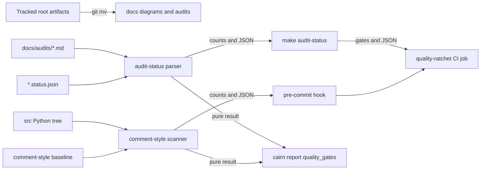

# Tech Spec: grade-a-ratchet

**Spec**: [spec.md](spec.md) | **Created**: 2026-10-05
**Every file/symbol citation below must come verbatim from [survey.md](survey.md)
or a grep run in this session — never from memory.**

## Architecture


The repository adds two executable modules to its existing operational CLI
system family. `audit_status` turns relocated audit markdown plus one strict
JSON sidecar per audit into P0–P3 remaining/total counts; `comment_style`
scans only Python under `src/` with the standard library and compares
violations with a content-counted baseline. Make, pre-commit, and CI are
frontends over those module commands. The existing `report` command imports
the same pure collection functions and adds one `quality_gates` section, so CI
and the diagnostic bundle consume identical counts rather than parsing human
text.

## Solution
### Chosen approach
**FR-001 — relocation.** Use `git mv architecture.html
docs/diagrams/architecture.html` and `git mv audit-findings-2026-10-02.md
docs/audits/2026-10-02.md`. The survey found no live inbound links; the moved
HTML's own references to `docs/architecture.md`, `docs/indexing.md`, and
`docs/mcp-tools.md` become `../architecture.md`, `../indexing.md`, and
`../mcp-tools.md` so the legacy snapshot remains browsable. Historical
CHANGELOG text is not rewritten.

**FR-002 — audit status.** Parse the findings-index section only: each
`### P0`…`### P3` heading must occur once, its declared count must equal its
table-row count, IDs must match the survey-observed `C*`, `Q*`, `S*`, `SY*`
namespaces, and an ID may appear once in that index. For each markdown file,
read a sibling whose stem is extended to `.status.json`. The sidecar is
`{"schema_version":1,"fixed":[]}` initially; `fixed` contains unique finding
IDs, and every ID must exist in that audit. Aggregate counts across audits and
derive `remaining = total - fixed` per priority. Failures are single-line
diagnostics naming the audit or sidecar and exit nonzero; with `--json`, stdout
is still one JSON error object.

Success JSON has this stable shape:

```json
{
  "audits": [
    {
      "audit": "docs/audits/2026-10-02.md",
      "sidecar": "docs/audits/2026-10-02.status.json"
    }
  ],
  "totals": {
    "P0": {"total": 2, "fixed": 0, "remaining": 2},
    "P1": {"total": 51, "fixed": 0, "remaining": 51},
    "P2": {"total": 88, "fixed": 0, "remaining": 88},
    "P3": {"total": 3, "fixed": 0, "remaining": 3}
  },
  "total": 144,
  "remaining": 144
}
```

Human output prints one `P0 2/2 remaining`-shaped row per priority and a total
row. The numbers above are the parser contract demonstrated by the survey's
recounted audit headings; the initial sidecar records no fixes because the
survey found no fixed-status marker in the audit.

**FR-003 — comment ratchet.** `comment_style` recursively scans sorted
`*.py` files under `src/` with `ast` and `tokenize`:

- a comment block is a run of consecutive physical lines whose stripped text
  starts with `#`; a block with four or more lines is a violation;
- a docstring is the first string expression of a module, class, sync function,
  or async function; its physical span is `end_lineno - lineno + 1`, and four
  or more lines is a violation;
- a decode or syntax error is a deterministic checker failure naming the file.

Each violation reports repo-relative path, starting line, kind, and line count.
The baseline stores a sorted JSON object of fingerprint-to-count entries, where
a fingerprint hashes violation kind plus normalized block/docstring text. Counts
rather than paths make file moves and unrelated insertions stable while still
preventing growth of identical content. Default checking requires current and
baseline fingerprint counts to be exactly equal: a higher current count is new,
a higher baseline count is stale, and either fails.

`--initialize-baseline` works only while the baseline is absent and writes the
initial machine-generated snapshot. `--update-baseline` is the only later
writer: it refuses a fingerprint absent from the old baseline or a count higher
than the old count, then writes the smaller deterministic snapshot. Both writer
modes sort paths, violations, keys, and JSON text, and emit no timestamp.

Success JSON is:

```json
{
  "scope": "src",
  "threshold_lines": 3,
  "remaining": 1217,
  "baseline_remaining": 1217,
  "new": [],
  "stale": []
}
```

The initial count is whatever the scanner observes when the baseline is
initialized. A read-only prototype of this exact heuristic over the current
253-file `src/` tree counted 318 long comment blocks and 899 long docstrings
(1,217 violations); the committed checker must recount rather than copy that
number. Human success prints the remaining count and baseline count. Failure
lists new and stale entries first, then prints both counts.

**FR-004 — machine consumers.** Both module commands accept direct `--json`.
Make forwards an `ARGS` variable because this session's `make help --json`
exited 2 with `unrecognized option --json`; the supported spellings are
`make audit-status ARGS=--json` and `make comment-style ARGS=--json`. CI runs
human mode as the gate and JSON mode as a parse/consumption check. The existing
top-level `cairn report --json` gains:

```json
{
  "quality_gates": {
    "audit_status": {
      "total": 144,
      "remaining": 144,
      "by_priority": {"P0": 2, "P1": 51, "P2": 88, "P3": 3}
    },
    "comment_style": {"remaining": 1217}
  }
}
```

The report section carries counts only, so the existing privacy gate remains a
count/redaction boundary rather than a new free-text surface. It degrades to an
unavailable marker outside a source checkout, while Make/CI remain the gates
that fail on malformed data.

### Alternatives rejected
| Alternative | Why rejected |
|-------------|--------------|
| Implement both tools as `scripts/audit_status.py` and `scripts/check_comment_lengths.py`, then have `report` parse subprocess stdout | The survey shows those script paths do not exist, while `src/cairn/cli/system/report.py:287 def report(db, as_json, out_path):` already lives in the package; subprocess parsing would make `cairn report` source-checkout-only and duplicate the command boundary. |
| Mark fixed audit rows in the markdown | The survey found no fixed-status marker in `audit-findings-2026-10-02.md`; mutating the validated historical report loses the immutable totals required as the denominator. |
| Extend the existing `ruff` pre-commit hook | The survey inventory contains `ruff`, and session `pyproject.toml` selects only `["F"]`; a repository-specific comment-length rule is not that gate's contract and would broaden a deliberately conservative lint surface. |
| Reuse `scripts/verify_no_code_change.py` | The survey identifies it as an AST check that changed Python files are comment-only; it does not classify style length or maintain a shrink-only violation allowlist. |

## Impact analysis
| Area | Current state and blast radius |
|------|--------------------------------|
| Root artifacts | Survey `git ls-files` shows `architecture.html` and `audit-findings-2026-10-02.md` tracked at root. Live inbound references are absent; session grep found only the moved HTML's internal `docs/...` links. Git rename history and historical CHANGELOG mentions are preserved. |
| Makefile | Survey target inventory contains `dist:`, `evals:`, `ci-local:`, `ci-local-all:`, `verify-no-code-change:`, `release:`, and `help:`; none consumes the new modules. Additions update `.PHONY` and `help` but do not alter existing recipes. |
| Quality modules | Both modules are greenfield; survey finds no `comment_length`, `docstring checker`, `check_comments`, or `comment_policy` symbol outside specs. There is no existing caller to break, and the existing `src/cairn/cli/system/` package needs no registration change for direct module execution. |
| Diagnostic report | Survey identifies `_build_report` at `src/cairn/cli/system/report.py:200` and `report` at `src/cairn/cli/system/report.py:287`. Session precise graph query found `_build_report` called by `report` at `src/cairn/cli/system/report.py:308` and no deeper impacted symbols; qualified `report` had no precise internal caller (the Click entry point is external). The graph warned that 105 files were stale, so this is a precise-only result for a common symbol, corroborated by source grep. |
| Pre-commit | Survey hook inventory is `ruff`, `gitleaks`, `check-yaml`, `check-toml`, `check-merge-conflict`, `check-added-large-files`, and `debug-statements`. A new local hook is additive; existing hook IDs and revisions stay unchanged. |
| CI | Session workflow inventory contains `security`, `typecheck`, `pr-title`, `pre-commit`, `dependency-review`, `test`, `closure-gate`, `ds2-seal`, `build`, `container`, and `bench`. A standalone `quality-ratchet` job is additive and does not enter the existing `test` job's `needs` chain. |

**Report API test sweep.** Adding `quality_gates` changes the return shape of
`_build_report` but flips no flag default and sends no new traffic. In
`tests/test_report.py`, there are no flag pins, exact-count pins, or
exact-traffic pins for this change. Behavior pins that remain compatible are:
`test_json_bundle_has_expected_sections` (top-level keys use `>=`; its exact
key assertions are nested sections that remain unchanged), 
`test_human_output_renders_sections`, `test_doctor_results_surface_recent_errors`,
`test_redaction_scrubs_secret_in_json_and_human`,
`test_out_writes_file_matching_stdout`,
`test_out_writes_human_text_without_json`, `test_graceful_on_empty_store`,
`test_graceful_on_broken_store`, `test_redaction_collapses_absolute_paths`, and
`test_redaction_keeps_relative_and_url_paths`. The new section gets its own
exact-shape test with a fixture quality root.

## Quality, threats, and rollback
| Requirement | Design consequence / threat mitigation | Rollback or verification |
|-------------|----------------------------------------|--------------------------|
| NFR-001 | No secret, authentication, or untrusted network surface is introduced. Inputs are tracked repo files; sidecar/baseline schema violations fail closed. | Verify with the survey's secret-shape grep over changed configuration and modules. |
| NFR-002 | No upload or remote call is added. Report exposes counts only and leaves existing string redaction untouched. | Grep new modules for network/upload APIs; retain the existing report redaction tests. |
| NFR-003 | One sorted pass per tool over local files; no subprocess per file, no runtime dependency, and no shell pipeline in the counters. | Run `/usr/bin/time make audit-status` and `/usr/bin/time make comment-style`; both must report under 5 s on this checkout. |
| NFR-004 | Path order, fingerprint normalization, JSON serialization, and writer modes are deterministic. Baseline initialization is refused once the file exists; updates cannot grow. | Run each command twice and diff stdout; run initialization/update twice and diff the baseline. |
| NFR-005 | Every count producer has `--json`, and Make's `ARGS` forwarding plus CI parsing exercise those objects end to end. | Run both `ARGS=--json` targets and assert each stdout parses as one object with expected count fields. |
| NFR-006 | CLI and CI text only; no UI markup or interaction model changes. | No UI files are touched; the accessibility suite remains outside this change. |

### Threat model and recovery
- **Asset**: the correctness of audit remaining counts and the comment baseline.
- **Threat**: malformed or contradictory markdown/sidecar/baseline data makes a
  gate report a reassuring count.
- **Mitigation**: strict schemas, heading-to-row count checks, unique IDs,
  unknown-fixed rejection, exact fingerprint-count comparison, and nonzero exits
  naming the offending file.
- **Residual risk**: a reviewed change could deliberately rewrite the checker;
  PR review and CI history remain the control.
- **Rollback**: revert the feature commit to restore old paths and prior report
  shape; because `git mv` and generated JSON are tracked, no data migration or
  external cleanup is required.

## Code guide
### Root relocation
- Touches: `architecture.html` and `audit-findings-2026-10-02.md` (survey
  `git ls-files` evidence), moving to `docs/diagrams/architecture.html` and
  `docs/audits/2026-10-02.md`.
- Approach: run the two `git mv` commands, then adjust only the moved HTML's
  repo-relative documentation links. Do not edit historical CHANGELOG mentions.
- Verify before implementing: `git ls-files --directory | grep -v / | sort`
- Pitfalls: `docs/diagrams/system-architecture.html` is a different live
  architecture page; the survey's `docs/README.md:29` and
  `docs/architecture.md:13` links must not be retargeted to the legacy snapshot.

### Audit-status module
- Touches: new `src/cairn/cli/system/audit_status.py`, plus
  `docs/audits/2026-10-02.status.json` and focused tests under `tests/`.
- Approach: separate pure `collect_audit_status(root)` from argument/JSON
  rendering. The pure function returns typed count dictionaries or a data error
  carrying the offending repo-relative path; CLI conversion never emits a
  traceback for malformed input.
- Verify before implementing: `make audit-status` (survey shows the current
  target failure)
- Pitfalls: the audit repeats IDs in appendix detail; count only the findings
  index. P3 uses a different table header from P0–P2, so bind rows by priority
  state rather than a fixed column name.

### Comment-style module
- Touches: new `src/cairn/cli/system/comment_style.py`, plus
  `docs/audits/comment-style-baseline.json` and focused tests under `tests/`.
- Approach: write the failing classification, ratchet, and writer-mode tests
  first; then implement `scan_comment_violations(root)`,
  `check_comment_baseline(root, baseline_path)`, and the two guarded writer
  modes. Initialize the baseline from the unchanged source tree.
- Verify before implementing: `git grep -n 'comment_length\|docstring.*checker\|check_comments\|comment_policy' -- ':!specs'`
- Pitfalls: trailing comments are not comment-only blocks; blank lines split
  blocks; a one-line docstring with long text is not a violation; and the new
  module itself must stay within the three-line contract so it adds no baseline
  entry.

### Gate wiring
- Touches: `Makefile`, `.pre-commit-config.yaml`, and `.github/workflows/ci.yml`.
- Approach: add phony `audit-status`, `comment-style`, and baseline-shrink
  targets; add one local `check-comment-lengths` hook; add a standalone
  `quality-ratchet` CI job that gates both human modes and parses both JSON
  modes. Update Make help and development documentation.
- Verify before implementing: `grep -n 'comment' .pre-commit-config.yaml .github/workflows/ci.yml`
- Pitfalls: Make consumes a literal `--json` before variable assignment, so the
  documented Make spelling is `ARGS=--json`; pre-commit must pass no filenames
  because the checker owns its sorted `src/` scope.

### Diagnostic report
- Touches: the `_build_report` function in `src/cairn/cli/system/report.py`
  (survey line 200) and the `report` CLI function at line 287, plus focused
  additions to `tests/test_report.py`.
- Approach: import the two pure collectors, resolve the source root from the
  current directory upward, add nested count-only `quality_gates` data, and
  render a concise human section. Preserve the existing never-raise report
  contract by recording unavailable/error status without paths when collection
  cannot run.
- Verify before implementing: `rg -n 'audit|comment_violation' src/cairn/cli/system/report.py`
- Pitfalls: do not add raw exception strings or absolute paths to the report;
  the existing redaction tests intentionally constrain every output mode.

## References
- `research.md` — records “not applicable — no open questions at Stage 0”; all
  choices above are therefore grounded in survey constraints and this session's
  source inspection.
- `specs/CONSTITUTION.md` — C-02 requires failing tests first for the parser
  contracts; C-03 rules out the unnecessary runtime dependency path.

## Decisions
### D-001: System-package executable quality modules
- **Context**: The tools must serve Make/pre-commit/CI and the packaged `cairn report`.
- **Decision**: Put the implementation beside the existing operational report
  under `src/cairn/cli/system/` and execute it with `python -m`, rather than
  creating unpackaged script adapters or a new one-file package.
- **Consequences**: Report imports pure functions directly and no subprocess or
  source-path assumption is added; users invoke the module commands or Make targets.

### D-002: Make forwards command arguments through ARGS
- **Context**: Session `make help --json` exits 2 because Make consumes the long
  option before invoking the recipe.
- **Decision**: Keep `--json` on the module commands and document
  `make audit-status ARGS=--json` / `make comment-style ARGS=--json`.
- **Consequences**: The module API is conventional while Make remains a thin
  frontend; documentation must show the variable spelling.

### D-003: Sidecar fixed IDs, not markdown mutation
- **Context**: Audit totals are historical denominators while fix state changes.
- **Decision**: Use a strict `schema_version` plus unique `fixed` ID list beside
  each audit and reject unknown or duplicate IDs.
- **Consequences**: The report remains immutable; status changes are reviewable
  JSON edits and cannot silently alter totals.

### D-004: Content-counted shrink-only baseline
- **Context**: Path and line keys break on moves or unrelated insertions, while
  a set of content hashes cannot detect duplicate growth.
- **Decision**: Baseline entries map a kind-plus-normalized-content fingerprint
  to an occurrence count; checks require exact count equality and updates only
  remove entries or lower counts.
- **Consequences**: Moves are stable, duplicate long blocks still grow, edited
  violation text is new rather than a renamed old entry, and false positives are
  removed by shrinking the baseline.

### D-005: Report consumes counts, not diagnostics
- **Context**: `_build_report` is a redacted, never-raise diagnostic bundle.
- **Decision**: Add a count-only `quality_gates` section and degrade malformed
  or absent quality data to a machine status without raw paths or errors.
- **Consequences**: `cairn report --json` is a safe consumer while Make and CI
  retain the loud, file-naming failure contract.

### D-006: Standard-library parsing only
- **Context**: C-03 requires a recorded cost for any runtime dependency.
- **Decision**: Use `ast`, `tokenize`, `json`, and `pathlib` only.
- **Consequences**: The wheel/platform matrix and lockfile stay unchanged; the
  parser is explicitly heuristic and tested against this repository's source
  shapes.

### D-007: Extend the existing top-level report command
- **Context**: Session `cairn report --help` shows the operational consumer is
  the registered top-level command, despite its implementation living in the
  system command family.
- **Decision**: Add `quality_gates` to the existing `cairn report --json`
  surface rather than introducing a pass-through `system` command group.
- **Consequences**: The spec's report consumer is served by the current CLI
  surface with no duplicate command path or new routing layer.

## Decisions appended during delivery

### D-008: Sibling-spec authoring surface stays out of C1
- **Context**: The scope diff flags 12 unmentioned paths — the `specs/grade-a-guardrails/` authoring tree and `specs/INDEX.md`.
- **Decision**: Exclude the guardrails tree from this spec's implementation commit; it is a separate approved spec committing on its own branch. `specs/INDEX.md` carries only the committed docset registration line.
- **Consequences**: C1 stays scoped to ratchet files; the guardrails delivery records its own INDEX line. No product code is affected.

### D-009: CLI output prints are the product contract
- **Context**: The cleanliness sweep flags 15 `print()` calls in `audit_status.py` and `comment_style.py` as debug-print suspects.
- **Decision**: All are the modules' CLI output contract — human rows and `--json` payloads on stdout, errors on stderr — required by FR-002/FR-003/NFR-005.
- **Consequences**: No change; the sweep heuristic cannot distinguish CLI output from debug prints and these are adjudicated as product behavior.

### D-010: Landed CLI spellings supersede the sketch
- **Context**: The landed CLI spells writer flags `--init`/`--update` and check JSON `{ok, remaining, new, stale}`; earlier contract text named `--initialize-baseline`/`--update-baseline` and a wider shape.
- **Decision**: Keep the landed spellings and reduced shape — Makefile, docs, CI, and tests pin them; the extra fields were speculative. Reviewer WARN-1/WARN-2 dispositioned; NIT-4 (TC-014 digit-check looseness) parked: test.md is frozen post-approval and the unit suite pins the type.
- **Consequences**: The frozen contract text stands corrected by this decision only; no behavior change.

### D-011: Mutation survivors adjudicated as oracle-scope artifacts
- **Context**: Mutation run killed 31/40 (cap); 9 survived under the TC-command oracle.
- **Decision**: Survivors are oracle-scope artifacts or non-contractual formatting: the suspicious parser mutant (`And→Or` at the table-header guard) fails 16/20 unit tests when applied by hand; the rest are output constants no contract pins. The harness runs test.md commands only; pytest remains the stronger oracle and the regression gate.
- **Consequences**: No test additions required by this pass; the unit suite is credited as the killing oracle.

### D-012: runpy import warning parked
- **Context**: Reviewer NIT-5 — `python -m cairn.cli.system.audit_status|comment_style` emits a runpy double-import RuntimeWarning on stderr because the package `__init__` eagerly imports `report`, which imports the collectors.
- **Decision**: Park: stdout (the contractual surface) is unaffected; a late-pass import-graph reshuffle is not worth the regression risk. Fix opportunistically in the comment-sweep follow-up spec.
- **Consequences**: Cosmetic stderr noise on make/hook/CI invocations only.
