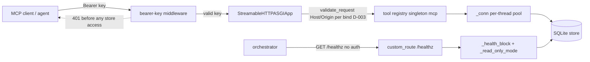

# Tech Spec: http-mcp-serving

**Spec**: [spec.md](spec.md) | **Created**: 2026-10-04
**Every file/symbol citation below must come verbatim from [survey.md](survey.md)
or a grep run in this session — never from memory.** Citations tagged
**[survey]** trace to survey.md; **[grep]** tags this spec session's own
grep/read output (survey gap reported in § Impact analysis).
[research.md](research.md): "not applicable — no open questions at Stage 0" —
rejected alternatives below trace to survey constraints, not research findings.

## Architecture

Serving dispatch is binary stdio|sse today. `src/cairn/mcp_server/server.py:run:178`
— `def run(transport: str = "stdio", port: int | None = None)` — is a shared
boot path (session-id, `configure_logging()` (200), `verify_tool_count()` (206),
stdio-only watchdog (212-213), DB boot guard `sys.exit(1)` (220-244), model
warmup (262), read-only gating (270-346), watcher stop in `finally` (375-376))
ending in a two-way dispatch: `mcp.run(transport="sse")` (368) / bare `mcp.run()`
(370) [survey]. The sole production caller is
`src/cairn/cli/serve.py:_serve_foreground:64` —
`run(transport="sse" if port else "stdio", port=port)` (serve.py:85) [survey];
`src/cairn/mcp_server/__init__.py:2` re-exports `run` and server.py ends in an
`if __name__ == "__main__": run()` guard [grep]. The tool registry is one
module-level singleton — `mcp = FastMCP("cairn", lifespan=app_lifespan,
log_level="WARNING")` (`src/cairn/mcp_server/_server_core.py:68`) — decorated by
all six tools_*.py modules [survey], so any transport exposes the identical
registry.

The pinned mcp 1.29.0 SDK carries the whole streamable-http surface:
`run()` literal `"streamable-http"` (fastmcp/server.py:282-303),
`streamable_http_app():953`, `run_streamable_http_async:780` driving uvicorn
from `self.settings.host/port/log_level` (786-793); `Settings` fields `host`
(98), `port` (99), `stateless_http` (107/169), `transport_security` (130)
[survey]. The SDK's auth machinery is OAuth-only (`token_verifier` →
`BearerAuthBackend`/`RequireAuthMiddleware` with `required_scopes`/
`resource_metadata_url`, server.py:983-989/1015-1018) [survey]; `custom_route`
(server.py:708) is the documented public-endpoint hook, consumed by BOTH
`sse_app` (948) and `streamable_http_app` (1042) [survey].

Request ordering per NFR-001: bearer middleware (outermost ASGI) → per-request
Host/Origin validation inside the transport (`streamable_http.py:409`)
[survey] → tool dispatch → store access (`_conn`). `/healthz` bypasses only
the first hop.

## Solution

### Chosen approach

Add a third `http` branch to `run()`'s existing dispatch (D-001), fronted by a
custom pure-ASGI bearer-key middleware (D-002, SDK auth is OAuth-only), with
explicitly-constructed `TransportSecuritySettings` per bind (D-003 — survey
surprise: the SDK auto-protects only loopback when `transport_security is
None`), a refuse-to-start key policy (D-004), the CLI tri-state extended so
HTTP defaults read-only (D-005), a lazily-registered `/healthz` reusing the
crash-proof `_health_block` machinery (D-006), a slim non-root Dockerfile with
zero new runtime deps (D-007), and flag-based transport selection that keeps
the stray-sweeper classifier untouched (D-008). The stdio/SSE branches and the
shared boot path are inherited unchanged — US6's byte-identical requirement is
structural, not aspirational.

FR coverage: FR-001→D-001/D-008 · FR-002→D-002/D-004 · FR-003→D-002 ·
FR-004→D-003/D-004 · FR-005→D-006 · FR-006→D-001 · FR-007→D-005 ·
FR-008→D-007.

### Alternatives rejected

| Alternative | Why rejected |
|-------------|--------------|
| Static key via SDK `token_verifier` | OAuth 2.1 machinery only: `RequireAuthMiddleware(required_scopes, resource_metadata_url)` (server.py:1015-1018) and `ValueError` gate (server.py:225) [survey]; 401s would steer clients into OAuth discovery; OAuth is the next milestone (spec.md Out) |
| `mcp.run(transport="streamable-http")` with settings mutation only | No middleware injection point: the route table is built inside `streamable_http_app()` (server.py:1006-1042) and `Settings` (98-130) has no middleware slot [survey] |
| Second FastMCP instance for HTTP | The registry is one singleton all six tools_*.py decorate (`_server_core.py:68` [survey]); a second instance forks registration and breaks `verify_tool_count()`'s single-registry count (server.py:156-167 [survey]) |
| HTTP via the launchd daemon (`serve start` extension) | Daemon machinery is launchd/SSE-specific (serve.py:93-107 [survey]); containers bring their own supervisor; US6 keeps the daemon untouched |
| New config layer for key/host/stateless | Existing pattern is Click options + env (serve.py:13-20 [survey]); no config framework exists in the serve path [survey] |

## Impact analysis

### Blast radius of touching `run()`'s dispatch

Direct production callers (3) [grep]: `serve.py:_serve_foreground:85` (only CLI
entry), `src/cairn/mcp_server/__init__.py:2` (re-export), `__main__` guard.
Test callers (5 tests, 6 invocations, all `transport="stdio"`) [grep]:
tests/test_server_robustness.py:51, :95, :126, :335; test_core_smoke.py:296.
`model_warmup.py:86` documents in-process test boots of `run()` [grep].
Resolution caveat: `get_callers("run")` (precise) returned 15 rows, most bound
to unrelated `run` symbols (test_embed_ladder/test_semantic_enrichment/
test_memory_mcp_trim) — common-name artifact; the production edge set above is
session-grep-verified, not resolver-trusted.

Survey gap (reported, not silently patched): survey.md pins none of the
test-tree mocks, `_SERVE_LIFECYCLE_SUBCOMMANDS` (lifecycle.py:151), or the
`__init__.py` re-export — those citations are **[grep]** from this session.
Re-brief verification (**[grep]**, this session, pinned SDK install):
transport_security.py:45-65 (`_validate_host` exact/`base:*` matching only —
no any-Host list), :113-115 (protection-off skip), :120 (421 on bad Host),
fastmcp/server.py:708/743 (`custom_route` unconditional append) — they extend
survey.md's transport_security.py:12-48 pins and drive the D-003(c) ruling.

### Test-tree sweep for the flips this design makes

- **Flag pins** (existing kwarg shape): `server.run(transport="stdio")` at
  test_server_robustness.py:51 (`test_valid_store_proceeds`), :95
  (`test_missing_store_error_names_path_env_and_remediation`), :126
  (`test_missing_store_error_reports_unset_env_vars`), :335
  (`TestSessionIdentity._boot_server`, exercised by `test_preset_session_env_wins`:341
  and `test_unset_session_env_gets_generated`:347); test_core_smoke.py:296
  (`test_server_boot_guard_exits_on_empty_store`) [grep]. New `run()` kwargs
  (host/api_key/stateless) all default → stay green untouched.
- **Exact-count pins**: `mock_mcp.run.assert_called_once()` at
  test_server_robustness.py:59 and :339 [grep]. The stdio branch still calls
  `mcp.run()` exactly once → green. No test pins `mcp.run` call ARGS (no
  `assert_called_with` on it anywhere in tests/) [grep], so the http branch
  and settings mutation cannot flip a traffic-shape pin.
- **Exact-traffic pins**: `verify_tool_count` patched in 5 boot tests
  (test_server_robustness.py:47, :93, :124, :330; test_core_smoke.py:294) and
  called directly in 5 places (test_ingest_compat.py:242,
  test_status_resource_health.py:280, test_mcp_wiki_tool.py:75,
  test_tool_annotations.py:37, test_server_robustness.py:174) [grep]. The http
  branch inherits `verify_tool_count()` at the shared boot point
  (server.py:206 [survey]) — the 25-tool count contract
  (`_EXPECTED_TOOL_COUNT` [grep]) is transport-independent.
- **Behavior pins (unaffected by design)**: boot-guard exit-1 tests (above),
  `TestSessionIdentity`, watchdog drain (:277), stray-sweep emitters
  (test_emitters.py:130 targets `_run_stray_sweep` — untouched, D-008 keeps
  the sweeper SSE-only), `_is_cairn_serve_cmdline` classification
  (lifecycle.py:151/197 [grep] — a `--transport` flag keeps argv[2] a
  non-subcommand, classified as a sweepable server, correctly).
- **US6 guard**: the full existing dispatch suite —
  `tests/test_server_robustness.py` (14 passed [survey]) — must stay green
  with zero edits.

## Quality, threats, and rollback

| Requirement | Design consequence / threat mitigation | Rollback or verification |
|---|---|---|
| NFR-001 Security | D-002 auth outermost (rejects before transport/store); D-003 per-bind Host policy — `validate_request` protection on loopback/specific-host binds (`streamable_http.py:409` [survey]), explicitly off on wildcard binds (transport_security.py:113-115 [grep]) where the D-002/D-004 key is the sole gate; key never logged — boot errors print env chains, not values (server.py:238-243 precedent [survey]); serve path renders no argv today [survey] | Auth-rejection-before-store test at the ASGI boundary; `tests/test_server_robustness.py` sanitization pins stay green [survey] |
| NFR-002 Privacy | D-006 bounded `/healthz` payload; HTTP surface = the same singleton registry as stdio/SSE (`_server_core.py:68` [survey]) | Payload-shape test; no other routes added |
| NFR-003 Performance | Shared `_conn` per-thread pool — `close()` is a no-op release, inode-keyed invalidation (`_server_core.py:139-189` [survey]) | Survey gap: bench vs SSE once FR-001 lands (unknown — verify) |
| NFR-004 Reliability | D-006 crash-proof probes (per-probe try/except, `_server_core.py:338-421` [survey]); `status_resource` returns, never raises (457-458 [survey]); boot-time missing store exits 1 (server.py:220-244 [survey]) | `/healthz` unhealthy-shape test with missing tables |
| NFR-005 Observability | Bind milestone mirrors the SSE stdout print (server.py:363-367 [survey]); auth failures WARN (precedent: Host failures WARN, transport_security.py:48 [survey]); shutdown via existing `finally` watcher stop (371-376 [survey]); `log_level="WARNING"` singleton discipline carries over [survey] | Caplog assertions on WARN-on-bad-key, silence on valid traffic |
| NFR-006 Accessibility | Not applicable: the serving package renders no UI (survey evidence) [survey] | None |

**Threat model**: Asset = the SQLite store + knowledge bundle.
(1) Unauthenticated tool access → D-002 constant-time bearer check outermost;
residual: keyless loopback trusts local users (same as stdio today — FR-004 by
design). (2) DNS-rebinding/browser CSRF → D-003 per-bind ruling;
residual: wildcard binds run Host/Origin validation explicitly off — the SDK
has no "any Host" allowlist (`_validate_host` exact/`base:*` matching only,
transport_security.py:45-65 [grep]) — so DNS-rebinding-class attacks are out
of scope there and the API key is the gate; operators needing Host protection
bind a specific host or front a reverse proxy (D-007 docs). (3) Key disclosure via argv/ps → `--api-key` is visible in
process listings (and to the `ps` probe in `_pid_cmdline`, lifecycle.py
[grep]); mitigation: docs recommend `CAIRN_MCP_API_KEY` env for secrets; cairn
never echoes argv. Residual: accepted, documented. (4) Store corruption via
shared filesystem → docs mandate local-volume mounts (spec.md risk);
`/healthz` reports reachability. (5) Rate limiting/DoS → out of scope
(spec.md).

**Rollback**: the feature is opt-in behind `--transport http`; deleting the
http branch, the middleware, the new CLI flags, and the two new files restores
the exact prior surface. Local transports are pinned by the untouched suite
(§ Impact analysis).

## Code guide

### `src/cairn/mcp_server/server.py` — transport branch + auth + policy
- Touches: `run` (server.py:178) http branch; new middleware/policy helpers; `/healthz` registration.
- Approach: `elif transport == "http":` after the SSE branch — mutate `mcp.settings.{host,port,stateless_http,transport_security}` (SSE precedent, server.py:358-360 [survey]), refuse-to-start check (DB-guard `sys.exit(1)` pattern, 220-244 [survey]), lazy `custom_route` registration, uvicorn config mirror of `run_streamable_http_async` (786-793 [survey]).
- Verify before implementing: `.venv/bin/python -m pytest tests/test_server_robustness.py -q` (14 passed [survey]).
- Pitfalls: settings persist on the module-level singleton across in-process `run()` calls — set all fields idempotently every call, and guard `/healthz` registration the same way (`custom_route`'s decorator appends unconditionally, fastmcp/server.py:743 [grep]); middleware must forward `lifespan` scopes; `session_manager` raises if accessed before `streamable_http_app()` (server.py:273-279 [survey]) — never touch it directly; no stray sweeper in the http branch (SSE-only, server.py:354-356 [survey]).

### `src/cairn/cli/serve.py` — flags, tri-state, key precedence
- Touches: `serve` (serve.py:22) and `serve_run` (59) option lists (13-20/45-58 pattern [survey]); `_serve_foreground` (64).
- Approach: add `--transport/--host/--api-key/--stateless` to both; `read_only = bool(port) or transport == "http"` in the tri-state auto branch (serve.py:80-82 [survey]); resolve flag > `CAIRN_MCP_API_KEY` env here, pass the resolved key into `run()`.
- Verify before implementing: `cairn serve --help` renders; keyless default loopback boots; `--host 0.0.0.0` without key exits 1.
- Pitfalls: don't re-read the env inside `run()` — precedence would split across two files; `--port` without `--transport` must keep meaning SSE (US6).

### `src/cairn/mcp_server/_server_core.py` — `/healthz` handler
- Touches: new handler beside `_health_block` (`_server_core.py:310`, fields 424-431 [survey]) and `_read_only_mode` (80 [survey]).
- Approach: bounded JSON `{status, store_reachable, read_only, degradations}`; reachable probe via pooled `_conn()` (139 [survey]) inside the crash-proof guard.
- Verify before implementing: `grep -n "cairn://status" src/cairn/mcp_server/_server_core.py` (line 439 [survey]) — MCP resource stays as-is.
- Pitfalls: register lazily from `run()`'s http branch — module-level decoration would leak `/healthz` into `sse_app` (custom routes feed both apps, server.py:948/1042 [survey]).

### `Dockerfile` + `docs/deployment.md` — packaging (both new)
- Touches: nothing existing; inputs verified — `cairn = "cairn.cli:main"` (pyproject.toml:175-176), `requires-python = ">=3.10"` (11), `mcp>=0.9.0,<2.0.0` with "SSE/streamable-http + uvicorn/starlette are core deps" (46) [survey].
- Approach: `python:3.12-slim`, non-root user, `ENV CAIRN_HOME=/data` + `VOLUME /data`, `EXPOSE 9876`, `ENTRYPOINT ["cairn", "serve", "--transport", "http", "--host", "0.0.0.0"]` + `CAIRN_MCP_API_KEY` env (D-004 refuse-to-start kills misconfigured containers at boot); docs cover local/networked/container (NFS mounts mandated against, TLS deferred to reverse proxy).
- Verify before implementing: `ls Dockerfile` absent [survey].
- Pitfalls: survey gap — "unknown — verify whether uvicorn needs explicit declaration once the image is built (SDK imports it lazily inside run_*_async, server.py:767/782)" [survey]; tree-sitter grammar pins (pyproject.toml:29-43 [survey]) size the image.

### `tests/test_http_transport.py` — new suite (planner-owned name)
- Touches: auth rejection before store access, key precedence, refuse-to-start, `/healthz` payload, stateless wiring.
- Approach: ASGI-level tests against the assembled app with the store sandboxed.
- Verify before implementing: `grep -rn "stateless" src/cairn/` (no matches [survey]).
- Pitfalls (constitution C-04): no eager `cairn.cli`/`cairn.mcp_server` imports at module level; never patch global `subprocess.Popen`; `tmp_path` isolation from real `~/.cairn`.

## References

None — [research.md](research.md) is "not applicable — no open questions at
Stage 0"; all grounding lives in [survey.md](survey.md).

## Decisions

### D-001: Transport wiring — new `http` branch in run()'s dispatch; assemble `streamable_http_app()` + auth middleware, uvicorn driven from mutated settings
- **Context**: `run()` already owns the shared boot path and two-way dispatch; the SSE branch mutates `mcp.settings.port` because "FastMCP.run() in mcp>=1.0 reads host/port from mcp.settings, not kwargs" (server.py:358-360) [survey]. `streamable_http_app()` builds its route table internally (server.py:1006-1042) and `Settings` (98-130) exposes no middleware slot [survey].
- **Decision**: In `src/cairn/mcp_server/server.py:run:178`, add `elif transport == "http":` after the SSE branch. It (a) mutates `mcp.settings.host/port/stateless_http/transport_security` (settings-mutation precedent), (b) assembles `bearer_middleware(mcp.streamable_http_app())` (D-002), (c) runs uvicorn `Config(host=mcp.settings.host, port=mcp.settings.port, log_level=...)` mirroring `run_streamable_http_async` (786-793) [survey]. The session manager's mandatory lifespan rides inside `streamable_http_app()` (`lifespan=lambda app: self.session_manager.run()`, line 1048) [survey]. `--stateless` (FR-006) maps to `mcp.settings.stateless_http = True` — the field flows into `StreamableHTTPSessionManager` via `stateless=self.settings.stateless_http` (line 964) [survey]. Shared boot path (verify_tool_count, DB guard, warmup, read-only gating, watcher, `finally` stop) inherited unchanged.
- **Consequences**: Kept red flag — a ~6-line uvicorn `Config` mirror of SDK code, accepted because there is no middleware injection point via `mcp.run(transport="streamable-http")`. Kept red flag — the http branch installs no stray sweeper (SSE-only per server.py:354-356 [survey]); the read-only default (D-005) keeps HTTP writer-free like the daemon, and read-write-HTTP sweeping semantics are deferred.

### D-002: Auth — custom pure-ASGI bearer-key middleware; SDK TokenVerifier rejected
- **Context**: FR-002/FR-003 need a static bearer key checked before any store access with `/healthz` public. SDK auth is OAuth-only: `token_verifier` installs `BearerAuthBackend`/`RequireAuthMiddleware` with `required_scopes`/`resource_metadata_url` (server.py:983-989, 1015-1018) and auth without provider/verifier raises `ValueError` (server.py:225) [survey]; OAuth 2.1 is the next milestone (spec.md Out). `custom_route` (server.py:708) is the SDK's documented public-endpoint hook ("intended to be public such as health check endpoints", 723-725) [survey].
- **Decision**: A small pure-ASGI middleware in `src/cairn/mcp_server/server.py`, wrapped outermost around `mcp.streamable_http_app()` (D-001). It compares `Authorization: Bearer <key>` against the resolved key with a constant-time comparison, returns 401 without invoking the wrapped app otherwise (FR-003: rejection precedes transport and all store access), and forwards non-HTTP scopes (lifespan) untouched. Exempt path set is exactly `{"/healthz"}`. No `token_verifier` is passed, so the SDK takes its "Auth is disabled, no wrapper needed" branch (1021-1028) [survey]; cairn's middleware is the single auth layer.
- **Consequences**: Key sourcing/precedence and the gate stay in cairn-owned, Click-free-testable code. A naive HTTP-only wrapper would break the session manager — lifespan forwarding is a hard requirement of this middleware.

### D-003: Transport security — cairn always constructs TransportSecuritySettings explicitly, per bind
- **Context**: Survey surprise: with `transport_security=None` the SDK auto-protects only loopback hosts (server.py:179-185) and runs protection explicitly off otherwise (`transport_security.py:40-43`) [survey]; cairn never constructs `TransportSecuritySettings` today, so a non-loopback bind would get NO Host-header protection (FR-004/NFR-001). Settings shape: `enable_dns_rebinding_protection`/`allowed_hosts`/`allowed_origins` (`transport_security.py:12/19/24/30`); missing-Host requests already WARN (`"Missing Host header in request"`, transport_security.py:48) [survey].
- **Decision**: The http branch always sets `mcp.settings.transport_security`: (a) loopback bind (SDK's own tuple `("127.0.0.1", "localhost", "::1")`, server.py:180 [survey]) → `TransportSecuritySettings(enable_dns_rebinding_protection=True, allowed_hosts=["127.0.0.1:*", "localhost:*", "[::1]:*"], allowed_origins=["http://127.0.0.1:*", "http://localhost:*", "http://[::1]:*"])` — identical to the SDK auto-tuple (181-185) but explicit; (b) non-loopback specific bind → protection on, `allowed_hosts=[host, f"{host}:*", "127.0.0.1:*", "localhost:*", "[::1]:*"]` (bare `host` covers a portless Host header — the `:*` match requires a colon, transport_security.py:56-62 [grep]), `allowed_origins=[]` (empty-origins behavior of `validate_request` at transport_security.py:102: unknown — verify); (c) wildcard bind (`0.0.0.0`/`::`) → `TransportSecuritySettings(enable_dns_rebinding_protection=False, allowed_hosts=[], allowed_origins=[])` — protection explicitly OFF. Ruling: the SDK's `_validate_host` (transport_security.py:45-65 [grep]) matches only exact hosts or `base:*` prefixes — there is no "any Host" list, so any enumerable allowlist 421-rejects real remote agents' Host headers (`validate_request` → 421, transport_security.py:120 [grep]), breaking US1 and the D-007 `--host 0.0.0.0` entrypoint. On wildcard binds the mandatory API key (D-002/D-004) is the sole gate; POST Content-Type checking still runs (transport_security.py:107-111 precede the protection-off skip at 113-115 [grep]).
- **Consequences**: Protection state is cairn policy, immune to SDK default changes. Tradeoff, named: on wildcard binds DNS-rebinding-class (browser-originated) attacks are out of scope — the Host check is disabled, not loosened, because it cannot express "any Host"; the API key is the gate. Operators needing Host-header protection must bind a specific host (b) or front a reverse proxy — D-007 docs say so. Residual risk recorded in § Quality.

### D-004: Binding policy — keyless loopback only; non-loopback without a key refuses to start
- **Context**: Loopback default exists (`DEFAULT_HOST = "127.0.0.1"`, `src/cairn/mcp_server/lifecycle.py:15`; SDK `host: str = "127.0.0.1"`, server.py:162 [survey]); no key surface exists [survey]. Boot refusal has a proven pattern: `_timestamped_print(...)` + `sys.exit(1)` (server.py:220-244), regression-tested (`TestStoreExistenceCheck`, exit code 1 [survey]).
- **Decision**: `src/cairn/cli/serve.py` gains `--host` (default `lc.DEFAULT_HOST`), `--api-key`, `--transport`, `--stateless` on both `serve` and `serve run` (the group already duplicates `--db/--port/--read-only`, serve.py:13-20/45-58 [survey]). `_serve_foreground` resolves `--api-key` flag over `CAIRN_MCP_API_KEY` env (FR-002) and passes the resolved key into `run()`. Enforcement lives in `run()`'s http branch (single choke point, testable without Click): non-loopback host + no key → clear error + `sys.exit(1)` before binding. Keyless loopback runs without the auth middleware (same trust model as local stdio). `--transport http` without `--port` defaults to `lc.DEFAULT_PORT` (9876, lifecycle.py:14 [survey]) — HTTP and SSE are alternative modes of one foreground command, never concurrent.
- **Consequences**: Misconfiguration fails at boot, not at first request. Precedence is decided in exactly one place; the key travels in-process.

### D-005: Read-only default for HTTP — extend the existing tri-state condition
- **Context**: The tri-state exists — "None => auto (read-only under SSE/launchd, read-write under stdio), True/False => explicit override" (serve.py:67-68); `if read_only is None: read_only = bool(port)` then `os.environ["CAIRN_READ_ONLY"] = "1" if read_only else "0"` (serve.py:80-82) [survey]. Survey gap: the condition "keys off --port, so an HTTP selection mechanism (FR-001) must be included in the read-only default condition" [survey].
- **Decision**: In `_serve_foreground`, the auto branch becomes `read_only = bool(port) or transport == "http"`; explicit `--read-only/--read-write` still override. Downstream chain untouched: `CAIRN_READ_ONLY` → `_read_only_mode()` (`_server_core.py:80`) → `get_db(db_path, read_only=...)` [survey].
- **Consequences**: A default HTTP server can never hold SQLite's writer lock — the SSE daemon's contention-safety argument (server.py:264-270 [survey]) extends to HTTP. Write-capable HTTP requires the existing explicit `--read-write`.

### D-006: /healthz — lazily registered `custom_route`; payload reuses the `_health_block` machinery
- **Context**: `custom_route` is the SDK's public-endpoint hook, but custom routes feed BOTH `sse_app` (948) and `streamable_http_app` (1042) [survey] — module-level registration on the singleton would leak `/healthz` into the SSE app and break US6. Health machinery already exists and is crash-proof: `_health_block:310` ("every probe is guarded so a missing table ... degrades to a null/0 field", 313-315; `degradations` field at 424-431), `_read_only_mode` at `_server_core.py:80` [survey].
- **Decision**: Register lazily inside `run()`'s http branch — `mcp.custom_route("/healthz", methods=["GET"])(handler)` — before `streamable_http_app()` is built, so SSE never gains the route. The decorator appends unconditionally (`self._custom_starlette_routes.append(...)`, fastmcp/server.py:743 [grep]), so repeated in-process `run()` calls would stack duplicate `/healthz` routes — register only when the route is not already present (or behind a module-level once-flag), the same idempotency discipline as the settings mutation (D-001). Handler lives in `src/cairn/mcp_server/_server_core.py` beside `_health_block`, returning bounded JSON: `{"status": "ok"|"unhealthy", "store_reachable": bool, "read_only": bool, "degradations": <int>}` — `read_only` from `_read_only_mode()`, `degradations` from `_health_block()`'s guarded probes, `store_reachable` from a guarded pooled `_conn()` probe (pooling ⇒ no per-probe reopen, NFR-003). Store down ⇒ `status: "unhealthy"` with HTTP 200 (machine-readable unhealthy, FR-005/NFR-004); no fields beyond the documented payload (NFR-002).
- **Consequences**: Zero new health machinery — NFR-004 inherits the existing per-probe try/except (`_server_core.py:338-421` [survey]). The `cairn://status` MCP resource (line 440 [survey]) stays as-is; `/healthz` is a strict subset view.

### D-007: Container packaging — slim base, non-root, CAIRN_HOME=/data, HTTP entrypoint; zero new runtime deps
- **Context**: No Dockerfile, no deployment doc [survey]. Inputs verified: `cairn = "cairn.cli:main"` (pyproject.toml:175-176), `requires-python = ">=3.10"` (11), `mcp>=0.9.0,<2.0.0` with "SSE/streamable-http + uvicorn/starlette are core deps in mcp>=0.9" (46); `[watch]`/semantic extras optional [survey]. Constitution C-03 gates new runtime deps.
- **Decision**: New `Dockerfile` at repo root: `python:3.12-slim`; `pip install .` (uvicorn/starlette ride inside the `mcp` core dep per pyproject.toml:46 [survey] — C-03 satisfied with zero additions); dedicated non-root user; `ENV CAIRN_HOME=/data` + `VOLUME /data`; `EXPOSE 9876`; `ENTRYPOINT ["cairn", "serve", "--transport", "http", "--host", "0.0.0.0"]` with `CAIRN_MCP_API_KEY` via env — D-004's refuse-to-start kills a misconfigured container at boot instead of serving keyless on a wildcard bind. New `docs/deployment.md` covering local loopback (keyless), networked (key + explicit host + reverse-proxy TLS pointer — TLS termination deferred per spec.md; wildcard binds run auth-only with Host validation off per D-003(c), bind a specific host for Host protection), container (local-volume store; SQLite-on-NFS corruption mandated against per spec.md risk).
- **Consequences**: Survey gap carried to implementation: "unknown — verify whether uvicorn needs explicit declaration once the image is built (SDK imports it lazily inside run_*_async, server.py:767/782)" [survey]. Tree-sitter grammar pins (pyproject.toml:29-43 [survey]) size the image; slim base bounds it.

### D-008: Transport selection is flag-based (`--transport http`), never a positional subcommand
- **Context**: Dispatch is implied today: `run(transport="sse" if port else "stdio", port=port)` (serve.py:85) [survey]. The stray-sweeper classifier keys on argv shape: `_SERVE_LIFECYCLE_SUBCOMMANDS = {"start", "stop", "status", "restart"}` (`src/cairn/mcp_server/lifecycle.py:151`), and `_is_cairn_serve_cmdline` treats `cairn serve` + any argv[2] outside that set as a real sweepable server (lifecycle.py:197) [grep].
- **Decision**: HTTP is selected by `--transport http` on the existing `serve`/`serve run` commands; explicit `--transport` wins over the port implication, else `transport = "sse" if port else "stdio"` (today's shapes byte-identical, US6). No new positional subcommand: `cairn serve --transport http ...` has argv[2] == `--transport`, already classified as a sweepable server (correct). Any future transient lifecycle-style HTTP subcommand would have to join `_SERVE_LIFECYCLE_SUBCOMMANDS` [grep].
- **Consequences**: Zero changes to the stray-sweeper classifier or launchd plist shapes; daemon lifecycle (`serve start/stop/status/restart`) stays SSE/launchd-only (serve.py:93-107 [survey]); containers and networked hosts use their own supervisor per D-007 docs.

### D-017: T010 container acceptance via CI smoke job
- **Context**: no container runtime exists on the dev machine (no Docker/OrbStack/Rancher apps, no colima/podman) and no CI job built images; T010's cold docker build/run could not execute locally.
- **Decision**: acceptance lands three ways — (1) the Dockerfile's static verification (T008), (2) the live HTTP-surface equivalents outside the container (keyless loopback serves, keyed 401s, non-loopback refusal, /healthz — the T002-T007 live runs), and (3) a new CI `container` job (build + keyless-wildcard refusal + keyed /healthz probe) owning the cold-build proof on every push; TC-016's manual observation is satisfied by that job's green run plus (2).
- **Consequences**: the Dockerfile is exercised automatically; the full in-container authenticated tool-call walkthrough (TC-016's richest form) remains a human step for the first runtime-capable environment, surfaced in the delivery summary.

### D-018: Delivery scope additions
- **Context**: D-017's CI container job touches `.github/workflows/ci.yml`; T009's index/entry additions touch `docs/README.md` and `CHANGELOG.md`.
- **Decision**: the three paths join the delivery set by ruling (`.github/workflows/ci.yml` via D-017; `docs/README.md` + `CHANGELOG.md` via T009's documented-surface mandate).
- **Consequences**: scope audit clean.
