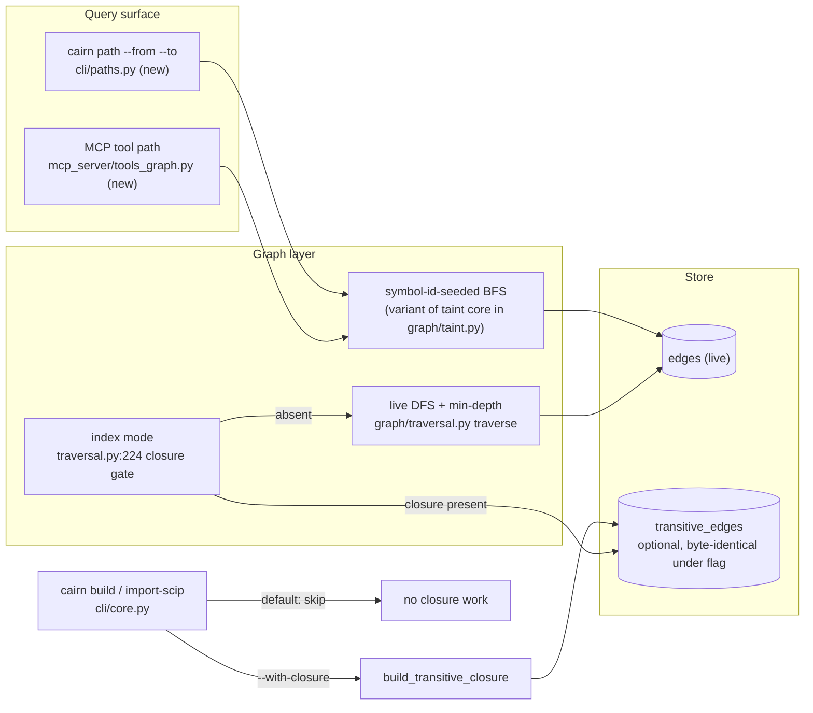

# Tech Spec: on-demand-paths

**Spec**: [spec.md](spec.md) | **Created**: 2026-10-04
**Every file/symbol citation below must come verbatim from [survey.md](survey.md)
or a grep run in this session — never from memory.**

## Architecture

The path query is a new reader over the live `edges` table only — it never
touches `transitive_edges`. It reuses taint's depth-capped BFS
(`_paths_from_entry` at `src/cairn/graph/taint.py:209`, fuzzy tier
`_fuzzy_neighbors` at :297) through a thin symbol-id-seeded variant, because
taint's endpoints are registry-name-set parameterized and the path query
seeds resolved symbol ids (survey S5 gap). The closure demotion is a CLI-layer
flag gate around the two existing `build_transitive_closure` call sites
(`src/cairn/cli/core.py:368`/:372 build, :493/:495 import-scip) — the closure
internals are unchanged. `impact_analysis` keeps its gate
(`src/cairn/graph/traversal.py:224`): index mode when the closure is
materialized, live DFS otherwise — and the live DFS gains min-depth tracking
so its depth numbers mean the same thing on closure-free stores.

## Solution
### Chosen approach
One shared BFS core, three consumers:

1. **FR-001/FR-003/FR-007 — path walk**: a symbol-id-seeded variant of
   taint's BFS lives beside `_paths_from_entry` in `src/cairn/graph/taint.py`
   and is exposed as one public function taking resolved seed-id sets,
   `fuzzy`, and `max_depth`. Endpoint patterns resolve exactly as
   `cairn taint` does (survey S6: `src/cairn/cli/taint.py:17` `"--from",`,
   :23 `"--to",`, :39 `def taint(db, from_pattern, to_pattern, fuzzy,
   max_depth):`), traversing `STRUCTURAL_EDGE_KINDS`
   (`src/cairn/graph/traversal.py:12`: calls/call/extends/implements).
   One shortest path per resolved (from, to) pair; printed paths capped at
   50 by default (`--limit` overrides; the pin must stay below the 60-pair
   fanout TC-006 uses); deterministic ordering (D-002).
2. **FR-002 — MCP parity**: a `path` tool in
   `src/cairn/mcp_server/tools_graph.py` (the `@mcp.tool` module, e.g. :432
   `def explore(query: str) -> str:`) delegates to the same walk function;
   `_EXPECTED_TOOL_COUNT` at `src/cairn/mcp_server/server.py:49` bumps
   25→26 with every count pin in lockstep (D-003).
3. **FR-004/FR-006 — demotion**: `--with-closure` flag on `cairn build`
   (signature `src/cairn/cli/core.py:282`) and `import-scip`; both call
   sites move into the flag arm. Absent closure → `cairn update` skips
   maintenance via the existing probe (`src/cairn/graph/incremental.py:465`
   `if pre["closure_built"] and pre["dataflow_built"]:` — survey S4, DONE).
   Closure internals untouched, so the flag-on row set is byte-identical by
   construction, pinned by test against a direct `build_transitive_closure`
   run.
4. **FR-005 — depth contract**: the live DFS inner function
   (`src/cairn/graph/traversal.py:261` `def traverse(sym_id: str, sym_name:
   str, depth: int):`) tracks the minimum distance per reached symbol
   (survey S8), so closure-free depth numbers match closure-era
   shortest-path depths. Index mode is unchanged.

research.md is empty (no open questions at Stage 0), so every rejected
alternative below traces to a survey constraint or the spec's own text.

### Alternatives rejected
| Alternative | Why rejected |
|-------------|--------------|
| Standalone new BFS module instead of extending taint's core | Spec scope mandates "sharing one BFS core with taint"; survey S5 ships the depth-capped BFS + parent-chain reconstruction + fuzzy tier already — duplicating it doubles the maintenance surface |
| Name the CLI module `src/cairn/paths.py` | `src/cairn/paths.py` exists (store-filesystem discovery — session grep); layer-local naming avoids the confusion, per the existing `cli/dataflow.py` vs `graph/dataflow.py` precedent |
| Keep the closure default-on | Spec Why: it is the build's largest derived-index cost and its only semantic consumer is impact index mode at depth ≤ 3; survey S3 (DONE) verifies every other reader already falls back live |
| Redesign the closure format when opt-in | FR-004 pins byte-identical output — scip-indexing-v2's closure row-set contract is preserved, not redesigned |
| Rebuild the closure on demand inside `impact_analysis` when absent | NFR-004: the closure is optional data, never required state; on-demand rebuild reintroduces the exact cost the spec removes |
| Weighted / semantic / all-simple-paths enumeration | Out of scope by spec (deferred) |

## Impact analysis

Graph-tool sweep this session (cairn store, precise mode):

- `build_transitive_closure`: 59 impacted symbols — 17 direct callers, 36 at
  depth 1, 6 at depth 2; the direct callers are dominated by tests calling
  the function directly, which stay green because the function itself is
  unchanged — only its CLI call sites move behind the flag.
- `closure_available`: 4 callers — `src/cairn/graph/dataflow.py:602`,
  `src/cairn/pack.py:303`, `src/cairn/graph/traversal.py:224`,
  `src/cairn/skillgen/ranking.py:29` — all keep their probe-then-fallback
  shape; none changes.
- `traverse` (nested in `traversal.py`) and the min-depth change: bounded to
  `impact_analysis`'s live-DFS branch; index mode
  (`dataflow.py:617` `def impact_from_closure(`) is untouched.

Test-tree sweep for the two default flips (tool-count bump, closure
demotion), classified:

| Class | Tests found (file · name) | Effect of the flip |
|-------|---------------------------|--------------------|
| Flag pins (assert old default) | none found asserting a default CLI build populates `transitive_edges` — session grep of `tests/` | no test asserts the old demotion default; new pins assert the new default |
| Exact-count pins | `tests/test_status_resource_health.py:281` `assert _EXPECTED_TOOL_COUNT == 25` | breaks on bump — updated to 26 in the same task |
| Exact-traffic pins | `tests/test_agent_surface.py:387`-408 cross-checks `src/cairn/agent_install/_common.py:451` (installer blurb "25 tools") against `_EXPECTED_TOOL_COUNT`; `tests/test_server_robustness.py:175` `_count_fastmcp_tools() == _EXPECTED_TOOL_COUNT` | blurb and constant must move together or the cross-check fails; robustness pin self-consistently green after both move |
| Behavior pins (unaffected) | `tests/test_traversal_parity.py` `corpus_db` fixture calls `build_transitive_closure` directly (:180 area — session grep), so goldens keep closure; `tests/test_scaling_gate.py:89` `test_closure_budget_gate_at_1000_files` (suite calls `build_transitive_closure` directly at `src/cairn/bench/scaling_suite.py:171` — session grep); `tests/test_workflow_audit_fixes.py:76` incremental rebuild when closure present (= the FR-006 contract); `tests/test_incremental_derived.py:702` `test_maintain_transitive_closure_matches_full_rebuild`; `tests/test_invariants.py:200` / `tests/test_contention_visibility.py:229` schema invariants (table stays in schema); `tests/test_scip_integration.py:95`/:99 (direct materialization, then asserts rows) | all green untouched — none routes through the CLI flag |

Re-points (survey S9 gap): the parity pins re-point at the DFS min-depth
contract when the closure is absent — the corpus fixture materializes the
closure explicitly, so existing goldens stay valid and closure-free depth
pins are added alongside (Phase 4). Doc pins on the tool count (FR-002 "with
the tool-count pins updated"): `README.md:22`/:350, `AGENTS.md:10`,
`docs/architecture.md:41`, `docs/mcp-tools.md:5`/:15/:23,
`src/cairn/agent_install/_common.py:451` — all move in the bump task.

## Quality, threats, and rollback
| Requirement | Design consequence / threat mitigation | Rollback or verification |
|-------------|----------------------------------------|--------------------------|
| NFR-003 (performance) | The walk is depth-capped (same bound machinery as taint's `max_depth`, `src/cairn/cli/taint.py:39`) and output-capped (FR-001), bounding work on fan-out graphs; chunked neighbor batches ride taint's `_IN_CHUNK = 400` (`src/cairn/graph/taint.py:100`) | infra-marked gate on the 1000-file corpus asserts a max-depth-4 query < 2s wall; failure → tune chunking/pruning, or narrow the default cap |
| NFR-001 (security) | Not applicable: read-only query over the local store, no new network/auth surface — the tool rides existing transports (spec) | N/A |
| NFR-002 (privacy) | Not applicable: no new data leaves the store (spec) | N/A |
| NFR-004 (reliability) | Closure stays optional data: absence is probed (`incremental.py:465`, `dataflow.py:602` `def closure_available(`), never assumed; no migration — the table remains in schema (`schema.py:420`) just unbuilt | Rollback = rebuild via `--with-closure`; verification: demotion pins + incremental suite |
| NFR-005 (observability) | Not applicable: CLI text output + existing telemetry suffice (spec) | N/A |
| NFR-006 (accessibility) | Not applicable: CLI text only, no UI surface (spec) | N/A |

Threat model: no new asset, threat, or privileged operation — the path query
is a read-only SELECT-shaped walk over the store the caller already owns;
the demotion removes work rather than adding surface. Residual risk: none
identified beyond existing transport exposure.

Rollback strategy: demotion is flag-gated in one file (`cli/core.py`) —
reverting the default re-enables the old posture with no data loss (the
closure, when present, is maintained incrementally as today). The path CLI +
MCP tool are additive registrations — removal is a revert of the new files
plus the count constant. FR-005's min-depth DFS is behavior-tightened, not
reverted, by the same tests that pin it.

## Code guide
### Path walk core (graph layer)
- Touches: `_paths_from_entry` at `src/cairn/graph/taint.py:209`, `_hop_chain` :261, `_exact_neighbors` :275, `_fuzzy_neighbors` :297, `_IN_CHUNK = 400` :100 (survey S5)
- Approach: extract a symbol-id-seeded variant beside the existing helpers without changing taint's endpoint resolution; one public walk function (seed-id sets, fuzzy, max_depth) returning one shortest path per (from, to) pair in deterministic order (D-001, D-002)
- Verify before implementing: `python3 -m pytest tests/ -k taint -q` (baseline green, must stay green untouched)
- Pitfalls: taint's endpoints are registry-name-set parameterized — do not retarget them; the variant seeds resolved symbol ids only (survey S5 gap)

### CLI command
- Touches: new `src/cairn/cli/paths.py` mirroring `src/cairn/cli/taint.py:17`/:23/:39 (`--from`/`--to`/fuzzy/max_depth contract, survey S6); registration in `src/cairn/cli/__init__.py:34` (`from . import taint  # noqa: F401` pattern)
- Approach: resolve endpoint patterns under taint's matching rules, call the walk, print ordered hop chains with file:line per hop, cap printed paths, exit 0 on "no path within N hops" (US1 AC2)
- Verify before implementing: `cairn taint --help` (S6 verify) — the endpoint contract to mirror
- Pitfalls: `src/cairn/paths.py` already exists (store-filesystem discovery — session grep); the CLI module lives under `cli/` (precedent: `cli/dataflow.py` vs `graph/dataflow.py`)

### MCP surface
- Touches: `@mcp.tool` defs in `src/cairn/mcp_server/tools_graph.py` (e.g. :432 `def explore(query: str) -> str:`); `_EXPECTED_TOOL_COUNT = 25` at `src/cairn/mcp_server/server.py:49`; `verify_tool_count` :156 (survey S7)
- Approach: `path` tool delegates to the same walk function (same answer as CLI, US2 AC1); bump count 25→26 and move every pin in lockstep (D-003)
- Verify before implementing: `grep -n "_EXPECTED_TOOL_COUNT = " src/cairn/mcp_server/server.py` (S7 verify)
- Pitfalls: `tests/test_agent_surface.py:387`-408 fails unless the installer blurb (`src/cairn/agent_install/_common.py:451`) moves in the same commit as the constant; `tests/test_status_resource_health.py:281` pins `== 25` explicitly (session grep)

### Closure demotion (build / import-scip / update)
- Touches: `src/cairn/cli/core.py` — `build_transitive_closure` imported :355, called :368/:372 (build) and :493/:495 (import-scip); `build` signature :282 (survey S1/S2)
- Approach: `--with-closure` flag; both call sites gate on it; `cairn update` needs no change — the maintenance probe `src/cairn/graph/incremental.py:465` (`"closure_built": _has_rows("transitive_edges")` at :653) already skips when absent (survey S4, DONE); pin default-empty, flag-on byte-identical, and update-skips
- Verify before implementing: `grep -n "with-closure" src/cairn/cli/core.py` (no match = flag absent, survey S2 verify)
- Pitfalls: byte-identical is pinned against a direct `build_transitive_closure` call, not against pre-flip CLI output; do not touch `dataflow.py` closure internals (`_closure_rows` :389, `maintain_transitive_closure` :497) — FR-004 preserves scip-indexing-v2's closure row-set contract

### Impact depth contract (FR-005)
- Touches: `src/cairn/graph/traversal.py:261` `def traverse(...)` inside the live-DFS branch; index gate :224 stays as is (survey S8)
- Approach: track minimum distance per reached symbol (relax + re-expand within the depth cap) so first-visit order no longer decides depth; `cycles` reporting survives (`tests/test_traversal_parity.py:316` pins it)
- Verify before implementing: `grep -n "def traverse" src/cairn/graph/traversal.py` then inspect body for the missing min-distance map (S8 verify)
- Pitfalls: parity goldens intentionally pin only order-invariant facts and depth "where it is deterministic" (module docstring) — new closure-free depth pins must use deterministic tree/diamond fixtures; tree-shaped depth pins stay green because first-visit depth equals min-depth on trees

### Path perf gate (NFR-003)
- Touches: `src/cairn/bench/scaling_suite.py` (corpus builder + timing helpers; closure budget gate lives here — session grep :125-:219), `tests/test_scaling_gate.py` (`_run_gate_point` pattern :58-:66)
- Approach: infra-marked gate building the 1000-file corpus (closure-free — the new default) and timing one max-depth-4 path query under 2s wall
- Verify before implementing: `grep -n "def run_scaling_suite\|CLOSURE_BUDGET" src/cairn/bench/scaling_suite.py`
- Pitfalls: mark it `infra` like `test_closure_budget_gate_at_1000_files` (`tests/test_scaling_gate.py:88` `@pytest.mark.infra`) so the normal suite stays fast

## References
research.md is empty ("not applicable — no open questions at Stage 0") — no
external references to carry. Prior art inside the repo: the taint CLI/BFS
pair (survey S5/S6) is the contract template; scip-indexing-v2's
closure-built-by-default decision is the superseded one (see D-004).

## Decisions
<!-- ADR-lite. Append-only: decisions made during implementation land here too. -->
### D-001: Shared BFS core as a symbol-id-seeded taint variant
- **Context**: survey S5 ships taint's depth-capped BFS with parent-chain reconstruction and a fuzzy tier, but parameterizes endpoints on registry name-sets; the path query seeds resolved symbol ids. The spec requires one shared core with taint behavior unchanged.
- **Decision**: add the variant beside the existing helpers in `src/cairn/graph/taint.py`, exposed as one public walk function (seed-id sets, fuzzy, max_depth → one shortest path per pair). Taint's own call path is untouched.
- **Consequences**: the taint suite is the regression gate (must stay green untouched); the public function signature is the contract the CLI (Phase 1) and MCP tool (Phase 2) consume.

### D-002: Determinism by explicit ordering, not enumeration luck
- **Context**: FR-007 requires same-input → same-output order; the parity test module docstring warns DFS output is otherwise enumeration-order-dependent (filesystem row order varies by platform).
- **Decision**: the walk sorts seeds and expands neighbors in fixed SQL order, breaking ties by (file, symbol name) at output time; tests pin order on an unchanged graph via deterministic fixtures, not golden enumeration.
- **Consequences**: deterministic within a store regardless of platform; re-traversal after graph changes may reorder (allowed — the contract is per-unchanged-graph).

### D-003: Tool-count pins move in lockstep
- **Context**: adding the `path` tool makes `verify_tool_count` (`src/cairn/mcp_server/server.py:156`) fail unless `_EXPECTED_TOOL_COUNT` moves; `tests/test_agent_surface.py` additionally cross-checks the installer blurb against the constant, and `tests/test_status_resource_health.py:281` pins the literal.
- **Decision**: one task bumps 25→26 in server.py, the installer blurb (`src/cairn/agent_install/_common.py:451`), README.md, AGENTS.md, docs/architecture.md, docs/mcp-tools.md, and the pinned test — atomically.
- **Consequences**: partial bumps are unshippable (the cross-check enforces it); doc pins must be swept by grep, not memory, whenever the count changes again.

### D-004: Closure demoted to opt-in, superseding scip-indexing-v2's closure-built-by-default decision
- **Context**: the closure is the build's largest derived-index cost; its only semantic consumer is impact index mode at depth ≤ 3 (spec Why), and every other reader already falls back to the live graph (survey S3, DONE). The scip-indexing-v2 spec pinned the closure as default-built there.
- **Decision**: `cairn build`/`import-scip` skip materialization by default; `--with-closure` restores it byte-identically (row-set contract preserved). This decision supersedes that default-on posture; the closure stays available and incrementally maintained whenever present (FR-006, survey S4).
- **Consequences**: fresh stores have an empty `transitive_edges` until opted in; the scaling budget gate keeps measuring the closure function directly (`src/cairn/bench/scaling_suite.py:171`), unaffected; the closure remains optional data, never required state (NFR-004).

### D-005: Live DFS gains min-depth tracking instead of index dependency
- **Context**: survey S8 — the live DFS reports first-found depths, so closure-free multi-hop depth numbers would silently change meaning after demotion (US4).
- **Decision**: `traverse` tracks the minimum distance per reached symbol within the depth cap; index mode stays shortest-path as today. Depth fidelity is extended to closure-free stores rather than making `impact_analysis` require the closure.
- **Consequences**: slightly more DFS work on diamond shapes (bounded by the depth cap); depth pins that hold on trees stay green (first-visit = min-depth there); the parity file gains closure-free depth pins as the S9 re-point.

### D-007: Closure row-set contract inherited from scip-indexing-v2
- **Context**: FR-004 references the closure row-set contract that scip-indexing-v2 pinned when the closure went default-built; that contract must survive this spec's demotion unchanged.
- **Decision**: the row-set contract carries forward byte-identical — `--with-closure` output equals the historical default-on output; this spec changes only when the closure is built (D-004), never what it contains.
- **Consequences**: closure internals (`src/cairn/graph/dataflow.py` `_closure_rows` :389, `maintain_transitive_closure` :497) are out of bounds for change; the byte-identical pin is the contract's owner test.

### D-008: Demotion reaches incremental fallback — closure-free stores stay closure-free on update
- **Context**: T006 implementation falsified survey S4's "update needs no change": `incremental.py:465` routes any store where `transitive_edges` has no rows into `_rebuild_derived_indexes` (:495), whose closure leg rebuilds unconditionally (:511) — post-demotion, one `cairn update` on a default-built store repopulates the closure, breaking FR-006/TC-015. The prestate booleans cannot distinguish "never built" from "stale-deleted"; `tests/test_workflow_audit_fixes.py:76` pins the old rebuild-on-absence behavior and flips when the gate lands.
- **Decision**: gate `_rebuild_derived_indexes`'s closure leg on `pre["closure_built"]` (a store that never built the closure stays closure-free through updates; the dataflow fallback leg is unchanged); re-point the `test_workflow_audit_fixes.py:76` pin to the closure-free-stays-closure-free contract; drop T006's strict-xfail marker. Scope ruling: `src/cairn/graph/incremental.py` + `tests/test_workflow_audit_fixes.py` join T006's Touches.
- **Consequences**: stores built before demotion keep their closure (closure_built was true) and keep maintaining it; the never-built path only exists for post-demotion default builds, which is exactly the new default's promise. If a user deletes closure rows to force a rebuild, `--with-closure` on the next build is the documented path.

### D-009: Wave-2 execution scope rulings
- **Context**: T002/T003/T004 digests reported deviations: the fixture provisioner needed `.git` markers for `cairn build` to index; the scaling point row lives in `ScalingPoint` (src/cairn/bench/report.py) though the task named only scaling_suite; the endpoint pattern resolver was implemented twice (CLI-local in src/cairn/cli/paths.py and again in tools_graph.py); the walk's fork tie-break depends on uuid scan order across fresh rebuilds.
- **Decision**: provision.sh's `.git` markers are blessed (within the fixture-tree scope ruled to T001); report.py joins T003's Touches (additive defaulted fields only); the endpoint resolver consolidates into src/cairn/graph/taint.py beside `find_symbol_paths` with both consumers updated (third-copy rule); the walk's neighbor ordering gains the source-symbol name/file/id as trailing sort keys so the chosen parent is build-stable, not uuid-stable.
- **Consequences**: one resolver contract in one home; FR-007 holds per-store (as specified) and additionally across rebuilds of identical sources; no output-format change.

### D-010: D-008 amendment — second flipping pin
- **Context**: D-008 named only tests/test_workflow_audit_fixes.py:76 as a pin the closure-built gate flips; implementation found a second, tests/test_incremental_derived.py:619 (deletes both derived tables, asserts the fallback rebuilds the closure).
- **Decision**: tests/test_incremental_derived.py joins the D-008 scope; the pin re-points to delete only the dataflow rows (closure intact) so the fallback still exercises both legs and every spy/row assertion holds unchanged.
- **Consequences**: the never-built-stays-empty contract keeps its owners (test_closure_opt_in.py + the re-pointed audit-fixes pin) without weakening the stale-deleted fallback coverage for the dataflow leg.

### D-011: Wave-3 execution rulings (T005/T007 deviations)
- **Context**: T005 found three lockstep count-pin sites the sweep missed (tests/test_agent_surface.py:442 literal 25, src/cairn/agent_integration/skill/SKILL.md:33 tool index, .../references/tools.md signature block) — atomic lockstep required moving them. T007 proved TC-017's command unpassable as written (impact walks callers so dep_entry has none; CLI rows embed no depth numbers; the depth fixture lacks the decoy three-hop route) while the contract itself is proven by an adapted probe; and the parity goldens (tests/goldens/traversal_parity.json) regenerated as part of the pin re-point.
- **Decision**: the three skill/test lockstep sites join T005's Touches (recorded so the next count bump sweeps them); TC-017's owner becomes the pytest closure-on==closure-off depth-parity test plus the adapted byte-identity probe (qa re-points the TC command); tests/goldens/traversal_parity.json joins T007's Touches. Stale counts in generated artifacts (docs/diagrams/*, egg-info PKG-INFO, docs/proposal-level-up.md history table) are out of scope — diagrams regenerate via archify separately.
- **Consequences**: lockstep is now enforced across tests + shipped skill docs; the TC-017 contract keeps a runnable owner; no generated artifacts hand-edited.

### D-012: Known-red pre-existing baseline failure parked
- **Context**: The delivery-pass regression gate (fast loop, 3741 passed) shows tests/test_ensure_semantic_deps.py::test_install_cmd_pip_branch_uses_current_interpreter red; verified to fail identically on the stashed pre-implementation tree, so it predates this spec's execution.
- **Decision**: parked as known-red (baseline repair, not this plan's scope); no task touches semantic-deps install plumbing.
- **Consequences**: the regression gate reads green modulo this one named pre-existing failure; a baseline-repair commit owns it separately.

### D-013: Delivery-review rulings (implementation-diff reviewer)
- **Context**: The implementation-diff review (0 BLOCK / 4 WARN / 2 NIT) plus the bounded mutation run (1/8 killed; all 7 survivors in agent_install/_common.py's pre-existing client-detection logic, which this spec touched textually only — the repo fidelity suite owns that behavior, not this spec's TCs; adjudicated as not-a-gap).
- **Decision**: (1) FR-001's "same matching rules as `cairn taint`" phrase referenced taint's REGISTRY patterns, inapplicable to symbols — the pinned endpoint contract is case-insensitive substring on name or qualified_name (as TC-005/TC-006 and docs/cli-reference.md already state); (2) the incremental-maintenance gate consequence is real (default stores lost incremental dataflow maintenance) and is FIXED, not just recorded: the maintain branch relaxes to dataflow-built-only and closure maintenance no-ops on an absent closure (restores TC-015 semantics); (3) seed-id lookups chunk via _IN_CHUNK like the frontier loop; (4) a rebuild-parity test pins D-009's build-stable tie-break; (5) the MCP tool's defaults tie to the shared constants (CLOSURE_MAX_DEPTH, DEFAULT_PATH_LIMIT); (6) TC-010's "over stdio and over SSE" wording is parked: the tool is one transport-agnostic function and the server transport suites own transport parity.
- **Consequences**: no FR text change (the *what* never changed; the ruling pins the concrete matching semantics); update-path cost on default stores returns to incremental dataflow maintenance; broad MCP patterns can no longer exceed SQLite's variable limit.

### D-014: D-013 amendment — literal signature defaults + drift-pin test
- **Context**: the constants-in-signature form broke the skill tools.md signature-parity check's AST fallback (it resolves only literal defaults; Name nodes drop params), and tools.md documents literals.
- **Decision**: the `path` tool signature keeps literal defaults (4/50); the drift-prevention intent of D-013 is served by a pin test asserting the defaults equal CLOSURE_MAX_DEPTH/DEFAULT_PATH_LIMIT; the CLI keeps importing the constants directly.
- **Consequences**: signature parity across doc, AST fallback, and runtime; constant drift now fails the pin test instead of the signature check.
