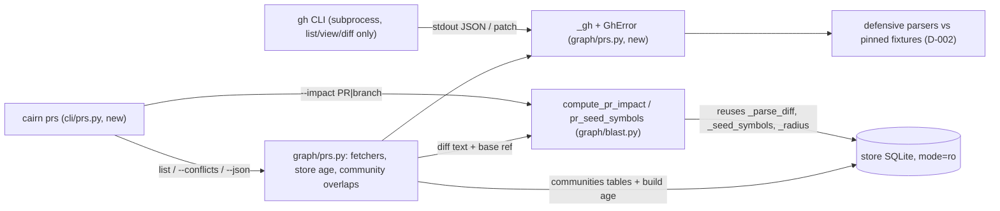

# Tech Spec: pr-tooling

**Spec**: [spec.md](spec.md) | **Created**: 2026-10-04
**Every file/symbol citation below must come verbatim from [survey.md](survey.md)
or a grep run in this session — never from memory.**

## Architecture

One read-only command over two existing substrates: the gh CLI (new
integration — survey S5: no `"gh"` anywhere in `src/cairn`) and the blast
diff→symbols→radius pipeline (survey S2/S3: DONE). A new graph module owns
the gh boundary (subprocess wrapper, defensive JSON parsing, store age,
community reads); `src/cairn/graph/blast.py` gains a public entry point that
accepts a PR diff *text* instead of running local git; a thin CLI module
renders. The store is opened read-only; nothing writes, ever (FR-006).

## Solution

### Chosen approach

- **FR-001**: `fetch_open_prs` in `src/cairn/graph/prs.py` runs
  `gh pr list --json number,title,headRefName,author,state,statusCheckRollup,reviewDecision`
  (field list pinned verbatim in survey supporting evidence) over the
  workspace's remote; `cli/prs.py` renders the six columns.
- **FR-002**: every gh failure raises `GhError` carrying gh's own stderr
  (absent binary → install/auth guidance); the CLI assembles the full report
  before rendering, so a failure anywhere prints exactly one error and no
  partial section (D-001, D-007).
- **FR-003**: `--impact PR|branch` resolves the PR via `gh pr view`, fetches
  the diff via `gh pr diff`, and feeds *text + base ref* into new
  `compute_pr_impact` in `src/cairn/graph/blast.py`, which reuses
  `_parse_diff` (survey S2), `_seed_symbols` (seeds + the unindexed
  separation the survey pins to the `_changed_files` tuple return),
  `_radius` (the `impact_analysis` depth-cap engine, survey S3), and
  `_annotate_radius` unchanged. Deleted PR files are listed, never seeded
  (the same rule `compute_blast` applies).
- **FR-004**: `community_overlaps` in `src/cairn/graph/prs.py` maps each
  PR's seed symbol ids through `symbol_communities` to community labels and
  ranks pairs by shared-community count; absent/empty tables degrade to an
  omitted section plus a `cairn communities` hint (D-005).
- **FR-005**: `--json` emits `{"store": …, "prs": […], "impact": …|null,
  "conflicts": …|null}` — the full payload of whichever sections were
  requested.
- **FR-006**: store opened via `get_db(db, read_only=True)` (mode=ro URI);
  the PR path never calls `refresh_for_query`, whose default `repair=None`
  auto-repairs drifted files — a store write (session read of
  `src/cairn/graph/watcher.py:58-82`); gh is invoked only with the fixed
  list/view/diff argument forms (D-001, D-007).
- **FR-007**: `store_build_age` in `src/cairn/graph/prs.py` reads the newest
  `build_runs.started_at` — the same source the status resource's
  `last_build_age` uses (survey S7) — and every impact output carries a
  `Store: local index (built <age>)` line (D-004).
- **NFR-001**: gh runs as a subprocess with a fixed argv list, `shell=False`
  by construction; no tokens are read or logged — gh's own config owns auth.
- **NFR-003**: `compute_pr_impact` reaches the graph through the same
  `_radius` call `compute_blast` uses — `impact_analysis` with
  `max_depth=10, limit=500, use_index=False` (session read of
  `src/cairn/graph/blast.py:270-297`) — so the depth caps and per-invocation
  cost profile are inherited, not re-specified.
- **NFR-004**: non-zero gh exits surface as `GhError(stderr)`, rendered by
  the CLI as a `ClickException` — clean exit, gh's message, no traceback.

### Alternatives rejected

| Alternative | Why rejected |
|-------------|--------------|
| Direct GitHub API client (instead of gh) | spec.md Assumptions pins gh as the only surface; a client adds a runtime dep (C-03) and token handling NFR-001 forbids |
| Reuse `compute_blast` as-is for `--impact` | it diffs *local* git (the checkout may not have the PR branch — survey supporting evidence) and its `refresh_for_query` default auto-repairs the store — a write, violating FR-006 |
| Diff a locally checked-out PR branch with `git diff` | same survey constraint: the local checkout may not have the PR branch |
| Build communities on the fly in `--conflicts` | spec.md Scope puts building in symbol-communities; FR-004 says consume, never build |
| All logic in `cli/prs.py` | C-04 forbids eager `cairn.cli` imports in test modules; graph-layer logic must be testable without importing the CLI package (rationale-nodes precedent: graph module + thin command) |

## Impact analysis

Additive-only to existing code; the change surfaces are new symbols plus one
import line.

- `src/cairn/graph/blast.py` gains public `compute_pr_impact` and
  `pr_seed_symbols` beside `compute_blast`; the existing public surface —
  `compute_blast`, `render_blast`, `BlastBaseError` — is untouched, so its
  importers keep working byte-for-byte. Real importers (grep this session):
  `src/cairn/cli/__init__.py:7` (`from .blast import blast`),
  `src/cairn/cli/review.py:10` (`BlastBaseError`),
  `src/cairn/cli/blast.py:11` (`BlastBaseError, compute_blast,
  render_blast`), `src/cairn/review/engine.py:9` (`compute_blast,
  render_blast`). None touches the private helpers.
- Graph tool, this session: `get_callers("compute_blast")` → 1 direct caller
  (the CLI command module). `get_callers("_seed_symbols")` precise →
  in-file only (`compute_blast`); the same query fuzzy returned 41 rows —
  name-collision noise from unrelated test helpers (`_seed_max_corpus`,
  `_seeded_fts_conn`), the AGENTS.md precise-vs-fuzzy caveat; precise is
  ground truth, so the biggest touched symbol's real blast radius is one
  in-file caller.
- **No default flips**: no existing flag, keyword default, or return shape
  changes — the two new entry points take new arguments (`diff_text`,
  `base_ref`) and the pipeline helpers are called with their existing
  signatures. The tech brief's test-tree pin sweep (flag pins / exact-count
  pins / exact-traffic pins) therefore does not trigger; existing suites
  (`python3 -m pytest tests/ -q -k "blast and not infra"`, survey S2 verify)
  are the regression guard.
- `src/cairn/cli/__init__.py`: one `from . import prs` line (survey S6
  registration convention). No MCP tools change (CLI-only command).
- `--conflicts` reads `communities` / `symbol_communities`, which do not
  exist on stores until symbol-communities lands (survey S4 TODO) — reads
  are guarded; absence is the designed path, not a defect.

## Quality, threats, and rollback

| Requirement | Design consequence / threat mitigation | Rollback or verification |
|-------------|----------------------------------------|--------------------------|
| NFR-001 security | Fixed argv forms only (`pr list`, `pr view <n>`, `pr diff <n>`, `--json` flags); no `shell=True`; the PR/branch argument is shape-validated (digits, optional `#`, or a branch name not starting with `-`) so it cannot masquerade as a gh flag; no token is read, logged, or passed | Verify: the wrapper accepts no caller-supplied argv beyond the pinned forms; `grep -rn '"gh"' src/cairn --include="*.py"` shows the single wrapper |
| NFR-003 performance | Impact traversal rides `_radius` → `impact_analysis(max_depth=10, limit=500)` — the exact caps `compute_blast` uses; `--conflicts` never traverses (seeds + SQL joins only) | Verify: `python3 -m pytest tests/ -q -k "blast and not infra"` stays green; per-PR impact cost ≤ `cairn blast --base` |
| NFR-004 reliability | `GhError` carries gh's stderr verbatim (network/auth/rate-limit all land there); subprocess `timeout` bounds hangs; missing binary gets install/auth guidance | Verify: fixture tests for non-zero exit, `FileNotFoundError`, and timeout paths |
| FR-006 read-only | `get_db(db, read_only=True)` (precedent `src/cairn/cli/pack.py:37`, session grep); no `refresh_for_query` call anywhere in the PR path; gh restricted to list/view/diff | Verify: fixture-store test asserts the DB file is unchanged after a full run |
| Threat: gh JSON as untrusted input | Defensive parsing (D-002): unknown fields ignored, missing required fields fail closed with the gh version; rendered as text only | Residual: gh's own auth posture; acceptable — gh is the spec-pinned boundary |
| Threat: argument injection via branch names | Shape validation above; branch names are passed as a single argv element after the `pr view` subcommand | Residual: gh's own flag parsing; a `-`-prefixed name is rejected before the subprocess |

Rollback: revert the branch. The feature persists nothing — no schema change,
no migration, no new tables (community tables belong to symbol-communities),
no config keys — so rollback is code-only.

## Code guide

### gh wrapper, parsers, and fixtures (`src/cairn/graph/prs.py` — new)
- Touches: new module; subprocess precedent `src/cairn/mcp_server/lifecycle.py:116`
  `r = subprocess.run(` (survey S5); survey confirms no gh usage exists
  (`grep -rn '"gh"' src/cairn --include="*.py"` — no match).
- Approach: `_gh(repo, args)` → stdout text; `GhError` on non-zero exit
  (stderr), missing binary, or timeout; `fetch_open_prs` / `fetch_pr_view` /
  `fetch_pr_diff` compose it with the pinned gh calls; defensive record
  parsing per D-002 with fixtures under `tests/fixtures/gh/`.
- Verify before implementing: `grep -rn '"gh"' src/cairn --include="*.py"`
  (still no match); `gh --version` on this machine (survey supporting
  evidence).
- Pitfalls: C-04 — never patch the global `subprocess.Popen`; tests monkeypatch
  the `_gh` seam instead. `text=True, errors="replace"` like `_git` in
  `src/cairn/graph/blast.py:37`.

### PR impact pipeline (`src/cairn/graph/blast.py` — additions)
- Touches: `compute_pr_impact(conn, workspace, *, diff_text, base_ref,
  fuzzy, limit)` and `pr_seed_symbols(conn, workspace, diff_text)` beside
  `compute_blast`; reuse `_parse_diff` (survey S2), `_seed_symbols`,
  `_radius`, `_annotate_radius`.
- Approach: parse the gh diff text → build the `changed` entries with the
  repo id resolved per D-003 → seeds + unindexed → radius (capped) →
  annotate; result dict mirrors `compute_blast`'s shape with
  `basis={"kind": "pr", "base": …}`; no `refresh_for_query` call (D-007).
- Verify before implementing: `python3 -m pytest tests/ -q -k "blast and not
  infra"` (survey S2 verify) green before and after.
- Pitfalls: `compute_blast` auto-repairs via `refresh_for_query` — copying
  its body wholesale would import a store write into a read-only command;
  `gh pr diff` output is a unified git diff, so `_parse_diff` consumes it
  unchanged.

### Store-age line (`src/cairn/graph/prs.py`)
- Touches: `store_build_age(conn)`; source pinned by survey S7:
  `SELECT started_at FROM build_runs ORDER BY started_at DESC LIMIT 1`
  (session grep `src/cairn/mcp_server/_server_core.py:398`), age formatted
  like `_build_age_str` (`:282`).
- Approach: guarded read — missing table or no rows → `None` → the line says
  the store was never built; rendered in both text and JSON output.
- Verify before implementing: `grep -n "last_build_age" src/cairn/mcp_server/_server_core.py | head -3`
  (survey S7 verify).
- Pitfalls: do not import from `cairn.mcp_server` (layering — the status
  resource's docstring says the surfaces must not import CLI code; the
  reverse holds too) — re-express the 3-line read in the graph layer (D-004).

### Community consumption (`src/cairn/graph/prs.py`)
- Touches: `community_overlaps(conn, per_pr_seeds)`; tables per
  symbol-communities tech-spec D-004: `communities(id, label, size)` +
  `symbol_communities(community_id, symbol_id, structural_degree)`.
- Approach: map seed symbol ids → community ids → labels; rank pairs by
  shared-label count, tie-break by PR numbers; guarded reads —
  `sqlite3.Error` or zero rows → graceful-absent payload (D-005).
- Verify before implementing: `sqlite3 "$STORE_DB" "SELECT COUNT(*) FROM
  communities"` (survey S4 verify — 0 until that spec lands).
- Pitfalls: consume, never build — read-path tests create the tables from
  that spec's pinned DDL in fixture stores only; nothing here writes them.

### CLI command (`src/cairn/cli/prs.py` — new, one import in `src/cairn/cli/__init__.py`)
- Touches: `@main.command(name="prs")` with `--db`, `--impact`, `--conflicts`,
  `--json`; registration by import side effect (survey S6, precedent
  `src/cairn/cli/grep.py:11` `@main.command(name="grep")`).
- Approach: fetch/compute everything first, render last (FR-002 no partial
  output); `GhError` and `BlastBaseError` → `ClickException`; store opened
  with `get_db(db, read_only=True)` (precedent `src/cairn/cli/pack.py:37`,
  session grep).
- Verify before implementing: `cairn --help` (survey S6 verify);
  `cairn prs --help` exits non-zero before the command exists (survey S1
  verify).
- Pitfalls: `compute_blast`'s CLI uses explicit `add_command` in
  `src/cairn/cli/__init__.py:7-9` — follow the newer import-side-effect
  convention instead (survey S6); `--impact` and `--conflicts` are
  independent flags, both may be requested.

## References

- [research.md](research.md): skip marker — no open questions at Stage 0; no
  external candidates to cite.
- [specs/symbol-communities/spec.md](../symbol-communities/spec.md) FR-001
  and its tech-spec D-004: the `communities` / `symbol_communities` tables
  this spec consumes (survey S4).
- Survey supporting evidence: the pinned gh invocations and the
  `_changed_files` tuple-return note backing the unindexed listing.

## Decisions

### D-001: Single gh subprocess wrapper, list/view/diff argv only
- **Context**: gh is a new integration (survey S5); FR-002 and NFR-001/004
  demand clean failures, subprocess-only invocation, and gh's own messages.
- **Decision**: one `_gh(repo, args)` helper in `src/cairn/graph/prs.py` —
  `subprocess.run(["gh", *args], cwd=repo, capture_output=True, text=True,
  errors="replace", timeout=30)`; raises `GhError(stderr or guidance)` on
  non-zero exit, `FileNotFoundError` (install/auth guidance), or timeout.
  Callers pass only the pinned forms: `pr list --json …`,
  `pr view <n-or-branch> --json …`, `pr diff <n>`, and `--version` (used
  lazily, only to enrich a parse error).
- **Consequences**: every gh call is auditable in one function; no shell
  interpolation; a future gh surface means editing this one helper.

### D-002: gh JSON shapes pinned as committed fixtures, parsed defensively
- **Context**: spec risk — gh's JSON shape evolves; the survey pins the
  field lists verbatim but not the item shapes (e.g. `author` is an object,
  `statusCheckRollup` items vary by check type).
- **Decision**: `tests/fixtures/gh/pr_list.json` and
  `tests/fixtures/gh/pr_view.json` are committed snapshots of real gh
  output; parsers accept unknown fields silently, coerce `author` from
  either `{"login": …}` or a plain string, require `number:int`,
  `title:str`, `headRefName:str`, `statusCheckRollup:list`, and fail closed
  with a `GhError` naming the gh version (from `gh --version`, fetched only
  on the error path) when a required field is missing or mistyped.
  `statusCheckRollup` classifies to one of `pass|fail|pending|none`:
  item `conclusion`/`state` in a fail set → `fail`; any recognized
  non-success → `pending`; unrecognized item shapes are ignored, an empty
  rollup → `none` — the classification is conservative, never claiming
  `pass` when a shape is unrecognized.
- **Consequences**: a gh upgrade that moves these shapes fails a fixture
  test, not a user's terminal; the fixtures are the contract, and the
  parser is the only place that reads them.

### D-003: PR diff always from `gh pr diff`; base ref via `_resolve_base` with `origin/` fallback
- **Context**: FR-003 reuses the blast machinery, but the survey is explicit:
  the PR diff comes from `gh pr diff`, NOT local git — the local checkout
  may not have the PR branch; the base branch name comes from
  `gh pr view --json baseRefName`.
- **Decision**: `--impact` accepts `PR#` (digits, optional `#`) or a branch
  name that does not start with `-` (anything else is a usage error before
  any subprocess). `fetch_pr_view` returns `(number, head_ref, base_ref)`;
  `fetch_pr_diff` returns the patch text; `_parse_diff` consumes the text
  and `_resolve_base(repo, …)` resolves the base, tried as
  `<baseRefName>` first, then `origin/<baseRefName>`, surfacing
  `BlastBaseError`'s existing fetch guidance on failure. The changed
  entries' repo id is the `repos`-table row whose path is the workspace
  root (the gh cwd), falling back to the sole registered row; zero or
  ambiguous rows fail cleanly.
- **Consequences**: impact works from any checkout that has the store and
  network; a stale local `<baseRefName>` degrades to the `origin/` ref
  before erroring; multi-repo workspaces get impact for the workspace-root
  repo only (federation is out of scope per spec.md).

### D-004: Store-age line from `build_runs.started_at`, re-expressed in the graph layer
- **Context**: FR-007 requires impact output to name the store it reflects;
  survey S7 pins the precedent (`last_build_age` in the status resource)
  and asks tech-spec to pin which source.
- **Decision**: `store_build_age(conn)` in `src/cairn/graph/prs.py` runs the
  same 3-line read as `src/cairn/mcp_server/_server_core.py:395-401`
  (`SELECT started_at FROM build_runs ORDER BY started_at DESC LIMIT 1`,
  guarded against a missing table) and formats the age like
  `_build_age_str`; the text render prefixes every impact with
  `Store: local index (built <age>|never)` and the JSON payload carries it
  under `store`. No drift-repair scan, no freshness implication.
- **Consequences**: FR-007 is one guarded query with no cross-layer import
  (cli→mcp_server stays forbidden); the duplication of a trivial read is
  accepted over coupling the command to the MCP package.

### D-005: `--conflicts` consumes the symbol-communities tables read-only, graceful-absent
- **Context**: FR-004; the tables do not exist until symbol-communities
  lands (survey S4 TODO), and this spec must never build them.
- **Decision**: `community_overlaps` reads
  `communities(id, label, size)` + `symbol_communities(community_id,
  symbol_id, structural_degree)` (shapes per symbol-communities tech-spec
  D-004), joins each PR's seed symbol ids to labels, and ranks pairs by
  shared-label count (tie-break by PR numbers). Any `sqlite3.Error` or an
  empty table yields the graceful payload: section omitted from text,
  `"hint": "community tables absent — run cairn communities"` in JSON.
  Pair rank rides seeds only — no radius traversal per PR.
- **Consequences**: the command is useful before, during, and after the
  dependency lands; if that spec renames columns, the guarded read degrades
  to the hint rather than a traceback, and the fixture-store tests are the
  tripwire.

### D-006: PR pipeline entries live in `graph/blast.py`; gh I/O stays in `graph/prs.py`
- **Context**: the pipeline helpers (`_parse_diff`, `_seed_symbols`,
  `_radius`, `_annotate_radius`) are module-private in
  `src/cairn/graph/blast.py`; importing privates across modules would
  couple two modules to internals, while a separate module would force
  exactly that.
- **Decision**: add `compute_pr_impact` and `pr_seed_symbols` beside
  `compute_blast` in `src/cairn/graph/blast.py` (they share the private
  pipeline in-file); `src/cairn/graph/prs.py` owns the gh boundary
  (wrapper, parsers, fetchers, store age, community reads) and calls only
  public blast entries.
- **Consequences**: zero private cross-module imports; `compute_blast` and
  its callers are untouched (see § Impact analysis); blast.py grows by two
  public functions and stays single-responsibility (diff → impact, whatever
  seeds the diff).

### D-007: Strict read-only — `mode=ro` store, no refresh, assemble-then-render
- **Context**: FR-006 (no store writes, no gh mutations) and FR-002 (no
  partial output) are command-level contracts; the default blast path
  writes (`refresh_for_query` auto-repair) and `get_db` without
  `read_only` applies migrations.
- **Decision**: the command opens the store with
  `get_db(db, read_only=True)`; the PR path never calls
  `refresh_for_query`; every fetch and computation completes before the
  first byte of output is written; failures surface as a single
  `ClickException`.
- **Consequences**: impact reflects the store as-is (honest, and exactly
  what FR-007 labels); a drifted file is not silently reindexed under the
  user — `cairn blast` remains the tool that repairs.

### D-008: `--impact` is single-PR per invocation; `--conflicts` ranks seeds, never traverses
- **Context**: NFR-003 bounds cost by the review-pack profile; fanning
  impact across every open PR, or traversing radius per PR inside
  `--conflicts`, would multiply the traversal by the open-PR count.
- **Decision**: `--impact` takes exactly one PR/branch argument;
  `--conflicts` fetches one diff per open PR (bounded by the open-PR count,
  plain subprocess calls) and ranks on seed-symbol → community joins only.
  Kept red flag: `--conflicts` is O(open PRs) gh calls in one invocation —
  accepted because triage repos hold single-digit open PRs and each call is
  a bounded `gh pr diff`.
- **Consequences**: per-invocation cost stays within the blast profile;
  batch-impact-everything remains a deliberate future flag, not an
  accident.

### D-009: Module-shape and scope rulings
- **Context**: T004's fetchers landed as src/cairn/graph/prs_fetch.py (concurrent-wave coordination ruling — prs.py was mid-creation) with its own test file and fixture snapshots; T008's surface mandate covers README.md.
- **Decision**: prs_fetch.py + tests/test_prs_fetch.py + tests/fixtures/gh/pr_view_fetch.json + pr_diff.patch join T004's Touches by ruling; README.md and docs/cli-reference.md join T008's.
- **Consequences**: scope audit clean; the fetchers stay a separate module (D-001's wrapper remains the sole subprocess boundary they import).
