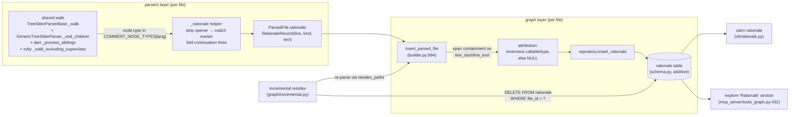

# Tech Spec: rationale-nodes

**Spec**: [spec.md](spec.md) | **Created**: 2026-10-04
**Every file/symbol citation below must come verbatim from [survey.md](survey.md)
or a grep run in this session — never from memory.**

## Architecture

The feature rides the existing pipeline end to end: comment nodes already
flow through every parser's recursive walk but fall through `_visit`
unmatched (survey S3); a per-language comment-node map turns them into
`RationaleRecord`s on `ParsedFile` (the same dataclass that already carries
symbols/edges/imports, survey S4). Persistence joins the centralized
repository layer (survey S5) inside `insert_parsed_file` — the one function
both the full build (`_insert_results`, builder.py:201) and incremental
reindex (`reindex_paths`, incremental.py:216) call. Reads are one shared
query module consumed by the new CLI command (survey S9 wiring) and the
explore section append (survey S8 precedent).

## Solution

### Chosen approach

**Extraction (FR-001, FR-005, FR-006, FR-008).** A new
`src/cairn/parsers/_rationale.py` holds the single implementation: the
per-language comment-node map (D-001, verified empirically below), an
opener-stripping + marker-matching function (D-005), and the record
constructor. The shared walks call it when a node's type is in the current
language's map entry; extraction rides the existing CST walk — no second
pass (NFR-003). Unmapped language → empty map entry → zero records, no
error (FR-006; also the arm for plugin-registered languages, which have no
guaranteed comment node). Records land on a new `rationale` list on
`ParsedFile` (survey S4 gap).

**Attribution (FR-002).** Done once, builder-side, in `insert_parsed_file`
(builder.py:894 — the choke point survey's supporting evidence names): for
each record's line, pick the innermost callable-or-type symbol of that file
whose `line_start <= line <= line_end` (smallest span wins; the file-level
`module` symbol is excluded, see D-003). Store its id, else NULL. Symbol
rows already carry `line_start`/`line_end` (schema.py:36-48, survey
supporting evidence).

**Persistence (FR-001).** Additive `rationale` table
`(id, file_id, symbol_id NULL, line, kind, text)` in schema.py following
the documented additive-only pattern (survey S7: "plain CREATE TABLE IF NOT
EXISTS rides the idempotent executescript in _apply_schema with NO
MIGRATIONS entry"), inserted via a new `GraphRepository.insert_rationale`
beside `insert_symbols`/`insert_edges` (survey S5, repository.py:26/:49).

**Reads (FR-003, FR-004).** One read module `src/cairn/graph/rationale.py`
(records for symbol ids / file id, ordered by line) consumed by:
- a new `src/cairn/cli/rationale.py` click command `cairn rationale` with
  `--symbol`/`--file`, registered by one import line in
  `cli/__init__.py` (survey S9: import-side-effect wiring, grep.py:11
  precedent), and
- the explore tool (`mcp_server/tools_graph.py:432`), appending a
  "Rationale" section gated on rows, copied from the Tribal-memory section
  append (survey S8: tools_graph.py:602-603). No new MCP tool — the count
  stays fixed (FR-004), keeping `verify_tool_count` (server.py:156) green.

**Incremental (FR-007).** `DELETE FROM rationale WHERE file_id = ?` in
incremental.py beside the existing file-scoped deletes (survey S6:
incremental.py:100 edges, :157 symbols), ordered before the symbols delete
(nullable FK, no cascade — same ordering the embeddings_mv delete at
incremental.py:150 uses). Re-derive is free: `reindex_paths` already calls
`insert_parsed_file`, which persists the fresh parse's records.

**Verified per-language comment-node map (D-001 evidence).** Probed this
session with `.venv/bin/python` + `cairn.parsers._registry.get_parser`:
parsed a snippet per language containing top-level, block, and
inside-function comments, and printed the named node types spanning the
comment text:

| Language (registry key) | Comment node type(s) | Verified behavior |
|---|---|---|
| python | `comment` | one node per `#` line; docstrings are `string` nodes (not comments) |
| go | `comment` | line and block both `comment`; block spans lines as one node |
| rust | `line_comment`, `block_comment` | `///`/`//!` docs are `line_comment`; block is one node across lines |
| java | `line_comment`, `block_comment` | `/** ... */` javadoc is `block_comment`, single node |
| kotlin | `line_comment`, `multiline_comment` | kdoc is `multiline_comment`, single node |
| c | `comment` | line and block both `comment` |
| cpp | `comment` | line and block both `comment` |
| csharp | `comment` | `///` xml docs are `comment` |
| ruby | `comment` | one node per `#` line; `=begin/=end` is one `comment` node |
| swift | `comment`, `multiline_comment` | line = `comment`, block = `multiline_comment` |
| dart | `comment` | line and block both `comment` |
| objc | `comment` | line and block both `comment` |
| typescript | `comment` | `/** ... */` tsdoc is `comment` |
| tsx | `comment` | same as typescript |
| javascript | `comment` | line and block both `comment` |
| php | `comment` | `//`, `#`, `/* */` all `comment` (php_only grammar) |

All 16 built-in registry languages resolve; none takes the FR-006 arm
today. The arm exists for plugin-registered languages
(`cairn.parsers.v1` entry points, `_registry.py`) and future additions.

### Alternatives rejected

| Alternative | Why rejected |
|-------------|--------------|
| Per-parser comment handling (each of the 13 dedicated parsers extracts its own comments) | Spec risk names it: "extraction lives in the shared walk with the map consulted per language, not per parser copy" (spec.md); survey S3 locates the shared machinery |
| Parser-side attribution via the existing scope stacks | Scope stacks carry names, not spans (`base.py:98` `_scope` is `List[str]`); span containment is language-independent, so builder-side attribution is one implementation instead of per-parser logic — survey S4/S5 put file-scoped rows together at persist time |
| Regex/line-scan of source files instead of CST comment nodes | Would need a second pass over every file (violates NFR-003) and re-derives comment syntax per language; the CST already isolates comments from strings/docstrings (probed: python docstring is a `string` node) |
| New MCP tool `rationale_for` | FR-004 forbids it ("the MCP tool count shall not change") and `verify_tool_count` (server.py:156) plus test pins (`tests/test_graft_parity_map.py:579`, `tests/test_invariants.py:128`) enforce the count |
| Folding consecutive same-marker `#` lines across nodes (python/ruby) | Those are separate nodes (probed); cross-node folding needs lookahead state in the walk for two languages only — one record per node is the spec's pinned rule and covers the real multi-line case (block comments) |
| Capturing `TODO:`/`FIXME:` behind a flag | FR-008 excludes them outright; a flag would flip a default and widen the marker contract for no requirement |

## Impact analysis

Blast radius via the workspace graph (precise; fuzzy retry where empty):

- `ParsedFile` (base.py:80-91): 10 impacted symbols — 9 direct callers
  (depth 0), 1 at depth 1. Adding a defaulted `rationale` field is
  additive; all construction sites keep compiling. Affected test:
  `test_insert_parsed_file_persists_signals` (tests/test_signal_persistence.py:56).
- `insert_parsed_file` (builder.py:894): 0 precise within-repo callers —
  fuzzy retry shows the real callers: `_insert_results` (builder.py:201,
  full build) and `reindex_paths` (incremental.py:216, incremental), plus
  the test above. Both paths inherit rationale persistence with no
  signature change. Common-name caveat: `insert_parsed_file` is unique
  enough that fuzzy added no noise.
- `TreeSitterParserBase` / per-parser `_walk` (survey S3): the hoist
  deletes 11 byte-identical `_walk` definitions (c_family.py:61, csharp.py:52,
  go.py:39, kotlin.py:108, java.py:49, objc.py:72, php.py:73,
  python_parser.py:73, swift.py:66, ruby.py:44, typescript.py:98 —
  verified identical this session) and moves one hook into the base.
  `_walk` is called from dozens of `_visit` recursion sites (fuzzy caller
  scan hit the limit cap) — the signature `(self, node, source, pf)` must
  not change.
- `explore` (mcp_server/tools_graph.py:432): rendering-only change. Test
  pins on the output: `tests/test_explore_memory.py:102` and `:118` assert
  tribal section headers as substring checks, and the body-extraction
  helper (test_explore_memory.py:62-65, :120) slices after the
  `=== Tribal memory` header — appending the Rationale section AFTER the
  tribal section keeps every assertion green.
- Test-tree sweep for the decisions that could flip a default:
  - Exact-count pins on the MCP tool set: `verify_tool_count`
    (server.py:156-164, `_EXPECTED_TOOL_COUNT`), exercised by
    `tests/test_ingest_compat.py:240-242` and pinned in
    `tests/test_status_resource_health.py:7` ("25-tool contract"),
    `tests/test_graft_parity_map.py:579`
    (`test_mcp_tool_count_and_inventory_include_graph_surfaces`),
    `tests/test_invariants.py:128`. Our design adds no tool → these stay
    green; they are the guard FR-004 leans on.
  - Exact-traffic/shape pins: none found on explore's full output shape
    (grep `Tribal memory`/`explore` in tests/ shows only the substring and
    slice pins above).
  - Behavior pins (unaffected): `tests/test_cli_smoke.py:9`
    (`test_cli_help` — `cairn --help` exits 0; a new command is additive);
    `tests/ -k parser` (survey S3 verify) — comment extraction produces no
    new symbols/edges, so existing parser assertions hold;
    `tests/ -k "incremental and not infra"` (survey S6 verify) — the new
    DELETE rides the existing transaction before the symbols delete.
  - Construction pins: `ParsedFile(...)` kwargs constructions in
    tests/test_signal_persistence.py keep working (new field defaults to
    empty).

## Quality, threats, and rollback

| Requirement | Design consequence / threat mitigation | Rollback or verification |
|-------------|----------------------------------------|--------------------------|
| NFR-003 (performance) | Extraction rides the existing walk: one dict lookup per visited node (`node.type in map entry`), no second pass, no regex over file text; attribution is an in-memory scan of the file's own symbols at persist time | Compare build wall time on the cairn repo before/after (build summary phases, builder.py `_record_phase_ts`); parser + full test suite green |
| NFR-001 (security) | Not applicable: local index data only, no new surface (spec) — rationale reads go through the same local SQLite connection as grep/explore | No action; verify no new network/process surface in review |
| NFR-002 (privacy) | Not applicable: rationale text is repo content already on disk; nothing leaves the store (spec) | No action |
| NFR-004 (reliability) | Not applicable: additive table, rebuildable from source (spec). FR-006's no-fail arm means an unmapped language degrades to zero records, never a build failure — same per-file isolation the skipped/parse-error plumbing provides (builder.py:72/:283/:1262, survey supporting evidence) | Drop the table and the feature disappears; rebuild any store from source |
| NFR-005 (observability) | Not applicable: build summary MAY report rationale counts (spec) — count them from persist's return, no new signal required | Optional count in build summary |
| NFR-006 (accessibility) | Not applicable: no UI surface is touched (spec) | No action |

Persistence threat model (the feature's only new durable state): asset =
`rationale` rows; threat = orphaned rows after incremental delete (symbol
deleted, rationale row left) or FK violation on delete order; mitigation =
delete `rationale` by `file_id` before the symbols delete in the same
transaction (embeddings_mv precedent at incremental.py:150-153), nullable
`symbol_id`; residual risk = none beyond a rebuild. Rollback/recovery: the
table is additive and rebuildable — `DROP TABLE rationale` + re-derive from
source removes the feature cleanly (no MIGRATIONS entry to unwind, survey
S7).

## Code guide

### Extraction — comment map, marker matching, record construction
- Touches: new `src/cairn/parsers/_rationale.py`; `ParsedFile` in
  `src/cairn/parsers/base.py` (survey S4: dataclass with
  symbols/edges/imports lists); `TreeSitterParserBase` in
  `src/cairn/parsers/base.py` (survey S3: base.py:98, scope stacks + node
  helpers)
- Approach: `COMMENT_NODE_TYPES: dict[str, tuple[str, ...]]` with the
  D-001 table's entries; `extract_rationale(node, source)` strips the
  opener (D-005), matches `^(NOTE|WHY|HACK):`, folds continuation lines
  (D-004), returns a `RationaleRecord(line, kind, text)` or None;
  `ParsedFile.rationale` list appended by the walk hooks
- Verify before implementing: `python3 -m pytest tests/ -k parser -q`
  (survey S3 verify); re-run the session's per-language probe if the map
  is disputed
- Pitfalls: comment nodes are leaves — do not recurse into them; rust
  `line_comment` carries an anonymous `//` token child (probed) — match
  named types only; python/ruby multi-line `#` comments are separate
  nodes (no cross-node folding); ruby `=begin/=end` is a `comment` node
  whose text never matches the opener grammar (probed) — correct, not a
  bug

### Shared-walk hook
- Touches: `TreeSitterParserBase` (`src/cairn/parsers/base.py`) — new
  shared `_walk`; delete the 11 identical per-parser copies listed in the
  impact analysis; `GenericTreeSitterParser._visit_children`
  (`src/cairn/parsers/generic_tree_sitter.py:99`, survey S3:
  `_visit` at :51); `DartParser._process_siblings`
  (`src/cairn/parsers/dart.py:88`); `RubyParser._walk_excluding_superclass`
  (`src/cairn/parsers/ruby.py:121`)
- Approach: in each walk's child loop, check the child's type against the
  language's map entry before dispatching to `_visit`; unmapped/absent
  entry → skip silently (FR-006)
- Verify before implementing: `grep -n "def _walk" src/cairn/parsers/*.py`
  shows the 11 copies; `python3 -m pytest tests/ -k parser -q` green
  before and after
- Pitfalls: signature `(self, node, source, pf)` is load-bearing — dozens
  of `_visit` recursion sites call `_walk` (impact analysis above); dart's
  traversal is sibling-list based, not `_walk`-based — hook its loop, do
  not force it into the base shape

### Persistence + attribution
- Touches: `rationale` table in `src/cairn/graph/schema.py` (survey S7:
  additive pattern at :110-113, precedents :196 embeddings, :217
  embeddings_mv, :114 term_df); `GraphRepository` in
  `src/cairn/graph/repository.py` (survey S5: INSERT INTO symbols :26,
  INSERT INTO edges :49); `insert_parsed_file`
  (`src/cairn/graph/builder.py:894`)
- Approach: `insert_rationale(cur, rows)` beside the existing inserts;
  attribution inside `insert_parsed_file` where `sym_rows`/`in_file` are
  already built (builder.py:1024-1034 region, read this session) —
  innermost callable-or-type span containing the record line, module kind
  excluded (D-003)
- Verify before implementing: `grep -n "INTO symbols"
  src/cairn/graph/repository.py` (survey S5 verify);
  `sed -n '110,115p' src/cairn/graph/schema.py` (survey S7 verify)
- Pitfalls: the module symbol's row is appended AFTER the code symbols'
  rows (builder.py, read this session) — exclude `kind == 'module'` from
  candidates regardless of order; ids come from `_new_id()`

### Incremental delete
- Touches: `src/cairn/graph/incremental.py` (survey S6: DELETE FROM edges
  :100, DELETE FROM symbols :157)
- Approach: `DELETE FROM rationale WHERE file_id = ?` alongside the
  embeddings_mv delete (:150-153, before the symbols delete — nullable FK
  has no cascade)
- Verify before implementing: `python3 -m pytest tests/ -q -k "incremental
  and not infra"` (survey S6 verify)
- Pitfalls: `reindex_paths` (incremental.py:216) re-parses through
  `insert_parsed_file`, so re-derive needs no new code — only the delete
  is missing today

### Read surfaces — CLI and explore
- Touches: new `src/cairn/graph/rationale.py` (read helpers, ordered by
  line); new `src/cairn/cli/rationale.py` + one import line in
  `src/cairn/cli/__init__.py` (survey S9: :1-12 import side effects;
  grep.py:11 `@main.command(name="grep")` precedent);
  `src/cairn/mcp_server/tools_graph.py` explore (`:432`, section append
  precedent S8 :602-603)
- Approach: `cairn rationale --symbol QNAME [--db PATH] [--json]` and
  `--file PATH` filters; explore collects the matched seeds' symbol ids
  (`result["seeds"]`, read this session) and appends
  `=== Rationale (N) ===` after the Tribal memory section, gated on rows
- Verify before implementing: `cairn --help` (survey S9 verify);
  `grep -n "Tribal memory" src/cairn/mcp_server/tools_graph.py` (survey
  S8 verify)
- Pitfalls: MCP tool count is a pinned contract (server.py:156) — render
  inside explore, never register a tool; section goes after Tribal memory
  so `tests/test_explore_memory.py` header-slicing stays valid

## References

research.md: "not applicable — no open questions at Stage 0" — no external
references to carry. Empirical grounding for D-001/D-004/D-005 is this
session's tree-sitter probes (re-runnable per the commands in the
decisions).

## Decisions

### D-001: Per-language comment node map is the single source, verified empirically
- **Context**: survey S2 flags that comment node types per grammar are
  unmapped anywhere in the codebase; FR-001 scopes extraction to languages
  "with a mapped comment node type" and FR-006 makes unmapped a no-fail
  no-op.
- **Decision**: `COMMENT_NODE_TYPES` in `parsers/_rationale.py`, entries
  exactly the verified table above (16 built-in languages, all probed this
  session with `cairn.parsers._registry.get_parser` + tiny parses).
  Languages without a resolvable comment node (plugin languages, future
  additions) get no entry and take the FR-006 no-fail arm.
- **Consequences**: adding a language means adding one map entry (and
  probing it first); a grammar upgrade that renames a node type silently
  drops that language to zero records — acceptable under FR-006, caught by
  the fixture tests pinning each mapped language.

### D-002: Extraction lives in the shared walk, not per-parser copies
- **Context**: survey S3 shows 13 dedicated parsers share
  `TreeSitterParserBase` but each defines an identical `_walk`; only rust
  + generic-tier languages use `GenericTreeSitterParser._visit`; the spec
  pins "extraction lives in the shared walk ... not per parser copy".
- **Decision**: hoist `_walk` (byte-identical in 11 parsers, verified this
  session) into `TreeSitterParserBase` with the comment check in its child
  loop; mirror the one-line check in the three other walk loops that exist
  (`GenericTreeSitterParser._visit_children`, dart `_process_siblings`,
  ruby `_walk_excluding_superclass`). All four call the same
  `parsers/_rationale.py` helper — the red flag (four hook sites rather
  than one) is kept because dart's sibling-list traversal and ruby's
  superclass-excluding walk exist for parser-correctness reasons; forcing
  them into one shape is a riskier refactor than three extra one-line
  hooks.
- **Consequences**: deleting 11 duplicated `_walk` defs; the base `_walk`
  signature `(self, node, source, pf)` is frozen (dozens of `_visit`
  recursion sites); a parser that grows a fifth walk shape needs the
  one-line hook too.

### D-003: Attribution is builder-side span containment, module excluded
- **Context**: FR-002 requires the innermost enclosing callable or type by
  span; at parse time symbols have no ids yet, and `Symbol` carries
  `line_start`/`line_end` (schema.py:36-48, survey supporting evidence).
- **Decision**: `insert_parsed_file` assigns `symbol_id` per record by
  scanning that file's symbols: candidates are symbols whose
  `line_start <= line <= line_end` and whose kind is callable-or-type;
  innermost = smallest span; no candidate → NULL (file-level). The
  file-spanning `module` symbol (builder.py appends it per file) is
  excluded, or every file-level record would attach to it and NULL would
  be unreachable.
- **Consequences**: marker comments directly above a definition are
  file-attributed (spec risk, accepted — span containment only, pinned by
  fixtures); attribution is one language-independent implementation;
  changing the kind vocabulary requires revisiting the callable-or-type
  set.

### D-004: One record per comment node; continuation lines fold into text
- **Context**: spec risk — multi-line marker comments could duplicate
  records per line.
- **Decision**: exactly one `RationaleRecord` per comment node that
  matches a marker; newlines inside the node fold to single spaces in
  `text`. Block comments are single nodes across lines (probed: rust
  `block_comment` L3-4, java `block_comment` L1-3), so the real multi-line
  case folds naturally; python/ruby `#` lines are separate nodes (probed)
  and each stands alone — a non-marker continuation line produces no
  record.
- **Consequences**: no cross-node folding state in the walk; `line` is the
  node's start line; text length is unbounded (repo content, displayed
  truncated by readers if needed).

### D-005: Opener grammar and marker match
- **Context**: FR-001 says the marker counts "after the comment opener and
  optional whitespace"; openers differ per language and comment style
  (probed: `#`, `//`, `///`, `/*`, `/**`, `=begin`).
- **Decision**: text normalization = strip a leading run of `#` or `/`;
  for block nodes strip the leading `/*`/`/**` run, the trailing `*/`, and
  a leading `*` on each continuation line; collapse surrounding whitespace
  per line; then match `^(NOTE|WHY|HACK):` — kind stored lowercased
  (`note`/`why`/`hack`), text = the remainder trimmed. Doc-comments
  (`/// NOTE:`, `/** NOTE: */`) match like any comment when the marker
  follows the opener — they are comment nodes; docstrings are not (python
  docstrings are `string` nodes, probed — FR-005 needs no special case).
  `TODO:`/`FIXME:` fail the closed marker set (FR-008); ruby `=begin`
  blocks never match the opener grammar and yield nothing.
- **Consequences**: the marker set is closed by FR-001 — adding a marker
  is a spec change; a comment like `#NOTE: x` (no space) matches (opener
  strip then optional whitespace), which is the FR-001 reading.

### D-006: Additive table, persist at the insert_parsed_file choke point, delete rides file_id
- **Context**: survey S5/S6/S7 pin the persistence layer, the incremental
  delete shape, and the additive-table convention.
- **Decision**: `rationale(id TEXT PRIMARY KEY, file_id TEXT NOT NULL,
  symbol_id TEXT NULL REFERENCES symbols(id), line INTEGER NOT NULL, kind
  TEXT NOT NULL, text TEXT NOT NULL)` + indexes on `file_id` and
  `symbol_id`, plain `CREATE TABLE IF NOT EXISTS` (survey S7 pattern, no
  MIGRATIONS entry); rows inserted in `insert_parsed_file` via
  `GraphRepository.insert_rationale`; incremental reindex adds
  `DELETE FROM rationale WHERE file_id = ?` before the symbols delete
  (nullable FK, no cascade — embeddings_mv ordering precedent at
  incremental.py:150).
- **Consequences**: both full build and incremental re-derive flow through
  one persist site (`_insert_results` builder.py:201 and `reindex_paths`
  incremental.py:216 both call `insert_parsed_file`); rollback is
  `DROP TABLE`; the table is rebuildable from source.

### D-007: One read module, two surfaces; explore section appends after Tribal memory
- **Context**: FR-003 needs a CLI; FR-004 needs explore surfacing with a
  fixed tool count; survey S8/S9 provide the precedents.
- **Decision**: `graph/rationale.py` exposes records-for-symbol-ids and
  records-for-file (ordered by line); `cli/rationale.py` renders them with
  kind tags; the explore tool appends `=== Rationale (N) ===` only when
  the matched seeds have records, positioned after the Tribal memory
  section so the existing header-slice assertions in
  `tests/test_explore_memory.py` stay valid.
- **Consequences**: no new MCP tool (`verify_tool_count`, server.py:156,
  untouched); the read module is the single place a future consumer (e.g.
  pack) would call.

### D-008: Docstrings excluded structurally, not by filter
- **Context**: FR-005 forbids docstring-derived records.
- **Decision**: no code path special-cases docstrings — python
  docstrings parse as `string` nodes, never as the mapped comment node
  types (probed this session), so the extraction scan cannot see them.
  Fixture tests pin that a `"""NOTE: ..."""` docstring produces zero
  records.
- **Consequences**: if a future grammar emits docstrings as comment nodes,
  FR-005 breaks loudly in fixtures rather than silently in the field.

### D-012: Delivery rulings
- **Context**: T009 documented `docs/cli-reference.md` (its Touches list named README/CHANGELOG; the payload scoped cli-reference); the clean sweep flags marker-word strings inside rationale TEST FIXTURES; one CLI test parsed `result.output` where the repo hygiene rule requires `result.stdout`.
- **Decision**: docs/cli-reference.md joins T009's scope by ruling; the fixture marker strings are adjudicated as legitimate test data (the feature's own subject matter), not debug debris; the test fixed to result.stdout per the hygiene rule.
- **Consequences**: scope and hygiene gates clean; fixtures keep their markers.
