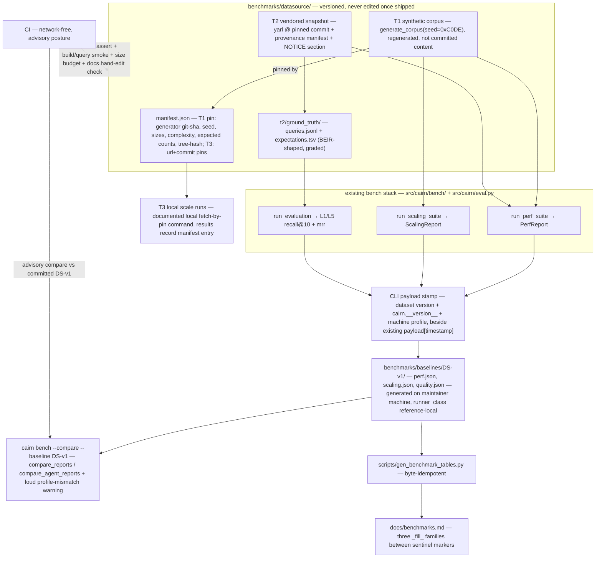

# Tech Spec: benchmark-datasource

**Spec**: [spec.md](spec.md) | **Created**: 2026-08-16
**Every file/symbol citation below must come verbatim from [survey.md](survey.md)
or a grep run in this session — never from memory.**

## Architecture

The datasource is a new versioned tree (`benchmarks/datasource/`) that pins what the
existing bench stack runs against, plus a committed baselines tree
(`benchmarks/baselines/DS-v1/`) that pins what comparisons resolve against. Nothing
in `src/cairn/bench/` changes semantics: `generate_corpus`, `run_perf_suite`,
`run_scaling_suite`, and `run_evaluation` keep their contracts; the spec adds a
manifest layer around them (T1/T3 pins), vendored content plus ground truth under
them (T2), a stamp on their emitted payloads, a `--baseline` resolution path in
`cli/bench.py`, and a generator that turns committed baselines into the
`docs/benchmarks.md` tables. CI gains four content checks and swaps its rolling
`actions/cache` baseline (key `bench-baseline-v1-${{ github.run_id }}`, always
misses — survey FR-001) for the committed DS-v1 artifacts, keeping the advisory
posture (bench_compare.py THRESHOLD=0.25, never exits non-zero — survey CI step
list).

## Solution

### Chosen approach

One datasource package, three tiers, one stamp, one compare path, one docs generator.

**Datasource tree** (`benchmarks/datasource/`, absent today — survey FR-002: "NO
benchmarks/ dir"):

- `manifest.json` — T1 section: generator git-sha, seed (`DEFAULT_SEED = 0xC0DE`),
  sizes, complexity, expected counts (`corpus_stats` → `{"files","lines","bytes"}`),
  and the tree-hash; T3 section: ≥2 `{name, url, commit}` pins (FR-001, FR-006).
  Today no manifest concept exists in `src/cairn` (survey FR-001: `grep -rn
  "manifest" src/cairn --include="*.py"` → 0 matches).
- `t2/` — vendored yarl source export at a pinned commit, `provenance.json`
  (upstream repo, commit, license), NOTICE attribution, and `t2/ground_truth/`
  (FR-002, FR-003). T1 content itself stays generated-not-committed; CI
  regenerates it from the manifest and asserts the hash (AC2).

**Ground truth** — BEIR-shaped pair under `t2/ground_truth/`: `queries.jsonl`
(`query_id`, level L1|L5, kind definition|callers|impact|flow|knowledge, text,
rationale) + `expectations.tsv` (`query_id  symbol_id  grade`, grade 1 =
must-return, 2 = primary target; `symbol_id` is `file#symbol` identity — research
RQ4 synthesis). ≥50 L1 + ≥20 L5 entries, hand-verified, rationale citing the
snapshot (FR-003). `src/cairn/eval.py` gains a loader for this schema; graded
matching keeps recall@10 over grade≥1 and ranks grade-2 first for MRR. A new
`scripts/verify_ground_truth.py` builds a fresh graph (+ knowledge bundle for L5)
from `t2/` and re-verifies every expectation, naming stale entries (AC5). The
existing `tests/eval/queries.yaml` (40 queries = 30 L1 + 10 L5, keys
`corpus/expect/query` — survey FR-003) remains a test fixture, untouched.

**Stamping + baselines + compare** — a `stamp` step in `cli/bench.py` beside the
existing `payload["timestamp"] = datetime.now(timezone.utc).isoformat()` lines
(cli/bench.py:122/157) adds `dataset {name, version, tree-hash, t3-entry?}`,
`cairn_version` (`__version__` = "0.11.0", src/cairn/__init__.py:2), and
`machine_profile {arch, cpu, cpu_count, os, runner_class}` — the fields
`_report_versions` already proves are collectable (cli/system.py:1329 returns
`cairn/python/platform/sqlite/db_schema_user_version`). Baselines are pyperf-style
self-describing JSONs committed under `benchmarks/baselines/DS-v1/` (perf,
scaling, quality), generated on the maintainer's machine
(`runner_class reference-local`). `cairn bench --compare --baseline <DS-version>`
resolves that directory, renders a dataset-version header, and warns loudly on
machine-profile mismatch (AC1); the diff itself reuses `compare_reports` /
`compare_agent_reports` unchanged (FR-004).

**Docs generation** — `scripts/gen_benchmark_tables.py` replaces the three
`_fill_` families in `docs/benchmarks.md` (lines 60-61 retrieval-quality, 109-117
perf, 143-146 scaling — 47 `_fill_` occurrences, survey FR-005) between new
sentinel markers, reading only committed baselines, with pinned number formatting
so regeneration is byte-idempotent; CI fails if regen changes bytes (hand-edit
detector, AC6).

**T3** — manifest pins + a documented local fetch-by-commit command; results
record the manifest entry through the same stamp; nothing T3 runs in CI (FR-006,
AC7).

**FR coverage map**

| FR | Solution element |
|----|------------------|
| FR-001 | `benchmarks/datasource/manifest.json` T1 section + stdlib sorted-manifest tree-hash + CI regenerate-and-assert step |
| FR-002 | vendored `benchmarks/datasource/t2/` (yarl @ pin) + `provenance.json` + NOTICE section + build+query smoke + CI size budget (T2 ≤ 3 MB, datasource ≤ 5 MB) |
| FR-003 | `t2/ground_truth/` BEIR-shaped pair + `eval.py` loader/matcher + `scripts/verify_ground_truth.py` |
| FR-004 | CLI-layer artifact stamp + `benchmarks/baselines/DS-v1/` + `--baseline <DS-version>` resolution + mismatch warning |
| FR-005 | `scripts/gen_benchmark_tables.py` + sentinel markers + byte-idempotent regen + CI hand-edit check |
| FR-006 | manifest T3 pins (≥2 scale points) + documented network-free local command + manifest-entry recording in results |

### Alternatives rejected

| Alternative | Why rejected |
|-------------|--------------|
| pytest-benchmark-style baseline storage (`.benchmarks/<machine-id>/<seq>_<commit>_<ts>.json` dirs) | brings pytest schema baggage; directory partitioning duplicates what a self-describing stamp does in one file (research.md options summary) |
| Codspeed-style hardware-independent metric | escapes cross-machine noise via simulation, not normalization — out of scope for advisory wall-clock timing (research RQ1/RQ5) |
| markupsafe as T2 (1.0 MB, BSD-3) | thinnest call depth of the top three candidates (research RQ2) |
| uvloop as T2 (1.8 MB, Apache-2.0) | deepest graph but Cython-dominant surface narrows the language mix; yarl wins depth+docstrings per byte (research RQ2) |
| httptools as T2 (0.16 MB, MIT) | likely too flat — risks failing the genuine-call-depth bar (research RQ2, med confidence) |
| orjson as T2 (6.2 MB, Apache-2.0) | over the 3 MB budget as-is; would need source-only trimming (research RQ2) |
| `git archive --format=tar <pin> \| sha256` as tree-hash | requires content already committed + same git version; bare-tree archives use current time and are NOT reproducible (research RQ3) |
| Nix/NAR-style store-path digest | most rigorous but far too much machinery for an equality assert (research RQ3) |
| Inline per-query JSONL ground truth (expectations + rationale in one file) | validator-friendly but diverges from IR-tool conventions (research options summary) |
| Rich pyperf-style stamp (+governor, turbo, power state) | more diagnostic signal, mostly unactionable on hosted CI (research options summary) |
| Cross-machine number normalization | no mainstream tool does this on shared runners (research RQ5); spec assumes advisory warn-only |
| Keep the rolling `actions/cache` baseline | key `bench-baseline-v1-${{ github.run_id }}` always misses, restore-keys rotate — regressions unattributable to cairn vs runner (survey FR-001; spec Why #1) |
| Extend `tests/eval/queries.yaml` in place (the 30/10 set) | FR-003 mandates hand-verified expectations with rationale under `benchmarks/datasource/t2/ground_truth/`; the current set targets generic codebase shapes, not pinned symbol identities (survey FR-003; spec Why #4) |
| Gate CI on timing | explicitly out of scope — advisory posture per spec Scope/Out |

## Impact analysis

Blast radius mapped with the workspace graph tools this session (`uv run cairn
callers` / `uv run cairn impact` from /Users/tanle/Projects/cairn). All changes
are additive: no existing signature changes, so nothing below *breaks*; the
counts say who must keep passing.

- **`generate_corpus`** (src/cairn/bench/corpus.py:22) — the largest blast radius:
  **20 impacted (9 direct callers + 11 at depth 1)**. Direct: 6 tests in
  tests/test_bench.py (`test_generates_n_files`, `test_deterministic` ×2 sites,
  `test_corpus_stats`, `test_generated_corpus_is_buildable`,
  `test_runs_and_returns_well_formed_report`), `_run_suite` in
  tests/test_agent_suite.py, `run_scaling_suite` (src/cairn/bench/scaling_suite.py:59),
  and `bench` (src/cairn/cli/bench.py:134). We do **not** modify it — FR-001 wraps
  it in a manifest; determinism ("a regenerated tree depends ONLY on (seed,
  n_files, complexity)" — survey FR-001) is the load-bearing property the hash
  check relies on.
- **`compare_reports`** (src/cairn/bench/report.py:148) — 6 impacted: 3 tests
  (`test_flags_regression`, `test_no_regression_under_threshold`,
  `test_missing_op_skipped` in tests/test_bench.py), `_render` in
  `.github/scripts/bench_compare.py:73`, `bench` in src/cairn/cli/bench.py:182,
  and `main` in bench_compare.py at depth 1. `--baseline` adds a *caller*, not a
  signature change; additive payload keys are safe because compare gates only on
  `median_ms` and skips ops missing from the baseline (survey FR-004).
- **`compare_agent_reports`** (src/cairn/bench/agent_suite.py:521) — same shape:
  3 tests in tests/test_agent_suite.py + `bench` (cli/bench.py:177).
- **`PerfReport`** — impact 3: `run_perf_suite` → `bench` +
  `test_runs_and_returns_well_formed_report`. **Stamping stays at the CLI payload
  layer** (beside cli/bench.py:122/157 `payload["timestamp"]`) precisely so
  `to_dict` shapes — and `test_json_payload_shape_stable` (tests/test_agent_suite.py,
  seen in this session's impact run) — are untouched.
- **Precise-vs-fuzzy caveat (common names)**: `to_dict` has **no precise callers**
  ("No callers found") because method dispatch doesn't resolve; fuzzy mode lists
  14 sites across src/cairn/bench/report.py, agent_suite.py, cli/bench.py, and
  tests. Likewise `bench` and `eval_cmd` show "No callers found" — they are Typer
  commands invoked from CI YAML (`cairn bench --suite perf ...` ci.yml:295-297)
  and tests/test_cli_smoke.py:42-44, not from Python. Empty precise results here
  mean "unresolved dispatch," never "unused."
- **eval harness** — tiny radius: `run_evaluation` → `eval_cmd`
  (src/cairn/cli/system.py:507) only; `load_eval_queries`, `evaluate_l1_query`,
  `evaluate_l5_query` are called only by `run_evaluation`. Adding a second loader
  + graded matching inside eval.py risks nothing outside `eval_cmd`'s output —
  but keep the report dict `{"L1": {"count","recall_at_10","mrr"}, "L5": {...}}`
  shape (eval.py:155-167) stable; the smoke test asserts "L1" in output (survey
  FR-003).
- **`.github/scripts/bench_compare.py`** — `_render` + `main` sit on the compare
  path (above). Additive stamp keys are safe; renaming existing payload keys is
  not. The advisory marker `<!-- cairn-bench-advisory -->` and never-exit-non-zero
  behavior must survive the CI rewiring.
- **CI bench job** (ci.yml:261-361) — steps 4 and 7 (cache restore, `cp
  bench-current.json bench-baseline.json`) are replaced by committed-baseline
  compare; step 5's command gains `--baseline DS-v1`; steps 6/8/9 (advisory
  comment, artifact upload, PR comment) stay.
- **Cross-repo**: `--baseline` is an additive CLI flag on an installed tool
  (PyPI, per scripts/install.sh in survey FR-006); no in-repo consumer outside
  those listed. Unknown — verify: no cross-repo dependency graph was queried
  (`cairn deps` not run this session).

## Code guide

### Datasource manifest + T1 tree-hash (FR-001)
- Touches: `generate_corpus` and `DEFAULT_SEED = 0xC0DE` in src/cairn/bench/corpus.py (:19, :22), `corpus_stats` (:99); new `benchmarks/datasource/manifest.json`; new hash helper (stdlib-only, in a new `src/cairn/bench/` module so CI and the validator share it); CI bench job (.github/workflows/ci.yml:261-321).
- Approach: manifest records generator git-sha + seed + sizes + complexity + expected counts + tree-hash. Tree-hash = Git-tree-shaped sorted-manifest digest — `sha256("<mode> <relpath>\0<sha256(content)>")` over sorted paths (research RQ3 note: stdlib-only, byte-identical on ubuntu/macOS). CI regenerates the corpus from manifest params into a temp root, asserts hash and counts.
- Verify before implementing: `grep -rn "manifest" src/cairn --include="*.py" | grep -v __pycache__` → no output today (survey FR-001 verify).
- Pitfalls: no generator-version tag is recorded anywhere today — the git-sha must come from the manifest, not the tree; `generate_corpus` writes `(repo / ".git").mkdir(exist_ok=True)  # scanner marker` (corpus.py:50-52) — the marker is an empty dir (no content bytes) but document whether it's inside the hashed set and keep it constant.

### T2 vendoring + provenance + NOTICE + budget (FR-002)
- Touches: new `benchmarks/datasource/t2/` tree + `t2/provenance.json`; NOTICE (82 lines, deps-only today); new CI size-budget check; smoke test.
- Approach: vendor the yarl *source export* at a pinned commit (GitHub's repo size includes .git history — the budget measures the vendored tree, research RQ2 preamble); provenance manifest {upstream repo, commit, license, export notes}; NOTICE gains a vendored-content section alongside the existing deps families; CI asserts `t2/` ≤ 3 MB and `benchmarks/datasource/` ≤ 5 MB. Smoke: build a graph over `t2/` and answer a known-symbol query (AC3).
- Verify before implementing: `ls /Users/tanle/Projects/cairn/benchmarks 2>/dev/null || echo "NO benchmarks/ dir"` → "NO benchmarks/ dir" (survey FR-002 verify).
- Pitfalls: pre-commit `check-added-large-files args: [--maxkb=500]` is per-file, not a tree budget (survey FR-002) — a dedicated check is still needed; the scanner-marker convention (corpus.py's `.git` marker) — git does not track empty dirs, so the smoke test should create the marker at runtime exactly as `generate_corpus` does, rather than committing one; keep NOTICE's existing scope intact (it ends with the bge-m3 note "cairn does not redistribute the model weights", NOTICE:79-82).

### Ground truth + eval harness (FR-003)
- Touches: src/cairn/eval.py — `load_eval_queries`, `evaluate_l1_query`, `evaluate_l5_query`, `run_evaluation` (public surface per survey); cli/system.py:491-527 `eval_cmd` (`--queries` flag already exists); new `benchmarks/datasource/t2/ground_truth/`; new `scripts/verify_ground_truth.py`.
- Approach: BEIR-shaped pair (queries.jsonl + graded expectations.tsv keyed by `file#symbol` ids); new loader in eval.py alongside the yaml one; matching prefers exact symbol identity with the existing substring rule (`exp.lower() in name.lower()`, eval.py:81) as fallback; validator builds a fresh graph (+ OKF bundle for L5) from `t2/` and re-verifies every expectation, naming stale entries.
- Verify before implementing: `.venv/bin/python -c "from cairn.eval import load_eval_queries; ..."` → total 40 L1 30 L5 10 (survey FR-003 verify) — the before-picture.
- Pitfalls: `run_evaluation` presumes a schema-initialized DB — a bare `sqlite3.connect(':memory:')` raises `sqlite3.OperationalError: no such table: symbols` (survey FR-003 verify); `evaluate_l5_query` returns 0.0/0.0 when bundle_root is missing (eval.py:97-98) — the validator must treat that as infrastructure error, not a stale entry; keep the `{"L1": {...}, "L5": {...}}` report shape (tests/test_cli_smoke.py:42-44 asserts "L1" in output); expectations record symbol identity, not incidental rank (spec risk mitigation) so resolution improvements don't rot the set.

### Artifact stamping + baselines + --baseline (FR-004)
- Touches: cli/bench.py:122/157 (`payload["timestamp"]` stamping neighborhood), cli/bench.py:205 (`sys.exit(2)  # CI signal: regressions found`), `compare_reports` (report.py:148-170), `compare_agent_reports` (agent_suite.py:521-545); `_report_versions` in cli/system.py:1329 as the version-stamp precedent; new `benchmarks/baselines/DS-v1/`.
- Approach: stamp function adds dataset version + `cairn.__version__` + machine profile {arch, cpu, cpu_count, os, runner_class} beside the existing timestamp at the CLI payload layer; baselines are self-describing JSONs (schema tag + stamp + the existing payload keys); `--baseline <DS-version>` resolves `benchmarks/baselines/<DS-version>/`, renders the dataset-version header, warns on profile mismatch, then feeds the existing compare functions.
- Verify before implementing: `grep -n "timestamp\|version\|profile\|baseline" src/cairn/cli/bench.py` → only timestamp lines + `--save/--compare/--threshold` today (survey FR-004 verify).
- Pitfalls: no `platform.machine()`/`os.cpu_count()` stamping exists in bench (cpu_count appears only in graph/builder.py:215 for worker sizing — survey) — both fields are net-new; stamp at the CLI layer, not in `to_dict`, to leave `test_json_payload_shape_stable` (tests/test_agent_suite.py) untouched; `--compare` exits 2 on regression and CI step 5 is continue-on-error — preserve that advisory posture; ops missing from the baseline are skipped by `compare_reports` — a DS-v1 baseline missing new ops degrades silently, so the generator should diff op-name sets loudly.

### Docs table generation (FR-005)
- Touches: docs/benchmarks.md lines 60-61 / 109-117 / 143-146 (the three `_fill_` families; headers at :58 `| corpus | samples | recall@10 | mrr |`, :107 `| operation | median (ms) | p95 (ms) | ops/sec |`, :141 `| files | symbols | build (s) | embed (s) | DB MB | resolve | peak MB |`); new `scripts/gen_benchmark_tables.py`; CI check.
- Approach: wrap each family in sentinel markers (none exist today — survey FR-005); generator reads committed baselines only; pinned decimal formatting + sorted rows ⇒ byte-idempotent; CI runs the generator and fails on `git diff --exit-code docs/benchmarks.md` (same spirit as the existing scripts/verify_no_code_change.py).
- Verify before implementing: `grep -c "_fill_" docs/benchmarks.md` → 15; `grep -o "_fill_" docs/benchmarks.md | wc -l` → 47 (survey FR-005 verify).
- Pitfalls: op rows must map 1:1 to `run_perf_suite` op names — `build (total)`, `build.<phase>`, `embed_all`, `build.derived.closure`, `find_definition, search_symbols, get_callers, get_callees, impact_analysis, impact_analysis_wide, semantic_search, explore` (survey supporting evidence) — the table today rows only the five query ops with 3 fills each; `OpTiming` dict keys are `name, median_ms, p50_ms, p95_ms, p99_ms, ops_per_sec` and `ScalingPoint` keys `n_files, symbols, build_s, embed_s, db_mb, resolve_rate, peak_mem_mb` (survey) — direct column mapping, no re-derivation; retrieval-quality rows come from the quality baseline (`run_evaluation` shape), replacing today's recorded 0.0/0.0 result (docs/benchmarks.md:63-64, survey FR-003); the "closure build 340 s at 1,000 files" claim is marked unknown — verify in survey — expect minutes-scale scaling runs when generating the scaling baseline.

### T3 manifest + local scale command (FR-006)
- Touches: `benchmarks/datasource/manifest.json` T3 section; docs for the local command; the FR-004 stamp (adds the manifest-entry ref to results).
- Approach: ≥2 entries `{name, url, commit, scale hint}`; documented local command fetches by pin and runs the bench with `--json --save`, stamping the manifest entry into the result; no CI involvement.
- Verify before implementing: `grep -rni "offline\|network" .github/workflows/ci.yml` → no output (survey FR-006 verify — the constraint is doctrine, not enforcement).
- Pitfalls: the only network fetch paths in src today are cli/upgrade.py:39-50 `_pypi_latest()` + `_reinstall` (survey FR-006) — do not add fetch code to `src/cairn`; codegraph's benchmark pins by clone date only and had to block CLI contamination with a PATH sanitize + PreToolUse hook (research RQ1) — pin enforcement must be in the command (checkout `<commit>`), not assumed.

### CI wiring
- Touches: .github/workflows/ci.yml bench job steps (1-9 per survey); new datasource-check steps.
- Approach: add (a) T1 regenerate+hash assert, (b) T2 build+query smoke, (c) size-budget check, (d) docs hand-edit check; replace steps 4+7 (cache restore/save) with committed-baseline compare in step 5's command; keep steps 6/8/9 unchanged.
- Verify before implementing: `grep -n "hash" .github/workflows/ci.yml` → only pip cache + `hashFiles('.pre-commit-config.yaml')` + actions/cache steps today (survey FR-001 verify).
- Pitfalls: every job installs from PyPI (`pip install -e .`, e.g. ci.yml:42/67/169/278) — new checks must not fetch anything (T3 stays local); CI runners will always mismatch `reference-local` — the warning is the feature (AC1), never a job failure.

## References

From research.md — each carries its source URL there:

- pytest-benchmark comparing/usage docs — committed-JSON baselines addressed by (machine-id, commit, timestamp); machine info recorded, never a normalization input. Model for warn-don't-adjust.
- pyperf README + system docs — metadata embedded in every result JSON; the stabilize-then-compare doctrine and the full machine-field list (governor, turbo, power).
- BEIR repo + `beir/datasets/data_loader.py` — checksum-pinned datasets; the canonical corpus/queries/qrels triple our ground truth stays shaped like.
- TREC Deep Learning 2019 qrels — the graded-relevance pitfall (grade 1 "Related" is NOT relevant) that motivates graded expectations.
- Codspeed CPU-instrument docs — the credible alternative (simulation) that confirms warn-don't-normalize is the mainstream choice on shared runners.
- codegraph repo — the 7-repo benchmark class cairn's dataset will be cited against (SC-4); pins by clone date only, so commit-pinning + machine stamping strictly dominates.
- Git Internals (tree objects) + `git-archive` docs — the sorted digest-of-digests design we mirror, and why the tool-based variant is weaker.
- Nix store-path manual — the rigorous-overkill precedent validating sorted serialization.
- GitHub API repo metadata (markupsafe, yarl, uvloop, httptools, orjson, httpie/cli, attrs) — the T2 candidate sizes/licenses/last-push data behind D-002.

## Decisions

### D-001: Baseline artifact format — pyperf-style self-describing JSON
- **Context**: FR-004 needs committed baseline artifacts that carry their own provenance; research offered pytest-benchmark-style storage vs pyperf-style single JSON.
- **Decision**: one self-describing JSON per suite under `benchmarks/baselines/DS-v1/` — schema tag + dataset/cairn-version/machine-profile stamp + the existing payload keys.
- **Consequences**: simplest thing to stamp a dataset version into (research options summary); no directory partitioning — mismatch handling is the warning path, not a storage rule; rules out pytest-benchmark tooling interop (not needed — CI advisory posture is bespoke already).

### D-002: T2 snapshot — yarl at a pinned commit
- **Context**: FR-002 needs ≤3 MB, permissively licensed, genuine call depth; four credible candidates researched.
- **Decision**: yarl (2,752 KB Apache-2.0, Python+Cython+C, very active) — best call depth + docstrings per byte (research RQ2).
- **Consequences**: closest to the 3 MB line — the size-budget CI check is load-bearing, not ceremony; docstrings feed the ≥20 L5 knowledge queries with rationale; markupsafe (thinnest depth), uvloop (Cython-dominant mix), httptools (too flat), orjson (over budget) rejected on research data.

### D-003: Tree-hash — stdlib sorted-manifest digest (Git-tree-shaped)
- **Context**: FR-001/AC2 needs a path-order-independent content hash assertable on any CI runner.
- **Decision**: pure-Python `sha256("<mode> <relpath>\0<sha256(content)>")` over sorted paths (research RQ3 note).
- **Consequences**: no git/nix dependency, byte-identical on ubuntu/macOS; reimplements a known-good design rather than importing machinery; rules out `git archive | sha256` (same-git-version + committed-content caveats) and Nix/NAR (overkill).

### D-004: Ground-truth schema — BEIR-triple adapted, graded
- **Context**: FR-003 needs a schema eval.py consumes with hand-verified expectations + rationale; binary expectations risk the MS MARCO grade-1 trap.
- **Decision**: `queries.jsonl` (with rationale, per FR-003) + `expectations.tsv` (`query_id/symbol_id/grade`, 1 = must-return, 2 = primary target); recall@10 over grade≥1, MRR ranks grade-2 first (research RQ4 synthesis).
- **Consequences**: standard IR shape, tool-friendly; rationale lives in queries.jsonl, not the qrel; inline-JSONL single-file rejected as convention-divergent.

### D-005: Machine-profile stamp — minimal + loud warn
- **Context**: RQ5 — which fields, and what to do on mismatch.
- **Decision**: `{arch, cpu, cpu_count, os, runner_class}` recorded in every artifact; mismatch prints a loud warning; no normalization ever (research RQ5: no mainstream tool normalizes on shared runners).
- **Consequences**: cheap, honest, matches pytest-benchmark's partition-and-warn model; rich pyperf fields (governor/turbo/power) rejected as unactionable on hosted CI; runner_class values include `reference-local` for maintainer-generated baselines (spec assumption).

### D-006: Stamping happens at the CLI payload layer, not in to_dict
- **Context**: survey shows stamping precedent is CLI-layer only (`payload["timestamp"]`, cli/bench.py:122/157); moving it into report objects would touch payload-shape tests.
- **Decision**: the stamp lands beside the existing timestamp stamping in cli/bench.py; report-layer `to_dict` shapes unchanged.
- **Consequences**: `test_json_payload_shape_stable` (tests/test_agent_suite.py) untouched; programmatic API callers don't get stamps — acceptable because baselines are produced exclusively via the `cairn bench --save` CLI path (maintainer machine, FR-004).

### D-007: CI compares against committed DS-v1, rolling cache retires
- **Context**: the rolling `actions/cache` baseline (key `bench-baseline-v1-${{ github.run_id }}`, always misses) makes regressions unattributable (spec Why #1).
- **Decision**: bench job step 5 gains `--baseline DS-v1`; cache restore/save steps drop; bench_compare.py advisory rendering, artifact upload, and PR comment stay byte-compatible.
- **Consequences**: comparisons become attributable (dataset version + cairn version + profile header, AC1); CI-vs-`reference-local` mismatch warnings become routine and advisory — by design, not noise to silence later.

### D-008: eval.py grows a second loader; the yaml set is not migrated
- **Context**: the existing `tests/eval/queries.yaml` (30 L1 + 10 L5, generic shapes) is test fixture data; FR-003 mandates a maintained set under `benchmarks/datasource/t2/ground_truth/`.
- **Decision**: new graded loader + identity-first matching in eval.py; `load_eval_queries` and its yaml stay as-is for back-compat.
- **Consequences**: zero migration risk to the existing smoke path (tests/test_cli_smoke.py:42-44); two query sources exist — the validator and docs generator consume only the datasource one.

### D-009: T3 stays entirely out of CI; pins enforced by the local command
- **Context**: network-free CI is doctrine (survey FR-006: no CI job asserts offline; the constraint lives in the spec).
- **Decision**: T3 = manifest pins + documented local fetch-by-commit command; results record the manifest entry via the D-006 stamp; no fetch code enters `src/cairn` (today `grep -rn "git clone" src/cairn --include="*.py"` → 0 matches).
- **Consequences**: 20k-file scale runs are maintainer-local by construction; codegraph's contamination lesson (research RQ1) says pin enforcement belongs in the command, so the documented command checks out the pinned commit explicitly.

### D-010: Dataset versions are immutable directories — deprecate, never edit
- **Context**: spec risk "dataset becomes a maintenance tax"; user constraint: dataset directories are versioned and never edited once shipped.
- **Decision**: `benchmarks/datasource/` and `benchmarks/baselines/<DS-version>/` are append-only; a changed hash/expectation set ships as DS-v2, never as an edit to DS-v1.
- **Consequences**: committed baselines stay meaningful forever; the ground-truth validator names stale entries rather than auto-rewriting them (spec risk mitigation); repo grows by version, bounded by the 5 MB datasource budget for T1/T2 (baselines are small JSONs).
