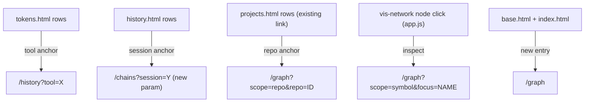

# Tech Spec: ui-dashboard-cross-links

**Spec**: [spec.md](spec.md) | **Created**: 2026-08-20
Every file/symbol citation below comes verbatim from [survey.md](survey.md)
or a grep run in this session — never from memory.

## Architecture

Links are plain server-round-trip anchors whose targets are the URL surfaces
that already exist (survey Q3, Q5) plus one new parameter (`/chains`
session, survey Q4). No client routing state; the browser's back button is
the breadcrumb (spec scope).

## Solution
### Chosen approach
Anchor-per-primary-entity in the row templates, with one server-side
addition: the chains route gains an optional `session` query param backed by
a filter in `get_session_chains` (survey Q4), so a history row's session id
links to `/chains?session=<id>`. Tokens rows link the tool name to
`/history?tool=<name>`. FR-003 adds only a regression test pinning the
existing projects→graph anchor (survey Q2). FR-006 adds `/graph` to
`base.html`'s nav and `index.html`'s list (survey Q6). FR-004 wires
vis-network's node-select to navigate to `/graph?scope=symbol&focus=<id>`
through the shared neighborhood path agreed with ui-dashboard-graph-nav.
FR-005 is a small link-builder (Jinja macro or context helper) that appends
the active window param when the source view has one.

### Alternatives rejected
| Alternative | Why rejected |
|-------------|--------------|
| Client-side pushState router | Duplicates server rendering state; snapshot architecture loses nothing to round-trips |
| Chains focus by client-side scroll/anchor only | Unbounded render for the legacy 'unknown' session (survey note); server filter is the bounded shape |
| Dedicated symbol-detail page | Explicitly out of spec scope (deferred) |

## Impact analysis
- `get_session_chains` gains an optional argument — sole caller today is the
  chains handler in `src/cairn/dashboard/app.py` (verified by grep this
  session); default behavior (no filter) unchanged, so `tests/test_dashboard_data.py`
  chains tests keep passing.
- `app.js` gains its first event listener (survey Q7); the graph block stays
  self-contained and guard-conditioned, so non-graph pages are unaffected.
- No schema, no recording pipeline, no write path — read-only discipline
  untouched.
- Cross-spec blast radius: the chains session filter is the seam
  traffic-scale's chain bounds must respect (both filter and bound compose
  in SQL); the neighborhood navigation path is co-owned with graph-nav.

## Code guide
### Chains session focus
- Touches: `src/cairn/dashboard/app.py` chains handler (survey Q4),
  `src/cairn/dashboard/data.py` `get_session_chains`
- Approach: read `session` query param like history does (survey Q3 pattern);
  pass into `get_session_chains(conn, session_id=...)`; filter applies
  server-side before grouping.
- Verify before implementing: `grep -n "get_session_chains" src/cairn/dashboard/app.py src/cairn/dashboard/data.py`
- Pitfalls: keep the no-param path byte-identical in output ordering; do not
  special-case 'unknown' in the view — it is a valid session value.

### Row anchors + nav completeness
- Touches: `src/cairn/dashboard/templates/tokens.html`, `history.html`,
  `base.html`, `index.html` (all verified present)
- Approach: wrap the primary entity cell content in an anchor building the
  target URL with the existing params (urlencode ids — research RQ1); add
  the /graph nav entries.
- Verify before implementing: `grep -rn "href" src/cairn/dashboard/templates/history.html` (expect none today, survey Q1)
- Pitfalls: anchor the tool name / session id only (spec's clutter
  mitigation); session ids are hex or 'unknown' — both URL-safe after
  encoding.

### Node inspect + link helper
- Touches: `src/cairn/dashboard/static/app.js` (survey Q7), shared macro or
  context helper for window-carrying URLs
- Approach: `network.on("selectNode")` → navigate to
  `/graph?scope=symbol&focus=<node-id>`; node ids are symbol names (app.js
  uses `n.id` as label — verified in survey Q7's block).
- Verify before implementing: `grep -n "new vis.Network" src/cairn/dashboard/static/app.js`
- Pitfalls: double-fire on drag-select — navigate on a discrete activation
  (e.g. double-click or an explicit button in the tooltip/menu), matching
  whatever affordance graph-nav standardizes; agree on ONE activation
  gesture across both specs.

### Tests
- Touches: `tests/test_dashboard_app.py`, `tests/test_dashboard_data.py`
- Approach: route tests asserting filtered chains by session; anchor-present
  assertions for tokens/history rows; projects→graph regression test (FR-003).
- Verify before implementing: `uv run pytest tests/test_dashboard_app.py -q`
- Pitfalls: seed stores must include a non-'unknown' session to assert the
  filter meaningfully.

## References
- URLSearchParams (query-param state): https://developer.mozilla.org/en-US/docs/Web/API/URLSearchParams
- vis-network events (node interaction): https://visjs.github.io/vis-network/docs/
- Grafana data links (row-links + context carry prior art): https://grafana.com/docs/grafana/latest/dashboards/build-dashboards/manage-dashboard-links/
- Related specs: ui-dashboard-graph-nav (shared neighborhood path),
  ui-dashboard-traffic-scale (window param + chain bounds).

## Decisions
### D-001: Links are plain anchors; no client router
- **Context**: server-rendered snapshot views; research RQ1.
- **Decision**: every cross-link is a normal GET navigation with query params.
- **Consequences**: browser back is the only breadcrumb (spec defers more);
  links are shareable/bookmarkable for free; no JS routing state to keep
  consistent with live-updates' fragment swaps.

### D-002: Chains gains a server-side session filter, not a client anchor
- **Context**: FR-002 needs a focused destination; survey Q4 shows no param.
- **Decision**: optional `session` param on /chains + filter in
  `get_session_chains`.
- **Consequences**: bounded server-side rendering even for the giant legacy
  'unknown' session; the param is the seam traffic-scale's bounds compose
  with; default route output unchanged.

### D-003: Inspect and expand share one neighborhood path and one gesture
- **Context**: spec assumption; graph-nav owns the expand counterpart.
- **Decision**: node activation (the gesture graph-nav standardizes) navigates
  to `scope=symbol&focus=<id>`; both specs consume the same traversal.
- **Consequences**: no duplicated neighborhood implementation; the gesture's
  exact form (double-click vs button) is graph-nav's D-decision to make and
  this spec conforms.

### D-004: Gesture split — doubleClick expands (graph-nav), inspect = select + button
- **Context**: graph-nav landed and standardized `doubleClick` as
  expand-in-place (its D-003; the vendored vis-network emits the event as
  `"doubleClick"`). Binding inspect-navigation to the same gesture would
  conflict on every node.
- **Decision**: inspect is a distinct affordance — single click selects the
  node (vis default), and an "inspect" action near the graph controls
  navigates to `/graph?scope=symbol&focus=<selected>` (full page load,
  browser-back returns). Both actions still share one neighborhood data
  path (`/graph/neighbors` server-side; navigation composes the existing
  symbol scope).
- **Consequences**: no gesture conflict; inspect's destination is a
  shareable URL; D-003's shared-path clause holds — no second neighborhood
  implementation is created.
