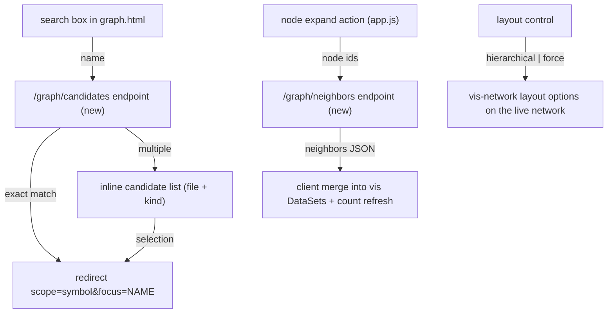

# Tech Spec: ui-dashboard-graph-nav

**Spec**: [spec.md](spec.md) | **Created**: 2026-08-20
Every file/symbol citation below comes verbatim from [survey.md](survey.md)
or a grep run in this session — never from memory.

## Architecture

Three additions over the existing snapshot graph: two small JSON endpoints
(candidates, neighbors) consumed by client-side wiring in
`src/cairn/dashboard/static/app.js`, plus a layout option toggle. The
symbol scope's existing 1-hop query (survey Q2) remains the
search-to-focus destination; expansion fetches neighbors incrementally.

## Solution
### Chosen approach
- **Candidates** (FR-001, FR-002): a data-layer query returning
  same-name symbols with file path and kind (survey Q4's missing surface;
  Q7's FTS is optional garnish, exact-name matching suffices for
  disambiguation); the endpoint caps results. Exact single match →
  immediate focus; multiple → the client shows candidates (research RQ1's
  inline list over silent pick).
- **Expansion** (FR-003, FR-005): a `neighbors(names, depth=1)` function
  in `src/cairn/viz/query.py` returning callers/callees per node with the
  same node/edge shape as existing scopes; the endpoint wraps it; the
  client merges into the DataSets and recomputes the shown counts (survey
  Q6's honest-count pattern extends to merged state). Multi-hop traversal
  is a shared walk extracted beside the impact scope's (survey Q5) — the
  first task decides 1-hop-per-action vs wired depth (D-002).
- **Layout** (FR-004): vis-network's built-in hierarchical option toggled
  on the live network instance (research RQ2), preserving camera state;
  the control persists its choice in the page URL param so focus
  round-trips survive.
- **Guard** (FR-006): both new endpoints open via `get_read_only_db` and
  join `tests/test_dashboard_readonly.py`.

### Alternatives rejected
| Alternative | Why rejected |
|-------------|--------------|
| datalist-native autocomplete | Candidate context (file/kind) renders unreliably across browsers (research RQ1) |
| Client-side scope re-query for expansion | Re-renders everything; loses the incremental contract and honest counts |
| Precomputed full-graph expand | Impossible under the query layer's caps; defeats LIMITs |
| Copying the impact walk into symbol scope | Two walks to maintain; cross-links' inspect consumes the same seam (its D-003) |

## Impact analysis
- `src/cairn/viz/query.py` gains a function (and possibly wires the dead
  `depth` param — survey Q3); its consumers are the dashboard's
  `get_graph` dispatch and the CLI viz commands (survey supporting
  evidence) — additive changes keep both compiling; the extraction task
  updates both callers atomically.
- `app.js` grows from one IIFE to three concerns (search, expand, layout)
  — structure: one IIFE each, all guard-conditioned on their DOM anchors,
  matching the existing file's encapsulation (survey Q1).
- No schema change; no write path; read-only discipline extends by
  construction (same `get_read_only_db` seam as every view).
- Cross-spec: cross-links' FR-004 inspect action navigates to
  `scope=symbol&focus` — produced by this spec's search focus; its D-003
  binds it to the same neighborhood function this spec adds.

## Code guide
### Candidates endpoint
- Touches: `src/cairn/dashboard/data.py` (query), `src/cairn/dashboard/app.py`
  (route), `src/cairn/dashboard/templates/graph.html` (search box)
- Approach: exact-name lookup returning (name, kind, file, repo) rows
  capped at N; route returns JSON; the search box submits on confirm.
- Verify before implementing: `grep -n "LIMIT 1" src/cairn/viz/query.py | head -3`
- Pitfalls: names with quotes/parens — parameterized SQL only; the
  cap must be visible in the response (truncated flag) to keep FR-005
  honest even here.

### Neighbors endpoint + traversal
- Touches: `src/cairn/viz/query.py` (survey Q2, Q3, Q5),
  `src/cairn/dashboard/app.py`, `src/cairn/dashboard/static/app.js`
- Approach: `neighbors(conn, names, depth=1)` reusing the callers/callees
  SQL of `get_symbol_graph` generalized to a name set; decide D-002
  (1-hop-per-action vs wired depth) first; client merges and updates
  counts from the merged DataSets.
- Verify before implementing: `sed -n 12,53p src/cairn/viz/query.py`
- Pitfalls: expansion of already-present nodes must not duplicate DataSet
  entries (id-keyed updates); edges whose endpoints are both new still
  render; per-fetch caps keep browser limits at bay.

### Layout toggle + guard
- Touches: `src/cairn/dashboard/static/app.js`, `graph.html`,
  `tests/test_dashboard_readonly.py`
- Approach: toggle sets the hierarchical option on the live network
  (restore camera); URL param persists the choice; guard suite gains both
  new endpoints.
- Verify before implementing: `grep -n "new vis.Network" src/cairn/dashboard/static/app.js`
- Pitfalls: edge direction — calls edges are source→target, so
  hierarchical top-down reads naturally; undirected-looking edges in other
  scopes may need direction=FALSE in the option set (verify per scope).

### Tests
- Touches: `tests/test_dashboard_data.py`, `tests/test_dashboard_app.py`,
  `tests/test_dashboard_readonly.py`
- Approach: candidates (exact/ambiguous/capped), neighbors (merge shape,
  no-duplicate ids, count honesty), readonly extension for both endpoints.
- Verify before implementing: `uv run pytest tests/test_dashboard_app.py -q`
- Pitfalls: seed graphs need same-name symbols in two files to exercise
  disambiguation meaningfully.

## References
- vis-network layout/options: https://visjs.github.io/vis-network/docs/
- Inline candidate disambiguation precedent: https://grafana.com/docs/grafana/latest/dashboards/build-dashboards/manage-dashboard-links/
- fetch-merge expansion pattern: https://developer.mozilla.org/en-US/docs/Web/API/Window/fetch
- Related specs: ui-dashboard-cross-links (D-003 shared neighborhood path),
  ui-dashboard (substrate + honest-count precedent).

## Decisions
### D-001: Candidates are an inline list with file/kind context
- **Context**: FR-002 forbids the arbitrary LIMIT-1 pick (survey Q4).
- **Decision**: server candidates endpoint + inline list; exact match
  short-circuits to focus.
- **Consequences**: one interaction for unambiguous names (SC-1); the
  arbitrary pick becomes unreachable from the dashboard; the underlying
  viz-layer LIMIT 1 remains for non-dashboard consumers (out of scope).

### D-002: Expansion granularity — decided at implementation open
- **Context**: dead depth param (survey Q3); 1-hop-per-action vs wired
  multi-hop.
- **Decision**: start with 1-hop-per-action using the generalized
  neighbors function; wire depth only if chained expansion proves too
  tedious in manual use.
- **Consequences**: no new traversal initially (survey Q5's walk stays
  impact-only); the neighbors function's signature takes depth from day
  one so wiring later is additive, not a rewrite.

### D-003: Layout toggle mutates the live network, camera preserved
- **Context**: FR-004's "without losing the current focus".
- **Decision**: toggle the hierarchical option on the existing network
  instance; save/restore camera state around the switch; persist via URL
  param.
- **Consequences**: no remount churn; focus survives; the toggle is purely
  client-side (no endpoint, no server state).
