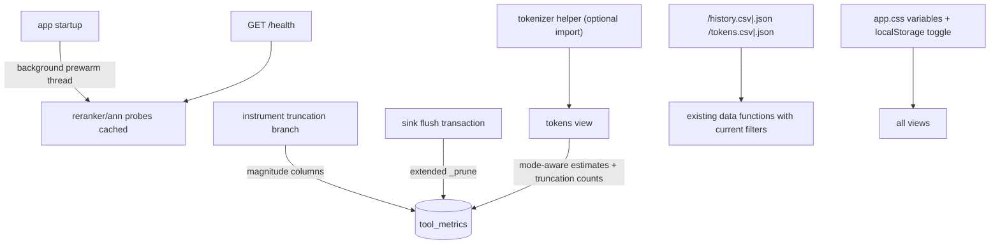

# Tech Spec: ui-dashboard-polish

**Spec**: [spec.md](spec.md) | **Created**: 2026-08-20
Every file/symbol citation below comes verbatim from [survey.md](survey.md)
or a grep run in this session — never from memory.

## Architecture

Six small refinements share one theme: extend existing seams (probes,
truncation chokepoint, prune transaction, data functions, CSS variables)
rather than adding subsystems. FR-007's split is structural: aging runs in
the sink, the dashboard only displays.

## Solution
### Chosen approach
- **Health prewarm** (FR-001): at app startup, a daemon thread runs the
  probe set once (reranker import, ann backend check, embedding counts)
  and caches results; `get_health` serves the cache and refreshes it on a
  slow cadence. First /health render stops paying the import (survey Q1).
- **Truncation magnitude** (FR-003, record side): the truncation branch in
  `src/cairn/mcp_server/metric_buffering.py` (survey Q3) additionally
  records original-vs-delivered chars per call via additive tool_metrics
  columns (migration seam, survey's schema precedent); the existing
  `truncate_result` event keeps firing unchanged (occurrence analytics),
  but magnitude now survives the events cap (survey supporting evidence).
- **Retention** (FR-004, FR-007): `_prune` in `src/cairn/telemetry/sink.py`
  (survey Q4) gains a tool_metrics deletion with env-configurable caps
  (rows, default generous; optional age bound), inside the same flush
  transaction; `get_health` reports the policy + current row count
  (survey Q7's dict shape).
- **Tokenizer mode** (FR-002): a helper probing for an available exact
  tokenizer (transformers behind the existing semantic extra — research
  RQ1; tiktoken declined as too provider-specific) with graceful
  chars÷4 fallback; the active mode is computed once per process and
  rendered wherever estimates appear; bench comparability is preserved by
  the visible label (survey Q2's shared-constant note).
- **Export** (FR-005): routes wrapping the existing data functions with
  the current filter params; CSV via Python's csv module (RFC 4180 —
  research RQ2), JSON via stdlib; Content-Disposition attachment.
- **Theme** (FR-006): dark palette as CSS variable overrides on a
  `[data-theme=dark]` selector; default follows prefers-color-scheme; a
  toggle persists the override in localStorage (research RQ3).

### Alternatives rejected
| Alternative | Why rejected |
|-------------|--------------|
| tiktoken as the exact mode | OpenAI-encoding exactness only; wrong audience default (research RQ1) |
| Truncation magnitude widened into the events payload | Still pruned at the 5000-row events cap; not per-call (survey Q3 gap) |
| Time-only retention | Spikes can still blow the store; row cap composes with age optionally |
| Separate aging worker/thread | New lifecycle to own; the flush transaction already exists (survey Q4) |
| Hand-rolled CSV join | Corrupts quoted fields (RFC 4180, research RQ2) |
| Cookie-based theme persistence | Server state for a per-browser preference; localStorage is the fit |

## Impact analysis
- `metric_buffering.instrument`'s truncation branch gains a column write —
  guarded best-effort like its event emission; `tests/test_metrics.py` /
  `tests/test_metrics_extensions.py` baselines must stay green.
- `sink._prune` extension: runs inside the existing flush transaction;
  failure isolation per-table already established (its try/except shape);
  `tests/test_telemetry.py` gains cap tests.
- `get_health` gains keys — additive; `health.html` renders them.
- Export routes read through the same data functions the views use, so
  parity is by construction (same function, same params).
- CSS: variables already exist (survey Q6) — no selector rewrites, only
  palette values + one attribute selector + toggle script.
- Cross-spec: traffic-scale's filters flow into export via the shared
  param-forwarding pattern; cli-usage-recording's source column surfaces
  in exports automatically (same SELECT).

## Code guide
### Health prewarm
- Touches: `src/cairn/dashboard/app.py` (startup hook),
  `src/cairn/dashboard/data.py` (probe cache)
- Approach: cache probe results with a timestamp; serve stale-while-
  revalidate on /health; prewarm thread at create_app time.
- Verify before implementing: `grep -n "reranker_available" src/cairn/dashboard/data.py`
- Pitfalls: never block create_app on the probes (background thread);
  cache must be per-process and cheap to invalidate on env change in tests.

### Truncation columns + prune extension
- Touches: `src/cairn/mcp_server/metric_buffering.py` (survey Q3),
  `src/cairn/graph/schema.py` (additive columns), `src/cairn/telemetry/sink.py`
  (survey Q4)
- Approach: record original/delivered chars on the truncation branch;
  _prune gains `DELETE FROM tool_metrics ... Beyond cap` with
  env-configurable limits; health reports policy + count.
- Verify before implementing: `grep -n "_MAX_EVENTS_ROWS\|_prune" src/cairn/telemetry/sink.py`
- Pitfalls: keep the MCP INSERT backward-compatible (columns nullable —
  pre-migration rows and non-truncated calls read as no-evidence, not
  zero); pruning key is id (monotonic) — matches the events pattern.

### Tokenizer helper + tokens view
- Touches: new helper module under `src/cairn/dashboard/` or `src/cairn/bench/`,
  `src/cairn/dashboard/data.py`, `src/cairn/dashboard/templates/tokens.html`
- Approach: `active_tokenizer_mode()` → exact-name or "heuristic(chars/4)";
  mode-aware estimate function wraps the existing constant path; label
  rendered near totals.
- Verify before implementing: `grep -n "CHARS_PER_TOKEN" src/cairn/dashboard/data.py`
- Pitfalls: tokenizer import failure must fall back silently to heuristic
  with the label honest; never make the semantic extra a required import.

### Export + theme
- Touches: `src/cairn/dashboard/app.py` (routes), `history.html`/
  `tokens.html` (buttons), `src/cairn/dashboard/static/app.css`,
  `base.html`
- Approach: export routes call the view's data function with the request's
  params; csv.writer to a StringIO response; theme toggle sets
  data-theme + localStorage, default from prefers-color-scheme.
- Verify before implementing: `grep -n "Route(" src/cairn/dashboard/app.py | tail -3`
- Pitfalls: export must not become a pagination-aware duplicate of list
  logic — reuse the data function and export the filtered slice it
  returns; filename should carry the view + filter hint.

### Tests
- Touches: `tests/test_dashboard_app.py`, `tests/test_dashboard_data.py`,
  `tests/test_metrics_extensions.py`, `tests/test_telemetry.py`
- Approach: timing test for first-health (cache warm); truncation column
  assertions on a truncating call; prune cap tests; mode-selection tests
  with the import mocked present/absent; export parity byte-comparison;
  theme persistence is a manual/browser check plus the toggle script's
  unit-testable apply function.
- Verify before implementing: `uv run pytest tests/test_dashboard_app.py tests/test_telemetry.py -q`
- Pitfalls: the hermetic suite must pin env for retention caps and mock
  the tokenizer import explicitly (hermetic-suite lesson).

## References
- tiktoken (exact-mode candidate evaluated): https://github.com/openai/tiktoken
- transformers tokenizers (optional-extra rider): https://huggingface.co/docs/transformers
- RFC 4180 (CSV correctness): https://datatracker.ietf.org/doc/html/rfc4180
- prefers-color-scheme + localStorage (theme): https://developer.mozilla.org/en-US/docs/Web/CSS/@media/prefers-color-scheme
- Related specs: ui-dashboard (substrate), ui-dashboard-traffic-scale
  (filters export honors), cli-usage-recording (source column surfaces).

## Decisions
### D-001: Exact tokenizer rides the existing semantic extra
- **Context**: FR-002's optional-dependency assumption; research RQ1.
- **Decision**: transformers-based counting when the semantic extra's
  tokenizer is importable; else the labeled chars÷4 heuristic.
- **Consequences**: no new required dependency; mode label keeps bench
  comparability interpretable; tiktoken rejected as provider-specific.

### D-002: Truncation magnitude lives in tool_metrics, not the event
- **Context**: FR-003's "durably"; events cap prunes occurrences (survey).
- **Decision**: per-call columns recorded on the truncation branch; the
  event keeps firing for occurrence analytics.
- **Consequences**: magnitude survives pruning and joins per-tool
  aggregates directly; two recordings exist but answer different
  questions (occurrence rate vs magnitude).

### D-003: Retention extends the flush-transaction prune, dashboard never ages
- **Context**: FR-004 + FR-007's split.
- **Decision**: configurable row cap (+ optional age) in sink._prune;
  health displays policy and size.
- **Consequences**: one transactional seam; the read-only guard holds by
  construction; generous default documented beside CAIRN_TELEMETRY.

### D-004: tool_metrics prune keys on (invoked_at, id) time-order, not id alone
- **Context**: This spec's Code-guide pitfall said "pruning key is id
  (monotonic)"; T003's implementation (2026-08-20) followed the code's
  established `_prune` pattern instead — time-ordered with id tiebreak —
  and the survey's own supporting evidence backs it ("_prune is
  time-ordered (ts/started_at) not id-ordered").
- **Decision**: `DELETE FROM tool_metrics WHERE id NOT IN (SELECT id ...
  ORDER BY invoked_at DESC, id DESC LIMIT ?)`; the pitfall's id-monotonic
  assumption is wrong for this table because `schema.copy_telemetry_tables`
  carries tool_metrics rows across whole-file rebuild swaps with fresh ids
  (id order stops being recency there), and the existing
  `idx_tool_metrics_invoked(invoked_at, id)` index directly backs the
  time-ordered DELETE.
- **Consequences**: recency survives rebuild swaps; the DELETE rides an
  existing index; events/build_runs pruning is untouched.

### D-005: warm-window /health serves cached-or-None probes; existing live-probe test adapts in T005
- **Context**: T001's implementation (2026-08-20) exposed an irreconcilable
  in the pre-existing `tests/test_dashboard_app.py::
  test_health_route_shows_size_freshness_backend_and_reranker`: it asserts
  the first /health (~20ms after create_app, mid-prewarm) renders
  live-computed probe verdicts, but FR-001 forbids the request from running
  the probes — no non-blocking design can put 2.55s-import probe values
  into a 20ms-old request.
- **Decision**: requests inside the warm window (≤`PROBE_WARM_WAIT_S` wait,
  in-flight prewarm) serve cached values or `None` probe keys (rendered
  "unavailable"); the test is adapted in T005 to assert against the served
  cache (or join the prewarm before asserting). Known failure on
  semantic-extra machines between T001 and T005; green on clean CI envs
  (no sentence_transformers → probes finish in ms → 50ms warm-wait serves
  the cache).
- **Consequences**: SC-1 holds (probes never land in a request; post-warm
  renders ~5ms); torch's C-level import holds the GIL ~2.5s, so requests
  overlapping the prewarm import are delivery-delayed regardless of
  caching — bounded to the warm window by design; T005 owns the test
  adaptation.

### D-006: exact-mode reaches chars-only rows via per-window calibration on stored summaries
- **Context**: FR-002/TC-002 require that counts "use" the exact tokenizer
  when available, but tool_metrics rows store char counts (req_chars/
  resp_chars), not text — an exact tokenizer cannot re-tokenize stored
  rows, and US2's AC scopes the label to the tokens view.
- **Decision** (T007, 2026-08-20): in heuristic mode estimates stay
  `chars // CHARS_PER_TOKEN` (bench comparability preserved). In exact
  mode the divisor is calibrated per render from the window's own data:
  sample ≤200 non-empty `args_summary` strings under the caller's exact
  WHERE terms, tokenize them via T006's helper, and use
  `round(total_chars / total_tokens)` (floored at 1). Samples under
  `CALIBRATION_MIN_CHARS = 1000` are treated as noise → divisor stays
  CHARS_PER_TOKEN and the rendered label says uncalibrated. The label
  always names the mode that produced the numbers, with the calibration
  basis stated ("calibrated at ~N chars/token from this window's stored
  summaries" / "uncalibrated ... heuristic divisor").
- **Consequences**: TC-002's "counts use it" holds literally (numbers
  follow the tokenizer-derived divisor); existing pinned chars//4 test
  assertions stay deterministic (their corpora sit under the noise floor);
  `list_history` rows share the same divisor; `get_tool_tokens` returns a
  `TokenEstimates(list)` subclass carrying `token_mode`/`calibrated`/
  `chars_per_token` so the landed export routes (which iterate the return
  as a list) keep working byte-identically. The history VIEW renders
  mode-aware numbers without its own label — US2's AC and TC-002/TC-003
  scope the label to the tokens view; a history-view label is a cosmetic
  follow-up, out of contract.

