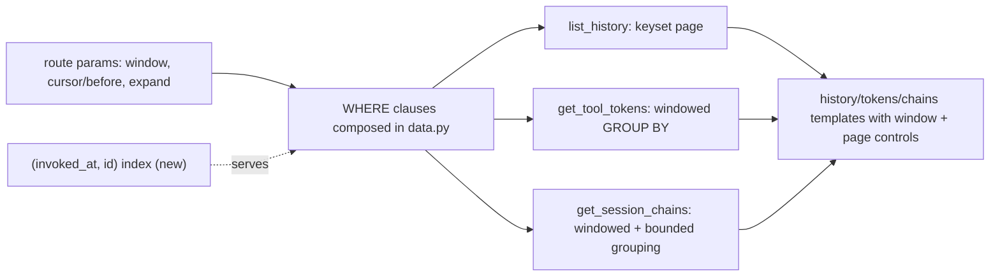

# Tech Spec: ui-dashboard-traffic-scale

**Spec**: [spec.md](spec.md) | **Created**: 2026-08-20
Every file/symbol citation below comes verbatim from [survey.md](survey.md)
or a grep run in this session — never from memory.

## Architecture

One shared window predicate and one pagination discipline flow into the
three existing data functions (survey Q1-Q3); a single new composite index
(survey Q4/Q5) serves both the range and the seek. All composition happens
in SQL WHERE clauses so cross-links' session filter joins the same
predicate list.

## Solution
### Chosen approach
- **Index** (FR-005 enabler): `CREATE INDEX IF NOT EXISTS
  idx_tool_metrics_invoked ON tool_metrics(invoked_at, id)` added to the
  idempotent executescript in `src/cairn/graph/schema.py` (survey Q5's
  seam) — existing DBs gain it on next connect, no MIGRATIONS entry needed.
- **History pagination** (FR-001, FR-006): keyset paging (research RQ1) —
  `ORDER BY invoked_at DESC, id DESC` with `WHERE (invoked_at, id) < (?, ?)`
  against a `before` cursor; bounded page size (default 50); the route
  accepts `window` and `before`, and returns the cursor for the next page.
  Page controls are prev/next links carrying current params (composes with
  cross-links' URL conventions).
- **Windows** (FR-002, FR-003): preset `window` param (24h/7d/30d/all) on
  history/tokens/chains; each data function takes an optional
  `since: float | None` and appends `invoked_at >= ?` to the same WHERE
  builder; tokens aggregates compute within it (survey Q2's query gains the
  predicate before GROUP BY).
- **Bounded chains** (FR-004): `get_session_chains` gains `max_chains` and
  `calls_per_chain_head` bounds — newest-activity chains first, each chain
  renders its newest head with an explicit "show more" param (`chain_expand`)
  fetching the tail; metadata carries shown/total counts (mirrors the graph
  view's truncated-count pattern already rendered in `graph.html`).
- **Budget proof** (FR-005): a test seeds a synthesized 10k-row store and
  asserts first-render wall time under 2s for the three traffic routes.

### Alternatives rejected
| Alternative | Why rejected |
|-------------|--------------|
| OFFSET/LIMIT pages | Unstable + slow at depth on a live-growing table; US1-AC2's no-repeat becomes luck (research RQ1) |
| Infinite scroll (client virtualization) | No shareable page URLs; composes poorly with cross-links and live-updates swaps |
| Materialized window aggregates | Write-side complexity the recording pipeline doesn't need at current volumes |
| Client-side chain truncation only | Leaves survey Q3's whole-table Python grouping — the actual bottleneck — in place |

## Impact analysis
- `list_history`, `get_tool_tokens`, `get_session_chains` gain optional
  keyword args (since/cursor/bounds); every caller is the dashboard app
  itself (verified by grep this session) — defaults preserve current
  output shape, so `tests/test_dashboard_data.py` and
  `tests/test_dashboard_app.py` baselines hold.
- Schema: one additive index via the established idempotent pattern — no
  migration risk beyond first-connect build time on large tables (10k rows
  is trivial); `cairn doctor` after merge per plan.
- Composability contracts OUT of this spec: cross-links' `/chains?session=`
  (its D-002) must compose with `window` + bounds in one WHERE; the shared
  window partial's param name (`window`) is the contract; live-updates'
  fragment re-fetch must preserve `before`/`window` params — already its
  FR-003's AC.
- Ordering change: history ORDER BY gains the `, id DESC` tie-break —
  strictly more deterministic; no consumer depends on tie order today.

## Code guide
### Index migration
- Touches: `src/cairn/graph/schema.py` (survey Q4, Q5)
- Approach: add the composite-index line beside the two existing
  tool_metrics indexes; no MIGRATIONS entry (CREATE IF NOT EXISTS rides
  the executescript).
- Verify before implementing: `grep -n "idx_tool_metrics" src/cairn/graph/schema.py`
- Pitfalls: keep column order (invoked_at, id) — reversed serves neither
  the range scan nor the seek (research RQ2).

### Keyset history
- Touches: `src/cairn/dashboard/data.py` `list_history` (survey Q1),
  `src/cairn/dashboard/app.py` history handler, `src/cairn/dashboard/templates/history.html`
- Approach: WHERE-builder list gains the cursor clause; return rows plus
  next-cursor; template renders prev/next links carrying tool/session/
  window/before.
- Verify before implementing: `sed -n 277,332p src/cairn/dashboard/data.py`
- Pitfalls: never leak a bare `LIMIT`-less path when all params absent —
  first page still bounded; preserve the app.py round-trip of filter
  inputs (live-updates depends on it).

### Windowed aggregates + bounded chains
- Touches: `src/cairn/dashboard/data.py` `get_tool_tokens` (survey Q2),
  `get_session_chains` (survey Q3), `src/cairn/dashboard/app.py` both
  handlers, shared window partial template
- Approach: `since` param → `invoked_at >= ?`; chains bounds cap chains
  and per-chain head, with shown/total in metadata; expand param fetches
  one chain's tail.
- Verify before implementing: `sed -n 335,445p src/cairn/dashboard/data.py`
- Pitfalls: the legacy all-'unknown' fixture (survey) must be the bound's
  first test case; keep NULL invoked_at rows out of windows (they predate
  windowing — render only under 'all').

### Budget test
- Touches: `tests/test_dashboard_data.py` (fixture + timing), the readonly
  suite joins for route-level budget (survey Q8)
- Approach: seed 10k rows across sessions; time first render of each
  traffic route; assert < 2s (SC-1); assert shown/total correctness for
  the bounded chain case (FR-004).
- Verify before implementing: `uv run pytest tests/test_dashboard_data.py -q`
- Pitfalls: timing assertions on CI runners are noisy — assert a generous
  multiple locally and the structural bound in CI (page size constant), or
  gate the strict-2s assertion behind a marked slow test.

## References
- Keyset pagination: https://use-the-index-luke.com/sql/paging/offset
- SQLite planner (composite index use): https://sqlite.org/queryplanner.html
- Truncation-with-counts dashboard precedent: https://grafana.com/docs/grafana/latest/dashboards/build-dashboards/best-practices/
- Related specs: ui-dashboard-cross-links (D-002 composes here),
  ui-dashboard-live-updates (param preservation), ui-dashboard (substrate).

## Decisions
### D-001: Keyset pagination, not OFFSET
- **Context**: FR-001 + US1-AC2 on a live-growing table.
- **Decision**: cursor on (invoked_at DESC, id DESC) via a `before` param.
- **Consequences**: stable pages under concurrent inserts; page URLs carry
  an opaque-ish cursor; the composite index is mandatory (D-002).

### D-002: One composite index serves windows and seeks
- **Context**: spec-confirmed unindexed invoked_at (survey Q4).
- **Decision**: `idx_tool_metrics_invoked ON tool_metrics(invoked_at, id)`
  via the idempotent executescript.
- **Consequences**: window presets and keyset seeks share one descent; tiny
  write cost per row; no partial-index complexity (research RQ2 option
  declined as unnecessary).

### D-003: Chains bound = newest-chains-first + per-chain head with expand
- **Context**: FR-004 with the all-'unknown' legacy shape as the first case.
- **Decision**: cap chains and per-chain head; explicit expand param fetches
  a chain's tail; shown/total counts rendered like the graph view's.
- **Consequences**: bounded render always; older chains reachable through
  paging the chain list; count honesty follows the graph view's precedent.
