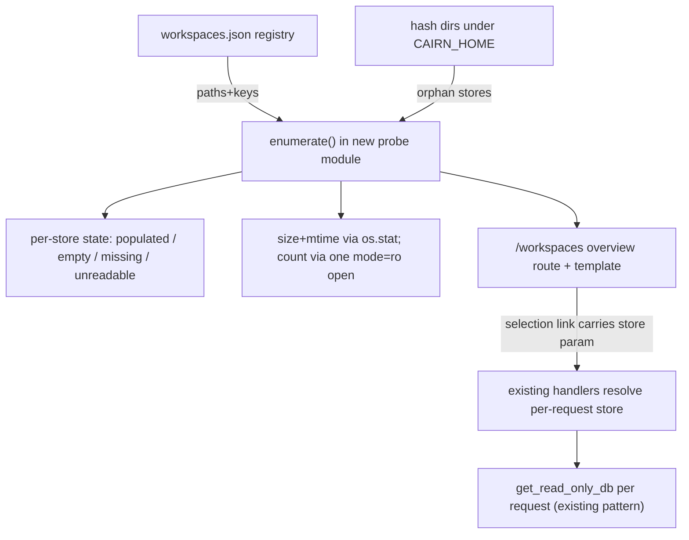

# Tech Spec: ui-dashboard-workspace-launcher

**Spec**: [spec.md](spec.md) | **Created**: 2026-08-20
Every file/symbol citation below comes verbatim from [survey.md](survey.md)
or a grep run in this session — never from memory.

## Architecture

The launcher adds one new module (enumeration + probing) and one route;
switching reuses the existing per-request read-only open pattern (survey
Q5) by resolving the store param inside handlers instead of closing over a
single launch path (survey Q4).

## Solution
### Chosen approach
- **Enumeration** (FR-001, FR-002): a pure function returning the union of
  registry entries and `^[0-9a-f]{16}$` store dirs under CAIRN_HOME
  (survey Q1, Q2), each with a state: `populated`, `empty` (no `.kg`),
  `missing` (registered path whose store dir is gone), `unreadable` (open
  failed). No writes, no re-registration — states are rendered, never
  repaired (FR-004).
- **Stats** (FR-001): size and freshness from `os.stat` on the `.kg` file
  (research RQ2 — free); last-indexed prefers `build_runs` newest
  `started_at` where an open is already justified; call count via one
  `SELECT COUNT(*) FROM tool_metrics` per store (survey Q6), all inside a
  bounded probe budget.
- **Switching** (FR-003): a `store` query param (the registry key or a
  safe resolved path) threaded through every existing view; handlers call
  the same `get_read_only_db` with the resolved per-request path; absent
  param = the launch store (backward compatible). The overview's rows link
  each store's dashboard.
- **Guard + budget** (FR-004, FR-005): the readonly suite gains a
  before/after hash of every fixture store's files across overview +
  switched-view interactions; the budget test synthesizes 200+ minimal
  stores (registry fixture + dirs) and times the overview render.

### Alternatives rejected
| Alternative | Why rejected |
|-------------|--------------|
| Rebuild/reconnect the app per selection | Restart-equivalent churn; unshareable state (research RQ3) |
| Path-segment routing per store (Datasette style) | Rewrites every route for one selection need |
| Background probe cache as v1 | Staleness complexity the spec holds as escalation, not default |
| Registry-only enumeration | Misses orphan store dirs — FR-002's missing-state case is real (proven leak history) |

## Impact analysis
- `create_app(db_path=...)` keeps its signature (survey Q4): the CLI path
  is untouched; the per-request resolution is an internal seam the
  handlers already invite (each calls `get_read_only_db(db_path)`).
- Knowledge-dir views (`/memory`, `/tasks`) resolve per workspace too —
  the selection must scope both the DB and the knowledge root consistently
  (`resolve_store`'s StorePaths gives both; survey Q1).
- Read-only discipline: no new write path exists anywhere in this design;
  the guard extension (Phase 3) is the proof, covering listed-but-never-
  opened stores (FR-004's "visited or listed").
- Cross-spec: none of the other six specs' surfaces change; the `store`
  param composes with traffic-scale's windows and cross-links' filters as
  just another query param each view forwards.

## Code guide
### Probe module
- Touches: new `src/cairn/dashboard/workspaces.py` (sibling of data.py)
- Approach: `enumerate_stores(cairn_home)` → list of dicts (key, path,
  state); `probe(store)` → size, mtime, last_indexed, call_count; bounded
  by a max-opens budget with a visible "counts unavailable" degradation.
- Verify before implementing: `python3 -c "import json; print(json.load(open('$HOME/.cairn/workspaces.json')))"`
- Pitfalls: never write the registry (guard test proves it); tolerate a
  registry that fails to parse (treat as empty + state note); CAIRN_HOME
  override must be honored (tests use it).

### Selection seam
- Touches: `src/cairn/dashboard/app.py` (all handlers), 
  `src/cairn/dashboard/templates/workspaces.html` (new)
- Approach: one `resolve_selected_store(request, default)` helper reading
  the store param against the enumeration (reject unknown keys with the
  missing-state page, not an error); handlers pass its result to
  `get_read_only_db` and the knowledge root.
- Verify before implementing: `grep -n "get_read_only_db" src/cairn/dashboard/app.py | wc -l`
- Pitfalls: param must be the registry key, not a raw path (no
  arbitrary-file-open vector); keep the launch default when absent so
  existing URLs and live-updates' re-fetch behave identically.

### Guard + budget tests
- Touches: `tests/test_dashboard_readonly.py`, new budget test
- Approach: hash store trees before/after all interactions; synthesize
  200+ stores under a tmp CAIRN_HOME; assert overview wall time < 2s
  (strict locally; structural open-budget assertion in CI).
- Verify before implementing: `uv run pytest tests/test_dashboard_readonly.py -q`
- Pitfalls: WAL sidecars — hash must include `-wal`/`-shm` if present and
  assert they are unchanged/absent afterwards.

## References
- SQLite URI read-only opens: https://sqlite.org/uri.html
- SQLite file format (what needs an open vs a stat): https://sqlite.org/fileformat.html
- Datasette multi-db prior art: https://docs.datasette.io/en/stable/custom_templates.html
- Related specs: ui-dashboard (substrate), ui-dashboard-traffic-scale /
  ui-dashboard-cross-links (params this must forward).

## Decisions
### D-001: Selection is an explicit URL param, default = launch store
- **Context**: FR-003 needs restart-free switching; survey Q4's closure.
- **Decision**: a `store` param (registry key) resolved per request inside
  handlers; absent param keeps today's behavior.
- **Consequences**: shareable/bookmarkable selections; no hidden server
  state; existing URLs and other specs' param forwarding unaffected.

### D-002: Enumerate registry ∪ store dirs with explicit states
- **Context**: FR-002; stale registrations and orphan dirs are proven
  shapes on this machine (survey Q2 note).
- **Decision**: union enumeration; states rendered, never repaired.
- **Consequences**: the overview is truthful about divergence; no write
  path exists; a future `cairn gc` (out of scope) could consume the same
  enumeration.

### D-003: stat-first probing; SQL opens only for counts, budgeted
- **Context**: FR-005's 200-store budget vs per-store open cost.
- **Decision**: size/freshness via os.stat; one bounded mode=ro open per
  store for the call count; cache-with-refresh only if the budget test
  fails.
- **Consequences**: probe cost is dominated by count opens and is capped;
  degraded columns are visible rather than silently stale.

### D-005: tokens.html imports the link macro with context
- **Context**: T006's store-carry routes every inter-view anchor through
  `_links.html`'s `url` macro, which reads `store_key` from the render
  context; tokens.html's plain `` cannot see it.
- **Decision**: tokens.html (the one file outside T006's pinned set) gains
  the `with context` import — one line, no other change.
- **Consequences**: the tokens page's tool anchors carry the selected
  store like every other view; plain imports remain fine for macros that
  take all inputs as arguments.

### D-006: First read-only visit to a WAL store may materialize empty sidecars
- **Context**: T007's guard found that SQLite's FIRST `mode=ro` open of a
  WAL-mode store creates a 0-byte `.kg-wal` and a 32KB zeroed `.kg-shm`
  (wal-index setup) that persist after close — any reader does this,
  including the dashboard's pre-existing views; the `.kg` bytes never
  change and revisits are byte-stable.
- **Decision**: accept and document. FR-004's byte-identical guarantee
  covers store CONTENT (the `.kg`); the guard tests seed rollback-journal
  stores (the readonly suite's own convention) to assert the strict
  no-new-files property, while real WAL stores' first-visit sidecar
  materialization is recorded here as SQLite-inherent reader behavior,
  not a dashboard write.
- **Consequences**: no change to the open strategy (mode=ro stays); a
  steady-state WAL guard could be added later if the sidecars ever prove
  problematic; the distinction is visible in the guard's docstring.
