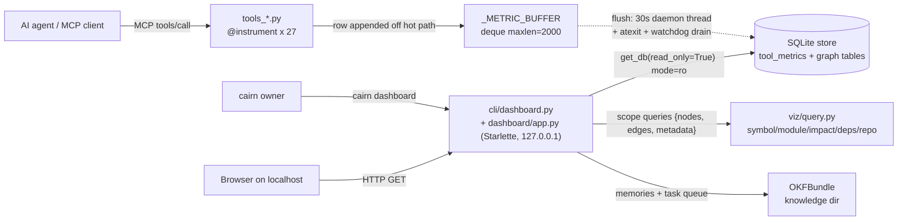

# Tech Spec: ui-dashboard

**Spec**: [spec.md](spec.md) | **Created**: 2026-08-20
**Every file/symbol citation below must come verbatim from [survey.md](survey.md)
or a grep run in this session — never from memory.**

Citation provenance shorthand: `[S:Qn]` = survey.md item Qn evidence;
`[R:RQn]` = research.md finding; `[G]` = grep/read output from this session
(pasted commands in § Impact analysis). A live-file signature that differs
from survey.md is flagged inline.

## Architecture



One paragraph: the feature has two halves that meet only at the SQLite store.
(1) **Recording** rides the existing MCP instrumentation path — every tool is
wrapped by `instrument` (27 `@instrument` decoration sites across
`tools_graph.py`, `tools_memory.py`, `tools_knowledge.py`, `tools_compass.py`
[G]); the wrapper already times calls and buffers a row into
`_METRIC_BUFFER: collections.deque = collections.deque(maxlen=2000)` in
`src/cairn/mcp_server/metric_buffering.py` [S:Q4, G], which is drained by the
shared telemetry sink thread + `atexit.register(_flush_all)` in
`src/cairn/telemetry/sink.py` [S:Q5, G] and by
`_drain_buffered_telemetry()` for the parent-death-watchdog exit path in
`src/cairn/mcp_server/server.py` [S:Q4-Q5, G]. We extend the recorded row
(request/response payload sizes + truncated arg summary), not the machinery.
(2) **Serving** is a new read-only Starlette app (Starlette/uvicorn/Jinja2 are
already installed as transitive deps of `mcp>=0.9.0` — pyproject.toml:
`"mcp>=0.9.0,<2.0.0",  # SSE/streamable-http + uvicorn/starlette are core deps
in mcp>=0.9` [S:Q6, G]; session check: `importlib.util.find_spec` → starlette
True, uvicorn True, jinja2 True, **fastapi False** [G]) launched by a new
`cairn dashboard` Click command, reading the same DB via
`get_db(..., read_only=True)` (URI `file:<path>?mode=ro`, cannot contend with
writers — `src/cairn/graph/schema.py` [S:Q11]) and graph scopes from
`src/cairn/viz/query.py` [S:Q3]. The dashboard never writes; the sole writer
remains the MCP server's buffered flush (FR-010).

## Solution

### Chosen approach

**A. `cairn dashboard` command + new `src/cairn/dashboard/` package** (FR-001,
FR-010). A Click command in a new `src/cairn/cli/dashboard.py` following the
existing registration pattern (`@main.command()` decorator side effects;
modules imported in `cli/__init__.py` [S:Q10, G]). Options: `--db` (default:
central store), `--port` (default **8765** — distinct from the SSE daemon's
`DEFAULT_PORT = 9876` in `src/cairn/mcp_server/lifecycle.py` [G]), `--host`
(default `127.0.0.1`, never `0.0.0.0`). It prints the URL (`click.echo`) and
runs a Starlette app under uvicorn. The app package:
`dashboard/app.py` (routes + app factory), `dashboard/data.py` (all SQL/view
assembly, pure functions taking a read-only conn), `dashboard/templates/`
(Jinja2), `dashboard/static/` (vendored `vis-network.min.js`, a small
`app.js`, `app.css`). Views are server-rendered HTML with plain form-GET
controls; manual refresh only (spec Out-of-scope defers live updates).

**B. View data layer** (`dashboard/data.py`), every function opens the DB via
`get_db(db_path, read_only=True)`:

- **Projects** (FR-002 / US1-AC1, AC2): one row per `repos` row [S:Q1];
  file/symbol/edge counts via joins through `files.repo_id` and
  `symbols.file_id`; last-indexed from `MAX(files.indexed_at)` /
  `repos.indexed_at`; embedding status from coverage of the `embeddings`
  table (`symbol_id`, `model` columns [S:Q2]) — embedded vs not + `DISTINCT
  model` where recorded.
- **Graph** (FR-003 / US2): route `/graph?repo=&scope=&focus=&depth=` calling
  the existing scope functions in `src/cairn/viz/query.py` [S:Q3]. Live
  signatures [G — survey Q3's parameter lists are stale; symbol names match]:
  `get_symbol_graph(conn, name, depth=1)`,
  `get_module_graph(conn, module)`, `get_impact_graph(conn, name, max_depth=3)`,
  `get_deps_graph(conn)`, `get_repo_graph(conn, repo, max_nodes=30)`. All
  return `{nodes, edges, metadata}` consumed by the renderers [S:Q3 supporting
  evidence]; the dashboard serializes that dict straight into vis-network
  DataSets. Default scope = module (spec risk mitigation; the scope functions
  already cap size via `LIMIT 50` / `max_nodes=30`).
- **History** (FR-005 / US3): `SELECT ... FROM tool_metrics ORDER BY
  invoked_at DESC` with `WHERE tool_name = ?` / `session_id = ?` filters from
  query params; each row also carries its estimated request/response tokens
  (US4-AC2 "inspect" satisfied at row level).
- **Tokens** (FR-006 / US4): per-tool aggregate
  `SUM(req_chars), SUM(resp_chars)` → `est_tokens = chars // CHARS_PER_TOKEN`
  with `CHARS_PER_TOKEN = 4` imported from `src/cairn/bench/agent_suite.py`
  [S:Q9] (`est_tokens=chars // CHARS_PER_TOKEN` [S:Q9]); ranked by total desc.
- **Chains** (FR-007 / US5): `GROUP BY session_id ORDER BY invoked_at`; a
  chain is split wherever two consecutive calls in a session are separated by
  more than `SESSION_GAP_S = 1800` (30 min, module constant — tunable, not an
  FR-pinned number). This gap rule is what keeps the shared SSE daemon's
  mixed clients presentable as separate chains.
- **Health** (FR-008 / US6): DB size via `os.stat(db_path).st_size`; index
  freshness from newest `build_runs.started_at` (age-stringed like
  `_build_age_str` in `_server_core.py` [G]); vector backend probes importing
  graph-layer helpers directly — `is_hash_fallback` /
  `ann_backend_enabled` / `index_exists` / `index_row_count` from
  `cairn.graph.embeddings` / `cairn.graph.ann_index` (the same probes
  `_health_block` uses [G]); reranker availability via `CAIRN_RERANK` +
  optional-import probe of `src/cairn/graph/reranker.py` (named in
  pyproject.toml's extras comment [G]; exact probe function:
  `reranker_available() -> bool` in `src/cairn/graph/reranker.py` [G —
  orchestrator session grep, pre-implementation]).
- **Memory + tasks** (FR-009 / US7): `OKFBundle(knowledge)` with
  `list_concepts(prefix=...)` (`src/cairn/okf/bundle.py` [G]) for recent
  memories (type + title from concept metadata), and
  `from ..llm.tasks import list_tasks` / `list_tasks(bundle, status=status,
  kind=kind)` for the queue by status (pattern from `src/cairn/cli/task.py`
  [S:Q8, G]).

**C. Recording extension** (FR-004, FR-011 / SC-2, SC-3). In
`src/cairn/mcp_server/metric_buffering.py` [S:Q4, G]. The record lifecycle
(unchanged machinery, extended row):

```mermaid
sequenceDiagram
    participant C as MCP client
    participant W as instrument wrapper
    participant B as _METRIC_BUFFER
    participant S as telemetry sink
    participant DB as tool_metrics
    C->>W: tools/call (kwargs)
    W->>W: run tool; duration + req_chars/resp_chars + args_summary
    W->>B: append row (no DB on hot path)
    W-->>C: result
    Note over B,S: every 30s tick, atexit, and parent-death watchdog
    S->>B: snapshot without clearing
    S->>DB: executemany INSERT (new columns)
    S->>B: popleft exactly the batch on commit success
```


1. `instrument`'s wrapper already holds `args`/`kwargs` and `result`; add:
   `req_chars = len(json.dumps(kwargs, default=str))` and
   `resp_chars = len(result) if isinstance(result, str) else len(str(result))`
   (the wrapper already branches on `isinstance(result, str)` for
   `_truncate_result` [G]). These are O(payload) string ops — microseconds —
   keeping SC-2's <5% budget trivially met (the DB write is already off the
   hot path in `_METRIC_BUFFER`).
2. `_log_metric` gains **optional trailing kwargs** `req_chars=None,
   resp_chars=None, args_summary=None` so existing positional test calls
   (`mb._log_metric("tool_a", 10.0, "ok")` in `tests/test_metrics.py` [G])
   stay green. `args_summary` is built in the wrapper: compact JSON of
   `kwargs`, redacted via `strip_private_data` and truncated (~200 chars) —
   mirroring the error_message redaction-at-write-chokepoint already in
   `_log_metric` [G] (spec assumption: summaries, not full payloads).
3. The buffered row tuple and the `INSERT INTO tool_metrics (...)` in
   `_flush_metrics` gain the three columns. Flush/shutdown behavior is
   untouched: snapshot-without-clear → executemany → commit → popleft, driven
   by the sink's 30s daemon + `atexit` + `_drain_buffered_telemetry` [S:Q5, G]
   — this is FR-011 / SC-3, already implemented for the existing columns.
4. Schema (`src/cairn/graph/schema.py` [S:Q1, G]): extend the
   `CREATE TABLE IF NOT EXISTS tool_metrics` with `req_chars INTEGER`,
   `resp_chars INTEGER`, `args_summary TEXT`; add matching named
   `ALTER TABLE tool_metrics ADD COLUMN ...` entries to the `MIGRATIONS = [`
   list (schema.py:393 [G]) following the existing idempotent pattern
   ("duplicate column" tolerance, schema.py:517 [G]); **and** extend
   `_TELEMETRY_TABLE_COLUMNS["tool_metrics"]` (schema.py:819 [G]) so
   `copy_telemetry_tables` carries the new columns across whole-file rebuild
   swaps — missing this is the silent-data-loss trap.
5. Session identity (FR-007 grouping): at the top of `run()` in
   `src/cairn/mcp_server/server.py` [S:Q4, G], add
   `os.environ.setdefault("CAIRN_SESSION", uuid4().hex[:12])`. Today
   `CAIRN_SESSION` has readers but **no writer** (`os.environ.get("CAIRN_SESSION",
   "unknown")` in `metric_buffering.py:221`, `telemetry/events.py:74`,
   `graph/builder.py:955` [G]) so every row lands as `unknown`. One id per
   server process == one MCP client session under stdio; under the shared SSE
   daemon the chains-view gap rule (B) splits mixed clients.

**FR coverage map**: FR-001→A, FR-002→B-projects, FR-003→B-graph, FR-004→C,
FR-005→B-history, FR-006→B-tokens, FR-007→C5+B-chains, FR-008→B-health,
FR-009→B-memory/tasks, FR-010→A+B (read-only conn everywhere; only the server
writes), FR-011→C3 (existing flush machinery).

### Alternatives rejected

| Alternative | Why rejected |
|-------------|--------------|
| FastAPI instead of Starlette | Adds a new runtime dep: FastAPI is not installed in the repo venv (find_spec False [G]); pyproject only guarantees uvicorn/starlette via `mcp` [S:Q6]; FastAPI is a Pydantic+Starlette superset layer [R:RQ1] a read-only form-GET dashboard doesn't need — violates the zero-new-deps constraint. |
| stdlib `http.server` + Jinja2 | Fastest cold start [R:RQ1] but "no async/WebSocket support without custom code" [R:RQ1]; hand-rolled routing/static/mime handling for 8 views is more code than Starlette routes on an already-installed framework. |
| Mermaid.js for the graph view | "does not natively support interactive pan and zoom" [R:RQ2] — directly fails FR-003/US2-AC1. |
| Cytoscape.js | Viable (CDN/single-file, built-in pan/zoom [R:RQ2]) but "becomes sluggish with graphs exceeding 10,000 elements" [R:RQ2] while our viz scopes cap far lower (LIMIT 30/50, max_nodes=30 [G]); vis-network matches the need with "built-in support for pan, zoom, and click interactions... without requiring additional enhancement packages" [R:RQ2] and a lighter footprint [R:RQ2 options]. |
| Sigma.js | WebGL path for graphs far larger than cairn's capped scopes; "steeper learning curve" [R:RQ2 options] — capability we won't use. |
| tiktoken for token estimation | "token IDs that won't match those used by other providers like GLM, Anthropic (Claude), or Google" [R:RQ3]; cairn's host agents are not OpenAI-only — wrong-tool accuracy plus a new dependency. |
| chars/3.5 heuristic (Anthropic's number) | Slightly more Claude-accurate [R:RQ3] but cairn already standardizes on `CHARS_PER_TOKEN = 4` in `bench/agent_suite.py` [S:Q9]; two different constants in one tool would make dashboard and bench numbers incomparable, and heuristics "vary by text type and language" either way [R:RQ3]. |
| Per-provider tokenizers | Most accurate [R:RQ3 options] but multiple new deps for an estimate whose consumers need ranking, not exactness — violates minimal-deps constraint. |
| MCP request IDs as session identifier | Per-request only, "not suitable for grouping calls across conversation/session scope" [R:RQ4]. |
| No session tracking | Simplest [R:RQ4 options] but kills FR-007 (chains) and US5 outright. |
| New recording table / new pipeline parallel to `tool_metrics` | Spec risk explicitly warns against duplicating the existing path ("extend, not replace"); `instrument` + buffered flush + atexit/watchdog drains already deliver SC-2/SC-3 [S:Q4-Q5, G] — a second pipeline would double the flush machinery and the write lock pressure it was built to avoid. |
| Synchronous SQLite writes per tool call | "No data loss on crash, slower for high-frequency calls" [R:RQ4 options]; reintroduces the per-call write-lock contention the buffering module's docstring says it exists to remove [G] — fails SC-2. |
| Serving the dashboard from the MCP SSE daemon (shared uvicorn) | Couples a read-only UI process to the daemon lifecycle (`cairn serve start/stop`, launchd [S:Q6]); FR-001 wants a single self-contained command, and the survey shows the daemon is deliberately reader/writer-partitioned via `--read-only` defaults [S:Q11]. |
| CDN-loaded vis-network | RQ2 shows CDN is viable [R:RQ2], but the dashboard is a local tool for a possibly-offline owner; a vendored single JS file in `dashboard/static/` satisfies the same no-build constraint with zero network dependence. |

## Impact analysis

Blast radius, mapped with the `cairn` CLI from repo root (against the live
workspace store) plus session greps. Per workspace doctrine, empty **precise**
results ≠ "no callers"; common names need the fuzzy/grep cross-check.

| Symbol / file | Precision | Evidence | Blast radius |
|---|---|---|---|
| `instrument` (`metric_buffering.py`) | precise+fuzzy | `cairn impact instrument` → "No impacted symbols for 'instrument'."; `cairn impact instrument --fuzzy` → same; `cairn callers instrument` → "No callers found for 'instrument'." [G] | Decorator applications are import-time, invisible to call-edge resolution — the caveat in action. Ground truth via grep: **27 `@instrument` sites** (tools_graph 9, tools_memory 8, tools_compass 5, tools_knowledge 5 [G]), matching `_EXPECTED_TOOL_COUNT = 27` in `server.py` [G]. Every MCP tool's behavior rides this wrapper: it must never raise (it re-raises tool errors, never its own [G]) and must keep `functools.wraps` (FastMCP schema introspection depends on `__wrapped__` [G]). |
| `_log_metric` (`metric_buffering.py`) | grep | called at exactly 2 sites inside `instrument`'s wrapper (lines 252, 265 [G]) + 8 test files (`tests/test_metrics.py`, `test_telemetry.py`, `test_redaction_chokepoints.py`, `test_server_robustness.py`, `test_layer_direction.py`, `test_emitters.py`, `test_cardinality_guard.py`, `test_workflow_audit_fixes.py` [G]) | Optional-kwargs extension keeps positional test calls valid. Row-shape change must stay in lockstep with the INSERT in `_flush_metrics` and `_TELEMETRY_TABLE_COLUMNS` (below) or flush silently fails (it swallows exceptions by design [G]). |
| `tool_metrics` table | grep | readers: `graph/schema.py`, `cli/system.py`, `cli/core.py`, `telemetry/events.py`, `telemetry/sink.py`, `telemetry/__init__.py`, `mcp_server/server.py`, `mcp_server/metric_buffering.py`, `mcp_server/_server_core.py` [G] | `cairn metrics` aggregation (cli/system.py: `FROM tool_metrics {where}` [G]), `cairn doctor` tool-health windows (system.py:1138-1167 [G]), and the MCP `status_resource` health block (`error_rate_24h` over `tool_metrics` [G]) all SELECT existing columns only — additive columns are invisible to them (safe). |
| `_TELEMETRY_TABLE_COLUMNS` / `copy_telemetry_tables` (`schema.py:819`) | grep | column map quoted verbatim in session read [G] | If new columns aren't added here, every whole-file rebuild swap (`backup_to` / staged build in `cli.core` [G]) drops all recorded sizes — silent SC-3 regression. |
| `get_db` (`graph/schema.py`) | precise | `cairn callers get_db` → 60+ resolved call sites across the test suite plus core paths [G] | We only **call** it with `read_only=True`; no signature change. Listed to bound the risk if anyone "helpfully" refactors it in this spec's work: don't. |
| `viz/query.py` scope functions | precise (name-level) | callers: `cli/hooks_viz.py` (`from ..viz import query as vq`), `mcp_server/tools_graph.py` (`from cairn.viz import query as vq`), re-exported renderers in `viz/__init__.py` (`from cairn.viz.renderers import embed, to_dot, to_json, to_mermaid`) [G] | Dashboard only **calls** the five scope functions (extend-not-replace constraint); zero signature changes → no breakage to the MCP viz tool or the hooks CLI. Note: survey Q3's parameter lists are stale vs the live file [G]; implementers must use the live signatures quoted in § Solution B. |
| `run()` (`mcp_server/server.py`) | grep | invoked from `cli/serve.py`: `run(transport="sse" if port else "stdio", port=port)` [S:Q6] | We add one `os.environ.setdefault` line at the top; signature and control flow untouched. All boot ordering (configure_conn before tools import [G]) preserved. |
| `cli/__init__.py` import list | grep | registration-by-import pattern, `cairn = "cairn.cli:main"` entry point [S:Q10] | Additive import of `dashboard` module; `cairn --help` gains one command. `tests/test_cli_smoke.py::test_cli_help` asserts on existing names ("metrics", "status", "eval" [G]) — unaffected. |
| `CAIRN_SESSION` | grep | readers: `builder.py:955`, `events.py:74`, `metric_buffering.py:221`; **no writer found** [G] | Setting it at server boot also improves `events`/`build_runs` session attribution (same env var read by `builder.py`) — a bonus, not a break; anything that previously set the env explicitly still wins (`setdefault`). |

What breaks if the approach is wrong: the highest-leverage symbol is
`instrument` — a bug there affects all 27 tools at once (the wrapper's
try/except discipline and `functools.wraps` are load-bearing, above). The
dashboard half is entirely additive (new package, new command, read-only
conn), so its worst case is a broken view, not a broken cairn.

## Code guide

### Area 1 — Recording: sizes + session id (FR-004, FR-011)
- Touches: `instrument` and `_log_metric` and `_flush_metrics` in
  `src/cairn/mcp_server/metric_buffering.py` [S:Q4, G]; `tool_metrics` DDL +
  `MIGRATIONS` + `_TELEMETRY_TABLE_COLUMNS` in `src/cairn/graph/schema.py`
  [S:Q1, G]; `run()` in `src/cairn/mcp_server/server.py` [S:Q4].
- Approach: as § Solution C. Keep the row a plain tuple; keep
  snapshot-then-popleft semantics; extend only the column list.
- Verify before implementing:
  `grep -r "instrument\|_log_metric" src/cairn/mcp_server --include="*.py" | wc -l`
  (survey Q4 verify) and
  `sqlite3 ~/.cairn/store/cairn.db ".schema tool_metrics"` (shape baseline).
- Pitfalls: (1) a failed flush swallows at debug by design — a column-count
  mismatch between row tuple and INSERT shows up as permanently buffered rows,
  not an error; (2) read-only daemons skip `_log_metric` entirely
  (`CAIRN_READ_ONLY` gate [G]) — expected, don't "fix"; (3) `CAIRN_TELEMETRY=off`
  is the master kill switch via `is_telemetry_off()` [G] — recording must stay
  behind it; (4) forget `_TELEMETRY_TABLE_COLUMNS` and rebuilds wipe the new
  columns (see Impact); (5) `tool_metrics` has no retention pruning today
  (only `events`/`build_runs` do, `_MAX_EVENTS_ROWS` [G]) — retention is
  explicitly deferred by the spec; don't add it here.

### Area 2 — Dashboard app + CLI (FR-001, FR-010)
- Touches: new `src/cairn/cli/dashboard.py` + `src/cairn/dashboard/` package;
  one added import in `src/cairn/cli/__init__.py` (registration pattern
  [S:Q10]); reads via `get_db` with `read_only=True` [S:Q11].
- Approach: Starlette routes + `Jinja2Templates` + `StaticFiles`; uvicorn run
  bound to `127.0.0.1:<port>`; all view logic in `dashboard/data.py` as pure
  functions over a read-only conn (testable without the server).
- Verify before implementing:
  `python3 -c "import mcp; print('MCP version:', mcp.__version__)" && grep -r "FastAPI\|uvicorn" pyproject.toml`
  (survey Q6 verify) plus
  `.venv/bin/python -c "import importlib.util as u; print(u.find_spec('starlette'), u.find_spec('uvicorn'), u.find_spec('jinja2'))"`.
- Pitfalls: (1) do NOT bind anything but loopback (FR-010/spec assumption);
  (2) Starlette/Jinja2/uvicorn are transitive via `mcp` — import them lazily
  inside the command so `cairn --help` and unrelated commands never pay an
  import cost or break if a future mcp drop changes them; (3) tests must not
  bind real sockets — exercise `data.py` functions and route handlers
  directly, or starlette's TestClient (httpx is present in the venv [G]; still
  `pytest.importorskip("httpx")` per the optional-deps test convention);
  (4) uvicorn's run is blocking — CliRunner tests should stop at app
  construction / `--help`.

### Area 3 — View data assembly (FR-002 … FR-009)
- Touches: `dashboard/data.py` calling: `repos`/`files`/`symbols`/`edges`/
  `embeddings` tables [S:Q1-Q2]; the five scope functions in
  `src/cairn/viz/query.py` [S:Q3]; `tool_metrics` [S:Q4];
  `CHARS_PER_TOKEN` from `src/cairn/bench/agent_suite.py` [S:Q9];
  `OKFBundle` + `llm.tasks.list_tasks` [S:Q8, G]; `build_runs` + graph-layer
  health helpers (`is_hash_fallback`, `ann_backend_enabled`) [G].
- Approach: § Solution B. One function per panel returning plain dicts; the
  graph route reuses the scope functions verbatim and serializes
  `{nodes, edges, metadata}` to the template.
- Verify before implementing: survey verifies —
  `python3 -c "from cairn.viz.query import get_symbol_graph, get_module_graph, get_impact_graph, get_deps_graph, get_repo_graph; print('Exported functions:', dir())"`
  (Q3), `grep -r "CHARS_PER_TOKEN\|est_tokens" src/cairn/bench --include="*.py"`
  (Q9), `python3 -m cairn memory --help && python3 -m cairn task --help` (Q8 —
  note survey Q12: system python is 3.9.6, requires >=3.10; use the repo
  `.venv/bin/cairn`).
- Pitfalls: (1) `tool_metrics.invoked_at` is a raw `time.time()` epoch float
  (the sinks enqueue `time.time()` directly — noted in `_health_block` [G]):
  compare numerically, don't parse as ISO; (2) viz scope caps differ per
  function (LIMIT 30 / 50 / max_nodes=30 [G]) — surface the `metadata`
  node/edge counts so truncation is visible in the UI; (3) `repos.path` is
  workspace-relative (portable-path work in tests [G]) — display, don't
  resolve against cwd.

### Area 4 — Tests
- Touches: new `tests/test_dashboard_data.py` (+ recording tests extended in
  the existing `tests/test_metrics.py` conventions [G]); conftest provides
  `fresh_db` (in-memory, `_apply_schema` applied) and a hermetic env that
  clears all `CAIRN_*` vars per test [G].
- Approach: recording tests call `mb._log_metric(...)` with the new kwargs,
  flush, and SELECT the new columns; view tests seed `fresh_db` rows and
  assert `data.py` outputs (token math: seed `req_chars=400, resp_chars=800`
  → 100 + 200 est tokens at chars/4 [S:Q9]); CLI test via
  `runner.invoke(main, ["dashboard", "--help"])` (CliRunner pattern:
  `tests/test_cli_smoke.py` [G]); server-boot session test asserts
  `CAIRN_SESSION` setdefault behavior with and without a pre-set value.
- Verify before implementing:
  `grep -rln "CliRunner" tests | head -5` and `sed -n 1,60p tests/conftest.py`.
- Pitfalls: (1) pass `--db` explicitly and never touch the real
  `~/.cairn` store (CliRunner convention [G]; conftest sandboxes
  `CAIRN_HOME`); (2) simulate `GITHUB_ACTIONS` when asserting on any
  CI-conditional output (bench tests do this via monkeypatch [G]); (3) the
  shared flusher thread is suite-global — `_FLUSHER_STARTED` is deliberately
  never reset between tests (`sink.py` [G]); assert on table contents after
  an explicit flush call, not on thread state; (4) optional deps
  (vis-network asset, httpx) → `importorskip` / skipif-on-missing-file.

## References

From [research.md](research.md) (each shaped a decision above):
- TechEmpower Benchmarks; PyPI-FastAPI; FastAPI+HTMX no-build guide; Datasette
  CLI prior art; MLflow as the heavy pattern to avoid — RQ1 (framework).
- Cytoscape.js docs + Ogma comparison (10k-element sluggishness); vis.js
  Network docs (built-in pan/zoom/click); vis-network on jsDelivr; Mermaid
  issue #2162 (no native pan/zoom); PkgPulse comparison — RQ2 (rendering).
- OpenAI tiktoken cookbook + Claude-tokenizer article (tiktoken ≠
  multi-provider); Anthropic ~1 token/3.5 chars; Claude Code chars/4
  heuristic; Langfuse + OTel GenAI semantic conventions (attribute-naming
  prior art) — RQ3 (estimation).
- MCP 2026-07-28 spec (sessions removed from the protocol; tools/call carries
  name+arguments only); OTel Python shutdown/atexit flush discussions — RQ4
  (recording + session identity).
- BetterDB/Grafana vector-DB observability, Kilo Code index-status indicator,
  Axon code-graph precedent, and the recurring panel list — RQ5 (health panel
  inventory).

## Decisions

### D-001: Starlette + Jinja2 + uvicorn, zero new runtime deps
- **Context**: FR-001 needs a local web UI; constraint says prefer zero new
  runtime deps and survey Q6 claims FastAPI/uvicorn availability.
- **Decision**: Starlette (routes) + Jinja2 (templates) + uvicorn (server) —
  all verified installed as transitive deps of `mcp>=0.9.0` [S:Q6, G]; the
  payload's "FastAPI is already a dep" claim is corrected by session
  evidence: `find_spec('fastapi')` is False in the repo venv [G].
- **Consequences**: no FastAPI niceties (request validation, auto docs) —
  unneeded for read-only form-GET views; imports stay lazy inside the
  dashboard command so core CLI paths never load them.

### D-002: vis-network, vendored single file
- **Context**: FR-003 requires pan/zoom interactivity with no JS build
  toolchain.
- **Decision**: vendor the standalone vis-network build into
  `dashboard/static/`, served by the app; no CDN, no bundler [R:RQ2].
- **Consequences**: one ~fixed-size JS asset ships in the wheel; upgrades are
  file swaps; graph scale stays bounded by the viz layer's existing caps.

### D-003: token estimation = chars // CHARS_PER_TOKEN (4)
- **Context**: FR-006 needs a provider-neutral estimate; cairn never sees the
  host agent's tokenizer or billing.
- **Decision**: reuse `CHARS_PER_TOKEN = 4` from `bench/agent_suite.py` [S:Q9]
  for both request and response payload sizes.
- **Consequences**: numbers are directly comparable with bench's `est_tokens`
  (same unit, same constant); documented as estimates; switching constants
  later is a one-line change but breaks comparability with history recorded
  under 4.

### D-004: session id = per-process UUID via CAIRN_SESSION setdefault; chains split at 30-min inactivity gap
- **Context**: MCP 2026-07-28 removed protocol sessions [R:RQ4]; rows
  currently all land as session "unknown" (no writer exists [G]).
- **Decision**: `server.run()` sets `CAIRN_SESSION` once per boot unless
  already set; the chains view additionally splits on a 1800s inactivity gap
  (`SESSION_GAP_S` constant).
- **Consequences**: stdio servers (one per client) map 1:1 to sessions; the
  shared SSE daemon conflates clients until the gap rule splits them —
  documented limitation, satisfies US5-AC2; anything externally setting
  `CAIRN_SESSION` keeps precedence.

### D-005: extend `tool_metrics` + `instrument`, not a new pipeline
- **Context**: FR-004/FR-011 + spec risk "extend, not replace"; buffering,
  30s flush, atexit, and watchdog drains already exist [S:Q4-Q5, G].
- **Decision**: three additive columns (`req_chars`, `resp_chars`,
  `args_summary`), wrapper-side size capture, optional-kwargs `_log_metric`,
  migration + `_TELEMETRY_TABLE_COLUMNS` updates.
- **Consequences**: all existing readers (`cairn metrics`, `doctor`,
  `status_resource`) unaffected; SC-2/SC-3 inherited from the existing
  machinery; `args_summary` is redacted (`strip_private_data`) + truncated at
  the write chokepoint, mirroring the error_message pattern [G].

### D-006: dashboard is a separate `cairn dashboard` process, port 8765, loopback only
- **Context**: FR-001/FR-010; SSE daemon owns 9876 (`DEFAULT_PORT` [G]) and
  has launchd lifecycle coupling [S:Q6].
- **Decision**: own Click command + own process, `--host` default
  `127.0.0.1`, `--port` default 8765, read-only connection throughout.
- **Consequences**: no daemon restart needed to view; dashboard crash can
  never affect MCP serving; port collision with 9876 avoided by design.

### D-007: health panel probes import graph-layer helpers, never mcp_server
- **Context**: FR-008's probes exist in `_health_block` (`_server_core.py`)
  but that module imports FastMCP [G] — wrong layer for the dashboard.
- **Decision**: reimplement the thin probe loop in `dashboard/data.py` over
  `cairn.graph.embeddings.is_hash_fallback` / `cairn.graph.ann_index.
  ann_backend_enabled` (+ `index_exists`, `index_row_count`) and
  `build_runs` freshness [G]; reranker probe `reranker_available() -> bool`
  in `src/cairn/graph/reranker.py` [G — orchestrator session grep,
  pre-implementation].
- **Consequences**: small duplication of `_health_block`'s probe list
  (acceptable: two surfaces, one-line probes); if a probe is ever added to
  doctor it should land in the graph layer and both consumers pick it up.

### D-008: pyproject package-data ships dashboard templates/static in wheels
- **Context**: T006 (implementer digest, 2026-08-20) — the new
  `cairn.dashboard` package carries `templates/` and `static/` (incl. the
  ~400KB vendored vis-network build); without package-data they install
  only in editable/source checkouts, breaking `pip install cairn-intel`.
- **Decision**: add `package-data = {"cairn.dashboard" = ["templates/*",
  "static/*"]}` under setuptools in `pyproject.toml`, mirroring the
  existing `agent_integration` precedent [G — implementer session].
- **Consequences**: wheel/sdist installs serve the dashboard assets; the
  read-only standing guard (TC-021) is unaffected (assets are read at
  render time, never written).

### D-009: lazy-import constraint scoped to the dashboard package; pre-existing cli→uvicorn chain accepted
- **Context**: T008 (implementer digest + orchestrator verification via
  git-stash A/B, 2026-08-20): `from cairn.cli import main` already pulls
  uvicorn at HEAD through `cli/__init__.py`'s `from . import serve` →
  `mcp_server` → `mcp` → `sse_starlette` — so "core CLI paths never load
  the server stack" cannot hold process-wide today, independent of this
  spec.
- **Decision**: the laziness contract applies to the new code only —
  `cairn.dashboard` and `cli/dashboard.py` add zero module-level
  server-stack imports (`import cairn.dashboard` alone loads none [G]).
  Refactoring `serve.py`'s import chain is out of scope for this spec.
- **Consequences**: no new import cost on non-dashboard paths beyond what
  HEAD already pays; a future serve.py lazy-import refactor would tighten
  this for every command.

### D-010: missing DB file renders a guidance state, never a 500 (closing-audit fix)
- **Context**: closing audit e2e proof (2026-08-20) — `get_db(read_only=True)`
  deliberately errors on a nonexistent DB file ("a writer must fix via
  `cairn init && cairn build`", schema.py), and the fixture tests always
  created the file, so DB-backed routes 500'd on a never-indexed workspace.
- **Decision**: `dashboard/data.get_read_only_db` raises a typed
  `MissingDatabaseError` when the resolved path doesn't exist; the app
  installs a Starlette exception handler rendering a 200 guidance page
  ("No graph database found … run `cairn build`"); the CLI prints a boot
  note when the path is missing.
- **Consequences**: never-indexed workspaces get a friendly state across
  all DB-backed routes (regression-tested); read-only discipline unchanged;
  memory/tasks routes unaffected (no DB dependency).
