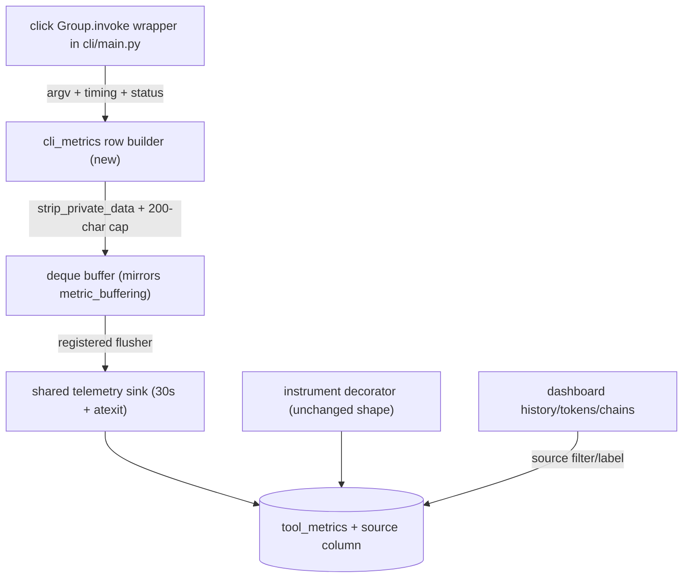

# Tech Spec: cli-usage-recording

**Spec**: [spec.md](spec.md) | **Created**: 2026-08-20
Every file/symbol citation below comes verbatim from [survey.md](survey.md)
or a grep run in this session — never from memory.

## Architecture

The CLI side gets its own small module that mirrors `metric_buffering`'s
buffer+registration pattern (survey Q2's designed extension point) and
writes into the same table through the same sink thread and atexit drain.

## Solution
### Chosen approach
- **Wrapper** (FR-001): a custom `click.Group` subclass in
  `src/cairn/cli/main.py` whose `invoke` times the dispatch, captures the
  command path and a compact argv summary, and records ok/error on exit —
  one row per top-level invocation (survey Q6; research RQ1's shutdown
  notes are covered by the sink's atexit).
- **Row builder** (FR-001, FR-003): `src/cairn/telemetry/cli_metrics.py`
  — builds the same column shape as `_log_metric` (survey supporting
  evidence) with `tool_name = "cli:" + command path`, applies
  `strip_private_data` + `MAX_ARGS_SUMMARY_CHARS` truncation verbatim
  (survey Q3), buffers to a deque, and registers its flusher with the
  shared sink (survey Q2). Never blocks or raises into the command
  (best-effort doctrine).
- **Source labeling** (FR-002): additive `source TEXT NOT NULL DEFAULT
  'mcp'` column via the proven ALTER TABLE migration seam (survey Q7);
  CLI rows stamp `source='cli'`; history gains a source column display +
  `source` filter param; tokens aggregates include cli rows grouped under
  their `cli:*` names (naturally labeled by the tool_name convention).
- **Opt-out** (FR-004): the wrapper checks `is_telemetry_off()` (survey
  Q5) before buffering — the existing documented master switch; a
  CLI-specific refinement (`CAIRN_CLI_METRICS=off`) layered on the same
  gate if scoping is wanted, documented next to CAIRN_TELEMETRY.
- **Session identity** (FR-006): derive from the environment where
  available (`TERM_SESSION_ID`, `TMUX_PANE`), else a per-invocation uuid
  (research RQ3) — stamped in the wrapper, never 'unknown'.
- **Regression guard** (FR-005): no change to `instrument`,
  `_log_metric`, or the sink beyond the default-source stamp in the INSERT
  (column default handles it server-side — the INSERT statement can stay
  byte-identical).

### Alternatives rejected
| Alternative | Why rejected |
|-------------|--------------|
| Per-command decorator | Drifts as commands are added; the Group is the single chokepoint (survey Q6) |
| Separate cli_metrics table | Splits every view into a UNION; the one-pipeline rule wins |
| tool_name prefix only, no column | Breaks exact-match filters and conflates labeling with identity |
| Synchronous write per command | On the hot path of every CLI run; the buffered doctrine exists for exactly this |

## Impact analysis
- `tool_metrics` gains a defaulted column: existing readers
  (`src/cairn/cli/system.py` aggregations — survey Q8; dashboard data
  functions) are unchanged in behavior; dashboards render the new column
  additively.
- The MCP INSERT stays shape-identical (server-side default covers it);
  `tests/test_metrics.py` / `tests/test_metrics_extensions.py` /
  `tests/test_telemetry.py` baselines must stay green (Phase 1 gate).
- Every CLI invocation now pays one env read + argv dump + deque append —
  sub-microsecond class; SC-2's < 5% budget is measured by the wrapper's
  timing test.
- Cross-spec: history's new `source` param joins tool/session —
  cross-links forwards it; traffic-scale's windows/pagination compose in
  the same WHERE builder.

## Code guide
### CLI wrapper
- Touches: `src/cairn/cli/main.py` (survey Q6)
- Approach: subclass click.Group; wrap invoke with timing + status capture;
  call the row builder in a try/except that never fails the command.
- Verify before implementing: `uv run cairn --help`
- Pitfalls: Click's standalone mode catches some exceptions into usage
  errors — map UsageError exits to status with the error message captured
  before Click formats it; do not record internal repl/paging if any exist.

### Row builder + flusher
- Touches: new `src/cairn/telemetry/cli_metrics.py`
- Approach: mirror metric_buffering's lock/deque/flush-registration shape
  (survey Q2, Q3); reuse `strip_private_data` and the 200-char cap; the
  flusher INSERTs with the explicit source column.
- Verify before implementing: `grep -n "register_flusher" src/cairn/mcp_server/metric_buffering.py`
- Pitfalls: the hermetic suite resets sink state between tests — follow
  the existing autouse-reset conventions (survey supporting evidence);
  never import click here (keeps the module CLI-free for reuse).

### Schema + views
- Touches: `src/cairn/graph/schema.py` (survey Q7 pattern),
  `src/cairn/dashboard/data.py` + `src/cairn/dashboard/templates/history.html`
- Approach: MIGRATIONS entry adding `source` with default 'mcp'; history
  SELECT gains the column, display + filter param follow the tool/session
  precedent (app.py pattern).
- Verify before implementing: `grep -n "TOOL_METRICS.*MIGRATION" src/cairn/graph/schema.py`
- Pitfalls: pre-migration rows read as 'mcp' via the default — honest for
  this table's history; NULL never appears.

### Tests
- Touches: `tests/test_metrics_extensions.py`, `tests/test_telemetry.py`,
  `tests/test_dashboard_app.py`
- Approach: CliRunner-driven invocations (ok, error, telemetry-off) against
  a tmp store with a forced drain; subprocess test for the atexit path;
  dashboard source-filter tests.
- Verify before implementing: `uv run pytest tests/test_metrics_extensions.py -q`
- Pitfalls: the suite's env scrubbing must set/clear CAIRN_SESSION and the
  terminal env vars explicitly — identity derivation reads the real
  environment (hermetic-suite lesson).

## References
- atexit semantics: https://docs.python.org/3/library/atexit.html
- OTel shutdown discussion (CLI flush discipline): https://github.com/open-telemetry/opentelemetry-python/discussions/3034
- OTel env-var gating convention: https://opentelemetry.io/docs/specs/otel/configuration/sdk-environment-variables/
- CWE-532 (scrub at the write boundary): https://cwe.mitre.org/data/definitions/532.html
- Related specs: ui-dashboard (views consuming the rows),
  ui-dashboard-traffic-scale (WHERE composition), ui-dashboard-polish
  (owns retention for these rows).

## Decisions
### D-001: Group-invoke wrapper is the single interception point
- **Context**: FR-001 needs every command, present and future.
- **Decision**: custom click.Group.invoke in `src/cairn/cli/main.py`.
- **Consequences**: one record per top-level invocation; future commands
  are covered automatically; subcommand hops are intentionally not rows.

### D-002: Additive `source` column, MCP INSERT unchanged
- **Context**: FR-002 labeling without touching the MCP path (FR-005).
- **Decision**: `source TEXT NOT NULL DEFAULT 'mcp'` via the migration
  seam; only CLI rows state it explicitly.
- **Consequences**: one table, one pipeline; the MCP INSERT statement and
  its tests stay byte-identical; all readers tolerate the column.

### D-003: Terminal/tmux-derived session identity, uuid fallback, never 'unknown'
- **Context**: FR-006 + the legacy 'unknown' giant-session risk (survey Q4).
- **Decision**: read TERM_SESSION_ID / TMUX_PANE when present, else a
  per-invocation uuid stamped in the wrapper.
- **Consequences**: best-effort grouping that can never pollute the legacy
  session; identity is stable within one terminal pane, opaque across.
