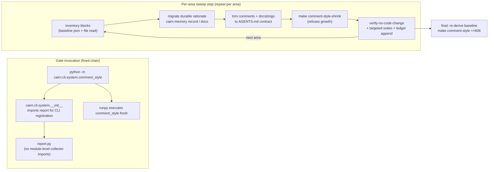

# Tech Spec: comment-sweep

**Spec**: [spec.md](spec.md) | **Created**: 2026-10-07
**Every file/symbol citation below must come verbatim from [survey.md](survey.md)
or a grep run in this session — never from memory.**

## Architecture
The sweep is not new machinery: it is a disciplined loop over the existing
shrink-only ratchet, plus one surgical import-chain fix. Per area:
durable rationale is migrated to `cairn memory record` (or `docs/`) FIRST,
then the prose is trimmed to the AGENTS.md contract, then the baseline is
re-derived (`make comment-style-shrink` refuses growth), then gates and
suites prove the step. The D-012 fix removes the eager collector imports
from `report.py` so `python -m cairn.cli.system.comment_style|audit_status`
stops double-importing.

Before the fix, `PKG → RPT → comment_style/audit_status` pre-populated
`sys.modules`, so `runpy` re-executed an already-imported module — the
observed `<frozen runpy>:128: RuntimeWarning` (reproduced this session via
`UV_CACHE_DIR=/tmp/cairn-designer uv run --no-sync python -m cairn.cli.system.comment_style --json`).

## Solution
### Chosen approach
- **FR-004**: move the two module-level collector imports
  (`src/cairn/cli/system/report.py` lines 17–18) into local scope at their
  single use sites, the private helpers `_audit_quality_gate`
  (`src/cairn/cli/system/report.py:211`) and `_comment_quality_gate`
  (`src/cairn/cli/system/report.py:226`). CLI registration stays eager
  (`src/cairn/cli/system/__init__.py:14` keeps importing `report`), so the
  `cairn report` command surface is unchanged; only import timing moves.
  This is the sweep's single allowed executable-semantics change (D-012).
- **FR-001/FR-002**: per-area trim commits with migration-before-deletion,
  sized from the re-counted baseline (1213 = 897 docstring + 316 comment
  across 188 files; area split in plan.md). Target ≤550 remaining, giving
  margin under the ≤606 requirement while leaving the second halving to the
  ratchet (D-006).
- **FR-003**: every commit proves AST-equivalence via
  `make verify-no-code-change` (`scripts/verify_no_code_change.py` blanks
  docstrings and diffs ASTs; exit 0 = comment-only), except the documented
  Phase-1 `report.py` exception. Full-suite authority is CI (D-004).
- **FR-005**: the definitive re-derivation runs once, after the last trim,
  via `make comment-style-shrink` (`Makefile:57-58`, writer mode
  `src/cairn/cli/system/comment_style.py:_run_update:275` refuses growth).
- **NFR-005**: progress is the `make comment-style` count; the migration
  list lives in a new delivery record `docs/audits/comment-sweep.md` (D-002).

### Alternatives rejected
| Alternative | Why rejected |
|-------------|--------------|
| Lazy `__getattr__` re-export in `cairn.cli.system.__init__` for `report` | `src/cairn/cli/__init__.py` imports command modules "for decorator side effects"; deferring the `report` import would unregister the `cairn report` command — a real behavior change (session read of `src/cairn/cli/__init__.py`). |
| Change Makefile invocations (e.g. `python -c "from ... import main"`) | Treats the symptom at one call site; the pre-commit hook (`.pre-commit-config.yaml` check-comment-lengths) and CI invoke `python -m` directly (survey FR-001/FR-005 evidence, session read `.github/workflows/ci.yml:148,152`). |
| One 188-file sweep commit | Reviewability risk named in spec.md assumptions; per-area commits with suite-green gates are the spec's own mitigation. |
| Sweep to zero / continue past ≤606 | Spec scope defers "the further 50% after the first halving (the ratchet carries it)". |
| Tool-assisted bulk docstring rewriting (e.g. AST rewriter script) | A rewriter is new executable machinery outside the FR-003 allowlist; hand-trim with `verify-no-code-change` proof reaches the same guarantee with zero new code. |

## Impact analysis
Blast radius of the D-012 fix (the only code change):

| Surface | Change | Consumers (session grep / survey) | Breaks? |
|---|---|---|---|
| `report.py:17-18` module imports | moved into `_audit_quality_gate` / `_comment_quality_gate` | `src/cairn/cli/system/__init__.py:14` (registration, unchanged); no other `src/` importer of the collectors (session `rg` over `src/` excluding the three gate modules: zero hits); tests import collectors directly from `cairn.cli.system.comment_style` (`tests/test_check_comment_lengths.py:8`, `tests/test_report.py:83`) — unaffected | No |
| monkeypatch surface | `report.check_comment_baseline` / `report.collect_audit_status` cease to be module attributes | session `rg "report\.(collect_audit_status\|check_comment_baseline\|DEFAULT_BASELINE)\|patch\(.*report"` over `tests/` → only an unrelated `tests/test_knowledge_cli.py:152` hit | No |
| `cairn report` output | unchanged (imports resolve at call time; no cycle: neither collector imports `report` — session reads of `comment_style.py`/`audit_status.py` headers) | `tests/test_report.py` end-to-end cases incl. quality-gates assertions (`tests/test_report.py:246-258`, survey NFR-005) | No |

Test-tree pin sweep for docstring/comment trims (tech-brief classification;
session greps + AST cross-check):

- **Flag pins (assert old text)**: `tests/test_doctor.py:1491` asserts
  `"read-only unless --fix"` in `doctor --help`; the phrase lives in the
  `doctor` command docstring `src/cairn/cli/system/doctor.py:1252`. That
  docstring is already one line — the pin constrains any Phase-3 rewrite of
  it: keep the phrase or update the pin in the same step (D-005, D-007).
- **Exact-count / exact-traffic pins**: none found — no test counts docstring
  lines of `src/` modules or asserts comment-block contents (session AST
  scan: 863 long docstrings checked; a 5-word-window overlap with test prose
  appears in 266, but inspection shows coincidental technical idiom, not
  assertions of `src/` prose).
- **Behavior pins (unaffected)**: all other `--help` assertions pin
  decorator-sourced strings — option flags and command names
  (`tests/test_cli_smoke.py:210-213,259-262`, `tests/test_agent_suite.py:262-265`,
  `tests/test_trace_flow.py:217-219,476-478`, `tests/test_prs_cli.py:173-175`,
  `tests/test_uninstall_cmd.py:18-30`, `tests/test_ingest_compat.py:227-229`,
  `tests/test_scip_cli.py:87-89`). `tests/test_invariants.py:114`
  (`test_invariant_mcp_tool_docstrings_nonempty`) requires MCP tool
  docstrings non-empty — one-line contracts satisfy it; never trim to empty
  (D-007). Gate contracts (`tests/test_check_comment_lengths.py`) pin
  detector behavior on synthetic sources, not `src/` prose.

Shared-state blast radius: every trim commit rewrites
`docs/audits/comment-style-baseline.json` (consumers: the gate
`src/cairn/cli/system/comment_style.py:check_comment_baseline:206`, the
pre-commit hook `.pre-commit-config.yaml:61`, the CI quality-ratchet job
`.github/workflows/ci.yml:148,152,166`, `docs/README.md:29`) and appends to
`docs/audits/comment-sweep.md` — the one-writer-at-a-time constraint in
plan.md's parallelization map.

## Quality, threats, and rollback
| Requirement | Design consequence / threat mitigation | Rollback or verification |
|-------------|----------------------------------------|--------------------------|
| NFR-001 (n/a) | No secrets/auth/untrusted input touched (survey DONE evidence); memory records carry engineering rationale only — no payloads, keys, or user data migrate. | `rg -n "password\|secret\|token\|api_key"` over migration candidates before recording. |
| NFR-002 (n/a) | `cairn memory record` writes the local store only (survey DONE evidence); no network path in the sweep. | `.venv/bin/cairn memory record --help` contract check. |
| NFR-003 (n/a) | Comment-only edits; gate budget already gated (survey DONE evidence, ~1.9s scan). | `make comment-style ARGS=--json` wall time observed per phase. |
| NFR-004 | Same-step rule: a prose-pinned test is updated in the same commit as the trim that frees it, never deleted to pass (D-005). Per-commit gates: targeted suites + pre-commit + AST proof. | `make verify-no-code-change REF=HEAD~1`; `pytest tests/test_check_comment_lengths.py tests/test_report.py -q` locally; full suite at phase boundaries (D-004) and in phase-PR CI. |
| NFR-005 | The delivery record `docs/audits/comment-sweep.md` carries: per-migration rows (file :: symbol → memory type + title, or docs target) and per-phase remaining counts. | `make comment-style ARGS=--json` `.remaining` vs ledger rows. |
| NFR-006 (n/a) | No UI surface; baseline paths are all `src/` (survey DONE evidence). | — |

Threat model (persistence-adjacent — memory records): asset = durable
engineering rationale; threat = silent knowledge loss during bulk deletion;
mitigation = FR-002 ordering (record exists and is ledgered BEFORE the prose
commit lands) + PR review of the ledger; residual risk = a block judged
"obvious" that was not — accepted, recoverable from git history. Rollback =
`git revert` of a trim commit restores prose; the shrink-only updater accepts
the restored count only via a fresh `make comment-style-shrink` run (it
refuses growth, and a revert reduces counts, so re-derivation succeeds).

## Code guide
### runpy import-chain fix
- Touches: the module-level imports at `src/cairn/cli/system/report.py:17-18`;
  use sites `src/cairn/cli/system/report.py:211` (`_audit_quality_gate`) and
  `:226` (`_comment_quality_gate`) (survey FR-004 evidence)
- Approach: delete lines 17–18; add `from .audit_status import collect_audit_status`
  inside `_audit_quality_gate` and `from .comment_style import DEFAULT_BASELINE, check_comment_baseline`
  inside `_comment_quality_gate`. Do NOT touch
  `src/cairn/cli/system/__init__.py:14` — registration must stay eager.
- Verify before implementing: `UV_CACHE_DIR=/tmp/cairn-uv-survey make comment-style 2>&1 | grep RuntimeWarning`
  (warning present today); after: same command → empty, plus
  `make audit-status 2>&1 | grep RuntimeWarning` → empty, plus
  `CAIRN_LIB=/tmp/__no_such_lib__ UV_CACHE_DIR=/tmp/cairn-uv-survey uv run --extra test pytest tests/test_check_comment_lengths.py tests/test_report.py -q`
- Pitfalls: re-exporting the collectors from `report` "for compatibility"
  would reintroduce the eager chain; `__init__` laziness would unregister
  `cairn report` (rejected alternative).

### Delivery record & migrations
- Touches: new `docs/audits/comment-sweep.md`; `cairn memory record`
  invocations (local store); survey FR-002/NFR-005 evidence
- Approach: scaffold first (Phase 1): title, per-phase count table, migration
  ledger table with columns `file :: symbol | landing (type + title / docs
  target)`. Per migration: run `.venv/bin/cairn memory record <decision|pattern|mistake|workaround> "<title>"`
  with `--body` shaped "fact/rule, then `Why:`, then `How to apply:`" (help
  text, survey FR-002), append the ledger row, THEN trim the prose. Blocks
  that state only history or the obvious are deleted with no migration
  (FR-002 WHERE-clause).
- Verify before implementing: `.venv/bin/cairn memory record --help`
- Pitfalls: migrating obvious narration bloats memory with noise; recording
  AFTER deletion loses the source text if the commit squashes.

### Per-area trim protocol (graph, telemetry, memory, cli, mcp_server, dashboard, parsers, knowledge, agent_install, long tail)
- Touches: the area's files under `src/cairn/<area>/` per the baseline
  inventory (`docs/audits/comment-style-baseline.json` paths),
  `docs/audits/comment-style-baseline.json`,
  `docs/audits/comment-sweep.md`
- Approach: per file — read the flagged blocks; classify durable-rationale vs
  history/obvious; migrate durable ones (above); collapse docstrings to
  1-line contracts (≤3 lines where the contract genuinely needs it); delete
  narration comments; keep single-line constraint notes that encode implicit
  rules. Then one commit per area including its shrink:
  `UV_CACHE_DIR=/tmp/cairn-uv-survey make comment-style-shrink ARGS=--json`
  (the gate exits 1 on stale entries — `check_comment_baseline` returns
  `ok: not new and not stale` — and the pre-commit hook runs on every
  commit, so the shrink MUST ride the trim commit).
- Verify before implementing: `UV_CACHE_DIR=/tmp/cairn-uv-survey make comment-style ARGS=--json`
  (record pre-count); after each area: same command (`remaining` strictly
  lower, `new: []`, `stale: []`), `make verify-no-code-change REF=HEAD~1`,
  targeted suite for the area, and `rg -n "<distinctive removed phrase>" tests/`
  before deleting any prose (D-005).
- Pitfalls: `src/cairn/cli/system/doctor.py:1252` keeps the pinned phrase
  "read-only unless --fix"; MCP tool docstrings never go empty
  (`tests/test_invariants.py:114`); do not trim `help=` decorator strings
  (executable code, and `--help` tests pin them); do not touch log strings.

### Closeout
- Touches: `docs/audits/comment-style-baseline.json` (final re-derivation),
  `docs/audits/comment-sweep.md` (final counts), `CHANGELOG.md` (D-009)
- Approach: after the last trim, run the documented entry point
  `make comment-style-shrink` (survey FR-005 evidence: `Makefile:57-58`,
  `docs/README.md:29`), confirm `jq '.violations | length'` ≤606 (target
  ≤550), finalize ledger totals, add the CHANGELOG entry.
- Verify before implementing: `UV_CACHE_DIR=/tmp/cairn-uv-survey make comment-style-shrink ARGS=--json && jq '.violations | length' docs/audits/comment-style-baseline.json`
- Pitfalls: running the final shrink before all trims land makes the FR-005
  count premature; growing any count is refused by the updater by design.

## References
- [survey.md](survey.md) — all status evidence and verify commands.
- [research.md](research.md) — "not applicable — no open questions at Stage 0".
- `specs/grade-a-ratchet/tech-spec.md` D-012 — the parked runpy warning this
  spec lands (survey FR-004 evidence).
- `docs/README.md:29` — the documented baseline-regeneration entry point.
- `AGENTS.md` comment/docstring contract — the trim target style.
- `scripts/verify_no_code_change.py` — AST-equivalence prover for FR-001's
  no-semantics clause (`make verify-no-code-change`).

## Decisions
### D-012: Fix the parked ratchet D-012 by localizing collector imports inside report's gate helpers
- **Context**: `python -m cairn.cli.system.comment_style|audit_status` warns because `src/cairn/cli/system/__init__.py:14` eagerly imports `report`, whose module-level lines 17–18 pre-import both collectors into `sys.modules` before runpy executes them (survey FR-004 chain, reproduced this session).
- **Decision**: Move only those two imports into `_audit_quality_gate` (`report.py:211`) and `_comment_quality_gate` (`report.py:226`); keep `__init__`'s eager `report` import untouched.
- **Consequences**: Warning gone from every `python -m` gate invocation (make targets, pre-commit hook, CI); CLI registration and `report` output unchanged; `report.check_comment_baseline`/`collect_audit_status` stop being module attributes (no consumer found); this commit is the sweep's single `verify-no-code-change` exception.

### D-002: Delivery record lives at `docs/audits/comment-sweep.md`
- **Context**: FR-002/NFR-005 require a delivery record listing every migration; none existed (survey gaps). FR-003's allowlist permits `docs/`.
- **Decision**: One markdown ledger under `docs/audits/` beside the baseline it explains, scaffolded in Phase 1, appended per migration, finalized in Phase 4.
- **Consequences**: The record is reviewable in the same PRs as the trims and survives as repo documentation; specs/ files stay pipeline-owned.

### D-003: Every trim commit carries its own baseline shrink
- **Context**: `check_comment_baseline` returns `ok: not new and not stale` (session read `src/cairn/cli/system/comment_style.py:206`), and the pre-commit hook (`.pre-commit-config.yaml:61`) runs the gate on every commit — a trimmed tree against an un-shrunk baseline fails on stale entries.
- **Decision**: Protocol per area = migrate → trim → `make comment-style-shrink` → gates → commit, all in one commit.
- **Consequences**: Every commit is independently green and ratchet-monotonic; the shared baseline forces one writer at a time (plan.md's serialization reason); the final Phase-4 shrink is still the definitive FR-005 re-derivation.

### D-004: Full-suite authority is CI; capable hosts also run it locally per phase
- **Context**: The survey sandbox could not bind 127.0.0.1 (`PermissionError: [Errno 1] Operation not permitted`, survey FR-003), but a full local run in this session passed (`4309 passed, 5 skipped` on the baseline tree); CI runs the full matrix regardless (`.github/workflows/ci.yml:217` core, `:229` `-m "not infra" -n auto`, `:240` infra).
- **Decision**: Per-commit local gates are the targeted suites + pre-commit + AST proof; each phase boundary adds a local full-suite run where the host allows; the phase PR's CI run is the authoritative full-suite green required by FR-003/NFR-004.
- **Consequences**: "Suite green at every intermediate step" is proven per commit for the touched surface and per phase for the whole suite; environments without loopback fall back to CI without blocking the sweep.

### D-005: Prose-pin protocol with the known-pin inventory
- **Context**: Survey NFR-004 flagged the pin inventory as unknown. Resolved this session: the hard pins are `tests/test_doctor.py:1491` ↔ `doctor.py:1252` ("read-only unless --fix") and the non-empty MCP docstring invariant `tests/test_invariants.py:114`; all other `--help` assertions pin decorator-sourced flags/names; a 5-word-window AST scan (863 long docstrings vs test prose) found only coincidental idiom, no assertion pins.
- **Decision**: Before deleting distinctive prose, `rg -n "<phrase>" tests/`; any hit is updated in the same commit, never deleted to pass; the two known pins are handled per D-007.
- **Consequences**: NFR-004's same-step rule is enforceable mechanically per trim; the noisy window scan is not treated as an inventory.

### D-006: Stop at ≤550; the second halving stays ratchet-carried
- **Context**: FR-001 requires ≤606; spec scope defers "the further 50% after the first halving".
- **Decision**: Phase 3 sweeps the sized areas to land ≤550 (margin under 606); Phase 4 trims long-tail files only if the margin demands; no sweep-to-zero.
- **Consequences**: FR-001 is met with reviewable margin; residual debt remains visible and monotonically shrinking via the existing gate.

### D-007: Agent-facing docstrings keep enforceable one-line contracts
- **Context**: MCP tool docstrings are shown verbatim to AI clients (`tests/test_invariants.py:111-114`); the doctor command docstring carries the help-text pin (D-005).
- **Decision**: MCP tool docstrings trim to one-line contracts, never empty; `doctor.py:1252` keeps "read-only unless --fix" (or the pin updates in the same step).
- **Consequences**: The invariant and the help pin stay green without freezing the surrounding prose.

### D-008: `make verify-no-code-change` is the FR-001 no-semantics proof
- **Context**: Self-reported "comments only" edits are unreliable; `scripts/verify_no_code_change.py` AST-diffs changed files with docstrings blanked (session read; `Makefile:45-46`).
- **Decision**: Run it per trim commit (`REF=HEAD~1` post-commit, default form pre-commit); the Phase-1 `report.py` commit is the single recorded exception.
- **Consequences**: FR-001's "no executable semantics" clause is machine-checked, not asserted.

### D-009: CHANGELOG entry rides closeout despite FR-003's path allowlist
- **Context**: FR-003 confines touches to `src/`, `docs/`, memory records, and the FR-004 wiring, yet spec.md's In-scope explicitly lists "CHANGELOG entry" and C-01 governs shipping.
- **Decision**: Read FR-003 as governing the sweep's code/prose edits; the single CHANGELOG append in Phase 4 is release metadata named by the spec's own scope.
- **Consequences**: No other root-level file is touched; the reconciliation is explicit rather than silent.
