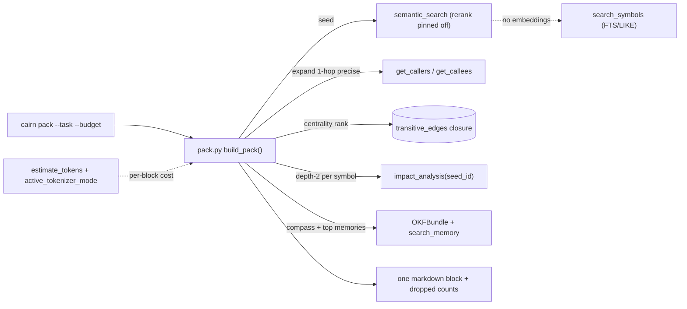

# Tech Spec: context-pack

**Spec**: [spec.md](spec.md) | **Created**: 2026-09-17
**Every file/symbol citation below must come verbatim from [survey.md](survey.md)
or a grep run in this session — never from memory.**
Citation tags: `(S#)` = survey item; `(session verify: <cmd>)` = re-runnable
query run in this session (gap flagged for surveyor promotion).

## Architecture

The pack is a new read-only consumer layered over five existing surfaces —
semantic seed with lexical fallback (S4), the precomputed `transitive_edges`
closure (S1), compass + memory readers (S5), and the shared token-cost
precedent (S3) — composed by one new pipeline module behind one new CLI
command. It sits beside `repo_map` (S2), not inside it: `repo_map` is a
deterministic orientation projection over stored graph rows
(repo_map.py:1) with fixed caps (repo_map.py:10-11), and stays untouched.
No existing reader's signature, return shape, or default changes; the only
existing file edited is the CLI registration import block
(cli/__init__.py:23-46, survey supporting evidence confirms no pack entry
today) plus the bench suite's task list.

## Solution

### Chosen approach

New `src/cairn/pack.py` (pipeline: item model, seed → expand → rank → fit,
emitter) + `src/cairn/pack_enrich.py` (trimmer, per-symbol blast-radius line,
compass excerpts, memory picks) + `src/cairn/cli/pack.py` (Click command) +
one additive bench task. `build_pack(conn, bundle, task, budget)` runs:

1. **Seed (FR-001)** — `semantic_search(conn, task, limit=N, rerank=False)`
   when the embeddings table holds rows for the current model; else
   `search_symbols(conn, task, limit=N)` (FTS5/bm25 with the LIKE union and
   FTS fallback, S4: semantic.py imports `search_symbols`; semantic.py:195
   documents the fallback path when vectors are absent). `rerank=False` pins
   the env-gated cross-encoder stage off so the pack path carries no model
   inference beyond the local embed (FR-005).
2. **Expand (FR-001)** — union each seed with its precise 1-hop
   `get_callers` + `get_callees` neighbors, per-seed capped, joined back to
   symbol rows. One hop only: multi-hop structure is already encoded by the
   rank stage and the per-symbol depth-2 summary, both closure reads (S1) —
   re-walking it here would duplicate those reads and flood the budget.
3. **Rank (FR-002)** — centrality(symbol) = `COUNT(DISTINCT source_id) FROM
   transitive_edges WHERE target_id = ?`, one indexed statement per candidate
   (S1: the closure answers ancestor queries "in one indexed statement";
   `idx_transitive_target_id` covers the filter — session verify:
   `grep -n "idx_transitive_target_id" src/cairn/graph/schema.py`). Gated on
   `closure_available()` (session verify: `cairn callers closure_available`);
   fallback when the closure is absent: direct in-degree from `edges`.
   Order: `(-is_seed, -centrality, qualified_name)` — task relevance first,
   then structural weight, fully deterministic.
4. **Enrich (FR-003)** — per selected symbol: verbatim source via the stored
   `line_start`/`line_end` spans (schema.py:42-43 — session verify:
   `grep -n "line_start" src/cairn/graph/schema.py`), reusing the
   `_read_source_spans` slice-and-cap pattern from
   `src/cairn/graph/explore.py:21` (session verify:
   `sed -n '21,95p' src/cairn/graph/explore.py`), trimmed to signature plus
   key body by a per-symbol line cap; plus a one-line depth-2 precise
   blast-radius summary from `impact_analysis(conn, name, max_depth=2,
   seed_id=<id>, limit=K)` — depth 2 is inside the index-mode eligibility
   (max_depth ≤ 3), so it rides `impact_from_closure` when built and falls
   back to DFS otherwise (S1; signature session verify:
   `grep -n "def impact_analysis" src/cairn/graph/traversal.py`). Pack-level
   sections: the containing modules' compass excerpts (deduped per module,
   read from OKFBundle — the read pattern behind get_compass,
   tools_compass.py:34, S5) and the top-3 memories from
   `search_memory(conn, bundle, task)` (promotion.py:242, S5), "where
   present" = empty sections omitted.
5. **Fit (FR-004)** — render every block, cost each with
   `estimate_tokens` (dashboard/tokenizer, S3); reserve compass + memory
   sections first, then admit symbol blocks in rank order until the budget is
   exhausted; the tail (lowest centrality) is what gets dropped; report kept
   and dropped counts per class.
6. **Emit (FR-001, FR-005)** — one markdown block: header (task, budget,
   `active_tokenizer_mode()`, token count, dropped counts), symbol sections
   in rank order, compass section, memories section. Deterministic: sorted
   keys/order throughout, no LLM, no network (S3's suite contract is the
   precedent: "Deterministic and CI-safe: no LLM, no network" — session
   verify: `sed -n '1,15p' src/cairn/bench/agent_suite.py`).

FR map: FR-001 → stages 1-2 + 6 (D-001, D-002, D-003); FR-002 → stage 3
(D-004); FR-003 → stage 4 (D-005, D-006, D-008); FR-004 → stage 5 (D-009);
FR-005 → stages 1 and 6 (D-002's rerank pin, D-007's cost model, D-011's
zero-dependency stance). Bench fit-rate arm (scope item) → D-010.

### Alternatives rejected

| Alternative | Why rejected |
|-------------|--------------|
| Extend `repo_map` with task relevance + budget | It is a fixed-cap orientation projection (S2: DEFAULT_CLUSTER_CAP=16 / DEFAULT_HUB_CAP=3, no task input); a task-conditional pipeline cannot borrow its shape. |
| Per-candidate DFS impact walks at pack time | The closure already answers ancestor queries in one indexed statement (S1); DFS is the documented fallback, not the primary path. |
| Reuse dashboard's mode-probing `estimate_tokens` for exact counts | Mode is machine-state ("resolved once per process", tokenizer.py:11, S3); pack reports the active mode instead, keeping FR-005 reruns byte-identical on one install. |
| New tokenizer dependency (tiktoken/transformers) in the pack path | C-03 dependency gate; S3's shared chars/4 precedent exists precisely so bench/dashboard numbers stay comparable. |
| Generative LLM selection/summarization in the pipeline | FR-005 forbids it; the bench suite's determinism contract shows the bar this repo holds. |
| Ship the MCP `context_pack` tool first | Spec scope defers it: "CLI proves the pipeline first". |
| Multi-hop expansion at the pool stage | Centrality + per-symbol depth-2 summary already read the precomputed multi-hop closure (S1); expanding multi-hop duplicates those reads. |

## Impact analysis

Graph queries run this session (`cairn callers <sym>`; counts are direct
callers of the reused surfaces — the pack adds one consumer to each, edits
none):

| Reused symbol | Direct callers today | Pack's change |
|---------------|----------------------|---------------|
| `search_symbols` (lexical.py:237) | 3 (lexical module, tools_graph module, `search_symbols_data`) | +1 consumer (seed fallback) |
| `semantic_search` | precise impact reported "Cycles detected: ['semantic_search']", 1 impacted (tools_graph) | +1 consumer (seed) |
| `search_memory` (promotion.py:242) | 14 (eval.py, cli/memory.py, compass/router.py, tools_memory, tools_graph.explore, …) | +1 consumer (memories) |
| `impact_analysis` (traversal.py) | 3 (traversal module, tools_graph module + wrapper) | +1 consumer (depth-2 summary) |
| `get_callers` (traversal.py) | 6 (tools_graph, traversal internals) | +1 consumer (expansion) |
| `closure_available` (dataflow.py) | 2 (dataflow module, traversal.impact_analysis) | +1 consumer (rank + summary gate) |
| `estimate_tokens` (dashboard/tokenizer.py:65) | 2 (dashboard data-layer consumers + tests) | +1 consumer, zero edits |
| `build_repo_map` (repo_map.py:160) | 3 (cli/map.py, tools_graph) | 0 — rejected alternative, untouched |

- **What breaks: nothing.** All pack surfaces are new files plus one
  registration line in the import block (cli/__init__.py:23-46, survey
  supporting evidence: zero `def pack|name="pack"` hits under src/cairn/cli/)
  and one additive bench task. No flag, keyword, default, or return shape of
  any existing symbol changes.
- **Precise+fuzzy caveat**: `cairn impact semantic_search` reported a cycle
  on the symbol itself and under-counts recursive/dispatch callers — caller
  counts above are lower bounds (the AGENTS.md rule: empty precise ≠ no
  callers; verify audits with `fuzzy=True`).
- **Test-tree sweep**: the brief's 4-class sweep (flag pins / exact-count
  pins / exact-traffic pins / behavior pins) is triggered where a decision
  flips an existing default. No decision here flips one — every surface is
  additive (D-001..D-011), so the triggered sweep is vacuous. For evidence,
  the pins around the two most-adjacent reused APIs were swept this session
  (`grep -rn "CHARS_PER_TOKEN\|estimate_tokens" tests/`) and all classify as
  **behavior pins** that an additive consumer cannot flip:
  `tests/test_agent_suite.py:12,57` (asserts `est_tokens == chars //
  CHARS_PER_TOKEN` via the imported constant),
  `tests/test_dashboard_app.py:1761,3302,3324,3326` (imports the constant
  from `cairn.bench.agent_suite` and does arithmetic with it),
  `tests/test_dashboard_data.py:2203-2242` (pins `estimate_tokens`
  exact/heuristic modes and the `active_tokenizer_mode()` label). None
  asserts the pack, and pack alters none of them. Zero flag pins, zero
  exact-count/traffic pins exist on any flipped default because there is no
  flip.

## Code guide

### Pack pipeline — `src/cairn/pack.py` (new)
- Touches: nothing existing. Composes the seed pair (S4: semantic.py imports
  `search_symbols, search_symbols_terms`), the closure read (S1:
  dataflow.py:7-9, CLOSURE_MAX_DEPTH=4 at dataflow.py:28), and the token cost
  (S3: agent_suite.py:58 `CHARS_PER_TOKEN = 4`; tokenizer.py:11 documents the
  shared heuristic and mode resolution).
- Approach: item model (one frozen dataclass per content block: kind, rank,
  rendered text, token cost) → stages as pure functions over `(conn, bundle,
  task, budget)` → `build_pack()` entry the CLI and bench arm both call.
- Verify before implementing: `cairn pack --task "fix the retry backoff in
  ApiFactory" --budget 2000` twice, `diff` byte-identical; then
  `--budget 50` for the degradation path.
- Pitfalls: retrieval behavior is env-gated (fusion, rerank, ANN backend) —
  pin `rerank=False` and leave fusion per user env; a tie-bounded
  `semantic_search` limit cutoff can swap one near-tied seed between graph
  rebuilds (the bench suite documents the same caveat for its own numbers) —
  determinism contract is per-build, not per-rebuild; FTS-under-limit queries
  pay the additive LIKE union (S4's lexical path), fine at seed limit sizes.

### Enrichment — `src/cairn/pack_enrich.py` (new)
- Touches: nothing existing. Reads symbol spans (schema.py:42-43
  `line_start`/`line_end`), follows the `_read_source_spans` pattern
  (explore.py:21 — session verify above), calls `impact_analysis`
  (S1's `impact_from_closure` fast path at dataflow.py), reads compass via
  OKFBundle (S5: get_compass at tools_compass.py:34 shows the content
  contract; the MCP wrapper itself is not importable from the CLI layer) and
  memories via `search_memory` (S5: promotion.py:242).
- Approach: trimmer (span slice + per-symbol line cap, deterministic cut),
  blast-radius one-liner from the depth-2 `impact_analysis` result
  (`{impacted, total, truncated}` — depth-0/1/2 counts plus top names),
  compass excerpt finder keyed by the symbol's file path prefix, top-3
  memory picks.
- Verify before implementing: run against a workspace with compass and
  memory coverage; all four FR-003 content kinds appear; sections absent
  from coverage are omitted, never rendered empty.
- Pitfalls: do not import `cairn.mcp_server` from pack code (layering; C-04
  bans eager mcp_server imports in tests for the same weight reason);
  `impact_analysis` with `seed_id` pins the exact symbol row — without it a
  common name resolves ambiguously; the depth-2 summary must cap its render
  (`limit`) or one hub symbol's line eats the budget.

### CLI command — `src/cairn/cli/pack.py` (new) + one line in `src/cairn/cli/__init__.py`
- Touches: the registration import block (cli/__init__.py:23-46 — survey
  supporting evidence: imports agents through wiki, no pack).
- Approach: `@main.command()` Click command `--task`, `--budget`, `--db`,
  `--knowledge`, `--json`, mirroring the existing command-module shape
  (`cli/map.py` — session verify: `sed -n '1,70p' src/cairn/cli/map.py`);
  opens the DB read-only, closes in `finally`, delegates to `build_pack`.
- Verify before implementing: `cairn pack --help`; `cairn --help` lists pack.
- Pitfalls: registration is import-side-effect only (cli/__init__.py:23-46
  comment: "registration is the point"); a missed import line means a silently
  absent command; C-04 — tests import `cairn.pack`, never `cairn.cli`, at
  module level.

### Bench fit-rate arm — `src/cairn/bench/agent_suite.py` (additive)
- Touches: the `_Task` list and report shape in the file whose per-arm
  token/tool-call accounting the survey names as the extension point
  (survey supporting evidence; S3: agent_suite.py:58).
- Approach: a 7th task pair — cairn arm calls the pack pipeline entry within
  a fixed budget; control arm stays the grep/read loop; fit rate = fraction
  of tasks whose seeded target symbols appear in the in-budget pack
  (spec target ≥ 0.85).
- Verify before implementing: run the agent suite; report carries the
  pack arm's tokens and the fit rate.
- Pitfalls: `compare_agent_reports` skips labels absent from the baseline
  (session verify: `sed -n '521,545p' src/cairn/bench/agent_suite.py`), so an
  additive task label cannot fail existing compare gates; keep the suite's
  pinning discipline (rerank off, hash backend) intact.

## References

research.md records "not applicable — no open questions at Stage 0", so there
are no external references to cite; every alternative above traces to a
survey item, the spec, or the constitution (C-03).

## Decisions

### D-001: Additive pipeline modules; repo_map untouched
- **Context**: FR-001 needs task-conditional selection; repo_map is a
  task-free, fixed-cap projection (S2).
- **Decision**: new `src/cairn/pack.py` + `src/cairn/pack_enrich.py` +
  `src/cairn/cli/pack.py`; repo_map and all graph readers stay unedited.
- **Consequences**: pack's correctness rides the existing readers' contracts;
  no regression surface opens inside graph/ or dashboard/.

### D-002: Seed via semantic_search with lexical fallback, rerank pinned off
- **Context**: FR-001 mandates semantic seeding with lexical fallback (S4);
  FR-005 forbids model inference beyond the local embed path.
- **Decision**: embeddings-present probe picks `semantic_search(...,
  rerank=False)`; absent rows pick `search_symbols`. No env-dependent
  cross-encoder ever runs in the pack path.
- **Consequences**: pack output is independent of CAIRN_RERANK and the
  reranker extra; seed quality without embeddings is mid-band by spec risk,
  compensated by expansion (D-003) and measured by the fit arm (D-010).

### D-003: One-hop precise expansion only
- **Context**: FR-001 says "expands them through precise call edges"; the
  multi-hop closure already exists (S1).
- **Decision**: expand each seed with capped precise `get_callers` +
  `get_callees` (1 hop); multi-hop reach enters via centrality (D-004) and
  the per-symbol depth-2 summary (D-005).
- **Consequences**: no redundant closure walks at pool stage; budget goes to
  distinct, ranked content instead of transitive repetition.

### D-004: Centrality = reverse-reach count over transitive_edges
- **Context**: FR-002 requires centrality from the precomputed transitive
  tables (S1 gap: none exists today).
- **Decision**: `COUNT(DISTINCT source_id) WHERE target_id = ?` per
  candidate (indexed; session verify above), gated on `closure_available()`,
  falling back to direct in-degree; sort `(-is_seed, -centrality,
  qualified_name)`.
- **Consequences**: no schema or builder change (plan assumption A2 holds);
  centrality is depth-capped at the closure's fixed depth (S1:
  CLOSURE_MAX_DEPTH=4) — an accepted spec boundary.

### D-005: Per-symbol blast radius via impact_analysis(max_depth=2, seed_id)
- **Context**: FR-003 requires a depth-2 precise summary per selected symbol.
- **Decision**: one `impact_analysis(conn, name, max_depth=2, seed_id=<id>,
  limit=K)` call per rendered symbol; index mode serves it from the closure
  when built, DFS otherwise.
- **Consequences**: one reused entry point carries both paths (S1); renders
  must cap `limit` or hub symbols consume the budget.

### D-006: Compass + memories read OKFBundle/search_memory directly
- **Context**: FR-003 enrichment; the readers live behind MCP wrappers (S5).
- **Decision**: pack reads OKFBundle for compass excerpts and calls
  `search_memory(conn, bundle, task)` (promotion.py:242) directly; it never
  imports `cairn.mcp_server`.
- **Consequences**: no MCP-server import weight in the CLI path; the
  compass-matching rule (module-in-resource) is re-implemented thin, as the
  existing CLI-side context loader already does.

### D-007: Token cost from the shared estimator; mode reported, not forced
- **Context**: FR-004 fitting and FR-005 reporting need one cost model (S3);
  the exact-tokenizer mode is machine-state (tokenizer.py:11, S3).
- **Decision**: costs via `estimate_tokens` from
  `cairn.dashboard.tokenizer`; the header reports
  `active_tokenizer_mode()`; budget checks are conservative (round up).
  Kept red flag: the estimator's home is the dashboard package, so pack
  imports across that boundary — retained because S3 records it as the
  shared bench↔dashboard precedent and relocation is churn without
  behavior gain; a neutral `tokens` module would be its own refactor.
- **Consequences**: pack, bench, and dashboard numbers stay comparable
  (S3's stated purpose); cross-install byte-identity holds only per
  tokenizer mode, which the header discloses.

### D-008: Source + blast radius per symbol; compass + memories pack-level
- **Context**: FR-003's per-symbol list, read literally, would copy the same
  compass/memory text once per symbol of a module.
- **Decision**: symbol blocks carry trimmed source + blast-radius line;
  compass excerpts are deduped per module and memories are one top-3
  task-level section.
- **Consequences**: no duplicated content; FR-003's "where present" maps to
  omitted empty sections.

### D-009: Fit order — enrichment reserved, symbols dropped lowest-centrality first
- **Context**: FR-004 fixes the symbol drop order but not the priority of
  non-centrality content.
- **Decision**: reserve compass + memory sections first (task-level, small,
  no centrality of their own), then admit symbol blocks in rank order; on
  overflow the lowest-centrality symbols drop first; dropped counts reported
  per class (symbols / compass blocks / memories).
- **Consequences**: AC2's graceful degradation is fully deterministic;
  an impossible budget yields header + enrichment + zero symbol blocks
  rather than a truncated symbol dump.

### D-010: Bench fit arm as an additive 7th task
- **Context**: spec success metric needs a fit-rate arm on the existing
  corpus; survey names agent_suite.py as the extension point.
- **Decision**: add one task pair; cairn arm = pack pipeline within a fixed
  budget; fit = seeded target symbols present in the in-budget pack.
- **Consequences**: existing compare gates unaffected (unknown labels are
  skipped — session verify above); report shape grows one entry.

### D-011: Zero new runtime dependencies
- **Context**: C-03 requires a recorded decision for any runtime dep.
- **Decision**: the pack adds none — retrieval, closure, OKF, and token
  accounting are all existing in-repo surfaces (S1, S3, S4, S5).
- **Consequences**: wheel/platform matrix unchanged; the optional
  `[semantic]` extra affects seed quality only, never import success.

## Survey gaps (session-verified beyond survey.md)

These load-bearing facts come from this session's queries, not survey.md —
flagged for surveyor promotion: `_read_source_spans` at
`src/cairn/graph/explore.py:21` (verbatim source reader with budget);
`impact_analysis`'s `seed_id` arg and index-mode eligibility
(`max_depth <= 3`) in `src/cairn/graph/traversal.py`; `symbols.line_start`/
`line_end` spans (`src/cairn/graph/schema.py:42-43`); the
`idx_transitive_target_id` index (`src/cairn/graph/schema.py:407`);
`closure_available` (`src/cairn/graph/dataflow.py`); the CLI command shape
(`src/cairn/cli/map.py`); the test pins listed in the sweep above.
