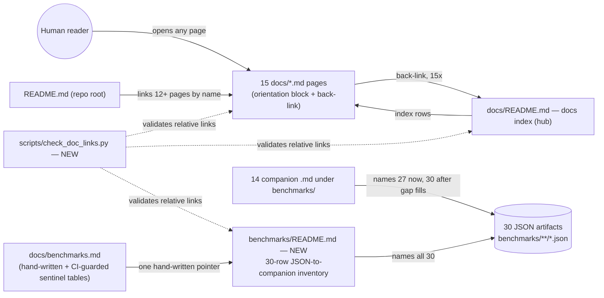

# Tech Spec: docs-human-readable

**Spec**: [spec.md](spec.md) | **Created**: 2026-08-18
**Every file/symbol citation below must come verbatim from [survey.md](survey.md)
or a grep run in this session — never from memory.**

Docs-only spec: no production code changes. The "architecture" below is the
**doc architecture** — the orientation-block convention, the JSON→companion
inventory contract, and the docs link graph. [research.md](research.md) is a
recorded skip (no open choices), so rejected alternatives trace to survey
constraints, not research findings.

## Architecture

Today the docs set is a **hub without spokes**: `docs/README.md` is the index
(its `## Start here` table shape is `| Doc | What it covers |`, survey
Supporting evidence A), but the hub is linked from nowhere — survey FR-003
evidence: `grep -rn 'docs/README' docs/*.md README.md AGENTS.md` → empty, "the
docs index is linked from nowhere, not even root README.md (README.md links
12+ docs pages by name, never docs/README.md)". Artifact companionship is
real but scattered: 30 JSONs under `benchmarks/` are named by 14 companion
`.md` files (survey Supporting evidence B) with no one-place inventory.

After this change the set is a proper hub-and-spoke graph with a second,
artifact-side hub:



One deliberate hole remains: root `README.md` still does not link the docs
index — accepted gap, D-006 (spec.md Out list defers root README; the
orchestrator constraint permits additive-only edits there, but no FR requires
one). Sealed surfaces (survey Supporting evidence C) sit untouched underneath
this graph: the sentinel tables inside `docs/benchmarks.md`, the blob-pinned
`benchmarks/quality/ablation.json` (+ its `ablation.md` companion, see
pitfalls), and the hash-pinned `benchmarks/datasource/ds2`/`t2` trees.

## Solution

### Chosen approach

Three elements, one per FR:

**E1 — Canonical orientation block (FR-001).** One block shape, replicated
verbatim per page. Skeleton the implementers copy:

```markdown
# <Page title>

← [Docs index](README.md)

<what/when paragraph — 2-4 lines directly under the title: what this page
covers and when to read it. States structure ("what's where"); never
re-asserts facts from the body. Style anchor: the BUGS.md opener "Lessons
learned, root-caused. Each entry is a one-time discovery converted to
permanent, queryable memory — so the same bug doesn't get solved twice."
plus a when-sentence in the quickstart.md shape ("This guide gets you from
zero to querying a real repo in a few minutes.") — both quoted in survey
FR-001 evidence / Supporting evidence A.>

## Contents                 <!-- omit this whole section on pages ≤ ~100 lines -->

| Section | What it covers |
|---------|----------------|
| [`## Section-name`](#section-name) | one line, structure-stating |
```

- Table column shape `| Section | What it covers |` mirrors the established
  `| Doc | What it covers |` of `docs/README.md` (survey Supporting evidence
  A, docs/README.md index shape lines 7-10).
- New tables use the heading `## Contents`. The five pre-existing in-convention
  tables keep their headings — `BUGS.md:29:## Index`,
  `architecture-overview.md:9:## Table of contents`,
  `benchmarks.md:17:## Quick reference`, `audit-checklist.md:21:## Index`,
  `review-checklist.md:97:## Quick reference: the one-line review` (survey
  FR-001 evidence) — because the convention's own verify regex
  `^#{1,3} (Contents|Table of contents|Quick reference|Index)` already
  recognizes all four as the same convention (survey FR-001 verify command).
  AC2's "same block shape" is satisfied by the block anatomy (summary +
  recognized table + back-link), not by a uniform heading string (D-001).
- Exactly the 10 PARTIAL pages get the retrofit (summary completion where the
  "when" sentence is missing + `## Contents` table): architecture.md,
  cli-reference.md, configuration.md, contribution-workflow.md, mcp-tools.md,
  methodology-precise-vs-fuzzy.md, query-flow.md, quickstart.md,
  release-checklist.md, scip.md (survey FR-001 evidence, per-page first-30-lines
  check). All 15 non-index pages additionally get the back-link line (E3).

**E2 — JSON→companion inventory at a new `benchmarks/README.md` (FR-002).**
A single new additive file at the `benchmarks/` root (which today has no
README — session `ls benchmarks/` → `baselines datasource quality` only; the
14-file companion list in survey Supporting evidence B contains no top-level
README). Contents: the FR-001 orientation block (with back-link
`../docs/README.md`), then a 30-row table transcribing survey Supporting
evidence B verbatim — columns `| Artifact (repo-relative path) | Named by |`,
one row per JSON, brace-glob families expanded to individual rows
(`sweep-df0.75.json` … `sweep-df0.90.json`, named per
`fr003-calibration/README.md:30`), GAP rows marked for the fill below. Rows
key on **repo-relative path**, not basename — `quality.json` exists in both
`baselines/DS-v1/` and `baselines/DS-v1.1/` (survey Supporting evidence B),
so basename keying over-merges (the doc-level analogue of fuzzy-resolution
false positives).

**Gap fills (3, from survey FR-002 evidence — "GAPS — no .md anywhere names
these 3")**: a small `## Artifacts` table appended to each sibling FIGURES.md
— `benchmarks/quality/fr004-prf/FIGURES.md` names `rows-fr004.json`;
`benchmarks/quality/ladder-v2/FIGURES.md` names `rows-ds2.json` and
`sweep-ds2-zeroshot.json`. Row shape `| Artifact | Role |`, role one line,
structure-stating ("per-run rows backing the figures above" — implementer
words it from the figure context). Both FIGURES.md files are outside every
sealed set (survey Supporting evidence C pins only `quality/ablation.json` +
blobs, the ds2/t2 trees, and the `docs/benchmarks.md` sentinels), and survey
FR-002 evidence confirms they "discuss the figures but never the filenames".
Once the inventory lists all 30 basenames, even the survey's known
false-positive set (the 4 df sweeps caught by strict basename grep) resolves:
the inventory itself is a `.md` under `benchmarks/` naming every basename.

**E3 — Link contract + mechanical check (FR-003).** Back-link line is part of
the orientation block: first line under the H1, exact text
`← [Docs index](README.md)`, on all 15 non-index `docs/*.md` pages.
`docs/README.md` itself is exempt — it already links up via
`docs/README.md:3 → ../README.md` (survey FR-003 evidence). The check is a
new additive script `scripts/check_doc_links.py` (name free — session
`ls scripts/`) implementing exactly the survey's validated algorithm
(`/tmp/check_doc_links2.py`, survey FR-003 evidence):

1. strip `` `inline code` `` spans first (else `BUGS.md:26 [→ postmortem](postmortems/...)`
   — an inline-code placeholder — false-positives, survey FR-003 evidence);
2. extract `](target)` link targets;
3. resolve each target relative to the containing file;
4. ignore `http`/`mailto` and `#anchors`;
5. scope: `docs/**/*.md` + root `README.md` + `benchmarks/README.md`
   (the survey's 19-file run plus the new inventory);
6. **back-link half**: for every `docs/*.md` except `README.md`, at least one
   link target must *resolve* to `docs/README.md` (resolution-based, so
   `methodology-precise-vs-fuzzy.md:4 → ../README.md`, which resolves to the
   *root* README, does not satisfy it by string accident);
7. exit 0 with `TOTAL broken: 0`-style output when green; non-zero listing
   per-file failures otherwise (matches the survey run's shape).

### FR coverage

| FR | Solution element | Decisions |
|----|------------------|-----------|
| FR-001 | E1 orientation-block skeleton; 10-page retrofit; `## Contents` on pages > ~100 lines | D-001, D-002 |
| FR-002 | E2 `benchmarks/README.md` 30-row inventory + `## Artifacts` fills in the two FIGURES.md | D-003, D-004 |
| FR-003 | E3 back-link line (15×) + `scripts/check_doc_links.py` | D-002, D-005 |

### Alternatives rejected

| Alternative | Why rejected |
|-------------|--------------|
| Inventory as a hand-written section inside `docs/benchmarks.md` | Sentinel-adjacent: that page's reference tables are sentinel-generated and CI-guarded (`tests/test_gen_benchmark_tables.py:231 test_second_run_is_byte_identical`; ":14 TC-028 bytes outside the sentinels are never touched" — survey Supporting evidence C); interleaving a 30-row table there raises CI risk for zero colocation benefit |
| Generate the inventory by extending `scripts/gen_benchmark_tables.py` | Touches CI-guarded generator machinery (survey Supporting evidence C) and violates the docs-only constraint (no production code changes) |
| Keep the mapping scattered; only fill the 3 gaps | FR-002 explicitly demands one documented inventory; survey FR-002 gap line: "no one-place inventory; mapping is scattered across sibling README/FIGURES/MEASURE/ablation.md + generated tables" |
| Host the inventory in `benchmarks/quality/ablation.md` (already the quality-campaign doc) | `ablation.md` is blob-pinned — `V1_JSON_BLOB`/`V1_MD_BLOB` sha checks in `tests/test_ablation_artifact.py` (:81-82, :96-110 — survey Supporting evidence C); any edit fails the test suite |
| Orientation blocks that restate the page's facts as a TL;DR | Spec assumption/risk: "where a summary risks drifting from the body, it states structure ('what's where') rather than re-asserting facts"; the closing audit diffs for content drift |
| Rename the 5 existing table headings to `## Contents` for strict uniformity | Churn with no FR gain: the convention's own verify regex recognizes `Contents / Table of contents / Quick reference / Index` as one convention (survey FR-001 verify); AC2 targets block shape, not heading string |
| Wire the link checker into CI (pytest or workflow) | Out of docs-only scope; the checker lands as an additive standalone script runnable by the closing audit (D-005) — CI wiring is a follow-up |
| Touch root `README.md` to link the docs index | spec.md Out list defers root README; no FR requires it (D-006) |

## Impact analysis

**Code-graph blast radius: none, by construction.** This spec modifies no
production symbol — the cairn code intelligence layer (MCP) was not reachable
in this session and no symbol-level edge is touched; the blast surface is
files and their guard/consumer set, mapped below from survey evidence plus
session grep. There is no precise-vs-fuzzy resolution caveat to record for
code symbols; its doc-level analogue is recorded under "name collisions".

**Guard consumers of the touched files (what breaks if the approach is wrong):**

- `tests/test_ablation_artifact.py` — pins `ARTIFACT = QUALITY / "ablation.json"`
  (`tests/test_ablation_artifact.py:43`) and blob-checks **both** the JSON and
  its `ablation.md` companion (`V1_JSON_BLOB`/`V1_MD_BLOB` via `_git_blob_sha`,
  :81-82, :96-110 — survey Supporting evidence C). Impact on this design:
  none of the 3 gap fills or the inventory touches either file; the frequently
  missed trap is that `ablation.md` is *also* sealed even though it looks like
  an ordinary companion doc.
- `scripts/verify_datasource.py` + `tests/test_verify_datasource.py:97`
  (`test_flipped_byte_in_generated_file_exits_nonzero`) — the ds2/t2
  **trees** are hash-pinned, which freezes every file under
  `benchmarks/datasource/` including their companion `.md` files
  (`VERIFICATION.md`, `AUTHORING.md`, `DECISION.md`, `power-analysis.md` —
  survey Supporting evidence B/C). The new `benchmarks/README.md` sits at the
  `benchmarks/` root, outside those trees; the design edits nothing under
  `datasource/`. Verify with `python3 scripts/verify_datasource.py` (exit 0)
  in the closing audit.
- `tests/test_gen_benchmark_tables.py` — guards the sentinel regions of
  `docs/benchmarks.md` (byte-idempotence `:231 test_second_run_is_byte_identical`;
  "TC-028 bytes outside the sentinels are never touched" `:14` — survey
  Supporting evidence C). `docs/benchmarks.md` is one of the 6 CONFORM pages,
  so its only edit is the single back-link line (and optionally the pointer
  to the inventory) in hand-written territory, outside sentinels.
- Skill Phase-C `check.py` (`/Users/tan.le/.agents/skills/spec-to-code/scripts/check.py`,
  session grep) — scans this spec dir for citation-path reality: backticked
  spans rooted at `docs`/`scripts`/`specs`/`tests` with known extensions are
  existence-checked (its `SRC_ROOTS`/`CODE_EXT` sets include those roots and
  `md`/`py`; missing paths raise `citation path not found` **WARNs** at
  `check.py:463`, not fails). Consequence: this doc's citation of the
  not-yet-created `scripts/check_doc_links.py` WARNs until the implementer
  creates it, then resolves; `benchmarks/…` spans are outside `SRC_ROOTS` and
  are never checked, so inventory citations cannot WARN.
- Root README link set — root `README.md` "links 12+ docs pages by name"
  (survey FR-003 evidence); this design changes none of them (D-006), so no
  existing inbound link target moves and no link rot is introduced anywhere
  (all edits are additive lines).

**Name collisions (the fuzzy caveat, doc edition):** basename-grep
companion matching over-merges — `quality.json` exists under both
`baselines/DS-v1/` and `baselines/DS-v1.1/` with different companion sets
(survey Supporting evidence B), and strict basename grep reports the 4
`sweep-df0.*.json` as gaps when `fr003-calibration/README.md:30` names them
via the brace-glob `sweep-df0.{75,80,85,90}.json` (survey FR-002 verify
note: "true gap set = 3"). The inventory therefore keys and greps by
repo-relative path; the survey's gap-loop verify command is the fuzzy pass
whose only acceptable post-fill residue is empty (the inventory itself names
every basename).

**Human/render consumers:** GitHub directory rendering gains an auto-shown
`benchmarks/README.md`; page tops gain one back-link line and (on 10 pages) a
summary + table. No rendered existing content moves or is rewritten, so
deep-link `#anchors` into existing sections stay valid.

## Code guide

### Area 1 — Orientation blocks + back-links (FR-001; back-link half of FR-003)
- Touches: all 15 non-index `docs/*.md` pages (16 `.md` files in `docs/`
  including the `README.md` index — survey FR-001 evidence, re-counted this
  session). Full retrofit (summary completion + `## Contents` table) on the
  10 PARTIAL pages listed in survey FR-001 evidence; back-link line only on
  the 5 already-CONFORM non-index pages (`BUGS.md`, `architecture-overview.md`,
  `audit-checklist.md`, `benchmarks.md`, `review-checklist.md` — survey
  CONFORM list). `docs/README.md` index entries may be updated "if a page's
  role clarifies" (spec.md In scope) — additive wording fixes only.
- Approach: replicate the E1 skeleton; write the what/when paragraph from the
  page's own headings (structure, not facts); build the Contents table from
  the `##`-level headings with anchor links; insert `← [Docs index](README.md)`
  as the first line under the H1. On `docs/benchmarks.md`, land every edit
  outside the sentinel regions.
- Verify before implementing: `grep -n -E '^#{1,3} (Contents|Table of contents|Quick reference|Index)' docs/*.md`
  (survey verify: 5 files match today; after: every page > ~100 lines matches)
  and `grep -c '](README.md)' docs/*.md` (survey verify: all `:0` today;
  after: 15 files ≥ 1, `docs/README.md` itself excepted).
- Pitfalls: `review-checklist.md` is exactly 100 lines — no table required
  (survey FR-001 evidence), don't add one; `benchmarks.md` edits outside
  sentinels only (survey Supporting evidence C); summaries that re-assert
  facts will fail the closing audit's content-drift diff (spec.md risk note);
  prepended lines shift nothing mechanically — the survey's link check strips
  inline code, and the only historical false positive (`BUGS.md:26`) is
  unaffected by prepends.

### Area 2 — Inventory + gap fills (FR-002)
- Touches: NEW `benchmarks/README.md` (absent today — session `ls
  benchmarks/README.md` → No such file); `benchmarks/quality/fr004-prf/FIGURES.md`
  and `benchmarks/quality/ladder-v2/FIGURES.md` (both in the survey
  Supporting evidence B companion set; neither in any sealed set from
  Supporting evidence C).
- Approach: transcribe survey Supporting evidence B's 30-row list into
  `| Artifact | Named by |` keyed by repo-relative path, GAP rows flagged;
  append the `## Artifacts` tables per E2 to the two FIGURES.md files; add
  one hand-written pointer line in `docs/benchmarks.md` (outside sentinels)
  to `../../benchmarks/README.md`.
- Verify before implementing: the survey FR-002 gap loop —
  `for j in $(find benchmarks -name '*.json' | sort); do grep -rl --include='*.md' -F "$(basename $j)" benchmarks docs > /dev/null || echo "GAP: $j"; done`
  (survey run prints 7 GAP lines: the 3 true gaps + 4 brace-glob
  false positives; re-run confirmed the 3 gaps this session; after fill +
  inventory: prints nothing).
- Pitfalls: never edit `benchmarks/quality/ablation.json` **or**
  `benchmarks/quality/ablation.md` (both blob-pinned, survey Supporting
  evidence C); never edit anything under `benchmarks/datasource/ds2`/`t2`
  (tree-hash pinned — includes their companion `.md` files); don't "fix" the
  brace-glob naming in `fr003-calibration/README.md:30` — it is in-convention
  and the inventory expands it instead; `ablation.md:157`'s directory-level
  pointer ("under `benchmarks/quality/ladder-v2/`.") is in a sealed file, so
  the ladder-v2 fill goes to `ladder-v2/FIGURES.md`, not there.

### Area 3 — Link checker (FR-003)
- Touches: NEW `scripts/check_doc_links.py` (name free — session `ls scripts/`);
  no existing script, test, or CI workflow modified.
- Approach: implement the 7-step E3 algorithm; single entry point,
  `python3 scripts/check_doc_links.py` from repo root, exit 0 = green.
- Verify before implementing: `python3 scripts/check_doc_links.py` (survey
  baseline equivalent `/tmp/check_doc_links2.py` over 19 files printed
  "TOTAL broken: 0", exit 0 — the new script must reproduce that baseline
  *before* back-links are added, then stay green after).
- Pitfalls: strip inline code before extracting links (the `BUGS.md:26`
  false positive, survey FR-003 evidence); ignore `#anchors` — so Contents
  anchor links are exempt from the mechanical check and their drift is caught
  only by review (D-007); resolve targets relative to the containing file so
  `../README.md` (root) is never confused with `README.md` (docs index).

## References

research.md recorded a skip ("no open questions at Stage 0"), so all
references are in-repo anchors named by survey evidence:

- `docs/BUGS.md` (survey Supporting evidence A) — the index-table + entry
  convention the orientation block standardizes on.
- `docs/benchmarks.md` `## Quick reference` (survey Supporting evidence A) —
  the other exemplar; also the sentinel-guarded page constraining Area 1.
- `docs/README.md` `## Start here` (survey Supporting evidence A) — the
  `| Doc | What it covers |` column shape reused for `## Contents`.
- `benchmarks/quality/fr003-calibration/README.md:30` (survey Supporting
  evidence B) — brace-glob naming precedent the inventory expands.
- `scripts/gen_benchmark_tables.py`, `scripts/verify_datasource.py`, and
  `tests/test_ablation_artifact.py` / `tests/test_gen_benchmark_tables.py` /
  `tests/test_verify_datasource.py` (survey Supporting evidence C; existence
  re-verified this session) — the sealed-set guard machinery every edit must
  stay clear of.
- `/Users/tan.le/.agents/skills/spec-to-code/scripts/check.py` (session grep)
  — Phase-C spec-folder checker; source of the citation-WARN behavior in
  § Impact analysis.

## Decisions

### D-001: One canonical orientation-block shape
- **Context**: 10 of 15 pages are PARTIAL (what-summary without when/table —
  survey FR-001 evidence); five different table headings already exist
  in-convention (survey table-header grep hits); AC2 forbids "15 bespoke
  formats".
- **Decision**: the block is exactly: back-link line (D-002) → what/when
  paragraph (2-4 lines, structure-stating) → optional `## Contents` table
  (`| Section | What it covers |`, anchor-linked) when the page exceeds
  ~100 lines. New tables use `## Contents`; the four recognized pre-existing
  headings are equivalent-per-verify-regex and stay.
- **Consequences**: implementers copy one skeleton; the survey's verify grep
  is the conformance oracle; future pages adopt `## Contents` as the heading.

### D-002: Back-link line = `← [Docs index](README.md)`, first line under the H1
- **Context**: 0/15 pages link the index today (survey FR-003 evidence);
  placement must be uniform and mechanically checkable.
- **Decision**: exact text above, directly under the H1, on all 15 non-index
  `docs/*.md` pages; `docs/README.md` is exempt (keeps its existing
  `../README.md` up-link, `docs/README.md:3` per survey).
- **Consequences**: one grep (`grep -c '](README.md)' docs/*.md`) plus the
  checker's resolution-based back-link check prove FR-003's first half; the
  visual top-of-page position is fixed repo-wide.

### D-003: Inventory lives at a new `benchmarks/README.md`
- **Context**: FR-002 demands one authoritative place; the alternatives are
  sentinel-adjacent (`docs/benchmarks.md`), sealed (`ablation.md`), or
  scattered (status quo) — see rejected table.
- **Decision**: new additive file at the `benchmarks/` root with the 30-row
  path-keyed table; GitHub auto-renders it when browsing the tree.
- **Consequences**: `benchmarks/` browsing becomes self-documenting; the
  inventory must be updated when new JSONs land (the gap-loop verify command
  is the drift detector); one hand-written pointer from `docs/benchmarks.md`
  connects the two hubs.

### D-004: Gap fills go to the sibling FIGURES.md files, never to sealed bytes
- **Context**: 3 artifacts unnamed by any `.md` (survey FR-002 evidence,
  re-confirmed this session); FR-002 requires sealed artifacts stay
  byte-untouched.
- **Decision**: append `## Artifacts` (`| Artifact | Role |`) tables to
  `fr004-prf/FIGURES.md` and `ladder-v2/FIGURES.md`; the inventory records
  all 30 mappings.
- **Consequences**: AC3's sibling-doc naming is satisfied for all 30; the
  FIGURES edits are the only writes inside `benchmarks/quality/` and touch
  no pinned file.

### D-005: Link checker committed as `scripts/check_doc_links.py`, not wired into CI
- **Context**: spec success requires "the link checker is green"
  mechanically; the validated algorithm exists only as the survey session's
  `/tmp/check_doc_links2.py`; the spec is docs-only (no production code
  changes).
- **Decision**: commit the checker as a new standalone additive script
  (no existing script/test/workflow modified); the closing audit runs it;
  CI wiring is deferred.
- **Consequences**: the check is reproducible by anyone
  (`python3 scripts/check_doc_links.py`); until CI wiring lands, greenness
  relies on the audit running it; check.py WARNs on the cited path until the
  file exists (session evidence, § Impact analysis).

### D-006: Root `README.md` untouched
- **Context**: root README links "12+ docs pages by name, never
  docs/README.md" (survey FR-003 evidence); spec.md's Out list defers it;
  the orchestrator constraint allows additive-only edits there.
- **Decision**: no root README change in this spec; the docs index remains
  reachable via repo-top navigation into `docs/` only.
- **Consequences**: the hub's one missing inbound link persists (accepted
  gap, drawn in § Architecture prose); a one-line additive follow-up can
  close it later without re-opening this spec.

### D-007: Contents rows are anchor links despite checker exemption
- **Context**: the validated link algorithm "ignores http/mailto and
  #anchors" (survey FR-003 evidence), so anchor targets are mechanically
  unchecked; BUGS.md's index rows and the docs index itself link out, so
  linked rows are the in-repo convention.
- **Decision**: Contents table section names link to their `#anchors`;
  anchor drift is accepted as review-caught, not check-caught.
- **Consequences**: maximal navigation value now; a future checker
  enhancement (anchor validation) can tighten it without design change.
