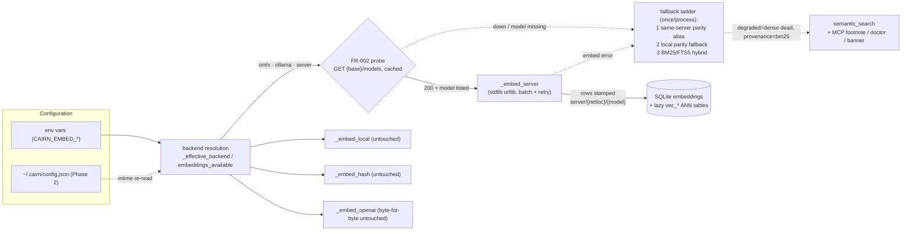
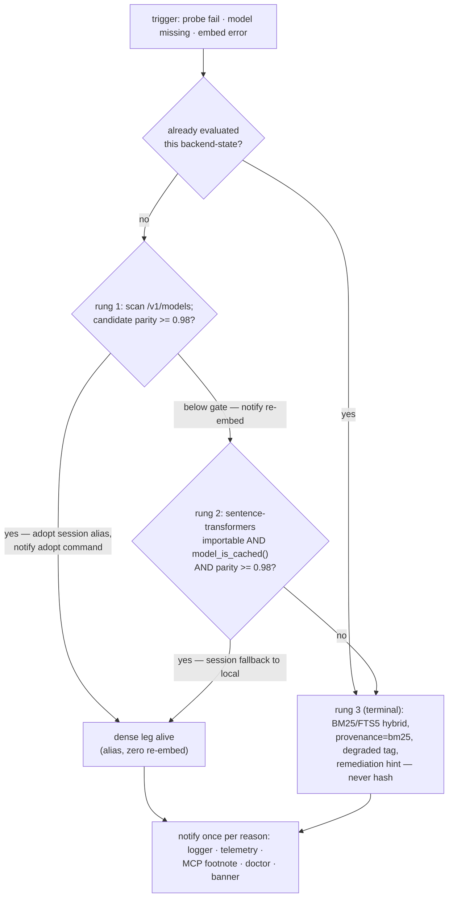
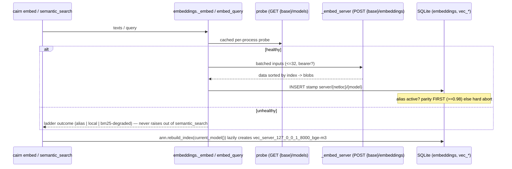

# Tech Spec: embedding-server-backend

**Spec**: [spec.md](spec.md) | **Created**: 2026-08-27
**Every file/symbol citation below must come verbatim from [survey.md](survey.md)
or a grep run in this session — never from memory.**

Session-run grep evidence beyond survey.md (recorded here; commands verbatim):

```text
$ rg -n 'def embed_query|def is_hash_fallback|def model_is_cached|def _get_local_model' src/cairn/graph/embeddings.py
344:def is_hash_fallback() -> bool:
385:def model_is_cached(model_name: Optional[str] = None) -> bool:
649:def _get_local_model(model_name: Optional[str] = None):
1245:def embed_query(text: str) -> Tuple[bytes, int]:

$ rg -n 'embed_query' src/cairn --type py   # call sites only
src/cairn/knowledge/search.py:253:        q_blob, q_dim = emb.embed_query(query)
src/cairn/memory/promotion.py:311:        q_blob, q_dim = emb.embed_query(query)
src/cairn/memory/promotion.py:581:        q_blob, dim = emb.embed_query(new_text)
src/cairn/graph/semantic.py:769:        q_blob, q_dim = emb.embed_query(dense_text)   # also survey S04

$ rg -n 'unembedded_memory_hint' src/cairn --type py
src/cairn/graph/embeddings.py:1478:def unembedded_memory_hint(conn, bundle) -> str:
src/cairn/mcp_server/tools_memory.py:52,164   # MCP result-footnote consumers
src/cairn/cli/memory.py:114,296               # CLI consumers

$ sed -n '344,353p' src/cairn/graph/embeddings.py
def is_hash_fallback() -> bool:
    """True when embeddings silently use the dep-free hash backend. ..."""
    return _effective_backend() == "hash" and _backend_name() == "local"
```

## Architecture



The feature is an **additive fourth family** inside the existing dispatch hub
`src/cairn/graph/embeddings.py`. Today that module owns backend identity
end-to-end: `_backend_name()` reads `CAIRN_EMBED_BACKEND`
(embeddings.py:297-298), `_effective_backend()` caches into
`_EFFECTIVE_BACKEND_CACHE` and falls back local→hash on ImportError
(embeddings.py:323-341), `embeddings_available()` answers readiness
(embeddings.py:65-83), `_embed()` is the sole dispatch point fan-out to six
callers (embeddings.py:806-813), and `current_model()` derives the stamp every
corpus writer reads (embeddings.py:39-57). The server family plugs into exactly
those four seams plus three auxiliary seams — warmup gating
(`_warm_embedder`, model_warmup.py:154-173, local-only today), semantic_search
error handling (unwrapped `emb.embed_query` at semantic.py:769), and telemetry
(warn_once/emit template, events.py:138-194). Nothing downstream knows how
blobs were produced: rows land as `(symbol_id, model=stamp, blob)` tuples and
ANN tables derive names via `re.sub(r"[^a-zA-Z0-9_]", "_", model)`
(ann_index.py:149-165), so a stamp `server/127.0.0.1:8000/bge-m3` becomes
`vec_server_127_0_0_1_8000_bge-m3` with zero schema work — the pivot the whole
design stands on (survey S03 + supporting evidence "Stamping flow").

## Solution

### Chosen approach

A new `server` backend family (`server` | `omlx` | `ollama`, presets differing
only in default base URL) implemented as **additive branches in the four
dispatch seams**, a small **stdlib-urllib client** beside `_embed_openai`,
and a **once-per-process parity-verified fallback ladder** living in a new
sibling module so the embeddings hub stays dispatch-only. Phased per spec A5:
Phase 1 = FR-001..FR-007, FR-012, FR-013(logger/telemetry/footnote/doctor);
Phase 2 = FR-008, FR-010, FR-011 + banner.

**FR coverage map**

| FR | Solution element |
|----|------------------|
| FR-001 | `_effective_backend()` branch: `omlx`/`ollama`/`server` resolve to `server`; presets `http://127.0.0.1:8000/v1` / `http://127.0.0.1:11434/v1`; bare `server` requires `CAIRN_EMBED_BASE_URL` |
| FR-002 | `embeddings_available()` server arm: cached `GET {base}/models` probe (2 s timeout, optional bearer), 200 AND model id listed; no hash coalescing — `is_hash_fallback()` (`== "hash" and _backend_name() == "local"`, session grep) cannot turn true for a server config |
| FR-003 | `_embed_server`: `CAIRN_EMBED_SERVER_BATCH` (default 32) chunking, retry ×3 exp backoff 0.5/1/2 s jittered on conn-error/timeout/5xx/429, other 4xx fail with server message verbatim (oMLX emits OpenAI-shaped `not_found_error`/`authentication_error` — research.md), `CAIRN_EMBED_TIMEOUT` (30 s), mixed-dimension batch rejection |
| FR-004 | `current_model()` server arm derives `server/{netloc}/{model}`; `CAIRN_EMBED_MODEL_STAMP` overrides; flows unmodified through `_table_name()` (ann_index.py:149) |
| FR-005 | Preflight in embed writers: when an alias stamp is active, sample ≤16 stored chunks, dim match + mean cosine ≥ 0.98 BEFORE first INSERT; abort hard with measured value otherwise |
| FR-006 | `_warm_embedder` gains a server arm: one tiny `/v1/embeddings` POST inside the existing daemon-thread guard set (warm_models' try/except warning, `PYTEST_CURRENT_TEST`, offline guard — survey S05) |
| FR-007 | New `EMBED_SERVER_DEGRADED` event (events.py catalog + `__init__.py __all__`) with reason enum, emitted via the `emit()`/`warn_once()` template; `_check_embed_server` joins the `_run_doctor` check list (system.py:1231-1266): probe, model-listing, parity-sample, latency |
| FR-008 | `install_hint()` (embeddings.py:86-92) mentions the no-torch server path; docs/configuration.md + docs/retrieval.md gain server/omlx/ollama rows (both currently have zero hits — survey S11), incl. oMLX safetensors conversion + privacy note |
| FR-009 | Zero edits to `_embed_hash`, `_embed_local`, `_embed_openai` bodies, their env names, or `OPENAI_API_KEY` semantics; all additions are new arms behind new values |
| FR-010 | New `~/.cairn/config.json` loader (sibling of the `_load_registry` pattern in paths.py:120-128) returning effective values env > file > default with mtime-triggered re-read; folded into the `reset_backend_cache()` invalidation contract |
| FR-011 | Dashboard: `Route("/settings", ..., methods=["POST"])` + `Route("/embeddings", status view)` appended to the 17-entry routes list (app.py:583-606); settings.html/embeddings.html templates; loopback enforced by existing `DEFAULT_HOST = "127.0.0.1"` + `_require_loopback` (app.py:32-33, cli/dashboard.py:20-31); base-URL change needs explicit confirm; API key write-only |
| FR-012 | Ladder module (`graph/embed_ladder.py`) evaluated once per process per backend-state on probe-fail/model-miss/embed-error; rung 1 same-server parity alias (session-scoped), rung 2 parity-gated local, rung 3 BM25/FTS5 with `provenance="bm25"` (semantic.py:995) + new `degraded` field + remediation hint; try/except introduced around the dense leg in `semantic_search`/`_run_pass` |
| FR-013 | One notification fan-out per reason: `warn_once(key, ...)` logger line, `emit(EMBED_SERVER_DEGRADED, reason=<enum>)`, MCP result footnote modeled on the `unembedded_memory_hint` append pattern (session grep: tools_memory.py:52,164), doctor entry, dashboard banner |

**Ladder decision flow** (the load-bearing picture):



**Embed/query interaction with stamps and ANN** (second load-bearing picture):



Why this shape holds: research.md's live verification showed identical-weight
vectors are numerically interchangeable (cosine 1.000000, truncation bounded
worst case 0.991, unit-norm both sides), which legitimizes stamps as *producer
identity* while the alias remains a *verified exception* — no other subsystem
(cosine everywhere: `cosine_scan`, vec0 cosine metric) needs to know. The
stamps-as-strings-in-existing-columns fact (survey S03) removes schema risk,
matching the owner's binding constraints (default-off, no new deps, no
migration).

### Alternatives rejected

| Alternative | Why rejected |
|-------------|--------------|
| Extend `openai` backend with a base-url env | Couples keyless-preset local-server semantics onto a cloud backend; puts FR-009's zero-regression surface in play (research.md "Backend shape") |
| Bare model id as stamp | Switches producers silently under one stamp — exactly the failure SC-3 forbids; loses netloc from producer identity (research.md "Model-stamp identity") |
| httpx / requests client | New runtime dependency violates the binding constraint; measured ~100 ms/query urllib overhead is marginal at 1-2 embed_query calls per search (research.md "HTTP client", D-006) |
| Silent model substitution on failure | Fastest but mixes vector spaces — worst failure mode (research.md "Degradation"); replaced by parity-gated loud ladder |
| Hard fail, no ladder | Loses search entirely on transient server loss; US3 requires continued BM25/FTS5 hybrid (research.md "Degradation") |
| Per-corpus server models in v1 | Explicitly deferred in spec Scope; single model mirrors today's openai shape (D-005) |

## Impact analysis

**Touched seams and who depends on them** (all caller lists from survey
"Backend dispatch consumer inventory" unless noted):

- `_effective_backend()` (embeddings.py:323) — direct callers: `current_model`,
  `is_hash_fallback`, `embeddings_available`, `_embed`, `_warm_embedder`
  (5); everything downstream inherits any mistake here. Adding arms without
  touching existing branches preserves FR-009. Caveat: server values must NOT
  fall into the ImportError→`hash` branch, or `is_hash_fallback()` flips true
  (its guard is `effective == "hash" and configured == "local"` — session
  grep) and every query path starts printing hash-degraded warnings.
- `_embed()` (embeddings.py:806) — sole dispatch point for embed_all,
  embed_symbols, embed_knowledge, embed_memory, embed_memory_concepts,
  embed_query. One wrong return type breaks all six. Contract to preserve:
  `Tuple[List[bytes], int]`.
- `current_model()` (embeddings.py:39) — 10 direct callers: embed_all,
  embed_symbols, embed_knowledge, embed_memory, embed_memory_concepts,
  purge_stale_models, ann_query, _check_ann, _check_embeddings, CLI embed.
  **Biggest blast radius in the change.** If the derived stamp formats
  differently than documented, ANN table names move (via `_table_name`),
  staleness flips, and doctor reports the wrong backend. Keep
  `CAIRN_EMBED_MODEL_STAMP` as a pure override consulted first.
- `embeddings_available()` (embeddings.py:65) — CLI embed (line 74), CLI
  semantic (line 245), `--download-model` (line 63). The FR-002 probe adds a
  network round-trip to a currently-sync free function; the 2 s timeout +
  process-level cache bounds it. CLI embed's `sys.exit(1)` sites (embed.py:53,
  66, 78, 262) must print the remediation hint in the server-down case.
- `reset_backend_cache()` (embeddings.py:314) — called by ensure_semantic_deps,
  7+ test files, conftest.py:132-134. Extending its invalidation to probe and
  ladder state keeps those fixtures correct; forgetting it poisons every test
  that toggles backends.
- `purge_stale_models` (embeddings.py:682) — defined, ZERO call sites (survey
  S03 + supporting evidence "defined, never called"). Do not build migration
  logic that assumes it purges anything; cleanup relies on stamps changing.
- `emb.embed_query` at semantic.py:769 — uncaught today (survey S04: verified
  propagation through `_run_pass` at 1012). Our try/except changes visible
  behavior for ALL backends on embed failure: raise → degraded hybrid result.
  That is the intended Phase-1 fix (spec A5), not a regression; the happy path
  is untouched, satisfying FR-009.
- Additional dense-leg consumers OUTSIDE semantic_search (session grep):
  knowledge/search.py:253, memory/promotion.py:311, promotion.py:581. They get
  probe-gating + session ladder state for free (their failures collapse to the
  already-evaluated rung), but spec mandates no catch wrapper there — residual:
  a hard error at those exact lines still propagates. Accepted, reported to
  orchestrator; semantch-heavy flows are covered.
- MCP memory embeds — `embed_buffering.py` `_flush()` retries infinitely,
  emitting EMBED_FLUSH_STALLED after repeated failures (survey S06). A down
  server surfaces there as stall warnings, never data loss; no change needed.
- Dashboard — zero POST routes today (17 GET/Mount entries, app.py:583-606);
  adding `methods=["POST"]` routes ends the read-only era. Mitigations are
  binding: loopback `DEFAULT_HOST = "127.0.0.1"` + `_require_loopback`
  (cli/dashboard.py:20-31), confirm step for base-URL, write-only key.
- Telemetry — `emit()` swallows its own exceptions at debug level
  (events.py:138-164), so degradation UX must not hinge on emit alone; the
  logger line carries the user-facing weight. Quirk: `warn_once()` refuses to
  log when `sink.is_telemetry_off()` (events.py:179-194) — a user-facing
  degraded warning suppressed by `--no-telemetry` would violate US3 AC3; the
  server degraded warner guards with its own once-set and leaves the
  telemetry-gated variant to event emission (see D-010).
- Resolution precision note (common-name caveat): `embed_query`,
  `current_model`, `reset_backend_cache` are distinctive enough for exact
  matching; my `embed_query` grep relied on textual hits, each manually
  confirmed as a real call site against surrounding context in this session —
  no unresolved bare-name ambiguity found in src/.

## Code guide

### Area 1 — Server client + backend resolution
- Touches: `_backend_name`, `_effective_backend`, `embeddings_available`,
  `_embed`, `current_model` in `src/cairn/graph/embeddings.py`; NEW
  `_embed_server` beside `_embed_openai` (its urllib-in-function import and
  `data.sort(key=lambda d: d["index"])` style at embeddings.py:732-753 is the
  verbatim template, extended with batching/retry).
- Approach: new arms keyed on the `server` family only; presets map
  backend-name→default base URL; bearer header only when
  `CAIRN_EMBED_API_KEY` set; decode via existing `_floats_to_blob`; reject
  mixed-dimension batches (compare response dim against request-consensus).
- Verify before implementing: `uv run --extra dev pytest tests/test_embedding_backend_quality.py -q` (13 tests green today — survey S12) and
  `rg -n 'CAIRN_EMBED_BASE_URL' src/` (expected: zero hits — survey S01 gap).
- Pitfalls: `_EFFECTIVE_BACKEND_CACHE` must be invalidated for server values
  too (see Area 6); never let a server name reach the ImportError→`hash`
  branch; FR-003 wants the 4xx body/message verbatim — oMLX returns
  OpenAI-shaped `not_found_error` listing available ids (research.md), which
  doubles as the remediation text.

### Area 2 — Probe / ladder state machine
- Touches: NEW module `graph/embed_ladder.py` under src/cairn/graph (probe result cache, reason
  enum, rung evaluation); call sites in `_embed`/`embed_query` (state read)
  and `semantic_search`/`_run_pass` in `src/cairn/graph/semantic.py` (the
  new try/except around `emb.embed_query` at semantic.py:769 / `_run_pass`
  at semantic.py:1012); `reset_backend_cache` gains a hook to drop ladder
  state; `cairn embed --adopt-server-model` flag on the CLI command block
  (cli/embed.py:10-42, no such option exists — survey S13 gap).
- Approach: evaluate at most once per process per backend-state; rungs per
  spec A2.7 (scan `/v1/models` → parity per candidate → session alias;
  else local arm requiring `model_is_cached()` (embeddings.py:385) + parity;
  else terminal BM25 with `provenance="bm25"` (semantic.py:995)); results of
  rung 3 add `"degraded"` + remediation-hint keys — none exist today (survey
  S04 gap: only `_fusion_degraded`/`_rerank_degraded` internal flags).
- Verify before implementing: `uv run --extra dev pytest tests/test_semantic_unavailable.py tests/test_semantic_events.py -q` (22 baseline tests) and
  `rg -rn '"degraded"' src/cairn/graph/semantic.py` (expected zero dict-key
  hits — survey S04).
- Pitfalls: hash is never a rung (hard rule; also structurally safe via
  `is_hash_fallback`'s conjunction); rung 1 parity costs ~16 server embeds per
  candidate — keep the once-per-process cache or a flapping server hammers it;
  `tools_compass.py:166` reads `result.get("degraded")` on compass results —
  new field lands on semantic_search results only, don't cross-wire.

### Area 3 — Stamp / alias / parity
- Touches: `current_model()` (embeddings.py:39) for `server/{netloc}/{model}`
  + `CAIRN_EMBED_MODEL_STAMP` override; preflight parity (sample ≤16 stored
  chunks, gate 0.98, dim match) hoisted into embed writers before the first
  INSERT at embeddings.py:1074-1082's `ON CONFLICT(symbol_id, model)` upsert;
  vec0 naming left alone — `_table_name` (ann_index.py:149-165) sanitizes
  netloc punctuation automatically (supporting evidence: `vec_server_127_0_0_
  1_8000_bge-m3`).
- Approach: alias mechanics shared by permanent migration (env/config stamp
  override) and session adoption (in-process override); parity function lives
  in the ladder module so doctor and the dashboard button reuse it.
- Verify before implementing: `rg -rn 'purge_stale_models' src/ --include='*.py'` (expect ONLY the embeddings.py:682 def — survey S03) and
  `sed -n '149,165p' src/cairn/graph/ann_index.py`.
- Pitfalls: `purge_stale_models` is dead code — nothing prunes old-stamp
  rows or their vec tables automatically; old-model vectors simply stop being
  queried under the new stamp. Do not "fix" that inside this spec.
  Truncation divergence (>512-token inputs → cosine 0.991) sits ABOVE the
  0.98 gate by design (D-004/D-007) — sampling must exclude pathological
  >max-token chunks or accept they still pass.

### Area 4 — Warmup
- Touches: `_warm_embedder` (model_warmup.py:154-173, currently
  `if embeddings._effective_backend() != "local" ... return`) and the guard
  set in `warm_models_in_background` (81-105) / `warm_models` (108-132).
- Approach: server arm issues ONE tiny `/v1/embeddings` POST (triggers
  server-side lazy load — research.md latency finding) inside the existing
  blanket try/except that warns non-fatally; keep `_inside_pytest()`
  (141-151) and offline-guard behavior byte-identical.
- Verify before implementing: `uv run --extra dev pytest tests/test_model_warmup.py -q` (23 tests, incl. test_openai_backend_skips_embed_model — survey S05/S12).
- Pitfalls: the current early-return for non-local also skips server — a naive
  OR of conditions must not let server warmup run when weights aren't cached
  yet isn't relevant server-side, but must not double-probe if
  `embeddings_available()` already succeeded (share the cached probe).

### Area 5 — Telemetry / doctor
- Touches: `EMBED_SERVER_DEGRADED` constant in `src/cairn/telemetry/events.py`
  catalog (currently 11 events, zero hits for the name — survey S07) +
  `__init__.py` re-export list; reason-enum precedent
  `_SEMANTIC_REASONS` frozenset; new `_check_embed_server` slotted into
  `_run_doctor`'s return list (system.py:1231-1266) using the `_result` shape
  (system.py:740-742) and PASS/WARN/FAIL constants (727-729).
- Approach: emit host+model attributes only, never request bodies (spec
  A2.6); doctor arms: probe, model-listing, parity-sample, latency; exit
  semantics untouched (27-test suite must stay green — survey S08/S12).
- Verify before implementing: `uv run --extra dev pytest tests/test_doctor.py tests/test_semantic_events.py -q`.
- Pitfalls: `_check_config` (system.py:1191-1206) echoes only env vars — in
  Phase 2 it must learn the file layer or the dashboard-vs-env truth diverges
  in doctor output; RERANK_SKIPPED is NOT in `__init__.py.__all__` (imported
  directly by semantic.py, survey S07) — pick the re-export convention
  deliberately, don't copy the inconsistency.

### Area 6 — Config substrate
- Touches: NEW small loader reading `$CAIRN_HOME/config.json` (CAIRN_HOME
  bound at import time, paths.py:29-31; REGISTRY_FILE/`_load_registry`
  pattern with try/except JSONDecodeError/OSError at paths.py:120-128 is the
  structural precedent — survey S10); wired into `_backend_name`/
  `current_model`/preset lookups via an env-or-file resolver; mtime-based
  re-read keyed alongside the per-process caches; cleared by
  `reset_backend_cache()`.
- Approach: env > file > default at a single choke point so every accessor
  inherits precedence once (D-008); dashboard writes the file (Area 7).
- Verify before implementing: `rg -rn 'config.json' src/cairn/paths.py`
  (expected: zero — survey S10), confirming no prior art to collide with.
- Pitfalls: CAIRN_HOME import-time binding means tests must monkeypatch the
  path variable the module actually read, not the env var afterwards; corrupt
  JSON must degrade to defaults-with-warning (registry precedent), never raise
  into every embed call.

### Area 7 — Dashboard Settings + status
- Touches: `routes` list tail (app.py:583-606 — first-ever `methods=["POST"]`
  entries), handler functions in `src/cairn/dashboard/app.py`, NEW
  `settings.html` + `embeddings.html` in `src/cairn/dashboard/templates/`
  (12 files today, zero 'setting' hits — survey S09); loopback re-checked via
  cli/dashboard.py `_require_loopback` (20-31).
- Approach: POST /settings persists through the Area 6 loader (write-only key
  handling: store, never echo; masked placeholder), confirm-required form
  step for base-URL changes, "Run parity check" button calling the Area 3
  function, status view reading effective backend / resolved stamp /
  per-corpus counts / probe health / active rung as banner. oMLX's /admin is
  UX reference for this section only (binding constraint).
- Verify before implementing: `uv run --extra dev pytest tests/test_dashboard_app.py -q` (69 tests) and
  `rg -n 'methods=\["POST"\]' src/cairn/dashboard/app.py` (expected zero — survey S09).
- Pitfalls: every existing dashboard test assumes GET-only read-only behavior;
  keep new handlers off existing routes; live processes pick up config changes
  without restart only via the mtime re-read (US4 AC1) — caching outside the
  loader's contract silently breaks that promise.

### Area 8 — Docs + install_hint
- Touches: `install_hint()` text (embeddings.py:86-92), docs/configuration.md
  (mentions CAIRN_EMBED_BACKEND at line 50, hash fallback at 83),
  docs/retrieval.md table row 74 (backends local/hash/openai — survey S11);
  neither mentions server/omlx/ollama (verify grep expected zero).
- Approach: document all seven A2.1 env vars, presets, probe semantics, the
  ladder, oMLX safetensors conversion (spec Appendix C), privacy note
  (embedding input goes to the configured URL; localhost default — spec A2.6).
- Verify before implementing: `grep -n 'server\|omlx\|ollama' docs/configuration.md docs/retrieval.md` (expected zero hits — survey S11).
- Pitfalls: docs drive agent behavior too — state the "run doctor after
  re-pulling models" rule (spec risk mitigation) in retrieval.md, not just
  configuration.md.

## References

From research.md / spec.md:
- https://github.com/jundot/omlx + https://omlx.ai/ — primary target server:
  `/v1/embeddings` (+deferred `/v1/rerank`), model auto-discovery, Apache-2.0;
  source of the auth/safetensors quirks FR-008 documents.
- https://ollama.com/library/bge-m3 — official bge-m3 (1024-dim) validating
  the `ollama` preset (`:11434/v1`); docs-verified only (research.md).
- https://github.com/waybarrios/vllm-mlx — evidence LM Studio/llama.cpp/vLLM
  share the endpoint shape; justifies the one-generic-client bet (med
  confidence — keep the client shape-strict, presets loose).
- [spec.md](spec.md) Appendix C — reproducible torch→safetensors conversion;
  paste into configuration.md (docs-only onboarding, no code workaround).
- Live measurement block (2026-08-27, this Mac) in spec.md A1 — parity and
  latency numbers behind gates D-006/D-007; treat as acceptance envelope for
  QA, not marketing numbers.
- Local follow-ons referenced by survey: docs/configuration.md,
  docs/retrieval.md (edit targets); tests/test_embedding_backend_quality.py
  et al. (baseline suites that must stay green per FR-009 / survey S12).

## Decisions

### D-001: New `server` backend; `openai` untouched
- **Context**: Users need keyless local `/v1/embeddings`; the existing
  `openai` backend hardcodes `https://api.openai.com` and requires
  OPENAI_API_KEY (survey S02), and FR-009 demands byte-for-byte stability of
  local/hash/openai.
- **Decision**: Add a third family (`server`/`omlx`/`ollama`) as new arms in
  the dispatch seams; `_embed_openai` (embeddings.py:732-753) and friends are
  copied-from-template, never edited.
- **Consequences**: Zero regression surface for existing CI/tests (SC-4);
  some near-duplicate HTTP code between the two clients — accepted in exchange
  for the frozen cloud path; future refactor may extract a shared helper only
  if openai's freeze lifts.

### D-002: Stamp includes the server netloc
- **Context**: Producer identity equals vector identity; a port or server swap
  silently changes numeric space, and `current_model()` drives staleness, ANN
  table names (`_table_name`, ann_index.py:149), and the upsert key
  `(symbol_id, model)` (embeddings.py:1074-1082).
- **Decision**: Derived stamp `server/{netloc}/{model}`; netloc participates
  in `re.sub(r"[^a-zA-Z0-9_]", "_", model)` table sanitization; switching
  producer re-embeds via existing stamp-change staleness (survey supporting
  evidence — purge_stale_models is dead code, so stamping is the only lever).
- **Consequences**: No schema change (strings in existing columns); table
  names like `vec_server_127_0_0_1_8000_bge-m3`; changing ports deliberately
  costs a re-embed unless the alias gate proves compatibility.

### D-003: No silent hash fallback on server errors
- **Context**: Hash vectors are token-overlap stand-ins, incomparable with
  dense rows; today only `local`-without-deps coalesces to hash
  (embeddings.py:323-341).
- **Decision**: The server family never resolves to or degrades into hash;
  failures run the loud ladder (or exit 1 from `cairn embed`, per
  cli/embed.py:53/66/78 precedent).
- **Consequences**: `is_hash_fallback()` provably stays False for server
  configs (conjunction with `_backend_name() == "local"` — session grep);
  probing/check logic can rely on "server ⇒ dense-or-hybrid, never hash".

### D-004: Client-side truncation stays as-is
- **Context**: sentence-transformers caps sequences server-independently; our
  chunks are capped at `max_tokens*4` chars client-side (spec A1
  conclusions), leaving >512-token inputs as the only divergence source
  (measured 0.991).
- **Decision**: No new truncation logic for the server client; the char cap
  and ST-side behavior remain the single source of length policy.
- **Consequences**: Worst-case cross-producer drift is bounded at 0.991,
  comfortably above the 0.98 gate; any future server-side truncation knob is
  out of scope for this spec.

### D-005: Single server model for all corpora in v1
- **Context**: `openai` today serves one model corpus-wide via
  `CAIRN_EMBED_OPENAI_MODEL` (current_model, embeddings.py:39-57); per-corpus
  overrides exist only for local knowledge/memory envs
  (`_CORPUS_MODEL_ENV`, embeddings.py:33-36).
- **Decision**: One `CAIRN_EMBED_SERVER_MODEL` feeds code, knowledge, and
  memory alike.
- **Consequences**: One stamp per deployment simplifies parity preflight and
  ladder rung 1; multi-model configs remain impossible rather than flaky;
  explicitly deferred per spec Scope.

### D-006: urllib, no new dependency
- **Context**: Binding constraint (owner); measured overhead ~100 ms/query
  including JSON encode/decode of 1024 floats (research.md latency finding),
  at 1-2 embed_query calls per search.
- **Decision**: `urllib.request` exactly as `_embed_openai` does
  (embeddings.py:732-753, `import urllib.request` inside the function).
- **Consequences**: No keep-alive/pooling (out of scope per spec); dependency
  install story stays "zero new wheels"; escape hatch documented as a future
  perf item, not built now.

### D-007: Parity gate threshold 0.98
- **Context**: Empirical regime split: same-weights cosine ≈ 1.000000 with
  noise floor to 0.991 (truncation); unrelated models fall far below 0.9
  (spec A1/A2.4; research.md).
- **Decision**: Mean cosine over ≤16 sampled stored chunks, gate 0.98, dim
  match required — applied identically to alias preflight (FR-005), ladder
  rungs, and doctor parity-sample.
- **Consequences**: One constant `0.98` referenced by three features (pick a
  module-level named constant; env override intentionally absent to keep the
  credential meaningful); gate failures always print the measured value.

### D-008: Env > config file > default
- **Context**: FR-010 introduces `~/.cairn/config.json` while the entire test
  doctrine and CI configure via env vars; dashboards write files humans don't
  want shadowing shell profiles.
- **Decision**: All seven knobs resolve through one env-or-file-or-default
  choke point; file wins only when env is unset; mtime change triggers re-read;
  `reset_backend_cache()` clears derived caches (contract per survey S01/S12
  fixture usage).
- **Consequences**: Existing env-driven tests untouched; dashboard saves can
  appear ineffective when the user exports the var — settings UI must show
  effective value AND whether env pinned it; file corruption degrades to
  defaults (Area 6 pitfall).

### D-009: A different model id never silently serves the dense leg
- **Context**: Servers rename/redistribute models under stable ids; serving
  different weights against stored rows would poison ranking invisibly
  (spec risk; research.md silent-substitution rejection).
- **Decision**: Only a passing parity gate switches producers — and then only
  session-scoped via alias, with FR-013 notification naming the explicit
  permanent command (`cairn embed --adopt-server-model`, new flag per survey
  S13 gap, or dashboard action). Everything below gate = notified degradation.
- **Consequences**: Adoption requires proof; permanence requires an act;
  probe/doctor/embed force re-evaluation by clearing state; evaluation cost
  (~16 embeds/candidate) is bounded by the once-per-process cache (spec A4).

### D-010: Notifications reuse existing patterns
- **Context**: Five notification surfaces demanded by FR-013; inventing new
  channels would fragment observability (patterns surveyed: warn_once/emit at
  events.py:138-194, HASH_FALLBACK precedent events.py:42, MCP footnote à la
  `unembedded_memory_hint` at embeddings.py:1478 consumed at
  tools_memory.py:52,164, doctor `_result` entries, dashboard page).
- **Decision**: Mirror those five patterns with one shared
  "notify_degradation(reason)" helper so all surfaces fire-or-suppress
  together; reason enum frozen to the six FR-013 values.
- **Consequences**: `warn_once`'s `is_telemetry_off()` gate
  (events.py:179-194) must NOT govern the user-facing logger line (US3 AC3
  requires it unconditionally once) — the helper uses a private once-set for
  logging and reserves the telemetry-gated variant for event emission; payload
  limited to host+model (spec A2.6 privacy stance).

### D-011: Ladder state lives in a dedicated sibling module; semantic_search's catch is generic
- **Context**: The uncaught `emb.embed_query` at semantic.py:769 (survey S04)
  bites every backend; but rungs 1-2 are server-specific, and stuffing state
  machine + parity sampling into the already-large embeddings hub entangles
  dispatch with policy.
- **Decision**: New module `graph/embed_ladder.py` (under src/cairn/graph) owns probe-result cache,
  parity sampling, reason enum, rung evaluation; embeddings.py consumes it;
  the try/except in semantic_search catches embed errors for ALL backends,
  mapping any hard failure to rung 3 semantics when no higher rung applies
  (spec A5 declares this Phase-1 gap fix intentional).
- **Consequences**: First embed error for local/openai users becomes a
  degraded hybrid result instead of a raised exception — deliberate, in-spec;
  knowledge/search.py:253 and memory/promotion.py:311/581 stay unwrapped
  (residual reported to orchestrator); ladder state joins
  `reset_backend_cache()`'s invalidation list so test fixtures behave.

### D-012: Doctor gains a conditional `_check_embed_server` (default output byte-stable)
- **Context**: `_run_doctor` returns a fixed 8-check list (system.py:1231-1266)
  and `_check_config` always passes echoing env (survey S08); server checks
  require network I/O that must not slow default-configured machines.
- **Decision**: Append `_check_embed_server` that self-short-circuits to a
  single informational PASS line when the backend family isn't server;
  full probe/model-listing/parity-sample/latency arms only when configured;
  PARITY failures WARN (advice), probe failures FAIL with remediation hint.
- **Consequences**: 27-test doctor suite stays green unchanged; the "run
  doctor after re-pulling models" documentation rule (D/A4 risk) has a real
  check to point at; exit semantics untouched per FR-007.
