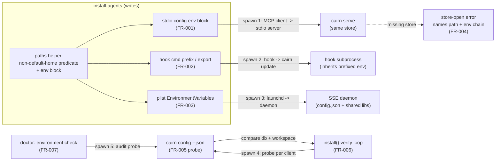

# Tech Spec: env-propagation

**Spec**: [spec.md](spec.md) | **Created**: 2026-08-28
**Every file/symbol citation below must come verbatim from [survey.md](survey.md)
or a grep run in this session — never from memory.**
Session-derived data (cairn graph queries + file reads, this session) is
marked **[session]**; everything else is survey.md-verbatim.

## Architecture

Today, env crosses exactly one of the five process-spawn boundaries — launchd →
daemon, and only `CAIRN_WORKSPACE`/`CAIRN_DB`/`CAIRN_KNOWLEDGE`, never
`CAIRN_HOME` (lifecycle.py:84-97). A client-spawned stdio server with no env
"resolves via cwd ancestor-walk under the DEFAULT home — the silent-wrong-store
mechanism of issue #70" (survey, MCP server env contract). The design adds one
shared predicate in `paths.py` and threads it through every generator, plus a
probe/verify loop and a doctor audit that observe the same resolution chain.

One paragraph: the five boundaries are (1) MCP client → stdio `cairn serve`
(config `env` block, proven shape by claude_desktop.py:32-35), (2) hook
spawner → hook process → `cairn update` subprocess (env-prefix in the command
string; claude_hooks.py:44-51 already inherits the spawner's env verbatim),
(3) launchd → LaunchAgent daemon (plist `EnvironmentVariables`, lifecycle.py:84-97),
(4) installer → probe process (`cairn config --json`, FR-005), (5) doctor →
audit probes (FR-007). Boundaries 1–3 are *writers* of `CAIRN_HOME`; 4–5 are
*readers* that verify what 1–3 wrote. `CAIRN_HOME` is the propagation key
because cwd-having clients keep multi-workspace registry resolution
(paths.py:285-302); claude-desktop keeps its existing `CAIRN_WORKSPACE` pin
(claude_desktop.py:32-35) and gains `CAIRN_HOME` alongside it (D-003).
Plist propagation suffices for AC3 because `REGISTRY_FILE`/`CONFIG_FILE`/
`SHARED_LIB` are all "bound at import" from `CAIRN_HOME` (paths.py:35/40/52,
survey supporting evidence).

## Solution

### Chosen approach

**One predicate, five writers, two observers.** A single helper pair in
`src/cairn/paths.py` — next to the `CAIRN_HOME` binding at paths.py:31-33 —
owns the non-default ruling (D-001/D-002):

- `cairn_home_is_default() -> bool` — expanded-absolute-path equality against
  `Path.home() / ".cairn"` (spec FR-001 ruling on survey Unknown #4).
- `cairn_home_env() -> dict[str, str]` — `{}` when default, else
  `{"CAIRN_HOME": <expanded path>}`. Returning `{}` (never `None`) is what
  makes AC5 (byte-identical default output) a one-line guard in every generator.

paths.py is the home because every writer already depends on it (it owns the
resolution chain, survey supporting evidence) and because two of the five
writers (`mcp_server/lifecycle.py`, `cli/system.py`) must not import installer
internals — `agent_install` is a CLI-side package (its own docstring:
"Kept separate from detect/merge/clients so no module imports a sibling
client" **[session]**), while lifecycle.py today imports nothing from it.

FR coverage:

- **FR-001** — `mcp_config_json` stdio branch (_common.py:111-117) and the four
  per-shape variants (`zcode_mcp_config_json` zcode.py:48-52,
  `opencode_mcp_config_json` opencode.py:53-54, `kilo_mcp_config_json` kilo:28,
  `agy_mcp_config_json` agy.py:50-54) merge `cairn_home_env()` into the cairn
  entry dict only when `transport == "stdio"` and the dict is non-empty.
  `mcp_config_json_desktop` (claude_desktop.py:32-35) adds `CAIRN_HOME` to its
  existing `CAIRN_WORKSPACE` env dict (D-003). Idempotence is already proven:
  merge.py:256-258 "Also compare env (Claude Desktop pins CAIRN_WORKSPACE
  here). Absent env == {}". CLI-registered global claude/droid
  (claude.py:99-100, droid.py:58-59) get the degradation in D-006.
- **FR-002** — `_claude_hook_command` (_common.py:125-127) prepends
  `CAIRN_HOME=<path> ` to the command string when non-default; used by both
  hook writers (claude.py:45-63 merged at claude.py:133; cursor.py:26-37 merged
  at cursor.py:59). Uninstall matching is safe: it matches on the
  `cairn.hooks.claude_hooks <ep>` substring (merge.py:274-298,
  _common.py:130-139) — "an embedded env assignment inside the command string
  would not break matching" (survey, client matrix). The git post-commit
  template (git_hooks.py:32-38) gains one `export CAIRN_HOME="<path>"` line
  after the shebang when non-default (D-009). The hook runtime needs no change:
  claude_hooks.py:44-51 runs its subprocess "with NO env kwarg (inherits the
  hook-spawner's env verbatim)".
- **FR-003** — `render_plist` (lifecycle.py:84-97) consults the paths helper
  directly and sets `env["CAIRN_HOME"]`; no signature change (sole caller
  `serve_start` serve.py:130, session graph query). Consistent with how it
  already reads `PATH` from `os.environ` inline.
- **FR-004** — a `paths.py` helper renders the env-resolution chain (values of
  `CAIRN_HOME`/`CAIRN_WORKSPACE`/`CAIRN_DB`/`CAIRN_KNOWLEDGE` or "unset", plus
  the resolved db path — the chain is paths.py:285-302 + paths.py:305-318).
  The server boot guard catch-all (server.py:213-234, which today
  "interpolat[es] {e} verbatim") prints resolved `db_path` (already in scope
  at server.py:210 **[session]**), the chain, and the `CAIRN_HOME` remediation.
  The CLI path gets a pre-check in the db-open path (schema.py:729-754 "raises
  raw") that raises an enriched error when the store's parent directory is
  missing — doctor is unaffected because it prepends its own
  `"cannot open database: "` prefix (system.py:1426 **[session]**) and
  test_doctor.py:132-143 asserts that phrase in the doctor detail (D-008).
- **FR-005** — `cairn config --json`: emits `{"cairn_home", "workspace",
  "db", "knowledge"}` from one `resolve_store()` call (StorePaths at
  paths.py:101-114; `resolve_store` at paths.py:305-318). The command already
  assembles all four values in text (core.py:186-191) and already has one
  machine-readable flag (`--db`, core.py:150-170); `--json` mirrors the flag
  convention doctor already uses (system.py doctor `--json` option). The probe
  must be read-only — it must not trigger `resolve_store`'s auto-register side
  effect (docstring, paths.py:305-318 **[session]**) — see pitfalls.
- **FR-006** — the verify loop lives in `install()` after the installer loop
  (agent_install/__init__.py:299-304), not the CLI layer, so every `install()`
  caller gets it and the report printer (agents.py:157-174) only renders it.
  For each stdio, file-written registration: read the written config back,
  extract command+env, spawn `[command, "config", "--json"]` (probe args
  substituted for `serve`; binary and env exact — D-005) with cwd = target
  workspace, compare `db`+`workspace` against the installer process's
  install-time `resolve_store()`, and record per-client PASS/FAIL on a new
  defaulted `InstallResult` field (_common.py:36-44 — today it carries only
  "client/written/skipped/notes"). FAIL names both stores (AC7). Cost is one
  ~1s subprocess per client — "acceptable at install/doctor time, never on the
  hot path" (spec assumptions). SSE registrations (URL-based) and
  CLI-registered clients are not spawn-verified (D-006); the existing SSE note
  path (agents.py:198-201, `sse_daemon_reachable` agent_install/__init__.py:184-210)
  is unchanged.
- **FR-007** — one `environment` check appended to `_run_doctor`'s list
  (system.py:1466-1476), in **both** return paths: the healthy list and the
  degraded `_db_unavailable_results` list (the environment audit needs no db
  connection — precisely when the store is broken is when it matters).
  Sub-audits map to detail/hint of the `_result` shape (system.py:742-744):
  - (a) resolved-store existence: `Path(db).exists()` style check
    (system.py:1451-1454 pattern) — WARN when missing (schema already FAILs;
    mixed ruling forbids a second FAIL), hint `cairn init` + `cairn build`.
  - (b) registration consistency: enumerate installed clients via
    `check_installed` (detect.py:150-211, config paths detect.py:162-209);
    for each stdio registration run the FR-005/FR-006 spawn-probe and compare
    against the doctor's own store. Provable different-EXISTING-store → FAIL
    naming both; SSE endpoint → `sse_responds` (lifecycle.py:418-440),
    unreachable → FAIL; env merely missing on a stale registration with no
    provable mismatch → WARN "re-run `cairn install-agents`".
  - (c) platform/transport: SSE registration on non-darwin (the state exists
    today — `_common.py:105-110 sse branch is written on any OS while serve
    start exits 1 off-darwin, serve.py:105-108`; `is_macos` lifecycle.py:27-28)
    → WARN naming the macOS-only lifecycle ("LaunchAgent daemon management is
    macOS-only." lifecycle.py:383-386).
  - (d) binary coherence: `resolve_cg_command` (_common.py:67-76) vs
    `lifecycle.cg_bin` (lifecycle.py:43-53, `CAIRN_BIN` env > which >
    ~/.local/bin/cairn) vs the running binary → WARN naming both on mismatch.
  Check status = worst sub-audit (FAIL > WARN > PASS); exit contract
  (system.py:1527-1528, "1 iff any FAIL") and `--json` (system.py:1523-1524)
  need no change; `report` redacts details automatically via `_scrub_doctor`
  (system.py:1593-1607). AC8 holds: on the #70 machine, sub-audit (b) finds an
  SSE registration with no daemon (unreachable → FAIL) and (c) names the
  platform limitation. test_doctor.py:96-124 pins the 9-name sequence and must
  gain `"environment"` (D-007).

### Alternatives rejected

| Alternative | Why rejected |
|---|---|
| Predicate lives in `agent_install/_common.py` | lifecycle.py and cli/system.py are two of five writers and must not import installer internals; paths.py owns `CAIRN_HOME` (paths.py:31-33) and is imported everywhere already (survey supporting evidence) |
| Extend `cairn config --db` to print four delimited fields | `--db` is documented "Print only the resolved graph DB path" (core.py:150-170) — one field; four values need one JSON object, not a second delimiter dialect |
| New hidden probe command (`cairn _resolve-probe`) | Duplicates surface next to a command whose whole purpose is printing these four values (core.py:186-191); `cairn status` is worse — "No `--json` branch exists anywhere in the command" (system.py:422-423/463-485, survey) |
| Verify in CLI layer (`agents.py` after `report = install(...)`) | The SSE note precedent (agents.py:198-201) is a transport-wide note; per-client PASS/FAIL belongs on `InstallResult` so library callers get it; agents.py only prints |
| Literal FR-006 reading — spawn the registration's exact `serve` args | A spawned `cairn serve` is an MCP server that never exits (stdio server per client, _transport_note _common.py:353-366); probe args with exact binary+env verify the same resolution deterministically (D-005) |
| Feature-detect an `--env` flag on `claude mcp add` / `droid mcp add` at runtime | Survey Unknown #3 is explicitly unresolved evidence; help-text parsing is fragile and adds a subprocess — skip-and-note degrades deterministically (D-006) |
| Propagate env by replacing claude-desktop's `CAIRN_WORKSPACE` pin with `CAIRN_HOME` | Orchestrator ruling: desktop keeps the pin (it has "no cwd/workspace notion", claude_desktop.py:26-27); `CAIRN_HOME` is added alongside (D-003) |
| Multiple doctor checks (one per sub-audit) | Exit contract is binary over FAILs (system.py:1527-1528); four same-theme checks inflate the frozen sequence test (test_doctor.py:96-124) and the report for one question: "can clients reach this store" (D-007) |
| Embed env on SSE registrations too | SSE is URL-based ("type": "sse", "url" _common.py:105-110) — the daemon's env comes from the plist (FR-003), not the client; FR-001 is scoped to stdio |
| Enrich the error by changing `get_db`'s exception type | Doctor catches any exception and formats `cannot open database: {error}` (system.py:1426 **[session]**); keeping `sqlite3.OperationalError` with enriched text preserves test_doctor.py:132-143 (D-008) |

## Impact analysis

Blast radius from this session's precise graph queries (`get_callers` /
`impact_analysis`); file:line ground-truth from survey.md. Caveat: precise mode
under-reports for common names — `install`/`uninstall`/`config` are ambiguous
dispatch targets in this graph (e.g. `uninstall` "could dispatch to" 17 test
functions **[session]**), so counts below are precise-only; the survey's
hand-listed consumer sets are the fuzzy-complete complement.

| Symbol (survey citation) | Direct callers (session, precise) | Breaks if approach is wrong |
|---|---|---|
| `mcp_config_json` (_common.py:111-117 stdio branch) | 5: install_claude (claude.py:89), install_cursor (cursor.py:52), install_droid (droid.py:67), install_omp (omp.py:58), mcp_config_json_desktop (claude_desktop.py:32); depth-2 total 6 | Wrong env key shape → client rejects config; AC5 broken if env appears on default |
| 4 shape variants (zcode.py:48-52, opencode.py:53-54, kilo.py:28, agy.py:50-54) | 1 each (their `install_*`) | Same, per schema |
| `_claude_hook_command` (_common.py:125-127) | 4 call sites in 2 writers: claude_hooks_block (claude.py:52,59) → merged at claude.py:133; cursor_hooks_json (cursor.py:31,34) → merged at cursor.py:59 | Breaking the `cairn.hooks.claude_hooks <ep>` marker breaks uninstall matching (merge.py:274-298, _common.py:130-139) |
| `render_plist` (lifecycle.py:84-97) | 1: serve_start (serve.py:130) | Plist churn breaks `cairn serve start`; 6 lifecycle tests green at baseline (addendum) |
| `InstallResult` (_common.py:36-44) | 24 construction sites (9 installers, install_cross_tool, 2×uninstall, 12 in tests **[session]**) | New field MUST be defaulted or every installer/test breaks |
| `resolve_store` (paths.py:305-318) | 29 (schema.get_db, serve*, server.run, config, knowledge*, doctor path) — read-only use; NO signature change planned | Any resolution change here is repo-wide; this design only reads it |
| `_run_doctor` (system.py:1466-1476) | 2: doctor (system.py:1310 **[session]**), `_build_report` (report path, system.py:1804-1843 reuses it through `_scrub_doctor` 1593-1607) | Appending a check flows to text, `--json`, and report automatically; the 9-name sequence is frozen by test_doctor.py:96-124 |
| `resolve_cg_command` (_common.py:67-76) | 8 (6 generators + install_claude argv claude.py:99 + resolve_cg_str) | Unchanged — doctor sub-audit (d) only compares its output with `cg_bin` (lifecycle.py:43-53) |
| Boot guard (server.py:213-234) + get_db (schema.py:729-754) | server.run; get_db is on the doctor path (system.py:1458) | Enriched message must keep doctor's "cannot open database" detail (test_doctor.py:132-143) and exit-1 contract (test_server_robustness.py:30-45 asserts exit code 1 only) |

Test surface named by survey (all green at baseline fe7a7f0 per the
orchestrator addendum, canonical invocation `uv run --extra test pytest ...`):
tests/test_install_uninstall_fidelity.py (classes at 86–852; subprocess cases
pin `CAIRN_HOME` env at 513, 577, 590, 631 — these assert today's env-less
shapes and pin the AC5 byte-identical default), tests/test_clients.py,
tests/test_atomic_config_writes.py, tests/test_doctor.py (40 passed; the
9-name sequence at 96-124 must become 10), tests/test_server_robustness.py
(TestStoreExistenceCheck at 27), tests/test_port_dry_and_unload_fixes.py
(6 passed — "they cover port constants and unload status, NOT plist env
content"; new plist-env assertions land here or alongside).

## Code guide

### Area 1 — Non-default-home predicate (paths.py)
- Touches: `paths.py:31-33` (`CAIRN_HOME = Path(os.environ.get("CAIRN_HOME", str(Path.home() / ".cairn")))`); new helpers beside it
- Approach: `cairn_home_is_default()` + `cairn_home_env()` per D-001/D-002; comparison-only canonicalization (binding behavior unchanged — survey notes "a value of literally `~/.cairn` is NOT canonicalized ... any set value is used verbatim")
- Verify before implementing: `uv run --extra test pytest tests/test_install_uninstall_fidelity.py -q`
- Pitfalls: do NOT touch the import-time binding — `REGISTRY_FILE`/`CONFIG_FILE`/`SHARED_LIB` (paths.py:35/40/52) all derive from it, and uninstall.py:30-32 is the only deliberate lazy re-read

### Area 2 — stdio config env blocks (agent_install)
- Touches: `mcp_config_json` (_common.py:111-117), `zcode_mcp_config_json` (zcode.py:48-52), `opencode_mcp_config_json` (opencode.py:53-54), `kilo_mcp_config_json` (kilo.py:28), `agy_mcp_config_json` (agy.py:50-54), `mcp_config_json_desktop` (claude_desktop.py:32-35)
- Approach: stdio branch only; merge `cairn_home_env()` into the cairn entry dict when non-empty; desktop merges into its existing env dict
- Verify before implementing: `uv run --extra test pytest tests/test_install_uninstall_fidelity.py tests/test_clients.py -q` (61 passed at baseline)
- Pitfalls: (1) AC5 — the `{}` guard must come before any dict insertion or default output changes; (2) only the mcpServers `env` key has in-repo precedent (claude_desktop.py:32-35, merge.py:256-258) — whether zcode/opencode/kilo/agy schemas honor an env key is NOT evidenced in survey; FR-006 verification plus doctor sub-audit (b) is the designed catch, and any client that provably drops the key gets a module docstring note + reported gap; (3) SSE branch (_common.py:105-110) untouched

### Area 3 — Hook command env (agent_install + git hooks)
- Touches: `_claude_hook_command` (_common.py:125-127), writers claude.py:45-63/claude.py:133 and cursor.py:26-37/cursor.py:59, `POST_COMMIT_TEMPLATE` (git_hooks.py:32-38)
- Approach: env-prefix `CAIRN_HOME=<path>` inside the command string; single `export` line in the git template (D-009); `claude_hooks.py` runtime unchanged (claude_hooks.py:26-33/44-51 inherit env)
- Verify before implementing: `uv run --extra test pytest tests/test_install_uninstall_fidelity.py::TestHookIdempotency -q` (included in the 61 passed)
- Pitfalls: markers are substring-based on `cairn.hooks.claude_hooks <ep>` (_common.py:130-139) — never reorder the prefix before validating matching; the prefix must be shell-safe (the git template interpolates repo names behind an allowlist regex, git_hooks.py:16 **[session]** — quote the path the same way)

### Area 4 — Plist env (mcp_server + cli)
- Touches: `render_plist` env dict (lifecycle.py:84-97); caller `serve_start` (serve.py:130-135) unchanged
- Approach: `env["CAIRN_HOME"]` from the paths helper when non-default; no signature change
- Verify before implementing: `uv run --extra test pytest tests/test_port_dry_and_unload_fixes.py -q` (6 passed; adds no plist-env assertions today — write the first ones)
- Pitfalls: "no test asserts plist EnvironmentVariables content at all" (survey gap) — this area ships without a net unless tests are added

### Area 5 — Resolution probe (cli)
- Touches: `cairn config` (core.py:150-170 for `--db`; core.py:186-191 for the four-value text block)
- Approach: `--json` flag emitting the four spec keys from one `resolve_store()` (StorePaths paths.py:101-114)
- Verify before implementing: `uv run cairn config --db` (prints exactly the db path; exit 0 per addendum)
- Pitfalls: `resolve_store` "auto-registers cwd on first use" (paths.py:305-318 docstring **[session]**) — the probe is spawned by verifiers with arbitrary cwd and must stay read-only, or verification mutates the registry as a side effect

### Area 6 — Install-time verification (agent_install)
- Touches: `install()` loop (agent_install/__init__.py:299-304), `InstallResult` (_common.py:36-44), report printer (agents.py:157-174)
- Approach: post-write per-client spawn-probe (D-005); skipped for SSE and CLI-registered clients (claude.py:99-100, droid.py:58-59) with a note (D-006); `sse_daemon_reachable` (agent_install/__init__.py:184-210) untouched
- Verify before implementing: `uv run --extra test pytest tests/test_install_uninstall_fidelity.py -q`; note survey Unknown #2 (client-injected env) stays out of verification scope per spec assumption
- Pitfalls: the 24 `InstallResult` construction sites **[session]** demand a defaulted field; dry_run must not spawn; timeout the probe (spec assumes ~1s) and treat spawn failure as FAIL naming both stores (AC7)

### Area 7 — Store-open error message (mcp_server + graph)
- Touches: boot guard catch-all (server.py:213-234; `db_path` in scope at server.py:210 **[session]**), db-open path (schema.py:729-754), raw sqlite open (schema.py:751-754), resolution chain (paths.py:285-302, paths.py:305-318)
- Approach: shared chain-rendering helper in paths.py; server message names path + chain + `CAIRN_HOME` remediation; get_db parent-dir pre-check raises enriched `sqlite3.OperationalError` (D-008); pattern reference for an already-better message: system.py:1450-1454
- Verify before implementing: `uv run --extra test pytest tests/test_server_robustness.py::TestStoreExistenceCheck tests/test_doctor.py::test_schema_fail_unopenable_db -q` (3 passed)
- Pitfalls: test_server_robustness asserts "exit code 1 only" and test_doctor asserts "cannot open database" in the detail — both contracts must survive verbatim

### Area 8 — Doctor environment check (cli)
- Touches: `_run_doctor` (system.py:1466-1476) and the degraded return list (`_db_unavailable_results` **[session read]**), `_result` shape (system.py:742-744), rendering/--json/exit (system.py:1488-1503, 1523-1524, 1527-1528), frozen test (test_doctor.py:96-124)
- Approach: `_check_environment()` appended to both return paths; sub-audits (a)-(d) per D-007 reusing `check_installed` (detect.py:150-211, 162-209), `sse_responds` (lifecycle.py:418-440), `is_macos` (lifecycle.py:27-28), `resolve_cg_command` (_common.py:67-76) vs `cg_bin` (lifecycle.py:43-53)
- Verify before implementing: `uv run --extra test pytest tests/test_doctor.py -q` (40 passed)
- Pitfalls: the name-sequence test must gain `"environment"` in the same commit or CI reds; details carry paths and flow through `_scrub_doctor` (system.py:1593-1607) — keep them scrub-safe; sub-audit (b) spawns probes at doctor time — read-only and timeout-bounded

## References
research.md records "not applicable — no open questions at Stage 0 ... every
technical choice in this spec is internal code structure". No external
references; the grounding documents are [spec.md](spec.md),
[survey.md](survey.md) (incl. the orchestrator verification addendum, baseline
green at fe7a7f0), and issue tanlnm512/cairn#70.

## Decisions

### D-001: Predicate + env-block helper lives in paths.py
- **Context**: 6+ generators across `agent_install/`, `mcp_server/lifecycle.py`, and `cli/system.py` need the same non-default ruling; installer internals must not be imported by mcp_server/cli
- **Decision**: `cairn_home_is_default()` / `cairn_home_env()` in `src/cairn/paths.py` next to the `CAIRN_HOME` binding (paths.py:31-33)
- **Consequences**: one source of truth for the FR-001 ruling; every writer imports paths.py (already universal); paths.py gains a policy role beyond path math

### D-002: Non-default = expanded-path comparison; binding unchanged
- **Context**: paths.py:31-33 binds any SET value verbatim ("a value of literally `~/.cairn` is NOT canonicalized"); spec rules set-but-default counts as default
- **Decision**: the predicate expands and compares against `Path.home()/".cairn"`; resolution behavior is untouched
- **Consequences**: `CAIRN_HOME=~/.cairn` (set) resolves identically to default and generates no env block; a user relying on set-but-tilde verbatim binding keeps today's (unchanged) resolution

### D-003: claude-desktop gains CAIRN_HOME alongside its CAIRN_WORKSPACE pin
- **Context**: desktop "has no cwd/workspace notion" (claude_desktop.py:26-27) so it needs the workspace pin, but `resolve_store` still derives the store from `CAIRN_HOME` (paths.py:305-318) — the pin alone misses the #70 case
- **Decision**: its env dict becomes `{CAIRN_WORKSPACE: ws}` + `CAIRN_HOME` when non-default; the pin is never removed (orchestrator ruling)
- **Consequences**: desktop joins FR-006 verification (always stdio, claude_desktop.py:24-32); merge idempotence already compares env dicts (merge.py:256-258)

### D-004: Probe = `cairn config --json`
- **Context**: FR-005 needs all four values machine-readable; `cairn config` prints them text-only (core.py:186-191), `--db` is single-field (core.py:150-170), `cairn status` has no JSON (system.py:422-423)
- **Decision**: `--json` flag on `cairn config`, mirroring doctor's existing `--json` convention
- **Consequences**: probe and doctor/`config` share `resolve_store` semantics; a new hidden command and a `status --json` are ruled out

### D-005: Verify loop in install(); probe args substitute for serve
- **Context**: FR-006 says "spawning its exact command", but the registration's args are `["serve"]` — a long-lived MCP server (stdio, per _transport_note _common.py:353-366)
- **Decision**: verification lives in `install()` (agent_install/__init__.py:299-304); it keeps the registration's exact binary (incl. module prefix from `resolve_cg_command`) and exact env, substituting `config --json` args; result lands on a new defaulted `InstallResult` field; agents.py renders it
- **Consequences**: "exact" is defined as binary+env exact, args = probe; library callers get verification for free; dry-run never spawns

### D-006: CLI-registered clients (global claude, droid-with-CLI): skip + note
- **Context**: survey Unknown #3 — whether `claude mcp add --scope user` / `droid mcp add` accept or persist an env block is unresolved external-CLI evidence
- **Decision**: no env embedding attempt and no spawn-verify for these two paths; a WARN note names the gap and points at `scope=workspace`; doctor sub-audit (b) still audits whatever `check_installed` (detect.py:150-211) can read
- **Consequences**: deterministic behavior with zero dependence on undocumented flags; global-scope users on custom homes are told the verified path

### D-007: One `environment` doctor check; sub-audits in detail/hint; mixed severity
- **Context**: FR-007 has four sub-audits; the check list is frozen by test_doctor.py:96-124; the exit contract is binary on FAIL (system.py:1527-1528); the orchestrator ruling mandates FAIL only for provable wrong-existing-store or unreachable SSE
- **Decision**: append `_check_environment()` to both `_run_doctor` return paths; status = worst sub-audit; (a) WARN on missing store, (b) FAIL only on provable different-existing-store / unreachable SSE endpoint, WARN for merely-missing env on stale registrations, (c) WARN naming the macOS-only lifecycle, (d) WARN on binary incoherence; the frozen test becomes a 10-name list
- **Consequences**: AC8/AC9 hold with one check; report redaction applies automatically (`_scrub_doctor` system.py:1593-1607); future sub-audits extend detail/hint without touching the sequence

### D-008: FR-004 = shared chain helper + server message enrichment + get_db pre-check
- **Context**: the boot guard interpolates `{e}` verbatim (server.py:213-234) and the CLI path "raises raw" (schema.py:729-754); doctor depends on catching get_db's exception to format its own detail (system.py:1426 **[session]**)
- **Decision**: one paths.py helper renders the env-resolution chain; server.py prints resolved path + chain + CAIRN_HOME remediation; get_db raises an enriched `sqlite3.OperationalError` (same type) when the store's parent directory is missing
- **Consequences**: AC4 on both spawn surfaces; doctor's "cannot open database: ..." detail and exit-1 tests (test_doctor.py:132-143, test_server_robustness.py:30-45) unchanged

### D-009: Hook env form — prefix in command strings, export in git script
- **Context**: claude/cursor hooks are single command strings (claude.py:45-63, cursor.py:26-37); the git post-commit hook is a multi-line bash script (git_hooks.py:32-38); uninstall matches substrings (merge.py:274-298)
- **Decision**: `CAIRN_HOME=<path> ` prefix inside the single-command strings; one quoted `export CAIRN_HOME="<path>"` line after the git template's shebang; conditional on non-default
- **Consequences**: marker matching survives (survey client matrix); hook runtime code is untouched (env inheritance proven at claude_hooks.py:44-51); Windows hook shells are out of evidence — noted as a pitfall, not solved here

### D-010: render_plist reads the helper internally; no signature change
- **Context**: FR-003 needs `CAIRN_HOME` in `EnvironmentVariables` (lifecycle.py:84-97); the function already reads `PATH` from `os.environ` inline; it has exactly one caller (serve_start, serve.py:130 **[session]**)
- **Decision**: consult `cairn_home_env()` inside `render_plist` rather than adding a parameter
- **Consequences**: zero caller churn; tests drive it via the `CAIRN_HOME` env var (the same mechanism the fidelity tests already pin at 513/577/590/631)
