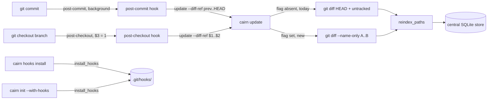

# Tech Spec: freshness-hooks

**Spec**: [spec.md](spec.md) | **Created**: 2026-10-04
**Every file/symbol citation below must come verbatim from [survey.md](survey.md)
or a grep run in this session — never from memory.**

## Architecture

Both hooks are fire-and-forget shells: git runs them after its operation,
they background a `cairn update --diff-ref <range>` and exit. The update
path is the existing incremental machinery — the only new logic is a range
mode in changed-file detection (`_changed_source_files` in
`src/cairn/graph/incremental.py`, survey S1/S2) that swaps
`git diff --name-only HEAD` + untracked for `git diff --name-only A..B`.
Installation goes through the existing idempotent installer
(`install_hooks` / `uninstall_hooks` in `src/cairn/hooks/git_hooks.py`,
survey S4) generalized to manage both hook files per repo; `cairn init`
gains an opt-in flag that reuses it (survey S6).

## Solution

### Chosen approach

- **FR-001**: add `--diff-ref A..B` to `cairn update`
  (`src/cairn/cli/update.py`, survey S2). The value is one literal range
  string passed through to `_changed_source_files`' git invocation as
  `git diff --name-only <range>` (list-form argv, no shell). In range mode
  the untracked-file pass and the size/mtime fallback are skipped (D-004).
  Flag absent → byte-for-byte today's behavior. The CLI pre-validates both
  range endpoints with `git rev-parse -q --verify` so a bad ref is a clean
  CLI error, not a silent zero-file update (D-002).
- **FR-002**: rewrite `POST_COMMIT_TEMPLATE`
  (`src/cairn/hooks/git_hooks.py:28`, survey S1) to resolve the previous
  commit with `git rev-parse -q --verify 'HEAD@{1}'`, falling back to an
  empty-tree range (`$(git hash-object -t tree /dev/null)..HEAD`) when the
  reflog has no prior entry — the verified first-commit blind spot (D-001).
  The invocation keeps the pinned substrings `cairn update --repo "{repo}"`
  and `cairn validate-paths --mark` (see Impact analysis pins), appends
  `--diff-ref "$range"`, stays backgrounded with output discarded.
- **FR-003**: new `POST_CHECKOUT_TEMPLATE` in the same module. Git calls
  post-checkout with `$1` = previous HEAD, `$2` = new HEAD, `$3` = `1` for
  a branch checkout / `0` for a file checkout (survey S3: "decided by
  `$3`" — the spec's "exit code 1" is this third parameter value). The
  template guards on `[ "$3" = "1" ]` and backgrounds
  `cairn update --repo "{repo}" --diff-ref "$1..$2"`; a file checkout runs
  nothing. `$1`/`$2` are SHAs git itself supplies — no reflog resolution,
  no first-commit edge.
- **FR-004**: generalize `install_hooks` / `uninstall_hooks`
  (`src/cairn/hooks/git_hooks.py:53/:76`, survey S4) to iterate both hook
  names per repo inside the same public functions — signatures and
  return contracts unchanged (list of repo names; the existing
  `hooks_install`/`agent_install` callers keep working, survey S5/S7).
  Refuse-to-clobber (`exists and "cairn" not in text → skip`) and the
  cairn-marker removal rule apply per hook file; a cairn hook is rewritten
  in place, which upgrades pre-spec installs to the new templates (D-003).
- **FR-005**: `--with-hooks` flag on `init`
  (`src/cairn/cli/core.py:57`, survey S6); after store registration it
  calls `install_hooks` over discovered repos — same code path as
  `cairn hooks install`, never interactive, opt-in only.
- **FR-006**: when repo discovery finds no git repository
  (`scanner_mod.discover_repos`, survey S5 evidence), `cairn hooks install`
  fails with guidance and exit 1; `init --with-hooks` prints the guidance
  as a warning and lets init succeed — writing zero hook files either way,
  and the up-front `_validate_repo_name` loop (survey S4) still guarantees
  no partial hooks on bad names (D-005).
- **NFR-001**: repo names pass `_validate_repo_name` before any template
  interpolation (survey S4, `_REPO_NAME_RE` allowlist); range strings reach
  git via list-form argv (no shell); `$1`/`$2`/`$3` in the post-checkout
  template are git-provided and double-quoted. No new interpolation sources.
- **NFR-003**: both templates append `&` — the git operation waits only for
  the shell to fork; the update runs detached with output discarded.
- **NFR-004**: `> /dev/null 2>&1 &` swallows failures; concurrency already
  rides WAL + `busy_timeout_ms=20000` + `build_lock` (survey S8, status
  DONE — "background hook execution rides this").

### Alternatives rejected

| Alternative | Why rejected |
|-------------|--------------|
| `ORIG_HEAD` as the post-commit "previous" ref | unset after plain commits — verified this session (`git rev-parse ORIG_HEAD` exits 128 after first and second commit in a fresh repo); git sets it only for merge/rebase/reset. Spec assumption row names it only as a fallback. |
| Teach `cairn update` to auto-fall-back when `HEAD@{1}` is unresolvable | a typo'd ref would silently trigger a full re-scan instead of an error — breaks the CLI's honest-error contract; the fallback belongs in the best-effort hook where output is discarded by design (NFR-005). |
| Hardcode the empty-tree SHA `4b825dc6...` in the template | breaks SHA-256 repos; computing it with `git hash-object -t tree /dev/null` was verified to work in-session and diffing against it returns every first-commit file. |
| Watch mode (`FileWatcherService`) instead of hooks | out of scope per spec.md — it already exists as a separate surface; hooks cover the commit/checkout moments a watcher misses at process boundaries. |
| Separate `install_post_checkout_hooks` function | survey S4: the machinery is already "hook-name-agnostic enough to extend"; a second public function duplicates the guard logic the fidelity tests pin (reuse rule). |

## Impact analysis

Blast radius (precise edges, within-repo, via cairn graph this session):

- `_changed_source_files` (`src/cairn/graph/incremental.py:813`, survey
  evidence): 2 callers — `incremental.py:775` (internal, from
  `incremental_update`) and `tests/test_workflow_audit_fixes.py:417`. An
  optional keyword keeps both green. Caveat: precise resolution; the name
  is unique so no fuzzy sweep needed.
- `incremental_update`: 5 callers — `src/cairn/graph/watcher.py:508`
  (`_update_pass`), plus tests (`tests/test_incremental_derived.py:358`,
  `tests/test_workflow_audit_fixes.py:100/:120`). Optional keyword → all
  green; the watcher never passes the flag (watch mode keeps worktree
  detection).
- `install_hooks`: 5 callers via the graph (`src/cairn/cli/hooks_viz.py:25`
  + 3 tests) **plus** `src/cairn/agent_install/__init__.py:446`
  (`from ..hooks.git_hooks import install_hooks`, survey S7) — the graph
  misses the agent-install call because it sits behind a function-local
  import; signature-preserving change keeps it green. `uninstall_hooks`:
  3 callers, same shape.
- `POST_COMMIT_TEMPLATE` / `_render_post_commit` (`:28/:38`, survey
  evidence): renderers and the install path only; no other module imports
  the constant.

Test-tree sweep for the flips (every test in the pinning classes):

- **Exact-traffic pins (break if touched carelessly — the design keeps
  these substrings/shapes):** `tests/test_install_uninstall_fidelity.py:245-246`
  asserts `'cairn update --repo "repo"' in hook` and
  `"cairn validate-paths --mark" in hook`;
  `tests/test_graft_parity_repos.py:211` asserts
  `'--repo "parent/nested/child"' in hook`;
  `tests/test_install_uninstall_fidelity.py:335` asserts the installed
  hook equals `POST_COMMIT_TEMPLATE.format(repo="repo")` byte-for-byte on
  default home (render-fidelity — holds as long as `_render_post_commit`
  adds nothing on default home);
  `tests/test_install_uninstall_fidelity.py:239-244` pins the
  export-line-immediately-after-shebang position and its uniqueness.
- **Flag pins (kwarg-less call sites on APIs gaining optional params):**
  every `incremental_update(workspace=..., db_path=...)` call listed above
  and `_changed_source_files(repo, conn=None)` at
  `tests/test_workflow_audit_fixes.py:417` — green under optional keywords.
- **Exact-count pins:** none found in the sweep — no test asserts
  reindexed-file counts that a new optional flag could flip.
- **Behavior pins (unaffected):** `tests/test_watcher_service.py` fakes
  `incremental_update` via `**kwargs` absorbers; the stat-fallback pin at
  `tests/test_incremental_derived.py:162`; the install/uninstall fidelity
  suite (guard + marker rules) — extended, never rewritten (survey S9).

What breaks if the approach is wrong: if the range form returned wrong
files, hooks would reindex the wrong span — contained by the build lock
(survey S8) and correctable by a flag-less update; if the template edit
dropped a pinned substring, the fidelity tests above fail before merge.

## Quality, threats, and rollback

| Requirement | Design consequence / threat mitigation | Rollback or verification |
|-------------|----------------------------------------|--------------------------|
| NFR-001 Security | Asset: user `.git/hooks/` files. Threat: repo/workspace names or ref strings injecting shell into the hook. Mitigation: `_validate_repo_name` allowlist before interpolation (survey S4, existing); ranges reach git as argv elements, never a shell string; template variables double-quoted. Residual: none beyond the existing guard's (unchanged) surface. | `python3 -m pytest tests/test_install_uninstall_fidelity.py -q` (guard pins); template review |
| NFR-003 Performance | Hook adds one fork+exec to the git operation; update runs detached (`&`) so the foreground cost is constant and sub-millisecond-scale. | Scratch-repo timing: commit returns immediately with hook installed |
| NFR-004 Reliability | Update failures (lock contention, missing store) are invisible to git: output discarded, exit status never observed by the hook. Writers serialize via WAL + `busy_timeout_ms=20000` + `build_lock` (survey S8, DONE). | Kill the store mid-hook → commit still succeeds; `cairn doctor` remains the health surface |
| NFR-002 / NFR-005 / NFR-006 | Not applicable: no new data leaves the store; hook output discarded by design (`cairn serve status`/`cairn doctor` stay the observability surfaces); no UI surface touched. | — |

Rollback: templates and flag are additive constants/keywords — a single
revert restores pre-spec behavior; `cairn hooks uninstall` removes both
hook files; already-installed new-template hooks keep working (they call
`cairn update`, whose flag-less form stays supported forever per FR-001).

## Code guide

### `--diff-ref` plumbing
- Touches: `update` command in `src/cairn/cli/update.py` (survey S2:
  `@click.option("--file", ...)` at :12, `def update(...)` at :17);
  `_changed_source_files` in `src/cairn/graph/incremental.py:813` (survey
  S1: "Primary signal: ``git diff --name-only HEAD`` plus untracked source
  files" at :816); `incremental_update` passes it through (module caller at
  `src/cairn/graph/incremental.py:346` per graph).
- Approach: optional `diff_ref` keyword end to end; range mode swaps the
  git invocation for `["diff", "--name-only", diff_ref]`, skips untracked +
  stat fallback (D-004); CLI endpoint pre-validation (D-002).
- Verify before implementing: `cairn update --help` (no `--diff-ref` today);
  `python3 -m pytest tests/test_workflow_audit_fixes.py -q -k changed_source` green.
- Pitfalls: `_run_git` returning None means git failed — in range mode do
  NOT fall through to `_changed_via_stat`; it would reindex off-range
  worktree noise (D-004).

### Hook templates
- Touches: `POST_COMMIT_TEMPLATE` at `src/cairn/hooks/git_hooks.py:28`,
  `_render_post_commit` at :38 (survey evidence; export line inserted after
  the shebang, default home stays byte-identical).
- Approach: FR-002/D-001 range invocation with first-commit fallback;
  FR-003 new `POST_CHECKOUT_TEMPLATE` guarding on `$3`.
- Verify before implementing: `sed -n '28,36p' src/cairn/hooks/git_hooks.py`
  (survey S1 verify) shows the worktree-diff invocation being replaced.
- Pitfalls: the three exact-traffic pins listed in Impact analysis — keep
  `cairn update --repo "{repo}"` contiguous, keep the `cairn
  validate-paths --mark` line, keep default-home render byte-identical.

### Install/uninstall generalization
- Touches: `install_hooks` at `src/cairn/hooks/git_hooks.py:53` (refuses
  to clobber at :68, chmod at :71), `uninstall_hooks` at :76 (removes only
  when "cairn" in text) — survey S4.
- Approach: per-hook-name loop inside the same functions; validate all
  repos up front (existing atomic-guard comment) before any write; both
  hooks managed by default (D-003).
- Verify before implementing: `python3 -m pytest
  tests/test_install_uninstall_fidelity.py -q -k hook` (survey S4 verify) green.
- Pitfalls: return contract is repo names, not (repo, hook) pairs — three
  callers pin it; skip per hook file, not per repo, or a repo with one
  foreign hook would lose its cairn hook.

### CLI surfaces
- Touches: `hooks_install`/`hooks_uninstall` in
  `src/cairn/cli/hooks_viz.py:14-39` (survey S5 — surface text says
  "post-commit hooks" only); `init` in `src/cairn/cli/core.py:57` (survey
  S6).
- Approach: `--with-hooks` opt-in flag wiring `install_hooks` after store
  creation; both-hooks success text; FR-006 guidance branch (D-005).
- Verify before implementing: `cairn hooks --help`; `cairn init --help`
  (no hook flag today, survey S6 verify).
- Pitfalls: `cairn init` must stay non-interactive — the flag installs,
  never prompts; agent-install passthrough needs no change (survey S7:
  `install-agents --git-hooks` rides `install_hooks`, status DONE).

### Tests and docs
- Touches: `tests/test_install_uninstall_fidelity.py`,
  `tests/test_graft_parity_repos.py`, `tests/test_workflow_audit_fixes.py`,
  `tests/test_incremental_derived.py` — extend alongside, never rewrite
  (survey S9); `docs/configuration.md` (post-commit template mention) and
  `docs/cli-reference.md` (`cairn init` / `cairn hooks` rows).
- Approach: range-mode case, post-checkout branch-vs-file case,
  first-commit fallback case, non-git guidance case — smallest owner test
  each at the strongest boundary (CLI or template render).
- Verify before implementing: `python3 -m pytest tests/test_install_uninstall_fidelity.py -q` green.
- Pitfalls: Constitution C-04 — no eager `cairn.cli` imports in tests, no
  patching global `subprocess.Popen`, `tmp_path` never leaks to `~/.cairn`.

## References
- [research.md](research.md): no open questions at Stage 0 — alternatives
  above trace to survey constraints, the spec's assumption row, and this
  session's git experiments (HEAD@{1}/ORIG_HEAD/empty-tree behavior,
  documented in D-001).
- [survey.md](survey.md) S1-S9: code state and verify commands; statuses
  inherited by task.md.
- `docs/configuration.md`, `docs/cli-reference.md`: existing user-facing
  hook/init documentation to extend.

## Decisions
### D-001: Post-commit range resolves `HEAD@{1}` in the template with an empty-tree first-commit fallback
- **Context**: The spec's assumption row asked for evidence: in a fresh
  repo with no prior reflog, `git rev-parse HEAD@{1}` immediately after the
  first commit exits 128 ("log for 'HEAD' only has 1 entries") — verified
  in a scratch repo this session. `ORIG_HEAD` is also unset after plain
  commits (merge/rebase/reset only). After the first commit on a new
  branch, `HEAD@{1}` does resolve (HEAD's reflog carries the checkout
  entry), so the blind spot is exactly the brand-new-repo first commit.
- **Decision**: The hook template resolves the previous commit itself:
  `git rev-parse -q --verify 'HEAD@{1}'`; when that fails,
  `range="$(git hash-object -t tree /dev/null)..HEAD"` — diffing against
  the computed empty tree returned every first-commit file in-session
  (exit 0), and computing (not hardcoding) the hash keeps SHA-256 repos
  working. `cairn update --diff-ref` itself stays a literal range (D-002).
- **Consequences**: The template carries ~3 lines of shell logic (kept:
  it is the only best-effort caller that may silently degrade); cairn's
  CLI never guesses refs; FR-002's `HEAD@{1}..HEAD` is the resolved common
  case, with the fallback covering the verified edge.

### D-002: `--diff-ref` is a literal range string; the CLI pre-validates endpoints
- **Context**: FR-001 says "reusing the existing git plumbing". A magic
  auto-fallback inside the library would turn a typo'd ref into a silent
  full re-scan.
- **Decision**: The flag accepts one `A..B` string passed through to
  `git diff --name-only <range>` as a single argv element; `cairn update`
  runs `git rev-parse -q --verify` on both endpoints before dispatch and
  errors cleanly on an unresolvable ref. Inside `_changed_source_files`, a
  git failure in range mode logs and returns `[]` — never the stat
  fallback.
- **Consequences**: Bad refs fail loudly at the CLI; the library stays
  silent-safe for races between validation and diff; flag-less behavior is
  byte-identical to today (FR-001's absent-flag clause).

### D-003: Install/uninstall generalize in place, both hooks by default
- **Context**: Survey S4's gap: "callers are post-commit-shaped;
  generalize per-hook-name". Five-plus callers pin the public signatures
  and the repo-name return contract.
- **Decision**: Keep `install_hooks(repos, workspace)` /
  `uninstall_hooks(repos, workspace)` and loop over both hook names
  internally; refuse-to-clobber and marker-removal apply per hook file; a
  cairn hook is rewritten in place (upgrading old installs).
- **Consequences**: `cairn hooks install`, `install-agents --git-hooks`
  (survey S7), and init (FR-005) all gain post-checkout with no call-site
  changes; a repo with one foreign hook keeps its other cairn hook; the
  return value stays "repos touched", not (repo, hook) pairs.

### D-004: Range mode skips the untracked pass and the stat fallback
- **Context**: `_changed_source_files` appends `git ls-files --others`
  untracked files and falls back to size/mtime comparison when git fails
  (survey S1/S2 evidence). Neither makes sense for a commit range:
  untracked files are by definition in neither ref, and the stat fallback
  diffs the worktree against the files table — off-range noise.
- **Decision**: When `diff_ref` is set, the function runs only the range
  diff; untracked and stat paths are exclusive to flag-less mode.
- **Consequences**: Range results are exactly the ref span (spec risk row:
  "recomputes nothing outside its ref span"); the flag-less contract that
  the untracked test pins is untouched.

### D-005: Non-git failure is a CLI error for `hooks install`, a warning for `init --with-hooks`
- **Context**: FR-006 requires clean failure with guidance, never partial
  hooks — but `cairn init`'s primary job is store creation, which must
  succeed outside git too.
- **Decision**: `cairn hooks install` with zero discovered repos prints
  guidance and exits 1; `init --with-hooks` prints the same guidance as a
  warning and completes init having written zero hooks. Both paths write
  nothing partial (repo discovery precedes any write; name validation
  stays up-front).
- **Consequences**: The guidance text lives in one place per surface;
  init remains usable in non-git workspaces while the opt-in hook step
  still fails cleanly per FR-006.
