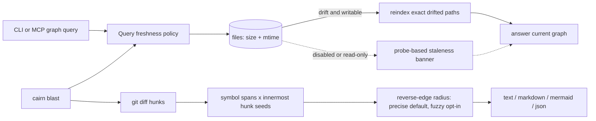

# Tech Spec: graft-parity

**Spec**: [spec.md](spec.md) | **Created**: 2026-09-16
**Every file/symbol citation below must come verbatim from [survey.md](survey.md)
or a grep run in this session — never from memory.**

## Architecture

### Current architecture audit

**Freshness.** The graph already stores the probe inputs and the repair
entry point: `_detect_changed` compares the files table's `(size, mtime)`
with disk and `reindex_paths` performs delete/reparse/resolver repair. Those
functions are reached by boot catch-up/update/watcher paths, not by query
paths. The eight named MCP graph tools and six named CLI query paths open a
connection, answer, and close. `_staleness_banner` reads only watcher-fed
`pending_sync` rows and is inert without the optional watcher; read-only mode
already exists through `_read_only_mode` and `_conn` (survey.md FR-001/FR-002).

**Diff blast radius.** There is no `blast` command. Existing `incremental_update`
knows how to ask git for changed files and existing `impact_analysis` performs
recursive reverse traversal with precise default, fuzzy opt-in, cycles, and
truncation. Symbols carry `line_start`/`line_end`, but no current code turns
unified-diff hunks into span intersections (survey.md FR-003).

**Orientation, file API, and grep.** `repo_map`, `file_api`, and a CLI `grep`
do not exist. The symbols schema already stores kind, qualified name, span,
parameters, return type, and body; signature text is not stored. The files
table is the indexed-file inventory. MCP inventory is pinned at
`_EXPECTED_TOOL_COUNT = 22` and must move to 24 for `repo_map` and `file_api`
(survey.md FR-005/FR-006/FR-007 and Supporting evidence).

**Durable knowledge and visualization.** Wiki and compass generation replace
the full body, enrichment only appends, and `critic_concept` extracts references
from the entire body. Existing viz emits Mermaid/DOT/JSON text; the bundled
dashboard JavaScript is not inlined into an export (survey.md FR-008/FR-009).

**Compiler-grade edges and broader coverage.** There is no pyright/LSP client,
`--lsp` flag, Rust parser/grammar, submodule recursion, or worktree awareness.
The edge schema distinguishes `exact`, `ambiguous`, and `unresolved`; parser
registration is centralized; config currently has only exclude/include/
repo-namespaces/ingest; `discover_repos` considers immediate child repositories
only (survey.md FR-010/FR-011/FR-012).

The read-only `/tmp/graft` comparison informed shape only: cheap stat probing,
hunk-to-span seeding, capped deterministic maps, span-grouped grep, and inline
HTML assets. No Graft code is copied.

### Query freshness and diff blast flow

The new freshness service is the only component allowed to decide whether a
query repairs or reports staleness. Explicit graph-query boundaries call it
before reading; `cairn blast` uses the same service before converting a git
diff into seed symbols, so changed-line mappings are not computed from stale
spans. The blast pipeline then reuses the existing resolution-labeled reverse
traversal contract rather than introducing a second trust model.

## Solution

### Chosen approach

| FR | Solution element |
|-----|------------------|
| FR-001 | Add one graph-domain freshness service. Explicit MCP graph-tool and CLI query boundaries probe indexed files and invoke `reindex_paths` only for changed/deleted stored paths before answering. |
| FR-002 | `CAIRN_NO_REFRESH=1` and CLI `--no-refresh` select answer-plus-banner mode. Read-only connections/files also select that mode. The banner is derived from the stat probe, not `pending_sync` or the watcher. |
| FR-003 | Add `cairn blast`: resolve default or merge-base diff, parse new-side hunks, intersect inclusive symbol spans, keep innermost matches, and walk reverse edges from the merged seed set. |
| FR-004 | Blast owns four renderers, precise-by-default plus `--fuzzy`, an exit-0 empty-radius contract, and an unknown-base error containing shallow-checkout fetch guidance. |
| FR-005 | Add a deterministic repo-map service and expose it as CLI `cairn map` plus MCP `repo_map`; scope by repository, cluster directories, count files/symbols/edges, rank in-degree hubs/hotspots, and report every dropped cap. |
| FR-006 | Add MCP `file_api`; enumerate every symbol for a file, select no body columns, synthesize signature text from stored parameters/return type, and return null signature with name+span when no signature signal exists. |
| FR-007 | Add `cairn grep`: regex/fixed search over indexed files, innermost-span grouping with a file group fallback, incoming-edge ranking, `-i`/`--fixed`/`--in`, and explicit hit/group/file truncation counts. |
| FR-008 | Add one Notes section parser/splicer shared by wiki and compass writers; preserve the original section bytes through regeneration/enrichment and exclude that exact section from critic reference extraction. |
| FR-009 | Extend viz with a single-file HTML renderer that inlines the local viewer CSS/JavaScript and graph JSON, with no external `src`, `href`, or network-loaded asset. |
| FR-010 | Add an opt-in pyright stdio JSON-RPC pass after graph resolution: Python `resolution='ambiguous'` edges only, one definition location upgrades to exact, and missing/failing pyright is a counted no-op with notice. |
| FR-011 | Add a generic tree-sitter extractor for Rust definitions and name-based calls, register `.rs`, force all Rust call edges to `unresolved`, and add the pinned grammar wheel as recorded in D-004. |
| FR-012 | Add default-off persisted nested-repo discovery, prefix nested repo ids, scan parents only outside child boundaries, and seed a linked worktree by copying the main checkout graph into an independent store before refresh. |

#### Freshness contract

- The query probe performs one `stat` per stored indexed file. It does not read
  file bytes, invoke an LLM, or require `[watch]`.
- A stored path is drifted when size differs, mtime differs by more than the
  existing probe tolerance, or the path is missing. Repair passes exactly those
  paths to `reindex_paths`.
- Refresh failures are query errors; they never silently downgrade to a stale
  answer. Disabled/read-only mode returns the stored answer plus a banner with
  drifted count and paths, capped deterministically.
- CLI banners go to stderr so `--json` output remains parseable. MCP prose
  renderings prepend the banner; structured graph results expose the same
  report as a typed staleness field.
- The policy is applied at the named graph-query boundaries. New deterministic
  graph readers (`repo_map`, `file_api`, `grep`, and blast) use the same policy
  so all stored-span answers have one freshness meaning.

#### Blast contract

- Default comparison is working tree versus `HEAD`. `--base <ref>` is verified
  before diffing; its comparison range is the merge base of base and `HEAD`.
- Hunks use new-file line numbers because stored spans describe current source.
  Deleted files are reported but cannot seed current spans. Renames follow
  their new path; a rename with no content hunk produces no symbol seed unless
  a stored module span intersects it.
- A seed is the innermost stored symbol whose inclusive span intersects a hunk;
  when spans share a start, the smaller span wins. Seeds are de-duplicated by
  symbol id.
- Reverse traversal accepts multiple seed ids, preserves existing precise and
  fuzzy semantics, records the shallowest depth and originating changed file,
  and detects cycles/truncation. It shares the existing walker rather than
  copying traversal logic.
- JSON is the canonical machine shape and includes basis, changed files, hunks,
  seeds, radius, cycles, unindexed/deleted files, and truncation counts. Text,
  markdown, and Mermaid render subsets of that shape without another traversal.

#### Deterministic orientation and search

- Repo map scopes by repository before clustering. Within a scope, files are
  clustered by first directory segment; a first segment holding more than 60%
  of scope files is split one segment deeper. Sorting is descending count, then
  path/qualified name, so identical graph rows produce byte-identical JSON.
- Cluster edge count counts edges whose source symbol belongs to the cluster.
  Hubs use incoming edge count; only symbols with in-degree above zero are hub
  candidates. Global hotspots use the same metric across all scopes.
- Default caps are 16 directory clusters, 3 hubs per cluster, and 12 global
  hotspots. Every capped array carries its dropped count, including zero.
- `file_api` resolves one indexed file. If a relative path occurs in multiple
  repositories and no repo argument is supplied, it errors with the candidate
  repo ids. It never selects or returns body text.
- Signature synthesis is language-neutral: a signature exists only when stored
  parameters or return type exists; it is rendered as
  `qualified_name(parameters) -> return_type`, omitting absent pieces. Missing
  both yields `signature: null`, never an invented declaration.
- Grep compiles one regular expression (`re.escape` for `--fixed`), scans
  indexed files line by line, and groups each hit by innermost enclosing symbol.
  Ranking is incoming edge count descending, then path, qualified name, and
  line. Unreadable/missing files are counted, not silently omitted.

#### Knowledge and artifact contracts

- A human Notes section starts at an exact level-2 `## Notes` heading and ends
  immediately before the next same-or-higher level heading or EOF. The bytes
  from heading through the section terminator are captured once, stored only in
  memory during generation, and spliced back verbatim.
- Enrichment appends generated sections without rewriting the captured Notes
  payload. The critic receives only the body outside Notes; no reference inside
  Notes is counted, validated, or used in scoring.
- HTML export inlines local viewer CSS/JavaScript and embeds graph JSON with
  `<`, U+2028, and U+2029 escaped for a script context. The exporter writes one
  file atomically and rejects `--export` combined with `--output`.

#### Opt-in precision and coverage

- Pyright is launched as `pyright --stdio` only when `build --lsp` is present
  and the executable is found. The client implements only initialize/shutdown,
  `textDocument/didOpen`, and `textDocument/definition`.
- Candidate edges are Python edges marked `ambiguous` after normal resolution.
  The client sends the call position for each source file. Exactly one returned
  location that maps inside one stored Python symbol upgrades that edge to
  `exact`, sets its target id, and clears target name. Zero, multiple, timeout,
  malformed, or unmapped results leave the edge unchanged. Existing exact edges
  are never selected or downgraded.
- Rust uses one generic extractor with a node-kind table for functions,
  structs, enums, traits, implementations, modules, types, constants, statics,
  and macros. Definitions carry source-qualified names and spans. Calls carry
  only a bare callee name and are forced to remain `unresolved`.
- If the Rust grammar cannot load, `.rs` files are recorded as skipped with a
  parser-unavailable reason and the build completes; no Rust edge is guessed.

#### Nested repository and worktree semantics

- Persisted `cairn.json` key `include_nested_repos` defaults to false. Invalid
  values warn and remain false.
- When enabled, discovery includes only initialized submodules (a `.gitmodules`
  entry whose working path exists and contains `.git`) and nested child repos
  found without crossing existing default skip directories. Each is represented
  by both filesystem root and stable repo id.
- Nested repo id is `parent-repo-id/relative-path-from-parent`, sorted by path.
  Parent scans stop at child boundaries, so nested source is stored once under
  the prefixed id. Path-to-repo resolution uses the longest matching repo root.
- A linked worktree is recognized from a `.git` file pointing at
  `<main>/.git/worktrees/<name>`. If the worktree has no store and the main
  checkout has a graph, snapshot the main SQLite graph with the SQLite backup
  API into the worktree's independent store, then run the normal drift probe
  and `reindex_paths` against worktree files. The main store is never opened
  writable or mutated.

### Alternatives rejected

| Alternative | Why rejected |
|-------------|--------------|
| Intercept every call in the FastMCP dispatcher | The current inventory is 22 tools while FR-001 names eight graph tools; a global transport chokepoint would widen the blast radius to unrelated tools and leak transport policy into graph behavior (survey.md FR-001/FR-005). |
| Keep watcher-owned freshness | `_staleness_banner` is pending_sync-only and remains inert without watchdog, directly failing FR-002 (survey.md FR-002). |
| Add a fingerprint sidecar with content hashes | The files table already carries size/mtime and `reindex_paths` already repairs drift; a second sidecar adds synchronization state not required by FR-001 (survey.md FR-001). |
| Seed blast from whole changed files | Stored symbol spans already support line precision, and no hunk parser exists; whole-file seeding would over-report enclosing classes and file importers (survey.md FR-003). |
| Ask callers to run per-symbol `impact_analysis` manually | Recursive `impact_analysis` exists but no command spans a whole diff, which is the manual review gap FR-003 identifies (survey.md FR-003). |
| Persist parser-authored signature text | Signature text is absent, but parameters/return type already exist; a new column plus changes to every language parser costs more than deterministic synthesis and still needs a null fallback (survey.md FR-006). |
| Return stored bodies from `file_api` | FR-006 requires no bodies; body storage is an indexing signal, not an API surface contract (survey.md FR-006). |
| Generate maps with compass/wiki LLM tasks | FR-005 requires a deterministic, no-LLM orientation surface; only the counting substrate exists today (survey.md FR-005). |
| Use a CDN viewer for HTML export | Existing JavaScript is local but no code inlines it, and FR-009 forbids network-loaded assets (survey.md FR-009). |
| Run pyright during every graph query | FR-010 scopes LSP to opt-in `cairn build --lsp`; query-time server startup would add latency and a process dependency to all eight tools (survey.md FR-010). |
| Vendor a Rust grammar | The project already ships pinned grammar wheels and has one vendored grammar; a second in-tree C extension adds build maintenance when a pinned wheel can follow the existing pattern (survey.md FR-011). |
| Enable nested-repo recursion by default | Existing discovery is immediate-children-only and has no persisted include flag; changing the default would silently expand existing multi-repo graphs contrary to FR-012 (survey.md FR-012). |

## Impact analysis

### Existing-symbol blast radius

Precise code-graph callers were queried this session with the cairn CLI.
`discover_repos` has the largest direct surface: **16 direct call edges** —
11 source and 5 test calls. Source groups are `agent_install` (1), `hooks_viz`
(2), `system` (1), `uninstall` (1), `builder` (1), `incremental` (2),
`scanner` (1), and `watcher` (2). The compatibility path-wrapper in D-006 is
therefore mandatory: changing its return shape would break all sixteen rather
than only the scanning path.

`reindex_paths` has **11 direct call edges** (4 source, 7 test). Adding query
callers must preserve its delete/reparse/resolver-repair contract rather than
bypass it with partial SQL. `_staleness_banner` has **4 direct call edges**
(1 source, 3 tests); extending its report shape must keep the existing pending
watcher path testable while adding the probe-based path. The graph traversal
`impact_analysis` has **1 direct caller** (`src/cairn/mcp_server/tools_graph.py`);
blast will add a second internal caller. `cairn deps cairn` reported no
cross-repo dependents.

Resolution caveat: `impact_analysis` also names the MCP wrapper, so caller
counts above are precise file-qualified results, not bare-name results. Common
names such as `_conn` were excluded; fuzzy name matches would be candidates
requiring code verification, not blast-radius truth.

### Test-tree sweep for default/API flips

**Flag pins (must keep passing):**
- `tests/test_core_smoke.py::test_read_only_mode_blocks_db_writes` — asserts
  `CAIRN_READ_ONLY` yields a connection that rejects writes.
- `tests/test_conn_pool.py::test_pooled_read_only_conn_rejects_writes` —
  asserts a pooled read-only connection is never silently upgraded.

D-001 must probe and banner on the already-open/read-only connection; it must
not call `_rw_conn` for a read-only graph query.

**Exact-count pins (intentional 22→24 updates plus docs):**
- `tests/test_tool_annotations.py::test_every_decorator_has_annotations_kwarg`
- `tests/test_mcp_wiki_tool.py::test_wiki_generate_is_registered_on_the_22_tool_surface`
- `tests/test_ingest_compat.py::TestSurfacesUnchanged::test_mcp_boot_verifies_exactly_22_tools`
- `tests/test_agent_surface.py::test_skill_tool_index_lists_all_registered_tools`
- `tests/test_status_resource_health.py::test_tool_count_at_22`

These assertions and the generated agent/skill tool documentation must move to
the new count in the same change. Relative-count checks in
`tests/test_server_robustness.py::test_tool_count_assertion` and
`tests/test_agent_surface.py::test_tool_count_string_matches_server` stay green
only when the constant and docs are updated together.

**Exact-traffic pins:** none for the FR-001 query surfaces. Survey evidence
records zero `_detect_changed` or `reindex_paths` references under
`tools_graph.py`, `query.py`, or `ask_context.py`, and this session found no
query test asserting a refresh call count. New tests must instead pin exact
reindexed-path sets and no-refresh/no-write behavior.

**Behavior pins:** the existing graph-tool suites remain semantic guards:
`tests/test_tools_graph_fallback.py` (fallback/empty renderings),
`tests/test_staleness_banner.py` (pending_sync debounce behavior),
`tests/test_explore_memory.py` (memory reference counts/content),
`tests/test_mcp_degradation_footnote.py` (footnote placement),
`tests/test_impact_test_labeling.py` (affected-test rendering), and
`tests/test_emitters.py::test_search_symbols_tool_emits_empty_result_when_no_match`
(one empty-result event). Refresh may not add result events, memory references,
or fallback traffic on an undrifted fixture.

The D-006 default-off choice leaves the exact discover/scan count assertions
in `tests/test_single_repo.py` as unaffected behavior pins. The Rust sweep
found no `.rs` fixtures in `tests/`, so no existing exact row/call/traffic test
pins the old no-Rust coverage; new Rust tests own that contract.

### Failure and concurrency analysis

- Freshness writes only through `reindex_paths`, so existing incremental
  transaction/derived-repair behavior remains the concurrency boundary. A
  query does not invent partial delete/insert logic.
- Read-only and no-refresh paths perform stats and reads only. They cannot
  contend with a concurrent builder.
- Blast is read-only after freshness repair. Missing base refs fail before
  traversal; unindexed changed files are reported in JSON rather than treated
  as zero risk.
- The LSP pass is bounded by the ambiguous Python edge set, one server process,
  per-request timeouts, and a deterministic shutdown. No query can launch it.
- Nested discovery remains opt-in. Worktree seeding copies a consistent SQLite
  snapshot; it never shares the main store lock or writes the main checkout.

## Code guide

### Query freshness

- Touches: `_detect_changed`, `reindex_paths`, `_staleness_banner`,
  `_read_only_mode` / `_conn`, the eight graph tools in
  `src/cairn/mcp_server/tools_graph.py`, and the six CLI query paths in
  `src/cairn/cli/query.py` / `src/cairn/cli/ask_context.py` (survey.md FR-001,
  FR-002, Supporting evidence).
- Approach: create one graph freshness service with probe/report/refresh
  behavior; consolidate duplicated stat logic behind it. Apply an explicit
  query-boundary helper or decorator; do not modify transport dispatch.
- Verify before implementing:
  `CAIRN_LIB=/tmp/__no_such_lib__ uv run --extra test pytest tests/test_watcher_service.py -q`
  plus new per-surface tests for every named tool/command.
- Pitfalls: preserve read-only connections; send CLI banners to stderr; never
  require watchdog; propagate refresh failures; keep structured output typed.

### Diff blast

- Touches: `impact_analysis`, symbol `line_start`/`line_end` storage, the
  existing `--fuzzy` impact CLI precedent, and text renderer precedents in
  `src/cairn/viz/renderers.py` (survey.md FR-003/FR-004).
- Approach: add a blast domain module for diff parsing, span seeding, merged
  reverse traversal, and canonical JSON; add a thin CLI command that validates
  options and selects a renderer.
- Verify before implementing:
  `CAIRN_LIB=/tmp/__no_such_lib__ uv run --extra test pytest tests/test_traversal_parity.py tests/test_incremental_derived.py -q`
  plus hunk fixture, empty-radius, format, and missing-ref tests.
- Pitfalls: spans and hunks are inclusive; deleted files have no new-side span;
  use merge base for `--base`; precise remains default; empty radius exits zero.

### Repo map, file API, and grep

- Touches: symbols/files/edges schema fields, `src/cairn/graph/stats.py`,
  in-degree aggregation precedent, and `_EXPECTED_TOOL_COUNT` (survey.md
  FR-005/FR-006/FR-007).
- Approach: implement three caller-facing services over stored rows, then add
  CLI/MCP adapters. Update MCP inventory to 24 and generated tool docs in the
  same change.
- Verify before implementing:
  `rg -n "_EXPECTED_TOOL_COUNT" src/cairn/mcp_server/server.py` and
  `rg -n "repo_map|file_api|def grep" src/cairn/cli src/cairn/mcp_server`
  before work, then focused deterministic-output tests.
- Pitfalls: no bodies from `file_api`; null is the no-signature value; report
  dropped counts even when zero; make grep truncation counts additive.

### Notes preservation and HTML export

- Touches: wiki/compass generators, append-only enrichment path, full-body
  critic path, and `to_mermaid`/`to_dot`/`to_json`/`embed` renderer surface
  (survey.md FR-008/FR-009).
- Approach: put one Notes extraction/splice helper below the shared knowledge
  layer and call it from both writers; pass critic a Notes-free body. Add an
  HTML renderer beside existing text renderers and reuse the bundled local
  viewer asset.
- Verify before implementing:
  `CAIRN_LIB=/tmp/__no_such_lib__ uv run --extra test pytest tests/test_wiki_enrich.py -q`
  plus byte-hash regeneration tests and a one-file/no-network export test.
- Pitfalls: preserve the section terminator bytes; do not normalize markdown;
  never let a Notes reference affect critic scoring; script JSON must escape
  HTML-sensitive characters.

### LSP precision

- Touches: edge `resolution` values and the `cairn build` entry point
  (survey.md FR-010).
- Approach: add a narrow pyright stdio client and an edge-upgrade pass after
  normal resolver execution and before derived indexes; inject the transport
  factory in tests rather than patching global subprocess state.
- Verify before implementing:
  `rg -n "pyright|--lsp" src/cairn tests -g '!dashboard/static/**'` before
  work, then fake-server tests for exact upgrade, ambiguous result, failure,
  and no-exact-downgrade.
- Pitfalls: LSP positions are zero-based while graph spans are line-based;
  clear target name only on exact; enforce request timeout and shutdown.

### Rust generic tier

- Touches: `src/cairn/parsers/_registry.py`, the per-language adapter pattern,
  `.rs` scanner wiring, unresolved edge-label contract, and grammar pins in
  `pyproject.toml` (survey.md FR-011).
- Approach: add one generic tree-sitter definition/call extractor, map Rust to
  it in the registry, and enforce unresolved-only Rust calls after normal edge
  persistence. Add the pinned wheel dependency from D-004.
- Verify before implementing:
  `rg -ni "rust" pyproject.toml src/cairn/parsers src/cairn/graph/scanner.py`
  and `ls vendor` before work, then definition/span/call/unavailable-grammar
  tests.
- Pitfalls: never let the normal resolver upgrade a generic-tier call to exact;
  gracefully skip `.rs` if the grammar cannot load.

### Nested repositories and worktrees

- Touches: `discover_repos`, `CairnConfig`, scanner path resolution, and the
  existing drift machinery `_detect_changed` + `reindex_paths` (survey.md
  FR-012).
- Approach: introduce repository records with root plus repo id, keep the path
  list API as a compatibility wrapper, teach scanning/path resolution to use
  longest-root records, and add an independent worktree store-seeding function.
- Verify before implementing:
  `rg -n "def discover_repos" src/cairn/graph/scanner.py` and
  `rg -n "\bworktree\b|git worktree|\.gitmodules" src/cairn -g '!dashboard/static/**'`
  before work, then default-off, submodule, nested, prefix, parent-boundary,
  and worktree-copy tests.
- Pitfalls: only initialized submodules count; never mutate the main store;
  preserve all sixteen existing `discover_repos` callers.

## References

- `/tmp/graft` — read-only comparison identified by survey.md; used for shape
  comparison only, with no code copied.
- `research.md` — no open research questions; alternatives above therefore
  trace to survey constraints.

## Decisions

### D-001: Place freshness at explicit graph-query boundaries, not the MCP dispatcher
- **Context**: Eight MCP graph tools and six CLI query commands currently answer without a probe; the MCP registry contains unrelated tools and resources (survey.md FR-001/FR-002/FR-005).
- **Decision**: Implement one graph freshness service and invoke it explicitly at the fourteen required query boundaries (and new stored-span readers). `CAIRN_NO_REFRESH=1` or `--no-refresh` selects stat-probe banner mode; read-only mode does the same without upgrading the connection.
- **Consequences**: Graph policy stays independent of FastMCP and applies consistently to CLI/MCP. Each boundary needs explicit wiring and a freshness assertion. A global dispatcher interception is rejected.

### D-002: Seed blast from git hunks intersected with stored spans
- **Context**: Existing machinery has changed-file detection and recursive impact but no hunk parser or diff-to-symbol command (survey.md FR-003).
- **Decision**: Parse unified-diff new-side hunks, intersect inclusive stored symbol spans, select innermost symbols, de-duplicate by symbol id, and run one multi-root reverse traversal using existing precise/fuzzy semantics.
- **Consequences**: Review radius reflects edited symbols rather than whole files. Correctness depends on refreshing spans first; hunk, deleted-file, rename, and missing-base behavior is testable directly.

### D-003: Synthesize `file_api` signatures from stored parser signals
- **Context**: Symbols already store parameters, return type, and body, but no signature-text column (survey.md FR-006).
- **Decision**: Render `qualified_name(parameters) -> return_type` from stored parameters/return type, omit absent pieces, return `signature: null` plus name/kind/span when neither signal exists, and never return body text.
- **Consequences**: No schema migration or per-language parser changes are needed for the first API surface. The signature is canonical rather than source-exact, and the null degradation is explicit and testable.

### D-004: Add a pinned core Rust grammar wheel for the generic tier
- **Context**: C-03 requires dependency cost to be recorded. The current project pins fourteen grammar wheels, has no Rust grammar, and has one vendored Kotlin grammar requiring an in-tree extension (survey.md FR-011).
- **Decision**: Add pinned `tree-sitter-rust==0.24.2` to core dependencies, map it in the parser registry, and skip `.rs` with a parser-unavailable reason if the wheel cannot load.
- **Consequences**: Cost is one additional compiled wheel in the platform/install matrix and a larger default dependency set. Benefit is default Rust coverage with prebuilt wheels, no source-build extension, and deterministic graceful degradation. Vendoring and an optional-only plugin are rejected.

### D-005: Scope LSP to a pyright stdio ambiguous-edge build pass
- **Context**: No pyright or `--lsp` path exists, while ambiguous/exact edge labels already do (survey.md FR-010).
- **Decision**: Implement only `pyright --stdio`, only behind `cairn build --lsp`, only for Python edges whose normal resolution is `ambiguous`, and upgrade only a unique definition location that maps to one stored symbol. Missing/failing server is a no-op with notice.
- **Consequences**: No query-latency or runtime dependency is added and no exact edge can downgrade. The client remains transport-injectable for tests and deliberately excludes other languages/servers.

### D-006: Make nested repos opt-in and worktree seeding copy-then-refresh
- **Context**: Discovery is immediate-children-only, config has no include flag, and no code is worktree-aware (survey.md FR-012).
- **Decision**: Add default-off `include_nested_repos`; represent initialized nested repos with prefixed ids and longest-root path resolution; keep `discover_repos` returning paths for compatibility. Seed a store-less linked worktree by SQLite-backup copy of the main graph into an independent store, then reindex worktree drift.
- **Consequences**: Existing workspaces remain unchanged while opt-in nested graphs avoid duplicate parent/child rows. The path-list compatibility wrapper is a retained red flag: it prevents a sixteen-caller breaking change but means nested-aware callers must use the richer record API.

### D-007: Make map and grep capped deterministic graph projections
- **Context**: A deterministic map and exhaustive audit grep are absent, but files, spans, and edges already provide the needed projections (survey.md FR-005/FR-007).
- **Decision**: Compute both services only from stored graph/files rows, use deterministic tie-breakers, expose fixed default caps, and return dropped/truncation counts with every result.
- **Consequences**: Identical inputs produce deterministic JSON and text. Cap changes are observable, and no LLM, compass queue, or shell grep fallback is introduced.

### D-008: Define Notes as an exact byte-preserving section
- **Context**: Current generators replace whole bodies and the critic scans the full body (survey.md FR-008).
- **Decision**: Use an exact level-2 `## Notes` section bounded by the next same-or-higher heading or EOF; splice its original bytes back after generation and pass only the remaining body to the critic.
- **Consequences**: Human content survives byte-identical and cannot fail code-reference criticism. Writers must use one shared helper; renderer-specific markdown normalization is prohibited.
