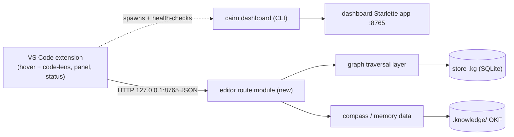

# Tech Spec: ide-extensions

**Spec**: [spec.md](spec.md) | **Created**: 2026-09-17
**Every file/symbol citation below must come verbatim from [survey.md](survey.md)
or a grep run in this session — never from memory.** Session-derived citations
are marked *(session)*; everything else traces to survey items S1–S3.

## Architecture

The extension is a new render surface over infrastructure that already exists
in two proven shapes — not a new backend. The dashboard is a local HTTP + JSON
stack over the store (`src/cairn/dashboard/app.py:34-35` `DEFAULT_HOST =
"127.0.0.1"` / `DEFAULT_PORT = 8765`; server stack loads only in the CLI
command, `src/cairn/cli/dashboard.py:55-56` — S1). The SSE daemon proves
auto-managed servers (`src/cairn/cli/serve.py:94`, `lifecycle.py:25
DEFAULT_PORT = 9876` — S2) but serves MCP/SSE, not editor queries. The graph
data hover/lens needs is already queryable (`get_callers` tools_graph.py:99,
`get_callees` :202, `impact_analysis` :290 — precise, depth-limited;
`get_compass` tools_compass.py:34 — S3). The survey records no IDE extension
code anywhere in the repo (supporting evidence: proposal §6.2 places
extensions in separate repositories) — the extension codebase is its own repo;
the only in-repo work is the editor-facing JSON API.

One server process per workspace: the extension spawns (or attaches to) the
existing `cairn dashboard` command run from the workspace root — the CLI
already resolves the workspace store from cwd (`_resolve_db` →
`resolve_store().db`, `src/cairn/cli/dashboard.py:13-17`, *session*) and
binds loopback-only. The extension never speaks MCP and needs no daemon
registration.

## Solution

### Chosen approach

- **Editor-facing JSON API (in-repo, the only Python work)**: one new route
  module under `src/cairn/dashboard/routes/` registered in `create_app` by one
  `editor.register(routes, context)` line — the uniform pattern `core`,
  `graph`, `history`, `memory`, `knowledge`, `wiki`, `settings` already follow
  (`src/cairn/dashboard/app.py:372-379`, *session*; route set in S1). Handlers
  call the graph traversal layer the MCP tools wrap (S3) — never
  `cairn.mcp_server` (import hermeticity, see Impact). Three endpoints, shaped
  for their caller:
  - symbol endpoint — callers count + callees count + depth-limited precise
    blast radius in one response (one round-trip per hover, FR-001);
  - file endpoint — module compass excerpt + relevant memories in one
    response (one round-trip per file open, FR-002);
  - status endpoint — indexed-store + server state for the workspace
    (drives the FR-004 indicator).
- **Extension shell (separate repo)**: activation → spawn/attach server →
  health-check → status-bar item. Degrades to a non-blocking indicator on
  connection failure or unindexed workspace (FR-004).
- **Hover + code-lens providers and the compass/memory panel (separate
  repo)**: thin consumers of the frozen JSON contract; all degradation is
  handled by the shell's status layer, not per-provider (FR-001, FR-002).
- **Packaging (FR-005)**: vsix — marketplace and manual install both
  supported; manual install exercised from Phase 1 onward (per plan.md).

FR coverage: FR-001 → symbol endpoint + hover/lens providers; FR-002 → file
endpoint + panel; FR-003 → spawn/attach over the existing dashboard stack
(D-002, D-003); FR-004 → status endpoint + shell indicator; FR-005 → D-001;
FR-006 → frozen contract (D-004) is the parity surface.

Shape checks applied: no pass-through layer (routes call the traversal/data
layer directly, not through MCP tool wrappers); no scattered validation
(store scoping happens once, in the spawned CLI, before any request); no
synchronized flags (degradation is derived from one health-check, consumed by
all surfaces); subtract-before-add honored — no new server process type, no
new port, no new protocol, no new Python deps.

### Alternatives rejected

| Alternative | Why rejected |
|-------------|--------------|
| Extension speaks MCP to the SSE daemon (S2) | Survey S2 gap: daemon serves MCP/SSE, not editor hover/lens queries; MCP config violates FR-003 zero-config |
| New bespoke HTTP backend for the extension | Duplicates the S1 stack; new runtime deps trip C-03 for no capability gain |
| Extend the dashboard's existing JSON endpoints (`/graph/neighbors`, `/graph/inspect` — `src/cairn/dashboard/routes/graph.py:162/:188`, *session*) into the editor contract | They serve dashboard-UI shapes (node expansion, search palette); two consumers on one return shape couples their evolution |
| launchd/KeepAlive daemon registration for the editor server (S2 precedent) | Login-scoped, not workspace-scoped; child-process spawn gives zero-config more simply |
| JetBrains first or in parallel | FR-005 ruling: VS Code has the largest install base and vsix packaging needs no publisher account |

## Impact analysis

Blast radius mapped with the workspace graph CLI (*session*: `cairn impact`,
`cairn callers`). Precise mode is ground truth; fuzzy totals are inflated by
common-name cycles (noted per row).

| Symbol (survey item) | Precise direct callers | `cairn impact` | Breaks if the approach is wrong? |
|---|---|---|---|
| `get_callers` tools_graph.py:99 (S3) | 3: `get_callers_data` (tools_graph.py:141/:144), `_callers` (src/cairn/graph/traversal.py:257); plus test stub `_StubQuery` (tests/test_mcp_phase3.py:75) | 11 impacted (cycle `get_callers`/`traverse`/`impact_analysis`) | No — wrapped, never modified |
| `get_callees` tools_graph.py:202 (S3) | 3: `get_callees_data` (:237/:240), `_callees` (traversal.py:397) | 500 impacted — fuzzy noise (cycle with `verify_ground_truth`/`uninstall`, common names); precise list is the truth | No — wrapped, never modified |
| `impact_analysis` tools_graph.py:290 (S3) | 0 beyond module refs and its own second def (:361) | 1 (itself) | No — wrapped, never modified |
| `get_compass` tools_compass.py:34 (S3) | 0 (module ref only) | none | No — wrapped, never modified |
| `create_app` src/cairn/dashboard/app.py:194 (S1 area) | 1: the `dashboard` CLI command (`src/cairn/cli/dashboard.py:61` `uvicorn.run(create_app(db_path=path), ...)`) | one additive `register` line | Additive only |

- Who depends on the touched area today: the dashboard UI routes and the
  dashboard test suites; the extension is a new consumer of new endpoints —
  no in-repo consumer exists.
- Biggest radius: `get_callees` at 500 fuzzy-impacted, but that number is
  cycle-polluted; the precise direct-caller list (3) is the blast radius that
  matters, and the approach never modifies the wrapped symbols.
- What breaks if the contract is wrong: only the extension (separate repo),
  silently at runtime — mitigated by D-004 (freeze + contract tests).
- **Default-flip sweep**: no decision here flips a flag, keyword, or return
  shape of any existing API — all server-side changes are additive (new route
  module + one registration line). The mandatory four-class test sweep
  (flag pins / exact-count pins / exact-traffic pins / behavior pins) is
  therefore not triggered. Adjacent shape pins checked and classified
  (*session*):
  - `test_get_callers_data_returns_dict_shape` (tests/test_mcp_phase3.py) —
    exact-shape pin on the query layer: **behavior pin, unaffected** (routes
    consume the layer, never reshape it).
  - tests/test_dashboard_packaging.py — pins `[tool.setuptools.package-data]`
    globs for `templates/`/`static/` in built wheels: **behavior pin,
    unaffected** (the editor module is JSON-only; no new data files).
  - `test_full_route_pass_leaves_db_byte_identical` (tests/test_dashboard_readonly.py:218)
    — a full pass over every dashboard route must leave the DB byte-identical:
    **behavior pin that will sweep the new routes** — editor endpoints must
    stay GET/read-only or this breaks.
  - `test_module_imports_are_hermetic` (tests/test_prf.py, tests/test_query_enrich.py)
    and tests/test_layer_direction.py — hermetic-import guards: **behavior
    pins** — the route module must not import the server stack or
    `cairn.mcp_server` at module import time.

## Code guide

### Editor JSON API (in-repo)
- Touches: a new route module in `src/cairn/dashboard/routes/` (S1 lists the
  existing set: core, graph, history, knowledge, memory, settings, wiki) and
  `create_app` in `src/cairn/dashboard/app.py` (S1: `DEFAULT_HOST`/
  `DEFAULT_PORT` live here) for one `register` line.
- Approach: handlers call the graph traversal layer the S3 tools wrap
  (`get_callers` / `get_callees` / `impact_analysis` shapes; `get_compass`
  for FR-002) and return `JSONResponse` — the pattern `graph_candidates` /
  `graph_neighbors` already use (routes/graph.py:92/:186, *session*).
- Verify before implementing: `ls src/cairn/dashboard/routes/` (S1 verify)
  and `grep -n "^def get_callers\|^def get_callees\|^def impact_analysis"
  src/cairn/mcp_server/tools_graph.py` (S3 verify).
- Pitfalls: keep endpoints GET/read-only — the full-route-pass guard
  (tests/test_dashboard_readonly.py:218) sweeps every new route; no
  module-level server-stack or `mcp_server` imports (hermetic-import guards,
  see Impact); the app's POST routes stay exclusive to settings (app.py
  docstring, *session*).

### Extension shell (separate repo)
- Touches: new extension codebase — no IDE code exists in-repo (survey
  supporting evidence, proposal §6.2).
- Approach: on activation, health-check `127.0.0.1:8765`; if absent, spawn
  `cairn dashboard` with cwd = workspace root as a child process; poll until
  the status endpoint answers; reflect server/index state in one status-bar
  item (FR-003, FR-004).
- Verify before implementing: `grep -n "DEFAULT_PORT"
  src/cairn/mcp_server/lifecycle.py` (S2 verify — the port that must NOT be
  colliding) and `grep -n "DEFAULT_PORT" src/cairn/dashboard/app.py` (S1
  verify).
- Pitfalls: attach-or-start, never blind-bind — an already-running server
  must be adopted, not fought over; multi-root workspaces get one server per
  root; unindexed workspace = degraded indicator, never a build trigger the
  user didn't ask for (FR-004).

### Hover + code-lens providers (separate repo)
- Touches: extension-side provider files consuming the D-004 contract.
- Approach: hover and lens both read the one symbol endpoint's response
  (counts + depth-limited radius — S3 guarantees the query is precise and
  depth-limited); no provider issues requests when the shell reports
  degraded state.
- Verify before implementing: the S3 verify command above.
- Pitfalls: depth must be bounded in the request, not client-side (the
  radius arrives already depth-limited); unknown symbols render nothing —
  never an error surface (FR-004).

### Compass/memory panel (separate repo)
- Touches: extension-side panel consuming the D-004 contract's file endpoint.
- Approach: on active-file change, one request; render compass excerpt +
  memories; empty content = empty panel, not an error.
- Verify before implementing: `grep -n "def get_compass"
  src/cairn/mcp_server/tools_compass.py` (S3 evidence).
- Pitfalls: request throttling on rapid file switches — one in-flight
  request, latest wins.

### Packaging & install (separate repo + release)
- Touches: extension packaging metadata and CI; in-repo wheel untouched.
- Approach: vsix artifact; marketplace listing plus manual install documented;
  manual path exercised from Phase 1 (plan.md Phase-1 checkpoint).
- Verify before implementing: `python -m pytest
  tests/test_dashboard_packaging.py` (in-repo wheel pins stay green —
  JSON-only module adds no package-data).
- Pitfalls: marketplace processes differ per IDE (spec risk) — deferred with
  JetBrains per D-001; the manual path is the always-available fallback
  (spec Assumptions & risks).

## References

research.md: "not applicable — no open questions at Stage 0" — no external
references to carry. Grounding docs for this spec: [spec.md](spec.md),
[survey.md](survey.md) (items S1–S3 + supporting evidence),
[CONSTITUTION.md](../CONSTITUTION.md) (C-02 test-first, C-03 dependency gate,
C-04 test isolation shape the API and extension test tasks),
[plan.md](plan.md) (phase sequencing this spec's areas follow).

## Decisions

### D-001: VS Code first; JetBrains deferred
- **Context**: FR-005 required a first-priority IDE ruling; FR-006 keeps the
  second platform in scope ("scoped, not forgotten").
- **Decision**: VS Code is the first-priority extension (largest install
  base, vsix packaging without a publisher account); JetBrains parity work
  (FR-006) is sequenced last per plan.md Phase 5.
- **Consequences**: the JSON contract and UX are proven on one platform
  before any parity work; JetBrains packaging unknowns stay unpriced until
  Phase 5; the extension repo's release gates are separate from this repo's
  C-01 pipeline.

### D-002: Editor JSON API on the existing dashboard Starlette app; zero new Python deps
- **Context**: FR-003 needs local HTTP with zero manual config; survey S1
  shows the full stack (loopback defaults, route-module pattern, uvicorn
  startup) already exists as transitive deps of mcp.
- **Decision**: one new route module registered in `create_app`; handlers
  call the graph/compass data layer directly; no new runtime dependency.
- **Consequences**: C-03 satisfied with no decision cost; the editor API
  shares the dashboard's process, port, and read-only discipline; endpoints
  must respect the hermetic-import and GET-only guards the dashboard tests
  pin.

### D-003: Extension spawns/attaches `cairn dashboard` per workspace — no daemon
- **Context**: FR-003 says "started by or alongside the extension"; the S2
  daemon precedent (launchd, KeepAlive, port 9876) is login-scoped and
  MCP/SSE-shaped, while hover/lens need per-workspace store resolution.
- **Decision**: child-process spawn of the existing CLI from the workspace
  root (the CLI resolves the store from cwd), with health-check-first attach
  to an already-running server; no OS-level daemon registration.
- **Consequences**: server lifetime follows the editor session; no port
  beyond 8765 is introduced; users who already run the dashboard get zero
  duplicate servers; workspace-root cwd is load-bearing for store resolution.

### D-004: JSON contract frozen before extension consumers; separate-repo drift accepted and guarded
- **Context**: Red flag kept: the extension lives in a separate repository
  (survey supporting evidence, proposal §6.2), so a contract change after
  Phase 1 breaks the consumer silently at runtime, outside this repo's CI.
- **Decision**: the endpoint paths and JSON shapes are frozen when Phase 1
  lands; changes after freeze require a versioned contract change consumed by
  both platforms (FR-006 parity targets the same contract); contract tests
  pin the shapes in this repo's suite.
- **Consequences**: in-repo freedom to refactor behind the contract; the
  extension repo reads the frozen shapes as its API; contract-test updates
  are the single review gate for any post-freeze shape change.
