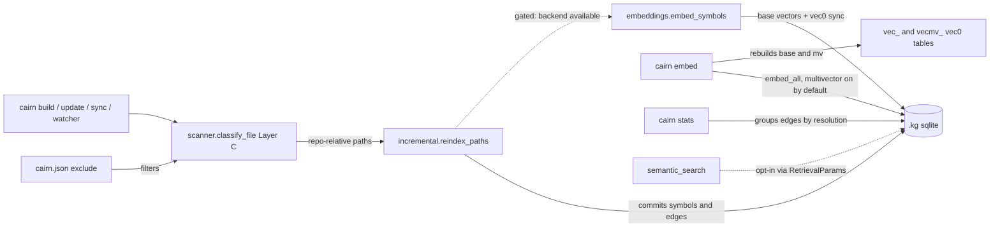
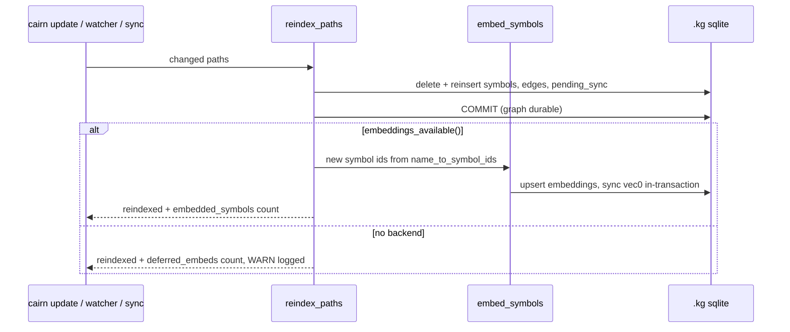

# Tech Spec: indexing-exact-rate

**Spec**: [spec.md](spec.md) | **Created**: 2026-09-13
**Baseline**: 0.20.1 @ `ac09d4b` (`feat/indexing-exact-rate`) — survey.md header
**Every file/symbol citation below comes verbatim from [survey.md](survey.md)
or a grep/read run in this session — never from memory.**

## Architecture

The spec lands four seams on the existing pipeline and adds one config file;
no new modules, no new tables. All four reuse machinery the survey verified
as built: scanner Layer C exclusion, the unwired `embed_symbols` seam, the
opt-in multivector producers, and the `get_stats` aggregation.



Flow: every indexing path (build, `cairn update`, `cairn sync`, the file
watcher, MCP catch-up) funnels through
`src/cairn/graph/incremental.py:reindex_paths:24` (module docstring lines
3–5; caller grep this session: `incremental_update` at incremental.py line
359, `src/cairn/graph/watcher.py:_do_catch_up` line 131,
`src/cairn/cli/system.py` sync at line 594, and
`src/cairn/graph/incremental.py:_reindex_file:841` delegating at line 853).
The committed `cairn.json` filters noise before parse
(`src/cairn/graph/config.py:load_config:70` →
`src/cairn/graph/scanner.py:_build_config_spec:323` →
`src/cairn/graph/scanner.py:classify_file:376`, Layer C at lines 418–420).
After the per-file COMMIT (incremental.py line 246), the new gated leg embeds
just-created symbols via `src/cairn/graph/embeddings.py:embed_symbols:1549`.
`cairn embed` keeps its wholesale path
(`src/cairn/graph/embeddings.py:embed_all:1403`) with the multivector default
flipped; `cairn stats` reads a resolution GROUP BY the build summary rail
already computes (survey FR-005: the rail prints exact/ambiguous/unresolved
today). Query-side `semantic_search` is deliberately untouched — see D-003.

## Solution

### Chosen approach

**FR-001 — committed exclusion config.** Commit `cairn.json` at repo root:

```json
{"exclude": ["src/cairn/dashboard/static/chunks/", "benchmarks/datasource/"]}
```

Exactly the shapes build B validated (survey FR-001b/FR-006b): zero symbols
under either prefix, 7,467 remaining symbols identical to build A's non-noise
count, `skipped_files` reason `config_exclude` ×179 (103 + 76). No code
change — Layer C already skips and records these
(`src/cairn/graph/builder.py:_record_skips:160`; table at
`src/cairn/graph/schema.py` lines 171–181). Bench/eval safety is
survey-verified (FR-001d: corpora load from disk or throwaway copies).
Shapes and the `.min` directory-component case are adjudicated in D-004.

**FR-002 — update-path embedding at the reindex funnel.** In
`reindex_paths`, immediately after the per-file `conn.execute("COMMIT")`
(incremental.py line 246), flatten the new ids collected by
`insert_parsed_file` into `name_to_symbol_ids` (filled at incremental.py
lines 232–235) and call `embed_symbols(conn, new_ids)` gated on
`src/cairn/graph/embeddings.py:embeddings_available:94`. One hook covers
every producer: CLI update (single-file and repo modes), sync, watcher
passes, MCP catch-up. Ordering diagram:



The pre-existing delete of changed files' embeddings (incremental.py lines
146–175, incl. vec0 row cleanup) means changed symbols are unembedded today
until a manual `cairn embed`; the post-COMMIT call closes that gap. Placement
rationale and the FR-003 observability surface are D-002.

**FR-003 — degrade-not-fail.** If the gate is closed or `embed_symbols`
raises, the update still succeeds: absorb the error, log one WARN per pass
with the deferred count (warn-once doctrine per
`src/cairn/graph/embeddings.py:warn_hash_fallback_once:632` and
`src/cairn/graph/ann_index.py:warn_ann_fallback_once:69`), and record
`deferred_embeds` in the return dict. This mirrors the in-repo degrade
precedent `src/cairn/knowledge/ingest/executor.py:execute_manifest:10`
lines 63–66 (`embedded: int | None = None` when deferred) and explicitly does
NOT mirror the embed CLI's hard exit
(`src/cairn/cli/embed.py:_exit_backend_unavailable:11`, gates at lines
209/227). The doctor check is rejected for this spec — D-002.

**FR-004 — multivector default flip, build side only.** Three coordinated
changes: (a) `embed_all`'s parameter default flips
(`src/cairn/graph/embeddings.py:embed_all:1403`, `multivector: bool = False`
at line 1410 → `True`; mv pass gated at lines 1525–1528 starts running by
default; producers `_embed_mv_kinds:1267` and `MV_KINDS` at line 292 are
untouched); (b) the CLI flag becomes a secondary pair
`--multivector/--no-multivector` with `default=True`
(`src/cairn/cli/embed.py` flag at lines 160–166; help text rewritten — the
current "Off by default … byte-identical to before" wording is the contract
being retired); the mv index rebuild at cli/embed.py lines 313–317 and the
"mv vectors" summary row at lines 328–329 follow the flag, so a default
`cairn embed` builds both `vec_` and `vecmv_`
(`src/cairn/graph/ann_index.py:rebuild_index:216`, source closed set at
lines 156–160); (c) the three bench call sites pin
`multivector=False` explicitly (`src/cairn/bench/agent_suite.py` line 606,
`src/cairn/bench/perf_suite.py` line 159, `src/cairn/bench/scaling_suite.py`
line 91 — perf_suite times `embed_all` as an op and scaling_suite measures
embed latency; inheriting the default would silently change what they
measure). Migration is lazy per spec Assumption: per-kind `_chunk_hash`
staleness (embeddings.py lines 1276–1281) means existing workspaces populate
`embeddings_mv` on their next embed pass. Query side stays opt-in
(`src/cairn/graph/semantic.py:RetrievalParams:343`, field at line 456) —
the asymmetry argument is D-003.

**FR-005 — resolution shares in stats.** `get_stats`
(`src/cairn/graph/stats.py:get_stats:17`) gains one GROUP BY over
`kind IN ('calls','references')` × `resolution` (the FR-006-comparable
denominator; `edges_resolved` at lines 40–42 stays). The CLI renders one
`display.kv` row beside the existing edges row
(`src/cairn/cli/core.py:stats:449`, edges printed at line 462): counts plus
exact/ambiguous as shares of the exact+ambiguous pool. Keys are additive, so
the other `get_stats` consumers (grep this session:
`src/cairn/cli/system.py` line 431, `src/cairn/mcp_server/_server_core.py`
line 477, `src/cairn/wiki/generator.py` line 54) are unaffected.

**FR-006 — re-derived targets (D-001).** Acceptance becomes: post-exclusion,
≥75% exact / ≤25% ambiguous of the calls+references exact+ambiguous pool,
measured by the survey's one-query SQL (FR-006a/FR-006b, runs today);
embedding coverage 100% of indexed symbols after an embed pass. The
projection this is derived from is 75.81% exact (15,000/19,786, build B).

### Alternatives rejected

| Alternative | Why rejected |
|-------------|--------------|
| Keep FR-006's ≥95% with a recorded shortfall path | Exclusion + existing machinery measures 75.81% (survey FR-006b); 95% is unreachable in scope, so the shortfall path is guaranteed to fire — D-001 |
| Pre-commit embed inside the reindex transaction | `embed_symbols` self-commits (batch flush + `note_contention`, embeddings.py lines 1658–1661), which would prematurely commit the reindex's inserts and break the rollback dance at incremental.py lines 259–265 — D-002 |
| Hook embedding in `incremental_update` / watcher `_update_pass` instead of `reindex_paths` | Duplicates the gate and misses the other funnel callers (sync at system.py line 594, `_do_catch_up` at watcher.py line 131, `_reindex_file`); incremental.py docstring lines 3–5 name `reindex_paths` as the common entry — D-002 |
| Mirror the embed CLI's hard exit on the update path when no backend | Contradicts FR-003 and the repo's degrade precedent executor.py lines 63–66 (survey FR-003) |
| Doctor check as the FR-003 observability surface | WARN log + result-dict counts already satisfy AC4's "log/doctor-observable" via the log leg; a doctor check adds a surface pinned into the sequence at system.py lines 1764–1774 for marginal gain — D-002 |
| Flip the query-side default (`RetrievalParams.multivector`) together with the build side | Changes result ordering for every `semantic_search` caller with no eval gate; spec Scope defers retrieval-quality changes to an eval-gated follow-up — D-003 |
| Extend `_is_minified` to match `.min` as a directory component | Layer C config already covers this repo's case (build B); Layer D skips are include-unoverridable (classify_file docstring lines 385–388), so widening them removes the escape hatch — D-004 |
| `pending_sync` rows as the deferred-embed channel | Tracks files, not embeds (survey supporting evidence); would overload the staleness banner's meaning |
| Force-migrate `embeddings_mv` on existing workspaces | Spec Assumption (lazy migration via per-kind content-hash staleness) makes a forced step redundant |

## Impact analysis

Blast radius per changed surface. Caller inventories are grep output from
this session; survey items back the machinery claims.

| Surface | Change | Direct callers / consumers | Effect if wrong |
|---------|--------|----------------------------|-----------------|
| `cairn.json` (new, repo root) | two exclude globs | every build/update of this repo via Layer C (`config.py:load_config:70`, `scanner.py:_build_config_spec:323`, `classify_file:376`) | over-broad globs hide real code from the index; `include` can override (Layer C is overridable, Layer D is not) |
| `incremental.reindex_paths` | post-COMMIT embed + 2 result keys | `incremental_update` (incremental.py:359), `watcher._do_catch_up` (watcher.py:131), cli sync (system.py:594), `_reindex_file` (incremental.py:853), tests | an embed failure that escapes the try/except fails updates it must not; return keys are additive so readers of `reindexed`/`deleted` are safe |
| `embeddings.embed_all` | default `multivector=True` | 4 production callers (cli/embed.py:292 passes the flag explicitly; bench ×3 — pinned False) + 78 kwarg-less test call sites across 17 test files (grep count, this session) | tests inherit mv writes: green except the pin set below; slower first embed (name+docstring kinds) |
| `cli/embed.py` | flag pair + wiring | `cairn embed` users; 2 CLI pin tests | scripts passing `--multivector` keep working (redundant, still accepted); `--no-multivector` restores the byte-identical single-vector build |
| `stats.get_stats` + `cli/core.py:stats` | additive resolution keys | `system.py:431`, `_server_core.py:477`, `wiki/generator.py:54` (read specific keys) | minimal-schema DBs return empty GROUP BYs — default the counts to 0 (convention: `tests/test_status_resource_health.py` minimal-schema fixture, survey CONV) |
| superseded tests | rewrite per FR-004 | see pin adjudication below | leaving a red pin blocks C-02; leaving a stale-green pin lies about the default |

**Test-pin adjudication (correction to the survey's flat list of 8).** The
survey's FR-004 gap names 8 pins and itself notes "(query-side flag-off
tests stay valid — they pin RetrievalParams, not the build default)". Read
against the code this session, the set splits three ways:

- Mechanically red on the flip (rewrite, C-02 failing-test-first):
  `tests/test_embeddings_mv.py:test_flag_off_writes_zero_mv_rows_and_keeps_summary_shape:148`
  (kwarg-less `embed_all`, asserts zero mv rows at lines 157/162 and no
  `mv_embedded` key at 156);
  `tests/test_embeddings_mv.py:test_cli_multivector_flag_wires_to_embed_all:455`
  (CLI off-leg asserts zero mv rows, lines 478–489);
  `tests/test_ann_vecmv.py:test_cli_multivector_rebuilds_both_indexes:279`
  (off-leg asserts no `vecmv_` table and zero mv rows, lines 319–337);
  and one site **beyond the survey's list**:
  `tests/test_multivector_query.py:test_empty_mv_table_flag_on_equals_flag_off:365`
  (kwarg-less `embed_all`, asserts zero mv rows at lines 370–371).
- Green but stale contract (rewrite to pin the explicit opt-out):
  `tests/test_embeddings_mv.py:test_flag_off_base_table_identical_to_flag_on_base_table:165`
  (passes explicit kwargs both legs — stays green, but exists to pin the
  retired default's byte-identity);
  `tests/test_ann_vecmv.py:test_default_build_never_creates_vecmv_table:85`
  (API-level rebuild never creates vecmv regardless of embed default — green,
  but its "multivector off: the default" contract text is now false).
- Survive untouched (query-side, per the survey's own parenthetical):
  `tests/test_multivector_query.py` lines 210/221/462
  (`test_flag_off_param_shapes_byte_identical`,
  `test_flag_off_never_reads_embeddings_mv`,
  `test_ann_flag_off_shapes_and_sql`) — their fixtures embed with explicit
  `multivector=True` and they pin `RetrievalParams` shapes, which FR-004
  deliberately leaves opt-in.

**Update-path embed blast radius.** The watcher's debounced `_update_pass`
(watcher.py lines 504–506) now performs embedding work inside its pass —
bounded to changed symbols, gated on backend availability, and
lock-contention-shaped errors already self-absorb via `note_contention`
(embeddings.py line 1661). The single-file `cairn update` path
(`cli/update.py` lines 25–26 → `_reindex_file` → `reindex_paths`) inherits
the hook for free. `incremental_update`'s return dict (lines 394–398)
surfaces the new counts to `cli/update.py:51` and the watcher.

**No migration for existing DBs.** The live DB keeps its 13,232 noise symbols
until a fresh `cairn build` — incremental diffs only reindex changed files,
so newly-excluded unchanged files are never revisited. AC1 scopes acceptance
to fresh builds; the stale-installed-binary caveat (repo context: use
`python3 -m cairn` / `.venv/bin/cairn` from the tree, never
`~/.local/bin/cairn` 0.20.0) applies to whoever rebuilds it.

## Code guide

### Exclusion config (FR-001)
- Touches: new `cairn.json` at repo root; no source file
- Approach: exactly the two validated globs (trailing slashes = directory
  anchors, repo-root-relative per `scanner.py:_build_config_spec:323`);
  commit alongside a test that builds a fixture workspace with the committed
  file and asserts zero symbols under both prefixes
- Verify before implementing: `git ls-files -- cairn.json` (empty today,
  survey FR-001b)
- Pitfalls: globs are repo-root-relative, not absolute; `include` overrides
  Layer C but nothing overrides Layer D — keep these paths in Layer C, not
  `_is_minified` (D-004)

### Update-path embed (FR-002, FR-003)
- Touches: `src/cairn/graph/incremental.py:reindex_paths:24` (after the
  COMMIT at line 246); return dict; `embeddings.embed_symbols:1549` and
  `embeddings_available:94` consumed, not changed
- Approach: gather ids from `name_to_symbol_ids` (populated at lines
  232–235), gate, call `embed_symbols`, absorb failures, add
  `embedded_symbols` / `deferred_embeds` keys; WARN once per pass when
  deferring
- Verify before implementing: `grep -rn embed_symbols src/cairn | grep -v "def embed_symbols"` (only the contention-note string at line 1661 today, survey FR-002)
- Pitfalls: do not embed inside the per-file transaction (D-002); the
  watcher calls this under the build lock — keep the embed bounded to the
  changed ids; tests must not patch global subprocess (C-04)

### Multivector default flip (FR-004)
- Touches: `src/cairn/graph/embeddings.py:embed_all:1403` (default at line
  1410); `src/cairn/cli/embed.py` (flag lines 160–166, wiring 313–317,
  panel 328–329); bench pins at `agent_suite.py:606`,
  `perf_suite.py:159`, `scaling_suite.py:91`; the six-pin rewrite set above
- Approach: flip the default, convert the flag to a secondary pair
  (`--multivector/--no-multivector`, default True), rewrite the help text
  (it currently promises the retired contract), pin bench sites False;
  rewrite the red pins first (C-02), then the stale-green ones
- Verify before implementing: `CAIRN_LIB=/tmp/__no_such_lib__ uv run --extra test pytest tests/test_embeddings_mv.py tests/test_ann_vecmv.py tests/test_multivector_query.py -q` (green today; the named pins go red on the test-first commit)
- Pitfalls: the query-side pins in `test_multivector_query.py` (210/221/462)
  must stay green — if they break, the query default leaked; remember the
  CLI off-leg tests invoke without the flag, which is now ON

### Stats resolution shares (FR-005)
- Touches: `src/cairn/graph/stats.py:get_stats:17`; `src/cairn/cli/core.py:stats:449`
- Approach: GROUP BY over calls/references × resolution, counts defaulted to
  0 on empty; one `display.kv` row beside the edges row (line 462) with
  exact/ambiguous as pool shares
- Verify before implementing: `CAIRN_HOME=$(mktemp -d /tmp/cairn-tech.XXXXXX) .venv/bin/cairn stats | grep -ci exact` (0 today, survey FR-005)
- Pitfalls: keep `edges_resolved` untouched (other consumers read it); the
  minimal-schema fixture must not raise on the new query

### Acceptance measurement (FR-006)
- Touches: no code; audit SQL
- Approach: the survey's pool query against a fresh post-exclusion build —
  `SELECT ROUND(100.0*SUM(CASE WHEN resolution='exact' THEN 1 ELSE 0 END)/COUNT(*),2), COUNT(*) FROM edges WHERE kind IN ('calls','references') AND resolution IN ('exact','ambiguous');` — plus embedded-vs-indexed symbol counts under the current model
- Verify before implementing: run it against build B's DB path in survey FR-006b (75.81 | 19786)
- Pitfalls: build with the tree venv (`CAIRN_HOME` pinned to a mktemp dir),
  never the stale installed binary; the pool is calls+references only, not
  all edges

## References

- [research.md](research.md) — gate rationale: every choice closed by
  internal evidence; no external candidates to weigh
- [survey.md](survey.md) — single source of truth for every citation here
- `specs/archive/2026-09-11-remove-scip-exact-rate` — the landed direction
  this spec builds on (tree-sitter-only indexing; FR-005's pool definition)
- `specs/context/tech.md` — harness context; survey notes its version stamp
  lags (0.20.0 vs pyproject 0.20.1)

## Decisions

### D-001: re-derive FR-006's exact-rate target from the measured residual
- **Context**: FR-006 demands ≥95% exact of the calls+references pool, but
  the only in-scope lever on `edges.resolution` is FR-001's exclusion —
  FR-002/003/004 touch embeddings and FR-005 observability, none move
  resolution. Exclusion alone measures 75.81% (15,000/19,786, survey
  FR-006b); `references` ambiguity is already 0 post-exclusion and the
  residual 4,786 ambiguous `calls` persist "beyond current machinery"
  (survey FR-006b verdict; spec Risk #1). A 95% gate is therefore
  unreachable without out-of-scope resolution work (spec Scope defers
  receiver-inference depth and parser signal).
- **Decision**: re-derive to **≥75% exact / ≤25% ambiguous** of the
  post-exclusion calls+references exact+ambiguous pool (0.81pp margin under
  the 75.81% projection, absorbing tree drift while still tripping real
  regressions); the embedding-coverage leg stays 100% after an embed pass
  (fully in-scope-controllable). The 95% figure is recorded as the
  north-star for a future resolution-quality spec, not this spec's gate.
  Spec owner applies the FR-006 amendment; this decision is the
  adjudication the spec's Risk #1 reserved.
- **Consequences**: cost-if-wrong keeping 95% — guaranteed closing-audit
  failure after implementation completes, forcing an emergency re-adjudication
  or scope-creep pressure into deferred resolution work. Cost-if-wrong at
  75% — a later legitimate resolution improvement merely overshoots a loose
  bar (harmless; FR-005's shares surface regressions independently), and the
  0.81pp margin absorbs routine tree drift while a genuine regression still
  fails the gate.

### D-002: embed post-COMMIT in reindex_paths; FR-003 surface = WARN log + result counts
- **Context**: survey FR-002 pins the fill at incremental.py lines 232–235
  and the COMMIT at line 246; the degrade precedent is executor.py lines
  63–66 (embedded=None when deferred) versus the embed CLI hard-exit
  (`_exit_backend_unavailable:11`). FR-003 must be observable without a
  doctor surface.
- **Decision**: place the embed immediately after the per-file COMMIT inside
  `reindex_paths` (not `incremental_update`, not the watcher) using the new
  ids from `name_to_symbol_ids`, gated on `embeddings_available()`, wrapped
  so failures degrade. Pre-commit placement is rejected because
  `embed_symbols` flushes/commits its own batches (embeddings.py lines
  1658–1661) — called mid-transaction it would prematurely commit the
  reindex's inserts and defeat the rollback dance at incremental.py lines
  259–265. FR-003's surface: one WARN per deferred pass (warn-once doctrine)
  plus `embedded_symbols`/`deferred_embeds` keys in the return dict that
  `cli/update.py` prints; the doctor check is rejected as follow-up scope
  (it would add a surface to the pinned sequence at system.py lines
  1764–1774 for a state the WARN already names — revisit if deferrals prove
  common).
- **Consequences**: a crash between COMMIT and embed leaves symbols
  unembedded — exactly today's state, observable via the WARN and the
  counts, repaired by the next embed pass (idempotent by content_hash).
  The watcher's debounce window lengthens by the embed time of changed
  symbols only. AC4's "log/doctor-observable" is satisfied on the log leg.

### D-003: flip the build default only; pin bench callers; supersede the true pin set
- **Context**: FR-004 flips `cairn embed` to multivector-by-default. The
  survey lists 8 superseded pins; code review this session shows that list
  mixes three classes (see Impact analysis). The query-side default
  (`RetrievalParams.multivector`, semantic.py line 456) is a separate
  opt-in the spec leaves to tech/plan.
- **Decision**: flip `embed_all`'s default and the CLI flag together (a
  secondary `--multivector/--no-multivector` pair, default True — old
  `--multivector` invocations stay valid and redundant, clean cutover
  without breaking scripts). Pin `multivector=False` explicitly at the
  three bench `embed_all` sites so perf/scaling baselines keep measuring
  what they measured. Supersede exactly the six build-side pins
  (test_embeddings_mv.py:148/455, test_ann_vecmv.py:279/85,
  test_multivector_query.py:365 — the last beyond the survey's list) via
  C-02 failing-test-first; the three query-side pins
  (test_multivector_query.py:210/221/462) stay green and untouched. The
  asymmetry is correct because building mv rows is idempotent, lazily
  migrated, and invisible to every current query (the query default stays
  off), while flipping the query default would reorder results for all
  `semantic_search` callers with no eval gate — the spec's Scope reserves
  that for an eval-gated follow-up. Storage cost (~3× vectors, first-embed
  latency) is the accepted price; `--no-multivector` is the escape hatch.
- **Consequences**: 78 kwarg-less `embed_all` test sites across 17 files
  inherit mv writes — green except the pins above, at some suite-time cost;
  the bench pins locally re-pin the old default (recorded here, not silent);
  any consumer asserting the summary's exact key set must use the opt-out.

### D-004: exclusion via Layer C config only; do not widen _is_minified
- **Context**: FR-001 needs the two noise areas gone; survey FR-001c shows
  `_is_minified` (scanner.py line 365, filename markers at lines 366–369)
  misses the chunks because `.min` sits in a directory component
  (`src/cairn/dashboard/static/chunks/mermaid.esm.min/`), and the pretty-
  printed 206-line files are under MAX_FILE_SIZE (line 123).
- **Decision**: commit the two validated directory-anchored globs (build B:
  zero noise symbols, `other` count identical, `config_exclude` ×179) and
  reject extending `_is_minified` to directory components. Layer C is the
  designed, config-visible escape hatch; Layer D skips are absolute —
  `include` overrides A/B/C but NOT Layer D (classify_file docstring lines
  385–388) — so widening Layer D would hard-skip any future legitimate
  `.min`-named directory with no config recourse.
- **Consequences**: a future repo with minified assets in `.min`
  directories and no `cairn.json` re-admits noise — observable via
  FR-005's shares and `skipped_by_reason`, fixable by a one-line exclude.
  Existing DBs (incl. the live one) keep their noise symbols until a fresh
  build; no migration ships.
