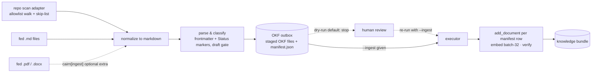
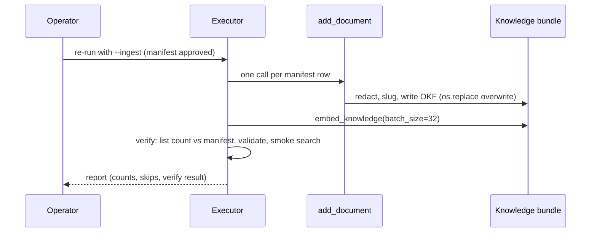

# Tech Spec: multi-source-doc-ingestion

**Spec**: [spec.md](spec.md) | **Created**: 2026-08-26
**Every file/symbol citation below must come verbatim from [survey.md](survey.md)
or a grep/graph run in this session — never from memory.**

## Architecture

The feature is a new `ingest` package inside the knowledge layer
(`src/cairn/knowledge/ingest/`) plus one additive CLI subcommand
(`cairn knowledge ingest`). Everything upstream of the write chokepoint is new,
read-only code; the only existing-code edits are additive: an optional
`description` parameter on `add_document` (`src/cairn/knowledge/store.py`), an
`ingest` key in `cairn.json` loading (`src/cairn/graph/config.py`), and a
`cairn[ingest]` extra in `pyproject.toml`.



The write side is an ordering story (stage → approve → write → embed → verify),
drawn separately per the one-diagram-per-concept rule:



How this sits in the existing system (survey-grounded): the store side is
untouched — the executor reuses the exact store-resolution pattern every
knowledge subcommand uses (`resolve_store()` / `store.ensure()` /
`OKFBundle(str(store.knowledge))`, `src/cairn/cli/knowledge.py:44-46`), and
writes through `add_document` (`src/cairn/knowledge/store.py:93-106`), which
already provides privacy redaction (`strip_private_data` at
`src/cairn/knowledge/store.py:127-128`, defined in
`src/cairn/memory/privacy.py:57-70`) and deterministic concept ids
(`src/cairn/knowledge/store.py:131-133`). Staging serializes read-only via the
OKF serializer (`to_markdown`, `src/cairn/okf/concept.py:166-197`) — the outbox
is files for review, never a store write.

## Solution

### Chosen approach

One staged pipeline, three source adapters, one engine, one executor:

| FR | Solution element |
|----|------------------|
| FR-001 | `RepoScanAdapter` in `ingest/adapters.py`: allowlist walk of doc dirs + built-in skip-list (drafts, meeting notes, generated mirrors, changelogs, templates), every skip logged with a reason into the manifest. New skip-list contract for knowledge ingestion (distinct from `DEFAULT_SKIP_DIRS` at `src/cairn/graph/scanner.py:102`, which is code-indexing only — survey FR-001). |
| FR-002 | `FedMarkdownAdapter` in `ingest/adapters.py`: `--file`/`--dir` args feed `.md` straight into the same parse/classify/stage engine (survey FR-002: no fed-file path exists today). |
| FR-003 | `convert.py`: pdf/docx → markdown behind lazy imports of the `cairn[ingest]` extra (D-002); extra absent or garbage extraction → skip with logged reason (no empty doc — AC US4-2). |
| FR-004 | `parser.py` (YAML frontmatter via core `pyyaml>=6.0`, `pyproject.toml:44`; minimal-parser fallback; inline `**Status:**`/`## Status` markers) + `classifier.py` (doc-kind → doc_type map, layered per D-007). |
| FR-005 | Status gate in `classifier.py`: skip `draft/proposed/review/superseded/deprecated` with reason; `--include-drafts` ingests with a `draft` tag. Orthogonal to the store's own `DOC_STATUSES` lifecycle (`src/cairn/knowledge/store.py:195`) — survey FR-005. |
| FR-006 | `staging.py`: one OKF file per accepted doc via `OKFConcept`/`to_markdown` reuse (frontmatter exactly per the serializer contract at `src/cairn/okf/concept.py:166-197`; extensions carry tier/doc_status/doc_source/affects_*, since `fm.update(self.extensions)`), body with frontmatter stripped + `Source:` line; plus `manifest.json` (schema in D-009). |
| FR-007 | `identity.py`: path-derived stable ID (D-006), title `"{stable ID} — {frontmatter title}"`, `({repo})` suffix on cross-repo slug collisions, tags = source tags ∪ {stable ID, origin repo}, `affects_repos` = origin repo, `affects_modules` = source doc dir, `doc_source` = `imported` (matches existing `add_document` writes: `src/cairn/knowledge/store.py:105`, `:142`), description extracted (frontmatter description → first meaningful body paragraph → synthesized provenance line) and passed via the new optional `description` param (D-004) — today `src/cairn/knowledge/store.py:151` hardcodes `description=title` (survey FR-007). |
| FR-008 | `executor.py`: default stops after staging; `--ingest` re-run writes each manifest row in-process via `add_document` (D-003), then `embed_knowledge` with `batch_size=32` (`src/cairn/graph/embeddings.py:1263`), then verify: `list_documents` count vs manifest (`src/cairn/knowledge/store.py:162-183`), `cairn validate` (`src/cairn/cli/validate.py:11-25`), smoke searches. |
| FR-009 | Determinism end-to-end: rows processed in sorted (repo, relpath) order; concept_id is already slug-deterministic (`slugify` at `src/cairn/okf/utils.py:13-20`, used at `src/cairn/knowledge/store.py:131-133`) and file writes already overwrite atomically (`os.replace`, `src/cairn/okf/concept.py:159`) — survey FR-009. |
| FR-010 | `cairn.json` grows an `ingest` key recognized by `load_config` (`src/cairn/graph/config.py:69`), layered over built-in defaults (D-005). Today only `exclude/include/repo_namespaces/scip` are recognized (`src/cairn/graph/config.py:63-66`) — survey FR-010. |
| FR-011 | `knowledge_ingest` command registered on the existing `knowledge` Click group (`@main.group()` at `src/cairn/cli/knowledge.py:12-15`); today's help lists `add, embed, export, impact, import, list, remove, search, status, workflow` with no `ingest` (survey FR-011 paste). `scripts/ingest_docs.py` does not exist (survey) — subsumed by design. |
| FR-012 | Generic by construction: built-in defaults, config overrides, `resolve_store()` for store resolution (cwd-aware, `src/cairn/paths.py:180`; workspace via `resolve_workspace`, `src/cairn/paths.py:160`), zero corpus-specific strings (survey FR-012: satisfied by design if `resolve_store()` is used and no hard-coding). |

Milestone alignment (plan.md): M1 = engine (`adapters` fed-md path, `parser`,
`classifier`, `identity`, `staging`, manifest schema, CLI skeleton); M2 = repo
scan; M3 = executor + `description` param; M4 = `convert.py` + extra (gated by
D-002 below, which discharges the C-04 requirement); M5 = config key.

### Alternatives rejected

| Alternative | Why rejected |
|-------------|--------------|
| markitdown[pdf] as the PDF converter | pdfminer/pdfplumber backends score worst-tier on heading hierarchy (≈0.0) and tables (≈0.27) in third-party benchmarks (research RQ1) — headings carry the FR-004 classification signal, so converted PDFs would largely defeat classification (AC US4-1). |
| docling / MinerU / Marker | heavy ML runtimes (torch/onnx, GPU-leaning) against FR-003's lightweight pure-python, no-system-binary goal (research RQ1). |
| markitdown[docx] for docx | it IS mammoth + lxml + markdownify underneath but bundles base deps (beautifulsoup4, requests, markdownify, magika, charset-normalizer, defusedxml — research RQ2); since PDF is not markitdown either, the wrapper buys nothing but its dep weight. |
| Subprocess `cairn knowledge add` per manifest row | the CLI handler is just `resolve_store()/ensure()/OKFBundle` + `add_document` (survey: `src/cairn/cli/knowledge.py:44-46`, add at `:18-57`); ~170 subprocess spawns and output-parsing fragility to reach the same chokepoint (D-003 keeps the constraint's substance: `add_document` stays the single write path). |
| Separate ingest config file (e.g. `.cairn-ingest.json`) | invents a second config mechanism beside the documented one — `load_config` already reads `cairn.json` at the workspace root (`src/cairn/graph/config.py:77`) (survey FR-010). |
| Pure content-hash doc ids | identity breaks on trivial edits and collides on duplicate content across repos (research RQ3). |
| Sequence-number ids (adr-tools `nnnn-title`) | requires a corpus-wide numbering authority cairn won't have; corpus growth renumbers (research RQ3). |
| Frontmatter-only classification (MADR-only) | frontmatter status exists only in well-groomed corpora; legacy corpora rely on filename/directory conventions and inline markers (research RQ4 — which FR-004 explicitly requires as fallback). |
| Extending `import_directory` with classification | out of scope by spec ("changes to cairn core (`knowledge import` frontmatter awareness …)" deferred); it has 6 callers including `cairn init --import-docs` (`src/cairn/cli/core.py:127-139`, uniform `doc_type="spec"` — survey) whose behavior would change. |
| Direct bundle writes from staging | violates the single-write-chokepoint assumption (spec) and forfeits `strip_private_data` redaction at `src/cairn/knowledge/store.py:127-128` (survey). |

## Impact analysis

Blast radius measured with this workspace's cairn graph tools (precise mode,
this session) plus `cross_repo_deps(cairn)`: **no dependencies in either
direction — single-repo blast radius, no external dependents.**

| Symbol | Change | Direct callers (precise) | Risk |
|--------|--------|--------------------------|------|
| `add_document` (`src/cairn/knowledge/store.py:93-106`) | add optional `description=None` param (D-004); default behavior unchanged | **25**: production — `knowledge_add` (`src/cairn/cli/knowledge.py:51`), `import_directory` (`src/cairn/knowledge/store.py:297`), `add_workflow` (`src/cairn/knowledge/workflow.py:74`), `knowledge_add` (`src/cairn/mcp_server/tools_knowledge.py:45`); the other 21 are tests across `tests/test_efficiency_hygiene.py`, `tests/test_audit_remediation.py`, `tests/test_knowledge_workflow.py`, `tests/test_knowledge_status.py`, `tests/test_redaction_chokepoints.py`, `tests/test_core_smoke.py` | Optional-param-only ⇒ non-breaking. Recursive impact 61 total (25 direct + 31 depth-1 + 3 depth-2 + 2 depth-3), no cycles |
| `knowledge` CLI group (`src/cairn/cli/knowledge.py:12-15`) | add one `ingest` subcommand (FR-011) | Group registration; subcommands are a flat list (survey: help paste) | Additive; plan.md's parallelization note covers the shared-option merge point |
| `load_config` (`src/cairn/graph/config.py:69`) | recognize an `ingest` key (D-005) | **6**: `_load_namespaces` (`src/cairn/graph/cross_repo.py:104`), `_build_config_spec` (`src/cairn/graph/scanner.py:330`), `_build_graph_impl` (`src/cairn/graph/builder.py:418`), `config` (`src/cairn/cli/core.py:214`), + 2 tests in `tests/test_cross_repo_namespaces.py` | Existing callers ignore the new key — additive dataclass field |
| `import_directory` (`src/cairn/knowledge/store.py:265-311`) | none (read-only reference point) | 6: `init` (`src/cairn/cli/core.py:136`), `knowledge_import` (`src/cairn/cli/knowledge.py:78`), 4 tests | Untouched by design |
| `slugify` (`src/cairn/okf/utils.py:13-20`) | none — reused read-only by `identity.py` | 6: `store_memory` (`src/cairn/memory/store.py:107`), `promote_memory` ×2 (`src/cairn/memory/promotion.py:377`, `:380`), `add_document` ×2 (`src/cairn/knowledge/store.py:131-132`), `_resolve` (`src/cairn/knowledge/workflow.py:93`) | None |
| `resolve_store` (`src/cairn/paths.py:180`) | none — reused read-only by executor/CLI | 29 across CLI/MCP/dashboard/paths | None |
| `pyproject.toml` extras (`pyproject.toml:65-137`) | new `ingest` extra (D-002); no other phase touches pyproject.toml (plan.md) | packaging only | Base install unchanged — converter deps never land without the extra |

Resolution caveat (per workspace AGENTS.md): the numbers above are precise-mode
(follow only exactly-resolved edges — trustworthy for blast radius). Common-name
note from this session's runs: `knowledge_add` exists in two modules
(`src/cairn/cli/knowledge.py` and `src/cairn/mcp_server/tools_knowledge.py`) and
precise mode distinguished them correctly; `add_document` fully resolved with no
truncation (61/61), so no fuzzy re-run was needed. If a future re-count of a
common name looks suspiciously small, re-run with `fuzzy=True` and verify each
candidate against actual code — fuzzy mixes in name-only coincidences.

## Code guide

### Area 1 — ingest package layout (M1 spine)
- Touches: new package `src/cairn/knowledge/ingest/` (nothing exists here today
  — survey FR-002/FR-006 greps for fed/outbox/manifest paths in
  `src/cairn/knowledge/` are empty). Existing knowledge package exports at
  `src/cairn/knowledge/__init__.py:11-15` (`add_document, search_knowledge,
  add_workflow, trace_workflow`) are the style to follow.
- Approach (D-001):
  ```
  src/cairn/knowledge/ingest/
    __init__.py     # public: run_ingest(...), stage-only default
    adapters.py     # SourceAdapter dispatch: fed-md (M1), repo scan (M2); each yields (repo, relpath, text, origin)
    convert.py      # pdf/docx adapter (M4): lazy import, skip-with-reason on missing extra or garbage output
    parser.py       # frontmatter YAML + minimal fallback + inline **Status:**/**## Status** markers
    classifier.py   # doc-kind → doc_type map, status gate, --include-drafts
    identity.py     # stable ID, title/slug rules, ({repo}) suffix, tag union, description extraction
    staging.py      # OKFConcept serialization → outbox files + manifest.json
    executor.py     # --ingest path: add_document per row → embed → verify
  ```
- Verify before implementing: `grep -rn 'outbox\|manifest' src/cairn/knowledge/ --include='*.py'` (survey FR-006 verify — empty today, non-empty after M1).
- Pitfalls: the OKF frontmatter is written by `to_markdown`'s fixed key order (`src/cairn/okf/concept.py:166-197`, `yaml.safe_dump(..., sort_keys=False)`) — don't hand-roll YAML in staging; set fields on the concept/extensions and let the serializer emit them. The only existing frontmatter splitter is OKF-internal (`_split_frontmatter`, `src/cairn/okf/concept.py:213-227`) — `parser.py` must parse *source-doc* frontmatter, a new, separate function (survey FR-004).

### Area 2 — CLI wiring (FR-011)
- Touches: the `knowledge` Click group at `src/cairn/cli/knowledge.py:12-15`;
  today's subcommands per the survey help paste: add, embed, export, impact,
  import, list, remove, search, status, workflow (survey FR-011; survey prose
  says "9" but its own pasted `--help` output lists these 10 — recount wins).
- Approach: `@knowledge.command("ingest")` with `--file/--dir` (FR-002), repo
  scan args (M2), `--include-drafts` (FR-005), `--ingest` approval flag
  (FR-008), `--outbox <dir>` (D-008). Store wiring copies the canonical pattern
  `resolve_store()` / `store.ensure()` / `OKFBundle(str(store.knowledge))`
  (`src/cairn/cli/knowledge.py:44-46`). Arg style follows existing patterns:
  `--file`/`--body` (add), `--type`, comma-split `--tags`/`--affects`,
  `--batch-size` (embed, default 64 — survey CLI section).
- Verify before implementing: `.venv/bin/cairn knowledge --help 2>&1 | grep ingest` (survey FR-011 verify; plan.md Phase-1 checkpoint).
- Pitfalls: M2 and M3 both add options to this same function (plan.md
  parallelization note) — keep each delta to additive `@click.option` lines,
  separate commits, second lander rebases.

### Area 3 — executor + `description` param (M3, FR-007/008/009)
- Touches: `src/cairn/knowledge/store.py` `add_document`
  (`:93-106` signature; `:151` hardcodes `description=title` — survey FR-007)
  and new `executor.py`.
- Approach (D-003, D-004): add `description=None` parameter; `description =
  description or title` preserves today's behavior for all 25 existing callers.
  Executor resolves the store exactly like every knowledge subcommand
  (`src/cairn/cli/knowledge.py:44-46` pattern), calls `add_document` per
  manifest row (title, body from row, doc_type, tags, affects_modules,
  affects_repos, resource, `doc_source="imported"`, description), then
  `embed_knowledge(conn, bundle, batch_size=32)` (`src/cairn/graph/embeddings.py:1263`)
  wiring the connection the same way the `knowledge embed` handler does
  (`src/cairn/cli/knowledge.py:138-185`), then verifies with
  `list_documents` (`src/cairn/knowledge/store.py:162-183`), `cairn validate`
  (`src/cairn/cli/validate.py:11-25`), and smoke `search_knowledge` calls.
- Verify before implementing: `grep -n 'description=title' src/cairn/knowledge/store.py` (survey FR-007 verify); regression: `.venv/bin/pytest tests/test_import_validation.py tests/test_knowledge_status.py tests/test_knowledge_workflow.py -q` (baseline 35 passed — survey) and `.venv/bin/pytest tests/test_redaction_chokepoints.py -q` (baseline 42 passed — survey; the write path must keep routing through `strip_private_data`).
- Pitfalls: redaction runs *before* slugify (`src/cairn/knowledge/store.py:127-128` before `:131`) — never bypass `add_document`. Embeddings are keyed by (doc_id, model) so re-embed after an overwrite skips by design (survey FR-009 gap) — count-stability checks must not assert re-embedding happened. `import_directory`'s 10MB cap (`IMPORT_MAX_FILE_SIZE`, survey store section) is a sane default for fed files too.

### Area 4 — converter + `cairn[ingest]` extra (M4, FR-003)
- Touches: new `convert.py`; `pyproject.toml` extras block (`pyproject.toml:65-137` — extras mechanism exists: watch, test, dev, semantic, ann, scip, otlp; no `ingest` today — survey FR-003).
- Approach (D-002): extra = `pymupdf4llm>=1.28` (research: 1.28.2 current) +
  `mammoth>=1.11` (research: 1.12.1 current; markitdown pins `~=1.11.0`) +
  `markdownify` (the HTML→md component markitdown itself uses — research RQ2;
  floor pinned at M4 time). Lazy import inside `convert.py`; missing extra →
  skip with reason "cairn[ingest] not installed"; garbage/empty extraction →
  skip with reason (AC US4-2). Tag `converted`, `resource` = original path.
- Verify before implementing: `grep -rn 'pdf\|docx' src/cairn/ --include='*.py'` (survey FR-003 verify — empty today); `grep 'ingest' pyproject.toml` (survey verify — empty today, non-empty after M4; plan.md Phase-4 checkpoint).
- Pitfalls: keep converter imports out of module import time — base installs (and CI without the extra) must import the ingest package cleanly. mammoth's Markdown output is deprecated — go HTML→markdown, not `convert_to_markdown` (research RQ2). Converter tests use `pytest.importorskip` (plan.md Phase-4 checkpoint).

### Area 5 — config surface (M5, FR-010/012)
- Touches: `load_config` in `src/cairn/graph/config.py` (`:69` function; keys
  `_EXCLUDE_KEY`/`_INCLUDE_KEY`/`_REPO_NAMESPACES_KEY`/`_SCIP_KEY` at `:63-66`;
  reads `root / "cairn.json"` at `:77` — survey FR-010) plus override wiring in
  `classifier.py`/`adapters.py`.
- Approach (D-005): add `_INGEST_KEY = "ingest"` in the same style; parse into
  a new `CairnConfig` field (raw dict → typed in the ingest package); layering:
  workspace overrides over built-in defaults for classification rules and
  skip-list. Genericity (FR-012): built-ins must run with no config file at
  all; zero corpus-specific strings.
- Verify before implementing: `grep -n '_EXCLUDE_KEY\|_SCIP_KEY' src/cairn/graph/config.py` (survey FR-010 verify — matches today, plus the new key after M5); post-M5 genericity: `grep -rn 'polaris' src/cairn/knowledge/ --include='*.py'` → empty (plan.md Phase-5 checkpoint).
- Pitfalls: the 6 existing `load_config` callers (cross_repo/scanner/builder/cli — impact table) must be unaffected; tolerate malformed `ingest` sections the way `test_config_repo_namespaces_malformed_is_ignored` (`tests/test_cross_repo_namespaces.py:41`, this session's caller list) tolerates malformed namespaces.

### Area 6 — tests (C-03)
- Touches: new files under `tests/` (151 test files today — survey test layout):
  - `tests/test_ingest_parse_classify.py` (M1: frontmatter + inline Status both yield title/status/tags/doc_type — US1-AC2; draft-skip + `--include-drafts` — FR-005)
  - `tests/test_ingest_identity.py` (M1: stable slugs, `({repo})` collision suffix, tag union, description ≠ title — FR-007)
  - `tests/test_ingest_staging.py` (M1: staged files valid OKF with `Source:` line and provenance, manifest counts + skip reasons — US2-AC1; store untouched — US2-AC2)
  - `tests/test_ingest_scan.py` (M2: allowlist walk, every skip with a reason — US1-AC1)
  - `tests/test_ingest_execute.py` (M3: approval gate, add/embed/verify, second run leaves counts unchanged — US5-AC1/AC2)
  - `tests/test_ingest_convert.py` (M4: pdf/docx happy path + garbage skip + extra-absent skip, `importorskip`)
  - `tests/test_ingest_config.py` (M5: override flips a classification/skip; bare workspace runs on defaults — FR-010/012)
- Approach: follow the documented fixture patterns — `tempfile.TemporaryDirectory()` + `OKFBundle(tmp)` (`tests/test_knowledge_status.py:21-24`), CLI via `click.testing.CliRunner` (`tests/test_cli_init_rail.py:13`, `tests/test_uninstall_cmd.py:10`), hermetic env autouse `_hermetic_env` (`tests/conftest.py:36-94`), `fresh_db` for embed-path tests (`tests/conftest.py:97-117`) and `hash_backend` when semantics are involved (`tests/conftest.py:120-134`) — survey test layout.
- Verify before implementing: `.venv/bin/pytest tests/test_import_validation.py tests/test_knowledge_status.py tests/test_knowledge_workflow.py -q` (35 passed — survey baseline).
- Pitfalls: run with cwd inside a temp workspace so `resolve_store()` (cwd-aware, survey FR-012) resolves the fixture store — the `_hermetic_env` fixture already patches HOME/CAIRN_HOME (survey).

## References

From research.md (each URL there carries the claim; why it matters here):
- https://pypi.org/project/pymupdf4llm/ — chosen PDF converter: font-derived headings/GFM tables/fenced code, fastest lightweight option.
- https://pypi.org/project/PyMuPDF/ — the AGPL/commercial dual license + full wheel coverage behind the extra-isolation decision.
- https://pypi.org/project/markitdown/ and its pyproject — MIT alternative and the extras pattern we mirror; rejected on pdfminer quality.
- https://yage.ai/share/markitdown-survey-en-20260412.html + https://thunderbit.com/blog/markitdown-review — the benchmark evidence that rejected markitdown[pdf].
- https://fossa.com/resources/devops-tools/license-compatibility-checker/mit-vs-agpl-3-0/ — MIT↔AGPL compatibility analysis shaping D-002.
- https://github.com/browser-use/browser-use/issues/2610 + https://github.com/mindee/doctr/issues/486 — real-world AGPL-dependency friction precedent.
- https://hynek.me/articles/python-recursive-optional-dependencies/ — extras as the standard isolation mechanism for heavy/viral deps.
- https://www.reddit.com/r/learnpython/comments/1ggz2pq/ (img2table) — precedent for keeping PyMuPDF strictly optional.
- https://pypi.org/project/mammoth/ — chosen docx converter: BSD-2, zero-dep universal wheel, semantic-quality HTML (Markdown deprecated).
- https://developers.llamaindex.ai/python/examples/ingestion/document_management_pipeline/ + framework-api-reference/ingestion/ — path-derived id + upsert-not-duplicate semantics backing D-006/FR-009.
- https://docusaurus.io/docs/creating-pages — deterministic path-based slug with override escape hatch (identity prior art).
- https://github.com/npryce/adr-tools — sequence-number identity scheme (rejected) and directory/numbering classification precedent.
- https://adr.github.io/madr/ — frontmatter status vocabulary anchoring FR-004/005.
- https://github.com/joelparkerhenderson/architecture-decision-record — why status vocabularies vary per org (motivates FR-010 overrides).
- Local baseline (verified this session, not memory): cairn is MIT — `LICENSE` header "MIT License … Copyright (c) 2025–2026 Tan Le"; `pyproject.toml` line 10 `license = "MIT"`.

## Decisions

### D-001: New `src/cairn/knowledge/ingest/` package
- **Context**: FR-011 requires a `cairn knowledge ingest` subcommand in this repo, subsuming the polaris-only `scripts/ingest_docs.py` plan (which does not exist — survey). The engine needs a home that plan.md's waves can build against in parallel.
- **Decision**: a dedicated `ingest` subpackage under `src/cairn/knowledge/` with the eight modules in Area 1; the existing `store.py`/`workflow.py` stay untouched except D-004.
- **Consequences**: all ingest code shares the knowledge package's import surface; M2/M3/M4/M5 land as new files or additive options (matching plan.md's parallelization map). Rejects `scripts/` placement (not importable/testable as a package).

### D-002: Converter = pymupdf4llm (PDF) + mammoth + markdownify (docx) behind `cairn[ingest]` — C-04 discharge
- **Context**: FR-003 + C-04 require a recorded dependency choice. cairn is MIT (`LICENSE`; `pyproject.toml:10`). Candidates (research): pymupdf4llm (AGPL, best structure, wheels everywhere), markitdown[pdf] (MIT, worst-tier headings/tables), docling/MinerU/Marker (best fidelity, heavy ML), mammoth (BSD-2, zero-dep) vs markitdown[docx] (mammoth + base-dep baggage).
- **Decision**: `cairn[ingest] = pymupdf4llm + mammoth + markdownify`, never core, lazy-imported in `convert.py` only; garbage extraction → skip with reason. Quality wins for PDF because FR-004 classification keys on heading structure; mammoth+markdownify reproduces markitdown's docx pipeline without its base-dep stack.
- **Consequences**: AGPL (PyMuPDF) is opt-in per install — orgs that ban AGPL simply don't install the extra and lose only pdf/docx feeding (md paths are core); the AGPL combination never forms in the default distribution. Cost: we own the small HTML→md composition and must keep the converter behind one adapter function so a future MIT swap is one-module. If distribution policy later hardens against AGPL even in extras, the fallback is markitdown[pdf] (MIT) at a documented quality loss.

### D-003: Executor writes in-process via `add_document`, not subprocess `cairn knowledge add`
- **Context**: FR-008 says "write each manifest row via `cairn knowledge add` (cwd = target workspace)"; the binding constraint is that `add_document` remains the single write chokepoint.
- **Decision**: the executor runs inside `cairn knowledge ingest` (already cwd = target workspace), resolves the store with the canonical `resolve_store()` pattern (`src/cairn/cli/knowledge.py:44-46`), and calls `add_document` per row — the same function `cairn knowledge add` calls (`src/cairn/cli/knowledge.py:51`).
- **Consequences**: no per-row process spawns (~170 rows), no output parsing, full redaction/serialization guarantees; store correctness reduces to cwd discipline which `resolve_store()` already provides (cwd-aware — survey FR-012). The spec's "via knowledge add" is honored at the API level (the CLI handler is a thin wrapper over the same call).

### D-004: Optional `description` parameter on `add_document`
- **Context**: FR-007 requires a real extracted description; `src/cairn/knowledge/store.py:151` hardcodes `description=title` with no parameter (survey FR-007). Planner-flagged as the one permitted core-touch.
- **Decision**: add `description=None`; `description = description or title` — default behavior bit-for-bit unchanged for all 25 existing callers; `knowledge add` grows a matching optional `--description` flag.
- **Consequences**: enables FR-007 with zero blast radius; documented here per the allowance. Rejected alternative (extracting description inside `add_document` from body) — would change existing callers' output silently.

### D-005: `cairn.json` gains an `ingest` key (no separate config file)
- **Context**: FR-010 needs per-workspace overrides; `load_config` (`src/cairn/graph/config.py:69`) recognizes only `exclude/include/repo_namespaces/scip` (`:63-66`).
- **Decision**: add `_INGEST_KEY = "ingest"` in the existing key style, parsed into a new `CairnConfig` field; the ingest package types and layers it (workspace overrides over built-in defaults).
- **Consequences**: one config file per workspace, consistent with the documented mechanism; additive to the 6 existing `load_config` callers who ignore the new key. Rejects a second config file (parallel mechanism).

### D-006: Identity = path-derived stable ID + deterministic slug, `({repo})` suffix on cross-repo collision
- **Context**: FR-007/FR-009 need ids stable across edits; research offers path/slug ids (LlamaIndex), content-hash ids, sequence numbers.
- **Decision**: stable ID derived from repo + relative path (stable across edits, changes on move — the documented LlamaIndex tradeoff); title `"{stable ID} — {frontmatter title}"` so the existing slug determinism (`slugify`, `concept_id = f"knowledge/{safe_doc_type}/{slug}"` — survey FR-009) yields overwrite-not-duplicate; rows processed in sorted (repo, relpath) order so collision suffixing is deterministic; identity.py caps the title portion so the full slug survives `slugify`'s 60-char truncation (`src/cairn/okf/utils.py:13-20`).
- **Consequences**: no extra state to maintain (no hash map); idempotency falls out of existing atomic overwrite (`os.replace`, `src/cairn/okf/concept.py:159`). Rejects content-hash ids (break on trivial edits, collide cross-repo) and sequence numbers (need corpus-wide authority).

### D-007: Classification is layered: frontmatter → filename/directory → inline Status markers; default `spec`
- **Context**: FR-004/FR-005; corpora mix MADR-style frontmatter, adr-tools-style prose markers, and bare convention-named files (research RQ4).
- **Decision**: parse order = YAML frontmatter (with minimal-parser fallback), then filename/directory conventions (e.g. `docs/decisions/`, `nnnn-title.md`, ADR/FEAT tokens), then inline `**Status:**`/`## Status`; built-in doc-kind → doc_type map per FR-004; unmatched fed files default to `spec` with a `fed` origin tag (US3-AC2), unmatched scanned files default to `spec`.
- **Consequences**: works on ungroomed corpora out of the box (FR-012) while precise where frontmatter exists; per-workspace overrides (D-005) adjust both the map and the skip-list. Rejects frontmatter-only (legacy corpora have none).

### D-008: Outbox default = `<workspace-root>/.cairn/ingest-outbox/`, deterministically overwritten
- **Context**: FR-006 needs a staging location that is reviewable, outside the store (`~/.cairn/<store_key>/.knowledge` — spec assumption; the outbox is not the store), and diffable across runs.
- **Decision**: `--outbox <dir>` option, default `<workspace-root>/.cairn/ingest-outbox/` (workspace root from `resolve_workspace()`, `src/cairn/paths.py:160`); each run overwrites it rather than timestamping.
- **Consequences**: re-run diffs are meaningful and idempotent; no timestamps in paths to churn; survey documents no conflicting workspace-dir convention, so this default is ours to set and is called out here for the implementers.

### D-009: Manifest JSON is the executable contract (v1)
- **Context**: FR-006 (counts by type/repo + skips with reasons) and FR-008 (verify = list count vs manifest) make the manifest the thing humans review and M3 executes; M1 defines the schema (plan.md).
- **Decision**: `manifest.json` shape — top level: `version`, `generated_at`, `workspace`, `counts {accepted, skipped, by_type, by_repo}`; `rows`: one per doc, accepted rows carry every `add_document` argument (concept_id, title, doc_type, tags, description, resource, affects_repos, affects_modules, origin/repo/source_path, `body` with the `Source:` line, staged-file path), skipped rows carry `source_path` + `skip` reason. Executor consumes only the manifest; staged OKF files are the human/OKF-tool view, cross-checked against rows at staging time (title/type must match).
- **Consequences**: execution never re-parses reviewed files and depends on no OKF read API (none documented in survey); body duplication between staged file and manifest is accepted (same source dict, same run). Schema versioned from v1 so later milestones evolve it without silent breaks.

### D-010: Execution cadence — one end-of-plan commit; C-05 batched at phase boundaries
- **Context**: plan.md's Delivery prose says "one conventional commit per task"; the spec-to-code execution mode mandates nothing is committed until the plan-wide closing audit passes, then one commit for the entire implementation.
- **Decision**: the skill's cadence governs — a single conventional commit (code + docs together, pre-verified by `pre-commit run --all-files`) after the closing audit. C-05's per-task `cairn update` + `record_memory` runs batched at phase boundaries and at closing; a graph rebuild per task on an uncommitted tree indexes churn, not state.
- **Consequences**: satisfies C-01/C-02/C-03 (branch, pre-commit, tests-traced-to-FRs unchanged). If wrong, cost is a coarser revert unit — the closing audit's scope diff still attributes every file to its task.

### D-011: Orchestrator-inline completion after repeated agent soft-budget kills
- **Context**: 6 of 8 implementer spawns were force-stopped at the harness's ~300-request soft budget mid-verification (plans complete, artifacts partial); resuming produced zombie sessions that raced the orchestrator's finishing edits.
- **Decision**: after a spawn's second unproductive cycle, the orchestrator completes the task inline (single-file, zero-unknown finishing work per the skill's inline exception). Affected: T002 tail, T003 tail, T005 tail, T006, T007, T008 tail, T009, T012, T014 tail.
- **Consequences**: identical acceptance commands gate every task either way; the closing audit re-proves the whole plan. Cost: less parallelism than the wave design intended.

### D-012: pymupdf4llm floor is >=0.0.17, not >=1.28
- **Context**: task.md T012 pinned `pymupdf4llm>=1.28`; research.md RQ1 shows 1.28.2 is the PyMuPDF ENGINE version — pymupdf4llm (the wrapper this spec depends on) versions at 0.0.x.
- **Decision**: `ingest = ["pymupdf4llm>=0.0.17", "mammoth>=1.11", "markdownify>=0.13"]` — mammoth aligned to research's markitdown-extra citation (`~=1.11.0`).
- **Consequences**: installability. If wrong (floor too low), pip resolves the latest anyway; the floor only excludes known-broken olds.

### D-013: Correction to D-012 — pymupdf4llm floor is >=1.28 after all
- **Context**: D-012 lowered the pin to >=0.0.17 citing research.md's wrapper-at-0.0.x observation; the actual install resolved `pymupdf4llm-1.28.2` — the wrapper's versioning caught up to the engine's, and task.md T012's original `>=1.28` was correct.
- **Decision**: pin `pymupdf4llm>=1.28`; mammoth>=1.11 and markdownify>=0.13 unchanged from D-012.
- **Consequences**: none at runtime (the old floor also resolved 1.28.2); the record now matches reality. D-012 stands only for the mammoth alignment.
