# Tech Spec: remove-scip-exact-rate

**Spec**: [spec.md](spec.md) | **Created**: 2026-09-11 | **Baseline**: `dc9882b224e783ab6bda25253ec049473fbf6e93`
**Every file/symbol citation below comes verbatim from [survey.md](survey.md), [research.md](research.md), or a grep run in this session — never from memory.**

## Architecture

### Current architecture (audited from survey)

The build pipeline is a hybrid. Every file is parsed by tree-sitter regardless of config
(S-02: "tree-sitter STILL parses those files"), then, inside
`src/cairn/graph/builder.py:_build_graph_impl:383`, an optional SCIP stage runs **after**
`_resolve_all` and **before** `backup_to`:

- **Config key**: `src/cairn/graph/config.py:CairnConfig:32` field `scip: Dict[str, str]`
  at line 54, parsed via `_SCIP_KEY = "scip"` (line 71) in `load_config:75` (line 107);
  `load_config` reads only five named keys and silently ignores all others (S-03).
- **Auto-generation**: builder lines 410-453 — `if cfg.scip:` (419) drives
  `from ..parsers.scip_indexers import try_generate_index` (430-431) with a 30-minute
  timeout (S-01: `_INDEX_TIMEOUT_S = 30 * 60`).
- **Import + merge + rollback**: builder lines 558-599 —
  `from ..parsers.scip_importer import scip_available, import_scip_file` (561); on a bad
  index `conn.rollback()` (593) with "Don't fail the build over a bad SCIP index" (596).
- **Revert-to-pure-SCIP**: builder lines 601-653 — trigger `added > 0 and merged == 0`
  (612); the spec's "opaque Swift USRs merging at ~0%" failure mode is this block (S-02).
- **CLI surface**: `import-scip` lives in `src/cairn/cli/hooks_viz.py:import_scip:93`
  (`@main.command(name="import-scip")` at 86) — **not** system.py, whose only scip
  reference is the module docstring `src/cairn/cli/system.py:1`; plus the `cairn config`
  echo block `src/cairn/cli/core.py:241-251` (S-04).
- **Crash-window marker**: `_clear_repo_build_state` runs deliberately AFTER the SCIP hook
  (builder comment 655-662), test-pinned in S-07 — the anchor moves when the hook dies.
- **Parser signal split (the exact-rate starting point)**: resolver tiers live in
  `src/cairn/graph/resolver.py:resolve_edge:177` — Tier 0 type-aware receiver dispatch
  (200-214, consistency guard at 209, abstains on >1), Tier 1 same-file (216-221),
  Tier 2 import-aware (`_import_aware_candidates:248`, DIRECT suffix + CONTAINING
  subsequence scoring, ties → ambiguous at 306-309), Tier 3 same-repo (235-240),
  Tier 4 global (242-244), final `return None, "ambiguous"` (245). Inputs: 4-tuples
  `(id, repo, file_id, qualified_name)` from `build_symbol_index:17`, per-file import
  paths from `build_import_index:39`, `build_members_index:68`, `build_ancestor_index:119`
  (S-10). Today **5 of 14** parsers emit `Edge.receiver_type` (go.py:349, java.py:290,
  kotlin.py:498, php.py:364, ruby.py:242 — re-counted this session) and **0 of 14**
  record import aliases (S-10: "No parser records the local alias"); python even stores
  the raw statement text as `imported_path` (this session:
  `src/cairn/parsers/python_parser.py:_parse_import:300` lines 301-302).

### Post-change architecture

SCIP stage gone; the parser→resolver seam gains three signals (import alias, receiver
type, call arity) that feed a rewritten-name tier walk with an arity tiebreak. Signals
ride **in-memory resolve tuples only** — the established pattern: builder.py:1156-1162
(this session) "Carry receiver_type as the 6th (in-memory only) tuple element so the
resolver's type-aware tier can use it".

```mermaid
flowchart TB
    subgraph today["Today: hybrid builder — dotted paths die with this change"]
        direction LR
        A1[scan workspace] --> A2[tree-sitter parse<br/>every file] --> A3[persist symbols,<br/>edges, imports] --> A4[_resolve_all<br/>6-tier walk]
        A4 -. scip key in cairn json .-> A5[import_scip_file<br/>+ merge defs]
        A5 -. merged 0 .-> A6[revert to pure SCIP]
        A4 --> A7[materialize_import_edges]
        A5 --> A7
        A7 --> A8[clear crash-window marker]
    end
    subgraph post["Post-change: tree-sitter only + signal enrichment"]
        direction LR
        B1[scan workspace] --> B2[parse + emit signals:<br/>local_alias, receiver_type, call_arity]
        B2 --> B3[persist + new columns:<br/>imports.local_alias, symbols.arity]
        B3 --> B4[resolve_edge:<br/>alias rewrite, tier walk,<br/>arity tiebreak]
        B4 --> B5[materialize_import_edges]
        B5 --> B6[clear crash-window marker]
    end
```



One pipeline, one write path. The resolver's tier contract (FR-008) is unchanged in
ordering; the new levers act *before* the walk (alias rewrite) and *at its ambiguous
branches* (arity tiebreak), never between tiers.

## Solution

### Chosen approach

Research option **(b): ctags-style signal enrichment + selective resolver join** (F1.3,
F1.5): parsers emit receiver/alias/arity signals the grammars already expose (F2.1/F2.2);
the resolver joins them selectively, abstaining wherever the join is not unique (FR-009).
No new runtime dependency (FR-006). Four levers:

1. **Single-hop alias map** (D-003). `Import` gains `local_alias: Optional[str]`
   (base.py:60-63); `imports` table gains a nullable `local_alias` column (additive ALTER,
   same pattern as `EDGE_RESOLUTION_MIGRATION` at schema.py:425 — this session).
   `build_import_index:39` additionally returns `{file_id → {alias → imported_path}}`;
   `resolve_edge` rewrites a bare `target_name` that matches a local alias to the
   imported path's final segment before the tier walk, so Tier 2's DIRECT suffix match
   (resolver.py:284-285) binds it. Re-export-shaped imports (`export *`, `__init__`
   stars, go dot-imports) record no alias — abstention per F3.2/F3.3.
2. **Receiver extraction for the 9 non-emitting parsers** (D-004), per the F2.2 grammar
   shapes: field-labeled in 11/13 grammars (`object`/`operand`/`scope`/`receiver`/
   `expression`/`qualifier`/`target`-one-level-down); swift/dart use positional child
   walks (G1/G6). Reuses the shared `src/cairn/parsers/base.py:_infer_receiver_type:152`
   heuristic plus a generalized in-file var→type tracker (kotlin's existing pattern,
   kotlin.py:643 with scope stacks at 45/72 — S-10), scope-ordered with shadow-abstain
   (D-006). Tier 0's existing consistency guard (resolver.py:209) keeps wrong guesses
   abstain-safe.
3. **Arity tiebreak** (D-005). `Symbol` gains `arity: Optional[int]` (counted where
   parsers already walk parameter lists — e.g. go.py:198 `_parse_signature` feeding
   `parameters=params` at 207, this session); `symbols` gains a nullable `arity` column;
   `Edge` gains `call_arity: Optional[int]` (argument-list length at call sites) carried
   as a 7th in-memory tuple element. Where a tier's candidate list has >1 entries and
   exactly one candidate's arity matches the call (equal-arity overloads abstain — F4.2),
   resolve exact.
4. **SCIP removal** — clean cutover per S-01..S-09: delete `scip_importer.py`,
   `scip_indexers.py`, `_scip_pb2.py`, `scripts/regen_scip_pb2.sh`, the `[scip]` extra
   (pyproject.toml:126) and the dev-only `grpcio-tools` (pyproject.toml:87); excise the
   builder blocks (S-02) re-anchoring the crash-window marker; drop the config key
   (S-03's "4-line delta"); remove `import-scip` + config echo + system.py docstring
   (S-04); refresh living docs/diagrams/skill docs (S-05/S-08).

**FR coverage**: FR-001/002/003/004 ← lever 4 (S-01..S-09). FR-005 ← § Measurement
design below. FR-006 ← levers 1-3 (resolver-core + parser-side, zero new deps).
FR-007 ← lever 2/3 land per-parser with a degrade-to-`None` contract; kotlin covered by
the vendored grammar (D-009); golden fixtures are the conformance vehicle (S-13:
`tests/fixtures/golden/regenerate.py` LANG_CONFIG covers exactly the fourteen languages).
FR-008 ← ordering preserved, D-008. FR-009 ← D-003/D-005/D-006 abstention boundaries +
`tests/test_invariants.py:test_invariant_exact_resolution_has_target_id:213` backstop
(S-13). FR-010 ← arity filter is O(candidates) only at >1 branches; alias map is one pass
over imports; the advisory bench gate (S-12: 15% threshold) plus `build_runs` phase
timings (schema.py:350-362, S-12) police it.

### Alternatives rejected

| Alternative | Why rejected |
|-------------|--------------|
| Stack-graphs scope engine (option 1a) | Upstream archived — F1.2 verbatim: "This repository is no longer supported or updated by GitHub"; only 4 languages ever had rules; new runtime dep blocked by C-03 without this D-### (D-002 records it) |
| Sourcegraph-style import/extension filtering only (option 1c) | F1.4: documented heuristics are file-extension + import filters; "converts no ambiguous reference on their own" (F1.5) — cannot move FR-005's share |
| Full module-path alias join à la stack-graphs (option 2a) | F3.2: documented to break on path/package edge cases (issue #430); re-export chains have no test coverage anywhere — misbinding risk multiplies per hop |
| Alias-aware filtering without binding (option 2c) | F3.3: Sourcegraph "never rename-binds"; smaller gain than the single-hop map for the same grammar work |
| New tree-sitter-kotlin PyPI pin (option 4a) | Unnecessary — grammar is vendored in-tree and parsing today (D-009: `_registry.py:123`, S-11 kotlin mix 0.6609); a pin would invoke C-03 for nothing |
| Persisting call-site signals on the `edges` table | Breaks the established in-memory-tuple pattern (builder.py:1156-1162) and adds a column only `repair_incoming_edges` would read — weight without measured need |
| Extending `scaling_suite._resolve_rate` for FR-005 | Wrong corpus (synthetic `generate_corpus`, scaling_suite.py:18) and wrong metric ((exact+ambiguous)/total at :23, not exact/(exact+ambiguous) — S-11's instrument gap) |

## Impact analysis

**Removal blast radius** (all enumerated by survey, verified green at baseline):

- **Parser-side SCIP artifacts** (S-01): `src/cairn/parsers/scip_importer.py`,
  `scip_indexers.py`, `_scip_pb2.py`, `scripts/regen_scip_pb2.sh`, `[scip]` extra +
  `grpcio-tools`. Only non-test importers of `scip_importer` are builder.py:561 and
  hooks_viz.py:95; `scip_indexers` is imported only by builder.py:430 (S-01) — both die
  in the same change.
- **Builder** (S-02): contiguous blocks 410-453, 558-599, 601-653, 673-701 + helper
  comment 135-137. The crash-window-marker logic (655-662) is interleaved and must
  re-anchor to the new last-write point (materialize_import_edges at builder.py:1262,
  S-11); its ordering is test-pinned (S-07: `test_workflow_audit_fixes.py:313`).
- **Config/CLI** (S-03/S-04): config.py 4-line delta; hooks_viz.py:86-99, core.py:241-251,
  system.py:1.
- **Peripheral comments + shipped skill doc** (S-05): schema.py:449-450, traversal.py:15,
  base.py:45, identity.py:33 (`_HASH_LEN = 8` stays, comment reworded),
  `agent_integration/skill/references/tools.md:9`. `graph/incremental.py` has ZERO scip
  code (S-05) — nothing to do there beyond the resolver-input changes below.
- **Tests** (S-06/S-07/S-09): delete 47 scip tests across four files plus the scip
  classes/scaffolding in `test_parser_audit_fixes.py` (275-296, import at 40),
  `test_audit_remediation.py:test_p5_failed_scip_import_rolls_back_pending_writes:402`,
  `test_big_tech_improvements.py:test_scip_importer:11` (module import at 5 — ruff F401,
  S-06). Keep-with-reword: test_workflow_audit_fixes.py:313, test_doctor.py:411,
  test_invariants.py:18-19/217 (drop the stale `BUGS.md#scip-importer-fake-resolution`
  citation — S-09).
- **Docs/diagrams** (S-08): indexing.md §8 (66-72) + renumber §9/§10, configuration.md:16
  and :211, cli-reference.md:103, architecture.md:84, README.md:103-109 and :318,
  indexing-pipeline.{html,svg,-dark.html} + **PNG twins regenerated from the edited
  sources** ("grep can't see into them" — S-08), c4*.html labels + PNG twins. CHANGELOG:
  historical entries stay, one new entry added (D-010).

**Resolver/parser change blast radius**:

- `resolve_edge:177` gains optional params (alias map, arity data); every caller updates:
  `resolve_repo_edges:324` (tuple read at 354 extends to a 7th element, tolerance like
  the 5/6-tuple contract at 338). Direct callers of `resolve_repo_edges` (re-grep this
  session): `src/cairn/graph/builder.py:370` (`_resolve_all:352`) and
  `src/cairn/graph/incremental.py:281`; `repair_incoming_edges` (incremental.py:294/372,
  S-10) rebuilds the same indexes (resolver.py:400-402) and keeps working — it resolves
  without in-memory signals, exactly as it does without receiver_type today.
- Schema: two additive nullable columns (`imports.local_alias`, `symbols.arity`) +
  parser INSERT paths (builder.py `_insert_parsed_file` region, incremental
  `insert_parsed_file`). No migration: legacy DBs age out (spec Assumption, spec.md:63).
- Golden fixtures change (parser OUTPUT changes): regenerate via
  `tests/fixtures/golden/regenerate.py` (`regenerate_lang:91` / `normalise:43`), consumer
  `tests/test_golden_parsers.py` (S-13).
- Protect set that must stay green (S-13): `tests/test_type_tier.py` (5, incl.
  `test_receiver_type_none_is_abstain_safe:145` — the FR-009 pin),
  `tests/test_resolver_type_scoped_fallback.py` (9, pinning `_import_aware_candidates`
  scoring), `tests/test_reindex_resolution_invariant.py` (3),
  `tests/test_search_edge_expansion.py` (12), `tests/test_invariants.py:213`.
- **Downstream consumers of the resolution mix** (S-13): `explore`'s ambiguous-dispatch
  and exact-only call paths (`src/cairn/graph/explore.py:_ambiguous_dispatch:95`,
  `explore:133` at 147/152) and MCP rendering (`src/cairn/mcp_server/tools_graph.py:515,522`)
  — more `exact` edges shifts dispatch toward precise paths; behavior must not corrupt
  (AC5 gate: `benchmarks/datasource/{t2,ds2}` ground truth stays green, S-12).
- **Precision risk** (spec.md:67): the measurement corpus's SCIP-eligible languages were
  never SCIP-indexed at baseline (`summary['scip'] = None`, S-11), so removal itself
  cannot regress the recorded baseline; the pre-change per-language mix is S-11's table.

**Biggest symbol**: `resolve_edge` — 1 direct internal caller (`resolve_repo_edges`),
which has 2 direct callers (builder.py:370, incremental.py:281) plus
`repair_incoming_edges` sharing its indexes. Common-name caveat: "resolve_edge" is a
generic name; fuzzy-match consumers should confirm via the module path
`graph/resolver.py`.

## FR-005 measurement design

**Pinned metric (SQL over the built edges table)**:

```sql
-- exact share of resolver-resolved reference kinds (spec FR-005)
SELECT ROUND(1.0 * SUM(resolution = 'exact') / SUM(resolution IN ('exact', 'ambiguous')), 4)
FROM edges
WHERE kind IN ('calls', 'references');

-- per-language variant
SELECT f.language,
       ROUND(1.0 * SUM(e.resolution = 'exact') / SUM(e.resolution IN ('exact', 'ambiguous')), 4)
FROM edges e
JOIN symbols s ON e.source_id = s.id
JOIN files f ON s.file_id = f.id
WHERE e.kind IN ('calls', 'references')
GROUP BY f.language;
```

- **Kind literals**: tree-sitter parsers emit `calls`/`references` (re-grep this session:
  python_parser.py:314/294, go.py:346, typescript.py:529/575, et al.); the singular
  `call`/`reference`/`import` spellings are SCIP-importer-only
  (`_REPLACEABLE_EDGE_KINDS` scip_importer.py:313; emit at 612-616) and vanish with
  removal. Spec FR-005's "(`call`, `references`)" names this same kind pair — post-change
  the only spelling is `calls`.
- **Exclusions are structural**: materialized import edges are `kind='imports'`
  (builder.py:1361, S-11) and `contains` edges "skip the resolver round-trip entirely
  (resolution='exact')" (builder.py:1122-1123, this session) — both fall outside the
  `IN ('calls','references')` filter; `unresolved` falls outside the denominator.
- **Counter choice**: use the edges-table SQL, never the summary counters (they cannot
  filter by kind and disagree with SQL by construction — S-11 gap 2: 0.3737 vs 0.2237
  on the same DB) and never `scaling_suite._resolve_rate:23` ((exact+ambiguous)/total —
  different metric, synthetic corpus).
- **Before/after integrity**: spec FR-005's quoted baseline (self-repo calls-kind share
  0.2236 = 192488/668424, S-11) was computed calls-kind-only. The first measurement task
  re-runs the pinned SQL above on BOTH corpora pre-change, so before/after share one
  definition; it also records the ds2 equivalent (spec FR-005's explicit ask).
- **ds2 idiom (mandatory, S-11 gap 3)**: the committed ds2 tree has no `.git` marker, so
  a direct build yields `files=0`. Copy + marker, same as `verify_dataset.py` /
  `scripts/verify_ground_truth.py:build_fresh_graph:188`:
  ```
  cp -R benchmarks/datasource/ds2/second-corpus/attrs-26.1.0 "$TMP"/attrs && mkdir "$TMP"/attrs/.git
  ```
- **Harness decision (D-011)**: throwaway script per measurement run — kept out of the
  repo, `__main__`-guarded (build workers spawn-reimport — S-11's recipe note), invoked
  as `CAIRN_HOME="$TMP" CAIRN_LIB=/tmp/__no_such_lib__ uv run --extra test python "$SCRIPT"`
  (S-11). The after-state stays auditable without any script: `build_runs` rows persist
  `resolution_exact/ambiguous/unresolved` per build (schema.py:362, S-11).
- **Wall-time (FR-010)**: record the build's resolve-phase wall-time alongside each mix
  measurement; materiality = the S-11 baseline numbers under the advisory 15% bench gate
  (S-12). Self-repo baseline build: 198.7 s (S-11).

## Code guide

### Parser signal enrichment (base.py + 14 language parsers)
- Touches: `Edge` (base.py:41-57) + `call_arity`; `Import` (base.py:60-63) +
  `local_alias`; `Symbol` arity; shared `_infer_receiver_type:152` + generalized
  var→type tracker (kotlin.py:643 pattern, stacks at 45/72 — S-10). Per-parser: alias
  emission where F2.1 shows the signal — python/js/ts/go/php field-labeled, csharp
  structural (G2: `using_directive` with `qualified_name` child ⇒ `name` field is the
  alias), swift/dart positional; python's `_parse_import:300` must stop storing raw
  statement text (python_parser.py:301-302, this session) and emit a normalized path +
  alias. Receiver extraction per F2.2 fields; swift = `navigation_expression.target`
  one level down (G1), dart = positional prefix-identifier chain (G6). Arity at
  definition sites (param lists already walked, e.g. go.py:198/207) and call sites
  (argument_list length).
- Approach: degrade-to-`None` everywhere (FR-007's "never worse" contract); a language
  whose grammar lacks a signal simply doesn't set the field.
- Verify before implementing: `rg -n 'receiver_type=' src/cairn/parsers/` (5 emitters
  today — S-10; grows to 14), then golden regen + `CAIRN_LIB=/tmp/__no_such_lib__ uv run
  --extra test pytest tests/test_golden_parsers.py -q`.
- Pitfalls: swift 0.7.3 `call_expression` has **no field labels** (G1 — reading
  `call_expression.function` fails silently); dart 0.1.0 ships no node-types.json at its
  tag (G6 — the [pinned] parse is the only evidence); php entry point is
  `language_php()` not `language()` (G3); ruby is a single `call` node with
  `receiver`+`method` fields, not a member-expression wrapper (G4); TS node-types live
  at `typescript/src/` (G5); fields are not stable across grammar minors — pin queries
  to the pinned versions (G8).

### Resolver core (graph/resolver.py + schema.py)
- Touches: `resolve_edge:177` (pre-walk alias rewrite; arity tiebreak at the >1 branches
  of tiers 1-4, resolver.py:220-221/231-232/239-240/245); `build_symbol_index:17` and
  `build_import_index:39` tuple/shape extensions; `resolve_repo_edges:324` (7-tuple
  tolerance mirroring the 5/6 contract at 338); schema.py additive ALTERs
  (`imports.local_alias`, `symbols.arity`) following the `EDGE_RESOLUTION_MIGRATION`
  pattern (schema.py:425).
- Approach: exactly D-003/D-005/D-006/D-008 — abstain on re-export shapes, equal-arity
  overloads, and shadowed receivers; never resolve to a symbol not named `target_name`
  (the existing consistency guard, resolver.py:209, stays the model).
- Verify before implementing: `CAIRN_LIB=/tmp/__no_such_lib__ uv run --extra test pytest
  tests/test_type_tier.py tests/test_resolver_type_scoped_fallback.py
  tests/test_reindex_resolution_invariant.py tests/test_invariants.py -q` (the S-13
  protect set, 39 passed at baseline).
- Pitfalls: the symbol index is deliberately unscoped so tiers 3/4 see the whole
  workspace (resolve_repo_edges docstring, resolver.py:340-342) — arity/alias must not
  change scoping; `repair_incoming_edges` resolves without in-memory signals (accepted,
  same as receiver_type today — D-005's kept red flag); keep the write-back shape
  (resolver.py:366) untouched.

### Builder excision + marker re-anchor (graph/builder.py)
- Touches: S-02 blocks — 410-453 (autogen), 558-599 (import+merge+rollback), 601-653
  (revert), 673-701 (summary folding), 135-137 comment; crash-window marker at 655-662
  re-anchored after `materialize_import_edges` (builder.py:1262, S-11). `_resolve_all`
  itself stays (its call to `resolve_repo_edges` at builder.py:370 gains nothing —
  signal tuples already flow through `_insert_parsed_file`'s append at 1159-1162).
- Approach: delete blocks; the tuple append at builder.py:1159-1162 extends with
  `call_arity` as the 7th element.
- Verify before implementing: `rg -n 'scip' src/cairn/graph/builder.py` → 0; then
  `CAIRN_LIB=/tmp/__no_such_lib__ uv run --extra test pytest
  tests/test_workflow_audit_fixes.py tests/test_doctor.py -q` (S-07's survivors).
- Pitfalls: the marker ordering is test-pinned (S-07) — the clear must stay the LAST
  write of the build; contains/import materialization (1122, 1262) must stay after
  resolve.

### Config / CLI / packaging removal
- Touches: config.py lines 43-45/54/62/71/107/113 (S-03's "4-line delta" plus
  docstring); `cli/hooks_viz.py:86-99`; `cli/core.py:241-251`; `cli/system.py:1`
  docstring; pyproject.toml:119-127 (`[scip]` extra) and :87 (dev `grpcio-tools`);
  delete the four S-01 artifacts.
- Approach: complete removal, no shim, no deprecation warning — the clarify-round ruling
  (spec.md:66): unknown-key behavior already ignores `scip` silently.
- Verify before implementing: `rg -l 'scip' src/cairn/parsers/ scripts/ pyproject.toml`
  → only `scripts/fetch_t3_corpus.py` (the "discipline" false positive, S-01);
  `rg -n -i 'scip' src/cairn/cli/` → 0; fresh install without `[scip]` runs the full
  suite with no scip paths collected (AC3).
- Pitfalls: `test_big_tech_improvements.py:5` module import must go with its test or
  ruff F401 fails the gate (S-06); the `symbols.source` COLUMN stays (values become
  uniformly `'tree_sitter'`; no DB migration — spec.md:63).

### Docs, diagrams, shipped skill
- Touches: the S-08 list plus S-05's `tools.md:9` (ships to users via install-agents
  package data) and the four S-05 comment sites.
- Approach: FR-004 covers living docs only; PNG twins regenerated from edited
  html/svg sources; CHANGELOG gets exactly one new entry (D-010).
- Verify before implementing: `rg -n -i 'scip' docs/ README.md
  src/cairn/agent_integration/` → 0 (historical CHANGELOG entries excluded from the
  check).
- Pitfalls: S-09's stale citations (`BUGS.md`, `docs/scip.md`, `docs/scip-hybrid-plan.md`
  — none exist) ride along in code/tests being deleted, except
  `tests/test_invariants.py:217`, whose docstring needs the dead citation dropped.

### Measurement (FR-005 harness)
- Touches: nothing in-repo (D-011); the recipe in § FR-005 measurement design, run on
  cairn's own repo (`build_graph(workspace=".")`, self build 198.7 s at baseline —
  S-11) and the ds2 copy+marker workspace.
- Verify before implementing: baseline run records both corpora + resolve-phase
  wall-time into task.md before any exact-rate task starts.
- Pitfalls: never build ds2 in place (no `.git` → `files=0`, S-11 gap 3); the script
  needs a `__main__` guard because build workers spawn-reimport (S-11).

## References

- F1.2 stack-graphs archived — https://github.com/github/stack-graphs (README note,
  fetched 2026-09-11): kills the scope-engine option (D-002).
- F1.3 ctags field semantics (`receiver`, `arity`, `signature`, roles) —
  https://docs.ctags.io/en/latest/man/ctags.1.html: the enrichment+join shape this
  design copies (D-001, D-005).
- F2.1/F2.2 pinned grammar node shapes (research.md tables): per-language alias and
  receiver extraction contracts (D-003, D-004).
- F3.2 re-export failure modes —
  https://github.com/github/stack-graphs/issues/430: single-hop + abstention (D-003).
- F4.2 arity safety split — ctags `arity` field docs: equal-arity abstention (D-005).
- F4.3 receiver×shadowing false-binding —
  https://github.com/github/stack-graphs/issues/275: the FR-009 boundary (D-006).
- F4.4 same-name population + zero line-proximity support —
  https://github.blog/open-source/introducing-stack-graphs/: D-007.
- S-11 measurement recipe + both corpora' baselines (survey.md): FR-005's ground truth.
- `specs/CONSTITUTION.md` C-03 (dependency gate): invoked by D-002/D-009.

## Decisions

### D-001: exact-rate mechanism = signal enrichment + selective resolver join
- **Context**: FR-005/FR-006 need a mechanism; research options 1a/1b/1c.
- **Decision**: option (b) — parsers emit alias/receiver/arity signals the pinned
  grammars expose (F2.1/F2.2), the resolver joins them selectively (ctags shape, F1.3;
  "reachable via the F1.3/F1.4 pattern", F1.5).
- **Consequences**: no new runtime dependency (FR-006); gains bounded by what each
  grammar exposes (FR-007's degrade clause); stack-graphs-grade shadowing correctness is
  explicitly not attempted.

### D-002: stack-graphs engine rejected
- **Context**: The only documented path to full scope-correct binding; spec Out-of-scope
  allows it only via a D-### under CONSTITUTION C-03.
- **Decision**: reject — upstream archived (F1.2: "no longer supported or updated by
  GitHub"), rules ever shipped for only 4 languages, would be a new runtime dependency.
- **Consequences**: C-03 satisfied without a dependency decision; shadowing-correct
  binding stays out of scope; receiver×shadowing cases fall to D-006 abstention.

### D-003: single-hop alias map with re-export abstention
- **Context**: `from x import y as z`-style calls are ambiguous today because "No parser
  records the local alias" (S-10); how deep to bind is research option 2.
- **Decision**: `Import.local_alias` + `imports.local_alias` column; `resolve_edge`
  rewrites an alias-hit bare name to the imported path's final segment pre-walk; the
  existing Tier 2 DIRECT match does the binding. No alias recorded for re-export shapes
  (`export *`, `__init__` stars, go dot/blank imports).
- **Consequences**: converts the import-alias shape of AC6 for the field-labeled
  languages (F3.4: python/js/ts/go/php/csharp at pinned versions; swift/dart positional,
  F2.1); transitive re-export chains stay ambiguous by design — F3.2 documents one extra
  hop as the misbinding multiplier; kotlin gains aliases only via its own parser work
  (grammar shape per F3.4, no pin — D-009).

### D-004: receiver extraction per grammar shapes; swift/dart positional walks
- **Context**: receiver_type is emitted by only 5 of 14 parsers (re-grep this session:
  go.py:349, java.py:290, kotlin.py:498, php.py:364, ruby.py:242); Tier 0 exists and
  abstains safely (resolver.py:200-214).
- **Decision**: extend the remaining 9 (python, javascript+typescript, swift, csharp,
  dart, objc, c, cpp) using F2.2's per-language shapes — labeled fields in 11/13
  grammars; swift reads `navigation_expression.target` (G1), dart walks the positional
  prefix-identifier chain (G6); share the `_infer_receiver_type` heuristic and a
  generalized kotlin-style var→type tracker instead of nine local copies.
- **Consequences**: Tier 0 gains coverage; wrong or absent guesses fall through
  (consistency guard at resolver.py:209); the shared tracker must obey D-006's boundary.

### D-005: arity tiebreak inside tiers; equal-arity abstains; signals stay in-memory
- **Context**: same-name overloads are the F4.4-documented convertible population; the
  tier walk returns ambiguous at each >1 branch.
- **Decision**: `Symbol.arity` (nullable column) + `Edge.call_arity` (7th in-memory
  tuple element, extending the receiver_type pattern at builder.py:1156-1162). At a
  tier's >1 branch: exactly one arity-matching candidate → `exact`; ≥2 matching or
  unparseable counts → abstain (F4.2: "equal-arity overloads … must stay ambiguous").
  Not persisted to `edges`.
- **Consequences**: converts arity-distinct overloads (AC6's second shape); kept red
  flag: `repair_incoming_edges` (incremental) resolves other-file edges without
  call-site signals — accepted because it already runs without receiver_type today and
  the alternative (persisting signals) buys a column only that path reads; param-count
  parsing must be conservative (defaults/varargs/receiver-self unknown → NULL arity →
  abstain).

### D-006: receiver×shadowing is the false-binding boundary — abstain
- **Context**: F4.3 (stack-graphs #275): even the strongest syntax-only engine false-
  binds when receiver reasoning meets lexical shadowing; FR-009 outranks recall.
- **Decision**: the var→type tracker is scope-ordered (kotlin's stacks, kotlin.py:45/72)
  and returns None on reassignment-to-different-type, intervening shadowing, or any
  ambiguity; no scope-distance heuristic is added for bare names.
- **Consequences**: some convertible edges stay ambiguous (precision-first); Tier 0's
  guard remains the last line of defense; `test_receiver_type_none_is_abstain_safe:145`
  (S-13) pins the abstain path.

### D-007: line-proximity heuristics are OUT
- **Context**: a cheap-sounding same-name disambiguator considered for the global tier.
- **Decision**: rejected — "no source documents call-site line proximity as a safe
  disambiguator (nobody ships it)" (F4.4).
- **Consequences**: no proximity code anywhere; same-name populations convert only via
  receiver (D-004) and arity (D-005).

### D-008: tier ordering preserved; arity is a within-tier tiebreak, alias a pre-walk rewrite
- **Context**: FR-008 forbids reordering the tier contract without a recorded D-###.
- **Decision**: ordering untouched (type-aware → same-file → import-aware → same-repo →
  global → ambiguous, resolver.py:200-245). The alias rewrite runs before Tier 0; the
  arity tieback runs only at branches that already return ambiguous.
- **Consequences**: no protect-test churn from reordering (S-13's 14 tier tests stay
  semantically intact); any tier that would resolve exact still resolves exact, earlier
  and unchanged.

### D-009: kotlin stays on the vendored in-tree grammar — G7 resolved
- **Context**: Researcher flagged (G7) that `pyproject.toml` pins no tree-sitter-kotlin
  and asked whether kotlin parses at all; research option 4 proposed pinning
  `tree-sitter-kotlin==1.1.0`.
- **Decision**: no new pin. Fresh grep this session: the grammar is vendored as a C
  extension — `src/cairn/_tree_sitter_kotlin_binding.c` (`.m_name =
  "cairn._tree_sitter_kotlin"` at line 26), registered at
  `src/cairn/parsers/_registry.py:123` (`"kotlin": "cairn._tree_sitter_kotlin"`), and
  the registry's own comment says "the Kotlin grammar is vendored in-tree as the
  cairn._tree_sitter_kotlin extension" (_registry.py:7-9). Kotlin parses and resolves
  today: S-10 shows kotlin.py:498 emitting receiver_type, and S-11 measured kotlin's
  mix at 0.6609 (39 exact / 76 ambiguous).
- **Consequences**: FR-007's kotlin coverage needs no dependency decision (C-03
  untouched); kotlin's enrichment work is parser code against the vendored grammar only;
  the 1.1.0 grammar's newer node shapes (F3.4) do not apply.

### D-010: CHANGELOG append-only; PNG twins regenerated
- **Context**: S-08 flagged both as unpinned FR-004 scope questions; the spec's
  Assumptions carry the ruling (spec.md:65).
- **Decision**: historical CHANGELOG entries (55 hits, S-08) stay untouched — they are
  append-only history; this change adds exactly one new entry. The rendered PNG twins of
  edited diagrams are regenerated from their html/svg sources so FR-004's "no SCIP
  references" holds in artifacts grep cannot inspect.
- **Consequences**: the doc-sweep verify excludes CHANGELOG history; diagram edits
  without PNG regen would fail review silently — regeneration is part of the docs task,
  not optional.

### D-011: FR-005 instrument = throwaway script + pinned SQL, not a bench extension
- **Context**: S-11's instrument gap — `scaling_suite._resolve_rate:23` measures
  (exact+ambiguous)/total on a synthetic corpus; summary counters can't filter by kind.
- **Decision**: per-measurement throwaway script (`__main__`-guarded, out of repo,
  S-11's idiom) running the pinned SQL of § FR-005 measurement design; `build_runs`
  (schema.py:362, S-11) persists per-build counters as the audit trail.
- **Consequences**: no new permanent bench surface to maintain or test; definition
  drift between before/after runs is prevented by pinning the SQL here and re-measuring
  BOTH corpora pre-change under it; future re-measurements re-derive from this section.
