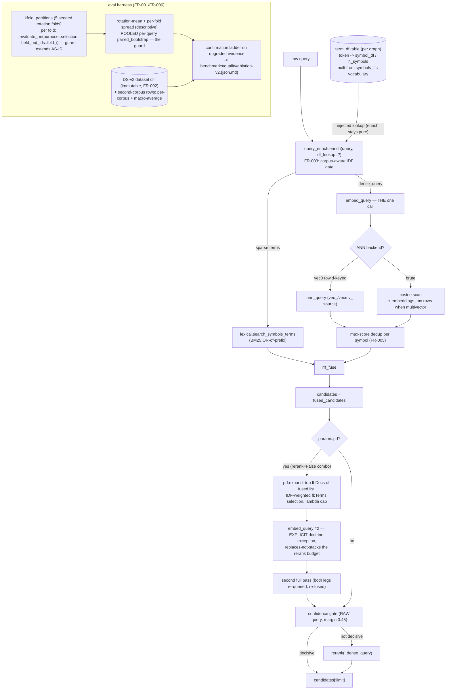

# Tech Spec: retrieval-quality-v2

**Spec**: [spec.md](spec.md) | **Created**: 2026-08-15
**Every file/symbol citation below must come verbatim from [survey.md](survey.md)
or a grep run in this session — never from memory.**

Audit base: main @ 5b84272. Blast radius via the workspace graph
(`cairn impact` / `cairn callers`, `.venv/bin/cairn`, this session) plus
targeted reads of `src/cairn/eval.py`, `src/cairn/graph/semantic.py`,
`src/cairn/graph/query_enrich.py`, `src/cairn/graph/embeddings.py`,
`src/cairn/graph/ann_index.py`, `src/cairn/graph/schema.py`,
`tests/test_ablation_artifact.py`, `src/cairn/cli/system.py`.

## Architecture

The campaign touches one pipeline (semantic L1 retrieval) and its harness.
Nothing structural changes before the fusion boundary; two new flag-gated
stages and one flag-gated scan-mode extension hang off existing seams.

One paragraph: the query enters `semantic_search` unchanged until
`params.enrich`, where `query_enrich.enrich` now also consults an injected
per-corpus DF lookup (FR-003) so corpus-ubiquitous tokens never reach either
leg; the fused first pass (`rrf_fuse` over the BM25 leg and the dense scan /
ANN leg, with max-over-vectors dedup when the multi-vector flag is on —
FR-005) is the single insertion point for RM3-style PRF (FR-004), which
expands the query from the fused top-k and re-runs the pass once, paying one
extra `embed_query` as an explicit, flag-gated doctrine exception that
replaces — never stacks with — the rerank stage. Around the pipeline, the
harness gains k-fold rotation over the existing ground truth with a pooled
per-query bootstrap guard (FR-001), a new immutable DS-v2 dataset directory
with a second corpus evaluated per the datasource budget rules (FR-002), and
the confirmation ladder re-runs into a NEW ablation record
(`ablation-v2.{json,md}`, schema `cairn-quality-ablation/2`) because the
committed v1 record's dataset block is pinned to DS-v1 by
`tests/test_ablation_artifact.py` test 1 (FR-006, survey FR-006 evidence).

## Solution

### Chosen approach

**FR-001 — k-fold harness.** New additive functions in `src/cairn/eval.py`
(no signature changes to existing seams): `kfold_partitions(ids, *, k=5,
seed=DEFAULT_SPLIT_SEED)` (sorted-dedupe-seeded-shuffle then K contiguous
slices — same determinism recipe as `split_queries`, survey FR-001 evidence)
and `run_sweep_kfold(...)` which loops folds calling the UNCHANGED
`run_sweep`-per-fold discipline: per fold i, selection ids = all minus
fold i, `held_out_ids = fold_i`. The survey verified the guard needs no
change — `evaluate_on(held_out_ids=...)` takes "a flat id iterable" and
raises `HeldOutError` "before any retrieval runs". Aggregate = rotation-mean
of per-fold selection metrics with per-fold spread reported as DESCRIPTIVE
only; the accept guard is `paired_bootstrap` over the POOLED per-query
differences (each query is validate-side exactly once across the rotation,
so pooling reconstructs one full-set paired array, n = all queries) — the
Bengio–Grandvalet-compliant design (research RQ4: no unbiased estimator of
k-fold variance exists from fold scores alone).

**FR-002 — DS-v2 ground truth.** A new immutable dataset directory
`benchmarks/datasource/ds2/` (D-010 discipline inherited; DS-v1 artifacts
untouched) holding a vendored second corpus plus `ground_truth/`
(`queries.jsonl` + `expectations.tsv`, the D-004 loader shape survey FR-002
evidence) with ≥150 L1 (all four kinds) and ≥40 L5. Target n is set by a
Sakai-style topic-set-size power analysis from DS-v1's existing per-query
matrices (the 22-row ablation record carries per-query values; research RQ4),
with 150/40 as the FR-002 floor. `scripts/verify_datasource.py` gains a
`DS2_BUDGET_KB` rule — the survey's verified gap: "the budget checker covers
only t2 + the total — a new sibling corpus dir needs its own budget rule"
(headroom measured: t2 469.6/3072 KB, total 471.5/5120 KB).

**FR-003 — IDF-aware enrichment.** A persisted per-corpus DF table
`term_df(token TEXT PRIMARY KEY, symbol_df INTEGER, n_symbols INTEGER)` in
`schema.py`, computed once per graph from the FTS5 vocabulary of the existing
`symbols_fts` external-content index (fts5vocab row mode; fallback: one
aggregate scan at embed time), maintained alongside the embed pass.
`query_enrich.enrich(query, df_lookup=None)` gains one optional injected
parameter — purity doctrine intact (no env/graph reads inside; survey FR-003
gap: "the DF signal must be INJECTED as a parameter/table"). Terms whose
`symbol_df / n_symbols > 0.90` (documented hard cutoff, the scikit-learn
`max_df` practice, research RQ3) are dropped from the appended identifier
tail and the sparse term list; the original text prefix of `dense_query` is
never touched (the "never loses information" contract). At query time
`semantic.py` builds `df_lookup` as per-term indexed SELECTs — bounded by
the query's distinct token count (documented bound: O(#query tokens), the
same cost class as the lexical leg's MATCH, survey FR-003 evidence).
`RetrievalParams` gains `enrich_idf: Optional[bool] = None` (additive-field
doctrine, survey FR-004 evidence).

**FR-004 — RM3-style PRF.** New module `src/cairn/graph/prf.py` with pure,
deterministic expansion: take the top `fb_docs` of the fused candidate list
(the survey's named insertion point — `candidates = fused_candidates`,
immediately before the confidence gate), extract candidate expansion terms,
score them by summed corpus-aware IDF over the feedback docs (the RM3 route
needs IDF weighting added explicitly; research RQ3×RQ1), drop terms already
in the query, keep the top `fb_terms`, and keep only terms whose weight ≥
`(1−λ)·max_weight` (λ = original-query weight, the RM3 knob; research RQ1).
The expanded dense query is `dense_query + " " + expansion_terms` and the
sparse term list gains the same terms; `semantic_search` then re-runs the
full pass (both legs + fusion) ONCE. This costs a SECOND `embed_query` — the
explicit, flag-gated exception to the one-call doctrine (survey FR-004
evidence names the tension), budget-accounted: PRF combos carry
`rerank=False` (replaces-not-stacks the ~1113ms p95 rerank budget; the extra
embed + BM25 fetch + one more scan is ~2 orders below it) and their `p95_ms`
is recorded in the sweep row as every lever's is. `RetrievalParams` gains
`prf: Optional[bool]`, `prf_docs: Optional[int]`, `prf_terms: Optional[int]`,
`prf_lambda: Optional[float]`. Grid start point: docs ∈ {3, 10}, terms = 10,
λ = 0.5 (Anserini RM3 and Terrier Bo1 defaults; research RQ1 options).

**FR-005 — multi-vector.** A parallel table
`embeddings_mv(symbol_id, model, vector_kind, dim, vec, chunk, content_hash,
embedded_at, PRIMARY KEY (symbol_id, model, vector_kind))` holding ONLY the
new kinds (`name`, `docstring`); the existing `embeddings` table — PK
`(symbol_id, model)`, its ON CONFLICT upserts, staleness flow, reaping, and
vec0 index — stays byte-identical, so the single-vector default and the
all-levers-off integrity row are untouched (survey FR-005 evidence: PK
overwrites silently, one content_hash, one chunk per symbol). New producers
build kind-specific texts (name-only: kind + qualified name + signature line;
docstring-only: the docstring) with their own `_chunk_hash` staleness — as
NEW producer functions, NOT new `CHUNK_VARIANTS` entries (the TC-008
identity-floor test iterates `CHUNK_VARIANTS`; joining it would break the
floor for minimal chunks). Query time, `params.multivector=True`: the brute
scan UNIONs `embeddings` + `embeddings_mv` rows and the candidate-dict
construction dedups per symbol by MAX score (the survey's named seam); the
ANN path uses a dedicated `vecmv_<model>` vec0 table (same rowid-keyed
contract, `rebuild_index`/`ann_query` gain an additive source parameter) and
`_candidates_from_ann_hits` changes dedup from last-wins to max (survey
FR-005 evidence). Scoring is plain max-over-vectors (FR-005's own wording;
ME-BERT's m=3 precedent at ~3× storage, tracked by the sweep row's existing
`db_mb` via `_size_accounting` — same DB file — plus an additive `mv` row
marker like `variant`).

**FR-006 — ladder re-run.** Machinery already exists end to end
(`run_sweep` + `evaluate_on(purpose="validate", baseline_metrics=...)` +
`paired_bootstrap`; survey FR-006 evidence); it needs only the fold
aggregation from FR-001 and the DS-v2 dataset from FR-002. The v2 record is
a NEW document pair `benchmarks/quality/ablation-v2.{json,md}` (schema
`cairn-quality-ablation/2`) — the v1 record's `doc[dataset]` is pinned to
`(benchmark-datasource, DS-v1)` with split 29+29 by
`tests/test_ablation_artifact.py` test 1, so v2 families cannot live there
without breaking the pin (survey FR-006 evidence). DS-v2 rows are a new
measurement family, never diffed against DS-v1 rows (spec risk note; BEIR
per-corpus discipline). Whatever clears the pooled bootstrap guard ships as
defaults with every protected baseline re-measured (perf: search_symbols p95
6.25, semantic_search p95 201.67, explore p50 453.18 / p95 513.73, impact
p95 0.11; agent est_tokens 6848; warm_time cold 15497.2 / warm 232.6 /
66.6x — survey FR-006 evidence); nothing clears → the shortfall and next
binding constraint are recorded (SC-1 stays 0.50/0.33).

### Alternatives rejected

| Alternative | Why rejected |
|-------------|--------------|
| PRF variant: Bo1 (DFR term scoring) | Two params but needs per-term feedback-doc frequency tables rebuilt per query; RM3's explicit λ gives the drift control the documented failure mode demands (research RQ1: shallow depth, high λ, IDF-flavored terms) |
| PRF variant: dense-leg re-encode only (ANCE-PRF style) | Expands one leg of a fused pipeline — leaves BM25 unexpanded; Mackie et al. expand the hybrid (research RQ1) |
| Feedback source: sparse-only top-k | Traditional route ignores the dense leg's signal our first pass fuses in (research RQ1 options) |
| Feedback source: per-leg expansion then re-fuse | 2 knobs, more drift surface (research RQ1 options) |
| PRF before fusion / after rerank | Before: no feedback signal exists yet; after: the budget-replacement semantics live at the rerank decision boundary (survey FR-004 insertion point) |
| Multi-vector: per-token ColBERT-style late interaction | ~154 GB-class storage for one corpus (research RQ2) |
| Multi-vector scoring: weighted-max / weighted-sum now | Unsourced weights (ME-BERT tuned title weighting); max is the FR-005 wording and the fewest knobs — weighted-max is the documented next knob if the ablation shows name-vector dominance (research RQ2) |
| Multi-vector schema: `vector_kind` column + PK change on `embeddings` | PK surgery on a hot table whose rowids key the vec0 index (survey FR-005 evidence: PK `(symbol_id, model)`, vec0 rowid contract) |
| Stopwording: soft IDF down-weight | Dense leg embeds text — per-token weights don't exist in an embed call; extra knob with no sourced value (research RQ3 gap: identifier-vs-prose weights unsourceable) |
| GT sizing: fixed 3–5× by feel | Less defensible than Sakai topic-set-size design from DS-v1's own matrices (research RQ4) |
| k-fold aggregate: bootstrap over fold means | Bengio–Grandvalet: no unbiased k-fold variance estimator from fold scores; fold spread is descriptive only (research RQ4) |
| Cross-corpus: aggregate-only reporting | BEIR reports per-corpus + macro-average, never an aggregate alone — per-corpus rows are the anti-overfitting mechanism (research RQ5) |
| Ablation extension: schema bump of `ablation.json` | `tests/test_ablation_artifact.py` test 1 pins `doc[dataset]` to DS-v1 29+29; v1 record is immutable DS-v1-era evidence (survey FR-006 evidence) |
| DF signal as env var / graph read inside `enrich` | Violates enrich's purity doctrine — no env reads, stdlib `re` only (survey FR-003 evidence) |

## Impact analysis

Blast radius measured this session with the workspace graph
(`.venv/bin/cairn impact/callers`) and grep; every claim cross-checked
against survey.md items.

- **Biggest symbol: `semantic_search` (`src/cairn/graph/semantic.py`) —
  101 impacted (via the `embed_query` cycle), 1 precise production caller
  (`src/cairn/mcp_server/tools_graph.py:597`), plus internal consumers
  `src/cairn/graph/explore.py:210` (`explore`), `src/cairn/bench/perf_suite.py:229`
  (`run_perf_suite`), `src/cairn/cli/embed.py:217` (`semantic`), and the eval
  path `src/cairn/eval.py` (`evaluate_l1_query` / `_retrieve_l1`). ~35+
  fuzzy test sites (`tests/test_reranker.py`, `tests/test_retrieval_params.py`,
  `tests/test_ann_*.py`, `tests/test_semantic_*.py`, `tests/test_fusion.py`).
  Mitigation: every new stage is `None`-means-default — `RetrievalParams()`
  must stay behaviorally identical (the equivalence tests in
  `tests/test_retrieval_params.py` pin this; survey FR-004 evidence:
  "flags the function does not know are ignored, never errors").
- **`evaluate_on` — 16 impacted**, all in `tests/test_eval.py` (guard
  tests). UNCHANGED signature: per-fold validate lists thread through the
  existing flat `held_out_ids` iterable (survey FR-001 evidence). Risk if
  wrong: held-out discipline silently breaks — the guard tests are the net.
- **`run_sweep` — no resolvable in-src callers** (precise result empty);
  session grep finds the runtime consumer `src/cairn/cli/system.py:538`
  (`eval_cmd`, import inside the function). `run_sweep_kfold` composes it;
  row-shape changes stay additive (`>=` comparisons only, survey FR-006
  evidence).
- **`embed_all` — 80 impacted**; **`chunk_for_symbol` — 93 impacted**
  (including `tests/test_chunk_spike.py`,
  `tests/test_big_tech_improvements.py`). New kind-producers must NOT enter
  `CHUNK_VARIANTS` or the TC-008 identity-floor tests fail.
- **`ann_index` machinery** (`rebuild_index`, `sync_index_row`,
  `delete_index_rows`, `ann_query`): vec0 has no replace semantics
  (DELETE+INSERT, rowid-keyed, per-model table — session read of
  `src/cairn/graph/ann_index.py`; survey FR-005 evidence). The parallel
  `vecmv_` table follows the same contract; `cairn embed`'s rebuild call site
  is `src/cairn/cli/embed.py:130`.
- **`enrich`** — precise impact empty; the single caller is
  `src/cairn/graph/semantic.py:581` via `enrich_query` alias (session read).
  The `df_lookup=None` default keeps every existing call byte-identical.
- **Committed artifacts** — `benchmarks/quality/ablation.json` (22 rows) and
  its 6 guard tests must keep passing untouched; DS-v1 + DS-v1.1 baselines
  immutable (survey FR-002/FR-006 evidence).
- **Cross-repo**: none — no external consumers of these internals
  (`embed_query`/`semantic_search` are process-internal; MCP surface
  unchanged in shape).

## Code guide

### FR-001 — k-fold harness (`src/cairn/eval.py`)
- Touches: `DEFAULT_SPLIT_SEED` / `split_queries` / `evaluate_on` /
  `paired_bootstrap` / `run_sweep` in `src/cairn/eval.py` (survey FR-001
  evidence: "the fold-rotation insertion point... only run_sweep's single
  split call and the aggregate reporting are single-fold")
- Approach: ADD `kfold_partitions` + `run_sweep_kfold`; per fold call the
  unchanged seam with `held_out_ids=fold_i`; pooled per-query bootstrap for
  the guard, rotation-mean + spread for reporting.
- Verify before implementing: `grep -c fold src/cairn/eval.py` → `0`
  (survey FR-001 verify: "no fold code anywhere")
- Pitfalls: never average fold means into a significance test
  (Bengio–Grandvalet); each query must be validate-side exactly once;
  `paired_bootstrap` is a "single-split consumer" today (survey FR-001 gap)
  — the pooled array is assembled by the new function, not by changing it.

### FR-002 — DS-v2 dataset (`benchmarks/datasource/`, `scripts/verify_datasource.py`)
- Touches: `benchmarks/datasource/t2/ground_truth/queries.jsonl` +
  `expectations.tsv` shapes via `load_ground_truth` (survey FR-002
  evidence); manifest `dataset_version "DS-v1"`; budget constants
  `T2_BUDGET_KB`/`DATASOURCE_BUDGET_KB` in `scripts/verify_datasource.py`
  (session grep: lines 97–98)
- Approach: new `benchmarks/datasource/ds2/` sibling (corpus + ground
  truth), new `DS2_BUDGET_KB` rule, Sakai power analysis recorded as a
  decision with its n; second-corpus candidate evaluation (size/license) in
  the ablation-v2 doc either way.
- Verify before implementing: `uv run python scripts/verify_datasource.py
  --budget` (survey FR-002 verify: t2 OK 469.6/3072 KB, total OK
  471.5/5120 KB)
- Pitfalls: DS-v1 + DS-v1.1 immutable; loader validation fails loudly at
  load (zero aspirational entries per the T011 bar); DS-v2 rows never diffed
  against DS-v1 rows.

### FR-003 — IDF-aware enrichment (`src/cairn/graph/query_enrich.py`, `src/cairn/graph/schema.py`, `src/cairn/graph/semantic.py`)
- Touches: `enrich` / `EnrichedQuery` / `_STOPWORDS` in
  `src/cairn/graph/query_enrich.py`; `symbols_fts` (schema.py:81) and the
  `EMBEDDINGS_CONTENT_HASH_MIGRATION` migration pattern (schema.py:337) for
  the new `term_df` table; the `_enriched = enrich_query(query)` boundary in
  `src/cairn/graph/semantic.py` (survey FR-003 evidence: "Call seam:
  semantic.py computes enrichment ONCE at the boundary (params.enrich),
  feeds BOTH legs")
- Approach: `enrich(query, df_lookup=None)`; hard cutoff 0.90 documented;
  DF table built from the FTS vocabulary once per graph; per-term indexed
  lookups at query time.
- Verify before implementing: `uv run python -c "from
  cairn.graph.query_enrich import enrich;
  print(enrich('Where is the function that parses an already-encoded URL
  string without re-quoting?').identifiers)"` → `('URL',)` — the reproduced
  failure (survey FR-003 verify)
- Pitfalls: enrich purity (no env reads — the DF signal must be INJECTED);
  `dense_query` always keeps the full original text as prefix; an empty
  `sparse_query` still means "fall back to the raw query"; DF keys are
  case-folded (FTS5 unicode61) while enrich tokens keep casing — lowercase
  the lookup key.

### FR-004 — RM3 PRF (`src/cairn/graph/prf.py` NEW, `src/cairn/graph/semantic.py`, `RetrievalParams`)
- Touches: the `candidates = fused_candidates` seam immediately before the
  confidence gate (survey FR-004 evidence: "Insertion point: fused
  candidates exist at `candidates = fused_candidates`"); the
  "one embed_query call" pin in `semantic_search`'s docstring;
  `RetrievalParams` in `src/cairn/graph/semantic.py` (survey supporting
  evidence lists its 10 fields)
- Approach: pure `prf.py` expansion (fused top-k, IDF-weighted term
  selection, λ cap); one flag-gated second pass; `rerank=False` on PRF
  combos; p95 recorded per row.
- Verify before implementing: `grep -rniE "prf|rm3|feedback"
  src/cairn/ | wc -l` → `0` (survey FR-004 verify)
- Pitfalls: the second embed is a DOCTRINE EXCEPTION — flag-gated,
  budget-accounted, replaces-not-stacks rerank; grid depth ≤10 feedback docs
  (deeper is the documented drift regime, research RQ1); the spec's
  "~780ms p50" figure is NOT in any committed artifact — cite p95 (1142 vs
  28.9ms; T017 "~40x p95") or re-measure (survey FR-004 gap + Unknowns).

### FR-005 — multi-vector (`src/cairn/graph/schema.py`, `src/cairn/graph/embeddings.py`, `src/cairn/graph/ann_index.py`, `src/cairn/graph/semantic.py`, `src/cairn/eval.py`)
- Touches: embeddings PK `(symbol_id, model)` with silent ON CONFLICT
  overwrite (survey FR-005 evidence + session read embeddings.py:783);
  `chunk_for_symbol` builds exactly ONE chunk; brute leg duplicates under
  multi-row; `_candidates_from_ann_hits` dedups last-wins; vec0 per-model
  rowid-keyed tables; `_size_accounting` in `run_sweep`
- Approach: parallel `embeddings_mv` table (name/docstring kinds only);
  dedicated `vecmv_<model>` index; max-score dedup at both candidate-dict
  construction loops; `multivector` RetrievalParams field + sweep row
  marker; db_mb already covers storage (same DB file).
- Verify before implementing: `PRAGMA table_info(embeddings)` on a fresh
  `init_db` → PK cols `['symbol_id','model']` (survey FR-005 verify)
- Pitfalls: NEVER re-PK `embeddings` (vec0 rowid contract); new producers
  must not join `CHUNK_VARIANTS` (TC-008 floor); flag-off default must be
  byte-identical to today (all-levers-off integrity row); ANN dedup fix is
  correctness even single-vector (last-wins → max is a no-op at one row per
  symbol).

### FR-006 — ladder + ablation-v2 (`benchmarks/quality/`, `tests/`)
- Touches: ladder machinery all exists — `run_sweep` +
  `evaluate_on(purpose="validate", baseline_metrics=...)` +
  `paired_bootstrap` (survey FR-006 evidence); committed
  `benchmarks/quality/ablation.json` (22 rows) + `ablation.md`;
  `tests/test_ablation_artifact.py` (6 tests)
- Approach: new `ablation-v2.{json,md}` (schema `cairn-quality-ablation/2`)
  + its own guard test file; verdict block carries k-fold aggregate + DS-v2
  per-corpus rows + macro-average; protected baselines re-measured on
  shipping.
- Verify before implementing: `uv run pytest
  tests/test_ablation_artifact.py` → `6 passed` (survey FR-006 verify)
- Pitfalls: test 1 pins `doc[dataset]` to `(benchmark-datasource, DS-v1)`
  split 29+29 — v2 rows CANNOT live in that document; row shape additive
  (`>=` comparisons); match rules never loosened; SC-1 stays 0.50/0.33.

## References

From [research.md](research.md) (why each matters):

- Anserini RM3 defaults (fbDocs=10, fbTerms=10, λ=0.5) —
  https://github.com/castorini/anserini — the untuned PRF grid anchor.
- Terrier Bo1 defaults (3 docs / 10 terms) —
  https://trec.nist.gov/pubs/trec29/papers/uogTr.DL.pdf — the shallow end of
  the feedback-depth grid.
- Hui et al., PRF parameter study —
  https://khui.github.io/files/publications/Hui2011_Chapter_AComparativeStudyOfPseudoRelev.pdf —
  RM3's |ED|/|ET|/λ parameterization.
- Mackie et al. (SIGIR'23), PRF across hybrid retrievers —
  https://arxiv.org/abs/2305.07477 — the PRF-over-fused-first-pass
  precedent (read full PDF before quoting internals — research gap).
- ANCE-PRF (CIKM'21) — https://www.cs.cmu.edu/~callan/Papers/cikm21-HongChien-Yu.pdf —
  the dense re-encode alternative.
- Feedback-depth failure modes — https://dl.acm.org/doi/10.1145/3570724 —
  why the grid stays ≤10 docs.
- ColBERT storage cost — https://ar5iv.labs.arxiv.org/html/2112.01488 —
  why per-token late interaction is out.
- ME-BERT (TACL 2021) —
  https://direct.mit.edu/tacl/article/doi/10.1162/tacl_a_00369/100684/ —
  the m=3 multi-vector + max-score precedent for FR-005.
- scikit-learn `max_df` —
  https://scikit-learn.org/stable/modules/generated/sklearn.feature_extraction.text.TfidfVectorizer.html —
  the hard df-cutoff practice for FR-003.
- Fan, Arora & Treude (NLBSE 2023) — https://arxiv.org/abs/2303.10439 —
  SE corpora need corpus-derived stopwords.
- Bo1's self-IDF-weighting —
  https://trec.nist.gov/pubs/trec29/papers/uogTr.DL.pdf (+ PyTerrier docs) —
  why RM3's expansion needs explicit IDF weighting.
- Smucker et al. (CIKM'07) — https://dl.acm.org/doi/10.1145/1321440.1321528 —
  the bootstrap guard is a first-class test.
- Sakai topic-set-size design —
  https://dl.acm.org/doi/10.1145/2911451.2911492 (+ IR Journal 2016 PDF) —
  the DS-v2 sizing method.
- Urbano et al. — https://arxiv.org/pdf/1905.11096 — small query sets
  under-detect true effects (the 58-query outcome was expected).
- Bengio & Grandvalet (JMLR 2004) —
  https://www.jmlr.org/papers/v5/grandvalet04a.html — k-fold variance
  caveat shaping the FR-001 aggregate.
- BEIR — https://arxiv.org/abs/2104.08663 (+ reference implementation
  https://github.com/beir-cellar/beir) — the cross-corpus protocol for
  FR-002/FR-006.

Citation gaps (flagged, per survey.md Unknowns + research.md Gaps): the
spec's "~780ms p50" rerank figure (not in any committed artifact — use
p95: 1142.0 vs 28.9ms, T017 "~40x p95"); identifier-vs-prose term weight
values (no source — first principles + local ablation only); Mackie et al.
hybrid internals (verify in full PDF before quoting numbers in the ablation
record); no source on PRF specifically over RRF-fused first passes
(Mackie's hybrid is the nearest precedent).

## Decisions

### D-001: PRF variant is RM3-style text-level expansion over the fused top-k
- **Context**: research RQ1 offers RM3 / Bo1 / dense re-encode; FR-004 pins
  "RM3-style... over the fused first pass".
- **Decision**: RM3 parameterization (fbDocs, fbTerms, λ) implemented as
  deterministic IDF-weighted term selection from the fused list's top-k,
  applied to BOTH legs (expanded dense text + expanded sparse terms), one
  full second pass.
- **Consequences**: one explicit second `embed_query` (doctrine exception,
  see D-012); FTS5 MATCH has no per-term weights, so "interpolation" is
  text-level, not vector-level; Bo1's self-IDF weighting is folded into
  term selection instead.

### D-002: PRF grid anchored at docs {3,10}, terms 10, λ 0.5
- **Context**: grid start point needed; drift documented beyond 10 docs.
- **Decision**: fb_docs ∈ {3, 10}, fb_terms = 10, λ = 0.5 (Anserini/Terrier
  defaults; research RQ1 options).
- **Consequences**: conservative machine time; depth >10 is the documented
  drift regime and stays out of the grid.

### D-003: Feedback source is the fused list's top-k (single knob)
- **Context**: fused-top-k vs sparse-only vs per-leg-re-fuse (research
  options).
- **Decision**: fused top-k (Mackie precedent).
- **Consequences**: one feedback knob; sparse-only and per-leg variants
  documented as rejected (ignores dense signal / more drift surface).

### D-004: Stopwording is a hard max_df cutoff at 0.90, not soft down-weighting
- **Context**: research RQ3 offers hard cutoff vs soft IDF down-weight.
- **Decision**: drop terms matching >90% of corpus symbols from enrichment's
  appended identifiers and sparse terms (scikit-learn `max_df` practice);
  threshold documented in code and the ablation record.
- **Consequences**: one deterministic knob; original query text never
  modified (dense prefix contract); soft weighting deferred until a source
  or local ablation justifies it.

### D-005: The DF signal is a persisted `term_df` table injected as a per-term lookup
- **Context**: enrich()'s purity means the DF signal must be INJECTED
  (survey FR-003 gap); FR-003 demands deterministic/hermetic/cheap.
- **Decision**: `term_df(token, symbol_df, n_symbols)` built once per graph
  from the `symbols_fts` vocabulary (fts5vocab; fallback: aggregate scan at
  embed time); `enrich(query, df_lookup=None)`; per-term indexed SELECTs at
  query time, bounded by query token count.
- **Consequences**: enrich stays pure and testable without a DB; per-query
  cost is O(#query tokens) lookups (the documented bound); table refresh
  rides the embed/build pass.

### D-006: Multi-vector lives in a parallel `embeddings_mv` table with max-score selection
- **Context**: PK surgery vs vector_kind column vs parallel table (brief
  hard constraint: additive schema, no PK surgery).
- **Decision**: parallel table keyed `(symbol_id, model, vector_kind)`
  holding only the `name` and `docstring` kinds; chunk vector stays in
  `embeddings` untouched; query-time score = max over vectors per symbol.
- **Consequences**: single-vector default byte-identical; ~3× embedding
  storage when on (tracked by `db_mb`); weighted-max/sum deferred
  (unsourced weights — ME-BERT precedent only).

### D-007: Multi-vector ANN is a dedicated `vecmv_<model>` vec0 table
- **Context**: vec0 is rowid-keyed per-model; the rowid contract must not
  break (brief hard constraint).
- **Decision**: `rebuild_index`/`ann_query` gain an additive source
  parameter selecting `embeddings` vs `embeddings_mv` (table name
  `vecmv_<safe-model>`); the same DELETE+INSERT no-replace semantics.
- **Consequences**: no change to the existing `vec_<model>` index;
  `_candidates_from_ann_hits` dedup becomes max (correct under multi-row,
  no-op single-row).

### D-008: DS-v2 is a new dataset directory; the v2 record is a new `ablation-v2` document
- **Context**: ablation guard test 1 pins the v1 record's dataset to DS-v1
  29+29; DS-v1 immutable (brief hard constraints).
- **Decision**: `benchmarks/datasource/ds2/` (immutable once landed, own
  budget rule) + `benchmarks/quality/ablation-v2.{json,md}` (schema
  `cairn-quality-ablation/2`) with its own guard tests; v1 artifacts
  untouched.
- **Consequences**: schema bump of the v1 document rejected; DS-v2 rows are
  a new measurement family, never diffed against DS-v1 rows.

### D-009: k-fold = 5 seeded rotation folds; the guard bootstraps POOLED per-query errors
- **Context**: research RQ4 (Bengio–Grandvalet) makes fold-mean error bars
  invalid.
- **Decision**: `kfold_partitions` (deterministic shuffle-slices) + per-fold
  selection through the unchanged `held_out_ids` seam; rotation-mean +
  per-fold spread reported descriptively; the accept gate is
  `paired_bootstrap` over pooled per-query paired differences (each query
  validate-side exactly once).
- **Consequences**: fold count configurable (machine-time risk); the
  aggregate verdict is a legitimate n=all-queries test.

### D-010: DS-v2 sizing runs a Sakai power analysis; 150/40 is the floor
- **Context**: fixed 3–5× vs power analysis (research RQ4 options).
- **Decision**: compute required n from DS-v1's per-query matrices; target
  max(150 L1, n_required) within authoring budget; ≥40 L5 per FR-002.
- **Consequences**: the n is defensible in the record; authoring scale is
  the long pole (staged batches, T011 method).

### D-011: Cross-corpus protocol is BEIR-style per-corpus rows + macro-average
- **Context**: research RQ5.
- **Decision**: tune on DS-v1, validate zero-shot on DS-v2's corpus; report
  per-corpus rows plus macro-average, never an aggregate alone, never
  cross-corpus row diffs.
- **Consequences**: matches the spec's risk note and D-010 immutability
  inheritance; second-corpus vendoring evaluated against the datasource
  size/license constraints and included or deferred with reasons.

### D-012: The PRF second embed is an explicit, budget-accounted doctrine exception
- **Context**: query_enrich's contract "explicitly forbids a second
  embedding call" and `semantic_search`'s docstring pins "the one
  embed_query call" (survey FR-004 evidence).
- **Decision**: the exception lives at the same boundary — after fusion,
  before gate/rerank — flag-gated (`params.prf`), executes at most one extra
  `embed_query` per call, and REPLACES the rerank stage in any PRF combo
  (`rerank=False`), with p95 recorded in the sweep row against the rerank
  budget it may replace (~1113ms p95 at the shipped config: 1142.0 vs
  28.9ms).
- **Consequences**: stacking PRF + rerank is not a constructible combo; all
  latency claims cite p95 (the spec's "~780ms p50" is flagged unsourced in
  survey.md's Unknowns — do not cite it).
