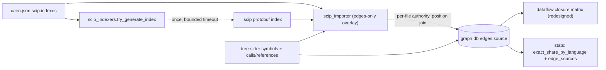
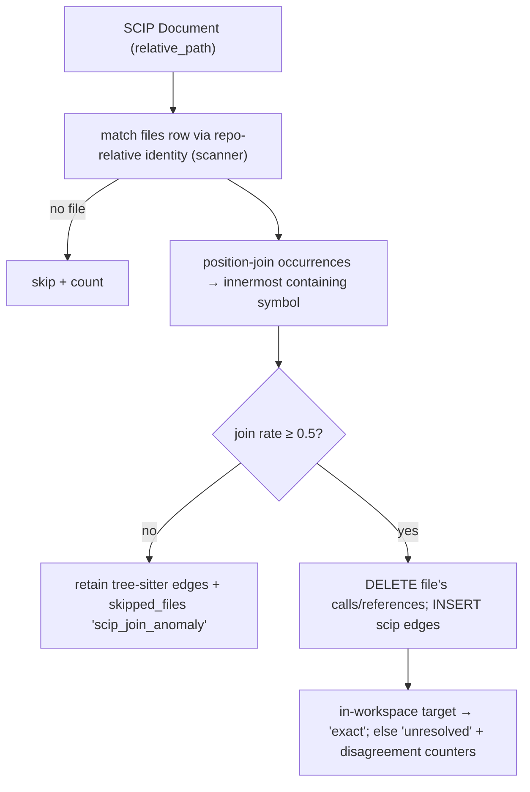

# Tech Spec: scip-indexing-v2

**Spec**: [spec.md](spec.md) | **Created**: 2026-09-20
**Every file/symbol citation below must come verbatim from [survey.md](survey.md)
or a grep run in this session — never from memory.**

Evidence keys: `[S]` = survey.md line; `[H]` = my own read/run this session
(command named inline); `[R]` = research.md finding. Historical (`hist`) line
numbers refer to `git show 0a956fa^:<path>` as recorded in survey.md.

## Architecture

One paragraph: tree-sitter stays the sole producer of symbols and structure —
the build pipeline is unchanged through scan → parse → resolve
(`src/cairn/graph/builder.py:_build_graph_impl:269` [S], resolve via
`_resolve_all` at builder.py:238, invoked at builder.py:393 [S]). A new opt-in
stage slots in **post-resolve/post-imports-materialization, pre-backup**
(between builder.py:393 and the `backup_to` at builder.py:434 [H read this
session]) — the same anchor history used (0a956fa^ builder.py hist 553-560 [S]).
That stage (1) generates a configured-but-absent index once via the registry,
(2) imports each index as an **edges-only overlay**: per document, position-join
occurrences onto tree-sitter symbols, delete the covered file's tree-sitter
`calls`/`references` edges, insert the index's edges with
`source='scip'`. Downstream, the transitive-closure matrix
(`src/cairn/graph/dataflow.py:build_transitive_closure:218` [S]) is rewritten to
an in-memory iteration with a single write pass so it absorbs ~5× edge volume,
and `cairn stats` gains provenance/per-language siblings on its existing
resolution-share surface (`src/cairn/graph/stats.py:get_stats:10` [S]).

Per-document decision flow inside the overlay:

## Solution

### Chosen approach

**Ingestion (FR-001–FR-006, FR-014).** Restore the removed subsystem's file
layout — `src/cairn/parsers/scip_importer.py`, `src/cairn/parsers/scip_indexers.py`,
vendored `src/cairn/parsers/_scip_pb2.py`, `scripts/regen_scip_pb2.sh`,
`[scip]` extra (inventory in survey.md "Removed subsystem inventory" [S]) — but
with a different join model:

- **Edges-only, no symbol merge.** The importer never writes `symbols`. It
  emits `edges` rows only, kinds `calls`/`references`, with a new
  `edges.source` column (`'scip'`; NULL = `'tree_sitter'`, mirroring
  `SYMBOL_SOURCE_MIGRATION` at schema.py:487 [S]). This structurally kills the
  removed system's failure mode: two disconnected symbol populations for
  opaque-USR indexers (`_merge_scip_defs_into_tree_sitter`, 0a956fa^
  scip_importer.py hist:329 [S]) cannot happen when SCIP never creates symbols
  (AC2).
- **Position join, both ends.** Each occurrence's range `[startLine..endLine]`
  joins to the **innermost** tree-sitter symbol in the same file whose
  `[line_start..line_end]` contains it (symbols carry line/column ranges via
  the symbols table). Lines, not columns: per-document `position_encoding`
  varies UTF-16/UTF-32/UTF-8 across indexers [R RQ2] while line numbers are
  encoding-invariant. Definition occurrences (role bit 0x1 [R RQ2]) are
  skipped; the referenced *definition* is located through the index's own
  symbol table → its defining occurrence → position-join in that file. In-workspace
  → `resolution='exact'`; otherwise `target_id NULL` + `resolution='unresolved'`
  (the existing vocabulary, resolver.py:204/219-220/244 [S]). Never join by
  name/USR string: locals "must never be referenced outside their Document"
  and scip-python symbol strings are unstable across versions [R RQ2/RQ3].
- **Per-file authority.** Per covered document: `DELETE FROM edges WHERE kind
  IN ('calls','references') AND source_id IN (SELECT id FROM symbols WHERE
  file_id = ?)` then insert the index's edges. Files outside every index keep
  tree-sitter edges untouched (FR-002).
- **Per-document repo attribution.** Each document's `relative_path` (canonical
  `/`-separated repo-relative [R RQ2]) is matched against existing `files`
  rows through the shared identity substrate — `scanner.repository_id:177`,
  `discover_repos:240`, `resolve_repo_path:272` [S] — the same identity
  `incremental_update` rides (incremental.py:370-377 [S]). No repo id is ever
  assigned to a whole index (the `repo_for_scip = next(...)` failure, 0a956fa^
  builder.py hist ~578-583 [S]).
- **Validate-then-write, no SQL rollback.** The whole index is parsed and
  joined in memory first; a corrupt index aborts before any edge is written
  (replacing history's `conn.rollback()` on a live build connection [S
  supporting evidence] — a rollback there would destroy the in-progress build).
- **Anomaly gate.** Per document, `joined_occurrences / total_occurrences <
  0.5` → retain that file's tree-sitter edges and record a `skipped_files` row
  reason `'scip_join_anomaly'` (drop counters in the import record). Threshold
  rationale in D-003.
- **Runtime guard.** `scip_available()` try/excepts the stub import for
  `ImportError` **and** `protobuf.runtime_version.VersionError` (the documented
  mismatch failure [R RQ4], precedent 0a956fa^ scip_importer.py hist 43-61 [S])
  → `[scip]` install hint + `skipped_files` reason `'scip_runtime_missing'`;
  build proceeds tree-sitter-only (FR-006).

**Auto-generation (FR-007–FR-009).** `scip_indexers.py` restores the registry
shape: `_KNOWN_INDEXERS` with the seven FR-009 entries (swift, java, kotlin via
scip-java, typescript, python, go, rust), `try_generate_index` never raising,
"never rebuild an existing index" (0a956fa^ hist:214), bounded timeout
`_INDEX_TIMEOUT_S = 30*60` (hist:34) [S]. Failure modes — missing binary,
nonzero exit, timeout, `subprocess.SubprocessError`/`OSError` (hist precedent
[S]) — map to `skipped_files` reasons `'scip_gen_missing_binary'` /
`'scip_gen_nonzero_exit'` / `'scip_gen_timeout'` / `'scip_gen_os_error'`,
aggregated by the existing `skipped_by_reason` surface (stats.py:58-68 [S]);
install hints log under `-v`. Registry realities from research: rust-analyzer
emits via the `RA_SCIPOUT` env var with "pretty limited" upstream support [R
RQ2]; scip-python is npm-not-pip [R RQ2]; scip-swift has no canonical repo —
best-effort PATH lookup + homebrew-tap hints in docs [R RQ2]; the Kotlin path
through scip-java is degraded vs the archived scip-kotlin plugin [R RQ2]. Each
entry degrades independently (per-language try/except) [S FR-009 evidence].

**Incremental (FR-010).** `cairn update` needs no indexer call — it already
re-parses changed files via tree-sitter (`incremental.py:reindex_paths:19`,
`incremental_update:343` [S]). The work is provenance plumbing:
`repository.insert_edges` (repository.py:45 [H]) writes `source='tree_sitter'`
explicitly (mirroring the symbols insert at repository.py:31 [S]), and the
update's edge deletion makes the flip observable through the stats
`edge_sources` surface. The next full build re-runs the overlay and restores
`source='scip'`.

**Closure redesign (FR-011/FR-012, shared machinery).** Keep the table, the
signature, and the exact row semantics; move the iteration out of per-level
SQL joins into memory:

1. **Read once (SQL):** all structural edges `(source_id, target_id,
   target_name)` (same filter as today's seed, dataflow.py:262-266 region [S]),
   the symbol-name map, and the unique-name map (`GROUP BY name HAVING
   COUNT(*)=1`, dataflow.py:284-303 [S]).
2. **Iterate (Python):** the same level loop — seeds at distance 1, per-depth
   extension with Case 1 (follow `target_id`) then Case 2 (unique-name
   fallback) — but over dict adjacency with per-level `{(src, name): tid}`
   frontier dicts. First-wins per `(source_id, target_name, distance)` exactly
   reproduces `INSERT OR IGNORE` against the table's PK
   `(source_id, target_name, distance)` (schema.py:430-434 [H read this
   session]).
3. **Write once (SQL):** `DELETE FROM transitive_edges` (as today,
   dataflow.py:239 [S]) + one `executemany` in deterministic sorted order.

This is the hand-rolled "seen-set + delta" discipline the SQLite docs require
(absent `USING KEY`, recursive CTEs append paths unboundedly [R RQ1]) and it
bounds work by distinct reachable pairs, not paths — the shape screen every RQ1
candidate survived [R RQ1 synthesis]. The A/B blowup (">30 min, 4.6 GB WAL",
research anchor [R]) was exactly the paths-bounded level-batched evaluation [R
RQ1 DuckDB source]. In-memory dict ops replace per-row b-tree probes + WAL
churn per level; one write pass replaces per-level index churn.
`maintain_transitive_closure` (dataflow.py:314 [S]) switches its per-source
re-derivation to the same helper restricted to the affected set — its parity
argument (per-source independence, docstring at dataflow.py:314-345 [H]) is
unaffected. **No new dependency** (C-03 clean).

Every `transitive_edges` reader is distance-agnostic or MIN-only, verified this
session [H `rg -n "transitive_edges" src/cairn/ -l` + read of each site]:
`impact_from_closure` reads `MIN(t.distance) ... GROUP BY t.source_id` with a
`target_id IN (...)` filter (dataflow.py:562-620 [H]);
`skillgen/ranking.py:49` and `pack.py:276` count `DISTINCT source_id` filtered
on `target_id`; `traversal.py:178-184` routes to `impact_from_closure`;
`taint.py:117-118` explicitly never reads the closure. Preserving the exact row
set keeps table *and* query results identical (AC5).

**Budget gate (FR-012).** The scaling suite
(`src/cairn/bench/scaling_suite.py:run_scaling_suite` [S FR-012 evidence; H
read this session — it currently times build+embed only, not the closure])
gains a closure op: build the corpus DB, synthesize ~5× structural edge volume
deterministically (replicate each structural edge 4× with fresh ids and
cyclically-shifted targets over sorted symbol ids — preserves hub fan-out),
time `build_transitive_closure`, assert wall/peak-memory budget. Enforced as a
pytest gate at the 1000-file point; the 5000-point stays advisory bench.
Provisional numbers + re-pin protocol in D-008.

**Measurement & reporting (FR-013/FR-014).** `get_stats` gains **sibling**
keys — `stats["edge_sources"] = {"tree_sitter": n, "scip": n}` and
`stats["exact_share_by_language"]` (pool = `kind IN ('calls','references')`
joined through symbols→files for language) — both behind the same
`sqlite3.OperationalError` → zero-default guard the resolution query uses
(stats.py:40-52 [H read this session]) so minimal-schema DBs degrade, never
raise. `stats["resolution"]` itself is untouched — it is exact-dict-pinned by
tests/test_status_resource_health.py:408 [H read this session]. CLI renders
scip provenance inside the existing resolution-share block (core.py:470-475
[S]) and the build summary panel (core.py:422-432 [S]) gains a
`scip: n edges (d disagreements)` line when scip edges exist. Index on/off
uplift = compare `exact_share_by_language` across two builds of the same tree
(AC3). Disagreement counting (FR-014): before deleting a covered file's
tree-sitter edges, match each incoming scip edge to the tree-sitter edge with
same `(kind, line)`; different resolved target or ts-ambiguous→scip-exact →
counted (`disagreements`, `upgrades` in the import record). Zero false-exact is
then enforced by the existing ground-truth harness (`src/cairn/eval.py:
load_ground_truth:124`, `evaluate_l1_query:246` [S]) run A/B as the measurement
task.

**CLI/config/docs (FR-015/FR-016/FR-017).** `cairn import-scip <file>` reuses
the overlay entry against an already-built DB (command in `src/cairn/cli/core.py`
beside `build`/`config`/`stats` — core.py:156/:258/:456 [S]; history had it in
the removed hooks_viz.py [S FR-015 evidence]). `CairnConfig` (config.py:11 [S])
gains `scip: Dict[str, object]` parsed like `ingest` (raw dict via `_as_dict`,
malformed → warn + `{}`, the ingest convention tests/test_ingest_config.py:32
[S FR-015 evidence via my session read [H]]), key shape
`{"scip": {"indexes": {"python": "index.scip"}}}`; `cairn config` echoes the
resolved scip indexes after the `repo_namespaces` block (core.py:229-246 [H]).
`docs/scip.md` carries the per-indexer install matrix (npm `@sourcegraph/scip-python`,
macOS-only scip-swift + taps, `RA_SCIPOUT` rust invocation, scip-kotlin
caveat), config, generation semantics, fallback behavior, and the overlay
model [R RQ2; S FR-016]. `[scip]` extra: floor-pinned `protobuf>=<vendored
gencode>` + vendored `_scip_pb2.py` + `scripts/regen_scip_pb2.sh` recording
the protoc/proto versions that produced the stub (D-005, C-03).

### FR coverage map

| FR | Solution element |
|----|------------------|
| FR-001 | edges-only importer; `edges.source` column; no symbol writes |
| FR-002 | per-file DELETE+INSERT of `calls`/`references` for covered files |
| FR-003 | line-level innermost-containment position join; `'unresolved'` for out-of-workspace |
| FR-004 | per-document match via `scanner.repository_id`/`resolve_repo_path` identity |
| FR-005 | join-rate ≥ 0.5 gate → retain ts edges + `'scip_join_anomaly'` skip row |
| FR-006 | `scip_available()` guard (ImportError + VersionError) → hint + `'scip_runtime_missing'` |
| FR-007 | registry run-once, existing file never rebuilt, 1800 s timeout |
| FR-008 | `'scip_gen_*'` skip reasons + `-v` install hints |
| FR-009 | seven-entry `_KNOWN_INDEXERS`, independent degradation |
| FR-010 | `insert_edges` writes `'tree_sitter'`; stats `edge_sources` shows the flip |
| FR-011 | in-memory level-BFS closure, single write pass, exact row set |
| FR-012 | scaling-suite closure op + budget gate (D-008) |
| FR-013 | `edge_sources` + `exact_share_by_language` sibling keys + CLI render |
| FR-014 | pre-delete disagreement/upgrade counters + eval harness A/B |
| FR-015 | `import-scip` command + `scip` config key + config echo |
| FR-016 | `docs/scip.md` toolchain guide |
| FR-017 | `[scip]` extra + vendored stub + regen script (D-005, C-03) |

### Alternatives rejected

| Alternative | Why rejected |
|-------------|--------------|
| Name/USR-keyed symbol merge (history's design) | two disconnected populations for opaque-USR indexers; scip-swift ~0% merge [S FR-002 evidence; spec.md Why] |
| Per-language all-or-nothing fallback (history's `added > 0 and merged == 0` revert) | coarse; one bad document degraded a whole language [S FR-002/FR-005 evidence] |
| Whole-index repo attribution | multi-repo workspaces mis-attribute every document [S FR-004 evidence] |
| scipy/numpy sparse-boolean closure (RQ1 option b) | new runtime dependency (C-03) + results must be re-imported to keep byte-identical rows [R options summary] |
| Embedded DuckDB for the closure step (RQ1 option e) | new runtime dependency (C-03) for one op [R RQ1 DuckDB blog] |
| SCC condensation + bitset propagation (RQ1 option c) | most new code; exact per-pair minimal distances still need level work [R options summary] |
| SQLite recursive-CTE closure | union table appends only (no `USING KEY`) — the documented paths-bounded failure [R RQ1 sqlite.org] |
| Column-level position join | per-indexer `position_encoding` varies UTF-16/32/8; line numbers are the invariant [R RQ2] |
| Two-tier occurrence→enclosing-range join (RQ3 option b) | second join path for marginal recall; anomaly gate already catches systematic misses [R RQ3] |
| Collapsing closure rows to minimal distance per `(source, target_name, target_id)` | readers are MIN/distance-agnostic [H this session], but a `(s,name,NULL,d)` row can shadow a later `(s,name,id,d')` row that a `target_id IN` reader needs — risk without a budget-gating benefit |
| protobuf exact-pin / floor+ceiling | documented Python window since gencode 3.20.0 is wide; floor-pin is sufficient [R RQ4] |
| Dropping the swift registry entry | FR-009 mandates seven entries; best-effort PATH + tap hints degrade honestly instead [R RQ2] |
| New scip-fallback telemetry table | `skipped_files` (schema.py:171 [S], CHECK-free reason TEXT) already is the observable skip surface — subtract before add |

## Impact analysis

Blast radius mapped with cairn's own graph tools this session [H all four
`impact_analysis`/`get_callers` runs via MCP, precise mode]:

| Symbol | Direct callers | Notes |
|--------|---------------|-------|
| `build_graph` (builder.py:452 [S]) | **87** | largest radius; production: `cli/core.py:build:322`, `init:108`, `bench/perf_suite._phase_timings:54`, `bench/scaling_suite._build_and_embed:84`, `bench/agent_suite:692`, `bench/swe_bench_suite:210`, `incremental.incremental_via_rebuild:936`; rest are test fixtures/helpers |
| `build_transitive_closure` (dataflow.py:218 [S]) | 6 (depth 0); **22 impacted at depth 3** | 19 affected tests enumerated by `impact_analysis` |
| `incremental_update` (incremental.py:343 [S]) | 8 | `cli/update.py:51`, `watcher._update_pass:570` + 6 tests |
| `load_config` (config.py:46 [S]) | 17 | additive `scip` field; consumers read existing attrs |
| `get_stats` (stats.py:10 [S]) | 7 | `cli/core.py:stats:462`, `mcp_server/_server_core.status_resource:486`, `wiki/generator._graph_derived_wiki:58`, `cli/system/status.status:82` + 2 tests |
| `maintain_transitive_closure` (dataflow.py:314 [S]) | 4 | `incremental._maintain_derived_indexes:777` + 2 parity tests |
| `resolve_repo_edges` (resolver.py:391 [S]) | 3 | `builder._resolve_all:275`, `incremental.reindex_paths:309` — the overlay hooks right after the first |
| `insert_edges` (repository.py:45 [H]) | 3 | `builder.insert_parsed_file:951`, `builder.materialize_import_edges:1126` — column addition keeps kwarg-less call sites green |

Common-name caveat: these counts are **precise-mode** (resolved edges only);
`build_graph`/`get_stats` are common enough that fuzzy traversal would inflate
the count with unrelated `build`/`stats` hits — precise is the right mode for
blast radius per AGENTS.md, fuzzy only for dead-code hunts.

### Test-tree sweep for flipped APIs

The flips: (1) `get_stats` return shape (new sibling keys); (2) `CairnConfig`
gains `scip`; (3) `cairn config` echo gains a scip block; (4) `insert_edges`
SQL gains a `source` column (hardcoded value, no signature change); (5)
`build_transitive_closure`/`maintain_transitive_closure` internals rewritten
(same signature, same row semantics); (6) `skipped_files` gains reason values.
Sweep method [H]: `rg -ln "get_stats" tests/`, read of
tests/test_status_resource_health.py:355-443, `rg -n "repo_namespaces \(|embed:|store:" tests/`
(zero echo pins), caller lists above, `rg -n "skipped_by_reason|'default_skip'|size_cap" tests/`.

**Exact-count pins** (assert row/dict counts a shape flip changes):
- `tests/test_status_resource_health.py::TestStatsResolutionShares::test_resolution_counts_and_pool_shares`
  — asserts `stats["resolution"] == {"exact": 5, "ambiguous": 4, "unresolved": 1}`
  (lines 408-412), `stats["edges"] == 16` (406), `edges_resolved == 10` (407),
  both shares (414-415). **Design consequence:** provenance/per-language data
  must be sibling keys, never inside `stats["resolution"]`.
- `tests/test_status_resource_health.py::TestStatsResolutionShares::test_minimal_schema_defaults_resolution_to_zero`
  — asserts the zero-dict (441) on a hand-built schema whose `edges` table has
  no `resolution` (and will have no `source`) column. New keys must ride the
  same `OperationalError` → zero-default guard (stats.py:40-52 [H]).

**Exact-traffic pins** (assert what gets called/sent):
- `tests/test_incremental_derived.py::test_update_uses_incremental_maintenance_not_full_rebuild`
  — pins that update traffic goes through maintain, not full rebuild; the
  redesign must keep `maintain_transitive_closure` as the incremental
  mechanism (it does).
- `tests/test_workflow_audit_fixes.py::test_incremental_rebuilds_derived_indexes`
  — pins derived-rebuild traffic on the never-built prestate
  (`incremental.py:407` pre-state check [S]).
- `tests/test_bench.py::test_runs_and_returns_well_formed_report` — pins the
  perf report op shape including the `build.derived.closure` op name
  (perf_suite.py:177 [S]); keep the op name.

**Flag pins** (assert an old default): none found — no test pins the absence
of a `scip` config key, the config echo's exact text, or an edge-source-free
schema (my rg sweeps above returned zero matches [H]).

**Behavior pins** (must stay green; the AC5 gate): the closure parity family —
`tests/test_dataflow_transitive_closure.py::test_name_collision_no_spurious_edges` (:16 [S]),
`::test_transitive_closure_respects_resolution` (:120 [S]),
`tests/test_incremental_derived.py::test_maintain_transitive_closure_matches_full_rebuild` (:747 [S]),
`::test_maintain_transitive_closure_drops_rows_of_deleted_sources` (:784 [S]),
`test_add_file_parity`, `test_body_edit_parity`,
`test_delete_file_flips_ambiguity_parity`,
`test_delete_file_with_importers_parity`,
`test_property_parity_random_sequences`,
`test_update_falls_back_to_full_rebuild_when_derived_never_built`,
and `tests/test_traversal_parity.py` (index-mode vs DFS result parity).
Baseline green, run this session [H]:
`uv run --no-sync pytest tests/test_dataflow_transitive_closure.py tests/test_status_resource_health.py -q`
→ **15 passed in 7.53s**;
`uv run --no-sync pytest tests/test_incremental_derived.py -k "matches_full_rebuild or drops_rows" -q`
→ **2 passed, 60 deselected in 0.05s**.

Schema migrations are additive `ALTER TABLE ... ADD COLUMN` entries appended to
`MIGRATIONS` (schema.py:527 [S]) — invisible to the FTS5 triggers by the same
argument `SYMBOL_SOURCE_MIGRATION` records (schema.py:483-487 [S]).

## Code guide

### Config surface
- Touches: `CairnConfig` (config.py:11 [S]), `load_config` (config.py:46 [S]),
  `cairn config` (core.py:156 [S], echo body core.py:229-246 [H]).
- Approach: `_SCIP_KEY = "scip"` beside `_TAINT_KEY` (config.py:40 [S]); parse
  via `_as_dict` then `_as_string_dict(scip.get("indexes"))`; add
  `scip: Dict[str, object]` field + `is_default` term; echo resolved indexes
  in `cairn config`.
- Verify before implementing: `rg -n "scip" src/cairn/graph/config.py; echo $?` → 1 [S FR-015].
- Pitfalls: follow the malformed→warn+ignore convention
  (tests/test_ingest_config.py:32 [H read this session]) — a bad scip key must
  never break the build (load_config docstring contract).

### Protobuf runtime + vendored stub (FR-006/FR-017)
- Touches: new `src/cairn/parsers/_scip_pb2.py`, `scripts/regen_scip_pb2.sh`,
  `pyproject.toml` extras (survey: extras at pyproject lines 68/69/70/109/119/128/141/153 [S]).
- Approach: floor-pin `protobuf>=<vendored gencode>` in `[scip]`; regen script
  records protoc + scip.proto versions (no upstream vendoring policy exists [R
  RQ4]); add protobuf to the `test` extra so importer tests run in CI; degrade
  tests monkeypatch the availability probe instead of uninstalling.
- Verify before implementing: `rg -n "^scip" pyproject.toml; echo $?` → 1 [S FR-017].
- Pitfalls: catch `VersionError` at stub-import time, not just `ImportError`
  (poison-pill behavior since protobuf 26.0 [R RQ4]); security fixes can break
  any compatible pair — the guard is the safety net, not the pin.

### Auto-generation registry
- Touches: new `src/cairn/parsers/scip_indexers.py` (history: 248 lines, 7
  entries, `_INDEX_TIMEOUT_S` hist:34 [S]).
- Approach: `IndexerSpec` per language with argv template, env (rust:
  `RA_SCIPOUT=<out>`), install-hint string; `try_generate_index` never raises,
  never rebuilds an existing file, one attempt per build; failures →
  `_record_skips` (builder.py:62 [H]) rows with `'scip_gen_*'` reasons.
- Verify before implementing: `git show 0a956fa^:src/cairn/parsers/scip_indexers.py | rg -c 'language="'` → 7 [S FR-009].
- Pitfalls: binaries are external moving targets (scip-swift has no canonical
  repo; scip-kotlin archived [R RQ2]) — hints + independent degradation are
  the contract, never a hard failure.

### Overlay importer
- Touches: new `src/cairn/parsers/scip_importer.py`; build hook between
  builder.py:393 (`_resolve_all` result) and builder.py:434 (`backup_to`) [H];
  schema `EDGE_SOURCE_MIGRATION = "ALTER TABLE edges ADD COLUMN source TEXT"`
  appended to `MIGRATIONS` (schema.py:527 [S]); per-file authority DELETE keyed
  on symbols.file_id.
- Approach: the algorithm in § Solution (position join both ends, per-document
  attribution, anomaly gate, disagreement counters, validate-then-write);
  occurrence classification: target symbol kind Function/Method → `'calls'`,
  else `'references'` (no dedicated call relationship exists in the schema [R
  RQ2]); return an import record dict surfaced in the build summary.
- Verify before implementing: `rg -in "join.rate|anomal" src/cairn/; echo $?` → 1 [S FR-005].
- Pitfalls: `Document.language` is unreliable (scip-typescript #263, empty in
  the A/B [R RQ2]) — language comes from the matched `files` row, never the
  protobuf; consumers must accept multi-line encodings of single-line spans [R
  RQ2]; the overlay must not touch `imports`/`contains`/`decorates` kinds
  (spec assumption).

### Incremental provenance
- Touches: `repository.insert_edges` (repository.py:45 [H]), driven by
  `reindex_paths` (incremental.py:19 [S]).
- Approach: hardcode `source='tree_sitter'` in the INSERT (mirror the symbols
  pattern at repository.py:31 [S]); scip edges insert via the importer's own
  statement with `'scip'`.
- Verify before implementing: `rg -n "tree_sitter" src/cairn/graph/repository.py` → 31 [S FR-010].
- Pitfalls: legacy NULL rows must read as `'tree_sitter'` everywhere (stats
  COALESCE), matching the `symbols.source` precedent comment (schema.py:483-487 [S]).

### Closure redesign
- Touches: `build_transitive_closure` (dataflow.py:218 [S]), its DELETE at
  :239 and level loop at :256 [S]; `maintain_transitive_closure`
  (dataflow.py:314 [S]); incremental drivers `_maintain_derived_indexes`
  (incremental.py:685 [S]), `_rebuild_derived_indexes` (:437 [S]),
  `_capture_derived_prestate` (:519 [S]).
- Approach: shared private core `_closure_rows(conn, max_depth,
  restrict_sources=None)` (read-once → in-memory level loop → row list);
  build = full range + DELETE + one executemany; maintain = same core
  restricted to the affected set after its DELETE. Keep
  `idx_transitive_distance` (the reader at dataflow.py:562-620 [H] filters
  `distance <= ?`).
- Verify before implementing: `uv run --no-sync pytest tests/test_dataflow_transitive_closure.py -q` → 2 passed [S FR-011; re-run green this session, 15 passed with the stats file added [H]].
- Pitfalls: preserve per-level Case-1-before-Case-2 first-wins semantics —
  the PK `(source_id, target_name, distance)` (schema.py:430-434 [H]) makes
  insertion order the tie-break; keep the unique-name subquery reading live
  symbols (the parity argument's one cross-source input, dataflow.py:314-345
  [H]); watch peak memory ∝ Σ|level| (budget D-008).

### Scaling gate
- Touches: `run_scaling_suite` (scaling_suite.py:64 [S FR-012 evidence;
  function at scaling_suite.py:34, read this session [H]]); CI bench job
  advisory (ci.yml:310/:408 [S]).
- Approach: deterministic 5× structural-edge synthesis + timed closure op +
  budget assertion (D-008); new pytest gate at the 1000-file point.
- Verify before implementing: `rg -n "build.derived.closure" src/cairn/bench/perf_suite.py .github/workflows/ci.yml` [S FR-012].
- Pitfalls: keep the perf-suite op name unchanged
  (tests/test_bench.py pins report well-formedness [H impact run]); synthetic
  edges must preserve hub fan-out shape, not just volume (the A/B blowup
  concentrated on re-export hubs [R anchor]).

### Stats surface
- Touches: `get_stats` (stats.py:10 [S], resolution block stats.py:42-55 [S]),
  `cairn stats` render (core.py:456, lines 470-475 [S]), build summary panel
  (core.py:422-432 [S]), `status_resource` (`mcp_server/_server_core.py:486` [H callers run]).
- Approach: sibling keys `edge_sources` / `exact_share_by_language` behind the
  OperationalError guard; render scip provenance + per-language uplift in the
  existing blocks.
- Verify before implementing: `rg -n "exact_share" src/cairn/graph/stats.py src/cairn/cli/core.py` [S FR-013].
- Pitfalls: never add keys inside `stats["resolution"]`
  (tests/test_status_resource_health.py:408 pin [H]); minimal-schema DBs must
  get zero/empty defaults, not exceptions (same file, lines 417-443 [H]).

### CLI + docs
- Touches: `import-scip` command (cli/core.py, beside build at core.py:258 [S]);
  new `docs/scip.md` (docs/ listing in survey [S FR-016]).
- Approach: command opens the store DB, requires it built, runs the same
  overlay entry; docs carry the per-indexer matrix and overlay model.
- Verify before implementing: `rg -in "import.scip" src/cairn/cli/; echo $?` → 1 [S FR-015]; `test ! -e docs/scip.md && echo ABSENT` [S FR-016].
- Pitfalls: C-04 — no eager `cairn.cli` imports in test modules; tests use
  `tmp_path` stores, never the real `~/.cairn`.

### Fixtures and tests (C-02)
- Touches: new tests + fixtures under `tests/` (taint fixtures precedent:
  tests/fixtures/taint-tracking [git log d525978]); eval harness for AC3
  (eval.py:124/:246 [S]).
- Approach: construct the two fixture shapes (opaque-USR swift-like,
  readable-descriptor) programmatically via the vendored stub in tmp DBs;
  protobuf-absent degrade tests patch the availability probe. Failing-test-first
  per behavior (C-02).
- Verify before implementing: `rg -nw scip src/ tests/ pyproject.toml docs/; echo $?` → 1 [S FR-001].
- Pitfalls: CI verifies via committed/constructed fixtures, never by running
  real indexers (spec assumption); real-indexer runs are measurement-harness work.

## References

From [research.md](research.md) (sources as cited there):
- DuckDB "using-key" post + sqlite.org `lang_with` — the paths-vs-pairs blowup diagnosis and the SQLite-side discipline the redesign hand-rolls (RQ1).
- Fischer–Meyer / Four Russians / Dong & Su — dense-BMM and incremental-TC theory screened and set aside for the in-process pair-bounded loop (RQ1).
- scip.proto v0.10.0 — occurrence/role/relationship schema facts the importer encodes (RQ2).
- scip-python #133/#158, scip-typescript #263, scip-kotlin archived, rust-analyzer scip.rs + #21125, scip-swift absence — per-indexer realities driving registry hints and docs (RQ2, FR-016).
- LSIF position-resolution spec + stack-graphs prior art — innermost-wins containment policy (RQ3).
- protobuf cross-version runtime guarantee + Python generated-code docs — the floor-pin policy and VersionError guard (RQ4).
- Negative result: no mainstream direct SCIP→graph-DB importer; batch one-shot conversion is the observed pattern — supports the batch overlay design (RQ2).
- In-repo: `specs/archive/2026-09-11-remove-scip-exact-rate/` — the as-built failure record this design inverts; in-repo A/B anchor numbers (research.md anchor evidence).

## Decisions

### D-001: SCIP is an edges-only overlay; it never writes symbols
- **Context**: the removed subsystem merged SCIP definitions into the symbol table by name and produced two disconnected populations for opaque-USR indexers (survey FR-002 evidence; archive tech-spec).
- **Decision**: the importer emits `edges` rows only (`calls`/`references`), joined by position to tree-sitter symbols; per-file authority replaces the covered file's tree-sitter edges.
- **Consequences**: opaque-USR indexers work by construction (AC2); no USR parsing for identity; SCIP-side symbol/structure contribution stays out of scope permanently (spec Out list).

### D-002: Position join is line-level, innermost-containing symbol
- **Context**: occurrence columns are encoded per-document (UTF-16/32/8) while tree-sitter columns are bytes; LSIF's canonical policy is innermost-range-wins.
- **Decision**: join `[startLine..endLine]` to the smallest `[line_start..line_end]`-containing symbol in the same file; no containing symbol → drop + count.
- **Consequences**: encoding-matrix sidestepped (lines invariant); rare same-line nesting resolves by smallest line span (then column span as documented best-effort tie-break); misses are counted, feeding D-003.

### D-003: Anomalous-join threshold is 0.5 per document
- **Context**: FR-005 requires a recorded threshold below which a covered file keeps tree-sitter edges (systematic boundary disagreement vs edge noise).
- **Decision**: `joined/total < 0.5` (excluding definition occurrences) → retain tree-sitter edges, record `skipped_files` reason `'scip_join_anomaly'`, count in the import record.
- **Consequences**: below half the occurrences failing means a wrong file mapping or stale index, not noise; the number is a constant in the importer, adjustable with the D-### append-only rule if measurement contradicts it.

### D-004: Per-document repo attribution rides the scanner identity substrate
- **Context**: history imported a whole workspace index under one repo id (`repo_for_scip = next(...)`, survey FR-004 evidence).
- **Decision**: each document's `relative_path` resolves through `scanner.resolve_repo_path`/`repository_id` to the matching `files` row; unmatched documents are skipped + counted.
- **Consequences**: multi-repo workspaces attribute correctly; one index per language per workspace is the documented config shape (per-repo indexes via `import-scip`).

### D-005: `[scip]` extra floor-pins protobuf; vendored stub + versioned regen script (C-03)
- **Context**: C-03 requires a recorded decision for any new runtime dependency; protobuf's documented Python window (gencode ≥ 3.20.0 supported through runtime 8.x) makes a hard ceiling unnecessary.
- **Decision**: `[scip]` = `protobuf>=<vendored gencode version>` + in-tree `_scip_pb2.py` + `scripts/regen_scip_pb2.sh` recording protoc/proto versions; `protobuf` also added to the `test` extra so CI covers the importer; degrade guard catches `ImportError` and `VersionError`.
- **Consequences**: optional dependency — default installs unchanged; the guard is the real safety net since security fixes can break any compatible pair.

### D-006: Auto-generation is run-once, bounded (1800 s), failure-recorded
- **Context**: FR-007/FR-008/FR-009; history's mechanism (hist:34/214/230) is the precedent; research shows the binaries are external moving targets.
- **Decision**: seven-entry registry; one attempt per build per configured-but-absent index; existing files never rebuilt; 1800 s subprocess timeout; failures map to `skipped_files` `'scip_gen_*'` reasons with `-v` install hints; entries degrade independently.
- **Consequences**: setup is one config line when the binary exists; a broken indexer never breaks a build; the swift entry is best-effort (no canonical upstream) and the kotlin entry inherits scip-java's JVM coverage — both documented in docs/scip.md.

### D-007: Closure redesign preserves the exact row set; only the iteration moves to memory
- **Context**: FR-011 requires absorbing ~5× edges; the A/B showed paths-bounded per-level SQL joins blowing up (>30 min, 4.6 GB WAL).
- **Decision**: read-once (edges + name maps) → in-memory level loop with first-wins per PK `(source_id, target_name, distance)` → single DELETE + sorted executemany; `maintain_transitive_closure` reuses the core restricted to affected sources; no new dependency.
- **Consequences**: table and query results byte-identical (AC5) by construction — every reader is MIN/distance-agnostic (verified this session); memory becomes the new budget axis (D-008); the row-collapse variant stays rejected (see table).

### D-008: Closure budget — 60 s wall / 512 MB peak at 1000-file corpus with 5× structural edges, re-pinned by measurement
- **Context**: FR-012 requires the budget number and measurement recorded here; the scaling suite currently times build+embed only.
- **Decision**: scaling suite gains a closure op (deterministic 5× structural-edge synthesis preserving hub fan-out); gate enforced as a pytest test at the 1000-file medium-complexity point asserting wall ≤ 60 s and peak RSS delta ≤ 512 MB; the 5000-point stays advisory bench. Numbers are provisional: the measurement task re-runs the gate on the implementation branch and appends the measured values here before merge.
- **Consequences**: enabling SCIP cannot trade precision for a stalled build (AC4); the budget is enforced, not advisory, unlike the current CI bench job; provisional numbers derive from the A/B scale (~750k closure-ish pairs at 5×) and the in-memory design's constants, not from a run — hence the mandatory re-pin.

### D-009: Stats provenance lands as sibling keys, never inside `stats["resolution"]`
- **Context**: tests/test_status_resource_health.py:408 exact-dict-pins the resolution block; minimal-schema DBs must degrade, not raise.
- **Decision**: add `stats["edge_sources"]` and `stats["exact_share_by_language"]` behind the existing OperationalError guard; render inside the current resolution-share surfaces.
- **Consequences**: zero test churn on the pinned shape; per-language uplift measurable index on/off (AC3) on the same tree; MCP `status_resource` payload gains fields additively.

### D-010: `edges.source` uses the NULL-means-tree_sitter convention
- **Context**: per-file authority and the FR-010 provenance flip need an edge provenance column; `symbols.source` (schema.py:487 [S]) set the precedent.
- **Decision**: `ALTER TABLE edges ADD COLUMN source TEXT`; `repository.insert_edges` writes `'tree_sitter'`; the importer writes `'scip'`; all readers COALESCE NULL → `'tree_sitter'`.
- **Consequences**: pre-migration DBs need no backfill; the update path's flip is observable via `edge_sources` without any new reporting machinery.

### D-011: `import-scip` lives in cli/core.py beside build; config key is a raw dict parsed like `ingest`
- **Context**: FR-015; the config parser's established pattern for section keys is warn+ignore-on-malformed (ingest precedent).
- **Decision**: `cairn import-scip <file>` reuses the overlay entry against a built DB; `CairnConfig.scip: Dict[str, object]` with `{"indexes": {language: path}}`; `cairn config` echoes resolved indexes.
- **Consequences**: one code path for build-time and manual import (same overlay rules, AC9); no typed config class until a second consumer demands it.

### D-012: Skip/fallback observability reuses `skipped_files` with new reason values
- **Context**: FR-005/FR-006/FR-008 need an observable record; the table's reason column is CHECK-free TEXT (schema.py:171 [S]) and `skipped_by_reason` already aggregates it (stats.py:58-68 [S]).
- **Decision**: reasons `scip_runtime_missing`, `scip_gen_missing_binary`, `scip_gen_nonzero_exit`, `scip_gen_timeout`, `scip_gen_os_error`, `scip_join_anomaly`, `scip_parse_error`; generation/runtime failures record the configured index path as the row path (kept red flag: not a source file — noted here rather than silent).
- **Consequences**: no new telemetry table (subtract-before-add); the reason vocabulary is importer-owned and additive; consumers filtering skip reasons by prefix `scip_` get the whole surface.
