# Tech Spec: solid-architecture-refactor

**Spec**: [spec.md](spec.md) | **Created**: 2026-09-15
**Every file/symbol citation below must come verbatim from [survey.md](survey.md)
or a grep run in this session — never from memory.** Impact analysis additionally
uses this session's `cairn callers`/`cairn impact` output (workspace code-graph
tool present at `cairn.json`; Method step 2 sanctions this as its own evidence
class, separate from — but as grounded as — survey.md citations).

research.md records a Stage 0 skip ("not applicable — no open questions") —
every alternative below therefore traces to a survey.md constraint, not to an
external option.

## Architecture
Seven subsystems currently mix orchestration with construction/dispatch/
rendering/persistence in one file or one function each (survey evidence per
area below). The refactor adds one seam per subsystem — a factory, a backend
registry, route controllers, an explicit stage pipeline, a shared malformed-
output helper, a health-check registry, and a persistence repository — without
moving the subsystems relative to each other.

```mermaid
flowchart TB
    subgraph Parsing
        GB["graph/builder.py\n_parse_file_worker (798)"] -->|selects| PF["parsers/factory.py (NEW)"]
        PF -->|constructs| BP["BaseParser subclasses\n(parsers/*.py)"]
    end
    subgraph Embedding
        EMB["graph/embeddings.py\n_embed (1227)"] -->|resolves via| ER["embed_backends.py (NEW)\nregistry"]
        ER --> HB[HashBackend] & OB[OpenAIBackend] & SB[ServerBackend] & LB[LocalBackend]
    end
    subgraph Dashboard
        CA["dashboard/app.py\ncreate_app (223)"] -->|includes| RC["dashboard/routes/*.py (NEW)\ncontrollers"]
    end
    subgraph Retrieval
        SS["graph/semantic.py\nsemantic_search (495)"] -->|runs ordered stages| SP["search_pipeline.py (NEW)\nquery/retrieve/fuse/rerank/enrich/telemetry/assemble"]
    end
    subgraph LLM
        LC["llm/client.py\nLLMClient Protocol (27)"] --> FQ[FileQueueBackend] & SPB[SubprocessBackend]
        FQ -.shared helper.-> PEL["_parse_extract_lines (NEW)"]
        SPB -.shared helper.-> PEL
    end
    subgraph CLIHealth
        SYS["cli/system.py (2145 lines)"] -->|split by family| DOC["cli/system/doctor.py (NEW)\nHealthCheck registry"]
    end
    subgraph Persistence
        IPF["graph/builder.py\ninsert_parsed_file (810)"] -->|delegates SQL| REPO["graph/repository.py (NEW)\nGraphRepository"]
    end
```

## Solution
### Chosen approach
Each area gets the smallest seam that removes the construction/dispatch/
rendering/persistence logic named in its FR, while leaving today's caller-
facing behavior untouched (all "preserve ..." FRs are baseline-DONE per
survey and become regression constraints, not new work).

| FR(s) | Solution element |
|-------|-------------------|
| FR-001, FR-002, FR-003 | `parsers/factory.py` (new) — `BaseParser` construction + the existing memoization moved out of `graph/builder.py` |
| FR-004, FR-005, FR-006 | `graph/embed_backends.py` (new) — `EmbeddingBackend` contract + registry dict replacing the `if backend ==` chains in `embeddings.py` |
| FR-007, FR-008 | `dashboard/routes/*.py` (new package) — controllers assembled by `create_app`, replacing the 30+ inline closures |
| FR-009, FR-010 | `graph/search_pipeline.py` (new) — explicit ordered stage list wrapping the existing `reranker.py`/`query_enrich.py`/`fusion.py`/`ann_index.py` calls |
| FR-011, FR-012 | `llm/client.py` — `LLMClient` Protocol already satisfies FR-011 (DONE); FR-012 closes the malformed-JSON gap via one shared `_parse_extract_lines` helper used by both backends |
| FR-013, FR-014 | `cli/system/` package (new) — split by command family (doctor/metrics/status/sync/report per spec.md US6) with a `HealthCheck` registry in `doctor.py` |
| FR-015, FR-016 | `graph/repository.py` (new) — `GraphRepository` facade taking the existing caller-owned cursor |
| FR-017 | every new module uses only `typing.Protocol`/stdlib `functools`/`dataclasses` — no new runtime dependency (Constitution C-03: any exception would need its own `D-###`, none needed) |
| FR-018 | new modules are imported one-way from their existing orchestrator (builder→factory, embeddings→embed_backends, app→routes, semantic→search_pipeline, system→cli/system/*, builder→repository) — no back-import, so no new cycle; see Gap note below on the complexity-gate tool itself |

### Alternatives rejected
| Alternative | Why rejected |
|-------------|--------------|
| Reuse `parsers/_registry.py:29`'s existing `@functools.lru_cache` `get_parser(language) -> Parser` as the FR-001 factory | Survey FR-001 evidence: that function returns a raw `tree_sitter.Parser` grammar object, not a `BaseParser` adapter instance — a different abstraction level than the one `graph/builder.py:45-124` constructs; reusing it would conflate two unrelated types |
| Give each of files/symbols/imports/edges its own repository class (FileRepository, SymbolRepository, ImportRepository, EdgeRepository) | Survey FR-015/016 evidence: all four inserts (builder.py:836,985,995,1001,1181) happen inside one function, `insert_parsed_file`, sharing one cursor and one transaction; four independently-instantiated classes would fragment a single logical write unit that FR-016 requires stay one transaction boundary |
| Replace `semantic_search`'s boolean flags (`params.enrich`, `params.multivector`, `params.prf`) with a new stage-configuration object | spec.md Scope explicitly excludes "new retrieval algorithms" and changing "MCP result... contracts"; survey's FR-009/010 evidence shows these flags are part of today's documented, tested behavior (semantic.py:495-593 docstring) — replacing them is out of scope, not a shape improvement here |
| Patch `SubprocessBackend.extract`'s malformed-JSON handling in place with its own `try/except` | Survey's FR-012 evidence shows `FileQueueBackend.extract` (client.py:84-94) already has the correct per-line skip pattern; copying it into `SubprocessBackend.extract` (client.py:155-159) duplicates the same logic twice instead of sharing it |
| Split `cli/system.py` by the check-function names survey happens to cite (`_check_schema`, `_check_environment`) | Survey only confirms those two function names exist (via the structure.md citation in FR-013's evidence) — not a full command inventory; spec.md's US6 already names the five real command families (metrics, status, sync, doctor, report), which is the grounded grouping to use |

## Impact analysis
Blast radius below is from this session's `cairn callers`/`cairn impact` output
against the workspace graph (`cairn status`: 1 repo, 20,726 symbols, 127,810
edges). **Resolution caveat**: symbol names that are common in the codebase
resolve fuzzily — e.g. `cairn callers extract` returned two real call sites
(`llm/client.py:33` `LLMClient` Protocol declaration, `llm/client.py:84`
`FileQueueBackend`) mixed with four unrelated hits inside a vendored
third-party JS bundle (`dashboard/static/chunks/mermaid.esm.min/chunk-NF366YI6.mjs:6`,
`setRootDoc`/module refs) and self-referential class-definition entries rather
than true external callers — those are noise, not blast radius, and are
excluded below. `get_parser`, `insert_parsed_file`, `create_app`,
`semantic_search`, `_run_doctor`, and `get_client` all resolved precisely
(single, code-only hit sets, no vendored/self-reference noise).

| Symbol touched | Direct callers (session `cairn callers`) | Transitive impact (session `cairn impact`) |
|---|---|---|
| `get_parser` (builder.py:49) | `builder.py:798 _parse_file_worker`, `parsers/_registry.py:34` (a different `get_parser` of its own — name collision, not a real caller edge) | 500 total (capped); via `_parse_file_worker → _parse_all → _build_graph_impl → build_graph`, depth-4 fan-out hits 59+ test files (`test_graph_relationship_kinds.py`, `test_build_graph_decomposition.py`, `test_build_graph_connection_cleanup.py`, `test_resolver_alias_arity.py`, `test_incremental_derived.py`, `test_workflow_audit_fixes.py`, `test_portable_paths.py`, `scripts/verify_ground_truth.py`, `scripts/mint_baselines.py`, `benchmarks/datasource/ds2/verify_dataset.py`) |
| `insert_parsed_file` (builder.py:810) | `builder.py:299 _insert_results`, `incremental.py:218 reindex_paths`, `tests/test_signal_persistence.py:56 test_insert_parsed_file_persists_signals` | 500 total (capped, same `build_graph` fan-out as above — `insert_parsed_file` sits one call below `get_parser` in the same build chain) |
| `create_app` (dashboard/app.py:223) | 33 direct call sites — `cli/dashboard.py:61 dashboard()` (the one production caller) plus 32 test-fixture/test-function call sites across 15 files (`test_dashboard_app.py` alone: 8 sites incl. `test_wiki_routes_registered_with_pinned_names:4236`, `test_wiki_repo_qualified_urls_reach_colliding_page_ids:4373`; also `test_dashboard_graph_retheme.py`, `test_hermetic_stores_root.py`, `test_dashboard_restyle.py`, `test_dashboard_accessibility.py`, `test_dashboard_theme.py`, `test_dashboard_live_soak.py`, `test_dashboard_scale.py`, `test_dashboard_readonly.py`, `test_dashboard_export.py`, `test_dashboard_workspaces.py`, `test_dashboard_assets.py`, `test_dashboard_knowledge.py`, `test_dashboard_knowledge_graph.py`) | not run — `create_app` is the top of its own call graph (nothing calls it transitively beyond the CLI); every test above is a direct caller, which is the relevant number for a route-controller extraction |
| `semantic_search` (graph/semantic.py:495) | `mcp_server/tools_graph.py:577` (module-level import), `mcp_server/tools_graph.py:650 semantic_search` (an MCP tool wrapper of the same name — same-name shadow, verify by file before treating as a second call site) | not run this session |
| `get_client` (llm/client.py:36) | `cli/compass.py:41 compass_generate` | not run this session — small, single-caller surface |
| `_run_doctor` (cli/system.py:1732) | `cli/system.py:1822 doctor`, `cli/system.py:2043 _build_report` | not run this session |

**Flag-flip sweep (FR-012 is the only default-flipping decision in this
refactor)**: `SubprocessBackend.extract` moves from raising `json.JSONDecodeError`
on a malformed `{`-prefixed line to skipping it (matching `FileQueueBackend.extract`
today). Full-tree sweep this session: `rg -ln "\.extract\(|def extract" tests/`
→ exactly one file, `tests/test_redaction_chokepoints.py`. It contains exactly
one `.extract(` call site, `test_subprocess_fallback_queues_redacted_transcript`
(line 217, `out = backend.extract(transcript)`), asserting `out == []` — but that
assertion exercises the **no-CLI-found fallback branch** (`_exec` raises →
delegates to `FileQueueBackend`), not the malformed-JSON list-comprehension
branch the fix touches. Classification: **1 behavior pin, unaffected** by the
flip; **0 flag pins, 0 exact-count pins, 0 exact-traffic pins** found anywhere
in the tree for either backend's `extract`. This matches survey's FR-012 gap
note ("no test coverage for extract-malformed-JSON on either backend") — the
flip is safe against the existing suite; a new failing-test-first case is
still required per Constitution C-02 and belongs in task.md/test.md, not here.

## Code guide
### Parser factory (FR-001, FR-002, FR-003)
- Touches: `get_parser` free function + `PARSERS`/`_parser_instances` module
  dicts in `src/cairn/graph/builder.py:45-124` (survey FR-001/002 evidence);
  call sites `builder.py:798` and `incremental.py:209` (survey FR-003 evidence,
  confirmed as the only two non-`def` call sites via `rg -n "get_parser\(" src/cairn/ -g '*.py'`)
- Approach: move the 13-armed lazy-import `if/elif` chain (builder.py:68-123)
  and the `_parser_instances` memoization dict into new `src/cairn/parsers/factory.py`;
  delete the dead, never-populated `PARSERS` dict (builder.py:45 — survey
  confirms it is "never written to"); repoint both call sites to import
  `get_parser` from `parsers.factory` directly (no pass-through re-export left
  in `builder.py`)
- Verify before implementing: `rg -n "class \w*Parser" src/cairn/parsers/*.py`
  (survey: 17 hits, no `Factory` class yet); `CAIRN_LIB=/tmp/__no_such_lib__ uv run --extra test pytest tests/test_parsers_language_adapter.py -q`
  (survey: 9 passed at baseline)
- Pitfalls: `parsers/_registry.py:29`'s own `get_parser` is a same-named,
  different-layer function (tree-sitter `Parser`, not `BaseParser`) — do not
  merge the two; keep the name collision (it already exists at baseline) and
  do not rename `_registry.py`'s function (out of scope)

### Embedding backend registry (FR-004, FR-005, FR-006)
- Touches: `_embed` (embeddings.py:1227-1236) and the `if backend ==`/`elif backend ==`
  branches survey found at embeddings.py lines 64, 66, 68, 105, 107, 496, 1230,
  1232, 1234, spanning `current_model`, `embeddings_available`, one function
  at :496, and `_embed` (survey FR-005 evidence, 9 hits total)
- Approach: new `src/cairn/graph/embed_backends.py` defines an `EmbeddingBackend`
  contract and a registry dict; each concrete backend wraps the existing
  `_embed_hash`/`_embed_openai`/`_embed_server`/`_embed_local` functions (left
  in place in `embeddings.py` — only dispatch moves, not the transport logic)
  so cache invalidation (`reset_backend_cache()`, embeddings.py:102 docstring),
  vector format (`_floats_to_blob`/`_vec_to_blob`, embeddings.py:1244-1253,
  `DEFAULT_DIM = 256` at :35), and model-identity stamping (`current_model()`,
  embeddings.py:44-86, including the `server/{netloc}/{model}` derivation at
  :76-80) stay untouched
- Verify before implementing: `rg -n "if backend ==|elif backend ==" src/cairn/graph/embeddings.py`
  (survey: 9 hits, must all move); test files survey lists for FR-006 —
  `tests/test_embedding_model.py`, `tests/test_embed_ladder.py`,
  `tests/test_embeddings_freshness.py` — survey marks these **unknown — verify**
  (not run at survey time); run them before and after this change
- Pitfalls: all 9 branch sites must move together — leaving even one hardcoded
  `if backend ==` behind falsifies FR-005 ("without hardcoding backend branches
  in the embedding entry point")

### Dashboard controllers (FR-007, FR-008)
- Touches: `create_app` (dashboard/app.py:223) and its 24+ inline route
  closures enumerated in survey (`landing` 403, `workspaces_overview` 429,
  `projects` 439, `graph` 454, `graph_candidates` 498, `graph_suggest` 508,
  `palette_results` 518, `graph_neighbors` 576, `graph_inspect` 602, `health`
  624, `history` 643, `tokens` 689, `chains` 780, `memory` 813, `tasks` 838,
  `knowledge_catalog` 861, `knowledge_doc` 931, `knowledge_graph` 979, `wiki`
  1030, `wiki_page` 1098, `settings` 1212, `settings_save` 1219,
  `embeddings_status` 1374, `database` 1409 — survey FR-007 evidence)
- Approach: new `src/cairn/dashboard/routes/` package, one controller module
  per domain grouping (see D-006); `create_app` calls each controller's
  registration function instead of defining handlers inline; keep each
  handler's existing `async def`/`def` signature exactly as survey shows it
  (mixed sync/async today, e.g. `async def landing` vs `def workspaces_overview`)
- Verify before implementing: `rg -n "def create_app" src/cairn/dashboard/app.py`
  → app.py:223 (survey); `wc -l src/cairn/dashboard/app.py` → 1520 (survey);
  `CAIRN_LIB=/tmp/__no_such_lib__ uv run --extra test pytest tests/test_dashboard_app.py -q`
  → 157 passed at baseline (survey FR-008)
- Pitfalls: survey's FR-008 gap lists 16 more dashboard test files not run
  this session (`test_dashboard_accessibility.py`, `test_dashboard_assets.py`,
  `test_dashboard_data.py`, `test_dashboard_export.py`,
  `test_dashboard_graph_retheme.py`, `test_dashboard_htmx_lists.py`,
  `test_dashboard_knowledge.py`, `test_dashboard_knowledge_graph.py`,
  `test_dashboard_live_soak.py`, `test_dashboard_packaging.py`,
  `test_dashboard_readonly.py`, `test_dashboard_restyle.py`,
  `test_dashboard_scale.py`, `test_dashboard_shell.py`, `test_dashboard_theme.py`,
  `test_dashboard_workspaces.py`) — all 33 direct `create_app` callers from
  this session's Impact analysis must stay green, including the route-name
  pin at `test_dashboard_app.py:4236 test_wiki_routes_registered_with_pinned_names`

### Semantic search pipeline (FR-009, FR-010)
- Touches: `semantic_search` (graph/semantic.py:495-593, ~100-line docstring)
  and its lazy imports of the existing stage modules at semantic.py:594-603
  (`graph.embeddings as emb`, `graph.reranker as rrk`, `graph.ann_index as ann`,
  `telemetry.emit`/`SEMANTIC_BACKEND`/`EMPTY_RESULT`, `telemetry.events.RERANK_SKIPPED`);
  stage bodies already exist separately in `graph/reranker.py` (`rerank` :388,
  `rerank_enabled`/`reranker_available` :91/:118), `graph/query_enrich.py`
  (`enrich` :298), `graph/fusion.py` (survey FR-009 evidence)
- Approach: new `src/cairn/graph/search_pipeline.py` holds an ordered stage
  list (query → retrieval → fusion → rerank → enrichment → telemetry → result
  assembly); each stage wraps the existing module call rather than
  reimplementing it; `semantic_search` becomes the composition entry point
  that builds a shared context and runs the stages in order, reproducing the
  exact provenance strings (`"semantic"`/`"bm25"`/`"fused(bm25+semantic)"` and
  the hash-fallback variants built by `_sem_prov`/`_fused_prov`,
  semantic.py:630-632) and the `"degraded": "embedding-backend"` marker
  (semantic.py:585-592 docstring)
- Verify before implementing: `rg -n "def semantic_search|def retrieve|def fuse|def rerank|def enrich" src/cairn/graph/semantic.py src/cairn/graph/fusion.py src/cairn/graph/reranker.py src/cairn/graph/query_enrich.py`
  (survey: semantic.py:495, reranker.py:91/118/140/388, query_enrich.py:298);
  `tests/test_semantic_events.py`, `tests/test_semantic_unavailable.py`,
  `tests/test_semantic_enrichment.py` — survey marks these **unknown — verify**
  (not run at survey time); run before and after
- Pitfalls: `params.enrich`/`params.multivector`/`params.prf` stay as the
  stage-gating flags (D-003 — kept red flag, in-scope reason below); this
  session's Impact analysis flags a same-named shadow at
  `mcp_server/tools_graph.py:650 semantic_search` — verify by file path before
  treating any caller list for this name as complete (fuzzy-name caveat)

### LLM extraction contract (FR-011, FR-012)
- Touches: `LLMClient` Protocol (client.py:27-33, already DONE per survey);
  `FileQueueBackend.extract` (client.py:84-94, correct per-line skip);
  `SubprocessBackend.extract` (client.py:155-159, bare list comprehension,
  no `try/except` — survey's confirmed baseline inconsistency)
- Approach: add one shared `_parse_extract_lines(raw: str) -> List[Dict[str, Any]]`
  helper in `client.py` implementing the per-line "skip on `json.JSONDecodeError`"
  pattern once; both `FileQueueBackend.extract` and `SubprocessBackend.extract`
  call it instead of each having their own loop
- Verify before implementing: `rg -n "def extract" -A 10 src/cairn/llm/client.py`
  (survey: client.py:84-94 vs 155-159, the exact divergence); after the change,
  a new failing-test-first case for `SubprocessBackend.extract` malformed JSON
  is required (Constitution C-02) — none exists today (this session's sweep:
  `tests/test_redaction_chokepoints.py` is the only file matching
  `\.extract\(|def extract` in `tests/`, and its one call site tests the
  fallback branch, not malformed-JSON parsing)
- Pitfalls: `get_client(bundle)` resolves backend from
  `CAIRN_LLM_BACKEND` env (default `"file-queue"`, client.py:36-41) — the
  shared helper must not touch backend resolution, only the parse-and-skip
  logic inside `extract`

### CLI health-check registry (FR-013, FR-014)
- Touches: `src/cairn/cli/system.py` (2145 lines) — flat `@main.command()`
  functions at system.py:22, 421, 491, 534, 1803, 2104; `_run_doctor`
  (system.py:1732) calling check functions directly, no registry (survey
  FR-013 evidence: `rg -n "class.*Check|_CHECKS" src/cairn/cli/system.py` → 0 matches)
- Approach: split into `src/cairn/cli/system/` package by the command
  families spec.md's US6 names (metrics, status, sync, doctor, report);
  `doctor.py` adds a `HealthCheck` registration list so `_run_doctor` iterates
  registered checks instead of calling named functions, while reproducing the
  exact check-name sequence `test_doctor.py:96-124` pins (per survey FR-014
  evidence, via specs/context/tech.md's citation) and the exit-code rule
  (0 on PASS/WARN, 1 on any FAIL, per survey FR-014 evidence)
- Verify before implementing: `wc -l src/cairn/cli/system.py` → 2145 (survey);
  `rg -n "class.*Check|_CHECKS" src/cairn/cli/system.py` → 0 hits (survey);
  `CAIRN_LIB=/tmp/__no_such_lib__ uv run --extra test pytest tests/test_doctor.py -q`
  → 46 passed at baseline (survey FR-014)
- Pitfalls: `_run_doctor`'s direct callers this session are `system.py:1822 doctor`
  and `system.py:2043 _build_report` — both must keep calling the same
  function name/shape after the package split, or update both call sites in
  the same change

### Graph persistence repository (FR-015, FR-016)
- Touches: `insert_parsed_file` (builder.py:810) and its four inline
  `INSERT INTO` statements — `files` (builder.py:836), `symbols` (:985),
  `imports` (:995), `edges` (:1001 and again :1181) — survey FR-015 evidence;
  ID generation via `_new_id()` (builder.py:131-132) and transaction/schema
  machinery imported at builder.py:39 (`init_db, get_build_db, get_db,
  backup_to, build_lock, note_contention`) — survey FR-016 evidence
- Approach: new `src/cairn/graph/repository.py` with one `GraphRepository`
  class exposing `insert_files`/`insert_symbols`/`insert_imports`/`insert_edges`,
  each taking the same caller-owned `cur` cursor `insert_parsed_file` already
  uses — no new connection or transaction ownership moves; `insert_parsed_file`
  keeps its row-shaping/ID-generation logic and calls the repository only for
  the `execute`/`executemany` calls (D-002)
- Verify before implementing: `rg -n "class.*Repository|Repository\(" src/cairn/graph/*.py`
  → 0 hits at baseline (survey); this session's `cairn callers insert_parsed_file`
  → `builder.py:299 _insert_results`, `incremental.py:218 reindex_paths`,
  `tests/test_signal_persistence.py:56`; run that test plus the direct-caller
  chain's test surface from Impact analysis (`test_graph_relationship_kinds.py`,
  `test_build_graph_decomposition.py`, `test_build_graph_connection_cleanup.py`,
  `test_resolver_alias_arity.py`, `test_incremental_derived.py`,
  `test_workflow_audit_fixes.py`, `test_portable_paths.py`) before and after
- Pitfalls: FR-016 requires byte-for-byte stored values, generated IDs,
  transaction boundaries, batch behavior, and crash-recovery semantics; survey
  flags this as not independently re-run this session ("no single
  crash-recovery/batch test was run this session to pin current behavior
  byte-for-byte") — treat the full FR-016 test surface as **unknown — verify**
  until task.md's implementer runs it

### Static-quality gates (FR-017, FR-018)
- Touches: `pyproject.toml:28-63` (current runtime `dependencies` block —
  survey FR-017 evidence, the "no new" baseline); CI gates per survey FR-018
  evidence — mypy is a hard gate (`mypy --ignore-missing-imports src`),
  ruff is pyflakes-only (`select = ["F"]`, pyproject.toml:184-206); no
  radon/xenon/import-linter config was found this session's survey
- Approach: every new module (factory.py, embed_backends.py, routes/*.py,
  search_pipeline.py, cli/system/*.py, repository.py) uses only stdlib
  (`typing.Protocol`, `functools`, `dataclasses`) — no `pyproject.toml`
  dependency edit needed; import direction is one-way from each existing
  orchestrator into its new seam (never the reverse), which is what avoids a
  new cycle absent an actual cycle-detection tool
- Verify before implementing: `sed -n '25,65p' pyproject.toml` (survey,
  captured dependency list); `mypy --ignore-missing-imports src` (per CI gate,
  survey FR-018) before and after
- Pitfalls: survey's FR-018 gap is real — this repo has **no confirmed
  static-complexity or import-cycle CI gate** (`rg -n "radon|xenon|import-linter|importlinter" pyproject.toml .pre-commit-config.yaml`
  marked **unknown — verify**, not run at survey time); task.md must either
  confirm no such tool exists (so FR-018's "no new complexity finding" is
  satisfied vacuously by mypy staying clean) or name the tool it will check
  against — this tech-spec cannot invent one without a survey citation

## References
No external references — research.md records a deliberate Stage 0 skip ("not
applicable — no open questions"); every design choice above traces to
survey.md's cited evidence or spec.md's own FR/scope text.

## Decisions
### D-001: Parser factory is new, `parsers/_registry.py`'s existing `get_parser` is left alone
- **Context**: survey's FR-001 evidence shows two same-named `get_parser` functions
  at different abstraction levels — `graph/builder.py:45-124` builds `BaseParser`
  adapters, `parsers/_registry.py:29-34` (`@functools.lru_cache(maxsize=16)`)
  returns a raw `tree_sitter.Parser` grammar object.
- **Decision**: the new `parsers/factory.py` owns only the `BaseParser`-level
  construction and memoization; `_registry.py`'s function is untouched and the
  name collision (both called `get_parser`, different modules) is accepted as
  pre-existing.
- **Consequences**: callers must import from the right module for the right
  layer; renaming either function to remove the collision is explicitly out
  of scope for this refactor.

### D-002: One `GraphRepository` facade, not one class per table
- **Context**: FR-015 asks for file/symbol/import/edge persistence isolated
  behind repository seams; survey's FR-015/016 evidence shows all four
  `INSERT` statements (builder.py:836,985,995,1001,1181) execute inside one
  function, `insert_parsed_file`, sharing one cursor.
- **Decision**: a single `GraphRepository` class with four insert methods,
  each taking the existing caller-owned `cur`, rather than four independently
  instantiated repository classes.
- **Consequences**: transaction-boundary ownership stays exactly where FR-016
  requires it (in `insert_parsed_file`'s caller chain); a future split into
  per-table repositories remains possible later without re-touching this
  decision's callers, since all four methods already live behind one
  `GraphRepository` import.

### D-003: Keep `semantic_search`'s boolean stage-gating flags (kept red flag)
- **Context**: `params.enrich`/`params.multivector`/`params.prf` currently
  gate stage execution as branches inside the single `semantic_search`
  function (survey FR-009/010 evidence, semantic.py:495-593 docstring);
  synchronized boolean flags are a design-screen red flag, but spec.md's
  Scope explicitly excludes "new retrieval algorithms" and changing "MCP
  result... contracts."
  <!-- design-screen: flag-driven control flow kept deliberately, not by oversight -->
- **Decision**: the new stage pipeline (`search_pipeline.py`) reads the same
  three flags to decide which stages run; no new stage-configuration type
  replaces them.
- **Consequences**: the flag-driven surface stays exactly as wide as today;
  removing it is a future, separately-scoped change, not this refactor's.

### D-004: Shared `_parse_extract_lines` helper instead of duplicating the fix
- **Context**: survey's FR-012 evidence shows `FileQueueBackend.extract`
  (client.py:84-94) already has the correct per-line `try/except
  json.JSONDecodeError: continue` pattern that `SubprocessBackend.extract`
  (client.py:155-159, a bare list comprehension) lacks.
- **Decision**: extract one shared `_parse_extract_lines(raw) -> List[Dict]`
  helper in `client.py`, used by both backends, rather than copying the
  try/except into `SubprocessBackend.extract` directly.
- **Consequences**: this is a genuine behavior change for `SubprocessBackend`
  (malformed lines now skipped instead of raising `json.JSONDecodeError`).
  This session's Impact analysis sweep found zero tests pinning the old
  raising behavior (`tests/test_redaction_chokepoints.py`'s one `.extract(`
  call site exercises the fallback branch, not this one) — the flip is safe
  against the existing suite; a new failing-test-first case is still required
  per Constitution C-02.

### D-005: CLI split follows spec.md's US6 command families, not a survey-cited grouping
- **Context**: survey only confirms `cli/system.py` is flat (2145 lines, no
  `_CHECKS`/`class.*Check`) and cites two check-function names
  (`_check_schema`, `_check_environment`) via a structure.md reference — not a
  full command inventory.
- **Decision**: split into `cli/system/{doctor,metrics,status,sync,report}.py`,
  the five families spec.md's US6 already names, with the `HealthCheck`
  registry living in `doctor.py`.
- **Consequences**: the other four modules need only mechanical file-splitting
  (no new abstraction); if a command doesn't cleanly fit one of the five
  families, that's a signal to re-check this decision before forcing a fit.

### D-006: Dashboard controllers grouped by handler-name domain prefix
- **Context**: survey's FR-007 evidence lists 24 handler names
  (`landing`, `workspaces_overview`, `projects`, `graph`, `graph_candidates`,
  `graph_suggest`, `palette_results`, `graph_neighbors`, `graph_inspect`,
  `health`, `history`, `tokens`, `chains`, `memory`, `tasks`,
  `knowledge_catalog`, `knowledge_doc`, `knowledge_graph`, `wiki`, `wiki_page`,
  `settings`, `settings_save`, `embeddings_status`, `database`) all defined
  inline inside `create_app`.
- **Decision**: group into `routes/core.py` (landing, workspaces_overview,
  projects, health), `routes/graph.py` (graph, graph_candidates,
  graph_suggest, palette_results, graph_neighbors, graph_inspect),
  `routes/history.py` (history, tokens, chains), `routes/memory.py` (memory,
  tasks), `routes/knowledge.py` (knowledge_catalog, knowledge_doc,
  knowledge_graph), `routes/wiki.py` (wiki, wiki_page), `routes/settings.py`
  (settings, settings_save, embeddings_status, database) — by the domain
  prefix already visible in each handler's name, not one file per route.
- **Consequences**: a maintainer adding a new graph endpoint touches only
  `routes/graph.py`; `embeddings_status`/`database` land in `settings.py`
  since both are system-configuration surfaces, which is a judgment call this
  decision records rather than leaving implicit.
