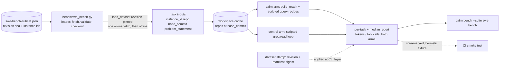

# Tech Spec: swe-bench-integration

**Spec**: [spec.md](spec.md) | **Survey**: [survey.md](survey.md) | **Research**: [research.md](research.md)
**Created**: 2026-09-17
Every file/symbol citation below comes verbatim from [survey.md](survey.md)
(`[S#]` items) or a grep/read run in this session (`[grep]`) — never from
memory. `[R#]` = research.md questions.

## Architecture

The arm is new work on top of the existing bench harness shape — no new
methodology `[S1 context; survey supporting evidence: "the arm is fully new
work on top of the existing harness shape"]`.

- The two-arm deterministic harness exists: `src/cairn/bench/agent_suite.py:94`
  `class _CairnArm` (counts query-tool calls + returned context chars, capped
  at the MCP result cap) vs `agent_suite.py:111` `class _ControlAgent` (a
  scripted stdlib-`re` grep/read loop, sorted file order, fixed regex recipes,
  `_MAX_GREP_NAMES = 40` hop bound); token proxy `agent_suite.py:58`
  `CHARS_PER_TOKEN = 4`; "Deterministic and CI-safe: no LLM, no network, no
  subprocesses" `[S1]`.
- `run_agent_suite` `[grep: agent_suite.py:551]` builds graph + hash
  embeddings + transitive closure once, snapshots/restores `CAIRN_DB`,
  `CAIRN_EMBED_BACKEND`, `CAIRN_RERANK=0` `[grep: agent_suite.py:573-590]`,
  runs each task's two arms `runs` times, reports per-task medians +
  totals/reduction. Calls/est_tokens are deterministic within a build; wall
  time is not `[grep: agent_suite.py:32-36]`.
- The corpus is synthetic/seeded (`corpus.py` `generate_corpus`,
  `DEFAULT_SEED`); task targets are picked deterministically by
  `_select_targets(conn, seed)` `[grep: agent_suite.py:322]`. The corpus is
  cairn's own — no SWE-bench task loader exists `[S1 gap]`.
- The loader seam exists: `src/cairn/bench/` has `corpus.py` + `datasource.py`
  with pinned-dataset stamping ("the stamp answers 'which pinned dataset does
  this artifact belong to'") `[S3]`. Stamps are applied beside
  `payload["timestamp"]` at the CLI layer, never inside `to_dict`; additive
  keys are safe for `.github/scripts/bench_compare.py` (reads via `.get`)
  `[grep: datasource.py:393-398]`. `validate_manifest` ignores unknown
  top-level sections `[grep: datasource.py:87-89, 262-264]`.
- CLI selection: `src/cairn/cli/bench.py:193` `--suite` is
  `click.Choice(["perf", "scaling", "agent"])` `[grep]`; exit-code contract
  0 clean / 1 usage / 2 regressions `[grep: bench.py:15-17]`.
- CI rot-prevention is proven: `tests/test_self_demo.py:1` self-demo indexes
  cairn's own tree in an isolated temp DB (`:38-54` `built_db` fixture,
  explicit `--db`/`--workspace` flags), gated via
  `pytestmark = pytest.mark.core` `[grep: test_self_demo.py:30]`; CI runs
  `pytest -m core` per-PR `[grep: .github/workflows/ci.yml:175]`. No
  swe-bench smoke exists `[S2 gap]`.

## Solution

### Chosen approach

A `swe-bench` suite that re-points the existing two-arm harness at SWE-bench
Lite task inputs, pinned by an in-repo instance-id manifest. FR coverage:

1. **Dataset + headline split (FR-001)** — SWE-bench **Lite, `test` split**
   (300 instances, 11 Python repos) `[R1]`, loaded the way the official
   harness loads tasks: `load_dataset("princeton-nlp/SWE-bench_Lite",
   split="test", revision=PINNED_COMMIT_SHA)` `[R1][R3]`; subsets via
   positional slices (the established `--slice` idiom `[R6]`).
2. **Pinning + reproducibility (FR-002)** — frozen in-repo
   `benchmarks/datasource/swe-bench-subset.json`: dataset revision sha +
   ordered instance-id list of the reported subset (50 instances; size is a
   first-principles call — no standard smoke size is published `[R6]`).
   First run fetches online; reruns set `HF_HUB_OFFLINE=1` and operate from
   the local cache `[R3]`. Task content is pinned by `base_commit` checkouts;
   probe targets are deterministic (identifier extraction, lexical
   tie-break — the `_select_targets` discipline `[S1]`); backends stay pinned
   (`CAIRN_RERANK=0`, hash embed) `[grep: agent_suite.py:573-590]`. The repo
   does not vendor task data `[spec assumption; R2]`.
3. **Loader contract (FR-001/FR-005)** — per task the minimal deterministic
   fields: `instance_id`, `repo`, `base_commit`, `problem_statement`
   (+ `environment_setup_commit` recorded, unconsumed) `[R5]`. Gold-patch
   fields (`patch`, `test_patch`, `FAIL_TO_PASS`, `PASS_TO_PASS`) stay out —
   only the deferred LLM arm consumes them `[R5]`. The loader checks out
   `base_commit` into a content-addressed workspace cache; after warm-up the
   arm is fully offline `[R3]`.
4. **The two arms (FR-001)** — reuse `_CairnArm` / `_ControlAgent` verbatim
   `[S1]`. Per task: deterministic probe recipes (locate definition, enumerate
   callers, bounded hop-following) targeted at identifiers extracted from
   `problem_statement` by a fixed regex; the cairn arm queries the graph built
   over the task workspace, the control arm greps/reads the same workspace.
   Report: per-task `ArmEffort`-shaped rows keyed by `instance_id`, medians
   for tokens and tool calls across tasks, both arms, reduction percentages —
   reusing `CHARS_PER_TOKEN` and the existing median/total logic.
5. **Stamping (FR-002/FR-003)** — swe-bench payloads get their own dataset
   stamp (revision sha + subset-manifest digest + instance count), applied at
   the CLI layer beside the timestamp (the existing additive pattern `[S3]`);
   `build_artifact_stamp`'s default output is untouched (12 direct callers /
   277 recursive — § Impact analysis).
6. **CLI (FR-001/FR-003)** — extend the `--suite` choice set with
   `swe-bench` (bench.py:193), add `--slice` and `--manifest` (default: the
   frozen subset file). Exit-code contract unchanged `[grep: bench.py:15-17]`;
   manifest errors fail before any suite work (the `_resolve_baseline_file`
   fails-promptly pattern `[grep: bench.py:78-111]`).
7. **CI smoke (FR-004)** — a `-m core`-marked test (the self-demo gating
   pattern `[S2]`) runs the suite end-to-end over a tiny local fixture task
   set — no network, hermetic, collected automatically by the per-PR
   `-m core` leg (ci.yml:175). The real-dataset path is exercised by the
   documented reproduction commands (FR-003), not a PR-gated fetch.
8. **Docs (FR-003)** — methodology (metric-class definition per D-003,
   manifest contents, determinism caveats `[grep: agent_suite.py:32-36]`) +
   the clean-clone command sequence: `pip install -e '.[bench]'` → run with
   the default manifest → medians.

### Alternatives rejected

| Alternative | Why rejected |
|-------------|--------------|
| Vendoring full task data in-repo | Mixed-license content (pylint GPL-2.0; matplotlib/sphinx/sympy custom; no dataset-level license) `[R2]`; spec assumption: loader fetches, repo does not vendor |
| SWE-bench Verified (500) as headline split | Its published numbers are LLM resolve rates; no graph-agent baseline need for the deterministic arm `[R4]`; larger to rerun |
| Full test split (2,294, 12 repos) | Max coverage but heavyweight for medians and smoke `[R1][R6]` |
| LFS-committed snapshot cache as the pin | Same redistribution posture as vendoring `[R2][R3]`; revision sha + manifest pins content with minimal code `[R3]` |
| Adding the `swebench` harness dependency now | Harness is resolve-rate machinery only (Docker, ≥120 GB) `[R5]`; belongs to the deferred LLM arm (FR-005); drift mitigated by the loader interface + revision pin |
| Raw HTTP fetch from the Hub | Not the researched pattern; re-implements revision pinning, slicing, offline caching `[R3]` |
| Lite `dev` split (23) as the CI smoke | Not the split the reported medians run on — rots a different path than the headline `[R6]`; adds network flakiness to a PR gate (D-005) |

## Impact analysis

Graph-tool evidence (cairn CLI fallback; precise resolution — precise is
ground truth for blast radius; a fuzzy pass would over-match common names
like `bench`; every symbol below resolved to one definition):

| Symbol | Direct callers (precise) | Recursive impact |
|---|---|---|
| `run_agent_suite` (agent_suite.py:551) | 2 — `bench` (cli/bench.py:335), `_run_suite` (tests/test_agent_suite.py:30) | 11 total (9 depth-1 test fns) |
| `build_artifact_stamp` (datasource.py:532) | 12 — 9 stamping tests, `mint` (scripts/measure_warm_time.py:454), `mint_quality` (scripts/mint_baselines.py:222), `bench` (cli/bench.py) | 277 total; resolver reports a cycle via `verify_ground_truth` (script graph, not runtime) |
| `validate_manifest` (datasource.py:248) | 12+ in tests/test_bench_datasource.py | manifest contract tests only |

Nothing breaks if the design is followed as specified — every change is
additive. The constraints that keep it that way are the test-tree sweep below
and D-007.

### Test-tree sweep (defaults the design could flip)

Only default-adjacent flips: extending the `--suite` choice set
(bench.py:193), adding CLI flags, adding payload keys. Sweep `[grep]`:

- **Flag pins (assert the old default/choice set)**: none — no test asserts
  the exact choice list or the invalid-choice message (`grep
  "Invalid value|perf.*scaling.*agent|choice"` over tests/test_bench.py,
  tests/test_agent_suite.py, tests/test_bench_stamping.py: no matches).
  `tests/test_bench.py:196` `assert "--suite" in result.output` pins flag
  *presence*, not the choice set → behavior pin (unaffected).
- **Exact-count / exact-value pins**: `tests/test_agent_suite.py:113`
  `payload["chars_per_token"] == 4` pins `CHARS_PER_TOKEN` — reused verbatim,
  unchanged (D-007). `tests/test_agent_suite.py:112-114` corpus file counts
  are synthetic-suite-only.
- **Exact-traffic pins (payload shape content)** — these break if shared
  `to_dict` shapes or `build_artifact_stamp`'s default output gain keys, so
  swe-bench additions go in new report/stamp code (D-007):
  - `tests/test_agent_suite.py:120` `set(task) == {"label", "question",
    "cairn", "control", "reduction"}`; `:122` arm key set; `:123` reduction
    key set; `:124` totals key set (exact `==`). Top-level payload keys are a
    superset pin (`:112` `>=`) — additive-safe.
  - `tests/test_bench_stamping.py:68` `set(stamp) == {"dataset",
    "cairn_version", "machine_profile"}`; `:70`, `:91` exact dataset-block
    dicts; `:216` exact `machine_profile` key set; `:234` superset payload
    pin (additive-safe).
- **Exact-traffic pins (CLI invocations)** — unaffected by an added choice;
  listed because they exercise the dispatch being extended:
  tests/test_agent_suite.py:196, 272, 311 (`--suite agent`),
  tests/test_bench.py:209, 328 (`--suite perf`),
  tests/test_bench_stamping.py:209, 230, 243 (`--suite perf|scaling|agent`),
  tests/test_agent_suite.py:30 `_run_suite(name="agent", seed=0xC0DE)`.
- **Behavior pins (unaffected)**: tests/test_self_demo.py:57, 97 (self-demo);
  tests/test_bench_datasource.py:235-302 (validator contract — the pin file
  is a sibling JSON, not a `validate_manifest` change); tests/test_bench.py:38
  (perf stats shape).
- **CI pins**: the per-PR `-m core` leg (ci.yml:175) collects the new smoke
  test — the intended gate (D-005); PR full-suite legs exclude `-m infra`
  (ci.yml:187, 189); the perf bench job (ci.yml:330) gains no steps.

## Code guide

### `src/cairn/bench/swe_bench.py` (new loader)
- Touches: new module behind the datasource seam (`bench/ has corpus.py +
  datasource.py` `[S3]`).
- Approach: lazy `import datasets`; load Lite `test` at the manifest's
  revision sha; project rows to the five-field contract `[R5]`; check out
  `base_commit` into a content-addressed cache; validate the pin file
  (ordered unique instance ids, revision sha hex) before any fetch.
- Verify before implementing: `uv run pytest tests/test_swe_bench_loader.py -q`
- Pitfalls: `datasets` import stays lazy with an actionable error (D-004);
  never write task content into the repo (D-002); this module is the only one
  that knows the HF schema (drift isolation `[spec risk]`).

### `src/cairn/bench/swe_bench_suite.py` (new suite runner)
- Touches: new module; imports `_CairnArm` (agent_suite.py:94),
  `_ControlAgent` (agent_suite.py:111), `CHARS_PER_TOKEN` (agent_suite.py:58)
  and the median/`ArmEffort` logic `[S1]`.
- Approach: per task — extract probe targets from `problem_statement` (fixed
  identifier regex, lexical tie-break), run both scripted arms `runs` times,
  median per task, then medians across tasks; same env snapshot/restore
  discipline as `run_agent_suite` `[grep: agent_suite.py:573-590]`.
- Verify before implementing: `uv run cairn bench --suite swe-bench --slice 0:2 --json`
- Pitfalls: do not add keys to shared `to_dict` shapes — the exact `==` pins
  (tests/test_agent_suite.py:120, 122, 123, 124) break; swe-bench keys live
  at the new report's own payload level (D-007).

### `src/cairn/cli/bench.py` (CLI extension)
- Touches: the `--suite` click.Choice (`cairn bench --suite agent|perf|scaling`
  selection pattern to extend `[survey supporting evidence]`; bench.py:193
  `[grep]`), new `--slice`/`--manifest` options, swe-bench dispatch branch.
- Approach: resolve + validate the pin file before any suite work (the
  `_resolve_baseline_file` fails-promptly pattern `[grep: bench.py:78-111]`);
  apply the swe-bench stamp beside `payload["timestamp"]` `[S3]`.
- Verify before implementing: `uv run pytest tests/test_bench.py tests/test_agent_suite.py tests/test_bench_stamping.py -q`
- Pitfalls: exit-code contract 0/1/2 unchanged `[grep: bench.py:15-17]`;
  `--suite swe-bench` + `--baseline` follows the existing per-suite baseline
  resolution or exits 1.

### `benchmarks/datasource/swe-bench-subset.json` (frozen pin)
- Touches: new sibling file; `validate_manifest` untouched (unknown sections
  already ignored `[grep: datasource.py:87-89]`; this file is a separate
  contract, no T1 coupling).
- Approach: `{schema, dataset_revision_sha, subset: [instance_id...],
  reported: true}` — the loader validates its own pin file.
- Verify before implementing: `python -c "import json; json.load(open('benchmarks/datasource/swe-bench-subset.json'))"`
- Pitfalls: instance ids must exist in Lite test (loader asserts); any change
  is a new subset version, never an edit of the frozen list (D-002).

### `tests/test_swe_bench_smoke.py` (CI smoke, FR-004)
- Touches: new test marked `pytest.mark.core` — the self-demo's CI gating
  pattern (`runs under -m core in CI, so the demo cannot silently rot` `[S2]`,
  test_self_demo.py:30 `[grep]`).
- Approach: hermetic fixture task set (tiny synthetic tree, no network); run
  the suite end-to-end; assert both arms report non-zero effort and the
  payload shape; isolated temp dirs, no `~/.cairn` contact (C-04).
- Verify before implementing: `uv run pytest -m core -q`
- Pitfalls: must not fetch (the `-m core` leg has no `datasets` guarantee —
  the fixture exercises the suite, not the fetch branch); must not patch the
  global `subprocess.Popen` (C-04).

### Docs (FR-003)
- Touches: benchmark methodology docs + README pointer.
- Approach: metric-class definition (D-003), subset manifest contents,
  clean-clone command sequence, determinism caveats (calls/est_tokens
  deterministic within a build; wall time advisory `[grep:
  agent_suite.py:32-36]`).
- Verify before implementing: follow the documented commands on a fresh clone.
- Pitfalls: no published number without its stamp (manifest revision);
  explicit non-comparability statement (D-003).

## References

From [research.md](research.md):

- HF dataset cards — `princeton-nlp/SWE-bench` (12 fields; test 2,294 / dev
  225; no dataset-level version), `SWE-bench_Lite` (test 300 / dev 23, 11
  repos), `SWE-bench_Verified` (500, human-validated) `[R1]` — loader input
  contract and split choice.
- SWE-bench paper (ICLR 2024, arXiv:2310.06770) — benchmark definition `[R1]`;
  per-repo license table (Table 12) `[R2]`.
- HF `datasets` loading docs — `revision=` pinning, positional slices,
  `HF_HUB_OFFLINE=1` `[R3]` — the fetch/pin/offline pattern.
- RepoGraph (arXiv:2410.14684) — +32.8% is an average relative improvement in
  success rate on Lite across four LLM systems; absolute rates 29.67% /
  20.33%; no Verified numbers `[R4]` — the comparability-scope input to D-003.
- mini-swe-agent docs — `--subset/--split/--slice/--filter/--shuffle` batch
  flags; positional slicing as the established subsetting mechanism `[R6]`.
- Official SWE-bench repo — MIT harness; `load_dataset` usage; Docker +
  120 GB requirement for scoring `[R1][R2][R5]`.

## Decisions

### D-001: Headline split is SWE-bench Lite `test`
- **Context**: FR-001/FR-003 need a fixed, rerunnable, standard task set;
  research offers Lite (test 300, 11 repos), Verified (500), Full (2,294)
  `[R1]`.
- **Decision**: Lite `test` — the split the graph-agent comparisons
  (incl. RepoGraph) were measured on `[R4]`, the smallest standard test set,
  and the split the future LLM arm would land on for same-split numbers.
- **Consequences**: a frozen 50-instance subset manifest over Lite; Verified/
  Full stay reachable by changing the manifest only.

### D-002: Pin by in-repo instance-id manifest + HF revision sha; no vendored content
- **Context**: FR-002 requires identical outputs across reruns and offline
  operation; licenses constrain redistribution (pylint GPL-2.0, three custom
  repos, no dataset-level license) `[R2]`; `load_dataset(..., revision=)` +
  positional slices + `HF_HUB_OFFLINE=1` are the established pattern `[R3]`.
- **Decision**: freeze the subset as ordered instance ids + dataset revision
  sha in `benchmarks/datasource/swe-bench-subset.json`; fetch once, rerun
  offline from the local cache; subset size 50 (first-principles — no
  standard smoke size is published `[R6]`).
- **Consequences**: reruns are content-stable without redistributing task
  data; first run per machine needs network; a manifest change is a new
  subset version, never an edit.

### D-003: Comparability scope — the deterministic arm publishes efficiency medians as their own metric class
- **Context**: the spec's What-section headline cites RepoGraph's +32.8%,
  but that is an average relative improvement in *resolve rate* on SWE-bench
  Lite across four LLM systems `[R4]`; the deterministic arm yields no-LLM
  token/tool-call medians; no published deterministic SWE-bench efficiency
  benchmark exists to compare against `[R4]`; the resolve-rate arm is
  deferred (FR-005).
- **Decision**: the deterministic arm's published results (README + docs) are
  efficiency medians (tool calls + est_tokens), explicitly labeled as their
  own metric class and stated as not numerically comparable to RepoGraph's
  +32.8% or any resolve-rate figure; resolve-rate comparability is the
  deferred LLM arm's deliverable, to be measured on Lite `[R4]`.
- **Consequences**: no cross-metric headline number in this spec's
  deliverables; D-001's Lite choice preserves the same-split path; FR-003's
  methodology docs carry the explicit non-comparability statement.

### D-004: New dev-scoped dependency `datasets` (C-03 gate); `swebench` harness not added
- **Context**: C-03 requires a recorded decision for new dependencies; the
  loader needs HF `load_dataset` `[R3]`; the official harness is resolve-rate
  machinery only (Docker, ≥120 GB) `[R5]` and the LLM arm that needs it is
  deferred (FR-005).
- **Decision**: add `datasets` to a new `bench` optional extra
  (`pip install -e '.[bench]'`), imported lazily only inside the swe-bench
  loader; do not add `swebench` in this spec — it follows with the LLM arm as
  a pinned dev-only dependency (the spec's harness-drift mitigation stays:
  stable loader interface + revision pin).
- **Consequences**: core wheel and platform matrix unchanged; the bench extra
  adds the `datasets`/pyarrow/fsspec tree to dev/bench environments only;
  importing without the extra raises an actionable error.

### D-005: CI smoke is hermetic (self-demo pattern), not a real-fetch gate
- **Context**: FR-004 names the self-demo pattern `[S2]`; the deterministic
  arm is offline by contract (FR-002); no standard CI smoke size is published
  `[R6]`; a real-split slice in a PR gate means cloning real repos at
  `base_commit` on every PR.
- **Decision**: the `-m core`-marked smoke test runs the suite over a tiny
  local fixture task set (no network), collected by the per-PR `-m core` leg
  (ci.yml:175); the real-dataset path is covered by the documented
  reproduction commands (FR-003), exercisable manually or as a
  main-only/nightly follow-up without gating PRs.
- **Consequences**: the PR gate stays fast and deterministic; HF API drift is
  caught by docs-driven reruns, not CI; Lite `dev` (23) and `--slice 0:10`
  remain documented run options, not gates.

### D-006: Deterministic probes are scripted context-acquisition recipes, not task solving
- **Context**: a no-LLM arm cannot attempt resolution; the existing suite
  already measures scripted call-sequence effort per task-shaped question
  `[S1]`; the minimal deterministic task input is `problem_statement` + repo
  identity `[R5]`.
- **Decision**: per task, extract probe targets from `problem_statement`
  with a fixed identifier regex (lexical tie-break) and run the two arms'
  scripted recipes over the pinned workspace; report per-task and cross-task
  medians. Kept red flag: a scripted probe is a proxy for real agent
  behavior — measurability over realism, the same trade-off the existing
  suite's fixed recipes make `[S1]`; kept because it is the only
  deterministic definition of effort on a task, and the methodology docs
  define the recipes as part of the metric (Q4: the published methodology
  must define the metric class explicitly `[R4]`).
- **Consequences**: numbers are reproducible and rot-guarded; gold-patch
  fields stay out of the loader contract `[R5]`; realism criticism is
  answered by documentation, not by hidden heuristics.

### D-007: Swe-bench reporting/stamping is additive; shared shapes untouched
- **Context**: the test tree pins shared shapes exactly — payload task/arm/
  reduction/totals key sets (tests/test_agent_suite.py:120-124 `[grep]`) and
  `build_artifact_stamp`'s default output (tests/test_bench_stamping.py:68,
  70, 91, 216 `[grep]`) — and `build_artifact_stamp` has 12 direct callers /
  277 recursive impact (§ Impact analysis).
- **Decision**: reuse `ArmEffort`/`TaskEffort`/median logic and the
  stamp-application pattern, but define the swe-bench report's own payload
  level and its own stamp builder (revision sha + manifest digest); existing
  `to_dict` shapes and `build_artifact_stamp` defaults gain no keys.
- **Consequences**: all exact-shape pins stay green; additive payload keys
  remain safe for `.github/scripts/bench_compare.py`'s `.get` reads
  `[grep: datasource.py:393-398]`.
