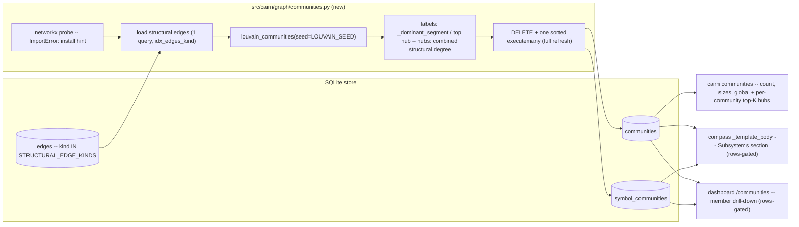

# Tech Spec: symbol-communities

**Spec**: [spec.md](spec.md) | **Created**: 2026-10-04
**Every file/symbol citation below must come verbatim from [survey.md](survey.md)
or a grep run in this session — never from memory.**

## Architecture

One writer, two additive tables, three read-only surfaces. `cairn communities`
probes the `[graph-analytics]` extra, loads structural edges, runs seeded
Louvain, derives labels and hubs, full-refreshes `communities` +
`symbol_communities`, and prints the summary. Compass and the dashboard are
pure readers that gate on community rows and degrade to omitted section /
empty panel otherwise (rows, not table presence — see D-006).

It sits beside the existing derived-table machinery: the kind set is the
shared `STRUCTURAL_EDGE_KINDS` (traversal.py:8-12, closure- and
taint-consumed), the schema pattern is the additive exemplar trio
(`embeddings_mv` schema.py:217, `dataflow` schema.py:343-349,
`transitive_edges` schema.py:420), and the refresh pattern is the
DELETE-then-sorted-executemany precedent (dataflow.py:485).

## Solution

### Chosen approach

`cairn communities` is a single explicit command (compute + persist + print;
auto-refresh riding `cairn update` is spec Out-scope). A new
`src/cairn/graph/communities.py` owns probe → load → cluster → label →
persist; a new `src/cairn/cli/communities.py` registers the command onto the
click group (the 28-import side-effect pattern, cli/__init__.py:14-41).
Clustering input is the structural kind set, kind-weighted
(calls/call=1.0, extends/implements=2.0), projected undirected
(D-003). Hubs rank by combined structural in+out degree, global and
per community, `--top-k` default 10 (FR-003). Labels are fact-derived
(dominant path segment ≥ 0.60 share via repo_map `_dominant_segment`,
else top hub) — LLM-free and deterministic (FR-008, D-005). Compass gains a
rows-gated `# Subsystems` section plus critic vocab recognition with the
hardcoded 5.0 denominator resolved into a documented named constant (D-007).
The dashboard gains `/communities` in the Explore nav section with the
entire pin surface moved in one lockstep task (D-008). Performance is
enforced as a budget row on the existing 1000-file scaling gate (D-009).

FR coverage: FR-001 → writer/tables/CLI (D-001, D-004); FR-002 → D-003;
FR-003 → D-004/D-005 hub ranking + `--top-k`; FR-004 → D-006, D-002;
FR-005 → D-007; FR-006 → D-008; FR-007 → D-005; FR-008 → D-005.

### Alternatives rejected

| Alternative | Why rejected |
|-------------|--------------|
| Extend repo_map `_clusters` with Louvain | Couples core `cairn map` to the optional extra (violates FR-004 discipline) and changes a shipped surface answering a different question (path-prefix clusters vs graph subsystems; survey FR-003 caveat) |
| Derive critic denominator from `_DEFAULT_SECTION_VOCAB` length | Both shapes emit all 5 of their vocab headings unconditionally (the flow body always appends `# Tribal Knowledge`, generator.py:544), so clean drafts still pass at 5/10 = 0.5 ≥ 0.5 — but any warned draft trips the 0.7 threshold (critic.py:138) where a complete body scores 5/10 = 0.5 < 0.7 and fails; the constant 5.0 keeps a complete body at 1.0 (critic.py:127-138) |
| Pass explicit per-shape `section_vocab` from `generate_compass` | Changes the critic contract at one of 25 direct call rows (see impact table) and decouples the owner test (tests/test_compass_generator.py:204) for what a named constant delivers |
| Re-declare the edge-kind tuple in communities code | The shared `STRUCTURAL_EDGE_KINDS` IS the FR-002 contract ("the same set the closure and taint traverse"); a copy rots (traversal.py:8-12) |
| Gate Subsystems/view on table presence (`_knowledge_table_present` style) | `_apply_schema` creates empty tables on every store open, so presence is always true post-open — it would flip byte-pinned compass output with no data (schema.py:629-632; tests/test_graft_parity_notes.py:134) |
| LLM-generated labels | FR-008 requires LLM-free; deterministic precedents exist (repo_map `_dominant_segment` repo_map.py:99, compass template body generator.py:277) |
| Unweighted (binary) clustering | FR-002 mandates kind-weighted; the spec risk register requires the weighting pinned here and determinism-tested, not quality-tuned |

## Impact analysis

Blast radius of touched symbols (cairn graph tools, this session):

| Symbol | Direct callers | Consequence |
| --- | --- | --- |
| `critic_concept` | 25 direct call rows — grep-verified this session: `grep -rn "critic_concept(" src tests --include="*.py"` minus import lines, the critic.py:88 definition row, monkeypatch/setattr references, and CLI-`def` lookups = 11 production (cli/validate.py:130, mcp_server/tools_compass.py:153/:289, wiki/generator.py:28, llm/tasks.py:428/:432, cli/compass.py:114/:191/:310/:428, compass/generator.py:396) + 14 test (tests/test_wiki_promotion.py:383/:384/:394/:407, tests/test_graft_parity_notes.py:212/:217, tests/test_compass_generator.py:211, tests/test_compass_critic.py:208/:219/:232/:251/:276, tests/test_core_smoke.py:244/:263) | Widest surface — vocab/denominator change must be score-neutral for every shape (D-007) |
| `_template_body` | 2 (`generate_compass` generator.py:130 + definition row) | Contained — only the deterministic module body changes |
| `shell_context` | 9 (app.py render :280 + 7 test rows) | Nav changes flow to every page via shell context |
| `STRUCTURAL_EDGE_KINDS` | 0 resolved, precise AND fuzzy — the resolver misses cross-module constant imports | Not absence: survey grep is authoritative (dataflow.py:460-468 closure seed, pack.py:282 `kind IN (...STRUCTURAL_EDGE_KINDS)`) |
| repo_map `_clusters` / `build_repo_map` | untouched by design (D-001) | `cairn map` output and its tests unaffected |

Test-tree sweep — the flips are inventory extensions (nav 14→15,
`_MAIN_VIEWS` 16→17, vocab 9→10) and a data-gated section. Every assertion
found, classified:

- **Exact-count pins — break by design, must move in the same task**:
  tests/test_dashboard_shell.py:`test_nav_sections_cover_every_view_exactly_once`
  (:38, `== 14` at :41 → 15); tests/test_dashboard_shell.py:
  `test_every_nav_view_renders_an_icon` (:141, `<svg` count == len(NAV_LABELS)
  — moves automatically once the 15th icon arm exists, _icons.html:8-34);
  the three byte-identical 16-path `_MAIN_VIEWS` tuples
  (tests/test_dashboard_accessibility.py:28-45, tests/test_dashboard_restyle.py:23-40,
  tests/test_dashboard_assets.py:23-38) → 17, one lockstep edit.
- **Exact-traffic pins — new entries join, old bytes preserved**:
  tests/test_dashboard_readonly.py:ROUTES (:27-56) iterated by the read-only
  byte-identical contract (:228, :338, :619) — `/communities` joins ROUTES;
  tests/test_graft_parity_notes.py:134 (compass bytes) — stays green because
  the section is rows-gated (D-006); tests/test_wiki_promotion.py:
  `test_default_vocab_bit_identical_for_existing_callers` (:383) — stays
  green when the default vocab grows (wiki passes its own vocab).
- **Behavior pins — stay green, auto-extend where parametrized**:
  tests/test_dashboard_accessibility.py:
  `test_every_button_has_a_non_empty_accessible_name` (:283, parametrized
  over `_MAIN_VIEWS` — new cases appear, template must satisfy them);
  tests/test_dashboard_restyle.py:
  `test_sidebar_flags_exactly_one_active_nav_item` (:189, parametrized over
  `_NAV_VIEWS`, auto-extends); tests/test_dashboard_shell.py section-label
  pin `== [None, "Explore", "Knowledge", "Activity", "System"]` (:50) and
  positional pins `sections[1]["items"][1]` = graph (:52, :82) — preserved
  by the Explore append placement (D-008); tests/test_compass_generator.py:
  `test_deterministic_template_passes_own_critic` (:204) — green: module body
  scores 5/5 → 1.0 without rows, 6/5 → 1.0 saturated with rows;
  tests/test_skillgen_assembly.py:125 and the tests/test_compass_critic.py /
  tests/test_core_smoke.py critic tests — unaffected;
  tests/test_dashboard_packaging.py:36 — glob-replays packaging, new template
  auto-covered, no edit.
- **Flag pins**: none — no default flag or keyword flips; the extra is
  additive and absent-by-default today (survey tomllib inventory: ann, bench,
  dev, ingest, otlp, scip, semantic, test, watch).

## Quality, threats, and rollback

| Requirement | Design consequence / threat mitigation | Rollback or verification |
|-------------|----------------------------------------|--------------------------|
| NFR-001 security (n/a) | No network/auth surface: CLI + SQLite derived tables + dashboard read view via `get_read_only_db` (dashboard/data.py:1912) | Holds while no listener/auth code is introduced (survey NFR-001 gap: none) |
| NFR-002 privacy (n/a) | Nothing leaves the store; telemetry untouched (`otlp` strictly lazy, pyproject.toml:139-148) | Absence greps stay the guard |
| NFR-003 performance | D-009: budget row at the existing 1000-file gate (`GATE_FILES = 1000` tests/test_scaling_gate.py:15, `point.closure_seconds <= wall_budget` :73 shape); cost profile is one indexed pull (idx_edges_kind schema.py:74) + in-memory Louvain + one executemany | `CAIRN_LIB=/tmp/__no_such_lib__ uv run --extra test pytest tests/test_scaling_gate.py -q -m "not infra"` |
| NFR-004 reliability (n/a, binding on readers) | Rows-gated degrade everywhere (D-006); tables always rebuildable by re-running the command | Empty-store suites stay green; compass omits section, dashboard renders empty panel |
| NFR-005 observability (n/a) | `_RecordingGroup` wraps every invoke (main.py:71-102) — the new subcommand inherits recording | `grep -n "_RecordingGroup\|_record_invocation" src/cairn/cli/main.py` |
| NFR-006 accessibility | D-008: the crawl extends to `/communities` once it joins `_MAIN_VIEWS`; new markup must pass focus-visible (:138-150), no-outline (:153-160), button-name (:283), reduced-motion (:333-357), table-semantics (:365-375) audits | tests/test_dashboard_accessibility.py -q (31 passed this session pre-change) |

Threat model (compact): asset — the local store's derived state and the
read-only dashboard contract. Threat — a communities writer bug corrupting
derived tables, or a view leaking writes. Mitigation — additive idempotent
schema (no migration), single-transaction DELETE + executemany, parameterized
queries (bandit `-s B608` endemic-safe discipline), reads on
`get_read_only_db`, `--top-k` validated as a positive int
(`_validate_cap` shape, repo_map.py:32). Residual risk — low: no auth, no
external input beyond one numeric option.

Rollback: revert the branch; leftover `communities`/`symbol_communities`
tables are harmless (additive, readers gate on rows) or dropped with two
`DROP TABLE` statements. No MIGRATIONS entry to unwind; compass and dashboard
return to pre-feature output automatically because the rows the reverted
writer no longer produces gate them off.

## Code guide

### Core writer (src/cairn/graph/communities.py — new)
- Touches: new sibling of dataflow.py; imports `STRUCTURAL_EDGE_KINDS`
  (traversal.py:8-12), reuses `_dominant_segment` (repo_map.py:99, same
  package), copies the full-refresh shape (dataflow.py:474-485).
- Approach: probe (D-006) → one edges pull with a kind filter → undirected
  weighted projection (D-003) → `louvain_communities` from
  `networkx.algorithms.community` with `LOUVAIN_SEED` (D-005) → combined
  structural degree per member, sorted labels/hubs → DELETE + one sorted
  executemany (D-004).
- Verify before implementing: `uv run --no-sync python -c "from
  networkx.algorithms.community import louvain_communities; import inspect;
  print('seed' in inspect.signature(louvain_communities).parameters)"`
  (True on the 3.6.1 arm; survey FR-007 verify).
- Pitfalls: the import is NOT top-level (`hasattr(networkx,
  'louvain_communities')` is False); `get_db` before the probe violates
  FR-004 (writable open applies schema, schema.py:928/:629-632); louvain
  returns sets — any unsorted emission leaks nondeterminism into ids.

### Schema (src/cairn/graph/schema.py)
- Touches: additive CREATE TABLE IF NOT EXISTS blocks near the
  `transitive_edges` exemplar (schema.py:420); no MIGRATIONS entry
  (schema.py:214-216).
- Approach: `communities(id, label, size)` + `symbol_communities(community_id,
  symbol_id, structural_degree)` (D-004).
- Verify before implementing: open a pre-feature fixture store — tables
  exist empty, all suites green.
- Pitfalls: nothing may gate on table presence (D-006); anything enumerating
  schema contents is `unknown — verify` at implementation (no such pin in the
  survey).

### CLI (src/cairn/cli/communities.py — new)
- Touches: `@main.command("communities")` onto the click group
  (cli/main.py:136); one import line in cli/__init__.py (28 existing, :14-41).
- Approach: `--top-k` default 10, probe-first ordering (D-006), prints
  community count, sizes, global + per-community top-K hubs.
- Verify before implementing: `uv run cairn communities --help`.
- Pitfalls: recording is inherited from `_RecordingGroup` — add nothing.

### Compass (generator.py, critic.py, tasks.py)
- Touches: `_template_body` (generator.py:277), `_DEFAULT_SECTION_VOCAB`
  (critic.py:75-85), the `5.0` literal (critic.py:133), module prompt
  enumeration (tasks.py compass-synthesize, "exactly these 5 sections").
- Approach: D-007 — rows-gated `# Subsystems` after "# What Does This Module
  Do?", vocab 9→10, denominator → named `_DEFAULT_COMPLETE_SECTIONS = 5.0`
  with updated comment; flow body untouched.
- Verify before implementing: `CAIRN_LIB=/tmp/__no_such_lib__ uv run --extra
  test pytest tests/test_compass_critic.py tests/test_compass_generator.py
  tests/test_wiki_promotion.py tests/test_graft_parity_notes.py -q` (42
  passed this session on the first pair).
- Pitfalls: deriving the denominator from vocab length fails every
  warned draft at the 0.7 threshold (D-007c); explicit-vocab callers (wiki)
  must remain bit-identical.

### Dashboard (routes, data, shell, icons, pins)
- Touches: new routes/communities.py (`register(routes, context)`, per
  routes/memory.py:register:14), app.py register block (:357-365),
  `get_communities` in dashboard/data.py, shell.py:18-47 nav-as-data,
  _icons.html:8-34, then the pin move.
- Approach: D-008 — Explore-section append after `graph`; `/communities/`
  into all three `_MAIN_VIEWS` tuples and ROUTES in one task; member
  drill-down as per-community member tables with real table semantics.
- Verify before implementing: `CAIRN_LIB=/tmp/__no_such_lib__ uv run --extra
  test pytest tests/test_dashboard_shell.py
  tests/test_dashboard_accessibility.py tests/test_dashboard_restyle.py -q`
  (10 passed + 31 passed this session at the 14/16 counts).
- Pitfalls: the three `_MAIN_VIEWS` tuples are byte-identical — move them
  together; ROUTES is iterated three ways (:228, :338, :619); the readonly
  contract must pass from day one.

### Tests and packaging
- Touches: new tests for double-run determinism (fixture graph, byte-equal
  tables + summary — the FR-007 owner test), probe-failure store-unchanged,
  rows-gated omission, Subsystems critic recognition; a budget row in
  tests/test_scaling_gate.py shape; `graph-analytics = ["networkx>=3.4"]` in
  pyproject.toml `[project.optional-dependencies]` (pyproject.toml:68).
- Approach: C-02 failing-test-first per task; C-04 — no eager `cairn.cli`
  imports in test modules, `tmp_path` isolation.
- Verify before implementing: `python3 -c "import tomllib;
  d=tomllib.load(open('pyproject.toml','rb'));
  print(sorted(d['project']['optional-dependencies'].keys()))"`.
- Pitfalls: CI arms without the extra must skip communities tests cleanly;
  the 3.4.2 lock arm's louvain presence is `unknown — verify` — the
  determinism test running on every arm is the guard (D-002).

## References

research.md records "not applicable — no open questions at Stage 0": there
are no external candidates to cite. Every alternative above traces to a
survey.md constraint or the spec's own risk register instead. Nearest
in-repo prior art, all via survey: repo_map cluster/hub projection
(`cairn map`), closure/taint edge-kind discipline, the bench optional-extra
probe, the scaling gate, and the derived-table exemplars.

## Decisions

### D-001: Standalone communities module; `cairn map` is not extended
- **Context**: The survey found `cairn map` already ships per-cluster hubs —
  repo_map `_clusters` sorts members by all-kind in-degree (repo_map.py:52-56
  subqueries, no kind filter) and slices `[:hub_cap]` (:131-134) at
  `DEFAULT_HUB_CAP = 3` (:11) — which superficially overlaps FR-003.
- **Decision**: Build a standalone `src/cairn/graph/communities.py` writer
  and `cairn communities` command; repo_map stays byte-identical. Graph
  topology (Louvain) and path prefixes answer different questions, and
  extending repo_map would put the optional networkx import on the core
  `cairn map` path.
- **Consequences**: repo_map's semantics (all-kind, in-degree-only, cap 3)
  are not retrofitted to FR-003's combined structural degree top-K; two
  deliberately different "clusters" surfaces coexist — the overlapping
  vocabulary is a kept red flag, mitigated by naming the new command/tables
  `communities` everywhere, never "map" or "clusters".

### D-002: New runtime dep `networkx>=3.4` in a `[graph-analytics]` extra
- **Context**: networkx is in no dependency/extras list today (tomllib
  inventory) and reaches the lockfile only transitively (torch
  uv.lock:4788-4789, pymupdf-layout uv.lock:3470-3471). `louvain_communities`
  with `seed` is verified on the 3.6.1 venv arm; the py<3.11 lock arm pins
  3.4.2 with presence `unknown — verify`. C-03 requires a recorded decision
  for any new runtime dep.
- **Decision**: Add `graph-analytics = ["networkx>=3.4"]` to
  pyproject.toml. The floor is 3.4 — at or below every observed lock
  resolution — so no CI Python arm can resolve under it, and
  `louvain_communities(seed=...)` availability is enforced on every arm by
  the FR-007 double-run determinism test; an explicit implementation-time
  check closes the 3.4.2 `unknown — verify`.
- **Consequences**: Core installs gain nothing (opt-in extra); matrix cost is
  nil — networkx is pure-Python (spec risk register); imports are lazy from
  `networkx.algorithms.community` (not top-level). A raw `import networkx`
  outside the probe path is a review failure.

### D-003: Structural-only, kind-weighted input — calls=1.0, call=1.0, extends=2.0, implements=2.0, undirected projection
- **Context**: FR-002 mandates the structural kind set, kind-weighted; no
  weighting prior art exists in-repo (survey FR-002 gap); Louvain requires an
  undirected graph.
- **Decision**: Consume `traversal.STRUCTURAL_EDGE_KINDS` verbatim. Pin
  weights as a module constant: calls/call = 1.0, extends/implements = 2.0 —
  subtyping edges are definitional membership (a subclass/implementor belongs
  to its base's subsystem), call edges are probabilistic membership; one
  inheritance edge counts as two calls. Project the directed multigraph onto
  an undirected weighted graph by summing mirrored directed-edge weights.
- **Consequences**: The closure/taint shared set stays the single source of
  truth; the weights are determinism-pinned, not quality-tuned — per the
  spec risk register, tests assert determinism on a fixture graph, never
  partition quality; binary clustering remains available by setting all
  weights to 1.0. The 2.0 ratio is a judgment call — a kept red flag,
  accepted because the spec explicitly assigns quality judgment out of scope.

### D-004: Two additive tables, full-refresh writer, degree stored for reads
- **Context**: Additive-only schema discipline (schema.py:214-216) and the
  DELETE + sorted executemany precedent (dataflow.py:474-485, :594).
- **Decision**: `communities(id INTEGER PRIMARY KEY, label TEXT NOT NULL,
  size INTEGER NOT NULL)` and `symbol_communities(community_id INTEGER NOT
  NULL, symbol_id INTEGER NOT NULL, structural_degree INTEGER NOT NULL)`,
  plain CREATE TABLE IF NOT EXISTS, no MIGRATIONS entry. The writer deletes
  all rows then inserts communities sorted by (-size, label) and members
  sorted by (path, qualified_name) in one executemany — ids are assigned in
  that order and are stable across runs.
- **Consequences**: Every store gains the tables idempotently on next open;
  `structural_degree` (in + out over structural kinds) is stored so compass
  and dashboard never re-join `edges`. Storing a derivable column duplicates
  facts — kept red flag, accepted because it mirrors the `transitive_edges`
  philosophy (store the projection reads need) and keeps read paths
  single-table.

### D-005: Determinism contract — fixed seed, sorted inputs, fact-derived labels
- **Context**: FR-007 pins same partition, labels, and ordering across runs;
  `louvain_communities` returns a list of sets with arbitrary iteration
  order; the in-repo determinism convention is seeded generation
  ("deterministic given the same seed", corpus.py:generate_corpus:12-32,
  `DEFAULT_SEED = 0xC0DE`).
- **Decision**: A `LOUVAIN_SEED` module constant (value pinned at
  implementation, e.g. 0) passed as `seed=`; graph nodes inserted in sorted
  (qualified_name, symbol id) order; every emitted list re-sorted before
  persist or print (communities by (-size, label), members by (path,
  qualified_name), hubs by (-structural_degree, path, qualified_name)).
  Labels are LLM-free: the community's dominant member path segment when its
  share exceeds 0.60 — reusing repo_map `_dominant_segment` over sorted
  member paths — else the top hub's qualified_name, prefixed so the two
  cases stay distinguishable. The double-run byte-equality test is the owner
  test for the whole contract.
- **Consequences**: Same partition, labels, ordering, and ids on an unchanged
  graph (FR-007, US1-AC2); singletons are persisted as-is — determinism over
  quality judgment, and only for non-empty graphs (a zero-edge graph persists
  nothing, D-010); label collisions are acceptable since the id and
  membership carry identity and the label is presentation (FR-008).

### D-006: Probe-before-write; readers gate on rows, never table presence
- **Context**: get_db opens the DB writable and applies schema on open
  (schema.py:928, :629-632) — merely opening the store creates the new
  tables, so a naive command order violates FR-004's "leave store state
  unchanged". Conversely, `_apply_schema` creates empty tables on EVERY
  store, so presence-based gates (the `_knowledge_table_present` pattern,
  dashboard/data.py:951) would flip byte-pinned outputs with no data.
- **Decision**: `cairn communities` runs the lazy
  `from networkx.algorithms.community import louvain_communities` probe
  FIRST (ImportError with a `pip install 'cairn[graph-analytics]'` hint,
  copied from swe_bench.py:fetch_dataset_rows:89-101), and only then opens
  the store. All readers (compass, dashboard) gate on community ROWS, not
  table presence, and degrade to omitted section / empty panel (FR-005,
  NFR-004).
- **Consequences**: A failed run leaves the store byte-identical (US4-AC1);
  graft parity and compass byte pins survive unchanged on old fixtures; the
  rows-gate is the one rule every new reader must copy.

### D-007: Compass Subsystems section — rows-gated, vocab 9→10, denominator 5.0 kept as a named constant
- **Context**: `_template_body` emits exactly 5 sections (generator.py:277);
  `_DEFAULT_SECTION_VOCAB` is 9 headings spanning both compass shapes
  (critic.py:75-85); the quality denominator is hardcoded
  `total = 5.0 if section_vocab is None else float(max(len(vocab), 1))`
  (critic.py:133) with `threshold = 0.7 if warnings else 0.5` (:138); the
  LLM prompts enumerate sections in lockstep (tasks.py compass-synthesize /
  flow-synthesize).
- **Decision**: (a) `generate_compass` resolves a Subsystems fact — top 5
  communities by (-size, label), each with its top hub — and `_template_body`
  emits `# Subsystems` immediately after "# What Does This Module Do?" only
  when the fact is non-empty; the flow body is untouched. (b) Add
  "# Subsystems" to `_DEFAULT_SECTION_VOCAB` (9→10) so the critic recognizes
  it (FR-005). (c) Hoist the literal 5.0 into a named constant
  (`_DEFAULT_COMPLETE_SECTIONS = 5.0`) with an updated adjacent comment: the
  denominator intentionally does NOT track vocab length — both compass shapes
  emit all 5 of their vocab headings unconditionally (the flow body always
  appends `# Tribal Knowledge`, generator.py:544), so derivation is
  score-neutral on clean drafts (5/10 = 0.5 meets the 0.5 floor) but breaks
  every warned draft: with a warning the threshold rises to 0.7
  (critic.py:138) and a complete 5-section body would score 5/10 = 0.5 <
  0.7 and fail, where the constant keeps it at 5/5 = 1.0; while
  `min(sections / total, 1.0)` saturates a 6-section module body at 1.0. (d) tasks.py module prompt enumeration gains
  the optional section in the same task.
- **Consequences**: All existing shapes keep identical pass/fail behavior —
  owner test `test_deterministic_template_passes_own_critic` (:204) stays
  green, wiki explicit-vocab callers stay bit-identical
  (tests/test_wiki_promotion.py:383); the constant-not-derived denominator
  is a kept red flag, documented at the constant, because no single
  denominator is correct for a pool spanning two shapes.

### D-008: Dashboard `/communities` — nav-as-data append, one lockstep pin move
- **Context**: The dashboard is the widest pin surface in the repo (spec
  risk register): NAV_LABELS 14 ids (shell.py:26-41), 14 icon arms
  (_icons.html:8-34), three byte-identical 16-path `_MAIN_VIEWS` tuples, and
  the readonly ROUTES contract.
- **Decision**: Add a `communities` route module (`register(routes,
  context)` convention, registered in app.py:357-365), a rows-gated
  `get_communities` reader in dashboard/data.py on `get_read_only_db`
  (:1912), a template with real table semantics and per-community member
  drill-down; append the id to the Explore section's items after `graph` in
  NAV_SECTIONS/NAV_LABELS (14→15), add a 15th icon arm, and add
  `/communities/` to all three `_MAIN_VIEWS` tuples (16→17) and ROUTES —
  one task, one commit. Empty stores render an empty panel, never an error.
- **Consequences**: The Explore-append placement keeps the positional pins
  (`sections[1]["items"][1]` = graph, :52/:82) and the section-label pin
  (:50) green; only the exact-count pins enumerated in the impact sweep
  move. NFR-006 is enforced automatically — the accessibility crawl extends
  to the new path once registered, and the markup must pass focus-visible,
  outline, button-name, reduced-motion, and table-semantics audits.

### D-009: NFR-003 enforced as a scaling-gate budget row
- **Context**: The 1000-file gate exists — sizes (100, 500, 1000, 5000)
  (scaling_suite.py:87), `synthesize_structural_edges` over the seeded corpus
  (:31, corpus.py:generate_corpus:12), and tests/test_scaling_gate.py asserts
  `point.closure_seconds <= wall_budget` (:73) at `GATE_FILES = 1000` (:15).
- **Decision**: Add a communities budget row at the same suite point and
  assert communities wall seconds <= 10 at the 1000-file gate, mirroring the
  closure-budget shape. Supported by the cost profile: one indexed SQL pull
  over `edges` (idx_edges_kind, schema.py:74) with a kind filter, in-memory
  graph build, near-linear Louvain, one-transaction executemany.
- **Consequences**: The 10s wall is CI-enforced, not aspirational; a
  regression fails the same gate the closure budget fails in. No new
  benchmark harness is built — the existing suite point is extended.

### D-010: Zero-edge graphs persist nothing — the clustering graph is the edge-endpoint projection
- **Context**: TC-004 (test.md) runs `cairn communities` on a symbol-bearing,
  relation-free workspace and expects success with "no communities found (or
  an empty listing)". The writer pulls only structural edges (one indexed
  query); if the node set were instead seeded from the symbol table, a
  relation-free workspace would hand Louvain N isolated nodes and — per
  D-005's persist-as-is rule — persist N singleton communities, contradicting
  TC-004.
- **Decision**: The clustering graph is built from structural-edge endpoints
  only — a symbol with zero structural edges is never a node and gets no
  community membership (an explicit FR-001 scope boundary: communities are
  derived from relations only). When the edge pull returns zero rows, the
  writer skips clustering entirely, still performs the DELETE (full refresh
  leaves the tables empty), prints a zero-count summary / "no communities
  found", and exits 0 — no dependence on how `louvain_communities` behaves
  on an empty graph.
- **Consequences**: TC-004 is satisfiable as written with no test-side
  special case; readers stay rows-gated (D-006) — a relation-free store
  renders the omitted Subsystems section / empty panel; D-005's singleton
  persistence now applies only to Louvain-emitted singletons in non-empty
  graphs (edge-connected symbols the partition isolates).
