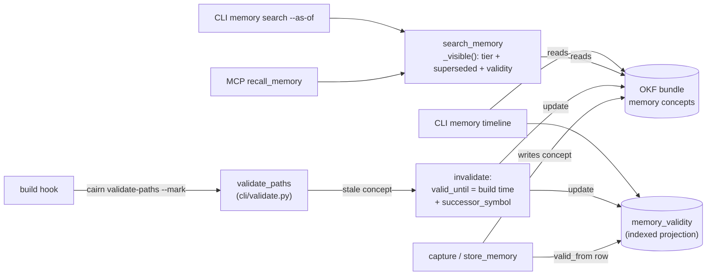

# Tech Spec: temporal-memory

**Spec**: [spec.md](spec.md) | **Created**: 2026-09-17
**Every file/symbol citation below must come verbatim from [survey.md](survey.md)
or a grep run in this session — never from memory.**
Citations marked *(session)* come from greps/`cairn`-CLI runs in the authoring
session (baseline: survey.md main @ d18768c); all other citations are verbatim
from survey.md. [research.md](research.md) is "not applicable — no open
questions at Stage 0", so every rejected alternative traces to a survey
constraint or session-verified code fact instead of a research finding.

## Architecture

Memory records are OKF concepts persisted through `read/write_concept` in
`src/cairn/okf/bundle.py`; `store_memory` in `src/cairn/memory/store.py` is the
persistence path (survey.md, Supporting evidence). Today a stale memory carries
only a boolean: the `--mark` path of `validate-paths` sets
`c.extensions["stale"] = True` (survey.md S2). This feature turns that boolean
into an interval: `valid_from`/`valid_until` live in concept extensions (same
home as the `stale` flag and `memory_tier`/`memory_score` read by
`memory_search`), mirrored into a derived, indexed SQL projection
(`memory_validity`) that rides schema.py's additive-only migration pattern
(survey.md, Supporting evidence). Recall surfaces — MCP `recall_memory`
(tools_memory.py:21, survey.md S4) and CLI `memory search` (survey.md S4) —
both route through `search_memory` and gain an as-of predicate; builds
invalidate through the existing `validate-paths` `--mark` path (survey.md S2),
never a parallel detector (FR-003).

## Solution

### Chosen approach

1. **Validity interval on the concept (FR-001).** `valid_from` (default:
   creation time) and `valid_until` (nullable) are written into the memory
   concept's `extensions` — the established per-memory extension home
   (`c.extensions["stale"] = True` at src/cairn/cli/validate.py:35's `--mark`
   path, survey.md S2; `c.extensions.get("memory_score", "?")` /
   `memory_tier` read by `memory_search`, survey.md S2 evidence). A derived
   SQL table `memory_validity(concept_id PK, valid_from, valid_until,
   successor_symbol)` with indexes on both date columns is created inside
   `_apply_schema` as another additive `CREATE TABLE IF NOT EXISTS` — the
   pattern schema.py's own table comments establish: "Additive-only: plain
   CREATE TABLE IF NOT EXISTS" (survey.md, Supporting evidence; re-verified
   this session at src/cairn/graph/schema.py:110, :134, :224, :267, :351,
   :373). Migration for existing rows: a one-time backfill pass (precedent:
   `_maybe_backfill_fts`, session grep src/cairn/graph/schema.py:668) writes
   `valid_from` into every existing memory concept's extensions and inserts
   the matching `memory_validity` row; `valid_until` stays NULL (still valid).
2. **As-of recall (FR-002, FR-005).** `search_memory` (def at
   src/cairn/memory/promotion.py:242, session grep) already filters each
   candidate concept through a per-concept `_visible()` predicate (tier check
   + `memory_is_latest` supersession check, session read). The validity check
   is added to that same predicate: a concept is visible at instant `t` iff
   `valid_from <= t` and (`valid_until` is NULL or `valid_until > t`). New
   optional `as_of` parameter (ISO date; None = now) on `search_memory`, on
   `recall_memory` (`def recall_memory(query: str, tier: str = "",
   include_superseded: bool = False) -> str:` tools_memory.py:21, survey.md
   S4), and a `--as-of` option on the CLI `search` subcommand
   (`@memory.command("search")` at src/cairn/cli/memory.py:101, session grep;
   survey.md S4 confirms the subcommand is `search`, not `recall`). Because
   the predicate rides the existing per-concept filter, default recall adds
   zero extra I/O — FR-005's indexed columns serve the SQL-side consumers
   (timeline, aggregate temporal queries), and the benchmark below proves the
   recall path unregressed.
3. **Build-time auto-invalidation (FR-003).** Extend the `--mark` path inside
   `validate_paths` (`def validate_paths(db, knowledge, mark)` at
   src/cairn/cli/validate.py:35, survey.md S2): after setting
   `c.extensions["stale"] = True`, also set `extensions["valid_until"]` to
   the build time, resolve a successor symbol where the graph identifies
   exactly one (D-005), and update the `memory_validity` row. No new command,
   no parallel detector — the same critic delegation
   (`cairn.compass.critic.validate_paths`, survey.md S2) remains the only
   stale-reference detector. The `stale` boolean is kept for its existing
   consumers; the interval is additive.
4. **Timeline (FR-004).** New `@memory.command("timeline")` subcommand in
   src/cairn/cli/memory.py (the file already carries the `promote` and
   `decay` subcommands, survey.md S3, and `search`, survey.md S4). It lists
   memory concepts citing `<symbol>` ordered by `valid_from`, showing each
   memory's validity window, successor link, and current tier/score
   extensions.

FR coverage: FR-001 → §1; FR-002 → §2; FR-003 → §3; FR-004 → §4; FR-005 → §1
(indexed projection), §2 (zero-added-I/O predicate) and §5 (benchmark).

### Alternatives rejected

| Alternative | Why rejected |
|-------------|--------------|
| Validity columns only in a new SQL memory table, recall filters via SQL JOIN | Recall is a Python scan over OKF concepts (`bundle.search` + per-concept `_visible()`, session read of `search_memory`), not a SQL row scan — a SQL-only home would add a per-concept lookup hop on the hot path; extensions are the established per-memory home (survey.md S2 evidence) |
| New `cairn memory invalidate` command driven by a second stale detector | FR-003 mandates extending `cairn validate-paths`, "not building a parallel detector" (spec.md FR-003); a new command would also break the hook pin on the literal `cairn validate-paths --mark` string (tests/test_install_uninstall_fidelity.py:208, session grep) |
| Recall-time auto-invalidation (set `valid_until` when recall's STALE flag fires) | Breaks the exact-output pins in tests/test_memory_stale_flag.py, which assert a memory citing a deleted symbol still *surfaces* with `[STALE]` (session read); FR-003 scopes invalidation to builds, and spec.md S5's gap says successor linking derives from graph identity at write time, not per-query |
| Replacing the `stale` boolean with the interval | `stale` already has consumers outside memory (survey.md S2 marks concepts stale; re-verified this session: tests/test_doctor.py:351 and tests/test_wiki_cli.py:467 assert on stale reporting); additive columns are the spec's stated migration shape (FR-001) |
| Blocking on the incremental builder for rename events | survey.md S5: `grep -n "rename\|successor" src/cairn/graph/incremental.py` → no matches; the builder carries no rename signals, so successor links must come from graph identity at mark time (re-verified this session, grep exit 1) |

## Impact analysis

### Blast radius (cairn graph + greps, session runs)

- **`search_memory`** (src/cairn/memory/promotion.py:242, session grep) is the
  chokepoint: `cairn callers search_memory` (session) lists 13 direct call
  sites — 5 production: `recall_memory` (src/cairn/mcp_server/tools_memory.py:50),
  `memory_search` (src/cairn/cli/memory.py:114), `_search_memory`
  (src/cairn/compass/router.py:265), `_retrieve_l4` (src/cairn/eval.py:498),
  `explore` (src/cairn/mcp_server/tools_graph.py:478); 8 test call sites
  (tests/test_memory_lifecycle.py:110/:117/:129/:245,
  tests/test_redaction_chokepoints.py:633, tests/test_memory_embeddings.py:241/
  :256/:285). `cairn impact search_memory` (session) reports 279 impacted at
  depth 2. Every as-of change lands inside this one function's `_visible`
  predicate; no caller signature changes (new parameter is optional).
- **`recall_memory`**: `cairn impact recall_memory` (session) reports 11
  impacted — 4 direct (tests/test_mcp_degradation_footnote.py
  `test_recall_memory_carries_footnote_once`,
  `test_recall_memory_healthy_output_is_footnote_free`;
  tests/test_mcp_connection_leaks.py `test_recall_memory_closes_conn_on_exception`;
  the `_recall` helper in tests/test_memory_stale_flag.py) and 7 transitively
  through the stale-flag tests. Signature grows an optional `as_of`;
  tool name, module, and output shape are pinned by tests (see sweep).
- **`validate_paths`**: name-collided symbol. `cairn impact validate_paths`
  (session, precise) reports only 1 impacted (the CLI wrapper at
  src/cairn/cli/validate.py:35) with a cycle warning; `cairn callers
  validate_paths --fuzzy` (session) additionally surfaces the critic def at
  src/cairn/compass/critic.py:202. The CLI wrapper is the edit point; the
  critic function's internals were not read this session — its entry shape
  (`entry["concept_id"]`, `entry["verified"]`) is known only from the CLI
  loop pasted in survey.md S2. Unknown — verify: whether critic entries carry
  the dead ref strings or the CLI must re-extract refs from the concept body.
- **`store_memory`** (survey.md, Supporting evidence): `cairn impact
  store_memory` (session) reports 139 impacted at depth 2 (capture/write path
  shared with dashboard seeds and lifecycle ops `demote_memory`
  src/cairn/memory/store.py:234, `purge_archived` :273, survey.md S3). The
  design does not change its signature — capture additionally writes
  `valid_from` via the shared validity helper (D-001), so existing callers
  see no shape change.
- Not touched: `promote_memory` (src/cairn/memory/promotion.py:397) and the
  decay path (survey.md S3) — tier movement is orthogonal to validity; and
  src/cairn/graph/incremental.py (survey.md S5) — no builder events used.

### Test-tree pin sweep

Default flip: recall surfaces gain default validity filtering (default
`as_of=None` = now, only currently-valid memories return). Migrated rows are
all born `valid_until=NULL`, so every fixture below that never invalidates a
memory stays green — but these are the tests that break if the flip is
implemented wrong. Enumeration of classes 1-3 (file and name):

**Flag pins (assert an old default of a flipped API):**
- tests/test_memory_lifecycle.py `test_default_hides_superseded` (:107) —
  pins default-hides-superseded semantics of `search_memory`
- tests/test_memory_lifecycle.py `test_include_superseded_shows_all` (:114) —
  pins `include_superseded=True` chain traversal; must keep working
  orthogonally to the validity filter (D-002)
- tests/test_memory_lifecycle.py `test_old_memory_without_is_latest_treated_as_latest`
  (:121, session grep :129 call) — pins "missing extension defaults to
  visible"; the validity predicate must use the same lenient default for
  pre-feature concepts

**Exact-count pins (assert result/row counts the flip could change):**
- tests/test_memory_lifecycle.py `test_default_hides_superseded` —
  `assert len(results) == 1`
- tests/test_memory_lifecycle.py `test_include_superseded_shows_all` —
  `assert len(results) >= 2`
- tests/test_memory_embeddings.py `test_fused_provenance_when_found_both_ways`
  (:256 call) — `assert results` non-empty
- tests/test_memory_embeddings.py `test_no_embeddings_yet_degrades_to_pure_lexical`
  (:285 call) — `assert results` non-empty
- tests/test_memory_embeddings.py `test_chunk_dedup_returns_one_entry_per_concept`
  (:268) — `ids.count(concept.concept_id) <= 1`
- tests/test_redaction_chokepoints.py `test_search_memory_persists_sanitized_query`
  (:626) — `assert rows` over `memory_refs` (row count + redacted content)

**Exact-traffic pins (assert what gets called/sent, in count or content):**
- tests/test_mcp_connection_leaks.py `test_recall_memory_closes_conn_on_exception`
  (:170) — patches `cairn.memory.promotion.search_memory`; pins that
  `recall_memory` keeps routing through `search_memory`
- tests/test_mcp_degradation_footnote.py `test_recall_memory_carries_footnote_once`
  (:223) — monkeypatches `promotion.search_memory` (lambda absorbs `**kw`, so
  the new parameter is tolerated) and pins footnote count == 1 + last line
- tests/test_mcp_degradation_footnote.py `test_recall_memory_healthy_output_is_footnote_free`
  (:233) — same stub path
- tests/test_memory_lifecycle.py `test_recalled_is_positive` (:244) — pins
  that `search_memory` records ref/reinforcement traffic on the DB
- tests/test_memory_stale_flag.py all five
  (`test_recall_flags_stale_when_cited_symbol_deleted`,
  `test_recall_no_stale_flag_for_memory_without_refs`,
  `test_recall_no_stale_flag_for_real_refs`,
  `test_recall_partial_stale_when_one_of_two_refs_gone`,
  `test_recall_does_not_crash_when_verification_raises`) — exact-output pins
  on STALE/refs-verified rendering through the real `recall_memory`; they
  hold only while recall-side staleness stays display-only (D-004)
- tests/test_install_uninstall_fidelity.py
  `test_custom_home_git_hook_gains_quoted_export_line_after_shebang` (:188;
  `assert "cairn validate-paths --mark" in hook` at :208) — pins the literal
  hook command; auto-invalidation must live inside `--mark`, not change the
  command line (D-003)
- tests/test_agent_surface.py module mapping `"recall_memory":
  "cairn.mcp_server.tools_memory"` (:517) and the hint assertion on
  `recall_memory`'s source (:706) — pin tool registration location and the
  in-source `cairn memory digest` hint

Behavior pins (unaffected, not enumerated): tool-membership assertions
(tests/test_memory_mcp_trim.py:61), tool-name lists in
tests/test_dashboard_scale.py:64 / tests/test_dashboard_live_soak.py:59,
metrics redaction (tests/test_metrics.py:595 — synthetic args_summary),
eval expectation tests/eval/queries.yaml:118, skillgen docstring references.

### Resolution caveat

Precise impact on the collided name `validate_paths` under-reports (1 hit,
cycle detected); the fuzzy caller list adds the critic definition. Counts
above are session tool output, not memory; the `search_memory` count is
precise-mode and stable because the name is unique in-repo.

## Code guide

### Schema + migration (FR-001, FR-005)
- Touches: schema.py's additive table comments — "Additive-only: plain
  CREATE TABLE IF NOT EXISTS" (survey.md, Supporting evidence); concept
  extension writes via `read/write_concept` in `src/cairn/okf/bundle.py`
  (survey.md)
- Approach: add `memory_validity` inside the existing idempotent schema
  application; backfill pass mirrors each memory concept's
  `valid_from`/`valid_until` into extensions + index row (D-001)
- Verify before implementing: `grep -rn "valid_from\|valid_until\|as_of"
  src/cairn/memory/ src/cairn/okf/` (survey.md S1 verify — currently no
  matches)
- Pitfalls: pre-feature concepts have no created-time extension field
  verified anywhere in survey.md — backfill's `valid_from` source is
  unknown — verify (concept metadata vs file mtime); test the migration
  against a fixture store from the prior schema version (spec.md risk
  mitigation)

### As-of recall (FR-002, FR-005)
- Touches: `def recall_memory(query: str, tier: str = "",
  include_superseded: bool = False) -> str:` (tools_memory.py:21, survey.md
  S4); the CLI `search` subcommand in cli/memory.py (survey.md S4: the
  subcommand is `search`, not `recall`); `search_memory` insertion point
  (src/cairn/memory/promotion.py:242, session grep — not in survey.md, see
  gap note in the session reply)
- Approach: one new optional `as_of` parameter end-to-end; validity check
  added to the per-concept `_visible()` predicate (session read); superseded
  and validity stay orthogonal filters (D-002)
- Verify before implementing: `grep -n "@memory.command"
  src/cairn/cli/memory.py` (survey.md S3/S4 verify)
- Pitfalls: the footnote/leak tests stub `promotion.search_memory` with
  positional-shaped lambdas — keep new parameters keyword-only;
  `explore`, compass router, and eval reach `search_memory` too, so an
  invalid memory disappears from all five production consumers at once
  (by design, but verify eval fixtures don't pin invalidated memories)

### Build-time auto-invalidation (FR-003)
- Touches: `def validate_paths(db, knowledge, mark)` at
  src/cairn/cli/validate.py:35 and its `--mark` path setting
  `c.extensions["stale"] = True` (survey.md S2); delegates to
  `cairn.compass.critic.validate_paths` (survey.md S2)
- Approach: after the existing mark, set `extensions["valid_until"]` to
  build time, resolve the successor where the graph identifies exactly one
  (D-005), update the `memory_validity` row via the shared helper (D-001);
  keep the non-zero exit and `stale` boolean untouched
- Verify before implementing: `sed -n '31,66p' src/cairn/cli/validate.py`
  (survey.md S2 verify)
- Pitfalls: `validate_paths` is a collided name (see Impact analysis);
  critic entry shape beyond `concept_id`/`verified` is unknown — verify;
  the install-hook test pins the exact `cairn validate-paths --mark` string

### Timeline command (FR-004)
- Touches: cli/memory.py subcommand registry — `promote` and `decay` exist
  (survey.md S3), `search` exists, `recall` does not (survey.md S4)
- Approach: new `timeline` subcommand; resolve memories citing `<symbol>`
  via the same backtick-ref extraction the stale path uses, order by
  `valid_from`, render validity windows + successor (D-005)
- Verify before implementing: `grep -n "@memory.command"
  src/cairn/cli/memory.py` (survey.md S3/S4 verify)
- Pitfalls: cite-scan reads every memory concept (same cost as
  `search_memory`'s broaden path, session read) — acceptable for a CLI;
  do not put it on the recall path; the `memory_refs` table's columns are
  unknown — verify before relying on it for symbol lookup

### Latency benchmark (FR-005)
- Touches: none (measurement only); recorded here per FR-005
- Approach (protocol, fixed before implementation):
  - Fixture: seeded store via `capture_memory`/`store_memory` on `tmp_path`
    (C-04 isolation), 1000 memory concepts, 50 fixed queries
  - Measure: `recall_memory(query)` wall-clock p50/p95, 50 queries x 3 runs,
    cold cache per run; same protocol for CLI `memory search`
  - Before: baseline main @ d18768c (survey.md header)
  - After: this feature branch
  - Regression bar: "measurably" = p95 delta beyond 2x run-to-run stddev of
    the before-run; both numbers and the delta are appended to the table
    below by the benchmark task
- Verify before implementing: `grep -rn "valid_from\|valid_until\|as_of"
  src/cairn/memory/ src/cairn/okf/` returns no matches (survey.md S1)
- Pitfalls: benchmark on the :memory: or tmp_path store only — never the
  real `~/.cairn` (C-04)

| Metric | Before (main @ d18768c) | After (branch) | Delta |
|--------|-------------------------|----------------|-------|
| recall_memory p50 | (benchmark task records) | — | — |
| recall_memory p95 | (benchmark task records) | — | — |
| memory search p50 | (benchmark task records) | — | — |
| memory search p95 | (benchmark task records) | — | — |

## References

research.md is "not applicable — no open questions at Stage 0"; no external
references to carry. Governing in-repo docs: [spec.md](spec.md) (FRs),
[survey.md](survey.md) (code-state evidence), [../CONSTITUTION.md](../CONSTITUTION.md)
(C-01..C-04), and Zep's bi-temporal model as prior art named in spec.md's Why.

## Decisions

### D-001: Validity lives in concept extensions; `memory_validity` is a derived indexed projection
- **Context**: FR-001 needs the interval on every memory record and FR-005
  needs indexed columns; memory records are OKF concepts (survey.md,
  Supporting evidence), and the only existing per-memory persistence precedent
  is extensions (`c.extensions["stale"] = True`, survey.md S2).
- **Decision**: `valid_from`/`valid_until`/`successor_symbol` are written to
  concept extensions (source of truth, survives bundle export) and mirrored
  into the `memory_validity` SQL table (indexed on both dates) by a single
  shared write helper that both capture and invalidation call; migration
  backfills both from one pass over existing concepts.
- **Consequences**: two representations of one fact — the red flag this
  decision carries; mitigated by single-helper ownership and rebuildability
  of the projection. Recall reads extensions only (no SQL hop on the hot
  path); SQL consumers (timeline aggregates, future temporal queries) read
  the projection.

### D-002: `as_of` is a new optional parameter, orthogonal to `include_superseded`
- **Context**: FR-002 flips the default (only currently-valid memories
  return) while supersession (`memory_is_latest`, session read of
  `search_memory`) already filters by default — two axes that must not
  merge.
- **Decision**: visibility = valid-at-instant AND (latest OR
  `include_superseded`); `as_of=None` means now. `include_superseded=True`
  does not bypass validity, and validity filtering does not imply
  supersession traversal.
- **Consequences**: an as-of query with `include_superseded=True` returns
  the full chain of memories that were valid at that date, including since-
  superseded revisions; the three lifecycle flag pins in
  tests/test_memory_lifecycle.py stay green untouched.

### D-003: Auto-invalidation extends the `--mark` path of `validate-paths`; no new command
- **Context**: FR-003 requires extending `cairn validate-paths`, "not
  building a parallel detector" (spec.md); the git hook string
  `cairn validate-paths --mark` is pinned by
  tests/test_install_uninstall_fidelity.py:208 (session grep).
- **Decision**: the `--mark` branch (src/cairn/cli/validate.py:35's loop,
  survey.md S2) additionally sets `valid_until` = build time and the
  successor link; the command line, its flags, and the non-zero exit
  contract are unchanged.
- **Consequences**: invalidation only fires when builds run the marked
  validation — un-built workspaces accumulate stale-but-valid memories,
  which matches today's `stale` semantics; no scheduler is introduced.

### D-004: Recall-side STALE rendering stays display-only
- **Context**: recall already computes reference liveness per query
  (spec.md Why; the `[STALE]`/`refs-verified` output, session read of
  tests/test_memory_stale_flag.py) — tempting to invalidate at recall time.
- **Decision**: the recall-side flag never writes `valid_until`; the only
  write-time trigger is the build path (D-003).
- **Consequences**: the five exact-output pins in
  tests/test_memory_stale_flag.py keep their semantics (a memory citing a
  deleted symbol still surfaces, flagged) until a build invalidates it;
  no hidden writes on the read path.

### D-005: Successor links come from graph identity at mark time, unique-candidate rule
- **Context**: FR-003 wants a successor link "where the graph identifies
  one"; survey.md S5's gap states successor linking must derive from graph
  identity because the builder carries no rename events.
- **Decision**: at `--mark` time, for each dead ref, candidate successors
  are live symbols sharing the dead symbol's identity anchors (file scope /
  qualified-name prefix + kind); exactly one candidate → record
  `extensions["successor_symbol"]` + projection column; zero or multiple →
  no link. The exact ref-matching internals of
  `cairn.compass.critic.validate_paths` are unknown — verify before
  implementing the extraction.
- **Consequences**: no fuzzy guessing; ambiguous renames leave memories
  invalidated but unlinked, and timeline renders them as dead ends —
  honest by design.

### D-006: Benchmark protocol fixed up front; no new runtime dependency
- **Context**: FR-005 requires the before/after benchmark recorded in this
  spec; C-03 requires any new runtime dependency to be decided here.
- **Decision**: the protocol in § Latency benchmark is the contract the
  benchmark task fills in; the design uses only stdlib sqlite3 and existing
  OKF/store machinery — zero new runtime dependencies.
- **Consequences**: the FR-005 table above is the single home for the
  numbers; C-03 is satisfied by this entry (no dependency decision to
  price).
