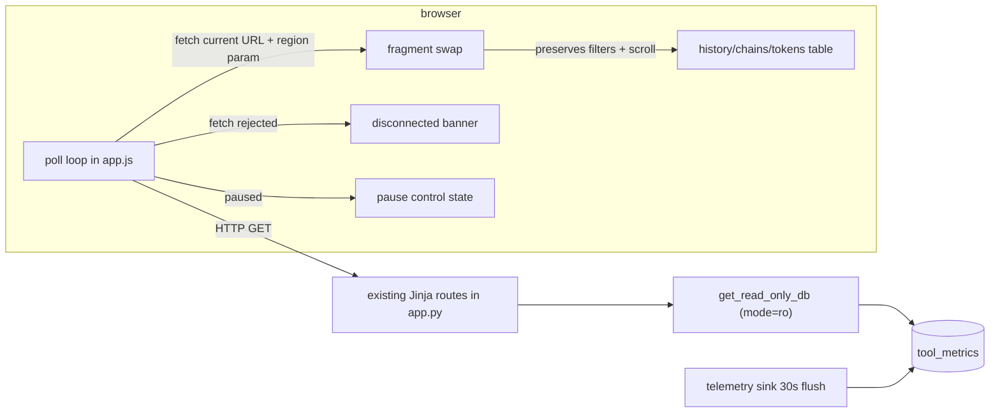

# Tech Spec: ui-dashboard-live-updates

**Spec**: [spec.md](spec.md) | **Created**: 2026-08-20
Every file/symbol citation below comes verbatim from [survey.md](survey.md)
or a grep run in this session — never from memory.

## Architecture

The dashboard stays a snapshot server (survey Q2): all novelty lives in
`src/cairn/dashboard/static/app.js`, which re-fetches the current URL on a
re-arming timer and swaps the marked body region. The recording pipeline is
untouched — the sink's 30s flush cadence (survey Q6) is the upstream gate on
when a row becomes visible.

## Solution
### Chosen approach
A dependency-free vanilla-JS module in `src/cairn/dashboard/static/app.js`
(existing file, survey Q1) providing: (1) a re-arming setTimeout loop
(default 5s, configurable via a control honoring FR-001's "configurable
interval"); (2) fetch of `window.location.href` with the response parsed via
DOMParser, swapping the element matching a body-region id; (3) scroll capture
and restore plus form-value carry-over before/after swap (FR-003); (4) a
pause/resume toggle whose state is visibly indicated (FR-004); (5) a
fetch-rejection-driven disconnected banner that clears on the next successful
poll (FR-005); (6) ordering/dedup delegated to the server's ORDER BY plus
atomic swap — a re-fetch of the same data renders the same rows, so
idempotency holds by construction (FR-006, research RQ2). Templates gain a
region marker each (`history.html`, `chains.html`, `tokens.html`) and
`base.html` gains the shared control chrome. FR-002 extends the same wiring
to chains/tokens.

### Alternatives rejected
| Alternative | Why rejected |
|-------------|--------------|
| htmx vendored for polling | One behavior does not justify a new vendored dependency; fetch+DOMParser is ~100 lines (research RQ1) |
| SSE/WebSocket push | Explicitly deferred by spec scope; polling acceptable first |
| location.reload() | Loses filter input and scroll — violates FR-003 directly |
| JSON delta endpoint + client render | Duplicates Jinja rendering logic in JS; the HTML fragment already exists |

## Impact analysis
- Client-only change: no route signatures, no data-layer functions, no schema
  touched. `src/cairn/dashboard/app.py` is untouched unless a region marker
  proves insufficient (plan's stated fallback).
- `app.js` currently serves the graph view only (survey Q1); the poll module
  must guard-skip when no traffic-view region is present, exactly as the
  graph code guards on missing `#graph-data`.
- Tests: `tests/test_dashboard_app.py` TestClient tests are unaffected (they
  assert server HTML, which does not change shape); new tests target the
  loop module's pure functions (next-tick computation, state transitions).
- Downstream: ui-dashboard-traffic-scale's pagination changes the region's
  content, not the swap contract; cross-links' URL params ride through the
  fetch unchanged (they are part of `window.location.href`).

## Code guide
### Client poll module
- Touches: `src/cairn/dashboard/static/app.js` (survey Q1 — today graph-only)
- Approach: append a self-contained IIFE alongside the graph block; state
  machine {running, paused, disconnected} with explicit transitions; export
  nothing (matches existing file's encapsulation).
- Verify before implementing: `grep -n "fetch(" src/cairn/dashboard/static/app.js` (expect none today)
- Pitfalls: timer stacking under tab throttling (re-arm, don't interval);
  swapping the whole table container resets focus — swap the smallest region
  that contains the rows; never parse the fetched document with innerHTML on
  untrusted content (same-origin fetch only).

### Template region markers + chrome
- Touches: `src/cairn/dashboard/templates/history.html`, `chains.html`,
  `tokens.html`, `base.html` (verified present in templates/)
- Approach: wrap each view's table in an element with a stable id; add the
  pause control and status banner to `base.html` so all traffic views share
  them; state indicator classes styled in `src/cairn/dashboard/static/app.css`.
- Verify before implementing: `ls src/cairn/dashboard/templates/`
- Pitfalls: keep server-rendered filter inputs' `value` attributes (app.py
  round-trips them, survey Q4) so a fresh fragment restores inputs for free.

### Tests
- Touches: `tests/test_dashboard_app.py` (survey Q7)
- Approach: TestClient test inserting a row then re-fetching the route
  asserts the new row is in the served fragment (server-side half of SC-1);
  loop-module unit tests drive tick functions directly — no sleeps.
- Verify before implementing: `uv run pytest tests/test_dashboard_app.py -q`
- Pitfalls: the suite forbids real timers in auto tests (plan risk); the
  manual soak owns real-interval behavior.

## References
- htmx polling pattern (fetch-swap precedent): https://htmx.org/docs/#polling
- Timer throttling / visibility: https://developer.mozilla.org/en-US/docs/Web/API/document/visibilityState
- Fetch rejection as connection signal: https://fetch.spec.whatwg.org/
- Related specs: ui-dashboard-traffic-scale (pagination this composes with),
  ui-dashboard (shipped substrate this builds on).

## Decisions
### D-001: Polling, not push, for v1
- **Context**: spec defers SSE/WebSocket; the cheapest correct live view.
- **Decision**: re-arming fetch poll of the current URL, fragment swap.
- **Consequences**: sub-interval staleness is accepted; no server session
  state; push can later replace the transport behind the same swap seam.

### D-002: Idempotency by atomic full-region swap, not keyed merge
- **Context**: FR-006 forbids duplicate rows; research RQ2 weighed merge-vs-swap.
- **Decision**: the fragment replaces the region atomically; ordering is the
  server's ORDER BY; no client-side row bookkeeping.
- **Consequences**: no duplicate rows by construction; scroll/filters need
  explicit preservation (FR-003 task); keyed append stays available if the
  region grows past swap cost.

### D-003: Visibility-gated loop, pause control orthogonal
- **Context**: SC-2's hour-open page under background throttling.
- **Decision**: the loop skips fetches while `document.hidden`; the explicit
  pause control is separate user intent (FR-004) and wins over visibility.
- **Consequences**: hidden tabs do not accumulate work; returning to the tab
  refreshes immediately once visible.
