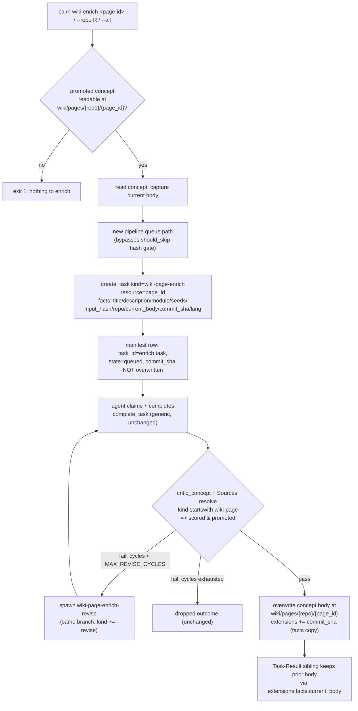
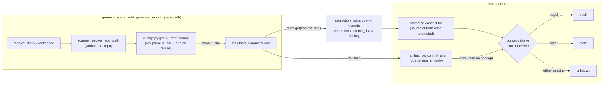

# Tech Spec: wiki-enhancements

**Spec**: [spec.md](spec.md) | **Created**: 2026-08-31
**Every file/symbol citation below comes verbatim from [survey.md](survey.md)
or from this session's grep/read/cairn-MCP output against e002f9b — never from
memory.** Session-verified additions are marked **[session]**.

## Architecture

Two diagrams cover the feature's two data flows; everything else is local
edits inside machinery the survey already mapped.

**Flow 1 — enrich (FR-008/FR-009), riding the landed promotion branch:**

**Flow 2 — commit sha / staleness data flow (FR-003/FR-007):**

The feature adds no new component: it deepens the existing pipeline
(`src/cairn/wiki/pipeline.py`), the landed promotion branch
(`src/cairn/llm/tasks.py:complete_task:210`, keyed
`task.task_kind.startswith("wiki-page")` at tasks.py:385 — [session]
re-confirmed at tasks.py:291/385/631 and pipeline.py:47), the escape-first
renderer (`src/cairn/dashboard/markdown.py:render_markdown:31`), the CLI group
(`src/cairn/cli/wiki.py:14`, registers generate/search/status/retry), the task
queue (`src/cairn/llm/tasks.py`), the critic
(`src/cairn/compass/critic.py:critic_concept:53`), the install template
(`src/cairn/agent_install/_common.py:_INSTRUCTIONS_BODY:284`), and the two
display surfaces (`cli/wiki.py:wiki_status:236`,
`dashboard/data.py:get_wiki_pages:657` / `get_wiki_page:690`). MCP tool count
stays 28 (`_EXPECTED_TOOL_COUNT = 28` at src/cairn/mcp_server/server.py:56,
enforced by `verify_tool_count` at server.py:171): no new MCP tools, and the
existing `tools_wiki.py:wiki_generate:19` is untouched this round.

## Solution

### Chosen approach

Ten FRs, ten decisions (D-014…D-023, continuing the archive's numbering —
D-010/D-013 are landed decisions of specs/archive/2026-08-31-wiki-generation).

- **FR-001 (D-014)** — a test-majority class tier inserted ABOVE degree in
  the planner sort key. The raw material already sits in
  `build_page_plan`: it builds `module_files: Dict[str, List[str]]` at
  catalog.py:162-166 from `SELECT path FROM files WHERE repo_id = ?`
  (catalog.py:151-155), so the classification is a segment check over lists
  already in hand at ranking time (survey: "THE RAW MATERIAL FOR A
  MAJORITY-TEST TEST ALREADY EXISTS IN MEMORY"). Today the rank is
  `ranked = sorted(module_files, key=lambda m: (-degrees[m], m))` at
  catalog.py:171; it becomes
  `(is_test_majority[m], -degrees[m], m)` — demote-only (test modules are
  never excluded), degree still dominates WITHIN each class, name-ASC
  tiebreak preserved (spec AC1 requires the stronger reading: a test-majority
  module with HIGHER degree still plans after a code module). The overview
  page (planned first, pinned by
  `test_overview_page_is_planned_first` in tests/test_wiki_planner.py) is a
  synthetic entry outside `module_files` and is exempt.
- **FR-002 (D-015)** — the escape-first contract is preserved literally:
  each line is still `html.escape(raw, quote=False)` (markdown.py:52) BEFORE
  any construct matches; the new inline-code pass runs on the ALREADY-ESCAPED
  text (backticks survive `html.escape(quote=False)` untouched), wrapping
  `` `...` `` spans in `<code>` with zero re-escaping. Tables are a narrow
  GFM subset: header row + delimiter row (colon alignment accepted),
  leading/trailing pipes optional, `\|` escaped pipes, column-count mismatch
  falls back to paragraph. Cells get the same inline pass. Fences keep
  precedence (a table is never detected inside a fence; mermaid
  `<pre class="mermaid">` path at markdown.py:26 untouched), and table
  detection flushes any open paragraph/list first (`flush_paragraph:39`,
  `flush_list:44`).
- **FR-003 (D-016)** — HEAD is resolved once per repo inside
  `run_wiki_generate` (and the enrich queue path), NOT in the CLI/MCP
  callers: they share the one funnel today (cli/wiki.py:68,
  tools_wiki.py:39) and the survey shows the resolver is
  `src/cairn/utils/git.py:get_current_commit:29` with ZERO callers (survey
  grep + this session's `impact_analysis` both confirm 0 precise callers).
  The pipeline composes `resolve_store().workspace` →
  `scanner.resolve_repo_path:204` (the exact reconstruction builder.py:468-471
  prescribes, since repos.path is WORKSPACE-RELATIVE per schema.py:15-22) →
  `get_current_commit`. None anywhere → no `commit_sha` fact → downstream
  "unknown". Promotion copies it exactly like `input_hash` flows facts →
  extensions (tasks.py:421): extensions gain a FIFTH key `commit_sha`
  alongside page_id/input_hash/task_id/refine_catalog (tasks.py:419-424);
  `complete_task` stays generic. Manifest rows gain `commit_sha` at the
  pipeline.py:89-94 write.
- **FR-004 (D-017)** — drop is a NEW terminal task status `"dropped"` on the
  task concept (the survey is explicit: status today is
  `pending | in-progress | done | failed` per tasks.py:47, and "dropped" is
  only an outcome-dict/telemetry state). `claim_task` already refuses
  anything non-pending (tasks.py:157-164) and `complete_task` refuses
  not-in-progress (tasks.py:224-232), so a dropped task is unclaimable and
  uncompletable with no changes to those guards. New `drop_task` in
  llm/tasks.py + `cairn task drop` in cli/task.py (which has exactly four
  subcommands today, task.py:15-81): refuses done, not-found, and
  already-dropped (exit 1), removes the claim marker if present (mirroring
  complete_task's removal at tasks.py:279-283). `list_tasks:101` gains an
  optional `kind_prefix` filter (today `if kind and task.task_kind != kind:
  continue` at tasks.py:118 is exact-match) surfaced as
  `cairn task list --kind-prefix`. Wiki status gains a "dropped" display
  state in `_page_state:218` so dropped chains are NOT selected by
  `wiki retry` (retry re-queues failed pages only, cli/wiki.py:265-314) —
  explicitly dropped pages must not be resurrectable by retry.
- **FR-005 (D-018)** — dedupe key = the resolved path string. Two layers:
  (1) `extract_file_refs:38` becomes order-preserving dedupe (it "appends
  EVERY BACKTICK_RE (:19) match … no set/dedupe", refs.py:40-49), fixing
  repeated body citations; (2) the footer merge at tasks.py:312
  (`errors=critic_result.errors + source_errors`) filters footer errors whose
  entry path the body already reported unresolved, using one shared
  unresolved-refs helper extracted from critic.py:70-73 so both the critic
  loop and `resolve_sources` (sources.py:71) key off the same
  existence check. The `_output_spec` fallback inserts one branch after the
  exact-match lookup at tasks.py:630:
  exact dict hit wins (all four registered wiki kinds at :603/:609/:615/:621
  and the legacy bare `wiki` at :602 keep their texts — pinned by
  `TestWikiOutputSpecRegistration:78`), else
  `task_kind.startswith("wiki-page")` → serve the `wiki-page` spec, else the
  default string. This mirrors the startswith precedent one line below (the
  Mermaid appendix gate at tasks.py:631-632).
- **FR-006 (D-019)** — `cairn wiki export --dir DIR [--force]` in
  cli/wiki.py (the group registers generate/search/status/retry only; grep
  `export` over the wiki surface: zero matches). Iteration mirrors
  `wiki_status:236`: manifest rows keyed `{repo}/{page_id}` via
  `_split_page_key:179`, promoted derivation via `_is_promoted:185`. Files
  are written as `DIR/{repo}/{page_id}.md` — page ids collide across repos
  (every repo plans an overview page: `test_cap_of_one_leaves_only_the_overview`),
  and per-repo subdirectories keep the manifest key 1:1 while each file is
  still "named by page id". Content = `from_file:92` → `to_file:145`
  round-trip of the stored concept (frontmatter preserved: sources emitted
  `if self.sources` at to_markdown:166/:190-191, extensions merged last —
  so the new `commit_sha` extension rides along into the export). Non-empty
  target dir → refuse (exit 1) without `--force`; success prints
  `Exported N page(s) to DIR`; zero promoted pages is a valid count-0
  success. Conventions copied from the file's own idioms (`--knowledge`
  default at cli/wiki.py:22, error exits `click.echo(..., err=True);
  sys.exit(1)` at :174-176/:308-310).
- **FR-007 (D-020)** — three states: fresh (recorded sha == current HEAD),
  stale (both present, differ), unknown (either unavailable). Source of
  truth for the recorded sha: the promoted concept's
  `extensions["commit_sha"]` (manifest.py docstring :14-16: "'Promoted' is
  never trusted from a stored row — readers derive it by reading the
  wiki/pages/{repo}/{page_id} concept"), falling back to the manifest row's
  `commit_sha` for not-yet-promoted pages. Current HEAD at display time:
  both surfaces can reach it WITHOUT threading new params —
  `dashboard/data.py:40` already imports `resolve_store` (uses it at :1164)
  and `resolve_store()` returns `StorePaths(workspace=ws, …)` [session,
  paths.py:355-368]; the CLI composes the same. One shared helper
  (`get_repo_head(repo_name, workspace=None)`) lands in
  `src/cairn/utils/git.py` (module is pure subprocess/stdlib today [session,
  git.py:1-8]; lazy imports inside the function avoid any utils→graph import
  cycle, since incremental.py:16 imports FROM utils.git). Rendering: CLI
  status gains a staleness column next to the `counts` aggregate
  (cli/wiki.py:247-262); the dashboard gains a `staleness` field in the
  `get_wiki_pages` dict (today EXACTLY page_id/title/state/promoted,
  :675-681) and in `get_wiki_page` (:712-718), plus a badge next to the
  state badge (`` at wiki.html:19
  and wiki_page.html:7) and text in the detail view. HEAD is resolved once
  per repo per request (10s subprocess timeout per call — never per page).
- **FR-008 (D-021)** — the promotion branch needs ZERO keying changes:
  `task.task_kind.startswith("wiki-page")` already gates the critic's
  Sources scoring (tasks.py:291, `section_vocab=("## Sources",)` at :294),
  the promotion write (tasks.py:385, :419-424), and pipeline chain-grouping
  (pipeline.py:47) — [session] re-confirmed all four startswith sites.
  `wiki-page-enrich` therefore enters the critic gate, the bounded revise
  cycle (kind mapping appends `-revise`, tasks.py:448-451 →
  `wiki-page-enrich-revise`, which FR-005's prefix rule then serves), and
  max-cycle drop (:479-494) unmodified. New queueing function in
  wiki/pipeline.py (a sibling of `_queue_pages:52`, NOT a `--force` variant):
  requires the promoted concept readable, captures `facts["current_body"]`
  from `concept.body`, copies fresh seeds/input_hash/repo from the manifest
  row (row shape per pipeline.py:77-94), resolves `commit_sha` fresh at
  enrich time, and updates the row's `task_id`/`state` WITHOUT touching its
  `commit_sha` (display precedence promoted-first keeps the page shown as
  promoted while enrichment is in flight, and staleness keeps reading the
  old concept sha — correct, the old body is still what's published). The
  audit trail is the Task-Result sibling: every completion persists the full
  result body at tasks.py:267-275 and `_task_to_concept:532` carries
  `facts` in the extensions (:552), so `current_body` (the prior body)
  survives in the result record — the D-008/D-006 pattern the spec locked.
  Hash-match skip does not apply (enrich is an explicit override; it never
  enters `_queue_pages`' skip condition at :70-75). CLI:
  `cairn wiki enrich [<page-id>] [--repo R] [--all]` — exactly one selector
  required, else exit 1; unpromoted/unknown page-id → exit 1. No MCP tool:
  count stays 28.
- **FR-009 (D-022)** — facts key `lang` (string, `en|zh`), set by the
  generate queue path and the enrich queue path; `_output_spec` appends a
  language instruction inside the existing startswith gate (the diagrams
  appendix at tasks.py:631-632 is the pinned precedent,
  `TestMermaidGating:101`). Appendix added whenever `facts["lang"]` is
  present (en explicitly requested → explicit English instruction; omitted →
  no key → today's behavior, which IS English default). CLI validation via
  `click.Choice(["en","zh"])` on generate and enrich; MCP untouched.
- **FR-010 (D-023)** — one new "## Wiki" section inside the shared
  `_INSTRUCTIONS_BODY:284` (ends ~:406) in agent_install/_common.py, placed
  after the LLM Task Queue section (:366-368) and before the Knowledge Files
  listing (~:384) — the two spots that already cite wiki. Because
  `_claude_instructions:409` and `_agents_instructions:419` prepend headers
  to the SAME body, both CLAUDE.md and AGENTS.md get the section (superset
  of AC1, which only demands AGENTS.md). Text covers generate → task claim →
  task complete → ask_compass consumption. Enforcement surfaces to keep
  green (the D-013 lesson — find them ALL):
  `test_tool_count_string_matches_server:392` (tool-count blurb lives in the
  AGENTS.md HEADER at _common.py:427, not the body — do not touch it; the
  AST fallback `_render_agents_instructions_from_source:198` re-renders the
  body from source, so well-formed edits stay compatible; the on-disk
  AGENTS.md agreement check means this workspace's own AGENTS.md is
  regenerated in the same docs task) and
  `test_skill_tool_index_lists_all_registered_tools:446`
  (`len(registered) == 28` at :457). New tests pin the section text itself
  (no test pins body prose today beyond the tool-count line).

### Alternatives rejected

| Alternative | Why rejected |
|---|---|
| Test modules excluded from plans entirely | Spec locks demote-only ("never exclusion"), capacity may still reach them (spec risk mitigation) |
| Full markdown library (markdown-it / mistune) for FR-002 | New runtime dependency violates C-03; renderer is pure stdlib by pinned docstring (markdown.py:3-4) and import-guard test (tests/test_dashboard_app.py:41) |
| Inline-code pass BEFORE html.escape | Breaks the escape-first contract the pins assert (`&lt;script&gt;`/`&amp;` at test_dashboard_app.py:3771-3773); escaping is per-line before construct matching (markdown.py:52) |
| HEAD resolved in cli/wiki.py + tools_wiki.py callers | Duplicates resolution in two surfaces; survey shows both funnel through run_wiki_generate (:68, :39) — one resolution point, and enrich needs the same resolution |
| HEAD resolved inside complete_task's promotion | complete_task is generic and workspace-unaware; spec locks "promotion just copies it" (facts ride, extending D-010) |
| Drop = delete the task concept file | Destroys the audit/chain history `_wiki_chains:193` and `_chain_dropped` (pipeline.py:115-123) read; status-only keeps listings and result siblings intact |
| Drop = outcome-dict only (like max-cycle drop) | A pending task never completes, so no outcome dict is ever produced; the queue entry would be unclaimable-but-eternal (claim refuses non-pending only if status changes — pending stays claimable) |
| Explicit `_output_spec` dict entry for every future wiki kind | The failure mode the FR kills: "any new `wiki-page*` kind silently loses the Sources-footer instructions" (survey FR-005 gap); prefix rule is structural |
| Verbatim file copy for export | Skips concept validation; from_file:92 → to_file:145 round-trip validates the concept parses and reuses the repo's atomic-write idiom |
| Flat `DIR/{page_id}.md` export | Page ids collide across repos (every repo plans an overview page — planner cap test); per-repo subdirs keep manifest keys 1:1 |
| Manifest row sha as the staleness source of truth | manifest.py:14-16: promoted state is never trusted from a stored row — the concept decides; row sha is a queue-time hint only |
| Enrich via `--force` regen | The spec's motivating gap: enrichment "requires `--force` regenerating everything" today; enrich is per-page and must not be skipped by hash-match yet not drag every page |
| New MCP enrich tool / lang param on wiki_generate | Tool count pinned at 28 (server.py:56, verify_tool_count at :171, tests/test_agent_surface.py:457); enrich and --lang are CLI-only this round |
| i18n framework for FR-009 | Spec locks "--lang as task-facts instruction (no i18n infrastructure)"; a facts-gated appendix copy matches the diagrams precedent |

## Impact analysis

Re-run this session with the repo's cairn MCP tools (the archived impact
section was stale; numbers below are fresh against e002f9b, precise mode):

| Symbol | Direct callers (depth 0) | Total impacted | Pinned tests hit |
|---|---|---|---|
| `list_tasks` (llm/tasks.py:101) | **38** | 51 (depth ≤2) | 39 named, incl. test_tasks_safety, test_wiki_cli, test_wiki_manifest suites |
| `_output_spec` (llm/tasks.py:576) | 5 | 53 (depth ≤3) | 34 named, incl. TestWikiOutputSpecRegistration, TestMermaidGating |
| `complete_task` (llm/tasks.py:210) | 19 | 26 (depth ≤2) | 25 named, incl. test_redaction_chokepoints, test_trace_flow |
| `build_page_plan` (wiki/catalog.py:135) | 19 | 33 (depth ≤3) | 30 named — all of TestPlanOrdering (tests/test_wiki_planner.py:161) |
| `render_markdown` (dashboard/markdown.py:31) | 3 | 6 | 4 — the two escape-first pins + get_wiki_page pair [session] |
| `get_current_commit` (utils/git.py:29) | 0 | 0 | none — dead code, first caller is this feature (survey grep + MCP both 0) |

Caller maps [session, `get_callers`]: `run_wiki_generate` — 5 callers
(cli/wiki.py:68, tools_wiki.py:39, 3 test helpers); `render_markdown` —
get_wiki_page (data.py:716) + 2 renderer pins; `get_wiki_page` —
app.py:713 + tests; `should_skip` — `_queue_pages` (pipeline.py:74) + 8
manifest tests.

What breaks if the approach is wrong:

- **Sort-key change (D-014)** reorders every plan → all of
  tests/test_wiki_planner.py (15 tests) plus test_wiki_refine's deterministic
  fallback tests re-pin; input_hash is per-entry (`_page:119` hashes the
  entry, not the plan) so reordering alone does NOT spuriously requeue
  promoted pages.
- **`list_tasks` signature change** is the widest blast radius (38 direct
  callers) → add `kind_prefix` as an OPTIONAL kwarg with default None; zero
  call sites change. Same discipline for `run_wiki_generate` (lang/commit
  plumbing stays internal) and `extract_file_refs` (order-preserving dedupe
  is behavior-compatible for every caller that only iterates refs).
- **Renderer change** risks the two escape pins
  (`test_render_markdown_whitelists_blocks_and_escapes_inline_html:3758`,
  `test_render_markdown_fenced_code_and_mermaid_fence:3778`) and the mermaid
  client-side contract (mermaid@11 assertions at test_dashboard_app.py:3735);
  everything stays escaped-before-wrapped, fences keep precedence.
- **`_output_spec`** is depth-3 wide (53) because every task creation path
  renders a body — the prefix fallback only fires for kinds that today fall
  to the default string, so compass/flow/memory kinds are unreachable by it.
- **Drop status** touches the status enum read by `claim_task:157-164`,
  `complete_task:224-232`, `_page_state:218-233`, `_chain_dropped`, and the
  `--status` help (task.py:16) — each gets an explicit dropped branch or is
  verified to already refuse non-matching statuses.
- **Resolution caveat**: `get_callers`/`impact_analysis` were run precise;
  common-name under-reporting applies (e.g. `list_tasks` callers via the CLI
  wrapper still resolve — all 38 are resolved edges). `get_current_commit`'s
  0-caller result was cross-checked against the survey's grep before trusting
  (AGENTS.md rule: empty precise ≠ no callers).

## Code guide

### 1. Planner demotion (FR-001)
- Touches: the `build_page_plan` function in src/cairn/wiki/catalog.py
  (ranking at catalog.py:171; classification helper new, fed by
  `module_files` built at catalog.py:162-166)
- Approach: `_is_test_majority(paths) -> bool` — a path is a test file when
  any `/`-segment equals `test`, `tests`, `spec`, or `specs` (the FR names
  `test`/`spec`; the motivating incident was a `tests/` page, so plural
  forms are required); majority = strictly more test files than non-test.
  Sort key `(is_test_majority[m], -degrees[m], m)`.
- Verify before implementing: `CAIRN_LIB=/tmp/__no_such_lib__ uv run --extra test pytest tests/test_wiki_planner.py -q` (15 passed this session)
- Pitfalls: TestPlanOrdering's equal-degree pin
  (`test_equal_degree_modules_tiebroken_by_module_name_asc:178`) gains a
  class tier ABOVE name ASC — update the pin deliberately, don't preserve it
  verbatim; overview must stay first; the legacy absolute-path strip lives in
  `_module_of:29` — segment-check the same stored path strings, don't
  re-derive normalization.

### 2. Renderer: inline code + GFM tables (FR-002)
- Touches: the `render_markdown` function in src/cairn/dashboard/markdown.py
  (91 lines total; `flush_paragraph:39`, `flush_list:44`, `_emit_fence:23`)
- Approach: shared `_inline_code(escaped_text)` applied post-escape in
  paragraph, list-item, heading emission, and table cells; table detector =
  line pair (row + delimiter `^\|?\s*:?-{3,}:?\s*(\|\s*:?-{3,}:?\s*)*\|?$`)
  outside fences; split cells on unescaped `|` (regex negative lookbehind),
  unescape `\|` → `|` after escaping; alignment from delimiter colons;
  column mismatch → paragraph fallback. Flush paragraph/list before a table
  block.
- Verify before implementing: `CAIRN_LIB=/tmp/__no_such_lib__ uv run --extra test pytest "tests/test_dashboard_app.py::test_render_markdown_whitelists_blocks_and_escapes_inline_html" "tests/test_dashboard_app.py::test_render_markdown_fenced_code_and_mermaid_fence" -q` (2 passed this session)
- Pitfalls: every new tag is inserted around ALREADY-escaped text — never
  re-escape inside `<code>`; the no-inline-HTML pins assert
  `&lt;script&gt;` and `&amp;` survive; the import guard
  (tests/test_dashboard_app.py:41) forbids any non-stdlib import.

### 3. HEAD resolution + staleness (FR-003, FR-007)
- Touches: the `get_current_commit` function in src/cairn/utils/git.py (new
  sibling `get_repo_head` with lazy imports of `paths.resolve_workspace` /
  `resolve_store` and `graph/scanner.py:resolve_repo_path`); the
  `run_wiki_generate` function in src/cairn/wiki/pipeline.py (resolve once
  per repo, thread into `_queue_pages` facts + manifest row at
  pipeline.py:77-94); the wiki promotion branch in src/cairn/llm/tasks.py
  (extensions fifth key at tasks.py:419-424); the `wiki_status` function in
  src/cairn/cli/wiki.py (column + aggregate at :247-262);
  `get_wiki_pages`/`get_wiki_page` in src/cairn/dashboard/data.py
  (:675-681, :712-718); templates wiki.html:19 and wiki_page.html:7
- Approach: see D-016/D-020. Staleness = concept `extensions["commit_sha"]`
  first, manifest row fallback; `resolve_store().workspace` reaches the
  workspace root from both surfaces (data.py already imports `resolve_store`
  at data.py:40 [session]); resolve HEAD once per repo per render.
- Verify before implementing: `CAIRN_LIB=/tmp/__no_such_lib__ uv run --extra test pytest tests/test_wiki_promotion.py tests/test_dashboard_data.py tests/test_wiki_cli.py -q` (20 + 82 + 6 passed this session)
- Pitfalls: repos.path is WORKSPACE-RELATIVE (schema.py:15-22) — use
  `resolve_repo_path`, never `Path(row["path"])` directly; the manifest row
  sha must NOT be overwritten at enrich-queue time (stale flip while the old
  body is still published); `get_current_commit` returns None on failure
  (10s timeout) — every consumer must handle unknown; concept.py's
  `stale_after` machinery is unrelated (don't conflate).

### 4. Task drop + kind-prefix listing (FR-004)
- Touches: `claim_task:124`/`complete_task:210`/`list_tasks:101` neighborhood
  in src/cairn/llm/tasks.py (new `drop_task`; status enum comment at
  tasks.py:47); the `task_list` function in src/cairn/cli/task.py (new
  `task drop`, `--kind-prefix`); `_page_state:218`/`_wiki_chains:193` in
  src/cairn/cli/wiki.py
- Approach: see D-017. Drop: status-mutating only for pending/in-progress;
  claim-marker removal mirroring tasks.py:279-283; TASK_LIFECYCLE event
  (emit sites at tasks.py:174/430/466/482 are the precedent).
- Verify before implementing: `CAIRN_LIB=/tmp/__no_such_lib__ uv run --extra test pytest tests/test_tasks_safety.py tests/test_wiki_cli.py -q` (14 passed this session)
- Pitfalls: claim/complete guards need NO edits (they already refuse
  non-pending / non-in-progress) — resist "fixing" them; dropped chains must
  map to a display state that `wiki retry` (failed-only selection,
  cli/wiki.py:265-314) does NOT pick up; `list_tasks` skips `.result` ids —
  keep that; the `--status` help text (task.py:16) enumerates statuses and
  must gain `dropped`.

### 5. Critic dedupe + output-spec prefix (FR-005)
- Touches: `extract_file_refs` in src/cairn/refs.py (:38-49); the
  file-ref error loop in `critic_concept` (src/cairn/compass/critic.py:70-73)
  — extract a shared unresolved-refs helper; the footer merge in
  `complete_task` (tasks.py:302-316, merge at :312); `resolve_sources` in
  src/cairn/wiki/sources.py (:71); the `_output_spec` function in
  src/cairn/llm/tasks.py (exact lookup at :630)
- Approach: see D-018. Insert the startswith fallback AFTER
  `spec = specs.get(task_kind, …)`; enrich/revise nuance comes from
  facts-gated appendices (§7), not new dict entries.
- Verify before implementing: `CAIRN_LIB=/tmp/__no_such_lib__ uv run --extra test pytest tests/test_compass_critic.py tests/test_wiki_promotion.py -q` (36 passed this session)
- Pitfalls: both edits land on pinned lines (TestResolveSources:280,
  TestCriticConceptIntegration:133, TestWikiOutputSpecRegistration:78); the
  four registered kinds must keep byte-identical specs (exact hits precede
  the prefix fallback); the legacy bare `wiki` key at :602 is exact-match and
  must not be swallowed by prefix logic.

### 6. Wiki export (FR-006)
- Touches: src/cairn/cli/wiki.py (new subcommand beside generate/search/
  status/retry); reuse `_split_page_key:179`, `_is_promoted:185`,
  `_load_manifest_or_exit:167`; `from_file`/`to_file` in
  src/cairn/okf/concept.py (:92, :145)
- Approach: see D-019. `DIR/{repo}/{page_id}.md`; refuse non-empty dir
  without `--force`; `Exported N page(s) to DIR`; exit 1 on refusal and on
  malformed manifest (existing `_load_manifest_or_exit` behavior).
- Verify before implementing: `CAIRN_LIB=/tmp/__no_such_lib__ uv run --extra test pytest tests/test_wiki_cli.py tests/test_wiki_manifest.py -q` (6 + 33 passed this session)
- Pitfalls: `to_file` is atomic (tmp + os.replace) — write through it, don't
  hand-roll; `sources` frontmatter is emitted only `if self.sources`
  (to_markdown :190-191) — pages without sources export without that key,
  which is correct; skip index.md/log.md-style non-concepts by iterating
  manifest rows, not by rglob.

### 7. Enrich + --lang (FR-008, FR-009)
- Touches: src/cairn/wiki/pipeline.py (new enrich queue path beside
  `_queue_pages:52`; NOT the skip condition at :70-75); src/cairn/cli/wiki.py
  (new `enrich` subcommand, `--lang` on generate + enrich);
  `_output_spec` appendix gates in src/cairn/llm/tasks.py (:631-632 shape);
  facts assembly (:77-86 shape + `facts["diagrams"]` at :86 [session])
- Approach: see D-021/D-022. Facts:
  `{title, description, module, seeds, input_hash, repo, current_body,
  commit_sha, lang?}`; promotion and revise need zero keying changes
  (startswith sites at tasks.py:291/385/631 + pipeline.py:47 [session]).
- Verify before implementing: `CAIRN_LIB=/tmp/__no_such_lib__ uv run --extra test pytest tests/test_wiki_promotion.py tests/test_mcp_wiki_tool.py tests/test_wiki_refine.py -q` (26 + 12 passed this session)
- Pitfalls: `_live_task_pages` (pipeline.py:39-48) counts an in-flight
  enrich as a live chain — duplicate generate queueing is already blocked,
  don't double-implement; verify revise-spawn fact propagation (tasks.py:445-463)
  so lang/current_body reach `wiki-page-enrich-revise` — if facts don't
  propagate today, that is a deliberate small extension of the spawn, not a
  new mechanism (unknown — verify at implementation); `wiki-page-enrich`'
  critic vocabulary is `("## Sources",)` automatically via the prefix gate;
  do not add MCP surface (28-tool pin).

### 8. Install template + docs (FR-010)
- Touches: `_INSTRUCTIONS_BODY:284` in src/cairn/agent_install/_common.py
  (new section between the LLM Task Queue block :366-368 and the Knowledge
  Files listing ~:384); tests/test_agent_surface.py (new section-pinning
  tests beside :392/:446); docs/ + CHANGELOG (scope line in spec.md); this
  workspace's own AGENTS.md regenerated to match
- Approach: see D-023. Section text: wiki generate → task claim → task
  complete → ask_compass consumption, mirroring the existing Task Queue
  bullet style.
- Verify before implementing: `CAIRN_LIB=/tmp/__no_such_lib__ uv run --extra test pytest tests/test_agent_surface.py -q` (7 passed this session)
- Pitfalls: the tool-count blurb (`_common.py:427`) and the
  `28 tools across 4 layers` line are pinned by
  `test_tool_count_string_matches_server:392` including the on-disk
  AGENTS.md agreement — add prose, never touch that line; the AST fallback
  (`_render_agents_instructions_from_source:198`) re-parses the body literal,
  so keep it a well-formed module-level `"""…"""` string.

## References

- [research.md](research.md) — researcher gate skipped: "No library,
  algorithm, or protocol choice is open … enrich rides the existing
  promotion branch (kind prefix `wiki-page` already routes there)". All
  rejected-alternative whys therefore trace to survey constraints, per the
  gate's own framing.
- [survey.md](survey.md) — sole citation ground (delta survey at e002f9b);
  prior baseline: `specs/archive/2026-08-31-wiki-generation/survey.md`
  (commit 264647a) — the source of the landed D-010 repo-in-facts and
  D-008/D-006 audit-trail patterns this spec extends.
- [spec.md](spec.md) — Stage-0 locked defaults (GFM subset; enrich replaces
  with result-sibling audit; export `--dir` only; `--lang en|zh`; sha rides
  facts).

## Decisions

### D-014: Planner demotion = class tier above degree
- **Context**: FR-001 text says "at equal degree" but spec AC1 requires a
  test-majority module with HIGHER degree to plan after a code module; the
  heuristic must not misfile mixed modules (spec risk).
- **Decision**: sort key `(is_test_majority, -degree, name-ASC)` over the
  `module_files` lists already in hand (catalog.py:162-166); test file =
  any path segment in {test, tests, spec, specs}; majority = strict
  majority of the module's indexed files; overview exempt; demote-only.
- **Consequences**: all non-test modules precede all test modules; degree
  dominates within a class; determinism preserved (name-ASC tiebreak);
  TestPlanOrdering pins are re-anchored deliberately; input_hash per-entry
  hashing means reordering alone never requeues promoted pages.

### D-015: GFM subset + post-escape inline code
- **Context**: FR-002 must add both constructs to a 91-line escape-first
  whitelist renderer without passing inline HTML (pinned assertions).
- **Decision**: inline code = backtick-span wrap on already-escaped text
  (paragraph/list/heading/cells). Tables = header+delimiter-row blocks only,
  optional leading/trailing pipes, colon alignment, `\|` unescape, column
  mismatch → paragraph; fences keep absolute precedence; blocks flush
  open paragraph/list first.
- **Consequences**: no new dependency (C-03); bold/italic stays out (spec
  Out-list); malformed tables degrade to today's paragraph behavior; the two
  render pins must stay byte-green.

### D-016: HEAD resolved in the pipeline; sha rides facts
- **Context**: complete_task is generic; repos.path is workspace-relative;
  get_current_commit exists with zero callers.
- **Decision**: `run_wiki_generate` (and the enrich queue path) resolves
  `get_repo_head(repo)` once per repo via resolve_store().workspace →
  resolve_repo_path → get_current_commit; None-safe. sha lands in
  `facts["commit_sha"]`, the manifest row, and is copied by the promotion
  branch into extensions as a fifth key (`complete_task` reads
  `task.facts.get("commit_sha")` exactly like `input_hash` at tasks.py:421).
- **Consequences**: CLI/MCP callers unchanged; non-git workspaces yield no
  fact → display "unknown"; complete_task stays generic (D-010 pattern
  extended); one new call site for get_current_commit.

### D-017: drop = new terminal task status "dropped"
- **Context**: "dropped" today is an outcome-dict/telemetry state only
  (tasks.py:224-232/:237-248/:479-494); a queue entry can only be removed by
  store surgery; done tasks must be refused.
- **Decision**: `status = "dropped"` on the task concept; new `drop_task`
  (llm/tasks.py) + `cairn task drop` (cli/task.py) refusing done/not-found/
  already-dropped with exit 1; claim-marker removed on drop; claim/complete
  guards untouched (already refuse); `list_tasks` gains optional
  `kind_prefix` kwarg + `--kind-prefix` CLI flag (composes with `--kind`);
  wiki status derives a "dropped" display state that retry does NOT select.
- **Consequences**: dropped tasks stay visible in listings (default
  no-filter listing), are permanently unclaimable, and keep their concept +
  result siblings for chain history; `--status dropped` filtering works;
  retry cannot resurrect an explicitly dropped page.

### D-018: dedupe by resolved path; prefix-served wiki spec
- **Context**: the critic double-reports (body backtick + footer merge,
  tasks.py:312); `_output_spec` is exact-match so any new `wiki-page*` kind
  loses the Sources instructions (AC3).
- **Decision**: (1) `extract_file_refs` dedupes order-preserving; (2) one
  shared unresolved-refs helper (extracted from critic.py:70-73) feeds both
  the critic loop and the footer merge filter — dedupe key = the resolved
  path string; (3) `_output_spec`: exact dict hit first, else
  `startswith("wiki-page")` serves the wiki-page spec, else default.
- **Consequences**: each dead path reported once per completion regardless
  of citation form; wiki-page-enrich and its revise get full instructions
  with zero dict entries; the four registered kinds and the legacy bare
  `wiki` key keep byte-identical specs.

### D-019: export = per-repo subdirs, validated round-trip, --force gate
- **Context**: FR-006 demands frontmatter preservation, count reporting,
  non-empty refusal; page ids collide across repos.
- **Decision**: `cairn wiki export --dir DIR [--force]` writes
  `DIR/{repo}/{page_id}.md` via `from_file` → `to_file` of the stored
  concept; refuse existing non-empty DIR without `--force` (exit 1);
  `Exported N page(s) to DIR` on success; zero promoted pages = valid
  count-0 exit 0.
- **Consequences**: files named by page id inside repo dirs (manifest keys
  1:1); extensions (incl. commit_sha) ride into exports; corrupt concept
  files fail loudly at export; `--remote` stays out (spec Out-list).

### D-020: staleness = concept sha vs workspace HEAD, three states
- **Context**: FR-007 needs fresh/stale/unknown in two surfaces that today
  have no HEAD reach and no sha field.
- **Decision**: recorded sha read from the promoted concept's extensions
  (manifest docstring rule), manifest row `commit_sha` as fallback for
  un-promoted pages; current HEAD via one shared `get_repo_head` helper in
  utils/git.py (lazy imports; resolve_store().workspace is already imported
  in data.py); states fresh/stale/unknown; CLI status column + dashboard
  `staleness` field and badge in both templates; HEAD resolved once per repo
  per render.
- **Consequences**: both surfaces agree; a page being enriched in flight
  stays stale until its completion actually replaces the body; unknown is
  the explicit non-git/missing-sha answer.

### D-021: enrich rides the landed branch; explicit override of skip
- **Context**: the promotion branch keys on `startswith("wiki-page")`
  (four sites re-confirmed this session); no enrich kind/command/facts
  writer exists; hash-match skip must not eat enrich.
- **Decision**: new `wiki-page-enrich` kind queued only by a new pipeline
  function (never through `_queue_pages`' skip); requires a promoted
  concept; facts carry `current_body` + fresh seeds/input_hash/repo +
  fresh `commit_sha` + optional `lang`; row task_id/state updated,
  row `commit_sha` untouched; completion replaces the body through the
  unmodified promotion branch; prior body persists via the Task-Result
  sibling's `extensions.facts` (tasks.py:267-275, :552 — D-008/D-006
  pattern); CLI `cairn wiki enrich [<page-id>] [--repo R] [--all]` with
  exactly one selector; no MCP tool.
- **Consequences**: critic gate + bounded revise (`wiki-page-enrich-revise`)
  + max-cycle drop all inherited; in-flight enrich blocks duplicate
  generate via `_live_task_pages`; enrichment cannot churn pages beyond
  MAX_REVISE_CYCLES=3; count stays 28 MCP tools.

### D-022: --lang as a facts-gated spec appendix
- **Context**: FR-009; no i18n infrastructure allowed; the diagrams gate
  (tasks.py:631-632, TestMermaidGating:101) is the landed precedent.
- **Decision**: facts key `lang` ("en"|"zh", click.Choice validation) set by
  generate and enrich queue paths; `_output_spec` appends the language
  instruction inside the startswith("wiki-page") gate whenever
  `facts["lang"]` is present; omitted flag = no key = current English
  behavior; MCP untouched.
- **Consequences**: revise completions inherit the instruction iff facts
  propagate through the revise spawn (verify at implementation); en is
  explicitly instructable; zh is a writing instruction, not UI translation.

### D-023: wiki section in the shared instructions body
- **Context**: FR-010; `_INSTRUCTIONS_BODY` feeds both CLAUDE.md and
  AGENTS.md; enforcement surfaces are the tool-count tests + AST re-render +
  on-disk agreement (D-013 lesson: all found in survey).
- **Decision**: one "## Wiki" section after the LLM Task Queue section,
  before Knowledge Files, covering generate → task claim → task complete →
  ask_compass consumption; new test_agent_surface tests pin the section
  strings in `_agents_instructions()` output; this workspace's AGENTS.md
  regenerated in the same docs task; CHANGELOG + docs updated.
- **Consequences**: both instruction files gain the section (superset of
  AC1); tool-count lines untouched; section text is pinned so future body
  edits can't silently drop the wiki workflow.
